## 栈和队列的定义

### 栈

顺序栈：注意区分栈顶指针指向空还是实际元素，这决定出入栈指针的改变的执行次序

```c
typedef struct{
    int* data;
    int top;
    int size;
}sequence_stack;
```

共享栈：两个栈共享存储空间，栈底分别为`0/-1`和`n/n+1`向中间入栈，可以有效节省存储空间和**防止栈上溢**

链栈：注意区分是否有头节点，另外牢记指针是向下指的，即从栈顶指向栈底，链栈一般情况下不会溢出

```c
LNode{
    int val;
    LNode* next;
}
```

弹栈合法序列判断


经验：找出第一个弹栈元素，明确该元素之前的元素此刻全在栈中，以此为初始状态模拟并分析栈中情况

有一些不可能出现的情况，如 1 2 3 依次入栈，若 3 第一个弹出，则 1 不可能紧接着 3 弹出（因为此时 2 一定在栈中，分隔开 3 和 1）

十六题显然 C，**十七题好难选 C**


如上述所述情况，此时只有可能取不到 1，其余都有可能，所以可能取值的个数为 n-1，选 C


模拟过程，一定要注意**一些序列是肯定非法的**，是取不到的，22 选 C，23 选 D，24 选 B

设计一个共享栈

```c
int push(int i, int val){
    if(i < 0 || i > 1) { return -1; } // 栈号不对
    if(s.top[1]-s.top[0] == 1){
        return 0; // 栈已满
    }
    // 入栈
    switch(i){
        case 0: s.stack[++s.top[0]] = val; break;
        case 1: s.stack[--s.top[1]] = val;
    }
    return 1;
}

int pop(int i){
    if(i < 0 || i > 1) { exit(0); } // 栈号不对
    // 出栈
    switch(i){
        case 0: {
            if(s.top[0] < 0){
                return -1; // 栈空
            }
            return s.stack[s.top[0]--] = val;
        }
        case 1: {
            if(s.top[1] >= maxsize){
                return -1; // 栈空
            }
            return s.stack[s.top[1]++];
        }
    }
}
```

设计一个返回当前最小值操作复杂度为 O(1) 的栈：维护一个副栈，用于存当前位置上的主栈的最小值（高度相同）

```c
bool push(int val){
    if(s1.top == maxsize){
        return false;
    }
    // 主栈正常push，top指向栈顶元素
    s1.data[++s1.top] = val;
    // 比较当前最小值和新push的值，更新当前的最小值并存入s2
    int min = min(s2.data[s2.top], val);
    s2.data[++s2.top] = min;
    return true;
}

int getMin(){
    if(s2.top == 0){ // 空栈返回最小值
        return INT_MIN;
    }
    return s2.data[s2.top];
}

bool pop(){
    if(s1.top == 0){
        return false;
    }
    // 弹两个栈
    s1.top--; s2.top--;
    return true;
}
```

相应的，取出最小值的空间复杂度为 O(n)，空间换时间

### 队列

顺序队

```c
typedef struct{
    int* data;
    int front, rear;
    int size;
}
```

链队：链表结构的队列，常有头尾指针以便出入队 O(1)

```c
typedef struct{
    int data;
    LinkNode* next;
}LinkNode;

typedef struct{
    LinkNode *front, *rear;
}LinkQueue;
```

循环队列的判断

- 判空条件：`front == rear`
- 判满条件：`rear+1 == front`

双端队列：两边都可以出入队的队列

受限双端队列

- 一端只进不出，另一端可进可出
- 一端只出不进，另一端可进可出

对于一般队列，其输出和输出一定是保持一致的（FIFO），选 B

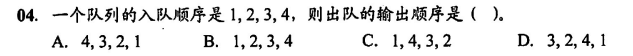

单个队列中，严格先进先出，多个队列，可以一定程度上控制队列的输出顺序

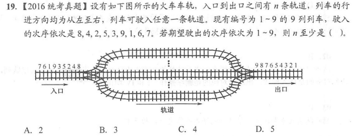

上题`[8 9]、[4 5]、[2 3]、[1]`，共四个队列可以满足顺序输出 1-9，选 C

只有对于受限的双端队列，其输出比较多样，可以出判断是否合法的题目

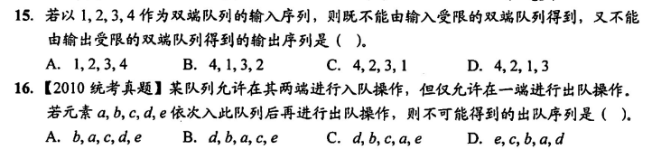

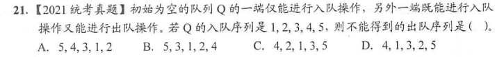

答案依次为 C C D

和栈结合考察

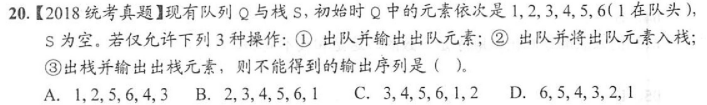

选 C

首位指针的考察

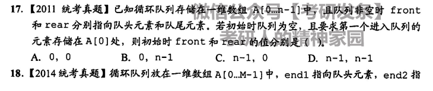


答案依次为 B A

设计队列


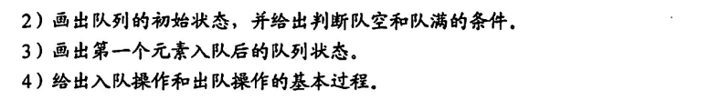

因为要动态增加，一定选择链式存储，由于队列出入队必须 O(1)，所以以循环链表储存并设置首位指针

## 栈、队列的应用

栈的常见应用：递归；进制转换；迷宫求解

队列的应用：OS 缓冲区页面置换（FIFO）

### 中缀到后缀表达式的转换

手工上，按照从左往右顺序，依次填入数值，**按照运算顺序，依次填入算符**，实际上是一个压栈出栈的过程（数栈和符栈）

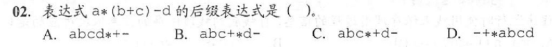

可以这么看

- `(b+c)`是一个整体`bc+`，`a`和`d`各是一个整体
- `a`先和`bc+`通过`*`复合得`abc+*`
- `abc+*`又是一个整体，和`d`由`-`复合得`abc+d-`

故选 B

在**利用栈模拟**转换过程时，总体上保持从左往右的顺序入栈，出栈时，数栈**随符号栈的弹出**而弹出（一次弹出俩）

符号的出入栈，和栈顶元素比较

- 若优先级高则入栈
- 小于等于则直接运算
- 括号单独处理，当碰到收括号`)`，依次弹出符号直到弹出`(`


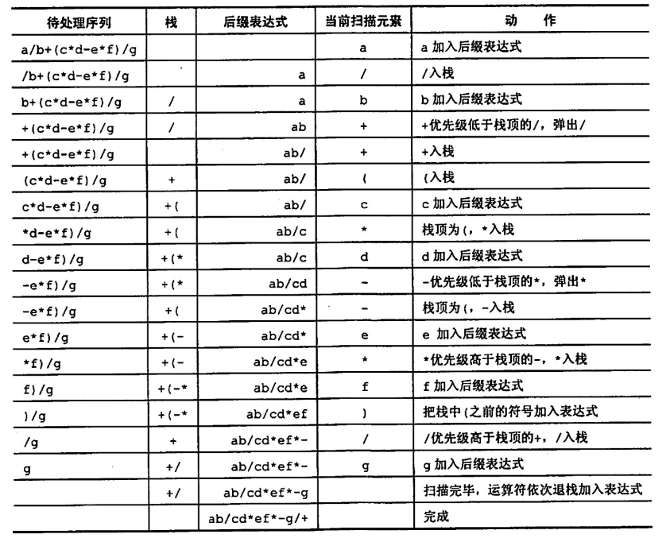

上题选 B，栗子二自己推推，选 A


### 递归算法到迭代算法

**迭代算法通常效率高于递归算法**，因为递归时常有一些重复的操作

递归转迭代的栗子，递归是从高层往简单递归，迭代是从最基本向高层迭代


```c
double p(int n, double x){
    struct stack{
        int no;
        double val;
    }s[maxsize];
    int top = -1;
    double v1 = 1, v2 = 2*x;
    for(int i = n; i >= 2; i--){
        top++;
        s[top].no = i; // 记录各个p的下标n，越上层越小，顶层为2，0和1已经单独初始化了
    }
    while(top >= 0){
        s[top].val = 2*x*v2 - 2*(s[top].no-1)*v1; // 按迭代公式求解第3、4...个p的值
        v1 = v2; // 更新v1为v2，v2为v1的下一层
        v2 = s[top].val; // 更新v2为当前层
        top--; // 迭代
    }
    if(n == 0){ // 若n=0，只有一层，v2都不存在
        return v1;
    }
    // 正常情况下，返回最新的迭代结果
    return v2;
}
```

## 数组

### 矩阵的压缩存储

> 将多维数组压缩成一维向量储存

**对称矩阵**和**三角矩阵**：存储下三角或上三角矩阵，以存下三角矩阵为例

对于元素`aij`，在下三角矩阵中，其上面有`i-1`行，共有元素
$$
1+2+3+...+(i-1) = \frac{i(i-1)}{2}
$$
所以`aij`是第 k 个元素，其中
$$
k = \frac{i(i-1)}{2} + j
$$
因为是存在一维数组中，下标从 0 开始，于是其下标 index 为
$$
index = \frac{i(i-1)}{2} + j - 1
$$
注意对于对称矩阵，由
$$
a_{ij} = a_{ji}
$$
三对角矩阵，形如


可以注意只有首尾行元素个数为 2，其余均为 3，对于`aii`，在一维向量中，为第 k 个元素
$$
k = 2+3(i-1) + 2 = 3i + 1
$$
在一维数组中，下标为
$$
index = 3i
$$
稀疏矩阵：三元组和**十字链表**

三元组示例（就是一个一维结构体数组）

| i    | j    | value |
| ---- | ---- | ----- |
| 0    | 0    | 4     |
| 1    | 2    | 6     |
| 2    | 1    | 9     |

## 串

串的三种存储方式

数组

```c
typedef struct{
	char ch[maxsize];
    int length
}string;
```

堆分配

```c
typedef struct{
	char *ch;
    int length;
}string;
```

块链

```c
typedef struct{
	char data[4];
	block* next;
}block;

typedef struct{
    block* head;
}string;
```

### PM 表

> partial match table

表示一个字符串的**子串**公共前后缀的最大长度

- 前缀：指去除尾部元素的任意连续字串
- 后缀：指去除头部元素的任意连续字串

举个栗子，对于串`aaab`，PM 表求解如下

- 第一个子串`a`，无前后缀，`pm = 0`
- 第二个子串`aa`，前缀`{a}`，后缀`{a}`，最长公共缀为`a`，故`pm = 1`
- 第三个子串`aaa`，前缀`{a,aa}`，后缀`{a,aa}`，最长公共缀为`aa`，故`pm = 2`
- 第四个子串`aaab`，前缀`{a,aa,aaa}`，后缀`{a,aa,aab}`，最长公共缀为`aa`，故`pm = 2`

所以`aaab`有`pm = [0,1,2,2]`

### KMP 模式匹配  - next 数组

KMP 就是根据前后缀的重复性，在失配时，合理的移动指针，用已经匹配上的子串

**pm 表右移一位即得到 next 数组**，如对于上面的栗子`aaab`，已知`pm = [0,1,2,2]`，则有`next = [-1,0,1,2]`（有时为了方便运算以及公式整洁，整体加一为`[0,1,2,3]`）

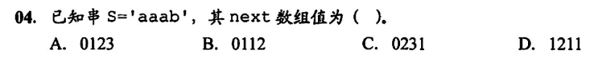

选 A


分别为 +1 后的 next 和原始的 next，两个都选 C


分别选 C B

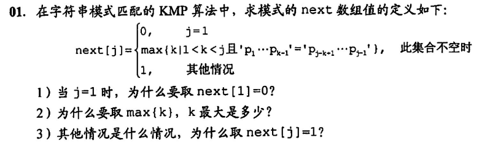

需要完全理解 next 求解过程，可惜

**这里 KMP 的下标很怪**，不管是 next 数组还是模式（子串）的起始，都默认为 1，对于字串的指针 j 来说，0 只是一个过渡阶段，根本不使用（为了在`j==0`时同时执行`j++; i++`减少代码量）

另外模式和 next 独立于主串运行，主串的指针 i 不受 next 的编号和模式的指针 j 影响

只用记住`1 <= j`，同时指向 next 和模式（子串）

### 优化 KMP - nextval 数组

当失配时，模式的指针根据 next 数组向前移动，若移动到的指针指向的字符，仍为移动前的字符，如`ch[5] = 'c'`，此时失配，移动指针`j = next[5] = 3`，结果`ch[3]`还是字符`'c'`，此时一定会再次失配

于是为了避免这种情况发生，采用 nextval 数组，对 next 数组进行优化，消除`ch[k] = ch[next[k]]`的情况，令 next 值向前递归，即令`next[k] = next[next[k]]`直到`ch[k] != ch[next[k]]`

采用图表的方式手动修改 next 为 nextval


先根据 PM 求解其 next 数组为`[0,1,1,2,3,4,2,2,3,4,5,6]`，然后根据编号列表


选 C，转化到`0,1,0,1,0`就可以确定答案了

另外提一嘴：暴力匹配时间复杂度`O(mn)`，KMP 时间复杂度`O(m+n)`，但在实际生产过程中暴力匹配其实可以近似于`O(m+n)`，于是被沿用至今

