二叉树的性质、遍历过程，树、森林的二叉化（孩子兄弟表示法），哈夫曼树的性质及应用，并查集的概念（双亲表示法）

## 树的定义

树的定义是递归的，因为你发现，树的孩子仍是一棵树，所以我们说树是一种递归的**逻辑结构**

节点的孩子个数叫做该节点的度，树的度为最大的度，**树的节点数等于树的度数加一**，叶子节点的度为 0

树的深度和高度从 1 计数

- 树的深度为从上往下
- 树的高度为从下往上

树的路径长度等于所有**路径长度的总和**（一条边长度为 1），并非最大

有序树和无序树，这里的顺序指从左往右的顺序，即左子树和右子树调换位置，若树不变，则为无序树

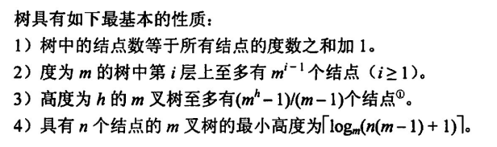

树的顺序存储和链式存储：**顺寻储存时要把最后一层全部补上空值**，即使最后一层只有一个结点元素，也要把剩下的全补全，这样树才能**不失唯一性**

对于完全 m 叉树，其顺序存储下，下标 i 的结点的第一个孩子结点的下标为
$$
j = (i-1)\times m + 2
$$
反过来，对于下标为 j 的结点，其父节点下标为
$$
i = \lfloor \frac{j-2}{m}\rfloor + 1
$$
m 叉树在顺序存储下父子结点和下标的关系映射

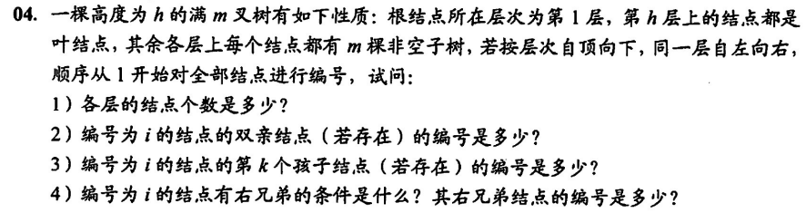

## 二叉树的高度、结点及度

> 求解二叉树的结点数，一定要牢抓度和结点的关系：`n0 = n2+2`
>
> 另外对于特殊情况，直接画出来不失为一种好的方法，或者找一种及其特殊的符合题意的二叉树，把答案看出来

树的“三多”：叶子比分支多一个；空链比结点多一个；结点比边多一个

二叉树的叶子节点（度为 0）和分支节点（度为 2）数量上一定满足
$$
n_2+1 = n_0
$$
即叶子节点个数总比分支节点多一个，这是为什么呢？因为树的度数加一为节点个数，对于二叉树，有
$$
2n_2+n_1 = n_2+n_1+n_0\rightarrow n_2+1=n_0
$$
二叉树的空链数一定等于结点数加一，证明如下：由上已知`n2 = n0-1`，则结点数 n 为
$$
n = n_2+n_1+n_0 = n_1 + 2n_0 - 1
$$
空连只存在于 n1 和 n0 上，故空链数 m 为
$$
m = n_1 + 2n_0
$$
故有`m = n+1`，即空链数等于结点数加一

另外，树的结点数一定比边多一个，这是一定的，树是一个简单连通无向图，所有结点间均通过一条边相连，故结点数比边数多一

特殊的二叉树

- 满二叉树：叶子节点全分布在最后一层
- 完全二叉树：顺序存储下和满二叉树保持一致，**但不一定满**，即最后一层从左往右排布不全

在转化为顺序存储后，下标为 i 的结点的左孩子下标为 2i，右孩子为 2i+1（当然前提是孩子节点存在），相应的，下标为 j 的结点，其父节点下标为
$$
i = \lfloor \frac{j}{2}\rfloor
$$
对于满二叉树（完全二叉树），第 k 层最多有
$$
2^{k-1}
$$
个元素，对于`1~k-1`层，共有
$$
2^{k-1}-1
$$
个元素，容易发现，下一层的元素数量是上层元素总和再加一（指数增长）

完全二叉树中，对于度为 1 的结点，只有两种情况，要么为 0，要么为 1（很容易想通），所以有的时候**问完全二叉树最多最少**的时候，就差这么一个度为 1 的结点

顺序存储下，找二叉树子树的最近公共祖先结点

```c
int ancestor(int i, int j){
    while(i != j){
        if(i > j){
            i /= 2;
        }else {
            j /= 2;
        }
    }
    return i;
}
```


注意 A 的说法，是父节点的左兄弟节点，不是自己的左兄弟，是正确的；D 没有交代 2i 是否存在

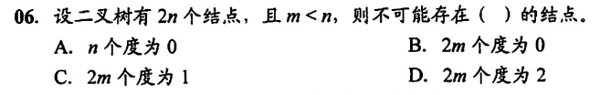

不明白捏，选 C

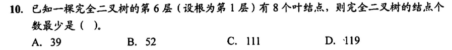

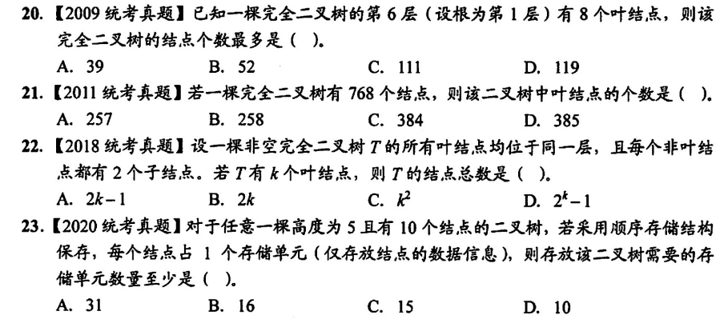

注意 10 和 21 的区别，一个最少一个最多，后者比前者多一层

树的高度和结点数的关系（合理取对数，向上/下取整）

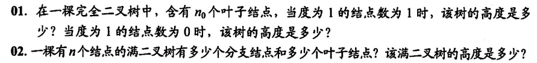

## 二叉树的遍历

### 深度优先

深度优先遍历（前序遍历），其实结点的递归顺序都一样，前序、中序、后序只是**触发`visit`的时机不同而已**

```c
void dfs(BiTNode* root){
    if(root == NULL){
        return;
    }
    // 前序遍历
    visit(root);
    dfs(root->left);
    dfs(root->right);
}
```

计算叶结点带权路径总和

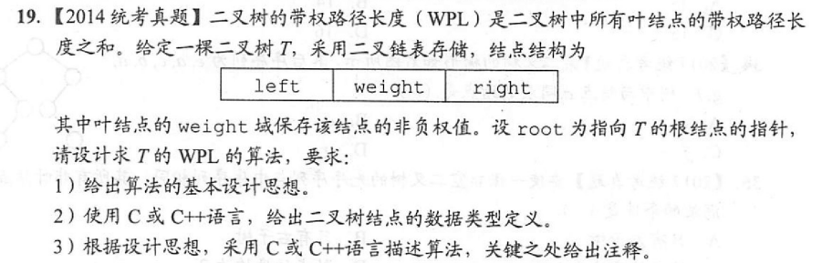

```c
typedef struct TNode{
   double weight;
    TNode *left, *right;
}TNode;

double wpl = 0;
void dfs(TNode* n, int deep){
    if(n == NULL) return;
    if(n->left == NULL && n->right == NULL){
        wpl += n->weight*deep;
    }else{
        dfs(n->left, deep+1);
        dfs(n->right, deep+1);
    }
}

double weight(TNode* root){
    dfs(root, 1);
    return wpl;
}
```

中序递归遍历实现中缀表达式转化

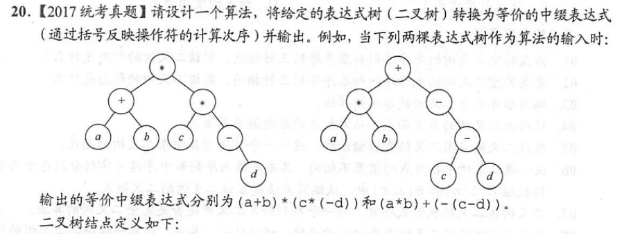

```c
typedef struct node{
    chat data[10];
    struct node *left, *right;
}BTree;
```

我的解法如下

```c
string expression = "";
void dfs(node* n){
    if(n == NULL) return;//空直接返回
    // 叶子结点直接接上表达式
    if(n->left == NULL && n->right == NULL){
        expression += n->data;
        return;
    }
    // 非叶子结点手动加上开括号
    expression += '(';
    // 递归中序遍历
    dfs(n->left);
    expression += n->data;
    dfs(n->right);
    // 子树递归完毕手动加上收括号
    expression += ')';
}

string express(node* root){
    dfs(root);
    // 去掉首尾多加的括号
    substr(expression, 1, len(expression)-1)
    return expression;
}
```

### 非递归遍历

**递归 DFS 算法到迭代算法的转换**：用栈存储访问节点，直到访问到 NULL 时开始弹栈

中序遍历

```c
void traversal(TNode* root){
    stack<TNode*> st;
    TNode* p = root;
    while(p != NULL || !st.isEmpty()){
        if(p){
            st.push(p);
            p = p->left;
        }else{
            p = st.pop();
            visit(p);
            p = p->right;
        }
    }
}
```

当为先序遍历时，在`push`前执行`visit(p)`即可，而后序遍历的非递归有点复杂

### 宽度优先

宽度优先遍历（BFS），也叫层序遍历，维护一个队列按顺序存储访问过的结点，并且按顺序扩展已访问过的结点

## 由序列构造二叉树

**由先序、中序遍历序列构造二叉树**：一个递归的过程，从先序遍历结果找到根结点，在中序序列中根据根节点位置划分左右子树，同时在先序中也找到相应左右子树位置，对子树重复这一过程，构造完整二叉树

```c
TNode* build(int* pre, int* mid, int l1, int r1, int l2, int r2){
    if(l1 > r1 || l2 > r2){
        return NULL; // 当序列遍历完了，返回空结点
    }
    TNode* root = new TNode();
    root->val = pre[l1]; // 构造根节点，一定是先序序列的第一个元素
    int k; // 在中序序列中找到根节点，左边是其左子树，右边是其右子树
    for(k = l2; k > r2; k++){
        if(mid[k] = root->val){
            break;
        }
    }
    // 先序序列向后移一位，同时根据左子树结点数向后截取 k-1 个结点
    // 中序序列根据根节点的位置划分成两半（不包含根节点）
    root->left = build(pre, mid, l1+1, l1+k, l2, l2+k-1);
    // 构造右子树
    root->right = build(pre, mid, l1+k+1, r1, l2+k+1, r2);
    return root;
}
```

同理，可以用后序遍历序列和中序遍历序列构造二叉树

- 因为后序序列从后往前构造，倒数第一个一定是当前的根节点，然后再中序序列中进行分割左右子树

还可以通过层序遍历序列和中序遍历序列构造二叉树，和上述其实是一个道理，都是通过前者确定根节点，再在中序序列中根据根节点分割左右子树递归构造

已知序列，手动构造二叉树并进行一系列判定

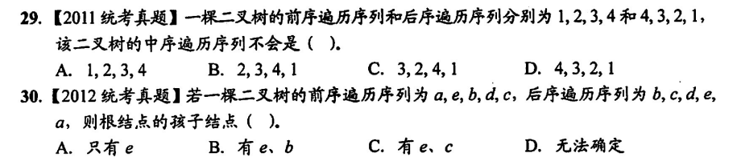

选`C、A`

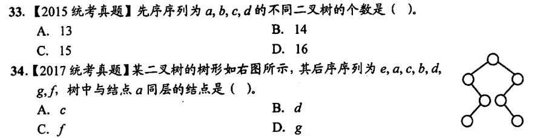

手动构造，一定不要漏情况，选`B、B`

先序等于中序，即`根-左-右`等于`左-根-右`，只有可能`左`不存在时成立，故选`B`

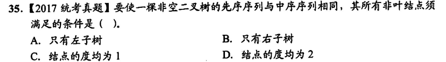

## 线索二叉树

左空链指向前驱，右空链指向后继，这里的前驱和后继都是在具体的遍历方式下才存在的，也就是说不同的遍历方式下，指向的结点肯定不尽相同

同时，为了分别到底是指的孩子还是前驱，需要设置两个标志位，若为 1 表示链为线索，指的是前驱/后继

**中序**线索二叉树的构造

```c
void inorderThread(TNode* cur, TNode* pre){
    if(cur == NULL) return;
    inorderThread(cur->left, pre);
    if(cur->left == NULL){
        cur->left = pre;
        cur->ltag = 1;
    }
    if(pre != NULL && pre->right == NULL){
        pre->right = cur;
        pre->rtag = 1;
    }
    pre = cur;
    inorderThread(cur->right, pre);
}

void buildInThread(TNode* root){
    TNode* pre = NULL;
    if(root != NULL){
        inorderThread(root, pre);
        pre->right = NULL;
        pre->rtag = 1;
    }
}
```

中序线索二叉树的遍历，好难呜呜呜

```c
TNode* firstNode(TNode* p){
    while(p->ltag == 0){
        p = p->left;
    }
    // 返回根 p 的左下方结点
    return p;
}

TNode* nextNode(TNode* p){
    if(p->rtag == 1){
        return p->right;
    }
    return firstNode(p->right);
}

void inorder(TNode* root){
    for(TNode* p = firstNode(root); p != NULL; p = nextNode(p)){
        visit(p);
    }
}
```

判定后序线索二叉树

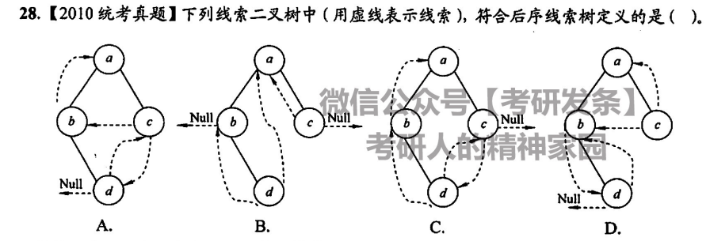

选 D

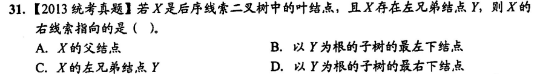

选 A，后序右结点线索指向其父节点（左-右-根）

其实可以通过写出中序序列，判断结点的前驱和后继

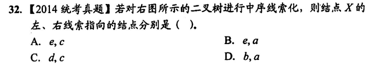

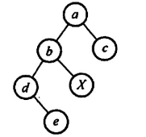

显然其中序序列为`debXac`，故前驱为`b`后继为`a`，选 D

## 树、森林和二叉树

### 树和森林的表示和转化

把树的根节点去掉，则变成了森林（多颗独立的树）

树的三种表示法

双亲表示法：一个**结点数组**，每个结点有一个`next`指针指向自己的父节点所对应的数组下标

存储结构如下

```c
typedef struct{
    int data;
    int parent;
}PTnode;

typedef struct{
    PTnode nodes[maxsize];
	int length; // 实际结点数
}PTree;
```

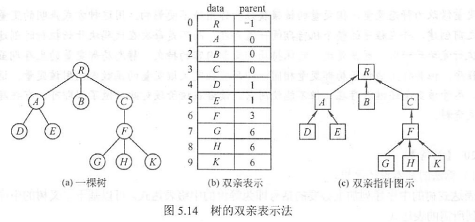

孩子表示法：一个**单链表数组**，数组中每个下标上的元素都是一个链表的头节点，其实是一个子树的根结点，该根节点的链表存储了他的所有孩子节点

在这种存储方式下，要找一个节点 a 的父节点，必须遍历所有结点链表，即找哪个结点的孩子里包含 a

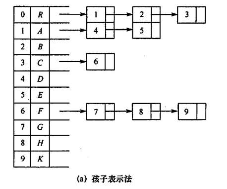

孩子兄弟表示法：又叫二叉树表示法，二叉树的`left`结点指向其孩子结点链表的头部，`right`结点指向其兄弟结点链表的头部

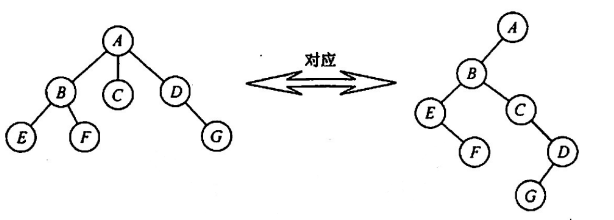

树转化为二叉树：就是把树用孩子兄弟表示法表示，见上图

森林转化为二叉树：在孩子兄弟表示法里，一颗树的最终根节点一定是没有右子树的（因为右链存兄弟，一棵树只有一个公共祖先，没有兄弟），于是在兄弟孩子表示法的基础上，把多棵树的根结点依次链在上一个根的右链上

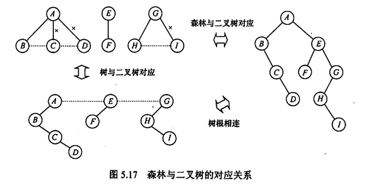

### 树和森林的遍历

嗯。。就是遍历一颗二叉树，因为树和森林都可以被兄弟孩子表示法表示，只是和普通的二叉树遍历蕴含的内在含义不一样

后根遍历：先访问孩子，后访问根

- 从意义上：先访问左子树（左子树为孩子链表），再访问当前根和右子树（右子树存的是根的兄弟，仍为“根”），所以叫先访问孩子后访问根
- 从结构上，就是先访问左子树，后访问根，最后访问右子树

先根遍历：先访问根，后访问孩子

- 从意义上，其实是先访问当前根，再访问当前子树（即孩子），最后访问兄弟
- 在结构上，就是先访问根，后访问左子树，最后访问右子树

分别对应了二叉树的中序遍历和先序遍历

而森林的访问和二叉树如出一辙

- 先序遍历森林：先访问根，再访问第一颗树的子树，最后访问剩下的树及其子树
- 中序遍历森林：先访问子树，后访问第一颗树的根，再按这一顺序访问剩下的树

三者对应关系如下

| 二叉树   | 树       | 森林     |
| -------- | -------- | -------- |
| 中序遍历 | 后根遍历 | 中序遍历 |
| 先序遍历 | 先根遍历 | 先序遍历 |

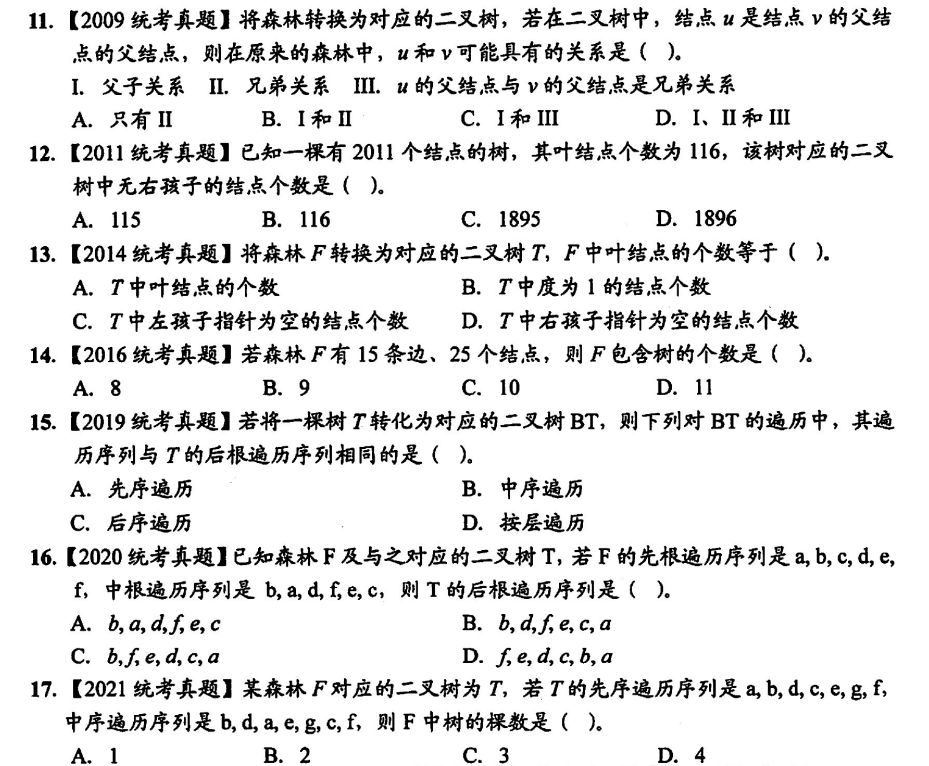

## 树和二叉树的应用

### 哈夫曼树

哈夫曼树，又叫最优二叉树，在定义上，为在给定结点权值的前提下，构造的带权路径长度最小的二叉树，可用于解决

- WPL 最小化问题
- 前缀编码问题

带权路径长度：对于结点而言，其带权路径长度为`所在深度 x 结点值`；对于树而言其带权路径长度为`叶节点的带权路径长度之和`
$$
WPL = \sum_{i=1}^n w_i\times deep_i
$$
其中 i 代表叶子节点

如

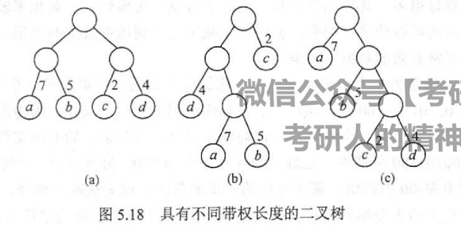

的 WPL 分别为 36、46、35

构造哈夫曼树：每次选取权值最小的两颗子树合并，合并成一颗权值为和的更大的子树，继续下一轮合并，直到只有一颗树为止

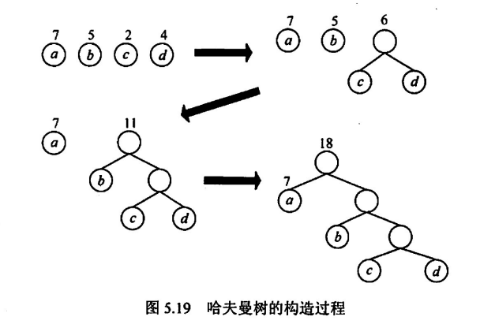

哈夫曼树有以下特点

1. 只存在度为 2 或 0 的结点
2. 叶子节点比非叶子结点多一个（因为`1`，根据树度和结点的性质`n0+n2 = 2n2+1` => `n0 = n2+1`）

### 哈夫曼编码

哈夫曼编码，编码，就是对一个字符采用二进制来表示，如用`10`来表示字母 a，这就是一种编码，哈夫曼编码要求在所有的编码中，任意编码不能以另一完整的编码作为前缀，即必须消除前缀编码

这在哈夫曼树中是非常自然地可以实现的，如想左扩展的边记为 1，向右的边记为 0，则一颗哈夫曼树所有子节点对应的边的序列，就组成了一组哈夫曼编码

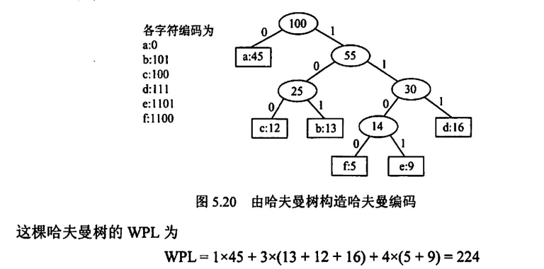

在实际编码过程中，我们以字符的出现次数作为权值，自底向上构造哈夫曼树

要注意的是，同一组结点构造的哈夫曼树可以不相同，如左右结点倒置或相同权重子树先后合并顺序不同，但可以确定的是，其 WPL 一定是最小且唯一的

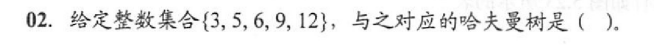

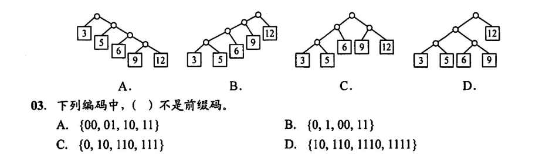

每次选取最小权值结点自底向上构造即可，选 B；在判断前缀码时，只需要考察有无编码是另一编码的任意前缀，如此处 B 选项编码`0`是编码`00`的前缀，故不是前缀码

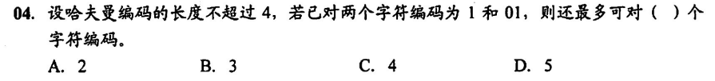

在用哈夫曼树构造哈夫曼编码时，一般都是用掉当前层的左孩子，右孩子舍去用于当下一轮编码的前缀，这样就可以向下**无限扩展**哈夫曼编码，但在层数一定，要求编码数量最多的情况下，可以**自断手脚**，用掉右孩子作为一个编码返回，故此处 4 层最多可以有 6 种编码，选 C

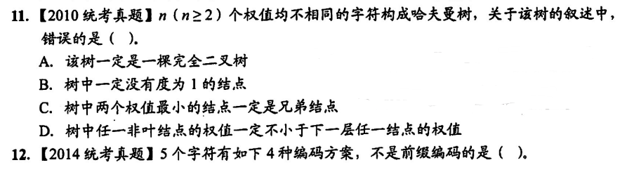

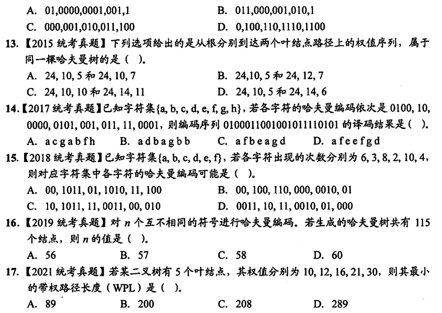

答案依次为`A、D、D、D、A、C、B`

### 并查集

树、森林的双亲表示法：即用一个数组存取结点，结点的名称为其数组下标，数组所存的值为其父节点的下标，树根无父节点，值记为 -1

两种基本操作

- 查找：查找结点的根
- 合并：合并子树

下图展示了一个简单的森林的并查集（S1、S2、S3）

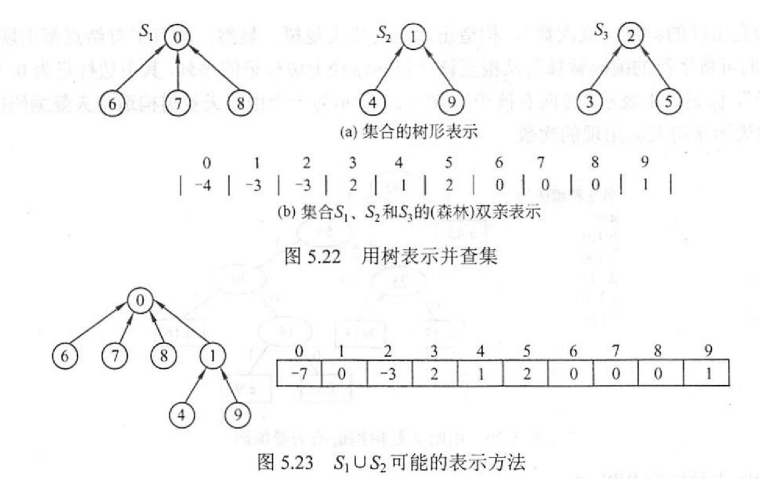

在合并时，所执行的代码类似于

```c
void union(int S[], int root1. int root2){
    // 当两个子树独立时（不属于同一根结点）
    if(find(S, root1) != find(S, root2)){
        // 将子树 2 嫁接在根 1 上，化为 root1 的孩子节点
        S[root2] = root1;
    }
}
```

可以发现，只要不在同一颗树，子树合并的位置其实可以是任意的，不一定会合并到根部

`find`函数实现：逐步回溯找到自己的祖宗（这个函数在最坏情况复杂度为`O(n)`）

```c
int find(int S[], int x){
    while(S[x] > 0){
        x = S[x];
    }
    return x;
}
```
