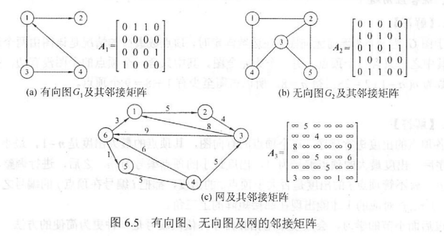
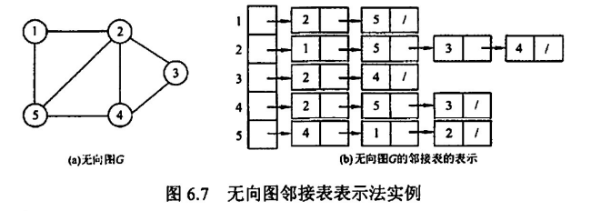
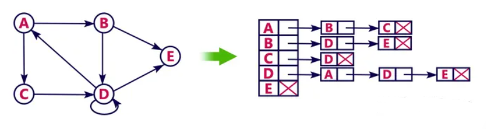
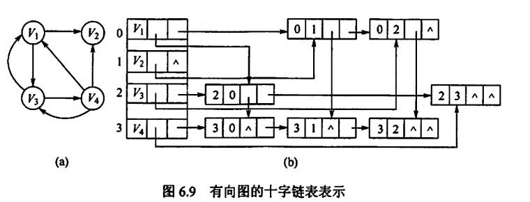
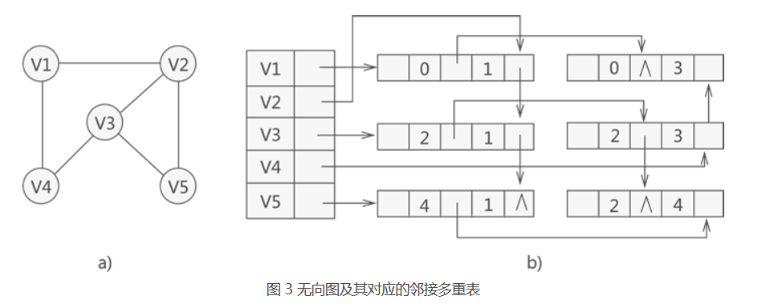
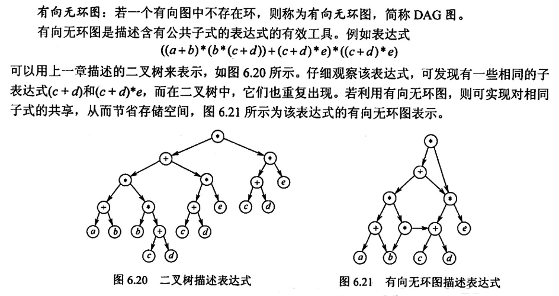
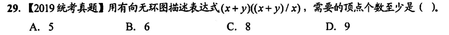
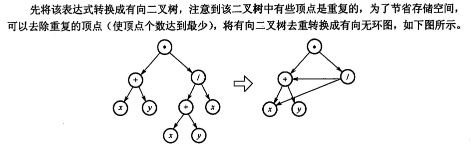

## 图的基本概念

图、子图、简单图、完全图、生成子图

- 无向图：连通性，连通图，连通分量（极大连通子图）
- 有向图：强连通性，强连通图，强连通分量

生成树：极小连通子图

带权图、稀疏图和稠密图

边

- 路径，简单路径（无重复），路径长度，距离
- 回路，简单回路
- 度：出度和入度，数值上等于`2 x 边数`，有向图的总出度等于总入度

注意完全图和连通图的区别，还是很大滴

连通子图

- 生成树 <=> 极小连通子图
- 连通分量 <=> 极大连通子图

## 图的存储结构

### 邻接矩阵

用一个二维数组表示图的存储，有向图和无向图都可以存，如



其数据结构定义为

```c
typedef struct{
    chat vex[n]; // 顶点表
    int edge[n][n]; // 邻接矩阵，边表
    int vexnum, arcnum; // 顶点数和弧数
}MGraph;
```

DFS / BFS 遍历的时间复杂度：O(n^2)（n为结点数）

### 邻接表

类似树的孩子表示法：既可以存无向图，又可以存有向图

- 森林转换：树的孩子兄弟表示法
- 并查集：树的双亲表示法
- 邻接表：树的孩子表示法

无向图的邻接表表示



有向图的邻接表表示



DFS / BFS 遍历的时间复杂度：O(n+e)（其中n为结点数，e为边数）

### 十字链表与邻接多重表

二者的设计思路相似，都是对一个弧结点设置两个结点表示，两个出入度，这样弧可以同时存在于多个头节点的链表中，有效减少弧的表示，重复利用

- 十字链表：用于存储有向图
- 邻接多重表：用于存储无向图

十字链表：每个头结点对应两个链表，一个表示入度，一个表示出度，边表中，每个结点同样有两条链，一条表示从 head 到 tail，一条表示从 tail 到 head



邻接多重表：思路和十字链表类似，只是不区分出度和入度，弧的表示是双向的，同时头节点自然只用维护一个链表（因为弧是双向的）



## 图的遍历

### BFS

和树的 BFS 基本相同（树是图的子集，极小连通子图嘛），这里为了避免重复访问结点，需要维护一个 visited 数组标识结点是否被访问

单源最短路径问题，贪心算法

广度优先的生成树，选定结点为根，距离结点距离相同位于树的同一层，依次向下扩展

### DFS

深度优先的生成树和生成森林

### 连通性

一次 BFS/DFS 将 visited 数组塞满，即可证明图是连通的

## 图的应用

### 最小生成树

> 找到权值最小的生成树
>

普利姆算法：从**结点考虑**，每次选择和树连接的边权值最小的一个结点扩展，直到结点被遍历

库鲁斯卡尔算法：从**边考虑**，每次连接边权值最小的两个结点，直到连通

### 最短路径

迪杰斯特拉算法：求解单源最短路径（当然可以用 BFS 求解），每次选择和树连接的边权值最小的一个结点扩展（这句话和普利姆算法一模一样），然后更新距离所有结点的路径（在普利姆中只考虑距离树的路径，这里要考虑的是距离出发结点的路径）

弗罗伊德算法：求解每对结点的最短路径，维护一个邻接矩阵，每次加入一个结点，并且更新这个矩阵，更新的算法如下，假设加入结点 k，那么对于所有结点的路径长度更新为
$$
min\{<v_i,v_j>,\,<v_i,v_k>+<v_k,v_j>\}
$$
将所有结点都插入并更新后，就可以得到每对结点间的最短路径，时间复杂度显然为 O(n^2)

### 有向无环图描述表达式

DAG 图





选 A



他甚至省去了重复的一个 + 号，太变态了

### 拓扑排序

AOV 网中，每个结点表示一个活动，AOV 网的拓扑排序，即对各节点进行一维的排序，要求：后面的结点必须在前面的结点活动完成后，才可以进行

给定一个非常朴素的算法用以求解拓扑排序：

1. 找到图中入度为 0 的结点，把他从图中删去，包括所有相关联的边
2. 重复 1，直到所有结点被删除

注意很有可能同时出现多个入度为 0 的结点，此时随便选一个都是可以的，所有拓扑排序并不是唯一的，并且，对于每一个图的 DFS 序列，其实就是一个拓扑排序

当将删去的结点存在栈中，最后统一出栈访问，这样得到的序列便是逆拓扑序列，对应到 DFS，把访问语句写在递归语句之后，也可以实现逆拓扑排序

### 关键路径

AOE 网中，每个边表示一个活动，只有当边的头结点活动开始后，这条边的活动才能开始

求解关键路径

1. 首先根据边的权值，写出每个结点的最早开始时间，初始结点最早开始时间 0
2. 从最后一个结点开始，令其最晚开始时间等于其最早开始时间，向前一步步减去边的权值，得到前一个结点的最晚开始时间
3. 当相邻结点，后继的最早开始时间减去前驱的最晚开始时间，等于连接二者边的权值，那么，这条边就在关键路径之上

需要注意的是，单独的减少关键活动的时间，不一定会减少时间的总耗时，因为可能有多条关键路径限制，在他减少之后，就不在关键路径上了

但增加关键活动的时间，一定会增长时间的总耗时