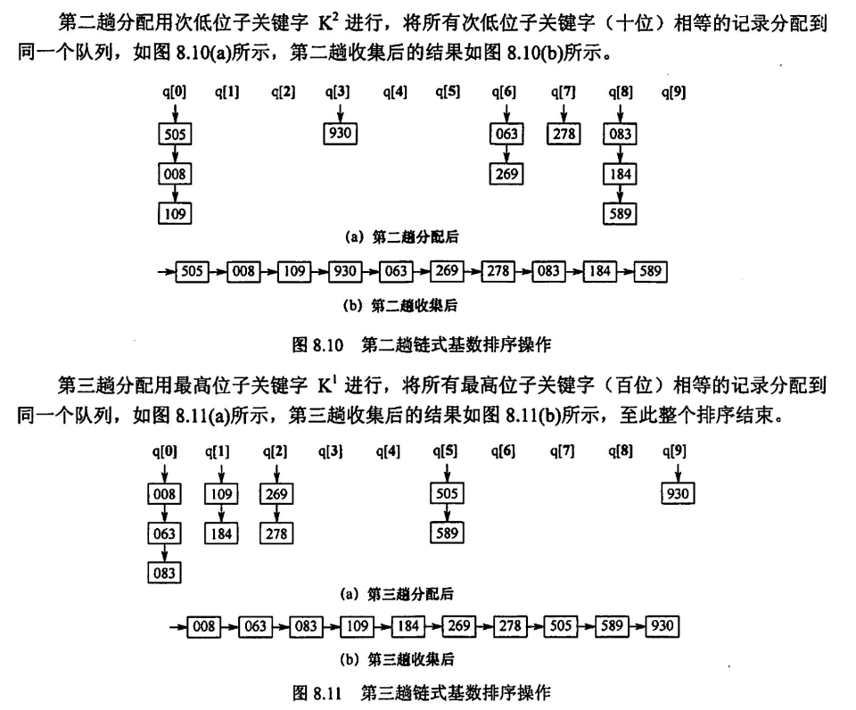

[排序算法 | Northboat Docs](https://northboat.netlify.app/dev/algo/design/sort.html)

## 插入排序

### 直接插入

在数组左侧维护一个有序数组，初始长度为 1（一定有序），每次将右侧无序数组的首位元素插入左侧有序数组，采用遍历左侧有序数组的方式找到插入点

当数组本身有序时，效率极高，最小时间复杂度可以为 O(n)（其实已经有序，每次寻找插入位置和末尾比较均成功），最大时间复杂度为 O(n^2)，一个个从前往后遍历插入，是稳定的

### 折半插入

就是每次寻找元素在左侧有序数组中的插入位置时，采用二分查找（因为有序且顺序储存），这样可以有效减少元素的比较次数，但移动的次数仍然不发生改变（只是查的快了一点），于是时间复杂度仍然最小为 O(n)，最大为 O(n^2)

### 希尔排序

> 常考

考虑到插入排序的特点：原序列越有序，排的越快（当基本有序时接近 O(n)）

我们将原序列**按照间隔**分为一个个子序列，并在一个个子序列中排好序（采用插入排序），进一步的缩小间隔，直到为 1，此时整个序列排序成功（有点像一个渐进的插排，间隔越大，元素越少，所需时间越少）


代码实现

```c
void shellSort(int A[], int n){ // n为数组长度
    for(int gap = n/2; gap >= 1; gap /= 2) // 初始令间隔为 n/2，每次间隔缩小两倍
        for(int i = gap+1; i < n; i++) // 排序每一组子序列，不太清楚怎么实现的
            if(A[i] < A[i-gap]){
                A[0] = A[i];
                for(int j = i-gap; j > 0 && A[0] < A[j]; j -= gap)
                    A[j+gap] = A[j];
                A[j+gap] = A[0];
            }
}
```

平均时间复杂度约为 O(n^1.3)，**并不稳定**（在间隔分组并排序时，极有可能将相同的靠后元素放在他的子序列的前方，排在原靠前元素的前面）

## 交换排序

### 冒泡排序

以当前序列首位元素为基，向后依次比较，若较大，则交换当前两个元素，更新基，并继续向后比较并更新，这样能保证每一轮都将最小的元素放置在当前序列的首位

简单来讲，就是左侧有序，每次通过比较有序序列末尾下一个元素和无序序列每一个元素，将最小的元素换到末尾来，追加到有序序列之后，实现排序

最小时间复杂度可以为 O(n)（和插入排序类似，当有序时，本轮比较将不交换元素，flag 为 false，此时可以判定序列有序直接退出排序，排序成功），平均复杂度为 O(n^2)，一个个从前往后比较，是稳定的

### 快速排序

> 常考

基于分治思想

王道给的代码实现，这里第一是一个基准的选择（选择的首位），第二个是调整的顺序（这个很重要，涉及每一趟的变化结果）

```c
int partition(int arr[], int low, int high){
    int pivot = arr[low]; // 设置基准
    while(low < high){
        //找到左侧第一个大于基准的元素，放在右侧
        while(low < high && arr[high] >= pivot){
            high--;
        }
        arr[low] = arr[high];
        //找到右侧第一个小于基准的元素，放在左侧
        while(low < high && arr[low] <= pivot){
            low++;
        }
        arr[high] = arr[low];
    }
    // 此时low已经指向基准可以插入的位置
    arr[low] = pivot;
    return low;
}


void quickSort(int arr[], int left, int right){
    if(low < high){
        int mid = partition(arr, low, high);
        // 递归排序左右子序列
        quickSort(arr, low, mid-1);
        quickSort(arr, mid+1, high);
    }
}
```

需要注意，一趟的概念是指排序依次所有序列中的元素，而非一个其中一个子序列


采用快排的思想实现，区别在于这里并不需要排序左右两个子序列，而只需要递归排序第 n/2 元素在的序列，因为所求的两个序列需要二分（左侧均小于中间值，右侧均大于中间值），分出一边来就行，已经确定大的（或小的）不用继续分了

最小时间复杂度为 O(nlog2)，最坏情况为 O(n^2)，实际应用中接近前者，并不稳定（因为基准的选取非常随意，很有可能将相同的靠前元素放在后面）

## 选择排序

### 简单选择排序

总觉得和冒泡是一个东西，冒泡是一边比较，一边更新，选择就是先比较完，然后更新一次（理论上好像可以少修改一点？但实际上也修改了 min 常量的值，所以还是一个东西）

简单来说，就是左侧有序，不断将右侧的最小元素追加到左侧序列之后，实现排序

时间复杂度为 O(n^2)，没什么说的，不管序列怎么样，他都要一个个向后遍历到最小的元素并且移动到序列首部，并且并不稳定（举个栗子）
$$
22'1 \Rightarrow 12'2
$$
第一轮中，因为 1 是最小元素，将和首位置换，于是 2 就到了 2' 的后面

### 堆排序

> 常考

维护一个小根堆/大根堆（一个顺序存储的完全二叉树），他满足根的值一定大于两个孩子，这作用于每颗子树，在完全二叉树的顺序存储中，这等价于
$$
a[i] > max\{\,a[2i], a[2i+1]\,\}
$$
其中 i 为根在顺序存储中的下标


通过每次将堆顶元素（最大值）弹出到数组末尾，将堆的长度 -1，再调整当前堆，直到堆长度为 0，排序成功

构造堆的策略如下：从层序遍历的末尾的最小子树开始调整，注意每颗子树的调整都要调整到叶子结点，即如果交换孩子和根的值，孩子仍有孩子，需要向下继续调整直到叶结点


在图8.6中，在8.5的大根堆的基础上，弹出了堆顶元素87，将层序遍历的末尾元素9顶到根的位置，进行一次调整

代码实现大根堆

```c
void heapAdjust(int A[], int k, int len){
    A[0] = A[k]; //保存当前根的值
    for(int i = 2*k; i <= len; i*2){ // 遍历子树
        if(i < len && A[i] < A[i+1]){
            i++; // 找到更大的孩子
        }
        // 当根大于最大的孩子，符合堆性质，完成调整
        if(A[0] >= A[i])	break;
        // 否则交换根和孩子，并且把新调整的孩子作为根向下继续调整子树
        else{
            A[k] = A[i];
            k = i;
        }
    }
}

// 初始化大根堆
void buildMaxHeap(int A[], int len){
    for(int i = len/2; i > 0; i--){
        // 从最末尾的子树开始调整
        // 调整每一颗子树，得到堆
        heapAdjust(A, i, len);
    }
}
```

一次调整的时间复杂度为 O(h)（和树高有关 h = logn），需要调整 n/2 个子树，书上说构建堆的时间复杂度为 O(n)（为什么不是 O(nlogn)）

大根堆实现从小到大排序的代码

```c
void HeapSort(int A[], int len){
    buildMaxHeap(A, len); // 初始化大根堆，O(n)
    for(int i = len; i > 1; i--){
        swap(A[i], A[1]); // 将最大元素放在序列末尾，将堆末尾元素作为新根
        heapAdjust(A, 1, i-1); // 调整序列前段的堆
    }
}
```

排序的时间复杂度显然为 O(nlogn)，需要调整 n 次，每次调整为 O(logn)（树高嘛），二者相乘得排序的时间复杂度

显然堆排序是不稳定的，很容易将后面的相同元素调整到根的顶部（因为每次交换末尾元素和根），从而令原来的靠后元素移动到前列

## 归并排序和基数排序

### 归并排序

分治思想（Fork/Join），从长度为 1 的序列开始排序（长度为 1 一定有序），进而两两合并长度为 1 的序列，得到长度为 2 的有序序列，再两两合并长度为 2 的有序序列，得到长度为 4 的有序序列......

合并两个有序序列的代码和合并两个有序链表的代码基本一样

```c
int *B = (int*) malloc((n+1)*sizeof(int)); // 辅助数组 B
void merge(int A[], int low, int mid, int high){
    for(int k = low; k <= high; k++){
        B[k] = A[k] // 将元素依次填入 B
    }
    for(int i = low, j = mid+1, k = i; i < mid && j <= high; k++){
        // 选取两段序列小的一个，追加到 A 数组的尾部
        if(B[i] <= B[j]){
            A[k] = B[i++];
        } else {
            A[k] = B[j++];
        }
    }
    // 添加剩余的有序序列元素
    while(i <= mid){ A[k++] = B[i++]; }
    while(j <= high){ A[k++] = B[j++]; }
}
```

递归实现归并排序

```c
void mergeSort(int A[], int low, int high){
    if(low < high){
        int mid = (low+high) / 2;
        mergeSort(A, low, mid);
        mergeSort(A, mid+1, high);
        Merge(A, low, mid, high);
    }
}
```

空间复杂度 O(n)，时间复杂度 O(nlogn)，稳定，并不会改变相同关键字的相对位置

### 基数排序

对于整数，先根据个位排序，再根据十位排序，再根据百位排序......

如对于任意正整数，需要用到 10 个队列，分别用于储存各位上 0-9 的排序序列，如下图中的`q0, q1, ..., q9`，这个空间视为 O(r)，r 为常数




时间复杂度为 O(d*(n+r))，d 为整数位数，n 为整数个数，r 为所需的队列数，为什么是这样捏，每一趟分配需要遍历 n 个整数，一趟收集（即将所有分配好的元素从链表中取出成为一个新的序列）需要遍历 r 个链表，一共需要 d 趟完成排序，于是就成为了
$$
O(d\times(n+r))
$$
空间复杂度为维护的 r 个队列，为 O(r)

基数排序一定是稳定的，按位排序时一定是根据先后次序将元素尾插进相应链表（相同的元素一定会按先后次序进入链表，在收集时按原顺序出队），这是基数排序的基石

## 内部排序的时间复杂度比较


一些简单分类

- 追求稳定性：直接插入、冒泡、归并排序、基数排序
- 追求时间高效：快速排序、堆排序、归并排序
- 追求空间高效：堆排序 > 快速排序 > 归并排序
- 对于整数分位：基数排序
- 对于大文件：归并排序（外部排序）
- 选择排序狗都不用

另外提供一种很特殊的排序，对于有限序列可以稳定达到空间 O(1)，时间 O(n)

```c
int count[65535];
void countSort(int A[], int len){
    // 初始化 count 数组，记录元素 i 的个数均为 0
    for(int i = 0; i < 65535; i++){
        count[i] = 0;
    }
    for(int i = 0; i < len; i++){
        // 统计元素 A[i] 的个数，碰到则 +1
        count[A[i]]++;
    }
    int k = 0;
    // 遍历 0-65535 所有元素值
    for(int i = 0; i < 65535; i++){
        // 当 i 出现在 count 中，即统计数大于 0，加入排序后的数组
        // 为什么有序？我他妈从 0 往上遍历，肯定有序啊
        while(count[i] > 0){
            A[k++] = i;
        }
    }
}
```

## 外部排序

### 多路归并

就是一个归并排序捏，对于大文件而言，分成一个个长度为`1,2,4,...,2^n`的子序列调入内存一步步合并再写入磁盘（二路归并）

外部排序的主要时间限制在磁盘 I/O，所以要尽可能减少合并的次数，于是采用更多路的归并，但也不是越多越好，当归并路数越多，排序所耗时间增多，恐升为效率主要限制因素


当初始归并段为 8 时，采用 4 路平衡归并，则归并趟数为
$$
S = \lceil log_kr\rceil=\lceil log_48\rceil = 2
$$
其中 r 为初始归并段数，k 为平衡归并路数

初始归并段数，采用最朴素的分割，若总共有 375000 个记录，内存工作区容量为 600，则初始归并段数
$$
n = 375000 / 600 = 625
$$
若做 5 路归并，则趟数 S 为
$$
S = \lceil log_kr\rceil = \lceil log_5625\rceil = 4
$$

### 多路平衡归并与败者树

首先要明确多路归并的过程，有初始归并段 r，采用 k 路归并，则每一个归并有

1. k 个待合并的子序列，每个子序列每轮贡献一个最小元素（内部排序过了，就是头元素）进入排序数组
2. 排序数组中，对这 k 个子序列提供的 k 个元素进行选择排序，选出最小的元素，追加到归并数组
3. 同时被选中的元素所在序列新弹出一个元素加入排序数组，使排序数组长度不变（仍然为 k），重复步骤 2 直到所有子序列均没有元素弹出，排序完成

当做多路归并时，我们先假设每次归并内部均采用选择排序：总记录数为 n，采用 k 路归并，初始归并段数为 r

- 则排序数组长度为 k，每次选择排序从 k 个中选取最小值，需要比较 n-1 次，弹出最小值后从子序列出队首元素补入排序数组
- 每一趟归并需要将所有 n 个元素进行这样的选择排序（不断选取最小值），所以每趟排序需要比较 (n-1)(k-1) 次，且已知总比较趟数 S 为

$$
S = \lceil log_kr\rceil
$$

所以总比较次数为

$$
S\times 每趟比较结点数\times 每个结点比较次数 = \lceil log_kr\rceil(n-1)(k-1) = \frac{\lceil log_2r\rceil(n-1)(k-1)}{\lceil log_2k\rceil}
$$

可以发现，k 既在分子，又在分母，不能单单通过增大归并路数来减少总比较次数（提高算法效率）

于是引入败者树（有点像小根堆排序）：记录均为叶结点，中间结点储存败者的下标，胜者升至爷结点进行下一轮比较直到所有元素比较完


这种方法将每次排序数组排序的比较次数降为

$$
\lceil log_2k\rceil
$$

此时总比较次数降为

$$
S\times 每趟比较结点数\times 每个结点比较次数 = \frac{\lceil log_2r\rceil(n-1)\lceil log_2k\rceil}{\lceil log_2k\rceil} = \lceil log_2r\rceil(n-1)
$$

与 k 无关，只要一味增大 k 路数，即可减少磁盘 I/O 次数

### 置换 - 选择排序

固定工作区的长度

1. 当工作区满后，取最小值为 MiniMax，并弹出，同时输入文件区出队一个元素进工作区
2. 每次选取最小的大于 MiniMax 的元素弹出工作区
3. 当工作区所有元素均小于 MiniMax，重新确立 MiniMax 为当前工作区最小值，重复步骤 2 直到输入文件为空

举个栗子


### 最佳归并树

参考哈夫曼树的构造过程，使多叉树的 WPL（带权路径长度）最小

- 带权路径长度：所有`叶结点的权值 x 深度-1`的总和

不同之处在于这里要构造虚 0 结点，即用 0 结点填充末尾的多叉树，使得更大的结点更靠近根部，虚结点的个数为

$$
u = m - [(n-1) \% (m-1)] - 1
$$

注意虚结点一定填充在最下一层
