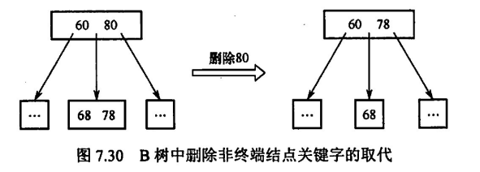

主要是一个计算 ASL（平均查找长度）的问题
$$
ASL = \sum_{i=1}^n P_iC_i
$$
P 为查找第 i 个元素成功的概率，C 为查找到第 i 个元素成功所需的比较次数

## 顺序查找和折半查找

### 顺序查找

顺序查找，就是最蠢的遍历

```c
int search(int arr[], int length, int target){
    arr[0] = target; // 所谓哨兵，arr[0]的元素本来就是没用的
    for(int i = length-1; arr[i] != target; i--);
    return i;
}
```

上述代码，失败时，其 ASL 为
$$
ASL_{失败} = n+1
$$
成功时，设查找到每个元素成功的概率相等，即为 1/n，则 ASL 为
$$
ASL_{成功} = P_i\sum_{i=1}^nC_i = \frac{1}{n}(1+2+...+n) = \frac{n(n+1)}{n\times2} = \frac{n+1}{2}
$$
当然，对于有序表，可以稍微聪明点，直到连范围都不满足了，直接退出查找失败

```c
// 假设arr升序排列，当target已经小于arr[i]了，已经没有遍历的必要，因为后面的只会比arr[i]大，不可能再等于target
int search(int arr[], int length, int target){
    for(int i = 0; i < length; i++){
        if(arr[i] != target && arr[i] > target){
            return -1;
        }
        if(arr[i] == target){
            break;
        }
    }
    return i;
}
```

这种情况下，**查找成功的平均查找长度是一样的**
$$
ASL_{成功} = \frac{n+1}{2}
$$
但不成功时，会提前退出，显然是会好一点，但不多
$$
ASL_{失败} = Q_i\sum_{i=1}^nC_i = \frac{1}{n+1}(1+2+...+n+n) = \frac{1}{n+1}(\frac{n(n+1)}{2}+n) = \frac{n}{2}+\frac{n}{n+1}
$$

### 折半查找

就是二分搜索，这个吊几把边界条件烦死我了，显然，这只能作用于有序表，且顺序储存（因为要随机访问）

递归写法

```c
int binary_search(int arr[], int l, int r, int target){
    if(l > r){
        return -1; // 查找失败
    }
    int mid = (r-l)/2 + l;
    if(mid < target){
        return binary_search(arr, mid+1, r, target);
    }else if(mid > target){
        return binary_search(arr, l, mid-1, target);
    }
    return mid;
}
```

迭代写法

```c
int binary_search(int arr[], int target){
    int l = 0, r = len(arr)-1;
    while(l <= r){
        int mid = (r-l)/2 + l;
    	if(mid < target){
        	l = mid+1;
    	}else if(mid > target){
        	r = mid-1;
    	}else{
            return mid;
        }
    }
    return -1;
}
```

在折半查找过程，实际上在逻辑上构造了一颗平衡二叉树，n 个结点的平衡二叉树高为
$$
\lceil log_2(n+1)\rceil
$$

故其时间复杂度为 O(log(n))

查找成功的平均查找长度为
$$
ASL_{成功} = \frac{1}{n}(1\times1+2\times2+...+h\times2^{h-1}) = \frac{n+1}{n}log_2(n+1)-1≈log_2(n+1)-1
$$
这里每层结点均要被访问，把每层的结点数都算上了（就是要求平均嘛，所以要判定每个结点），计算时考虑每个结点被访问到所经过的结点数，同时乘以该结点访问成功的概率（一般为 1/n）（即查找到该节点所经过的路径长度的概率写法）

当计算不成功的平均查找长度时，需要将访问失败的结点都画出来（方框表示），和成功的计算方法相同，即访问到虚结点的概率乘以访问到虚结点所经过的结点数之和

如对于下列折半查找对应的平衡二叉树


访问成功的平均查找长度为
$$
ASL = \frac{1}{12}\times(1\times1+2\times2+3\times4+4\times4) = \frac{33}{12}
$$
访问失败的平均查找长度为
$$
ASL = \frac{1}{13}\times(3\times3+4\times10) = \frac{49}{13}
$$


### 分块查找

先将所有 n 个序列分为有序的 b 块，每个 b 块内（可以无序）有 a 个元素，易知有 ab = n

- 块的有序指前一块的最大元素小于后一块的最小元素，我们称之为有序（这意味着它可以折半查找）
- 在块内，如有序可以用折半查找，当然也可以用顺序查找

ASL 为二者之和，当均为顺序查找时，有
$$
ASL_{失败} = b+1+a+1 = a+b+2
$$
$$
ASL_{成功} = \frac{b+1}{2}+\frac{a+1}{2} = \frac{b^2+2b+n}{2b}
$$

当 b = √n 时，成功的平均查找长度最小为，前者为分块平均查找长度，后者就是一个块内顺序查找的平均长度
$$
ASL_{成功} = \lceil log_2(b+1)\rceil + \frac{a+1}{2}
$$

## 树型查找

### 二叉排序树

左孩子小于根，有孩子大于根，成功时 ASL 求法和折半查找类似，成功找到结点时其经过的结点数全加起来，再除以结点总数

二叉排序树的调整，增加时直接添加叶子节点即可，删除时，若为叶子节点直接删即可。若非叶子节点，需要将该结点的中序后继提上来顶在原位置，同时递归删掉这个后序的旧位置，不断用后继填满，直到去掉的后继为一个叶子结点

### 平衡二叉树

二叉排序树中，每个子树的平衡因子绝对值不大于 1，此时二叉排序树进化为平衡二叉树，注意，平衡二叉树绝不等于完全二叉或者满二叉树

平衡二叉树的调整：旋转（左旋和右旋）

- 左旋：右子树提为根，原根降为新根左子树，原右子树的左子树嫁接在旧根的右子树上
- 右旋：左子树提为根，原根降为新根右子树，原左子树的右子树嫁接在旧根的左子树上

在调整平衡二叉树时，一定要从最小的不平衡树开始调整，同时如果单次的左旋/右旋解决不了，需要先在低层树上先左旋（右旋），再在根部右旋（左旋）

### 红黑树

平衡二叉树的调整非常费事，稍有不平衡，则要大动干戈地旋转再旋转，在需要频繁增删的情况下效率很低

为了改进这种情况，采用着色的方法标识二叉排序树，使之每个子树的高度相差不到两倍，着色的规则如下

- 根为黑，叶子为黑
- 红结点不能相邻，即不能为父子关系
- 从任意结点出发遍历到叶子节点，经过的黑结点数量总是相同，称为**黑高**

红黑树的构造：继承二叉排序树的性质，每次插入结点一定是插入叶子

当插入的叶子父结点为黑时，直接插入

当父结点为红，考虑叔结点的颜色

- 若为红（此时父和叔均为红，爷爷一定为黑），则将父和叔均染红，爷爷染黑，并且令爷爷为当前结点向上递归，直到符合红黑树的性质
- 若为黑，则父结点向爷结点旋转，并交换父结点和爷结点的颜色

一定注意，叶子结点（外部结点）均为黑，在判断叔结点时，若没有叔叔，即为外部结点，视作黑结点

并且在某些情况下，如新插入的结点在左子树的右子树上，或位于右子树的左子树上，需要先左旋/右旋一次，将新结点旋在父结点上，然后处理原父结点


红黑树的删除：不会

### B和B+树

B树：多路平衡树

- 多路指 m 叉
- 平衡指平衡因子恒为 0

每个结点最多可以有 m-1 个关键字，最多可对应 m 个子树，设 n 为每个结点关键字的个数，有
$$
n \in [\,\lceil \frac{m}{2}\rceil-1, m-1\,]
$$
B树的插入，涉及结点的分裂


取子结点的第 k 个元素，将其并入父结点中，同时子节点以 k 为界，分为两个结点，链于父结点下，其中
$$
k = \,\lceil \frac{m}{2}\rceil
$$
B树的删除

在根部删除关键字 80 时，随便从子结点中提一位前驱给父结点即可满足B树定义，于是自然将 78 往上提（当然若存在后继，也可以提后继至父结点）



当删除非根非叶结点时

- 若兄弟可借，则将父结点相邻关键字下顺，同时将兄弟结点中关键字上提
- 若兄弟不可借，则需要合并兄弟结点，如这里删除 5 之后，60 若下顺，65 上提则 65 所在结点关键字为 0，显然不合规矩，于是 60 下顺后直接合并相邻兄弟节点（因为不够借，所以合并一定不会超过上限）


B+树：一个关键字对应一颗子树，并且将自身下顺，直到汇总到叶子节点


B+树应用于数据库索引，无论查找成功与否，都会遍历到叶子结点，同时存在两个头结点（一个根 Root，一个叶子链表 Head），这允许了B+树的顺序访问

### 哈希散列

散列函数

- 直接定址法：H(key) = key / a x key + b
- 除留余数法：H(key) = key mod m
- 数字分析法
- 平方取中法：key 的平方取中间几位数作为 addr

处理冲突办法

| 开放寻址法   | H = (H(key) + d) % m                  |
| ------------ | ------------------------------------- |
| 线性探测法   | d = {1,2,...,m-1}                     |
| 平方探测法   | d = {1,-1,4,-4,...,(m-1)^2, -(m-1)^2} |
| 双散列法     | d = G(key)，再嵌一个函数              |
| 伪随机序列法 | d = M，M 为一个随机序列               |

拉链法：维护一个指针数组，当数组下标发生冲突时，将关键字链在当前数组元素的指针上

装填因子
$$
\alpha = \frac{表中记录n}{散列表长度m}
$$
堆积现象：当处理冲突的方式不对时，关键字选取储存的地址堆积在一起，这直接影响了查找长度，这是因为

在查找时，若地址处为空，直接查找失败；若不为空，则需要比较关键字是否相同，若相同，查找失败，若不同，则要按照探测顺序依次向后查找，显然，若关键字堆积，向后查找的次数将不断提升，ASL 变大

同时要注意，平均查找长度并不依赖于记录数 n 或表长 m，而于装填因子 α 息息相关
