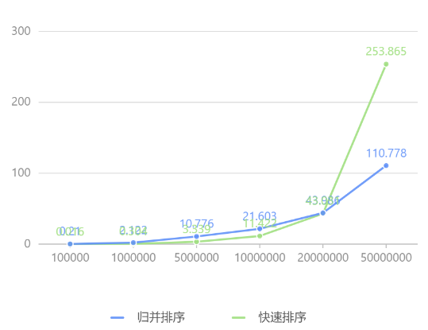
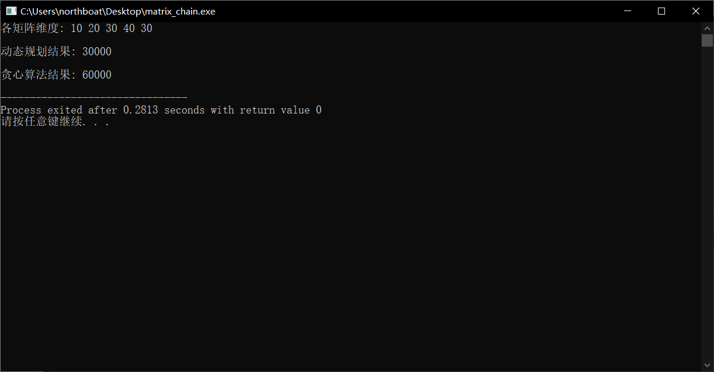
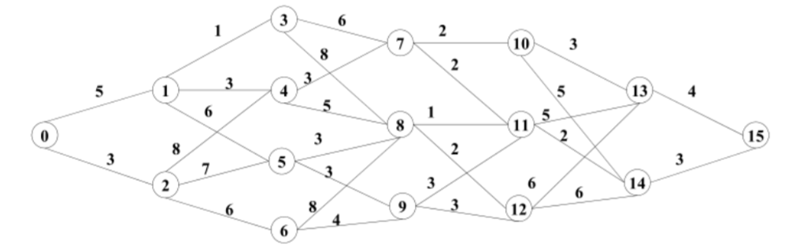

## C/C++ 语法

引包和命名域

```c
#include <stdio>
using namespace std;
```

输入输出格式：输入整型、浮点数、字符

```c
int i;
float f;
char c;
printf("input Int Float Char with one gap: ");
scanf("%d %f %c", &i, &f, &c);
```

输出

```c
printf("i = %d, f = %f, c = %c", i, f, c);
```

浮点数运算：输出精度控制，使用`%.nf`的形式输出浮点数，其中 n 表示小数位数

```c
float f;
printf("input f: ");
scanf("%f", &f);
printf("%.4f", f);
```

浮点数除以整数**仍为浮点数**

```c
printf("%.4f", f/4);
```

浮点数转整数

```c
int i = (int) f;
```

条件语句：特殊的条件语句

```c
int a = 1, b = 2, c = 3;
if(a > b > c){
	printf("1");
} else if((a+1) >= b == (c-2)){
    printf("2");
} else {
    printf("3");
}
```

这里的判断实际上是

- `a>b>c`的判断为`a>b == false == 0`，进而判断` 0>c == false`
- `a+1 >= b == c-2`的判断为`a+1 >= b == true == 1`，所以判断的是` 1 == c-1`

## STL 接口

> 数组和指针这种东西真是太繁琐复杂了，个人愚见，在C++里就尽量使用STL，并且可以用模板的非类型形参来解决这种灵活处理不固定行列数矩阵的函数，Effective C++里面应该有介绍，并且有对这种模板的优化

### 接口

1️⃣ map

通过 m[i] = j 插入键值对

```c
map<int, int> _map;
_map[9] = 10;
```

通过 if(m.count(i)) 判断键 i 是否存在，结果只有 1/0

```c
if(_map.count(9)){
    cout << "9 exist, the value is" << _map[9] << endl;
}
```

遍历：使用元素指针遍历，使用 auto 类型

```c
map<int, int>::iterator iter;
for(iter = _map.begin(); iter != _map.end(); iter++) {
    cout << iter->first << " : " << iter->second << endl;
}

for(auto it: _map){
    cout << it.first << " : " << it.second << endl;
}

for(auto it = _map.begin(); it != _map.end(); it++){
    cout << it->second;
}
```

map 重载 operator() 函数以实现自定义类/结构体的插入

当键为 ListNode* 时，必须要重载 operator() 函数，以明确如何判定 ListNode* 的独特性

```c
struct ListNode {
    int val;
    ListNode *next;
    ListNode(int x) : val(x), next(NULL) {}
};

class Solution {
public:

    bool operator()(const ListNode* s1, const ListNode* s2 ) const{
        return s1->val != s2->val;
    }

    ListNode *detectCycle(ListNode *head) {
       map<ListNode*, int> m;
       int index = 0;
       while(head){
           if(m.count(head)){
               return head;
           }
           m[head] = index++;
           head = head->next;
       } 
       return NULL;
    }
};
```

2️⃣ set

通过 insert() 函数插入值

```c
set <int> _set;
set.insert(7)
```

通过 count() 判断是否存在

```c
if(_set.count(4)){
    cout << "dead" << endl;
}
```

3️⃣ vector

push_back() 向后插入

```c
vector<int> vec;
vec.push_back(1);
vec.push_back(4);
vec.push_back(7);
```

erase() 删除元素

```c
// 删除下标为 1 的元素
vec.erase(vec.begin()+1);

// 删除下标从 
```

back() 返回末尾元素

```c
// 合并区间
// sort() 排序的是每个 vector 的首地址元素，也就是 vec[0]
class Solution {
public:
    vector<vector<int>> merge(vector<vector<int>>& intervals) {
        vector<vector<int>> res;
        sort(intervals.begin(), intervals.end());
        for(int i = 0; i < intervals.size(); i++){
            vector<int> cur = intervals[i];
            if(res.empty() || cur[0] > res.back()[1]){
                res.push_back(cur);
            }
            if(cur[1] > res.back()[1]){
                res.back()[1] = cur[1];
            }
        }
        return res;
    }
};
```

初始化固定大小 vector，填充值

```c
vector<int> vec(n);

// 创建长度为 n，值全为 1 的数组
vector<int> vec(n,1);

vector<vector<int>> matrix(n, vector<int> (n));
```

拷贝 vector

```c
vector<int> pre;

// 创建时拷贝
vector<int> first(pre);

// 创建后复制
vector<int> second;
second.assign(pre.begin(), pre.end());

// 复制时删除原数组 pre
vector<int> third;
third.swap(pre);

// 在指定下标处插入原有数组的一段
vector<int> four;
four.insert(four.begin(), pre.begin(), pre.end());
```

清理 vector

```c
vector<int> vec;

// 清空但不回收内存（全置零）
vec.clear();
// 清空且回收内存
vector<int>().swap(vec);
```

4️⃣ stack

- top()：返回一个栈顶元素的引用，类型为 T&。如果栈为空，返回值未定义
- push(const T& obj)：可以将对象副本压入栈顶。这是通过调用底层容器的 push_back() 函数完成的
- push(T&& obj)：以移动对象的方式将对象压入栈顶。这是通过调用底层容器的有右值引用参数的 push_back() 函数完成的
- pop()：弹出栈顶元素，**无返回**
- size()：返回栈中元素的个数
- empty()：在栈中没有元素的情况下返回 true

5️⃣ deque：在处理首部元素时效率远大于 vector

- push_back(elem)：在容器尾部添加一个数据
- push_front(elem)：在容器头部插入一个数据
- pop_back()：删除容器最后一个数据
- pop_front()：删除容器第一个数据
- front()：返回第一个元素
- back()：返回末尾元素

6️⃣ pair：配合 map 或 vector 使用

创建 pair

```c
pair<int,int> p (1,1);

pair p = make_pair('h', 9);
```

vector+pair 实现 map

```c
vector<pair<int,int>> map;
```

map 插入键值对

```c
map.insert(pair<int,int>(1,2));

map.insert(make_pair(1,2));
```

7️⃣ priority_queue

自定义 lambda 表达式，作为模板传入 priority_queue 的构造式

- 这里是按数组第三位元素从小到大排序

```c
auto cmp = [](const vector<int>& a, const vector<int>& b){
    return a[2] > b[2];
};
priority_queue<vector<int>, vector<vector<int>>, decltype(cmp)> queue(cmp);
queue.push({0,0,0});
queue.emplace({1,1,1});
queue.top();
queue.pop();
```

### vector 和数组

使用`vector<int>`标记代替 bool 数组进行标记，使用`bool row[m], col[n]`在寻址时会报错，说你没初始化，在 c 中，bool 值就是用 int 值实现，所以二者之间可以相互赋值

- 以下是使用 stl 库避免繁琐的指针数组的一个成功案例：将二维矩阵中为 0 元素的所在行、列元素均置零

```c
class Solution {
public:
    void setZeroes(vector<vector<int>>& matrix) {
        int m = matrix.size();
        int n = matrix[0].size();
        vector<int> row(m), col(n);
        for(int i = 0; i < m; i++){
            for(int j = 0; j < n; j++){
                if(matrix[i][j] == 0){
                    row[i] = true;
                    col[j] = true;
                }
            }
        }
        for(int i = 0; i < m; i++){
            for(int j = 0; j < n; j++){
                if(row[i] || col[j]){
                    matrix[i][j] = 0;
                }
            }
        }
    }
};
```

当然，在知道数组范围的时候，使用数组也是可以的，这里注意数组的初始化语句

- 此为判断九宫格数独游戏是否有解的函数

```c
class Solution {
public:
    bool isValidSudoku(vector<vector<char>>& board) {
        // 数组定义和初始化
        int row[9][9] = {{0}}, col[9][9] = {{0}};
        int block[3][3][9] = {{{0}}};
        // ---------分割一下-------- //
        for(int i = 0; i < 9; i++){
            for(int j = 0; j < 9; j++){
                char c = board[i][j];
                int k = c-'1';
                if(c != '.'){
                    if(row[i][k] || col[k][j] || block[i/3][j/3][k]){
                        return false;
                    }
                    row[i][k] = true; 
                    col[k][j] = true;
                    block[i/3][j/3][k] = true;
                }
            }
        }
        return true;
    }
};
```

### 位运算

出现一次的数字，使用异或操作，数字只会出现一次或两次

- 0 ^ a = a
- a ^ a = a
- a ^ a ^ b = b

```c
class Solution {
public:
    int singleNumber(vector<int>& nums) {
        int res = 0;
        for(int i = 0; i < nums.size(); i++){
            res ^= nums[i];
        }
        return res;
    }
};
```

## 工具库和 λ 表达式

### algorithm

max()/min()，最大值、最小值函数

```c
res = max(prices[i]-pre, res);
```

sort()，排序函数，排序一段连续的地址

```c
// vec 为 vector
sort(vec.begin(), vec.end());
// arr 为数组
sort(arr, arr+10);
```

sort()，排序函数 sort 搭配 lambda 表达式

```c
// 排序结构体
bool cmp(Student lhs, Student rhs){
    return lhs.grade < rhs.grade 
           || (lhs.grade == rhs.grade && lhs.name < rhs.name)
}

// 将函数 cmp 作为参数传入，制定 sort 规则
sort(begin(vec), end(vec), cmp);

// 按迭代器的第二个元素从小到大排序
// 使用 lambda 函数作为第三个参数
sort(intervals.begin(), intervals.end(), [](const auto& u, const auto& v){
    return u[1]<v[1];
});
```

sort() 排序字符串，将把字符串原地按字典序排序，返回值为空

```c
string str = "dcba";
sort(str.begin(), str.end());
// str == "abcd"
```

max_element()，返回迭代器的最大值，返回的是指向连续地址中最大值的指针，需要使用 * 号取值

```c
vector<int> vec;
vec.push_back(1);
vec.push_back(4);
vec.push_back(7);
int max = *max_element(vec);
```

reverse()，翻转字符串

```c
string str = "nmsl";
reverse(str); // str == "lsmn"
```

find()，寻找迭代器元素下标

```c
vector<int> nums = {1,2,3,4,5};
cout << find(nums.begin(), nums.end(), 3) - nums.begin();
// 输出 2，表示值 3 所在下标为 2
```

### string

通过 algorithm.sort() 排序字符串

```c
#include<algorithm>

string key = str;
sort(key.begin(), key.end());
```

遍历 string

```c
// 也可以用 length()，一样的
for(int i = 0; i < str.size(); i++){
    cout << str[i] << endl;
}
```

string 初始化

```c
// 长度为 n，用空格填充
string str(n, ' ');

// 直接赋值
string str1 = "nmsl";
```

字符串拼接以及整型转换

```c
string s1 = "hahaha ";
string s2 = "nmsl";

string s3 = s1+s2; // s3 = "hahaha nmsl"

// 整型转换字符
int i = 9;
// 整型到字符减去字符 '0'
char c = i+'0' // c=='9'
// 字符到整型加上字符 '0'
int j = c-'0'; // j == 9
```

to_string()，将数字（整型和浮点）转化为字符串

```c
int i = 55;
string str = to_string(i); // str == "55"
```

substr()，截取字符串，第一个参数为起始下标，第二个参数为截取字符串的长度（包含尾部）

```c
string s = "AAAAAAAAAAAAA";
int n = s.length();
for(int i = 0; i <= n-10; i++){
    string cur = s.substr(i, 10);
}
```

erase()，删除元素

- 第一个参数为起始下标，第二个参数为删除长度

- 或传入一个迭代器，删除单个元素

- 注意删除元素后，该元素之后的元素下标均会 -1，在实际操作时要注意不要 i++

```c
class Solution {
public:
    string minRemoveToMakeValid(string s) {
        stack<char> stc;
        stack<int> sti;
        for(int i = 0; i < s.length();){
            if(s[i] == '('){
                stc.push(s[i]);
                sti.push(i);
                i++;
            } else if(s[i] == ')'){
                if(stc.empty()){
                    s.erase(i, 1);
                } else {
                    stc.pop();
                    sti.pop();
                    i++;
                }
            } else {
                i++;
            }
        }
        while(!sti.empty()){
            s.erase(s.begin()+sti.top());
            sti.pop();
        }
        return s;
    }
};
```

将字符串根据特定字符分割成一个字符串数组

```c
list<string> strs;

void split(string data, char c) {
    string str;
    for(auto& ch: data){
        if(ch == c){
            strs.push_back(str);
            str.clear();
        } else {
            str.push_back(ch);
        }
    }
    if(!str.empty()){
        strs.push_back(str);
        str.clear();
    }
    return build();
}
```

### cstdlib

rand() 函数生成随机数：rand() 会返回一随机数值，范围在 0 至 RAND_MAX 间，RAND_MAX定义在 stdlib.h，其值为 2147483647

- 通过 rand() % n 的方式产生`(0, n]`的随机数

```c
#include <iostream>
#include <cstdlib>
using namespace std;

int main()
{
    for (int i = 0; i < 10; i++)
    {
        cout << rand()%100<< " ";
    }
    return 0;
}
//83 86 77 15 93 35 86 92 49 21   在100中产生随机数， 但是因为没有随机种子所以，下一次运行也是这个数，因此就要引出srand
```

### λ 表达式

在之前 sort 函数中小用了一下，其实这里和 java 的 lambda 函数是差不多的，以`[]`作为匿名函数的开头，接`()`传参，`{}`书写函数内容及返回值

- [451. 根据字符出现频率排序](https://leetcode.cn/problems/sort-characters-by-frequency/)

用 hash 统计字符数量，再用 sort 从大到小排序`pair<char,int>` 

```c
class Solution {
public:
    string frequencySort(string s) {
        map<char, int> m;
        for(int i = 0; i < s.size(); i++){
            m[s[i]]++;
        }
        vector<pair<char,int>> v;
        for(auto& it: m){
            v.push_back(pair<char, int> (it.first, it.second));
        }
        
        // lambda 函数作为参数传入
        sort(v.begin(), v.end(), [](pair<char,int> p1, pair<char,int> p2){
            return p1.second > p2.second;
        });
        
        string res = "";
        for(int i = 0; i < v.size(); i++){
            for(int j = 0; j < v[i].second; j++){
                res += v[i].first;
            }
        }
        return res;
    }
};
```

[973. 最接近原点的 K 个点](https://leetcode.cn/problems/k-closest-points-to-origin/)：用 sort 函数排序`vector<int>`数组，排序点到原点距离大小

```c
class Solution {
public:
    vector<vector<int>> kClosest(vector<vector<int>>& points, int k) {
        sort(points.begin(), points.end(), [](vector<int> u, vector<int> v){
            return u[0]*u[0]+u[1]*u[1] < v[0]*v[0]+v[1]*v[1];
        });
        vector<vector<int>> res;
        for(int i = 0; i < k; i++){
            res.push_back(points[i]);
        }
        return res;
    }
};
```

## 算法设计与分析（二）

你电计科院的课

- “动态规划 DP 是最简单的 P，比线性规划更简单”
- “碰到解决不了的问题，贪一把”

### 寻找最大值

设计一个分治算法在给定的无序整数数组，设计实现一个分治算法，寻找输入数据中的最大值，实现该分治算法，分析算法的时间复杂度

```c
int findMax(vector<int> nums, int i, int j){
	if(i > j){ return -1; }
	if(i == j){ return nums[i]; }
	int mid = (i+j)/2;
	return max(findMax(nums, i, mid), findMax(nums, mid+1, j));
}
```

毋庸置疑，时间复杂度一定是 O(n)，对于一个无序的数组要找最大值，必须遍历其所有元素

### 归并和快速排序

分别实现分治形式的归并算法及快速排序算法，随机产生一定数量的输入数据，对两个算法的计算时间进行实际测试对比

| **算法**         | **平均时间复杂度** | **最坏时间复杂度** | **空间复杂度** | **适用场景**             |
| ---------------- | ------------------ | ------------------ | -------------- | ------------------------ |
| 归并排序 (Merge) | O(nlog⁡n)           | O(nlog⁡n)           | O(n)           | 大数据量，稳定排序需求   |
| 快速排序 (Quick) | O(nlog⁡n)           | O(n^2)             | O(log⁡n)        | 小数据量，较快的平均性能 |

归并排序：每次将数组一分为二，用额外的有序空间，遍历这个小数组同时进行排序，而后将有序数组填回原数组

```c
void merge(vector<int>& nums, int left, int right) {
	if(left >= right){ return; }
	int mid = (left+right) / 2;
	merge(nums, left, mid);
	merge(nums, mid+1, right);
	
    vector<int> temp(right - left + 1);
    int i = left, j = mid+1, count = 0;
    
    while(i<=mid && j<=right){
        if(nums[i]<nums[j]){
            temp[count++] = nums[i++];
        }else{
            temp[count++] = nums[j++];
        }
    }
    while(i<=mid){ temp[count++] = nums[i++]; }
    while(j<=right){ temp[count++] = nums[j++]; }
    for(int k = 0; k <= right-left; k++){
        nums[k+left] = temp[k];
    }
}

void mergeSort(vector<int>& arr) {
    merge(arr, 0, arr.size()-1);
}
```

快速排序

```c
void partition(vector<int>& arr, int left, int right) {
	if(left >= right){ return; }
	swap(arr[right], arr[(left+right)/2]);
    int pivot = arr[right];
    int p = left;

    for (int i = left; i < right; i++) {
        if (arr[i] < pivot) {
            swap(arr[i], arr[p++]);
        }
    }
    swap(arr[p], arr[right]);
    partition(arr, left, p-1);
    partition(arr, p+1, right);
}

void quickSort(vector<int>& arr) {
    partition(arr, 0, arr.size()-1);
}
```

两算法比较：创建随机数组，排序并统计时间

```c
vector<int> generateData(size_t size, int lower_bound = 0, int upper_bound = 10000) {
    vector<int> data(size);
    for (size_t i = 0; i < size; ++i) {
        data[i] = lower_bound + rand() % (upper_bound - lower_bound + 1);
    }
    return data;
}

void compareAlgorithms() {
    vector<size_t> sizes = {100000, 1000000, 5000000, 10000000, 20000000, 50000000};

    for (size_t size : sizes) {
        vector<int> data = generateData(size);

        vector<int> data_copy = data;
        clock_t start = clock();
        mergeSort(data);
        double mergeTime = double(clock() - start) / CLOCKS_PER_SEC;

        data = data_copy;
        start = clock();
        quickSort(data);
        double quickTime = double(clock() - start) / CLOCKS_PER_SEC;

        cout << "Data Size: " << size << endl;
        cout << "Merge Sort Time: " << mergeTime << " seconds" << endl;
        cout << "Quick Sort Time: " << quickTime << " seconds" << endl;
        cout << string(40, '-') << endl;
    }
}

int main() {
    srand(time(0));
    compareAlgorithms();
    return 0;
}
```

数据量从 10 万增加到 5 千万，耗时测试结果（单位秒）

| 算法\数据量 | 100000 | 1000000 | 5000000 | 10000000 | 20000000 | 50000000 |
| ----------- | ------ | ------- | ------- | -------- | -------- | -------- |
| 归并排序    | 0.21   | 2.122   | 10.776  | 21.603   | 43.986   | 110.778  |
| 快速排序    | 0.016  | 0.304   | 3.339   | 11.422   | 43.031   | 253.865  |



### 最大子数组

实现最大子数组的分治算法，将其实际运行效率与改进后的蛮力算法进行对比分析

动态规划，时间复杂度 O(n)，空间复杂度 O(n)

```java
class Solution {
    public int maxSubArray(int[] nums) {
        int n = nums.length;
        int[] dp = new int[n];
        dp[0] = nums[0];
        for(int i = 1; i < n; i++){
            int cur = dp[i-1] + nums[i];
            dp[i] = cur > nums[i] ? cur : nums[i];
        }
        return Arrays.stream(dp).max().orElseThrow();
    }
}
```

分治法，来自[力扣的官方题解](https://leetcode.cn/problems/maximum-subarray/solutions/228009/zui-da-zi-xu-he-by-leetcode-solution/)

对于一个区间 [l,r]，我们可以维护四个量

- iSum 表示 [l,r] 的区间和
- lSum 表示 [l,r] 内以 l 为左端点的最大子段和
- rSum 表示 [l,r] 内以 r 为右端点的最大子段和
- mSum 表示 [l,r] 内的最大子段和

以下简称 [l,m] 为 [l,r] 的「左子区间」，[m+1,r] 为 [l,r] 的「右子区间」。我们考虑如何维护这些量呢（如何通过左右子区间的信息合并得到 [l,r] 的信息）？对于长度为 1 的区间 [i,i]，四个量的值都和 nums[i] 相等。对于长度大于 1 的区间：

- 首先最好维护的是 iSum，区间 [l,r] 的 iSum 就等于「左子区间」的 iSum 加上「右子区间」的 iSum
- 对于 [l,r] 的 lSum，存在两种可能，它要么等于「左子区间」的 lSum，要么等于「左子区间」的 iSum 加上「右子区间」的 lSum，二者取大
- 对于 [l,r] 的 rSum，同理，它要么等于「右子区间」的 rSum，要么等于「右子区间」的 iSum 加上「左子区间」的 rSum，二者取大
- 当计算好上面的三个量之后，就很好计算 [l,r] 的 mSum 了。我们可以考虑 [l,r] 的 mSum 对应的区间是否跨越 m —— 它可能不跨越 m，也就是说 [l,r] 的 mSum 可能是「左子区间」的 mSum 和 「右子区间」的 mSum 中的一个；它也可能跨越 m，可能是「左子区间」的 rSum 和 「右子区间」的 lSum 之和，三者取大

这样问题就得到了解决

```java
class Solution {
    public class Status {
        public int lSum, rSum, mSum, iSum;

        public Status(int lSum, int rSum, int mSum, int iSum) {
            this.lSum = lSum; // 以左端点为起点的最大子数组和
            this.rSum = rSum; // 以右端点为终点的最大子数组和
            this.mSum = mSum; // 本区间的最大子数组和
            this.iSum = iSum; // 本区间的区间和
        }
    }

    public int maxSubArray(int[] nums) {
        return getInfo(nums, 0, nums.length - 1).mSum;
    }

    public Status getInfo(int[] a, int l, int r) {
        if (l == r) {
            return new Status(a[l], a[l], a[l], a[l]);
        }
        // 除以二的位操作，更快
        int m = (l + r) >> 1;
        // 分治
        Status lSub = getInfo(a, l, m);
        Status rSub = getInfo(a, m + 1, r);
        return pushUp(lSub, rSub);
    }

    // 合并两个区间（合并两个相邻区间状态）
    public Status pushUp(Status l, Status r) {
        // 区间和
        int iSum = l.iSum + r.iSum;
        // 注意这三个更新策略
        // 以左端点为起点的最大子数组和
        int lSum = Math.max(l.lSum, l.iSum + r.lSum); 
        // 以右端点为终点的最大子数组和
        int rSum = Math.max(r.rSum, r.iSum + l.rSum);
        // 最大子数组和
        int mSum = Math.max(Math.max(l.mSum, r.mSum), l.rSum + r.lSum);
        return new Status(lSum, rSum, mSum, iSum);
    }
}
```

这里有一个小技巧，通过位操作求两数平均更快

```java
int m = (l + r) >> 1;
```

复杂度分析

- 空间复杂度：递归次数为 O(logn)，即为其空间复杂度
- 时间复杂度：将递归的过程看作一颗二叉树的后序遍历（每个区间的状态作为一个节点），则问题从下到上构造每个状态节点，且已知叶子节点个数 n（n 为问题的输入规模），易知节点总数 N 最多为 2n-1（满二叉树），故 O(N) = O(2n-1) = O(n)，时间复杂度为 O(n)

备选题目

1. 设计实现一个分治算法，将给定数组形式存储的无序输入数据整理成一个大顶堆

### 矩阵链乘

> 动态规划与贪心

设计一个每次吃掉矩阵链中最大中间维的贪心算法，计算这样得到的矩阵链乘法的计算量（标量乘法次数）；随机产生输入数据，将贪心算法得到的解与讲义上给出的动态算法算法得到的解进行对比，验证贪心算法得到不一定是最优解

贪心算法

```c
int matrixChainGreedy(const vector<int>& dims) {
    vector<int> matrices = dims;
    int totalCost = 0;

    while (matrices.size() > 2) {
        int maxIndex = 1;
        for (int i = 1; i < matrices.size() - 1; ++i) {
            if (matrices[i] > matrices[maxIndex]) {
                maxIndex = i;
            }
        }

        int cost = matrices[maxIndex - 1] * matrices[maxIndex] * matrices[maxIndex + 1];
        totalCost += cost;

        // 消去最大维
        matrices[maxIndex - 1] = matrices[maxIndex - 1];
        matrices.erase(matrices.begin() + maxIndex);
    }

    return totalCost;
}
```

动态规划

```c
int matrixChainDP(const vector<int>& dims) {
    int n = dims.size() - 1;
    vector<vector<int>> dp(n, vector<int>(n, 0));

    for (int len = 2; len <= n; ++len) {
        for (int i = 0; i < n - len + 1; ++i) {
            int j = i + len - 1;
            dp[i][j] = INT_MAX;
            for (int k = i; k < j; ++k) {
                int cost = dp[i][k] + dp[k + 1][j] + dims[i] * dims[k + 1] * dims[j + 1];
                dp[i][j] = min(dp[i][j], cost);
            }
        }
    }
    return dp[0][n - 1];
}
```

测试

```c
#include <iostream>
#include <vector>
#include <climits>
using namespace std;

int main() {
    vector<int> dims = {10, 20, 30, 40, 30}; // A1 = 10x30, A2 = 30x5, A3 = 5x60
    cout << "各矩阵维度: ";
	for(auto d: dims){
		cout << d << " ";
	}
	cout << endl;

    cout << "\n动态规划结果: ";
    int dpResult = matrixChainDP(dims);
    cout << dpResult << endl;

    cout << "\n贪心算法结果: ";
    int greedyResult = matrixChainGreedy(dims);
    cout << greedyResult << endl;

    return 0;
}
```



备选题目

1. 设计实现一个装配线调度问题的二分分治算法（即将 n 个站从中间位置分为两个：n/2 个站的子问题），分析你所设计算法的计算复杂度，实现讲义上的动态规划算法，产生测数据对比两种算法的计算时间

2. 设计一个动态规划算法求解下述多段图问题，计算从第一段源点（示例图中节点 0）到最后一段目标节点（示例图中节点 15）的最短路径

   
