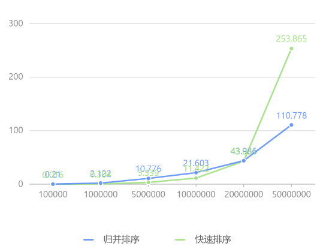
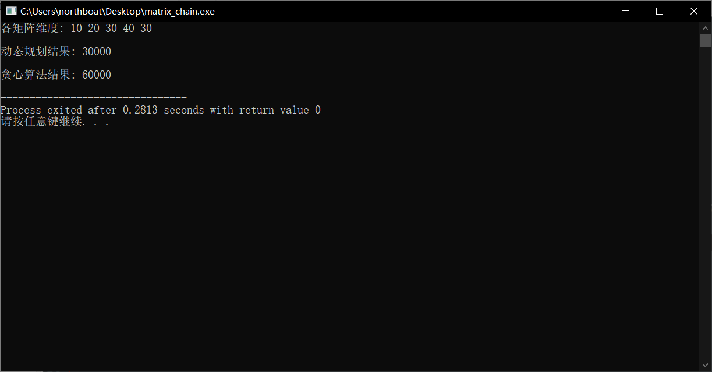

你电计科院的课

- “动态规划 DP 是最简单的 P，比线性规划更简单”
- “碰到解决不了的问题，贪一把”

## 分治

1、设计一个分治算法在给定的无序整数数组，设计实现一个分治算法，寻找输入数据中的最大值，实现该分治算法，分析算法的时间复杂度

```c
int findMax(vector<int> nums, int i, int j){
	if(i > j){ return -1; }
	if(i == j){ return nums[i]; }
	int mid = (i+j)/2;
	return max(findMax(nums, i, mid), findMax(nums, mid+1, j));
}
```

毋庸置疑，时间复杂度一定是 O(n)，对于一个无序的数组要找最大值，必须遍历其所有元素

2、分别实现分治形式的归并算法及快速排序算法，随机产生一定数量的输入数据，对两个算法的计算时间进行实际测试对比

| **算法**         | **平均时间复杂度** | **最坏时间复杂度** | **空间复杂度** | **适用场景**             |
| ---------------- | ------------------ | ------------------ | -------------- | ------------------------ |
| 归并排序 (Merge) | O(nlog⁡n)           | O(nlog⁡n)           | O(n)           | 大数据量，稳定排序需求   |
| 快速排序 (Quick) | O(nlog⁡n)           | O(n^2)             | O(log⁡n)        | 小数据量，较快的平均性能 |

归并排序：每次将数组一分为二，用额外的有序空间，遍历这个小数组同时进行排序，而后将有序数组填回原数组

```c
void merge(vector<int>& nums, int left, int right) {
	if(left >= right){ return; }
	int mid = (left+right) / 2;
	merge(nums, left, mid);
	merge(nums, mid+1, right);
	
    vector<int> temp(right - left + 1);
    int i = left, j = mid+1, count = 0;
    
    while(i<=mid && j<=right){
        if(nums[i]<nums[j]){
            temp[count++] = nums[i++];
        }else{
            temp[count++] = nums[j++];
        }
    }
    while(i<=mid){ temp[count++] = nums[i++]; }
    while(j<=right){ temp[count++] = nums[j++]; }
    for(int k = 0; k <= right-left; k++){
        nums[k+left] = temp[k];
    }
}

void mergeSort(vector<int>& arr) {
    merge(arr, 0, arr.size()-1);
}
```

快速排序

```c
void partition(vector<int>& arr, int left, int right) {
	if(left >= right){ return; }
	swap(arr[right], arr[(left+right)/2]);
    int pivot = arr[right];
    int p = left;

    for (int i = left; i < right; i++) {
        if (arr[i] < pivot) {
            swap(arr[i], arr[p++]);
        }
    }
    swap(arr[p], arr[right]);
    partition(arr, left, p-1);
    partition(arr, p+1, right);
}

void quickSort(vector<int>& arr) {
    partition(arr, 0, arr.size()-1);
}
```

两算法比较：创建随机数组，排序并统计时间

```c
vector<int> generateData(size_t size, int lower_bound = 0, int upper_bound = 10000) {
    vector<int> data(size);
    for (size_t i = 0; i < size; ++i) {
        data[i] = lower_bound + rand() % (upper_bound - lower_bound + 1);
    }
    return data;
}

void compareAlgorithms() {
    vector<size_t> sizes = {100000, 1000000, 5000000, 10000000, 20000000, 50000000};

    for (size_t size : sizes) {
        vector<int> data = generateData(size);

        vector<int> data_copy = data;
        clock_t start = clock();
        mergeSort(data);
        double mergeTime = double(clock() - start) / CLOCKS_PER_SEC;

        data = data_copy;
        start = clock();
        quickSort(data);
        double quickTime = double(clock() - start) / CLOCKS_PER_SEC;

        cout << "Data Size: " << size << endl;
        cout << "Merge Sort Time: " << mergeTime << " seconds" << endl;
        cout << "Quick Sort Time: " << quickTime << " seconds" << endl;
        cout << string(40, '-') << endl;
    }
}

int main() {
    srand(time(0));
    compareAlgorithms();
    return 0;
}
```

数据量从 10 万增加到 5 千万，耗时测试结果（单位秒）

| 算法\数据量 | 100000 | 1000000 | 5000000 | 10000000 | 20000000 | 50000000 |
| ----------- | ------ | ------- | ------- | -------- | -------- | -------- |
| 归并排序    | 0.21   | 2.122   | 10.776  | 21.603   | 43.986   | 110.778  |
| 快速排序    | 0.016  | 0.304   | 3.339   | 11.422   | 43.031   | 253.865  |



3、实现最大子数组的分治算法，将其实际运行效率与改进后的蛮力算法进行对比分析

动态规划，时间复杂度 O(n)，空间复杂度 O(n)

```java
class Solution {
    public int maxSubArray(int[] nums) {
        int n = nums.length;
        int[] dp = new int[n];
        dp[0] = nums[0];
        for(int i = 1; i < n; i++){
            int cur = dp[i-1] + nums[i];
            dp[i] = cur > nums[i] ? cur : nums[i];
        }
        return Arrays.stream(dp).max().orElseThrow();
    }
}
```

分治法，来自[力扣的官方题解](https://leetcode.cn/problems/maximum-subarray/solutions/228009/zui-da-zi-xu-he-by-leetcode-solution/)

对于一个区间 [l,r]，我们可以维护四个量

- iSum 表示 [l,r] 的区间和
- lSum 表示 [l,r] 内以 l 为左端点的最大子段和
- rSum 表示 [l,r] 内以 r 为右端点的最大子段和
- mSum 表示 [l,r] 内的最大子段和

以下简称 [l,m] 为 [l,r] 的「左子区间」，[m+1,r] 为 [l,r] 的「右子区间」。我们考虑如何维护这些量呢（如何通过左右子区间的信息合并得到 [l,r] 的信息）？对于长度为 1 的区间 [i,i]，四个量的值都和 nums[i] 相等。对于长度大于 1 的区间：

- 首先最好维护的是 iSum，区间 [l,r] 的 iSum 就等于「左子区间」的 iSum 加上「右子区间」的 iSum
- 对于 [l,r] 的 lSum，存在两种可能，它要么等于「左子区间」的 lSum，要么等于「左子区间」的 iSum 加上「右子区间」的 lSum，二者取大
- 对于 [l,r] 的 rSum，同理，它要么等于「右子区间」的 rSum，要么等于「右子区间」的 iSum 加上「左子区间」的 rSum，二者取大
- 当计算好上面的三个量之后，就很好计算 [l,r] 的 mSum 了。我们可以考虑 [l,r] 的 mSum 对应的区间是否跨越 m —— 它可能不跨越 m，也就是说 [l,r] 的 mSum 可能是「左子区间」的 mSum 和 「右子区间」的 mSum 中的一个；它也可能跨越 m，可能是「左子区间」的 rSum 和 「右子区间」的 lSum 之和，三者取大

这样问题就得到了解决

```java
class Solution {
    public class Status {
        public int lSum, rSum, mSum, iSum;

        public Status(int lSum, int rSum, int mSum, int iSum) {
            this.lSum = lSum; // 以左端点为起点的最大子数组和
            this.rSum = rSum; // 以右端点为终点的最大子数组和
            this.mSum = mSum; // 本区间的最大子数组和
            this.iSum = iSum; // 本区间的区间和
        }
    }

    public int maxSubArray(int[] nums) {
        return getInfo(nums, 0, nums.length - 1).mSum;
    }

    public Status getInfo(int[] a, int l, int r) {
        if (l == r) {
            return new Status(a[l], a[l], a[l], a[l]);
        }
        // 除以二的位操作，更快
        int m = (l + r) >> 1;
        // 分治
        Status lSub = getInfo(a, l, m);
        Status rSub = getInfo(a, m + 1, r);
        return pushUp(lSub, rSub);
    }

    // 合并两个区间（合并两个相邻区间状态）
    public Status pushUp(Status l, Status r) {
        // 区间和
        int iSum = l.iSum + r.iSum;
        // 注意这三个更新策略
        // 以左端点为起点的最大子数组和
        int lSum = Math.max(l.lSum, l.iSum + r.lSum); 
        // 以右端点为终点的最大子数组和
        int rSum = Math.max(r.rSum, r.iSum + l.rSum);
        // 最大子数组和
        int mSum = Math.max(Math.max(l.mSum, r.mSum), l.rSum + r.lSum);
        return new Status(lSum, rSum, mSum, iSum);
    }
}
```

这里有一个小技巧，通过位操作求两数平均更快

```java
int m = (l + r) >> 1;
```

复杂度分析

- 空间复杂度：递归次数为 O(logn)，即为其空间复杂度
- 时间复杂度：将递归的过程看作一颗二叉树的后序遍历（每个区间的状态作为一个节点），则问题从下到上构造每个状态节点，且已知叶子节点个数 n（n 为问题的输入规模），易知节点总数 N 最多为 2n-1（满二叉树），故 O(N) = O(2n-1) = O(n)，时间复杂度为 O(n)

备选题目

1. 设计实现一个分治算法，将给定数组形式存储的无序输入数据整理成一个大顶堆

## 动态规划与贪心

设计一个每次吃掉矩阵链中最大中间维的贪心算法，计算这样得到的矩阵链乘法的计算量（标量乘法次数）；随机产生输入数据，将贪心算法得到的解与讲义上给出的动态算法算法得到的解进行对比，验证贪心算法得到不一定是最优解

贪心算法

```c
int matrixChainGreedy(const vector<int>& dims) {
    vector<int> matrices = dims;
    int totalCost = 0;

    while (matrices.size() > 2) {
        int maxIndex = 1;
        for (int i = 1; i < matrices.size() - 1; ++i) {
            if (matrices[i] > matrices[maxIndex]) {
                maxIndex = i;
            }
        }

        int cost = matrices[maxIndex - 1] * matrices[maxIndex] * matrices[maxIndex + 1];
        totalCost += cost;

        // 消去最大维
        matrices[maxIndex - 1] = matrices[maxIndex - 1];
        matrices.erase(matrices.begin() + maxIndex);
    }

    return totalCost;
}
```

动态规划

```c
int matrixChainDP(const vector<int>& dims) {
    int n = dims.size() - 1;
    vector<vector<int>> dp(n, vector<int>(n, 0));

    for (int len = 2; len <= n; ++len) {
        for (int i = 0; i < n - len + 1; ++i) {
            int j = i + len - 1;
            dp[i][j] = INT_MAX;
            for (int k = i; k < j; ++k) {
                int cost = dp[i][k] + dp[k + 1][j] + dims[i] * dims[k + 1] * dims[j + 1];
                dp[i][j] = min(dp[i][j], cost);
            }
        }
    }
    return dp[0][n - 1];
}
```

测试

```c
#include <iostream>
#include <vector>
#include <climits>
using namespace std;

int main() {
    vector<int> dims = {10, 20, 30, 40, 30}; // A1 = 10x30, A2 = 30x5, A3 = 5x60
    cout << "各矩阵维度: ";
	for(auto d: dims){
		cout << d << " ";
	}
	cout << endl;

    cout << "\n动态规划结果: ";
    int dpResult = matrixChainDP(dims);
    cout << dpResult << endl;

    cout << "\n贪心算法结果: ";
    int greedyResult = matrixChainGreedy(dims);
    cout << greedyResult << endl;

    return 0;
}
```



备选题目

1. 设计实现一个装配线调度问题的二分分治算法 (即将 n 个站从中间位置分为两个：n/2 个站的子问题)，分析你所设计算法的计算复杂度，实现讲义上的动态规划算法，产生测数据对比两种算法的计算时间

2. 设计一个动态规划算法求解下述多段图问题，计算从第一段源点 (示例图中节点0) 到最后一段目标节点 (示例图中节点15) 的最短路径

   
