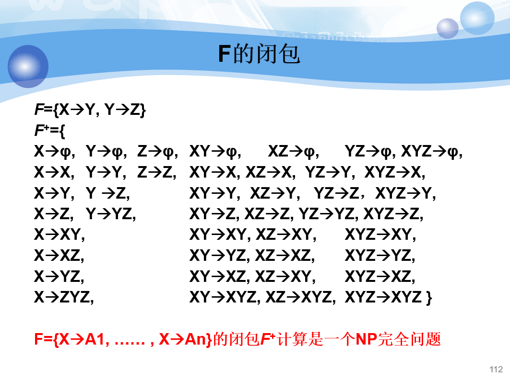

## 结构化查询语言 SQL

### 库操作

建库

Mysql.8.0.28没有限定储存文件大小的命令，查阅资料得知

- MySQL.5.6以后允许InnoDB表最多1017个列
- 一个InnoDB表最多允许64个二级索引
- 默认索引前缀长度最多767bytes
- 联合索引最多允许16个列, 多了报错
- InnoDB的最大行大小为半页(小于8K-默认)，由于默认页大小为16K, 要求是小于half page size, 就是小于8K;

~~~sql
create database test1;
create database test2;
~~~

更名

由于在`mysql-5.1.23`后出于安全考虑丢弃了 rename database、modify name 这些命令，采用先备份原数据库数据，新建数据库并导入数据的方式进行更名

~~~sql
mysqldump -u root -p --set-gtid-purged=OFF test1 > C:\Files\sql\old.sql
drop database test1;
create database new_test1;
mysql -u root -p new_test1 < C:\Files\sql\old.sql
~~~

删除库

~~~sql
drop database new_test1;
drop database test2;  
~~~

### 表操作

建表

建立学生信息表`student`、课程表`course`、学生课程成绩关系表`score`，其中`score`的外键为学生ID和课程ID

~~~sql
create table `student`(
    student_id varchar(10) not null comment '学号',
    student_name varchar(10) not null comment '姓名',
    sex char(1) not null comment '性别F或M',
    age int comment '年龄',
    department varchar(15) default 'computer' comment '系名',
    primary key(`student_id`)
)engine=innodb default charset=utf8;

create table `course`(
    course_id varchar(6) not null comment '课程号',
    course_name varchar(20) not null comment '课程名',
    pre_could varchar(6) not null comment '先修课程号',
    crdits float(3,1) comment '学分',
    primary key(`course_id`)
)engine=innodb default charset=utf8;
    
create table `score`(
    student_id varchar(10) not null comment '学号号',
    course_id varchar(6) not null comment '课程号',
    grade float(3,1) comment '学分',
    check(grade>0 and grade < 100),
    primary key(`student_id`,`course_id`)
)engine=innodb default charset=utf8;
~~~

关联外键

~~~sql
alter table score
add constraint fk_student_id
foreign key(student_id)
references student(student_id);

alter table score
add constraint fk_course_id
foreign key(course_id)
references course(course_id);
~~~

修改列属性：添加 memo 字段

~~~sql
alter table `student` add memo varchar(200) after `age`;
~~~

PS：使用`after`可以限定新增字段的位置，默认在最后一列

改变 memo 属性

~~~sql
alter table `student` modify memo varchar(300);
~~~

删除 memo 字段

~~~sql
alter table `student` drop memo;
~~~

删除表

~~~sql
drop table student, score, course;
~~~

### CUD 操作

> create、update、delete

批量插入：在上述`student、course、score`的基础上批量插入数据

~~~sql
insert into student (student_id,student_name,sex,age,department) values
('20010101', 'Jone',  '女', '19','Computer'),
('20010102', 'Sue',   '男', '20','Computer'),
('20010103', 'Smith', '女', '19','Math'),
('20030101', 'Allen', '女', '18','Automation'),
('20030102','deepa', '男', '21','Art'),
('20010104','Stefen','男', '20','Computer');

insert into studentInfo.dbo.course(course_id,course_name,precould,credits) values
('C1','English',' ','4'),
('C2','Math','C1','2'),
('C3','Cprogram','C2','2'),
('C4','database','C2''2');

insert into studentInfo.dbo.score(student_id,course_id,grade) values
('20010101','C1','90'),
('20010102','C1','87'),
('20010103','C1','88'),
('20010102','C2','90'),
('20010104','C2','94'),
('20010102','C3','62'),
('20030101','C3','80'),
('20010103','C4','77');
~~~

单个插入：向 students 表添加一个学生记录，学号为 20010112，性别为男，姓名为`stefen`，年龄 25 岁，所在系为艺术系 art

~~~sql
insert into student (student_id, sex, student_name, age, department) values
('2010112', 'M', 'stefen', 25, 'art');
~~~

向 score 表添加一个选课记录，学生学号为 20010112，所选课程号为 C2

~~~sql
insert into score (student_id, course_id) values('20010112', 'C2');
~~~

复制表：建立表`tempstudent`，结构与`students`结构相同，其记录均从`student`表获取

~~~sql
create table tempstudent as(select * from student);
~~~

修改数据：将所有学生的成绩加5分

~~~sql
update score set grade=grade+5;
~~~

将姓名为 sue 的学生所在系改为电子信息系

~~~sql
update student set department='电子信息' where student_name='Sue';
~~~

将选课为 database 的学生成绩加10分

~~~sql
update score set grade=grade+10
where course_id = (select course_id from course where course_name='database');
~~~

删除数据：删除所有成绩为空的选修记录（delete form 表名 where 属性列 is null）

~~~sql
delete from score where grade is null;
~~~

删除学生姓名为`deepa`的学生记录

~~~sql
delete from score where student_id = (select student_id from student where student_name='deepa');
delete from student where student_name = 'deepa' limit 1;
~~~

- 先删关联表，再删数据表
- 定向删除单个数据时使用`limit 1`能够防止查询整个表

删除计算机系选修成绩不及格的学生的选修记录

~~~sql
delete from score where grade < 60 and 
student_id in (select student_id from student where department='computer');
~~~

### R 操作

> retrieve查询

#### 单表查询

设置别名：查询全体学生的学号、姓名、所在系，并为结果集的各列设置中文名称

~~~sql
select student_id as '学号', student_name as '学生姓名', 
sex as '性别', age as '年龄', department as '所在系' 
from student;
~~~

- `id as '学号'`

查询同时修改，不改变原数据

查询全体学生的选课情况，并为所有成绩加5分

 ~~~sql
select student_id as 学号,course_id as 课程,grade+'5' as 成绩 FROM score;
 ~~~

去重

显示所有选课学生的学号，去掉重复行，关键字`distinct`

 ~~~sql
select distinct student_id from score;
 ~~~

条件判断

数字判断：查询选课成绩大于80分的学生

 ~~~sql
select distinct student_id from score where grade>80;
 ~~~

查询年龄在 20 到 30 之间的学生学号，姓名，所在系

 ~~~sql
select student_id, student_name, department from student where age>20 and age<30;
 ~~~

用`and/or`连接条件判断

字符串判断：查询数学系、计算机系、艺术系的学生学号，姓名

 ~~~sql
select student_id, student_name from student where 
department='math'
or department='computer'
or department='art';
 ~~~

查询姓名第二个字符为u并且只有3个字符的学生学号，姓名

 ~~~sql
select student_id,student_name from student where student_name like('_u_');
 ~~~

- `_`表示单个任一字符

查询所有以S开头的学生

 ~~~sql
select * from student where student_name like 'S%';
 ~~~

- `%`表示`whatever`，不限长度
- 模糊搜索`like`

查询姓名不以S、D、或J开头的学生

 ~~~sql
select * from student 
where student_name not like 'S%' 
and student_name not like 'D%' 
and student_name not like 'J%';
 ~~~

- `not like`

查询没有考试成绩的学生和相应课程号（成绩值为空）is null

 ~~~sql
select student_id, course_id from score where grade is null;
 ~~~

- 为空`is null`

函数

1️⃣ 计数

求年龄大于19岁的学生的总人数

 ~~~sql
select count(*) from student where age>19;
 ~~~

- 求满足要求的行的数量

2️⃣ 求均值

求选修了c语言课程的学生平均成绩、最高分、最低分学生

 ~~~sql
select avg(grade) from course, score
where course.course_id=score.course_id and course_name='Cprogram';
 ~~~

3️⃣ 排序

求选修了c语言课程的最高分、最低分学生

~~~sql
select student_name from student, score, course
where student.student_id=score.student_id
and score.course_id=course.course_id
and course.course_name='Cprogram'
order by score.grade DESC limit 1;

select student_name from student, score, course
where student.student_id=score.student_id
and score.course_id=course.course_id
and course.course_name='Cprogram'
order by score.grade limit 1;
~~~

- 默认排序为升序，即`incr`，若要降序加`desc`即可

4️⃣ 求和

求学号为20010102的学生总成绩

~~~sql
select sum(grade) from score where student_id='20010102';
~~~

5️⃣ 分组

求每个选课学生的学号，姓名，总成绩

~~~sql
select student.student_id, student_name, sum(grade) from student, score where score.student_id=student.student_id group by student.student_id;
~~~

- `group by`

求课程号及相应课程的所有的选课人数

 ~~~sql
select course_id, count(course_id) from score group by course_id;
 ~~~

6️⃣ 附加条件

查询选修了3门以上课程的学生姓名学号

~~~sql
select student_id, student_name from student
where student_id in
(select student_id from score group by student_id having count(course_id)>3);
~~~

- `having`，有点像`where`

#### 多表查询

查询每个学生基本信息及选课情况

 ~~~sql
select student.*, course_id from student, score where student.student_id = score.student_id;
 ~~~

- 相同的列需要用`表名.列名`的形式加以区分

查询每个学生学号姓名及选修的课程名、成绩

 ~~~sql
select student_name, course_id, grade from student, score where student.student_id=score.student_id;
 ~~~

求计算机系选修课程超过2门课的学生学号姓名、平均成绩并按平均成绩降序排列

 ~~~sql
select student.student_id, student_name, avg(grade) from student, score
where student.student_id = score.student_id
and department='computer'
group by student.student_id having count(grade)>2
order by avg(grade) desc;
 ~~~

- `order by ... desc` 从高到低排列

查询与sue在同一个系学习的所有学生的学号姓名

~~~sql
select student_id, student_name from student
where department = (select department from student where student_name = 'Sue');
~~~

查询所有学生的选课情况，要求包括所有选修了课程的和没选课的学生，显示他们的姓名学号课程号和成绩（若有）

 ~~~sql
select student.student_id, student_name, score.course_id, grade from student
left outer join score on (student.student_id = score.student_id)
left outer join course on (score.course_id = course.course_id);
 ~~~

- `left outer join`左外连接

 ### 视图和存储过程

#### 视图

> 类似于一张表，但不以表的形式占用储存空间

建立数学系的学生视图

 ~~~sql
create view math as select * from student where department='math';
 ~~~

建立计算机系选修了课程名为`database`的学生的视图，视图名为`cs_db`，视图列名为学号、姓名、成绩

 ~~~sql
create view cs_db
as select student.student_id as '学号', student_name as '姓名', grade as '成绩' from student, score
where student.student_id = score.student_id
and department = 'computer'
and course_id in (select course_id from course where course_name = 'database');
 ~~~

创建一个名为`stu_sum`的视图，包含所有学生学号和总成绩

 ~~~sql
create view stu_sum as select student_id as '学号', sum(grade) as '总成绩'
from score group by student_id;
 ~~~

建立一个计算机系学生选修了课程名为`database`并且成绩大于80分的学生视图，视图名为`cs_db1`，视图的列为学号姓名成绩

 ~~~sql
create view cs_db1 as
select student.student_id as '学号', student_name as '姓名', grade as '成绩' from student, score
where student.student_id = score.student_id
and department = 'computer'
and grade > 80
and course_id in (select course_id from course where course_name = 'database');
 ~~~

删除`cs_db1`视图

 ~~~sql
drop view cs_db1;
 ~~~

#### 存储过程

创建对studentinfo数据库表student进行插入、修改和删除的三个存储过程：`insertStu、updateStu、deleteStu`

 ~~~sql
create procedure insertStu as
insert into student values('202012143', 'wdnmd', 'M', '21', 'nmsl');
 ~~~

~~~sql
create procedure updateStu as
update student set department = 'cs' where student_id = '202012143';
~~~

~~~sql
create procedure deleteStu as
delete student where student_id = 202012143';
~~~

## 关系数据理论

> 如何设计好的关系模式使得数据库的使用效率更高

### 问题提出

怎样判断数据库好坏：用范式衡量

关系模式由五部分构成：`R(U, D, DOM, F)`

- R：关系名
- U：属性名集合
- D：属性的域
- DOM：属性向域的映象集合
- F：属性间数据的函数依赖
- 其中`D,DOM`和关系模式设计关系不大，于是我们也视作三元组`R(U, F)`

数据依赖：完整性约束的表现

- 函数依赖（`FD`）
- 多值依赖（`MVD`）

试想这样一个数据库：一个学校的教务管理系统，只有一个表，`Student(sno, sdept, mname, cno, grade)`，分别为学号、系、系主任、课程号、成绩

这个关系模式存在的问题：

- 数据冗余太大：系主任一个系只有一个，系中每条数据都加这个人的名字
- 更新异常（Update Anomalies）：更换系主任后，系中每条数据都要改
- 插入异常（Insertion Anomalies）：一个系刚成立没有学生，无法插入系主任的数据
- 删除异常（Deletion Anomalies）：学生全毕业了，系主任的数据会随之丢失

将这个表分成三个表

- `S(sno, sdept), sno -> sdept`
- `SC(sno, cno, grade), sno,cno -> grade`
- `Dept(sdept, mname), sdept -> mname`

解决了上述四个问题且数据完整没有任何丢失

### 规范化

规范化理论用于指导改造关系模式，通过分解关系模式来消除不合适的数据依赖，以解决插入异常、删除异常、更新异常和数据冗余问题

#### 函数依赖

设有关系模式`R`，`U`为其属性集，`X,Y∈U`，`X`的取值唯一（在表中只出现一次），且只对应一个`Y`，那么我们说`X`函数确定`Y`，或`Y`函数依赖于`X`，记作`X->Y`

- 不同的`X`可以对应相同的`Y`
- `X,Y`可以是多个属性，也可以是单个属性

平凡依赖：若`X->Y, Y∈X`，称其为平凡依赖

非平凡依赖：即`X->Y, Y!∈X`

完全依赖：若`X->Y`，且`Y`不依赖于`X`的任一子集，则成为完全依赖

部分依赖：与完全依赖相反，即`X->Y`，`X`的某一子集也可以决定`Y`

传递函数依赖：`X->Y, Y!∈X, Y->Z, Z!∈Y`，则称`Z`传递依赖于`X`，记作`X->Z(传递)`

#### 码

> 码：key

候选码：可以决定关系中全部属性的一组码（可单可多）

主码：选定候选码中某个码为主码

主属性：候选码中的属性

非主属性：非候选码中的属性

全码：码为整个属性组，称为全码

外码：不为当前关系的候选码，但是是其他关系的码

#### 范式

- 第一范式
- 第二范式
- 第三范式
- BC范式
- 第四范式
- 第五范式

低级范式的关系模式可以转化为若干个高一级的关系模式，这个过程就叫做规范化

`1NF`：第一范式，关系模式R中每个属性都是**不可再分**的基本数据项，如不能连续存语数英三门成绩（9165110）

- 不满足`1NF`不能称为关系数据库

#### 2NF

消除部分依赖

`2NF`：若`R`满足`1NF`，且**每个非主属性都完全依赖于候选码**，则`R∈2NF`

- 这意味着非主属性必须完全依赖于码，不可以部分依赖：如果说某个非主属性依赖于主码但不依赖于某个主属性（候选码多于一个），那么这个关系模式不符合`2NF`

- 注意非主属性可以依赖于非主属性：如`系教学楼`可以依赖于`系`，但系是非主属性，依赖于`学号`

举个栗子：`S-L-C(Sno, Sdept, Sloc, Cno, Grade)`

其中，`Sno学号, Cno课程号`和为码，可以决定`Sdept系, Sloc系教学楼, grade成绩`，很明显，`学号`可以直接决定`系、系教学楼`，不需要`课程号`参与

- 即`系、系教学楼`部分依赖于码

这样会造成如下问题：

- 插入异常：如果插入一个新学生，但该生未选课，即该生无Cno，由于插入元组时，必须给定码值，因此插入失败

- 删除异常：如果S4只选了一门课C3，现在他不再选这门课，则删除C3后，整个元组的其他信息也被删除了

- 数据冗余度大 （k门课，`Sdept Sloc`重复存储k次）

- 修改复杂：如果一个学生选了多门课，则`Sdept，Sloc`被存储了多次。如果该生转系，则需要修改所有相关的`Sdept`和`Sloc`，造成修改的复杂化

解决方法：将`S-C-L`拆分为两张表

- `SC(Sno,Cno,Grade)`
- `S-L(Sno,Sdept,Sloc)`

#### 3NF

消除非主属性对主属性的传递依赖

`3NF`：在`2NF`的基础山，**非主属性不依赖于任一非主属性**，那么该关系模式满足`3NF`

- 可以从传递依赖的方面来理解，如`学号->系`，`系->系教学楼`，其中`系`是一个非主属性，在码`学号`和非主属性`系教学楼`之间存在非主属性`系`连接的传递依赖，那么我们就说这个关系模式不满足`3NF`

举个例子`S-L(Sno,Sdept,Sloc)`

解决方法：将`S-L`拆分为两张表

- `S-D(Sno, Sdept)`
- `S-L(Sdept, Sloc)`

#### BCNF

`Boyce-Codd`巴斯科德范式，通常被认为是修正的第三范式

- 所有非主属性都完全依赖于每个候选码`(2NF)`
- 没有任何属性完全依赖于非码的任何一组属性`(3NF)`
- 所有主属性都完全依赖于每个不包含它的候选码`(BCNF)`

进一步规范了主属性的依赖

注意：满足BC范式一定满足第三范式，反之不然

#### 多值依赖

将关系模式的属性集`U`分为三个部分`X,Y,Z`，其中`Z=U-X-Y`

若一对`(x,y)`值对应一组`Z`值，但`z`实际上只取决于`x`，而无关`y`，这时我们称`Z`多值依赖于`X`

| 学科X | 教师Y | 参考书Z |
| ----- | ----- | ------- |
| 数学  | 邓军  | 数分    |
| 数学  | 邓军  | 高代    |
| 数学  | 邓军  | 微分    |

- 如上述关系中，候选码为全码，满足`3NF`，一组`X,Y`决定一个`Z`，但实际上`Z`只取决于`X`

可将上表分为

| 学科X | 教师Y |
| ----- | ----- |
| 数学  | 邓军  |

| 学科X | 参考书 |
| ----- | ------ |
| 数学  | 数分   |
| 数学  | 高代   |
| 数学  | 微分   |

- 两个表的候选码依旧为全码，分别均满足`3NF`，未拆分前存在多值依赖

平凡多值依赖：若`X-->Z`且`Y`为空集，则称`Z`平凡多值依赖于`X`

非平凡多值依赖：即`Y`不为空集

多值依赖的性质：

- 对称性：若`x-->Z`，则必有`X-->Y`
- 函数依赖是多值依赖的特殊情况
  - 函数依赖`X->Y`：`X`具有唯一性，一个`X`只对应一个`Y`
  - 多值依赖`X-->Z`：`(X,Y)`不具有唯一性，对应多个`Z`
- 若`X-->Y`，`X-->Z`，则`X-->Y∪Z, X-->Y∩Z, X-->Y-Z, X-->Z-Y`
- 传递性：若`X-->Y, Y-->Z`， 则`X-->Z–Y`

#### 4NF

要求关系模式中所有的非平凡多值依赖均满足：`X`中均含有码

翻译成人话就是

- 限制了关系模式中的多值依赖，不允许出现非平凡且非函数依赖的多值依赖
- 即要求关系模式中只准有函数依赖，不准有多值依赖
- 平凡多值依赖就是TM的函数依赖

### 数据依赖的公理系统

> Armstrong公理系统

模式分解算法的理论基础：Armstrong公理系统

- 尽可能少的函数依赖描述出实际需求

逻辑蕴含：若F是关系模式R的函数依赖，若在R中，Y函数依赖于X，即`X->Y`，则称F逻辑蕴含`X->Y`

Armstrong公理：

- 自反律：若`Y包含于X包含于U`，则`X->Y`为`F`所蕴含
- 增广律：`X->Y`被`F`蕴含，则`XZ->YZ`同样被`F`蕴含
- 传递律：若`X->Y,Y->Z`被`F`蕴含，则`X->Z`被`F`蕴含

根据上述公理可以导出规则：

- 合并规则：若`X->Y,X->Z`，则`X->YZ`
- 伪传递规则：若`X->Y,WY->Z`，则`XW->Z`
- 分解规则：若`X->Y,Z包含于Y`，则`X->Z`

函数依赖闭包：

`X`关于函数依赖集`F`的闭包`X+`：

- `XF+ ={A|X→A能由F根据Armstrong公理导出}`

在`F`中，若`X->Y`能根据公理推出，那么`Y一定被包含于XF+`

- 于是判断`X->Y`是否能导出变成判定`Y`是否是`XF+`子集的问题

Armstrong公理是有效且完备的

函数依赖集等价：当`G+=F+`，则称函数依赖集`F`于`G`等价

最小依赖集：

- F中任一函数依赖的右部仅含有一个属性
- F中不存在这样的函数依赖X→A，使得F与F-{X→A}等价 (没有多余的函数依赖)
- F中不存在这样的函数依赖X→A， X有真子集Z使得F-{X→A}∪{Z→A}与F等价 (决定因素里没有多余的属性)
- 目的：用最少的描述反应实际中事物间的关系从而便于分解

极小化过程：即把依赖集`F`化为其等价的最小依赖集`Fm`

### 模式分解

模式分解

矩阵法

- 极小化处理
- 去重取并

分解法，关系一定有码，任何一个二元关系都是3NF、BCNF、4NF

最小函数依赖集算法

- 右部单属性：H->IK，分解为H->I, H->K

- 无多余依赖：H->J, J->K, K->I, H->I，那么H->I就是多余的

- 左部无多属性：IJK->L, I->K，那么可以简化为IJ->L, I->K

候选码求解算法

- L类属性：只出现在函数依赖左部的属性
- R类属性：只出现在函数依赖右部的属性
- LR类属性：同时出现在函数依赖左右部的属性
- N类属性：不在F中的函数依赖中出现的属性

有以下结论

- L类属性和N类属性必包含于任一候选码中
- R类属性必不包含于任何候选码中
- LR类属性不能确定是否在码中

算法：对码分类

## 数据库设计方法和步骤

> 各阶段目标及注意事项

### 概述

为用户和各种应用系统提供一个信息基础设施和高效率的运行环境(存取效率、存储空间利用率运行管理效率)

特点：

- 基本规律：三分技术，七分管理，十二分基础数据
- 结构（数据）设计和行为（处理）设计相结合

设计方法：

- 手工试凑方法
- 规范设计法
  - 新奥尔良方法
  - 基于`E-R`模型的数据库设计方法
  - `3NF`的设计方法
  - 面向对象的数据库设计方法
  - 统一建模语言`(UML)`方法

数据库设计准备工作：确立系统分析人员、数据库设计人员；用户和数据库管理员；应用开发人员

数据库设计的六个过程：

- 需求分析
- 概念结构设计
- 逻辑结构设计
- 物理结构设计
- 数据库实施
- 数据库运行和维护

### 需求分析

任务：

- 调查显示世界要处理的对象
- 了解原系统
- 明确用户各种需求
- 确定新系统功能
- 充分考虑今后可能的扩充和改变

需求分析方法：

- 调查并分析实际需求
  - 常用调查方法：
    - 跟班作业
    - 开调查会
    - 请专人介绍
    - 询问
    - 用调查表进行用户调研
    - 查阅记录
  - 结构化分析方法：
    - 从最上层的系统组织机构入手
    - 自顶向下、逐层分解分析系统
- 与用户达成共识
- 分析和表达这些需求

数据字典：关于数据库中数据的描述，即元数据，是数据分析所获得的主要结果

数据字典的内容：

- 数据项
- 数据结构
- 数据流
- 数据存储
- 处理过程

### 概念结构设计

什么是概念结构设计？

- 将需求分析得到的用户需求抽象为信息结构即概念模型的过程就是概念结构设计
- 概念结构是各种数据模型的共同基础，它比数据逻辑模型和物理模型更独立于机器、更抽象，从而更加稳定
- 概念结构设计是整个数据库设计的关键

概念模型：从现实世界抽象出的模型

- 能真实、充分地反映现实世界
- 易于理解
- 易于更改
- 易于向关系、网状、层次等各种数据模型转换

### 逻辑结构设计

`E-R`模型：描述概念模型的工具

- 消除冲突
  - 属性冲突
  - 命名冲突
  - 结构冲突
- 消除不必要的冗余**，**设计生成基本E-R图
  - 分析方法
  - 规范化理论

数据模型的优化

- 极小化数据依赖
- 确定关系模式范式，进行范式的合并或分解
- 对关系模式进行分解，提高数据操作效率和存储空间
  - 水平分解：从行上分解，如`stu`分成`stu1,stu2`两张表存，`base`分成`base1,base2`两个库存
  - 垂直分解：从列上分解，保持连接无损性

### 数据库的物理设计

数据库在物理设备上的存储结构与存取方法称为数据库的物理结构，它依赖于选定的数据库管理系统

数据库管理系统常用存取方法：

-  B+树索引存取方法
- Hash索引存取方法
- 聚簇存取方法

聚簇的作用：

- 大大提高按聚簇码进行查询的效率

  如果将同一系的学生元组集中存放，则每读一个物理块可得到多个满足查询条件的元组

- 节省存储空间

  聚簇以后，聚簇码相同的元组集中在一起了

聚簇的局限性：

- 聚簇只能提高某些特定应用的性能
- 建立与维护聚簇的开销相当大

确定数据存放位置和存储结构的因素

- 存取时间
- 存储空间利用率
- 维护代价

确定数据存放位置和存储结构的基本原则

- 易变部分与稳定部分分开存放
- 经常存取部分与存取频率较低部分分开存放

## 数据库编程

> 如何在应用程序中去访问和管理数据库
>
> 编程技术的概念、方法：`嵌入SQL、PL/SQL、ODBC`

略，参考`jdbc`

## 关系查询处理和查询优化

### 关系数据库系统的查询处理

`RDBMS`查询处理步骤： 

- 查询分析：对SQL查询语句进行扫描，进行词法分析和语法分析
- 查询检查
  - 合法权检查
  - 视图转换
  - 安全性检查
  - 完整性初步检查
- 查询优化：选择一个高效执行的查询处理策略
- 查询执行：两种执行方法
  - 自顶向下
  - 自底向上

常见查询算法：

- 全表扫描算法
- 索引扫描算法

连接算法：

- 嵌套循环算法(nested loop join)
- 排序-合并算法(sort-merge join或merge join)
- 索引连接(index join)算法
- Hash Join算法

### 关系数据库系统的查询优化

- 是关系数据库管理系统实现的关键技术又是关系系统的优点所在
- 减轻了用户选择存取路径的负担

数据库执行代价考虑：

- 集中式数据库：执行开销主要包括
  - 磁盘存取块数(I/O代价)
  - 处理机时间(CPU代价)
  - 查询的内存开销
  - I/O代价是最主要的  
- 分布式数据库
  - 总代价 = I/O代价 + CPU代价 + 内存代价＋通信代价 

### 代数优化

关系代数表达式等价变换规则：运用离散数学的知识简化关系代数表达式

查询树的启发式优化：

- 选择运算应尽可能先做。在优化策略中这是最重要、最基本的一条
- 把投影运算和选择运算同时进行
- 把投影同其前或其后的双目运算结合起来
- 把某些选择同在它前面要执行的笛卡尔积结合起来成为一个连接运算
- 找出公共子表达式

### 物理优化

物理优化就是要选择高效合理的操作算法或存取路径，求得优化的查询计划

物理优化方法：

- 基于规则的启发式优化

  - 启发式规则是指那些在大多数情况下都适用，但不是在每种情况下都是适用的规则

- 基于代价估算的优化

  - 优化器估算不同执行策略的代价，并选出具有最小代价的执行计划

- 两者结合的优化方法：

  - 常常先使用启发式规则，选取若干较优的候选方案，减少代价估算的工作量

    然后分别计算这些候选方案的执行代价，较快地选出最终的优化方案 

## 数据库恢复技术

略

## 并发控制

略

## 数据库管理系统

略
