## 事务引擎

事务处理、并发和恢复

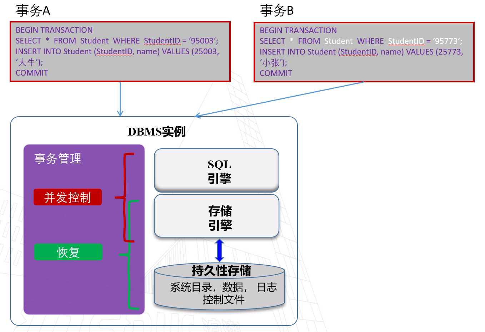

事务是数据库中最小的工作逻辑单元，数据库需要保证

1. 一个事务内部的所有语句，要么都执行，要么都不执行
2. 对多事务并发存取同一数据的操作加以控制，以保证数据库的正确性

### 事务概述

事务（transaction）：访问并可能更新各种数据项的一个程序执行单元

两个关键问题：恢复与并发控制

1. 如何应对各种故障，如硬件错误、系统崩溃
2. 多事务并发执行

事务的要求：ACID

- 原子性（Atomicity）
- 一致性（Consistence）
- 隔离性（Isolation）
- 持久性（Durability）

如何保障原子性

1. 日志：DBMS 用日志记录所有的操作，事务一旦中止，可以回溯日志以回滚操作
2. 影子分页技术：对页面拷贝，事务优先在拷贝页面上执行，仅当执行提交（commit）后，才持久化可见

如何实现一致性：DBMS 本身无法控制和确保事务的一致性，**保证事务一致性**应是上层应用的职责

隔离性：事务之间相互隔离，即对并发执行的其他事务无感知

- 注意保证隔离性并不等于无法并发，而是需要加上并发控制

持久性实现技术：日志；影子分页技术

### 事务调度

数据库是共享资源，为了充分利用系统资源，应尽可能使得多个事务并发执行。现阶段许多计算机具有多个中央处理器或一个处理器具有多个运算器，使得事务的并发执行更为容易。为了在提高事务并发性的同时保证事务的ACID特性，我们需要合理设置事务并发执行的顺序，即进行事务的调度

- 事务调度：多个并发事务的操作穿插执行的顺序

事务的穿插执行可能破坏一致性（C）

什么样的调度是正确的

- 串行调度：没有事务调度，严格将事务依次执行（只要上层实现了一致性，串行调度将不会破坏 C）
- 可串行化调度：如果一个调度 S 等价于另一个**串行化**的调度 S’，那么这个调度 S 称为可串行化的
- 调度等价
  - **冲突**可串行化
  - 视图可串行化

什么是冲突？操作 Ai 和操作 Aj 冲突，当且仅当他们分属两个事务，都访问同一数据元组 Q 且至少有一个为 W 写操作，如

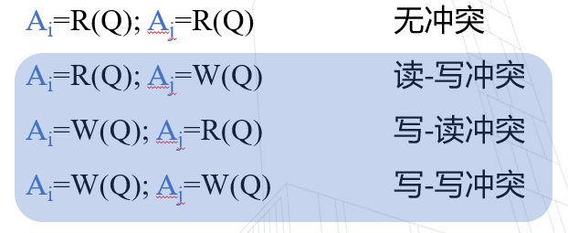

我们假设`A = 1000, B = 2000`

读写冲突 →

- 不可重复读：在一个事务中，前后重复读同一元组，元组存在改变（两次读之间数据被写了）
- 幻读：事务的前后两次`count(*)`不一致，中途有另一个事务进行了写操作新增了数据条目

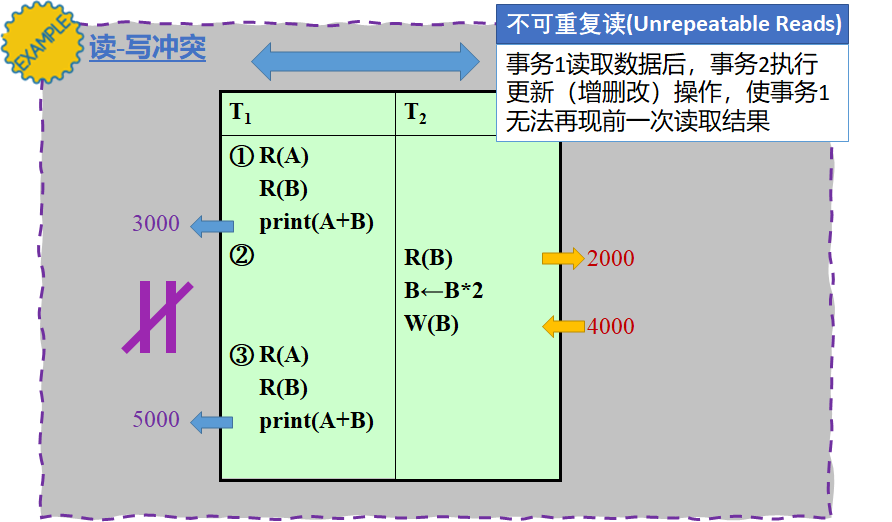

写读冲突 → 脏读：读到了写过程中的临时数据，即读到了未提交 uncommitted 的数据

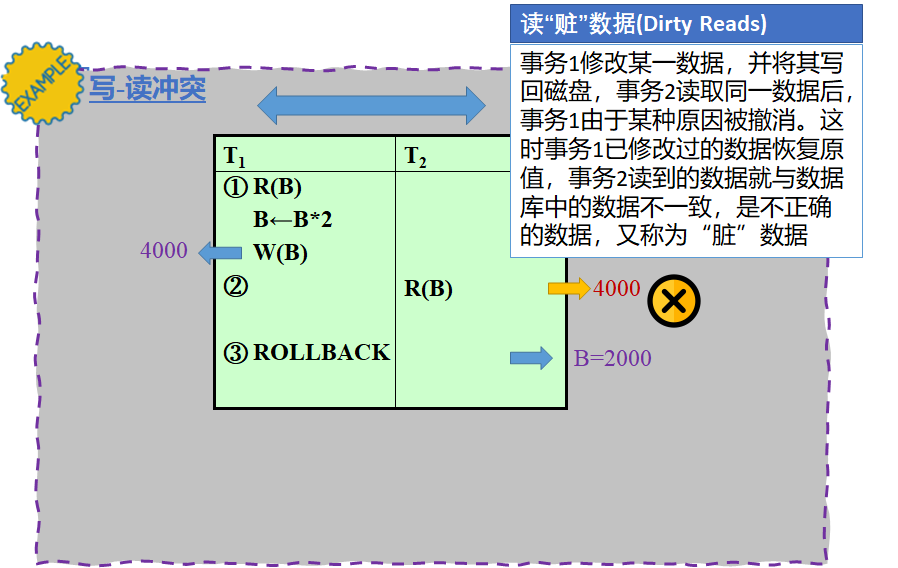

写写冲突 → 丢失修改：写写没加锁，覆盖了一次写的提交 commit

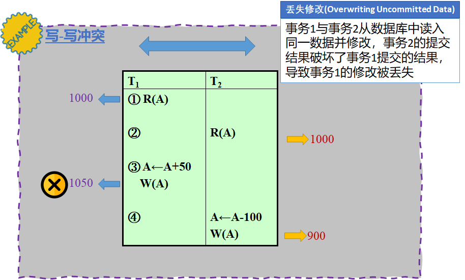

冲突等价

- 当调度 S（包含若干事务）仅通过交换若干无冲突的操作的次序可得到调度 S’，则称调度 S 和调度 S’ 冲突等价
- 所有有冲突的操作间的次序不变：读写、写读、写写

若冲突等价的调度 S' 是串行调度，那么我们说调度 S 是冲突可串行化的

如何判断一个调度是冲突可串行化？优先图 precedence graph

- 有向图
- 节点：事务
- 有向边：两个事务的操作冲突（读写、写读、写写）
- 操作在先的事务 **→** 操作在后的事务
- 可结合涉及的操作数对边做标记

冲突可串行化测试：有向图的环检测

视图等价

- 当调度 S 和调度 S’ 包含相同事务集合，且满足下述条件，则称调度 S 和调度 S’ 视图等价
  1. 对于每个数据项 Q，若事务 Ti 在调度 S 中读取了 Q 的初始值，那么在调度 S’ 中 Ti 也必须读取 Q 的初始值
  2. 对于每个数据项 Q，若在调度 S 中，事务 Ti 执行了 R(Q) 并且所读取的那个值是由事务 Tj 执行 W(Q) 操作产生的，则在调度 S’ 中，Ti 的 R(Q) 操作所读取的 Q 值也必须是由 Tj 的同一个 W(Q) 操作产生的
  3. 对于每个数据项 Q，若在调度 S 中（如果有）事务执行了最后的 W(Q) 操作，则在调度 S’ 中该事务也必须执行最后的 W(Q) 操作
- 条件 1 和 2 保证了两个调度中每个事务读取相同的值
- 条件 3 和前两个条件一起保证了两个调度产生相同的最终状态

视图可串行化：当调度 S 与另一串行调度 S'' 是视图等价的，则称调度 S 是视图可串行化的

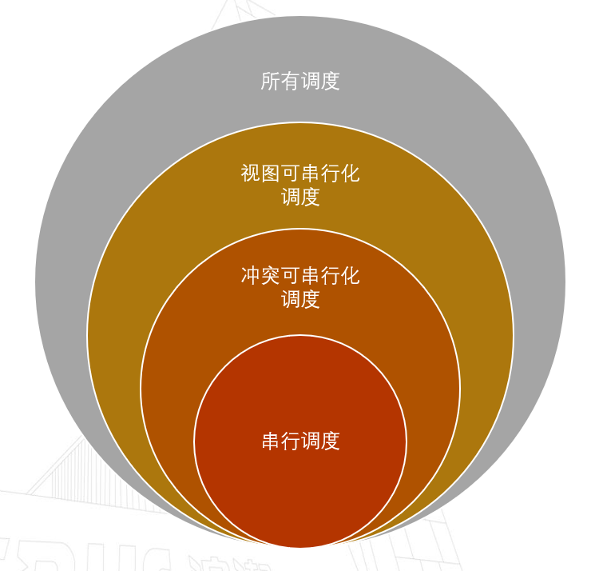

### 并发控制技术

并发控制机制：根据某种协议、准则实现将多个并发事务的操作穿插执行，同时还能维护隔离性（从单独事务的视角看仍是独立执行）

并发控制机制分类

- 乐观的并发机制：认为冲突很罕见，仅在发生时进行处理，如在检查后发现该事务执行过程中出现冲突影响了可串行性，则撤销该事务
- 悲观的并发机制：认为冲突很普遍，将冲突尽可能扼杀在摇篮，会限制系统性能

基于锁的并发控制（悲观的）

- 互斥锁：如果一个事务获得了互斥锁，既可读又可写
- 共享锁：如果一个事务获得了共享锁，只可读不可写

基于时间戳的并发控制（乐观的）：对每个数据项维护两个时间戳，读时间戳和写时间戳，记录数据项最近一次被读/写的时间

其他并发控制

- 基于 MVCC 的并发控制：根据版本快照实现，会产生多余的快照
- 基于有效性检查的并发控制

### 数据库日志和恢复

数据库日志：每次更改数据之前，先在日志中添加对应的记录

- 作用：事务日志是数据库的重要组件，如果系统出现故障，则可能需要使用事务日志将数据库恢复到一致状态
- 意义：支持多用户同时操作；恢复错误事务

日志分类：错误日志、普通查询日志、二进制日志、中继日志、慢查询日志、DDL 日志

日志规则：undo 撤销、redo 重做、binlog 写入二进制文件

数据库恢复算法

- 故障前策略
- 故障后机制
- 基于日志的恢复

## 向量数据库

### 向量数据库简介

向量数据是**人工智能**理解世界的数据形式

- 现实世界的实体具有多模特性，如文本、图片、图、时间序列等
- 嵌入模型可以将这些实体转换为向量，利用向量来表征原始实体的语义信息
  - CNN、Word2Vec、Doc2Vec 和 Node2Vec 等
- 寻找相似的实体转换为寻找相似的向量
  - 实体的相似性查询
  - 向量的相似性查询

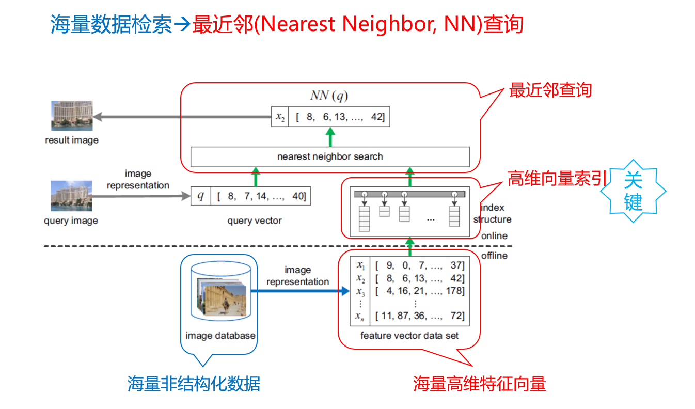

检索增强生成

- 大模型存在幻觉、训练周期长、知识更新不及时等问题
- 使用外部知识库进行检索增强生成（Retrieval-Augmented Generation, RAG）
- 向量数据库在 RAG 中起到关键作用，已经成为支撑大模型的重要基础设施

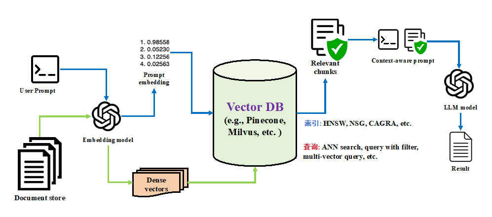

向量数据库分为

- 专用向量数据库：专门用来进行向量存储和查询，如 Faiss、Milvus 等等
- 通用向量数据库：在关系数据库系统中支持向量检索，如 PASE

最近邻查询是向量数据库的基础操作

- 最近邻查询：给定一个查询向量 q，找到数据集中距离 q 最近的向量 → “维数灾难”，精确最近邻查询效率低
- 近似最近邻查询：给定一个查询 q，找到数据集中距离 q 足够近的向量 → 近似可以用查询结果的 recall 或 distance ratio 来衡量

设计查询方法主要考虑的因素

- 存储介质与数据规模相关
- 索引结构选取与查询性能直接相关
- GPU 提升查询效率（吞出率）
- 距离计算是查询过程的主要开销来源

经典查询场景：（数据+索引）存放在内存中，使用索引（图索引效果较好），CPU 进行计算，不考虑距离加速技术

典型查询方法

- Baseline 解决方案 —— 线性扫描（Linear Scan）
- 有效的 NN 方案，需要高效的索引结构

索引是常见的近似最近邻查询方法，常见的索引有局部敏感哈希（LSH）、倒排文档、树、图索引等，其中图索引查询性能最好

 图索引参数的选取，可以基于机器学习进行

- 建立构建参数 → 查询性能的预测模型
- 根据小样本训练数据，筛选少数高质量的候选构建参数

| 方法     | 构建时间          | 存储空间   | 查询性能 |
| -------- | ----------------- | ---------- | -------- |
| LSH方法  | `O(n*d*m*l)`      | `O(n*l)`   | 较差     |
| 树形结构 | `O(n*log n*d)  `  | `O(n*d)`   | 较差     |
| 倒排文档 | `O(t*n*k*d)`      | `O(k*d+n)` | 一般     |
| 邻域图   | `O(nt*d),  1<t<2` | `O(n*k)`   | 好       |

### 大规模向量数据库

海量高维数据：百亿千维，大约 40TB，数据+索引无法放进单机内存中

解决方案

1. 数据压缩（in-memory）：对数据集进行量化压缩，使压缩数据集可放置在主存中
   - 优点：内存占用小，配合倒排索引等手段搜索延迟可接受
   - 缺点：有损压缩，搜索准确度（recall）低 
2. 数据分片（in-memory）：将数据划分为不相交的分片，每台机器托管一个分片并独立构建索引
   - 优点：搜索延迟低，精度高
   - 缺点：更高的内存使用量以及机器使用数，成本开销大
3. 外存方法（in-disk）：将索引和数据放在外存（Disk/SSD）
   - 优点：单机下可执行查询操作，需要的计算资源少
   - 缺点：导致搜索延迟灾难性增加以及吞吐率下降

向量压缩技术

- 力求空间小、查询精度损失小以及较高的查询效率
- 常见的向量压缩技术有：哈希、标量量化以及乘积量化

I/O 高效算法，即外存方法：核心思想是对内存算法进行适配，在原始向量上进行距离计算

早期方法

- VA-File
- LSH 方法
- 假设内存足够小，内存并不预先存放索引或数据

近期趋势

- IVF 方法
- 图索引
- 假设内存虽然不足以存放索引+数据，但仍具有相当存储空间
- 实际上是内存-外存混合存储方法，将一部分索引或数据存放在内存中，用于减少 I/O 开销

### GPU 向量数据库

在进行近似最近邻查询时，GPU 相对于 CPU 的优势主要体现在以下几个方面

- 并行性：GPU 的计算核心数（>1万）远远大于 CPU（几十），可以很好处理查询中的距离计算 
- 内存带宽：大量的数据需要频繁地在内存中读写，GPU 的高显存带宽可以显著减少这种操作的延迟
- 专用硬件加速：Tensor Cores 可以进行高效的矩阵乘法，这在某些类型的距离计算中非常有用

GPU 图索引构建

- SONG 没有提出适配 GPU 的图索引，使用 HNSW 做为图索引
- GANNS：Divide-and-Merge
- GGNN：Divide-and-Merge
- CAGRA：KNNG构建 + 剪枝

这些方法都假设所有的数据（向量+索引）都能放在 GPU 显存中，因此构建过程不存在主存-显存之间的数据传输，所以这种假设其实并不能用于处理真正的大规模数据

GPU 图检索

设计关键 

- 原则：提高 GPU 利用率
  - 提高每个操作的并行性，减少单线程操作
  - 提高每轮迭代的计算量，特别是距离计算量
- 一个 thread block 处理一个 query
  - 避免不同 SM 之间的数据交换和同步
  - 一个 SM 的计算单元足够多（128 CUDA cores/SM， RTX A6000）

近似最近邻查询的主要操作

- 定位候选点
  1. 确定下一轮扩展点的集合
  2. 访问每个扩展点的边集，确定下一轮的候选点集合
- 距离计算：并行计算每个候选点的距离，充分发挥 GPU 的并行计算能力
- 维护数据结构：查询过程中的关键数据结构需要更新

需要维护的数据结构 

- 候选扩展点集合（expansion set）：候选扩展点集合
- 候选计算点列表（candidate list）：待进行距离计算点 ID 列表
- 临时结果集（topk）：当前找到的最近邻列表
- 已访问节点列表（visited）：为了防止重复计算某个候选点的距离（bitmap or hash table）

### AI4VectorDB

AI 之于向量数据库，有哪些作用，在传统的向量数据库设计中

索引构建

- 索引参数影响索引的查询性能，如 IVF、HNSW 等
- 常见方法：Grid Search, Random Search，人工调参，黑盒算法
- 缺点：参数空间大、调优开销巨大
- 目前的方法并不将参数测试的开销计入总开销当中，因此并不实用

查询

- 查询参数同样影响查询性能， 如 IVF 的 nprobe、HNSW 的 efSearch 等
- 缺点：同样的性能要求，不同查询最优查询参数不一样，但现有方法只能设置统一的参数
- 80-20现象：80% 的查询只需要较小的查询参数，而 20% 的困难查询决定了查询参数的取值

距离计算：查询过程中的主要开销来自距离计算

一些前沿方法，主要都是机器学习技术在图索引向量数据库中的应用

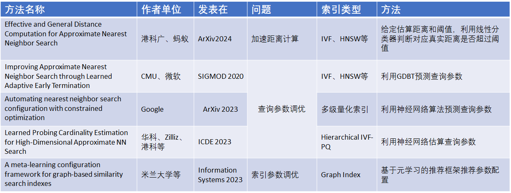

### 通用向量数据库

通用向量数据库 VS 专用向量数据库

- 接口设计
  - 专用向量数据库通常提供专门为向量搜索优化的接口：Milvus 和 Faiss 提供了丰富的 API 和 SDK，专门用于高效的向量搜索和管理
  - 通用向量数据库旨在在现有 RDBMS 框架内提供对向量数据的支持：通过扩展 SQL 语法来支持向量查询
- 数据存储布局
  - 专用向量数据库：数据存储在内存中，通过内存指针直接访问
  - 通用向量数据库：数据存储在外存中，需要适配现有的关系存储模型：例如 PASE 需要遵循 PostgreSQL 的页结构，访问通过缓冲区管理器

通用向量数据库需要解决的问题

- 基础功能支持
  - 向量数据、索引数据的存储表示
  - 向量操作的接口设计
- 性能优化：内存管理和外存存储优化
- 新功能支持：动态数据管理：处理数据更新的同时保存高效查询性能
- 更强算力的计算平台
  - 支持多线程、分布式计算以提高查询性能
  - 异构计算：充分利用涉及CPU，GPU等计算单元的异构计算平台性能

单机版：PASE 及分析（PostgreSQL）

PASE（Wen Yang et. al. PASE: PostgreSQL Ultra-High-Dimensional Approximate Nearest Neighbor Search Extension）

- 支持两个常用的向量索引: IVFFlat 和 HNSW
- PASE 索引由两部分组成：索引存储层和索引功能层
- PASE 的索引存储层包括单页结构、页面的组织、连续存储以及高维向量的跨页存储
- PASE 的索引功能层建立在 IndexAmRoutine 之上
  - 索引构建模块、索引扫描模块和一个通用模块
  - 通用模块 ：向量数据格式解析器、向量相似度计算模块

分布式版：AnalyticDB-V

高维向量的实时管理

- PostgreSQL 和 MySQL 等在线数据库系统只适用于较低维度
- Faiss 等向量相似性搜索引擎离线处理和构建索引，无法处理实时更新

混合查询优化：如何平衡查询精度和查询效率？

高可扩展性和并发性

- 分布式系统擅长处理大规模的数据和工作负载
- 有效提高查询吞吐率
- 快速索引新插入数据

AnalyticDB-V：一个用于混合查询的实时分析引擎，简称 ADBV

- Lambda 架构：流处理层和批处理层，支持数据实时更新
  - 流处理层：使用图索引（HNSW）管理增量数据
  - 批处理层：使用基于量化索引来管理基线数据
  - 定期将流处理层数据合并到批处理层
- ANNS 算法：Voronoi Graph Product Quantization (VGPQ)
- 基于成本和查询准确度的混合查询优化规则

## 向标混合检索技术

混合检索：即有效地结合标量数据和向量数据，从而实现更精准的综合查询结果，这种技术在电子商务、医疗影像、内容推荐领域得到广泛应用

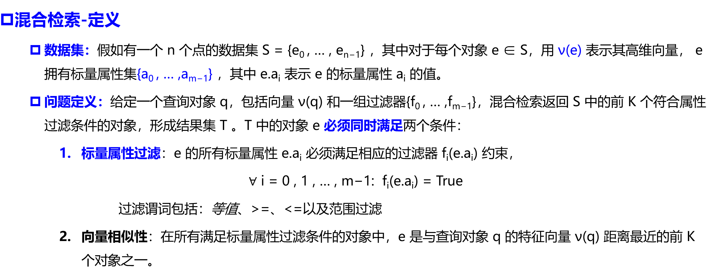

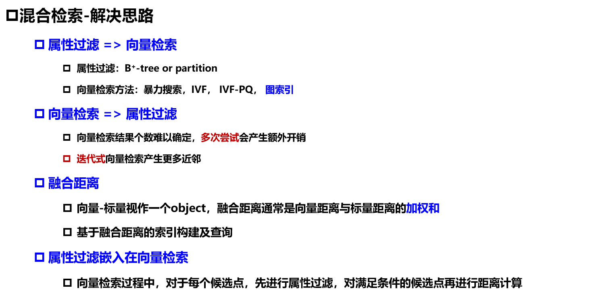

数据库中的混合索引

- AnalyticDB-V 阿里 VLDB 2020 通用向量数据库
- Milvus Zilliz SIGMOD 2021 专用向量数据库
- VBASE 微软 OSDI 2023 通用向量数据库

混合索引算法最新进展

- 支持标签过滤的方法：HQANN（快手）、NHQ（杭电）、Filtered-DiskANN（微软）
- 支持范围过滤的方法：SERF（阿里）、β-WST（MIT）
- 支持谓词不可知过滤的方法：ACORN（斯坦福）
