## 数据库内核概述

### 关系型数据库

数据管理技术三个阶段

- 人工管理
- 文件系统
- 数据库系统

数据库系统（DBMS）

- 数据库 DB
- 数据库管理系统 DBMS：管理数据库软件
- 数据库系统 DBS：引入数据库后的计算机系统

DBMS 主要功能：1️⃣ 数据定义功能 2️⃣ 数据组织、存储和管理 3️⃣ 数据操纵 4️⃣ 数据控制 5️⃣ 数据库的建立和维护

DBMS 主要构成


关系型数据库数据模型：是严格定义的一组概念的集合。精确描述了系统的静态特性、动态特性和完整性约束条件

数据模型三要素

1. 数据结构
2. 数据操纵
3. 数据完整性约束

按照模型应用的不同目的，数据模型可分为

- 概念模型：用于数据库设计
- 逻辑模型：数据库存储
- 物理模型：底层存储

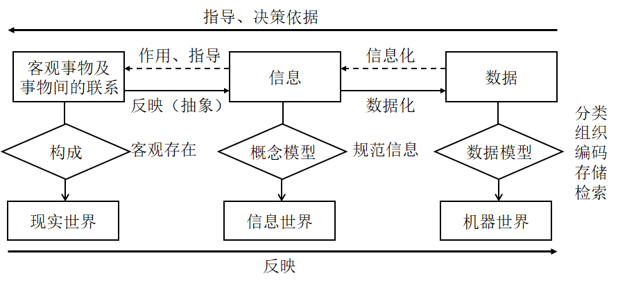

#### 概念模型

常用的概念模型：E-R 图

联系的类型


完整的 E-R 图


#### 逻辑模型

数据库领域常用的逻辑数据模型

1. 层次模型
2. 网状模型
3. 关系模型
4. 面向对象模型
5. 对象关系模型

层次模型示意图，每个节点的双亲是唯一的，多对多表示不自然


网状模型的实现

- 将多对多联系分解成两个一对多联系
- 对于带属性的联系单独作为一组记录


结构比较复杂，而且随着应用环境的扩大，数据库的结构就变得越来越复杂，不利于最终用户掌握

关系模型：关系型数据库所用的模型，就是 MySQL 这类数据库使用的逻辑模型

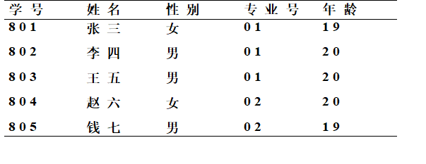

优点

- 建立在严格的数学概念的基础上
- 概念单一，数据结构简单、清晰，用户易懂易用
  - 实体和各类联系都用关系来表示
  - 对数据的检索结果也是关系
- 关系模型的存取路径对用户透明
  - 具有更高的数据独立性，更好的安全保密性
  - 简化了程序员的工作和数据库开发建立的工作

缺点：存取路径对用户透明导致查询效率往往不如非关系数据模型，为提高性能，必须对用户的查询请求进行优化（例如索引），增加了开发数据库管理系统的难度

### 关系型数据库内部架构

#### 总体环境

C/S 模型

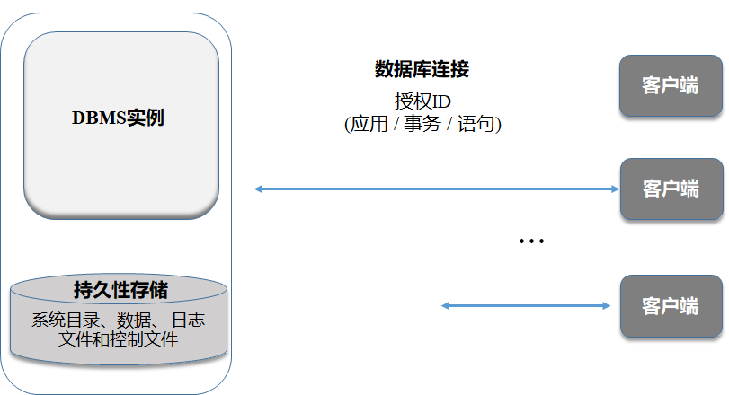

一般场景

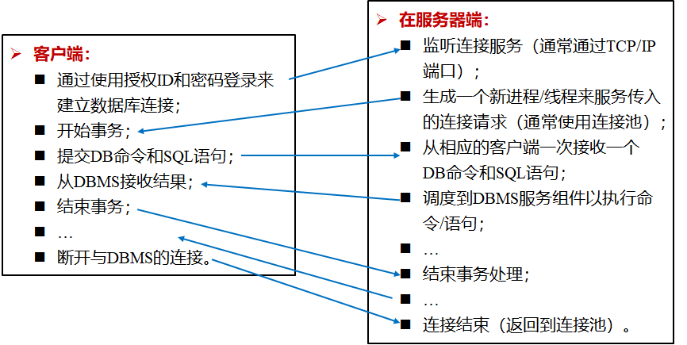

进程模型和代理池


DBMS实例是一个可重入的系统：相同的代码副本由子进程/线程共享

DBMS系统通常带有“主”进程

- 维护一个“代理”池，每个代理本质上都是 DBMS 本身的副本
- 代理 = 进程模型（90年代早期）：每个 DB 代理都是一个子进程
- 代理 = 线程模型（90年代中期）：每个 DB 代理都是一个子线程
- 代理 = 协程模型（现在）：每个代理都是一个子协程
  - 监听传入的连接请求
  - 为新的连接请求分配一个可用的代理
  - 为了自我保护，对收到的请求进行截流
  - 在连接结束时，使代理退出执行，并存放到到代理池中

#### SQL 引擎

在刚刚的主从结构中，每个 DBMS 实例都由 SQL 引擎、存储引擎和持久性存储三个部分组成


SQL 引擎

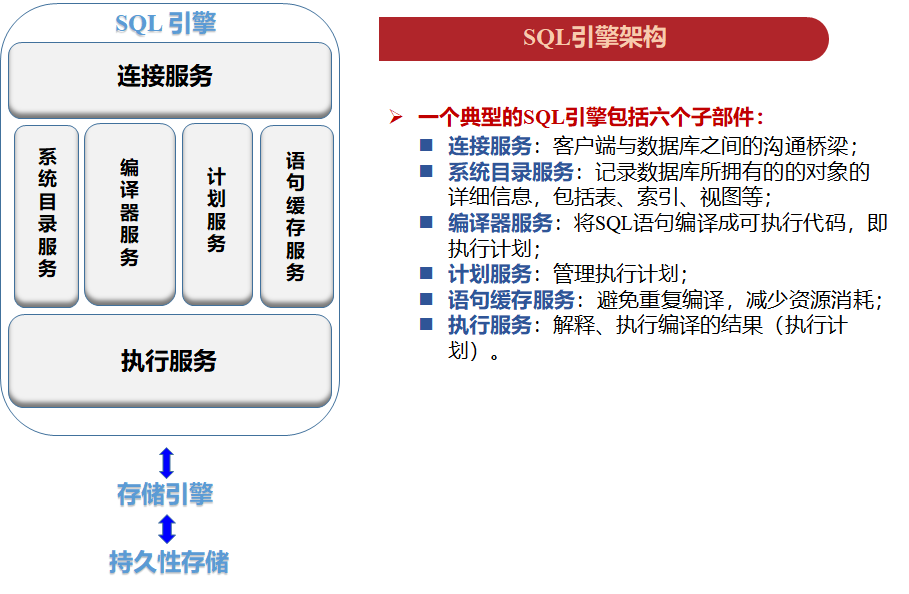

其中

1. 系统目录服务本质上是通过一些系统表来定义数据库内容的机制
2. 编译器的功能是将一条SQL语句编译成执行计划
3. 计划服务将程序文件进行预编译和包绑定
4. 语句缓存服务保留之前SQL的编译结果（执行计划），从而避免重复编译同一条SQL语句
5. 执行服务用来执行编译的结果，即执行计划

#### 存储引擎

存储引擎承接 SQL 引擎，管理整个系统的共享资源


一个典型的存储引擎包括六个子部件

- 数据服务：针对用户数据，提供高效的访问机制
- 索引服务：针对索引，提供高效的访问机制
- 序列化服务：管理共享资源，解决访问冲突
- 工具箱：包含管理共享资源的常用工具，如磁盘碎片整理工具等
- 数据缓存服务：起到桥梁作用，上述四个服务从缓存服务读取数据；同时，缓存服务将数据从底层存储加载到内存中
- 恢复服务：当数据库服务器发生宕机时，恢复服务对用户已经提交成功的数据进行恢复

#### 垂直服务部件

垂直服务部件通常横跨 SQL 引擎和存储引擎


他包括

- 事务服务
  - 有关事务的管理，包括事务的开始、结束、写日志记录等
  - 事务的开始和结束时在SQL引擎完成的，很多任务是在存储引擎完成的
- 仪器服务
  - 数据库包含很多计数器，记录数据库运行的行为数据
  - 例如增删改SQL语句的数量、缓存命中率等
  - 这些行为数据即涉及SQL引擎，也涉及存储引擎
- 负载服务
  - 数据库允许用户从业务出发来定义负载，设置不同事务（TP、批量作业和AP）的优先级
  - 因此，需要赋予负载服务一定的权限来保证优先级的执行

#### 多节点数据库

多节点服务器

- 数据存储在多个服务器，计算也可以在多个服务器上并发进行，可以满足高可扩展性和高可用性
- 集群架构：共享一切（share everything），即多节点之间共享数据库所有数据，每个节点能访问和处理数据库中所有数据
- 分布式架构：无共享（share nothing），数据库数据分布到不同节点，并且数据不能共享，但是元数据是共享的

集群架构

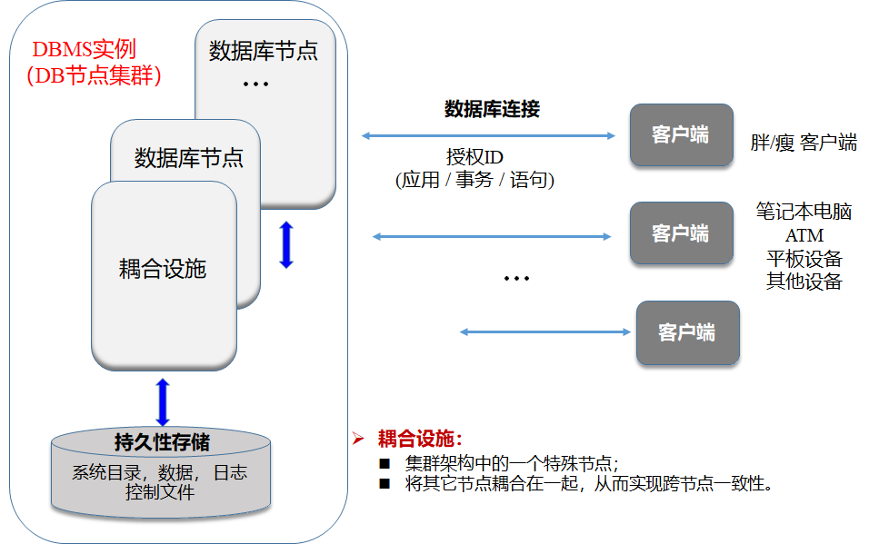

耦合设施（处理全局结构） → 快速连接数据库节点

实现两级控制

- 全局级控制：进行跨节点的控制
- 节点级控制：与单节点数据库的控制一致

结构

- 时钟：快速访问全局锁
- 序列化
  1. 任何数据从磁盘读到缓存，以及从缓存写到磁盘，都需要通过耦合设施；
  2. 进行数据更新时，需要使用锁机制：加锁前要先在耦合设施中注册，声明拥有某一页的副本及对该副本的意图；在没有其它节点对对该副本进行更新操作或仅有只读操作时，才能进行加锁；加锁以后，耦合设施使其它数据副本失效，从而保证数据一致性
  3. 对数据缓存、目录缓存和语句缓存等共享数据的访问，也需要进行序列化
- 日志：本地日志文件，日志合并
- 事务：全局事务 ID，全局日志记录序列号（log record sequence number, LRSN）

高可用性（CAP 原则中的 A）：在任何情况下，特别是节点宕机、硬件升级维护和软件升级维护时，数据库系统都可以做到不关闭、相关业务和应用不中断

- 自动**容灾机制**
  - 当出现节点失效时，系统可以通过共识协议来接管失效节点，使失效节点上未提交的事务失败
  - 系统释放失效节点的主本节点角色，并为其上的主本数据分配新的主本节点
  - 其余的DB节点共享其工作负载
- 硬件升级维护
  - 加入/退出一个 DB 节点
  - 重新为下线的数据分区分配主本节点
- 软件迁移维护
  - 退出一个DB节点并迁移软件（例如：DB释放迁移）
  - 加入这个DB节点并以“共存”模式运行在DB集群中
  - 重复相同的过程，直到所有节点都成功迁移

分布式架构（CAP 原则中的 P）


分布式协议

- 分布式数据库底层通过共识协议实现去中心化
- 分布式架构没有耦合设施的概念，它的每一个节点是对称的

缺点

- 由于主副本的存在，在执行 SQL 语句时，主本节点多出了等待日志传输完成的动作
- 由于分布式存储，上层并不清楚数据的具体存放位置，在计算执行时，需要通过额外的计算来获取数据的存储位置
- 在执行时，可能要进行跨节点数据访问，而跨节点访问通过 TCP/IP 协议实现，因此效率很低
- 分布式数据库适用于互联网和物联网应用场景（高可扩展性、大量并发读操作、少量写操作），这与传统的数据库应用场景有很大差异

## 存储和索引技术

### 物理存储介质


传统磁盘 HDD 的性能标准：访问时间、传输速率、磁盘块大小

顺序访问和随机访问

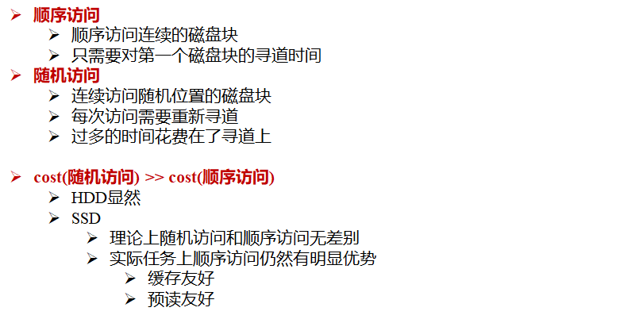

### 面向磁盘的数据结构设计

> 页间组织和页内存储

页间组织结构：链表堆文件

业内存储

1️⃣ 面向元组的存储方式

- 定长元组存储
- 变长元组存储：分槽页面结构
- 超长元组存储

2️⃣ 面向列的存储

行存并不是 DB 的标准，在特定类别的负载上不是最优的选择

- OLTP：简单独写少量数据；通常只涉及一个或少量元组；点查询
- OLAP：读取大量数据；涉及大量元组；通常周期性执行于 OLTP 应用形成的充足数据上
- HTAP（OLTP + OLAP）

### 缓冲池

什么是缓冲池

- 内存中的一部分空间
- 一系列相同大小 pages 构成的数组
- 数组元素—帧（frame）

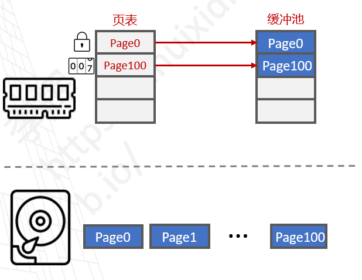

缓冲池的优化设计

- 多缓冲池
- 预取 Prefetching
- 共享游标
- 略过
- OS 页面缓存

缓存替换策略 / 页面替换算法

- LRU 最久未使用
- CLOCK 时钟置换

一些缓存问题

1. 顺序洪泛
2. 锁（脏页面）

### 索引

索引的设计目标

- 组织：如何在内存及页面中布局；存储什么信息以加速访问
- 并发：如何支持多线程的并发访问

索引分类

- 聚簇索引（主索引）
  - 搜索码还定义了文件的次序，即元组在文件中的存储按聚簇索引的搜索码顺序组织
  - 聚簇索引的搜索码通常是主键，但也可以是其他属性（组）
- 非聚簇索引（辅助索引）**:** 其搜索码的顺序与文件内元组顺序不同

索引顺序文件：按照某种搜索码顺序存储的文件

- 稠密索引
- 稀疏索引

常见索引类型

- 顺序索引：搜索码按顺序组织
- B+ 树索引：平衡树结构
- 哈希表索引：搜索码按照某个哈希函数平均分布到若干个桶中

B+ 树索引


哈希表


## 查询处理和优化

SQL 引擎的工作：声明式的 SQL → 过程式的执行计划

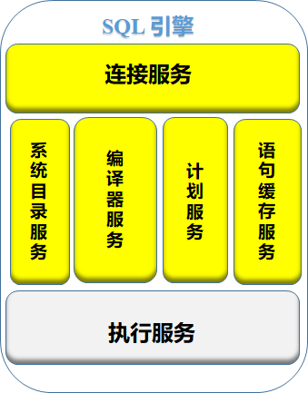

整体流程

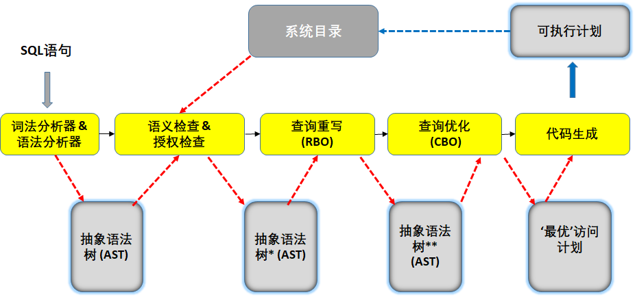

### 查询解析

编译器（前两个黄色块）

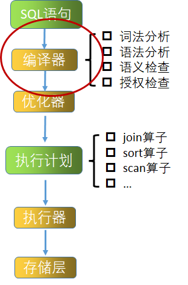

第一颗抽象语法树

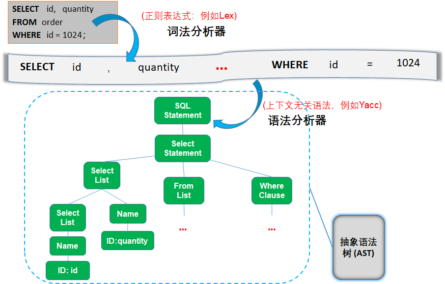

通过词法分析器 / 语法分析器进行构建（Flex / Bison）

自动生成的词法分析器（如 Lex）

- 使用正则表达式来定义元语言
- Lex 将正则表达式作为输入，生成对应的词法分析器

自动生成的语法分析器（如 Yacc）

- 使用元语言定义 SQL 的语法规则
- Yacc 将语法规则作为输入，生成对应的语法分析器。该语法分析器实际上是一个下推自动机（pushdown automata），或带栈自动机（automata with a stack）

语义处理的关键操作：移进（将字符标记放入栈中）和规约（用非终结符代替栈的顶部元素）

SQL 语言的词法规则示例（正则式）

```
ID    [a-z][a-z0-9]+ 
Keyword   select | from | where 
SEP  , | ; 
OP    = | + | < 
INT    [0-9]+ 
```

语法分析器

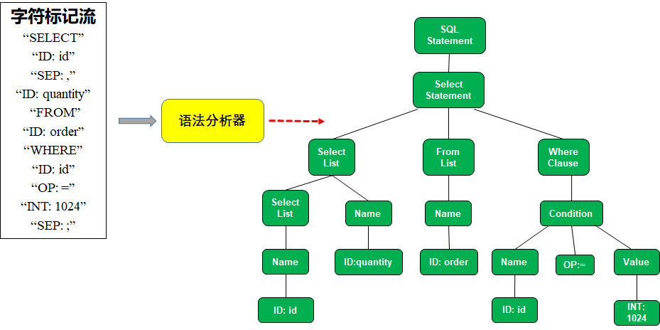

SQL 语言的上下文无关语法示例

```
Rule 1： <SQL Statement> ::= <Select Statement> | <Insert Statement> | <Update Statement>
Rule 2：<SelectStatement> ::= SELECT <SelectList> FROM <FromList> WHERE <WhereClause>';'
Rule 3：<SelectList> ::= <SelectList>, <Name> | <Name> | '*'
Rule 4：<Name> ::= <ID> | <ID>.<ID>
Rule 5：<FromList> ::= <FromList>,<Name> | <Name>
Rule 6：<WhereClause> ::= <Condition>
Rule 7：<Condition> ::= <Name> <OP> <Value> | <Condition> AND <Condition>
Rule 8：<Value> ::= <INT> | <FLOAT> | <DOUBLE>
```

语义检查 & 授权检查

语义检查是一个自底向上不断交替进行**名称解析**、**类型解析**、**函数解析、类型匹配**并判断正误的过程

以`SELECT F(c1,3) FROM T WHERE c2>10;`为例

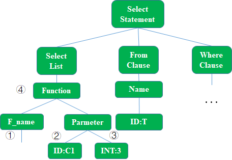

- 名称解析，例如 ① 函数名 F 和 ② 列名 c1
- 类型解析，例如确定 ② 列 c1 的数据类型
- 函数解析，例如 ④ 函数 F(c1,3)
- 类型匹配，包括类型转换和类型提升

授权检查

- 授权ID
- 对象：表，视图，函数等
- 操作：`SELECT, INSERT, DELETE, UPDATE, CREATE, DROP, ALTER`等等
- 特权：是/否
- 高级功能
  - 受信任上下文
  - 细粒度的访问控制(行级权限、列屏蔽等)

在语义检查和授权检查后，构造了第二颗抽象语法树

### 逻辑重写

优化器

#### 基于规则的优化

基于规则的优化（Rule-based Optimization, RBO）

- 查询的逻辑重写，以尽可能减少不合理的开销
- 基于（关系代数的等价变换）规则
- 调整操作顺序
- 生成：由逻辑运算符组成的逻辑计划（树）
  - 逻辑运算符：关系代数的算子（π，σ，⋈，…）
- 与关系实例无关

关系代数的等价变换规则

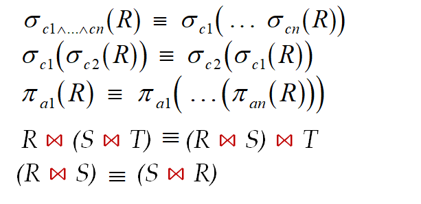

本质上是基于关系代数的等价变换规则进行优化

- 初始逻辑计划 → 最优逻辑计划
- 提高最优（执行）计划被选择到的概率
- 实例无关

RBO 通用规则

- 复合谓词拆分
- 谓词下推
- 笛卡尔积 → 连接
- 投影下推

其他重写规则：嵌套查询、类似视图的处理、表达式重写

#### 基于代价的优化

基于代价的优化（Cost-based Optimization, CBO）

- 查询的物理优化
- 使用代价模型，对操作进行代价估计
- 衡量所有可能的执行方式，选择执行代价最小的
- 生成：由物理操作符组成的物理执行计划（树）
  - 物理操作符：关系代数算子的具体物理实现 （1 → n 映射）
- 与关系实例相关：需要使用实例的统计信息

一个 SQL 查询访问计划

- 访问方法：全表扫描、索引扫描、仅索引扫描（只访问索引键）
- 连接方法：查找连接、合并连接、哈希连接
- 访问路径：由于涉及到多表复合，表不同的访问顺序造成 NP-Hard 的访问路径问题

基于**统计信息**和**开销模型**，利用动态规划算法对访问计划进行优化

### 执行计划

第三部分

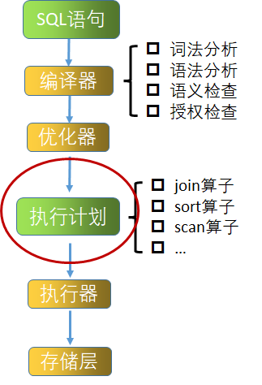

获取 CBO 输出，包括

- “最优”的物理计划
- 执行计划 QEP（Query Execution Plan）
- 算法区别 → 执行代价（cost）

确定执行模型，给定 QEP，DBMS 执行的流程

- QEP中每个物理操作符
  - 对应一段具体代码实现
- 执行模型需要考虑如何从输入关系实例，结合QEP，串联各操作符的代码实现，以输出最终结果
  - 物化模型：每一步物理操作符的中间结果物化（甚至落盘）后，用于下一步输入
  - 火山模型 / 迭代模型：物理操作符的结果元组直接发送给下一个操作符使用（每个操作符需要实现一个Next()方法），中间不需物化
  - 向量化模型：不是每次传递一个元组，而是每次一批
    以更好的利用现代CPU的SIMD指令

三种执行模型

- 物化模型：每个操作符一次性读入所有输入（元组）；一次性输出所有（元组）
- 火山模型 / 管线化模型：每个操作符看成是迭代器
  - `Open(), Next(), Close()`
  - 父节点 → 外层迭代
  - 子节点 → 内层迭代
  - 操作符（迭代层）间传递的是单个元组（投影）
  - 随时产生随时迭代处理
- 向量化模型：同火山模型，每个操作符看成是迭代器，区别在于操作符（迭代层）间传递的
  - 不是单个元组而是一批元组
  - 攒够一批进行传递
  - 最大化利用SIMD指令特性

上述是常见的**解释性执行器**，通过模型生成 CPU 指令，还有一类**编译型执行器**，通过即时编译技术 JIT（Just-in-time Compilation）生成指令

## 工业级存储引擎

以开务数据库为例

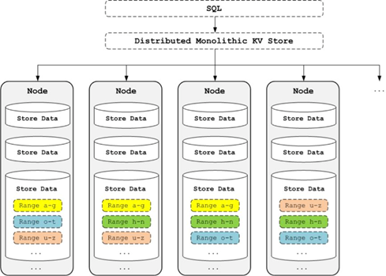

KV Store

- 将关系数据转化为Key-Value（KV）数据
- 典型：RocksDB

分布式存储

- 分布式 KV Store
- 高可用性：数据复制
- 一致性协议：**Raft**

Raft 协议：Consul 和 Nacos 的 CP 模式使用的一致性协议

### 关系的键值存储

以学生表为例，应该怎么用 KV 数据来表示这个表

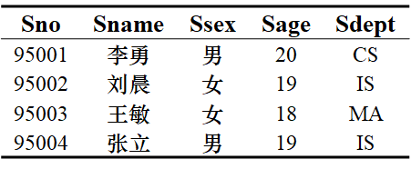

一种表示方法：key 表示字段的完整路径，value 表示对应的值，如

```
(/student/Sname/95001, “李勇”) 
(/student/Ssex/95001, “男”)
(/student/Sage/95001, “20”)
(/student/Sdept/95001, “CS”) 
```

或者用列簇表示，一个 key 对应多个值，每个值之间用空格分割

```
(/student/0/95001, “李勇 男”) 
(/student/1/95001, “20 CS”) 
```

上面分别表示列簇`{Sname, Ssex}`和`{Sage, Sdept}`对应的`ID`

开务数据库的 KV 存储就是以列簇的方式，每个 Key 对应的 Value 由如下三部分组成

- 4个字节表示的整个KV对的校验和（checksum）
- 一个字节表示的值类型（value type）
- 对于的各个域的值拼接而成的字符串

SQL 对应的 KV 插入操作如下

```sql
INSERT INTO student VALUES(95005, '孙涛', '男', 19, 'CS');
```

```
put(/student/1/95005/0, "孙涛", "男")
put(/student/1/95005/1, 19)
put(/student/1/95005/2, "CS")
put(/student/2/19/95005/0, 19, "孙涛")
put(/student/2/19/95005/1, "CS")
```

可以注意到这里涉及到很多键值

- `1/sno/0`表示学号为 sno 的姓名、性别
- `1/sno/1` 表示学号为 sno 的年龄
- `1/sno/2`表示学号为 sno 的专业
- `2/age/sno/1`表示年龄为 age 学号为 sno 的专业
- `2/age/sno/2`表示年龄为 age 学号为 sno 的年龄、性别

这样设计是为了在分组查询时较快，比如查询年龄为 19 的学生年龄和性别，只需要限定键中`2/age/sno/1`中的`age`字段即可

相对应的删除操作

```sql
DELETE FORM student WHERE Sno=95001
```

```
delete(/student/1/95001/0)
delete(/student/1/95001/1)
delete(/student/1/95001/2)
delete(/student/2/19/95001/0)
delete(/student/2/19/95001/1)
```

更新操作

```sql
UPDATE student SET Sdept=="MA" WHERE Sno=95001
```

```
put(/student/1/95001/2, ‘MA’)
put(/student/2/19/95001/1, ‘MA’)
```

查询

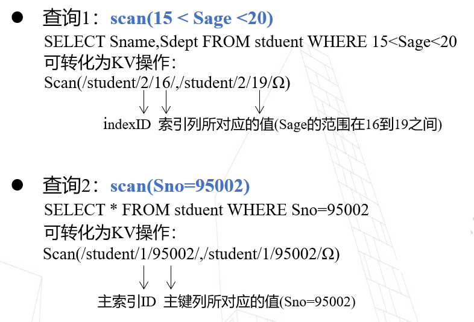

### RocksDB

架构

- 核心数据结构
  - MemTable → 一个在内存中的页面
  - SSTable → 一个页面
- LSM 引擎：`insert, delete, update, query and compactation`

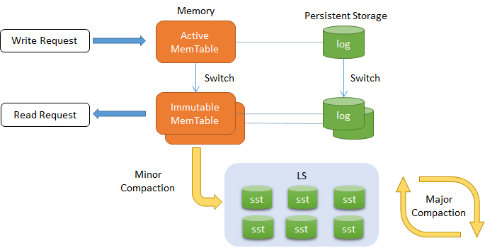

特点

- 一个可嵌入、高性能的 KV 开源数据库
- 由 Facebook 基于 levelDB 开发
- 为快速存储（SSD、RAM）而优化，延迟极小
- 大量灵活的配置，使之能针对不同的生产环境进行调优
- 完善的持久化机制，同时保证性能和安全性
- RocksDB 使用 LSM 存储引擎，纯 C++编写

#### 日志存储

1️⃣ 写

DBMS 不断插入日志记录

- 日志记录包含对元组的改变（PUT、DEL）
- 日志记录包含元组的 ID
- PUT 用来插入或修改一个记录
- DEL 将某个记录标记为删除

插入一条记录时，只需要将其附在文件末尾，无需修改之前的日志记录

当页面满了以后，DBMS 将该页面写入到磁盘上

- 顺序写入已满的页面
- 磁盘页面是不可修改的

2️⃣ 读：访问给定 ID 对应的最新元组

方法一：顺序扫描，从最新的记录开始扫描，直到遇到该ID的第一个元组

方法二：建立 ID 上的索引

- 索引保存每个 ID 对应的最新记录的位置
- 根据索引，快速找到对应元组的位置
- 如果元组在内存中，直接读取
- 如果在磁盘上，读取它

3️⃣ 数据压缩

一个页面被压缩以后，需要保持元组的时间顺序

- 保证每个元组 ID 只出现一次
- 系统会定期对数据进行压缩，来减少不必要的空间浪费

DBMS 可以对一个页面内部的元组按照ID次序进行排序

- 有助于之后的快速检索
- 这种文件被称为 SSTables（Sorted String Tables）

#### 数据结构

SSTable 的特点

- SSTable 是真正落地在磁盘上的文件
- SSTable 中的数据都是按key有序排列的
- SSTable 中存储的是大量的key-value
- SSTable 是一个可以完成自解释的文件

SSTable 文件布局

- Data Block：存储数个有序的 key-value
- Meta Block：存储 key-value 对应的 filter
- MetaIndex Block：指向 Meta Block 的索引
- Index Block：指向 Data Block 的索引
- Footer：指向 MetaIndex Block 和 Index Block 的索引（索引的索引）       

MemTable的特点

- MemTable 是存储在内存中的表，一般维护两个 MemTable
  - Active MemTable: 可写可读
  - Immutable MemTable：可读不可写
- 新写入的数据首先保存到 Active MemTable，当其 size 超过阈值（4KB），自动转化为 Immutable MemTable
- RocksDB 将 Immutable MemTable 转换为 SSTable 保存到磁盘中

MemTable 数据结构

- 使用 SkipList（跳表）来管理 KV 数据
  - 跳表是 MemTable 的核心部分，本质是有序的链表
  - 跳表中每个结点存储一个 KV 对
- 功能要求：插入、删除、修改和查询

#### 跳表

完美的**跳表**

- 键值有序排列
- O(log n) 层
- 更高一层的元素数量是下一层的 1/2
- 节点的大小（size）不一，高层的节点有更多的指针，需要更多的空间来存储

为什么选择跳表？

跳表 VS. 平衡树

- 点查询时，跳表和平衡树的时间复杂度都为 O(logn)，大体相当
- 范围查询时，平衡树操作更复杂，跳表只需找到最小值后再一层索引上遍历即可
- 平衡树上的插入和删除可能会引发子树的调整，逻辑复杂；而跳表的插入和删除只需修改相邻节点的指针
- 跳表的算法实现更简单

跳表 VS. 哈希表：哈希表只能实现点查询，不适宜做范围查询

跳表 VS. 链表

- 链表的插入时间复杂度是 O(1)
- 链表的查询、删除和修改时间复杂度是 O(n)

### 新型数据库索引

Learned Index，学习索引

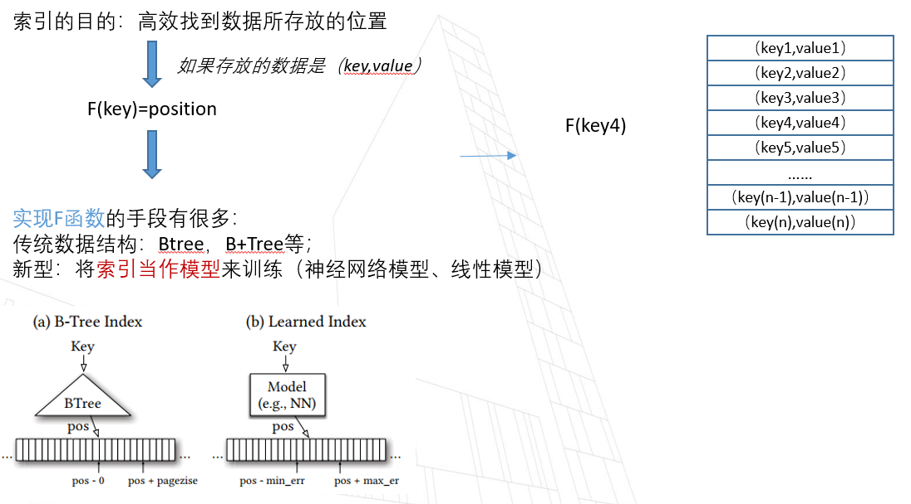

RMI（recursive-model indexes）

- [1] Kraska T, Beutel A, Chi E H, et al. The case for learned index structures[C]//Proceedings of the 2018 international conference on management of data. 2018: 489-504.

最早的 learned index，中间节点中的模型为路由模型，叶子节点存放的是最终的预测模型

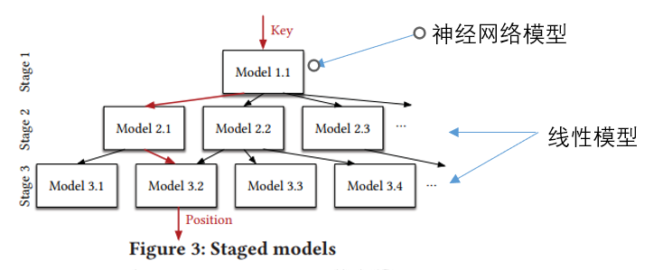

缺点：不能进行实时的写入（需要重新训练模型）；RMI 的训练成本和数据分布有很大关系

PGM（Piecewise Geometric Model index）

- [2] Ferragina P, Vinciguerra G. The PGM-index: a fully-dynamic compressed learned index with provable worst-case bounds[J]. Proceedings of the VLDB Endowment, 2020, 13(8): 1162-1175.

## 事务引擎

事务处理、并发和恢复

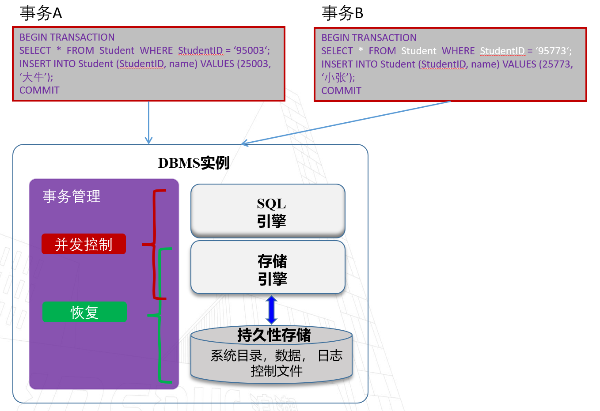

事务是数据库中最小的工作逻辑单元，数据库需要保证

1. 一个事务内部的所有语句，要么都执行，要么都不执行
2. 对多事务并发存取同一数据的操作加以控制，以保证数据库的正确性

### 事务概述

事务（transaction）：访问并可能更新各种数据项的一个程序执行单元

两个关键问题：恢复与并发控制

1. 如何应对各种故障，如硬件错误、系统崩溃
2. 多事务并发执行

事务的要求：ACID

- 原子性（Atomicity）
- 一致性（Consistence）
- 隔离性（Isolation）
- 持久性（Durability）

如何保障原子性

1. 日志：DBMS 用日志记录所有的操作，事务一旦中止，可以回溯日志以回滚操作
2. 影子分页技术：对页面拷贝，事务优先在拷贝页面上执行，仅当执行提交（commit）后，才持久化可见

如何实现一致性：DBMS 本身无法控制和确保事务的一致性，**保证事务一致性**应是上层应用的职责

隔离性：事务之间相互隔离，即对并发执行的其他事务无感知

- 注意保证隔离性并不等于无法并发，而是需要加上并发控制

持久性实现技术：日志；影子分页技术

### 事务调度

数据库是共享资源，为了充分利用系统资源，应尽可能使得多个事务并发执行。现阶段许多计算机具有多个中央处理器或一个处理器具有多个运算器，使得事务的并发执行更为容易。为了在提高事务并发性的同时保证事务的ACID特性，我们需要合理设置事务并发执行的顺序，即进行事务的调度

- 事务调度：多个并发事务的操作穿插执行的顺序

事务的穿插执行可能破坏一致性（C）

什么样的调度是正确的

- 串行调度：没有事务调度，严格将事务依次执行（只要上层实现了一致性，串行调度将不会破坏 C）
- 可串行化调度：如果一个调度 S 等价于另一个**串行化**的调度 S’，那么这个调度 S 称为可串行化的
- 调度等价
  - **冲突**可串行化
  - 视图可串行化

什么是冲突？操作 Ai 和操作 Aj 冲突，当且仅当他们分属两个事务，都访问同一数据元组 Q 且至少有一个为 W 写操作，如

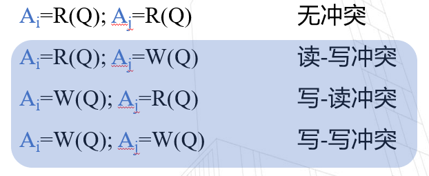

我们假设`A = 1000, B = 2000`

读写冲突 →

- 不可重复读：在一个事务中，前后重复读同一元组，元组存在改变（两次读之间数据被写了）
- 幻读：事务的前后两次`count(*)`不一致，中途有另一个事务进行了写操作新增了数据条目

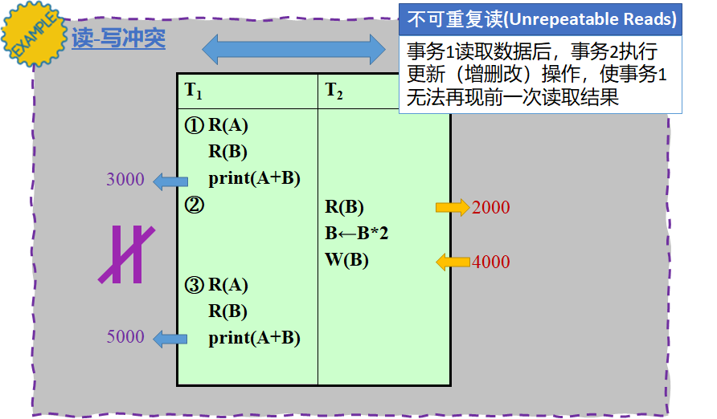

写读冲突 → 脏读：读到了写过程中的临时数据，即读到了未提交 uncommitted 的数据

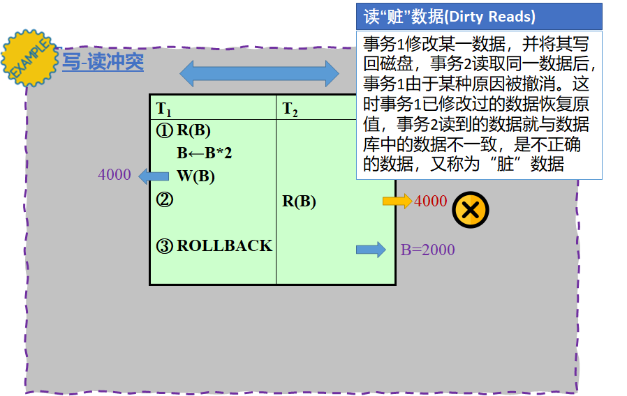

写写冲突 → 丢失修改：写写没加锁，覆盖了一次写的提交 commit

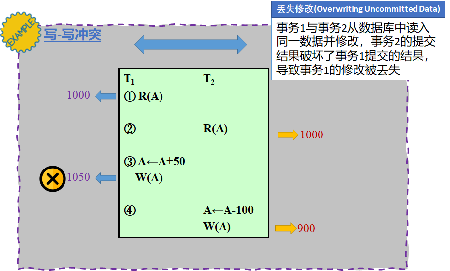

冲突等价

- 当调度 S（包含若干事务）仅通过交换若干无冲突的操作的次序可得到调度 S’，则称调度 S 和调度 S’ 冲突等价
- 所有有冲突的操作间的次序不变：读写、写读、写写

若冲突等价的调度 S' 是串行调度，那么我们说调度 S 是冲突可串行化的

如何判断一个调度是冲突可串行化？优先图 precedence graph

- 有向图
- 节点：事务
- 有向边：两个事务的操作冲突（读写、写读、写写）
- 操作在先的事务 **→** 操作在后的事务
- 可结合涉及的操作数对边做标记

冲突可串行化测试：有向图的环检测

视图等价

- 当调度 S 和调度 S’ 包含相同事务集合，且满足下述条件，则称调度 S 和调度 S’ 视图等价
  1. 对于每个数据项 Q，若事务 Ti 在调度 S 中读取了 Q 的初始值，那么在调度 S’ 中 Ti 也必须读取 Q 的初始值
  2. 对于每个数据项 Q，若在调度 S 中，事务 Ti 执行了 R(Q) 并且所读取的那个值是由事务 Tj 执行 W(Q) 操作产生的，则在调度 S’ 中，Ti 的 R(Q) 操作所读取的 Q 值也必须是由 Tj 的同一个 W(Q) 操作产生的
  3. 对于每个数据项 Q，若在调度 S 中（如果有）事务执行了最后的 W(Q) 操作，则在调度 S’ 中该事务也必须执行最后的 W(Q) 操作
- 条件 1 和 2 保证了两个调度中每个事务读取相同的值
- 条件 3 和前两个条件一起保证了两个调度产生相同的最终状态

视图可串行化：当调度 S 与另一串行调度 S'' 是视图等价的，则称调度 S 是视图可串行化的

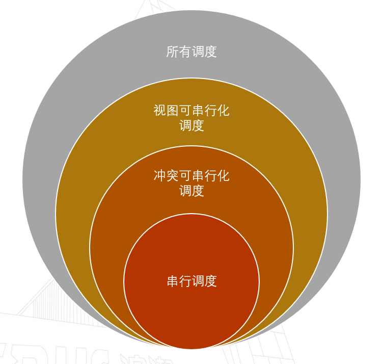

### 并发控制技术

并发控制机制：根据某种协议、准则实现将多个并发事务的操作穿插执行，同时还能维护隔离性（从单独事务的视角看仍是独立执行）

并发控制机制分类

- 乐观的并发机制：认为冲突很罕见，仅在发生时进行处理，如在检查后发现该事务执行过程中出现冲突影响了可串行性，则撤销该事务
- 悲观的并发机制：认为冲突很普遍，将冲突尽可能扼杀在摇篮，会限制系统性能

基于锁的并发控制（悲观的）

- 互斥锁：如果一个事务获得了互斥锁，既可读又可写
- 共享锁：如果一个事务获得了共享锁，只可读不可写

基于时间戳的并发控制（乐观的）：对每个数据项维护两个时间戳，读时间戳和写时间戳，记录数据项最近一次被读/写的时间

其他并发控制

- 基于 MVCC 的并发控制：根据版本快照实现，会产生多余的快照
- 基于有效性检查的并发控制

### 数据库日志和恢复

数据库日志：每次更改数据之前，先在日志中添加对应的记录

- 作用：事务日志是数据库的重要组件，如果系统出现故障，则可能需要使用事务日志将数据库恢复到一致状态
- 意义：支持多用户同时操作；恢复错误事务

日志分类：错误日志、普通查询日志、二进制日志、中继日志、慢查询日志、DDL 日志

日志规则：undo 撤销、redo 重做、binlog 写入二进制文件

数据库恢复算法

- 故障前策略
- 故障后机制
- 基于日志的恢复
