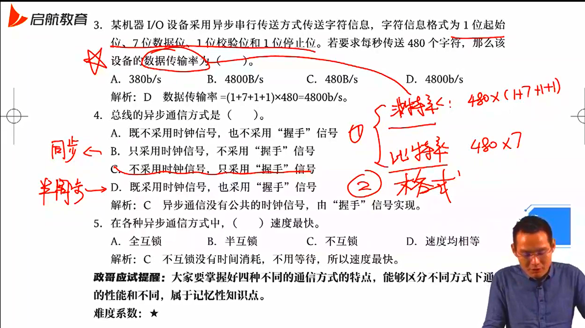
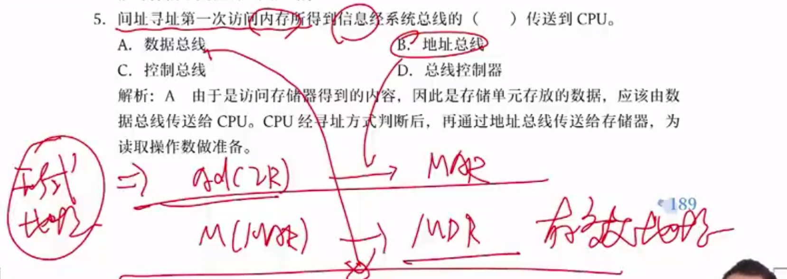
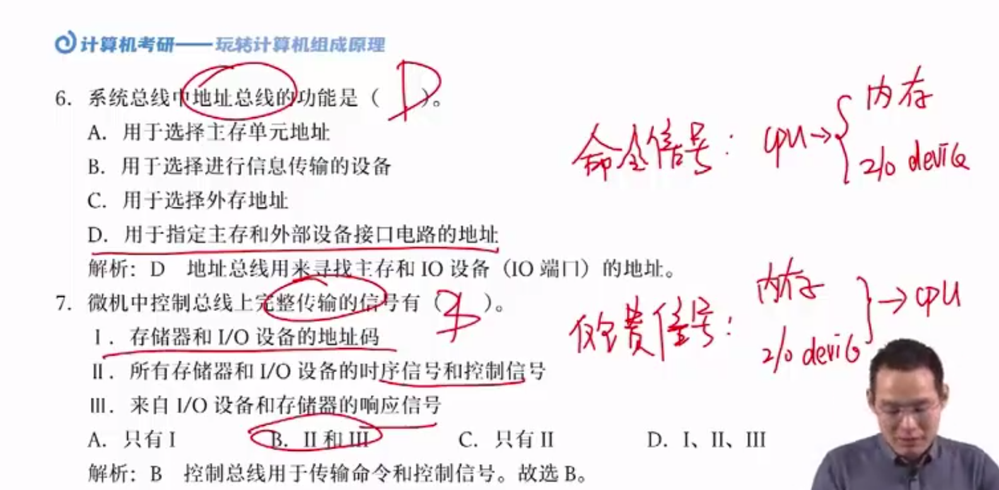
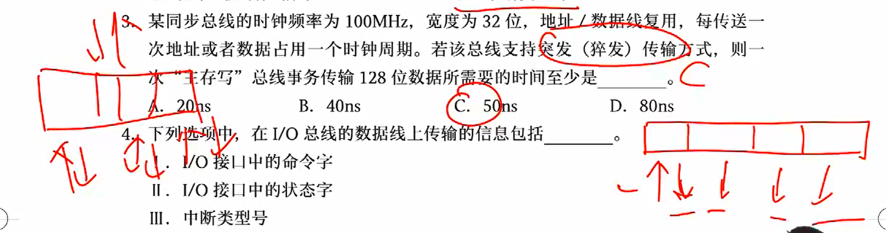

## 计算机系统组成

### 硬件、软件系统

硬件系统和软件系统共同构成计算机系统，硬件是基础，软件是发挥硬件的条件

硬件系统主要包括：CPU、存储器、输入/输出控制系统

软件系统

- 系统软件：提供无差别服务，如操作系统、实用程序、编译程序等
- 应用软件：不关心，赚钱捏

硬件和软件具有逻辑等价性，即软件能完成的工作硬件也能完成，反之亦然。硬件实现更快，软件的迭代、修改更方便

### 语言级别

机器语言：代码效率高，执行速度快，硬件可直接执行，可读性差，不易变成，不易维护

汇编语言：可读性较好（助记符），出错便于检查和修改。可移植性差，对程序员要求高，必须十分熟悉计算机硬件结构的配置、指令系统和寻址方式低级语言

- 也叫低级语言

高级语言：接近于自然语言，容易理解和掌握，与硬件无关。效率低，执行速度慢

- 解释型语言：python、js，一行行处理（line by line），一步到位
- 编译型语言：java、c、c++，需要编译器，编译得到目标代码，经过链接器形成链接模块，最后转化成机器语言

## 计算机系统层次结构

### 划分层次结构

第 0 级机器：完全由硬件组成，是机器的硬件核心

第 1 级机器：根据指令操作所需的控制时序，利用微指令编出的微程序控制数据在寄存器之间传送

第 2 级机器：能运行机器语言的机器，程序员可以在其上编写机器语言程序利用第 1 级的微程序进行解释并运行

第 3 级机器：操作系统机器

第 4 级机器：汇编语言机器

第 5 级机器：高级语言机器

第 6 级机器：应用语言机器

### 划分层次的意义

解耦计算机功能，硬件做下级，软件做上级

## 冯诺依曼计算机

### 存储程序思想

第一台通用计算机 ENIAC 出现于1946年情人节，每秒 5000 次运算，占地 150 平米

冯诺依曼提出存储程序的思想，把程序和数据不加区别的对待，从内存中读数据，都存放在存储器中

并将计算机分成5部分：运算器、控制器、存储器、输入设备、输出设备

### 冯诺依曼计算机

根据存储程序的概念和二进制原理设计的电子计算机统称为“冯诺依曼型结构”计算机

特点：

- 由五部分构成
- 程序、数据都在存储器中
- 数据以二进制表示
- 指令由操作码和地址码组成
- 指令在存储器中按执行顺序存放，并能自动执行

二进制简单、二进制稳态器好做，逻辑门电路实现逻辑运算简单

冯诺依曼计算机属于指令流驱动控制，并且属于串行结构，单指令流单数据流

早期，冯计算机以运算器为中心；现代计算机以寄存器为中心

### 计算机的硬件组成

输入设备

存储器：用以存放程序和数据，分为内存和外存，CPU只直接读取内存

- 按地址进行存取，参考汇编
- 每个存储单元的大小取决于编址方式

编址方式

- 比特，存 1/0
- 字节，存 8 个 bit
- 字，也叫 word，往往等于 n 倍的 B，即包含多个字节

这里的字节和字我们称作编址单元，为什么编制单元是字或者字节？

买鸡蛋

- 买200个，按个数
- 买2000个，按盘数
- 买20000个，按箱数

计数单位越大，计数次数越少

寻址时，回去地址寄存器 MAR 去找地址，若存储单位大，地址数量少，MAR 负担就小，反之 MAR 就要大

输出设备

运算器：执行部件，算数逻辑单元

控制器

### 计算机的指令执行过程

取指令：从内存中寻址取出

分析指令：译码阶段

访存取数阶段：根据指令取出相应数据

执行指令：对数据进行相应操作并得到结果

结果写回阶段

## 计算机性能指标

### 吞吐率

单位时间内处理请求的数量

### 响应时间

给了一个请求以后，多久后能响应

### CPU 时钟周期

主频的倒数，就是主频振动一个来回经历的时间，CPU最小的时间单位，每个动作至少需要一个时钟周期

### 主频

由硬件决定，时间实际是一种约定（跨年的时候会停一秒左右校正），计算机只能通过石英单晶体的振动来计时，而主频实际上就是振动的频率。也可以理解为每秒中时间周期的个数

主频变高，时钟周期一定会变小，但时钟周期数CPI一定会变多，完成一件事的时间为：事的数量 x 时钟周期数 x 时钟周期

他们是矛盾的，需要结合场景计算

### CPI

执行一条指令所需的时钟周期数

### CPU 执行时间

CPU 执行一个程序所花时间

Tcpu = ln x CPI x Tc = ln x CPI x 1/Rc

- ln为指令数
- Rc为主频
- CPI为一条指令所耗时钟周期个数
- Tc为时钟周期长度

很明显可以看出主频越快，所用时间越短

### MIPS 和 MFLOPS

MIPS：每秒钟指令的执行条数，以百万为单位

MIPS = ln / (Tcpu x 10^6) = 1 / (CPI x Tc x 10^6)

- 带入 Tcpu 的公式

MIPS 用于评价标量机

MFLOPS = 浮点操作次数 / (执行时间 x 10^6)

适用于衡量向量机

## 计算机体系和并行系统

### 计算机的体系结构

Flynn 分类法，将计算机划分成四种基本类型，M(multi)指多，S指单(single)

- SISD：单指令流单数据流，完全的串行，冯诺依曼机
- MIMD：多指令流多数据流，同时执行多个指令流，指令流可以在单个时钟周期处理多个数据，一定是多核心
- SIMD：单指令流多数据流，现在的单核计算机基本属于该类，能够在单时钟周期内处理多个数据
- MISD：多指令流单数据流，鬼畜

### 多核处理器

每个CPU是一个独立的处理器，可以有自己独立的cache，也可以共享cache

### SMP 系统结构

对称多处理器技术，单处理器同时只能处理一个线程，若多线程，CPU数量必须达到多个，SMP技术使得多个CPU可以同时工作

各处理器之间的关系完全对等，共享相同的物理内存

但要注意并不是核越多越好，一味增加内存冲突加剧且CPU浪费增加，SMP利用率最好的情况是2-4个CPU

- 松耦合的多处理技术：早期分布式的雏形
- 紧耦合的多处理技术
- 对称多处理技术

## 总线系统概述

重点考察总线如何进行通信以及性能指标

### 基本概念

冯的计算机各个部件并没有设计在同一区域，于是就涉及到了各部件的通信问题

- 总线：为计算机各模块之间和模块内部传输信息的公共通道，半双工通道，同一时间只能单向通行
- 总线主模块：工作于主控方式，主动发起的一方，控制和管理数据传送
- 总线从模块：工作于受控方式，只能在主模块的控制下完成操作
- 总线仲裁：当多个部件同时想在同一条总线上传输数据时，需要通过仲裁结构控制各部件传输的先后顺序
- 总线宽度：一次总线操作中总线传输的数据位数
- 总线周期：一次总线操作所需时间
- 总线频率：总线的工作频率，每秒钟可以传输数据的次数，单位是 MHz
- 总线带宽：单位时间内总线上可以传输的数据量，单位为 MB/s

$$
总线带宽 = \frac{数据量}{传输时间} = \frac{总线宽度\times总线工作频率}{8}
$$

其中总线工作频率即为：1 / 总线工作周期

- 总线定时：指事件出现在总线上的时序关系
- 总线标准：大纲已无，就是总线在传输时必须遵守的一些规范
- 波特率：每秒钟传输的二进制数据的位数
- 比特率：单位时间内传输的二进制有效数据的位数（只包含数据，不包括控制信息）

### 总线分类

按传输内容的不同，可分为

- 地址总线：CPU 发往 IO 或内存
- 数据总线：CPU 和内存、IO 双向通信，传输数据、指令
- 控制总线：分时双向通信，CPU 发往内存叫做控制信号，其他部件发给 CPU 的叫做反馈信号

栗子一

栗子二

根据数据传输方式，可分为

- 并行总线：可以同时传递多位
- 串行总线：相当于总线宽度为 1，只有一条线路，适合长距离通信（计算机网络构成常用串行）

根据总线位置，可分为

- CPU 内部总线：位于 CPU 内部，在 CPU 内各寄存器、ALU 之间传递数据，又叫片内总线
- 系统总线：计算机熊内部各功能部件之间相互连接的总线，也叫内总线
- 通信总线：计算机系统之间的通信总线，比如计算机网络，比如握手应答信号

### 总线组成

总线由以下三部分组成

- 传输线路：物理实体
- 接口逻辑：和各部件相连的电路，如三态门和缓冲寄存器
- 总线控制器：对总线的使用进行合理的分配管理

传输线路是物理部分，后两者常常是软件部分

### 总线性能指标

- 总线宽度

就是数据总线的根数，直接影响地址线（MAR）和数据线（MDR）的宽度，数据线的宽度指明了访问一次内存或外设能够交换的数据量

- 总线带宽

总线带宽 = 总线传输的数据量 / 传送时间
$$
总线带宽 = \frac{总线宽度}{8\times总线工作频率}
$$
每次过”总线宽度“辆车，每秒过”总线工作频率“次，二者一乘就得通过的总车数，再转化单位从 b 到 B

注意这里的总线工作频率并非 CPU 时钟频率，随着 CPU 的发展，后者远大于前者

另外，总线工作频率不同于总线时钟频率，往往总线工作周期等于若干个总线时钟周期，二者成倍数关系，以上公式中必须除以**总线的工作频率**

- 猝发 / 突发通信

给一个地址的情况下，连续读出多个数据，假设传输地址、数据时间为 t，若按顺序正常通信传输 n 个数据，需要时间 2nt，读 n 次地址，读 n 次数据；若突发通信，则需要时间 (n+1)t，即读一次地址，读 n 次数据

- 其他指标

总线复用：地址线与数据线复用，分时传输数据

总线负载：连接到总线上的最大的设备数

总线数量：地址总线、数据总线和控制总线的数量总和

注意：总线复用可以降低成本，但会降低数据传输速率

### 总线连接结构

单总线结构：只有一根总线，所有的设备接在同一根总线上

- 实现简单，管理控制复杂

双总线结构：在 CPU 和内存之间多了一根专用总线，CPU 访问内存时走专用通道即可

- 其余和单总线结构一样，所有设备均连在但总线上

多总线结构：低速总线和高速总线分开连接传输速度不同的设备

### 总线的特性

> 和计算机网络物理层的四个特性一模吊样

机械特性（物理特性）：总线在连接时，外形是怎样的，如 type-c 和 micro-c

电气特性：每根线上的电压、电平范围

功能特性：每根线是干嘛的

过程特性（时间特性）：数据传输的发生顺序

## 总线通信控制

如何进行数据传送

### 总线信息传送过程

总线仲裁之后，各部件按照**优先等级**获取总线的使用权并分时按照先后顺序使用总线

完成一次总线操作的时间称为**总线周期**，包括以下四个阶段

- 申请分配阶段：主模块申请，总线仲裁
- 寻址阶段：主模块向从模块给出地址和命令
- 传数阶段：主模块和从模块交换数据
- 结束阶段：主模块撤销有关信息

### 总线的定时方式

总线通信控制主要解决的是通信双方如何获知传输开始和传输结束，以及通信双方如何协调配合

#### 同步定时方式

总线上有一根设备公用的时钟信号线，每个信号出现在总线上的时刻由总线时钟信号来确定

- 传输频率较高，适用于总线较短且各功能模块进度相近的情况，否则会大大损失总线效率

#### 异步定时方式

通过应答信号，即“请求”和“响应”方式来实现同步，不需要统一的公共时钟信号，这一方式又叫做**握手方式**

分为

- 全互锁：请求需要从模块确认，结束需要主模块确认
- 半互锁：请求需要从模块确认，结束无需确认
- 不互锁：请求和结束均无需确认

就像医生拿刀，护士递刀，医生还刀：全互锁，拿刀护士确认医生拿稳了再松手，还刀医生确认护士拿稳了再松手；半互锁，护士确认医生拿稳，医生还刀直接丢；不互锁，拿刀还刀都是直接丢

#### 半同步方式

结合了同步通信和异步通信的优点，地址、命令、数据信号的发出时间都严格按照系统时钟；同时增设一条“等待”响应信号线，在数据传输过程插入等待时钟信号告知模块等待，允许不同速度的模块和谐的工作

- 优点：可靠性较高，同步结构简单
- 缺点：对系统时钟频率不能要求太高，系统工作的速度不是很高

就像你啥时候开始复习我不管，但到时候你必须参加考试

#### 分离式通信

从模块读取数据的过程并不使用总线，但在这段时间已经统一分配给了该主从模块，总线实际上被浪费

我们将整个阶段分为两个部分

- 主从模块获取总线使用权，主模块发送取数据命令，从模块准备数据，之后从模块准备数，主从模块放弃总线使用权，总线可以被别人使用
- 从模块数据准备完毕后，充当“主模块“，获取总线使用权，主动向主模块（现在是从模块）发送数据
