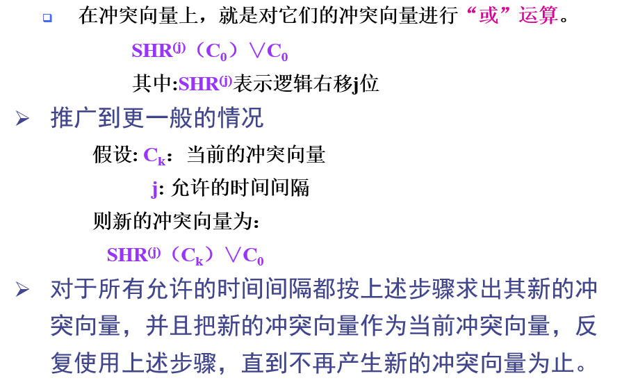
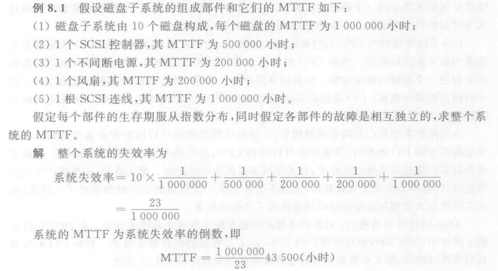

## 计算机体系结构基础知识

### 体系结构的层次、定义和分类

计算机系统的多级层次结构，从下到上（P2）

- 微程序机器
- 传统机器语言机器
- 操作系统机器
- 汇编语言机器
- 高级语言机器
- 应用语言机器

计算机系统结构的经典定义和广义系统结构定义（P3）

- 经典定义：程序员所看到的计算机属性，即概念性结构与功能特性
- 广义定义：指令系统结构、组成、硬件

计算机体系结构规定计算机的框架，一栋楼的钢筋；计算机组成是逻辑实现，一栋楼的设计草图；硬件实现就是物理实现，水泥和钢板......

体系结构分类：Flynn 分类，冯氏分类，Handler 分类（P3-4）

Flynn 分类法：按照指令和数据的并发性分类

- 单指令单数据流
- 单指令多数据流
- 多指令单数据流
- 多指令多数据流

冯氏分类法：按照字/位的串并行分类

- 子串位串：n = 1, m = 1
- 子串位并：n = 1, m > 1
- 子并位串：n > 1, m = 1
- 子并位并：n > 1, m > 1

Handler 分类法：按照硬件结构分为三个层次

- 程序控制部件个数 k，就是 CPU 个数
- 算术逻辑部件或处理部件个数 d，每个 CPU 中 ALU 的个数
- 每个算术逻辑部件包含的基本逻辑线路套数 w，每个 ALU 中 ELC 的个数

### 定量原理和局部性原理

Amdahl 定律（P7）：一个部件对整个系统的提升受限于这个部件执行时间所占总执行时间的比例

加速比的计算（P7-8）：设部件执行时间占总时间比例位 Fe，改进倍数位 Se
$$
加速比=\frac{总执行时间_{改进前}}{总执行时间_{改进后}} = \frac{1}{1-Fe+\frac{1\times FE}{Se}}
$$
CPU 性能公式（P8-9）
$$
CPU 时间 = IC\times CPI\times 时钟周期时间
$$
其中时钟周期时间等于 CPU 频率分之一

程序的局部性原理（缓存）：时间上，当前使用的数据最近很可能还要被使用；空间上，当前使用的数据附近很可能存在将要被使用的数据

### 冯诺依曼机和系列机

冯诺依曼机的组成：五部分（P17-18）

- 运算器
- 控制器
- 存储器
- 输入设备
- 输出设备

冯诺依曼机的特点：

- 存储器按地址访问
- 指令顺序执行
- 指令和顺序同等对待
- 指令由操作码和地址码组成
- 指令和数据均以二进制表示

系列机的向上/下兼容和向前/后兼容（P20）

- 向上兼容：同一系列兼容不同硬件档次的机器
- 向后兼容：同一系列兼容以后研发的新机器

模拟和仿真：模拟是模拟整个过程以及结果，仿真是使结果仿真（过程不模拟）（P21）

### 并行性

同时性和并行性的区别：前者指多个事件在同一时刻发生；后者指多个事件在同一时间间隔（可能很短）内发生（P23）

提高并行性的方法（P25）

- 时间重叠：一个任务划不同阶段同时进行，如流水线技术
- 资源重复：重复设置硬件资源，硬提高性能，如多处理机
- 资源共享：软件方法，多任务轮流使用硬件，如进程调度

## 指令系统的设计

### 指令系统概述

指令系统的分类：精简指令集和复杂指令集

寻址方式中，物理地址空间的信息存放规则：整数存放，同一数据不能跨物理块

指令系统设计的基本原则：完整性，规整性，正交性，高效率和兼容性

控制指令的内容：跳转和分支，有条件的跳转统称为分支指令，无条件为跳转指令

### 哈夫曼编码

参考数据结构哈夫曼树和哈夫曼编码，这里有一个新概念，信息熵，设各指令的出现频率为 pi，则有信息熵为
$$
H = -\sum_{i=1}^np_ilog_2p_i
$$
信息熵即为编码的理论最优 WPL（加权路径长度）

通过构造哈夫曼树可以得到哈夫曼编码以及对应 WPL 最小的树
$$
WPL = \sum_{i=1}^n(w_i\times deep_i)
$$
其中 i 均为叶子结点（树的加权路径长度即为叶子结点的加权长度之和）

信息冗余量
$$
V = 1-\frac{H}{WPL}
$$
其中分子 H 为哈夫曼编码的信息熵

### 指令格式

指令系统的三种编码格式：固定长度编码、可变长度编码和混合型编码格式

MIPS 的指令格式

- I 类
- R 类
- J 类

## 流水线技术

### 流水线概述

流水线概念：一种并行技术，使得同一指令的不同阶段可以并行执行，提高执行效率

| 流水线分类                 |              |              |
| -------------------------- | ------------ | ------------ |
| 从计算机系统等级上         | 指令级流水线 | 部件级流水线 |
| 从流水线实现的功能上       | 单功能流水线 | 多功能流水线 |
| 从同一时间各段的连接方式上 | 静态流水线   | 动态流水线   |
| 从是否有反馈回路上         | 线性流水线   | 非线性流水线 |
| 从输入输出顺序上           | 顺序流水线   | 乱序流水线   |

通过时间和排空时间，设一条指令被分为 m 段，每段均耗时 t，共 n 条指令，则

- 通过时间：mt + (n-1)t
- 排空时间：mt

传统的五级流水线：取指 - 译指 - 执行 - 访存 - 写回

### 流水线的性能指标

吞吐率：单位时间内执行的指令条数
$$
\frac{n}{mt+(n-1)t}
$$
分子为指令条数，分母为 n 条指令经过 m 段流水线通过时间

加速比：顺序执行的执行时间比上流水线的执行时间
$$
\frac{nmt}{mt+(n-1)t}
$$
分子为 n 条指令顺序执行所需时间，分母为流水线通过时间

效率：单个器件工作时间比上整个流水线通过时间
$$
\frac{nt}{mt+(n-1)t}
$$
一个部件执行以此所需时间 t，共有 n 条指令经过这一部件，部件总执行时间为 nt

### 流水线设计中的问题

流水线设计中的三个问题

- 瓶颈问题
- 额外开销
- 冲突问题

相关问题：数据相关、名相关、控制相关

冲突问题又分为

- 结构冲突 ——> 添加硬件
- 数据冲突 ——> 定向技术
- 控制冲突 ——> 冻结和排空

### 单功能非线性流水线的最优调度

> 大题

单功能非线性流水线

- 单功能：只完成一种固定功能的流水线
- 非线性：存在反馈回路

预约表：一个二维表，用于优化流水线

- 横向表示时间
- 纵向表示流水线的各段

禁止表：一个一维非重复数组，根据预约表，记录时间的插值，如上表中

- 第一行差值为`9-1=8`
- 第二行差值有`3-2=1, 8-2=6, 9-3=5`，即`1,5,6`
- 第三行无差值
- ......

最后合并可得禁止表`F = {1,5,6,8}`

初始冲突向量：一个 N 位的二进制串，N 为整个流水线的时间跨度，空闲间隔标为 0，繁忙间隔标为 1

状态转换图：冲突向量的集合

举个栗子

## 向量处理的三种方式

> P94-95

横向处理方式：将矩阵视作行向量组处理

纵向处理方式：视作列向量组处理

纵横处理方式：矩阵的分块处理

## 指令级并行

### 指令级并行的概念

指令级并行（Instruction-Level Parallelism，简称ILP）是一种并行计算的概念，它通过同时执行多条指令来提高计算机系统的性能。传统的处理器在执行指令时，会按照指令的顺序依次执行，即一条指令完成后才能执行下一条指令。而指令级并行则允许多条指令在同一时钟周期内同时执行，从而提高了处理器的效率

指令级并行可以通过以下几种技术实现

1. 流水线（Pipeline）：将指令的执行过程分为多个阶段，并且在同一时刻执行多条指令的不同阶段。每个阶段专门负责不同的操作，如取指、译码、执行、访存和写回。这样，多条指令可以同时处于不同的阶段，从而提高了处理器的吞吐量
2. 超标量（Superscalar）：在同一时钟周期内，同时从指令流中取出多条指令并且并行执行。超标量处理器可以通过复制多个功能部件（如算术逻辑单元、乘法单元等）来实现同时执行多条指令的能力
3. 动态指令调度（Dynamic Instruction Scheduling）：通过重新调整指令的执行顺序来隐藏指令之间的相关性和依赖关系，从而提高并行执行的效率。动态指令调度可以通过乱序执行（Out-of-Order Execution）和超长指令字（Very Long Instruction Word，简称VLIW）等技术来实现

指令级并行的概念和技术使得处理器能够同时处理多条指令，提高了计算机系统的性能和效率。这种并行性可以在硬件层面上实现，也可以由**编译器通过代码优化**来发掘和利用

### 指令动态调度的概念

指令动态调度（Dynamic Instruction Scheduling）是一种在计算机处理器中利用指令级并行性（Instruction-Level Parallelism，ILP）的技术。它通过重新调整指令的执行顺序来隐藏指令之间的相关性和依赖关系，以便在处理器中并行执行多条指令，从而提高处理器的性能和效率

在传统的顺序执行中，指令的执行必须按照其在程序中的顺序进行，这可能导致一些指令之间存在依赖关系，一个指令的执行必须等待前面的指令完成后才能执行。这种顺序执行方式无法充分利用处理器中的资源，造成资源的浪费和性能的下降。

指令动态调度技术通过重排序指令的执行顺序来允许指令的并行执行，以尽量利用处理器中的资源。当指令之间不存在数据依赖关系时，可以通过动态调度将它们重新排序，以实现并行执行。这样可以提高处理器的吞吐量和效率

具体实现指令动态调度的方式有多种，其中最常见的是乱序执行（Out-of-Order Execution）和超长指令字（Very Long Instruction Word，简称VLIW）

1. 乱序执行：处理器通过将指令在执行前进行重排序，以避免指令之间的相关性和依赖关系。通过乱序执行，可以将不相关的指令并行执行，从而提高指令级并行性。乱序执行的技术包括重命名寄存器、保留站缓冲和乱序执行引擎等
2. 超长指令字（VLIW）：VLIW处理器通过在一条长指令中打包多个独立的操作，使得这些操作可以在同一个时钟周期内同时执行。编译器负责将程序中的指令打包成适合VLIW处理器执行的长指令，从而实现指令级并行。VLIW处理器需要靠编译器的静态指令调度来发现和利用并行性。

指令动态调度技术对于提高处理器性能和效率非常重要，它可以充分利用处理器中的资源，并发控制相关性和依赖关系，实现指令级并行的执行

## 存储系统

### 存储系统概述

三级存储系统：主存、缓存、辅存

三级存储系统的两个层次：主存-Cache系统，主存-辅存系统（注意二者比较）

映像规则分类

- 直接相联映像
- 全相联映像
- 组相联映像

常见的三种替换算法：随机替换；先进先出；最近最少使用

写策略的两种分类和区别：写直达法和写回法

### 访存时间以及不命中率

平均访存时间 = 命中时间 + 不命中率 x 不命中开销

- Cache 的优化技术都基于降低平均访存时间的思路，即：降低命中时间，降低不命中率，减少不命中开销

三种类型的不命中

- 强制性不命中：该块不在 cache，真没命中，要调入
- 容量不命中：访问将将替换出去的块，不命中
- 冲突不命中：

多级 Cache 的不命中率（局部与全局）的计算

- 局部不命中率 = 该级 Cache 的不命中次数 / 到达该级 Cache 的访存次数
- 全局不命中率 = 该级 Cache 的不命中次数 / CPU 发出的访存总次数

注意，当一级 Cache 未命中，这个访存就会顺延到下一级，也就是说：一级 Cache 的不命中次数 = 二级 Cache 的访存次数

每次访存的平均停顿时间 = 平均访存时间 - 1

每条指令的平均停顿时间 = 每条指令的访存次数 x 访存的平均停顿时间

## 输入输出系统

> P244-250

反应存储外设可靠性的参数：可靠性，可用性，可信性

MTTF（Mean Time To Failure）：平均无故障时间，其倒数即为系统的失效率

MTTR（Mean Time To Repair）：平均修复时间

系统失效率：即字面意思，系统失效的概率（在时间上），**其在数值上等于系统各单位失效率的总和，因为对于系统而言部分失效等价于系统失效**

RAID 的概念：廉价磁盘冗余阵列（冗余，可以理解为备份）

各级 RAID 的区别与实现方案：重点是当阵列中发生问题时能够及时找到错误所在

| 层级  | 定义                                              |
| ----- | ------------------------------------------------- |
| RAID0 | 就是一个磁盘阵列，非冗余，称为磁盘阵列的第 0 级   |
| RAID1 | 基础的冗余磁盘阵列，为 RAID0 每个磁盘创建一个镜像 |
| RAID2 | 存储器式的磁盘阵列，没有商业化产品（效率低下）    |
| RAID3 | 交叉奇偶校验磁盘阵列                              |
| RAID4 | 块交叉奇偶校验磁盘阵列                            |
| RAID5 | 块交叉分布奇偶校验磁盘阵列                        |
| RAID6 | P+Q 双校验磁盘阵列                                |

## 多处理机的两种分类

按照存储器组织结构可将处理机分为

- 共享存储器多处理机
- 分布式存储器多处理机

共享存储器多处理机：在这种结构中，多个处理器共享同一个主存储器。处理器之间可以通过读取和写入共享内存来进行通信和数据共享。这种结构简化了编程和数据共享的管理，但也需要实现有效的共享内存访问控制，以确保数据一致性和避免冲突

分布式存储器多处理机：在这种结构中，每个处理器都有自己的本地存储器，而且处理器之间通过消息传递来进行通信。每个处理器都可以独立地访问自己的本地存储器，但要与其他处理器共享数据，则需要显式地进行消息传递。这种结构提供了更好的可扩展性和并行性能，但编程和数据共享的管理可能更加复杂

