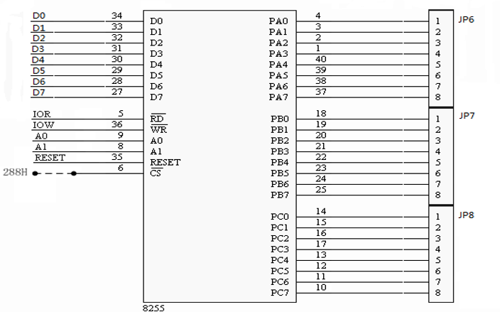
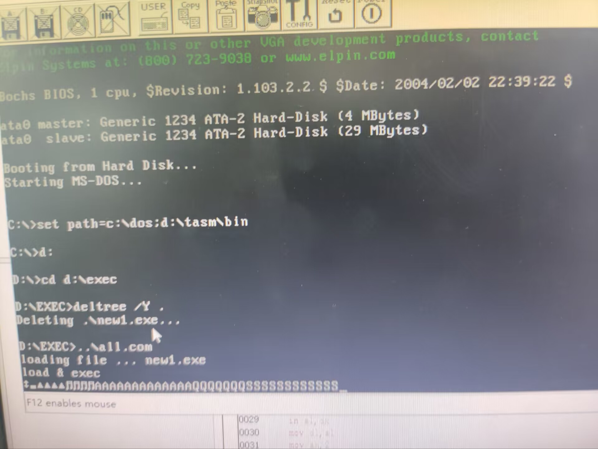
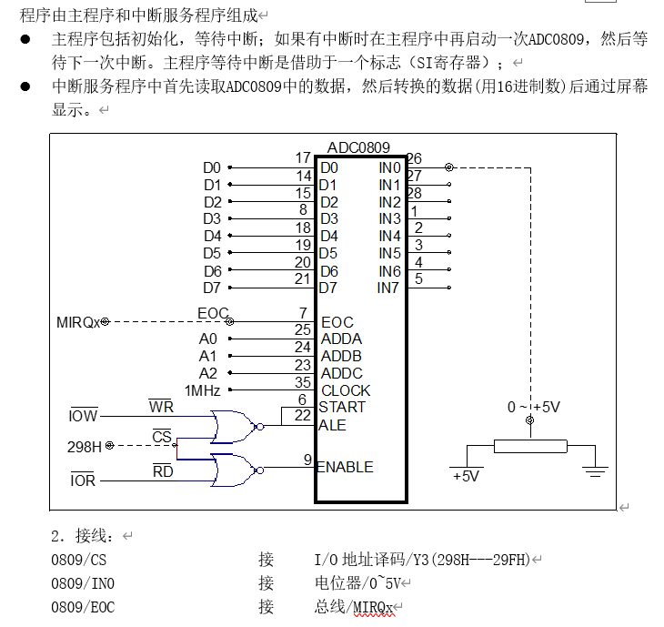
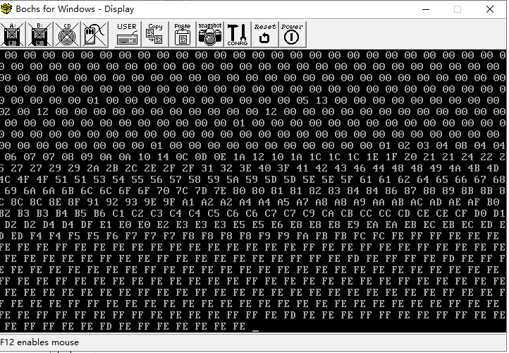

## 系统中断

### 目的及原理

#### 实验目的

掌握PC机中断处理系统的基本原理

学会编写中断服务程序

实验电路如图，直接用手动产单脉冲作为中断请求信号（只需连接一根导线），要求每按一次开关产生一次中断，在屏幕上显示`NEUQ 2023!If Winter comes,can Spring be far behind?`


实验环境

- `Tpc-zk-II`集成开发环境
- 微机原理与接口技术实验箱

#### 实验原理

系统上电时，ROM BIOS对8259A的主片和从片要执行初始化命令、惊醒初始化操作


中断向量和中断向量表


CPU 获取中断类型码的方法

- CPU内部中断时，由硬件电路自动提供
- 软中断INT n在指令的代码中提供
- 可屏蔽的外中断INTR通过硬件（8259A）提供

对于 PC/AT 及 286 以上微机内又扩展了一片 8259 中断控制，IRQ2 用于两片 8259 之间级连，对外可以提供 16 个中断源

| 中断源 | 中断类型号 | 中断功能   |
| ------ | ---------- | ---------- |
| IRQ0   | 08H        | 时钟       |
| IRQ1   | 09H        | 键盘       |
| IRQ2   | 0AH        | 保留       |
| IRQ3   | 0BH        | 串行口2    |
| IRQ4   | 0CH        | 串行口1    |
| IRQ5   | 0DH        | 硬盘       |
| IRQ6   | 0EH        | 软盘       |
| IRQ7   | 0FH        | 并行打印机 |
| IRQ8   | 70H        | 实时时钟   |
| IRQ9   | 71H        | 用户中断   |
| IRQ10  | 72H        | 保留       |
| IRQ11  | 73H        | 保留       |
| IRQ12  | 74H        | 保留       |
| IRQ13  | 75H        | 协处理器   |
| IRQ14  | 76H        | 硬盘       |
| IRQ15  | 77H        | 保留       |

### 系统中断实验

1、连接仪器

插上实验箱电源，`USB`接口连接主机，连接实验箱`总线/MIRQx`和`单脉冲1/正脉冲`，开启实验箱电源，在`Tpc-zk-II集成开发环境`中进行硬件检测

2、编写汇编代码

experiment_one.asm

```nasm
data segment
    info db 'NEUQ 2023!if Winter comes,can Spring be far behind?', 0ah, 0ah, '$'
data ends
code segment
assume cs:code, ds:data
start:
    mov ax,cs
    mov ds,ax
    mov dx,offset int3
    mov ah,25h
    mov al,0bh
    int 21h
    in al,21h
    and al,0f7h
    out 21h,al
here:jmp here
int3 proc
    push ax
    push ds
    push dx
    sti
    mov ax,data
    mov ds,ax
    mov dx,offset info
    mov ah,9
    int 21h
    mov al,20h
    out 20h,al
    cli
    pop dx
    pop ds
    pop ax
    iret
int3 endp
code ends
end start
```

编译运行

3、实验结果

每次按下单脉冲开关将在屏幕上显示


事先检查各种插线是否稳固，如`USB`接口，电路板是否插稳（会亮灯指示），实验前在`IDE`中不要少硬件检测这一步骤，`IDE`对于汇编代码的报错详细到行，认真仔细检查即可

## 8253 定时器计数器

### 目的及环境

#### 实验目的

掌握 8253 计数特点和编程方法。掌握 8253 工作方式 3 的基本工作原理、计数特点和编程方法

实验环境

- `Tpc-zk-II`集成开发环境
- 微机原理与接口技术实验箱

#### 实验原理

8253/8254 内部结构

- 三个16位**减一**计数单元
- 控制寄存器

8253 芯片结构示意图


各地址信号组合功能


8253/8254 的编程命令：作为可编程器件，8253/8254是通过命令字来控制其工作方式的，命令字有两类

- 初始化编程命令：用于设定计数器的功能、工作方式；
- 锁存读出命令：用于读出计数器中的计数值，或计数器的状态（8254）

8253/8254 的初始化控制字


8253 具有三个计数器`CNT0、CNT1、CNT2`，还有一个控制寄存器，它们各占一个地址（由引脚A1、A0确定）；在每一个计数器`CNTi`中，有三个部分构成，初值寄存器`CR`、减一计数器`CE`和输出锁存器`OL`	


8253/8254 的初始化编程：初始化编程操作的顺序是：先想控制寄存器写入命令字，然后写入初值。如果是 16 位初值时，必须是先写入低 8 位初值，然后再写入高 8 位初值，最后输出锁存命令（读计数器的计数值），将当前的计数器的计数值捕捉到输出锁存器`OL`中

### 计数实验

实验流程


编写汇编代码程序

```nasm
data segment
	io0 equ 280h
	io1 equ 281h
	io2 equ 282h
	iok equ 283h
data ends
code segment
assume cs:code,ds:data
start:
	mov ax,data
	mov ds,ax
	mov dx,iok
	mov al,14h
	out dx,al
	mov dx,io0
	mov al,9
	out dx,al
	r1:mov dx,io0
	in al,dx
	call dis
	mov ah,1
	int 16h
	jz r1
	mov ah,4ch
	int 21h
	dis proc
	push ax
	push dx
	add al,30h
	mov dl,al
	mov ah,2
	int 21h
	pop dx
	pop ax
	ret
	dis endp
	here:jmp here
code ends
end start
```

按图连接电路，将计数器0设置为方式2，计数器初值为N（N<=0FH），用手逐个输入单脉冲，编程使计数值在屏幕上显示，用逻辑笔观察OUT0电平变化（当输入N+1个脉冲后OUT0变高电平）


| 接线       |                           |
| ---------- | ------------------------- |
| 8254/CLK0  | 单脉冲/正脉冲             |
| 8254/CS    | I/O译码/Y0（280H---287H） |
| 8254/OUT0  | LED显示/L7 或 逻辑笔      |
| 8254/GATE0 | +5V                       |

点击运行，记录计数过程


### 定时实验

编写汇编代码程序

```nasm
data segment
io0 equ 280h
io1 equ 281h
io2 equ 282h
iok equ 283h
data ends
code segment
assume cs:code,ds:data
start:
    mov ax,data
    mov ds,ax
    mov dx,iok
    mov al,36h
    out dx,al
    mov dx,io0
    mov ax,1000
    out dx,al
    mov al,ah
    out dx,al
    mov dx,iok
    mov al,76h
    out dx,al
    mov dx,io1
    mov ax,1000
    out dx,al
    mov al,ah
    out dx,al
here:jmp here
code ends
end start
```

按下图 连接电路，将计数器0、计数器1分别设置工作方式，CLK0连接时钟1MHZ，由  T01000分频后变为1000HZ，再由T1进行1000分频后得1HZ


| 接线             |                           |
| ---------------- | ------------------------- |
| 8254/CLK0        | 时钟/1MHz                 |
| 8254/CS          | I/O译码/Y0（280H---287H） |
| 8254/OUT0        | LED显示/L7 或 逻辑笔      |
| 8254/GATE0,GATE1 | +5V                       |
| 8254/OUT1        | 逻辑笔                    |

运行程序，可以看到指示灯如下描述闪烁：高低电平每变化一次，计数加一，计数由两位二进制组成，如

- 在`0`时刻，计数为`00`，两个指示灯均暗
- 在`1`时刻，高低电平变化，计数变为`01`，第一个指示灯暗，第二个指示灯亮
- 在`2`时刻，高低电平变化，计数为`10`，第一个指示灯亮，第二个指示灯暗
- 在`3`时刻，计数为`11`，两个指示灯均亮
- 在`4`时刻，计数为`00`，两个指示灯均暗

## 8255 并行输入输出

### 目的及原理

#### 实验目的

了解8255芯片结构及编程方法。了解8255输入/输出实验方法

实验环境

- `Tpc-zk-II`集成开发环境
- 微机原理与接口技术实验箱

#### 实验原理

方式 0 输入输出

将实验的线路连接好后，编程，将8255的C口作为输入，输入信号由8个逻辑电平开关提供，A口作为输出，其内容由发光二极管来显示。

编程从8255C口输入数据，再从A口输出



| 接线                |                         |
| ------------------- | ----------------------- |
| 8255/JP8(PC7---PC0) | 逻辑开关/JP1(K7---K0)   |
| 8255/JP6(PA7---PA0) | LED显示/JP2(L7---L0)    |
| 8255/CS             | I/O译码/Y1(288H---28FH) |

方式一选通实验

实验电路如图所示，8255B口PB2---PB0接逻辑电平开关K2～K0，8255A口接LED显示电路L0～L7,PC2(/STBB)与单脉冲的负脉冲端相连。编程按下单脉冲按键产生一个负脉冲，输入到PC2，用发光二极管LEDi亮，显示K2---K0开关的状态


| 接线                |                         |
| ------------------- | ----------------------- |
| 8255/PB2---PB0      | 逻辑开关/K2---K0        |
| 8255/JP6(PA7---PA0) | LED显示/JP2(L7---L0)    |
| 8255/PC2            | 单脉冲/负脉冲           |
| 8255/CS             | I/O译码/Y1(288H---28FH) |

方式1中断输入实验

按图8255方式1输入电路，连好线路。编程每按一次单脉冲按钮产生一个正脉冲使8255产生一次中断请求，让CPU进行一次中断服务:读取逻辑电平开关预置的ASCII码，在屏幕上显示其对应的字符，显示”NEUQ2022”


| 接线                |                         |
| ------------------- | ----------------------- |
| 8255/JP6(PA7---PA0) | 逻辑开关/JP1(K7---K0)   |
| 8255/PC4            | 单脉冲/正脉冲           |
| 8255/PC3            | 总线区/SIRQx            |
| 8255/CS             | I/O译码/Y1(288H---28FH) |

### 方式 0 输入输出

汇编代码

```nasm
data segment
ioa equ 288h
iob equ 289h
ioc equ 28ah
iok equ 28bh
data ends
code segment
assume cs:code,ds:data
start:
    mov ax,data
    mov ds,ax
    mov dx,iok
    mov al,89h
    out dx,al
    s:
    mov dx,ioc
    in al,dx
    mov dx,ioa
    out dx,al
    mov ah,1
    int 16h
    jz s
    mov ah,4ch
    int 21h
code ends
end start
```

连接实验箱执行代码，实验现象如下：每个逻辑电平开关对应一个 IED 灯，当打开逻辑电平开关，其对应的 LED 灯将亮起

### 方式 1 选通实验

汇编代码

```nasm
data segment
ioa equ 288h
iob equ 289h
ioc equ 28ah
iok equ 28bh
data ends
code segment
assume cs:code,ds:data
start:
    mov ax,data
    mov ds,ax
    mov dx,offset int3
    mov ax,250bh
    int 21h
    in al,21h
    and al,0f7h
    out 21h,al
    mov dx,iok
    mov al,0b0h
    out dx,al
    mov al,9
    out dx,al
ll: jmp ll
int3:   push ax
        push dx
        push ds
        mov ax,data
        mov ds,ax
        mov dx,ioa
        in al,dx
        mov dl,al
        mov ah,2
        int 21h
        mov al,20h
        out 20h,al
        pop ds
        pop dx
        pop ax
        iret
code ends
end start
```

连接实验箱执行代码，实验现象如下：逻辑开关代表三位二进制数，发送脉冲信号后逻辑开关代表的十进制数对应的 LED 灯泡会点亮，显示输入的二进制数字

### 方式 1 中断输入实验

汇编代码

```nasm
data segment
ioa equ 288h
iob equ 289h
ioc equ 28ah
iok equ 28bh
t1 db 1,2,4,8,16,32,64,128
data ends
code segment
assume cs:code,ds:data
start:
    mov ax,data
    mov ds,ax
    mov dx,iok
    mov al,0afh
    out dx,al
    mov al,4
    out dx,al
    readb:
    mov dx,ioc
    in al,dx
    test al,00000010b
    jz readb
    mov dx,iob
    in al,dx
    and al,00000111b
    mov bx,offset t1
    xlat
    mov dx,ioa
    out dx,al
    mov ah,1
    int 16h
    jz readb
    mov ah,4ch
    int 21h
code ends
end start
```

连接实验箱执行代码，实验现象如下



## 0809 数模转换器

### 目的及环境

#### 实验目的

了解模/数转换的基本原理，掌握ADC0809的使用方法

实验环境

- `Tpc-zk-II`集成开发环境
- 微机原理与接口技术实验箱

#### 实验原理

ADC0809延时法实验


ADC0809查询法实验

按照下图进行连线，使用查询法，检测EOC状态。编程采集IN0输入的电压,在屏幕上显示出转换后的数据(用16进制数)


ADC0809中断法实验



### ADC0809 延时法实验

汇编代码

```nasm
data segment
in0 equ 298h
data ends
code segment
assume cs:code,ds:data
start:
    mov ax,data
    mov ds,ax
    s1:
    mov dx,in0
    out dx,al
    mov cx,0ffh
    s:loop s
    mov dx,in0
    in al,dx
    mov bl,al
    mov cl,4
    shr bl,cl
    call disp
    and al,0fh
    mov bl,al
    call disp
    mov dl,20h
    mov ah,2
    int 21h
    mov ah,1
    int 16h
    jz s1
    mov ah,4ch
    int 21h
    
disp proc
    push bx
    push ax
    push dx
    mov dl,bl
    cmp dl,9
    jbe t
    add dl,7
    t:add dl,30h
    mov ah,2
    int 21h
    pop dx
    pop ax
    pop bx
    ret
disp endp
    
code ends
end start
```

实验现象：随着手动旋转旋钮，控制外部的计时器芯片的输出脉冲宽度，改变ADC0809内部的采样电容电压稳定时间，显示器输出`00-ff`

- 当计时器的输出脉冲宽度较小时，ADC0809内部的采电容电压稳定时间较短，此时转换速度会比较快，但是精度较低
- 当计时器的输出脉冲宽度逐渐增大时，ADC0809内部的采样电容电压稳定时间逐渐变长，此时转换速度逐渐变慢，但是精度逐渐提高


### ADC0809 查询法实验

汇编代码

```nasm
data segment
in0 equ 298h
ioc equ 28ah
iok equ 28bh
data ends
code segment
assume cs:code,ds:data
start:
    mov ax,data
    mov ds,ax
    mov dx,iok
    mov al,89h
    out dx,al
    s1:
    mov dx,in0
    out dx,al
    readc:
    mov dx,ioc
    in al,dx
    test al,00000001b
    jz readc
    mov dx,in0
    in al,dx
    mov bl,al
    mov cl,4
    shr bl,cl
    call disp
    and al,0fh
    mov bl,al
    call disp
    mov dl,20h
    mov ah,2
    int 21h
    mov ah,1
    int 16h
    jz s1
    mov ah,4ch
    int 21h
    
disp proc
    push bx
    push ax
    push dx
    mov dl,bl
    cmp dl,9
    jbe t
    add dl,7
    t:add dl,30h
    mov ah,2
    int 21h
    pop dx
    pop ax
    pop bx
    ret
disp endp
    
code ends
end start
```

实验现象：随着手动旋转旋钮，控制外部的计时器芯片的输出脉冲宽度，改变ADC0809内部的采样电容电压稳定时间，显示器输出`00-ff`

- 查询周期对转换精度的影响。在实验过程中，当查询周期较小时，输出信号的精度会较低，即数字信号的误差会较大。当查询周期逐渐增大时，输出信号的精度会逐渐提高，即数字信号的误差会逐渐减小。当查询周期达到一定值之后，数字信号的精度不再有明显的提高，这是因为此时芯片内部的状态寄存器已经足够稳定，不受外界干扰，从而提高了精度
- 查询周期对转换速度的影响。在实验过程中，当查询周期较短时，转换速度会较快，即转换周期会较短。当查询周期逐渐增大时，转换速度会逐渐变慢，即转换周期会逐渐增长。但是，相对于延时法实验，查询法实验的转换速度一般比较稳定，不受延时时间的影响



### ADC0809 中断法实验

汇编代码

```nasm
DATA SEGMENT
in0 equ 298h
DATA ENDS
CODE SEGMENT
ASSUME CS:CODE,DS:DATA
START:
    MOV AX,CS
    MOV DS,AX
    MOV DX,OFFSET INT3
    MOV AX,250BH
    INT 21H
    IN AL,21H
    AND AL,0F7H
    OUT 21H,AL
    MOV dx,in0
    out dx,al
    
LL: JMP LL
INT3: 
    MOV AX,DATA
    MOV DS,AX
    mov dx,in0
    in al,dx
    mov bl,al
    mov cl,4
    shr bl,cl
    call disp
    and al,0fh
    mov bl,al
    call disp
    mov dl,20h
    mov ah,2
    int 21h
    mov dx,in0
    out dx,al
        MOV AL,20H
        OUT 20H,AL
        IRET
disp proc
    push bx
    push ax
    push dx
    mov dl,bl
    cmp dl,9
    jbe t
    add dl,7
    t:add dl,30h
    mov ah,2
    int 21h
    pop dx
    pop ax
    pop bx
    ret
disp endp

CODE ENDS
END START
```

实验现象：随着手动旋转旋钮，控制外部的计时器芯片的输出脉冲宽度，改变ADC0809内部的采样电容电压稳定时间，显示器输出`00-ff`

- 转换精度和稳定性。使用中断法进行转换时，芯片内部会自动控制转换和输出数字信号，从而提高了转换的精度和稳定性，减小了干扰和误差
- 转换速度。相对于查询法和延时法实验，中断法实验的转换速度更快，因为它可以自动进行转换和输出数字信号，无需人工干预和等待查询周期
- 中断控制。在ADC0809中断法实验中，使用中断控制器来实现自动转换和输出数字信号，可以控制中断方式、中断优先级和中断响应等参数，从而满足不同应用需求


熟悉了实验器材的使用方法和相关参数，包括模拟输入信号、模/数转换器0809芯片、示波器、稳压电源等，并且学会了设计和搭建相应的电路以及调试电路
