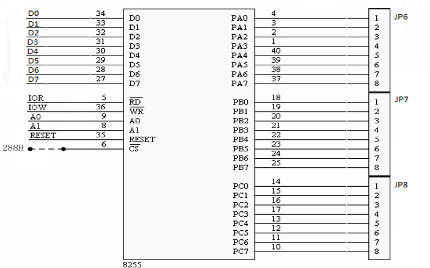
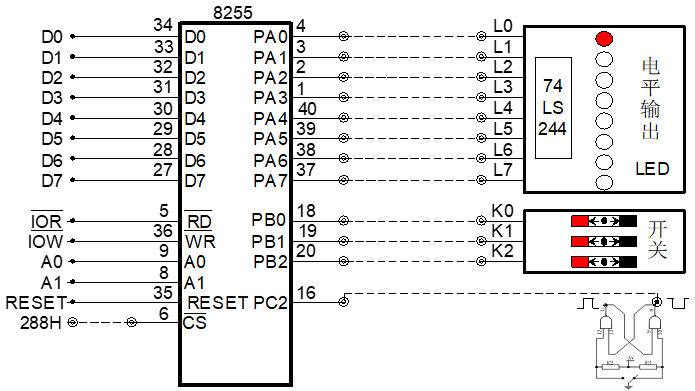
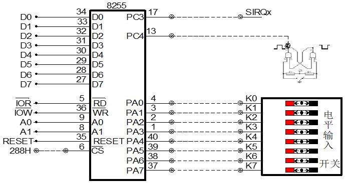
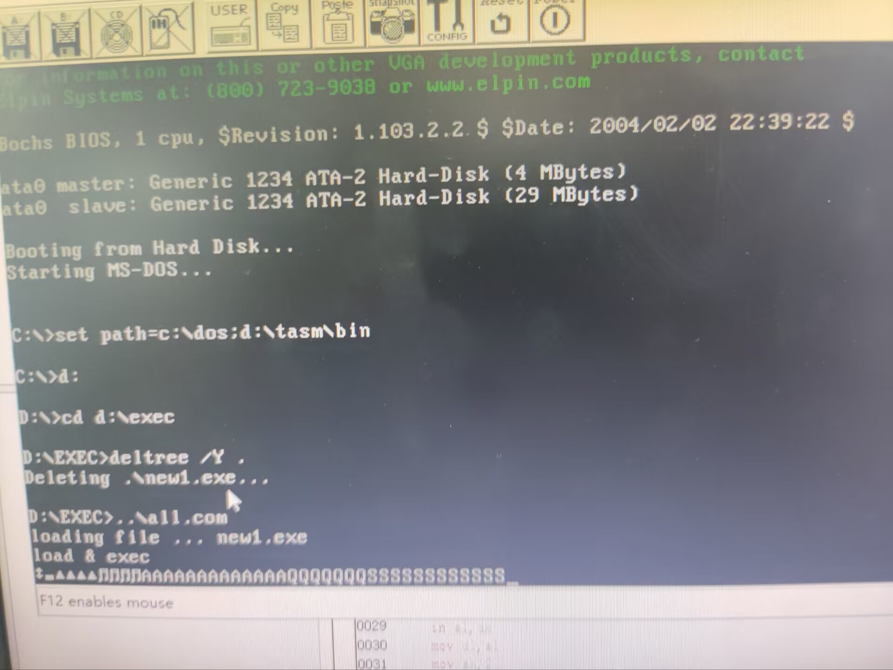

## 目的及原理

### 实验目的

了解8255芯片结构及编程方法。了解8255输入/输出实验方法

实验环境

- `Tpc-zk-II`集成开发环境
- 微机原理与接口技术实验箱

### 实验原理

方式 0 输入输出

将实验的线路连接好后，编程，将8255的C口作为输入，输入信号由8个逻辑电平开关提供，A口作为输出，其内容由发光二极管来显示。

编程从8255C口输入数据，再从A口输出



| 接线                |                         |
| ------------------- | ----------------------- |
| 8255/JP8(PC7---PC0) | 逻辑开关/JP1(K7---K0)   |
| 8255/JP6(PA7---PA0) | LED显示/JP2(L7---L0)    |
| 8255/CS             | I/O译码/Y1(288H---28FH) |

方式一选通实验

实验电路如图所示，8255B口PB2---PB0接逻辑电平开关K2～K0，8255A口接LED显示电路L0～L7,PC2(/STBB)与单脉冲的负脉冲端相连。编程按下单脉冲按键产生一个负脉冲，输入到PC2，用发光二极管LEDi亮，显示K2---K0开关的状态



| 接线                |                         |
| ------------------- | ----------------------- |
| 8255/PB2---PB0      | 逻辑开关/K2---K0        |
| 8255/JP6(PA7---PA0) | LED显示/JP2(L7---L0)    |
| 8255/PC2            | 单脉冲/负脉冲           |
| 8255/CS             | I/O译码/Y1(288H---28FH) |

方式1中断输入实验

按图8255方式1输入电路，连好线路。编程每按一次单脉冲按钮产生一个正脉冲使8255产生一次中断请求，让CPU进行一次中断服务:读取逻辑电平开关预置的ASCII码，在屏幕上显示其对应的字符，显示”NEUQ2022”



| 接线                |                         |
| ------------------- | ----------------------- |
| 8255/JP6(PA7---PA0) | 逻辑开关/JP1(K7---K0)   |
| 8255/PC4            | 单脉冲/正脉冲           |
| 8255/PC3            | 总线区/SIRQx            |
| 8255/CS             | I/O译码/Y1(288H---28FH) |

## 实验步骤及分析

### 方式0输入输出

汇编代码

```nasm
data segment
ioa equ 288h
iob equ 289h
ioc equ 28ah
iok equ 28bh
data ends
code segment
assume cs:code,ds:data
start:
    mov ax,data
    mov ds,ax
    mov dx,iok
    mov al,89h
    out dx,al
    s:
    mov dx,ioc
    in al,dx
    mov dx,ioa
    out dx,al
    mov ah,1
    int 16h
    jz s
    mov ah,4ch
    int 21h
code ends
end start
```

连接实验箱执行代码，实验现象如下：每个逻辑电平开关对应一个 IED 灯，当打开逻辑电平开关，其对应的 LED 灯将亮起

### 方式1选通实验

汇编代码

```nasm
data segment
ioa equ 288h
iob equ 289h
ioc equ 28ah
iok equ 28bh
data ends
code segment
assume cs:code,ds:data
start:
    mov ax,data
    mov ds,ax
    mov dx,offset int3
    mov ax,250bh
    int 21h
    in al,21h
    and al,0f7h
    out 21h,al
    mov dx,iok
    mov al,0b0h
    out dx,al
    mov al,9
    out dx,al
ll: jmp ll
int3:   push ax
        push dx
        push ds
        mov ax,data
        mov ds,ax
        mov dx,ioa
        in al,dx
        mov dl,al
        mov ah,2
        int 21h
        mov al,20h
        out 20h,al
        pop ds
        pop dx
        pop ax
        iret
code ends
end start
```

连接实验箱执行代码，实验现象如下：逻辑开关代表三位二进制数，发送脉冲信号后逻辑开关代表的十进制数对应的 LED 灯泡会点亮，显示输入的二进制数字

### 方式1中断输入实验

汇编代码

```nasm
data segment
ioa equ 288h
iob equ 289h
ioc equ 28ah
iok equ 28bh
t1 db 1,2,4,8,16,32,64,128
data ends
code segment
assume cs:code,ds:data
start:
    mov ax,data
    mov ds,ax
    mov dx,iok
    mov al,0afh
    out dx,al
    mov al,4
    out dx,al
    readb:
    mov dx,ioc
    in al,dx
    test al,00000010b
    jz readb
    mov dx,iob
    in al,dx
    and al,00000111b
    mov bx,offset t1
    xlat
    mov dx,ioa
    out dx,al
    mov ah,1
    int 16h
    jz readb
    mov ah,4ch
    int 21h
code ends
end start
```

连接实验箱执行代码，实验现象如下



