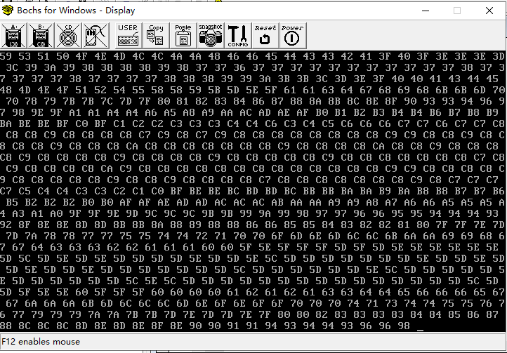

## 目的及环境

### 实验目的

了解模/数转换的基本原理，掌握ADC0809的使用方法

实验环境

- `Tpc-zk-II`集成开发环境
- 微机原理与接口技术实验箱

### 实验原理

ADC0809延时法实验


ADC0809查询法实验

按照下图进行连线，使用查询法，检测EOC状态。编程采集IN0输入的电压,在屏幕上显示出转换后的数据(用16进制数)


ADC0809中断法实验


## 实验步骤及分析

### ADC0809延时法实验

汇编代码

```nasm
data segment
in0 equ 298h
data ends
code segment
assume cs:code,ds:data
start:
    mov ax,data
    mov ds,ax
    s1:
    mov dx,in0
    out dx,al
    mov cx,0ffh
    s:loop s
    mov dx,in0
    in al,dx
    mov bl,al
    mov cl,4
    shr bl,cl
    call disp
    and al,0fh
    mov bl,al
    call disp
    mov dl,20h
    mov ah,2
    int 21h
    mov ah,1
    int 16h
    jz s1
    mov ah,4ch
    int 21h
    
disp proc
    push bx
    push ax
    push dx
    mov dl,bl
    cmp dl,9
    jbe t
    add dl,7
    t:add dl,30h
    mov ah,2
    int 21h
    pop dx
    pop ax
    pop bx
    ret
disp endp
    
code ends
end start
```

实验现象：随着手动旋转旋钮，控制外部的计时器芯片的输出脉冲宽度，改变ADC0809内部的采样电容电压稳定时间，显示器输出`00-ff`

- 当计时器的输出脉冲宽度较小时，ADC0809内部的采电容电压稳定时间较短，此时转换速度会比较快，但是精度较低
- 当计时器的输出脉冲宽度逐渐增大时，ADC0809内部的采样电容电压稳定时间逐渐变长，此时转换速度逐渐变慢，但是精度逐渐提高


### ADC0809查询法实验

汇编代码

```nasm
data segment
in0 equ 298h
ioc equ 28ah
iok equ 28bh
data ends
code segment
assume cs:code,ds:data
start:
    mov ax,data
    mov ds,ax
    mov dx,iok
    mov al,89h
    out dx,al
    s1:
    mov dx,in0
    out dx,al
    readc:
    mov dx,ioc
    in al,dx
    test al,00000001b
    jz readc
    mov dx,in0
    in al,dx
    mov bl,al
    mov cl,4
    shr bl,cl
    call disp
    and al,0fh
    mov bl,al
    call disp
    mov dl,20h
    mov ah,2
    int 21h
    mov ah,1
    int 16h
    jz s1
    mov ah,4ch
    int 21h
    
disp proc
    push bx
    push ax
    push dx
    mov dl,bl
    cmp dl,9
    jbe t
    add dl,7
    t:add dl,30h
    mov ah,2
    int 21h
    pop dx
    pop ax
    pop bx
    ret
disp endp
    
code ends
end start
```

实验现象：随着手动旋转旋钮，控制外部的计时器芯片的输出脉冲宽度，改变ADC0809内部的采样电容电压稳定时间，显示器输出`00-ff`

- 查询周期对转换精度的影响。在实验过程中，当查询周期较小时，输出信号的精度会较低，即数字信号的误差会较大。当查询周期逐渐增大时，输出信号的精度会逐渐提高，即数字信号的误差会逐渐减小。当查询周期达到一定值之后，数字信号的精度不再有明显的提高，这是因为此时芯片内部的状态寄存器已经足够稳定，不受外界干扰，从而提高了精度
- 查询周期对转换速度的影响。在实验过程中，当查询周期较短时，转换速度会较快，即转换周期会较短。当查询周期逐渐增大时，转换速度会逐渐变慢，即转换周期会逐渐增长。但是，相对于延时法实验，查询法实验的转换速度一般比较稳定，不受延时时间的影响


### ADC0809中断法实验

汇编代码

```nasm
DATA SEGMENT
in0 equ 298h
DATA ENDS
CODE SEGMENT
ASSUME CS:CODE,DS:DATA
START:
    MOV AX,CS
    MOV DS,AX
    MOV DX,OFFSET INT3
    MOV AX,250BH
    INT 21H
    IN AL,21H
    AND AL,0F7H
    OUT 21H,AL
    MOV dx,in0
    out dx,al
    
LL: JMP LL
INT3: 
    MOV AX,DATA
    MOV DS,AX
    mov dx,in0
    in al,dx
    mov bl,al
    mov cl,4
    shr bl,cl
    call disp
    and al,0fh
    mov bl,al
    call disp
    mov dl,20h
    mov ah,2
    int 21h
    mov dx,in0
    out dx,al
        MOV AL,20H
        OUT 20H,AL
        IRET
disp proc
    push bx
    push ax
    push dx
    mov dl,bl
    cmp dl,9
    jbe t
    add dl,7
    t:add dl,30h
    mov ah,2
    int 21h
    pop dx
    pop ax
    pop bx
    ret
disp endp

CODE ENDS
END START
```

实验现象：随着手动旋转旋钮，控制外部的计时器芯片的输出脉冲宽度，改变ADC0809内部的采样电容电压稳定时间，显示器输出`00-ff`

- 转换精度和稳定性。使用中断法进行转换时，芯片内部会自动控制转换和输出数字信号，从而提高了转换的精度和稳定性，减小了干扰和误差。
- 转换速度。相对于查询法和延时法实验，中断法实验的转换速度更快，因为它可以自动进行转换和输出数字信号，无需人工干预和等待查询周期。
- 中断控制。在ADC0809中断法实验中，使用中断控制器来实现自动转换和输出数字信号，可以控制中断方式、中断优先级和中断响应等参数，从而满足不同应用需求。



## 实验心得

经过本次实验，我熟悉了实验器材的使用方法和相关参数，包括模拟输入信号、模/数转换器0809芯片、示波器、稳压电源等，并且学会了设计和搭建相应的电路以及调试电路
