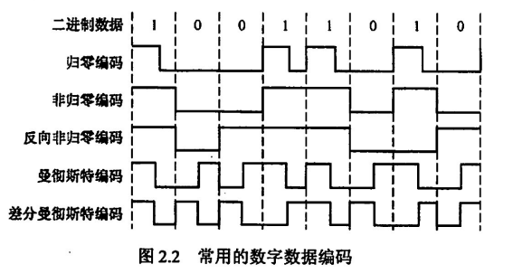

## 计网体系结构

### 计算机网络概述

网络定义：由浅到深，由基本到复杂

数据传输 ——> 资源共享 ——> 透明网络

网络组成：三种不同角度

- 软硬件、数据
- 通信子网、资源子网
- 核心部分、边缘部分

网络功能：数据传输、资源共享、分布式处理、负载均衡、提高单机可靠性

网络分类

- 范围：广域网、城域网、局域网、个人区域网
- 拓扑：总线、星形、环形、网状
- 使用者：公有、个人
- 传输技术：广播、点播
- 交换技术：报文、电路、分组
- 介质：有线、无线

网络指标：带宽、速率、时延、吞吐、时延带宽积、信道利用率等等

### 计算机网络体系结构与参考模型

三大基本概念：协议、端口和服务

- 协议：水平的，由语法、语义和同步组成，是建立一层网络结构的规则
- 端口：SAP
- 服务：竖直的，层次间通过原语交互（请求、指示、响应、证实），分为面向连接的、可靠的、有应答的三类服务

OSI 参考模型

网络接口层

- 物理层：电气特性、功能特性、机械特性、过程特性
- 数据链路层：成帧、差错控制、流量控制、传输管理

网络层（网际层，IP 层）：路由选择、流量控制、拥塞控制、差错控制、网际互联

传输层（TCP 层）：流量控制、差错控制、数据传输管理

应用层

- 会话层：建立、管理、同步、终止进程间的会话
- 表示层：编码解码、压缩
- 应用层：界面面向用户，最复杂

层层向下步步封装
$$
PDU_n = SDU_n + PCI_n
$$
对于下一层网络
$$
PDU_n = SDU_{n-1}
$$
即数据每向下传递一层，都要封装一个协议控制信息（PCI），同时当前层**的协议数据单元**（PDU）在一层作为其**服务数据单元**（SDU）

## 物理层

需要明确的是，在计算机网络中，所有的信息都要通过物理层来传播，两台主机就像两栋独立的楼，无论你住在哪一层，要给另一栋楼递东西，都要经过下楼再上楼的过程，并且在计算机网络的楼中，只有同层次的住户才可以识别并接受各自的信息

### 奈奎斯特与香农定理

信源、信道和信宿

波特（Baud）：指**单位时间内信号变化次数**（单位 Hz），在某些具体题目中，波特常常等同于**采样频率**和**带宽**

一个信号可能需要用多个比特来表示，如有三个信号 a、b、c，则需要用 0/1 串进行编码，如 01 表示 a，10 表示 b，11 表示 c

很容易可以发现，n 个长度 0/1 串可以表示 2^n 种信号，设信号种类为 V，于是所需比特长度 n 为
$$
n = log_2V
$$
波特率：即单位时间内传输波特的个数

比特率：即单位时间内传输比特的个数

在上面已经提到关于波特和比特的联系，即用比特流表示波特，满足数量关系 V = 2^n，自然比特率 R 和波特率 B 继承这样的关系，即
$$
R = B\times log_2V
$$
奈奎斯特定理
$$
B_{max} = 2W \Rightarrow R_{max} = 2Wlog_2V
$$
信噪比
$$
信噪比 = 10log_{10}\frac{S}{N}
$$
香农定理
$$
R_{max} = Wlog_2(1+\frac{S}{N})
$$

### 编码与调制

数字信号和模拟信号：也叫数字数据和模拟数据，数字信号为离散的数据，入方波，模拟信号为连续的信息，如 sin 函数

在物理信道上，分为数字信道和模拟信道，字面意思，数字信道传输数字信号，模拟信道传输模拟信号，将初始信号，**转化为模拟信号**的过程称作**调制**，**转化为数字信号**的过程称为**编码**

| 编码方法       |                                                              |
| -------------- | ------------------------------------------------------------ |
| 归零法         | 高电平表示 1，低电平表示 0，在时钟转换之前归零               |
| 非归零法       | 高电平表示 1，低电平表示 0，不归零，额外用一根时钟线来同步时钟 |
| 反向归零法     | 根据前后时钟的电平变化表示 0/1，前后电平不变，当前为 1，前后电平改变，当前为 0 |
| 曼彻斯特法     | 将每个时钟分为前后两段，从高电平变为低电平为 1，从低电平变为高电平为 0 |
| 差分曼彻斯特法 | 在将时钟分为两段的同时，根据前后电平变化表示 0/1，若上一个时钟的后半段和当前时钟的前半段相同，则表示为 1，否则表示 0 |

注意在反向归零法和差分曼彻斯特法中，对于第一个时钟信号，由于没有前驱，所以仅通过第一个时钟信号（曼彻斯特为第一个时钟的前半段）的电平判断 0/1，若为高电平则为 1，否则为 0

另外，以太网（网络层）的信号就是用的曼彻斯特编码，在这种编码下，两个电平变化才能表示一个 0/1 信息，即
$$
n = \frac{1}{2}V
$$
其比特率等于其波特率的二分之一

| 调制方法 |                                                    |
| -------- | -------------------------------------------------- |
| ASK      | 用不同振幅表示 0/1，如有振幅为 1，无振幅为 0       |
| FSK      | 用不同频率表示 0/1，如波越密集表示 1，越稀疏表示 0 |
| PSK      | 用不同相位来表示 0/1                               |
| QAM      | 正交振幅调制                                       |

对于正交振幅调制，设振幅 m 种，相位 n 种，其比特率 R 和波特率 B 满足
$$
R = Blog_2(mn)
$$
编码脉冲调制（PCM）：采样 - 量化 - 编码，将模拟数据编码为数字信号（方波），其中采样频率必须大于带宽的两倍才能采集完整（奈奎斯特定理）

频分服用调制（FDM）：将模拟数据调制为模拟信号

基带传输、频带传输和宽带传输

| 基带传输                     | 频带传输                         | 宽带传输     |
| ---------------------------- | -------------------------------- | ------------ |
| 传输数字信号，一般用于局域网 | 传输模拟信号，一般用于长距离传输 | 多路频带传输 |

### 交换技术

| 交换技术           |                                                              |
| ------------------ | ------------------------------------------------------------ |
| 电路交换           | 电路直连，参考通电话                                         |
| 报文交换           | 一大段一大段发，再一大段一大段接收                           |
| 分组交换（网络层） | 分为数据报交换和虚电路交换，采用流水线工作方式，直接提升了报文交换的的传输速率 |

复习一下：网络层的数据单位为分组，链路层为帧，物理层为比特，传输层为报文

数据报分组交换（UDP）：邮件发送，不同分组通过不同结点任一通路传输，不保证有序性（不可靠）

虚电路分组交换（TCP）：语音通话、语音信息，通过虚电路标识符（VCID）在网络中同一路径传输，可靠的（保证分组有序到达），面向连接的

都说了虚电路其实就是一个 TCP 连接，自然需要经过建立连接（三次握手）、数据传输和连接释放（四次挥手）三步骤

### 传输介质

| 传输介质 |                                             |
| -------- | ------------------------------------------- |
| 双绞线   | 两根独立的绞合铜线，外加包皮，传递电信号    |
| 同轴电缆 | 内导体（铜制）加多层包皮，传递电信号        |
| 光纤     | 分为单模光纤和多模光纤，传递光波信号        |
| 无线介质 | 有无线电波（移动热点）、 微波、红外线和激光 |

传输速率：光纤 > 同轴电缆 > 双绞线

这和传播物理介质息息相关，显然光的传播速度大于电，而对于同样用电传播的双绞线和同轴电缆，后者的铜芯更大，于是速度更快

传输距离：光纤 > 同轴电缆 ≈ 双绞线

光更适合远距离传播（主要原因是传播过程中抗干扰能力远大于电，不需要额外维护），用光纤做远距离传播介质更加实惠经济，用电传播的双绞线和同轴电缆在进行远距离传播时，需要借用物理层设备如放大器或中继器用以恢复信号特征

传输介质，又被称作计算机网络的第 0 层，他和物理层的主要区别就是，物理层能够通过规定电气特性的功能识别信号中的有效信息，即 0 和 1，从单纯的波信号升级为所谓的比特流

### 物理层设备

| 物理层设备     |                                                             |
| -------------- | ----------------------------------------------------------- |
| 放大器、转发器 | 用以放大模拟信号                                            |
| 中继器         | 用以重整数字信号并转发，不能无限中继，必须满足 5-4-3 原则） |
| 集线器（Hub）  | 具有多个端口的中继器集合                                    |

注意所有物理层设备都只认物理端口，即插拔的那个现实端口，通过不同端口进行转发，同时无法进行任何形式上的路由选择，只死认端口

物理层接口的特性：电气特性；机械特性；功能特性；过程特性

电气：特指电压、电流大小范围

机械：指摸得着的特征，如有几个引脚，几个插口

功能：指电压对应的逻辑信息，如 10-15V 对应信号 1

过程：指传输过程中的时序，各种事件的出现顺序
