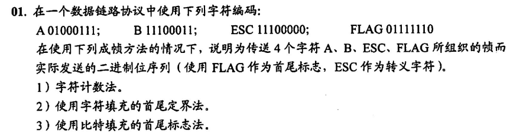
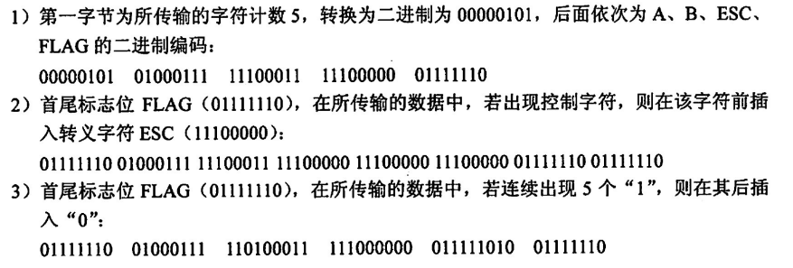
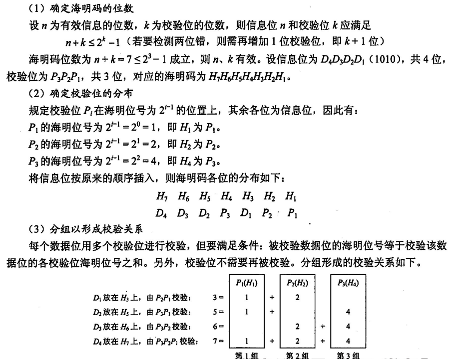
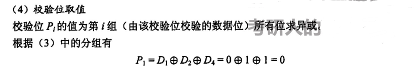
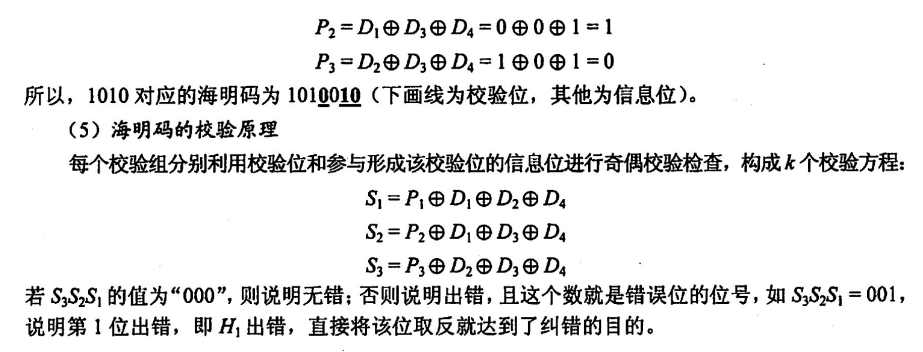
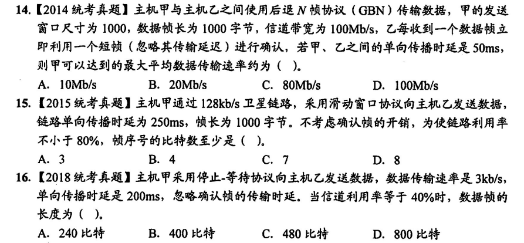
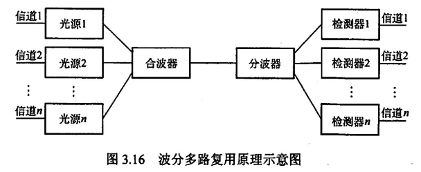

链路是一条**逻辑信道**，建立在物理信道之上，并不是物理存在的通路，网络层和更上层的连接也一样，所谓主机到主机的连接或者是端口到端口的连接，都是一种逻辑连接，在物理层之上通过各种协议封装而成，最终数据都是以比特流的形式通过物理信道传输，这是要明确的

该章和网络层是考察重点

## 链路层概述

为网络层提供服务：其基本功能就是把网络层的数据（分组）从源机器传输到目的机器的网络层

链路管理：链路层可以提供面向连接的可靠的服务，在这样的服务中链路管理是必须的

界定帧、帧同步和透明传输：通过封装比特流的头部和尾部将一个个帧分隔；接收方要给予某种反馈来实现帧传输的同步

流量控制：针对发送方的控制，防止发的太多导致接收方带宽不够接收出错

差错控制：出错了怎么办，ARQ 法，采用 CRC 冗余校验和 ARQ 自动重传请求，确认帧是否被正确接收，并保证每个帧最终都能有且只能有一次正确的接收

## 组帧

> 帧需要实现帧界定、透明传输、可靠传输等功能

### 帧的界定

帧需要首尾来界定，因为这是封装的第一层，封装的对象是比特流，需要首尾共同截取一段比特流来组成帧

| 界定帧的方法     |                                                              |
| ---------------- | ------------------------------------------------------------ |
| 字符计数法       | 在首部用一个计数段来表示当前帧的长度，如 21354322 则表示三个帧 21、354、322，显然若计数段出错数据将发生毁灭性的错误 |
| 首尾字符串定界法 | 采用固定的字符 SOH / ETO 表示帧的开始和结束，同时用转义字符 ESC 来表示数据段中的 SOH 和 ETO 串 |
| 首尾比特串定界法 | 用 01111110 表示首尾，数据段每碰到五个连续的 1，追加一个 0，接收方再去掉数据段每五个连续的 1 之后的 0 得到源数据 |
| 违规编码法       | 适用于曼彻斯特编码，因为在这种编码中，每一个码元，高电平到低电平表 1，低电平到高电平表 0，高到高和低到低不存在（违规），于是很巧妙地用这种违规的码元来界定帧地开始和结束 |

举个栗子

信息段对界定方法的处理方式即为透明传输（信息段除了是一串二进制数之外没有任何含义，需要向上拆封识别）

## 差错控制

> 比特差错控制：奇偶校验码、循环冗余码、海明码

差错（比特差错）：在比特流传输过程中，1 变为 0，0 变为 1，这样的错误叫做比特差错

利用**编码技术**进行差错控制，编码分为两类

- 检错编码，自动重传请求 ARQ
- 纠错编码，前向纠错 FEC

### 奇偶校验码

校验的是帧中 1 的个数，只能检验出奇数个比特差错，当差错个数为偶数个时，无法检测

奇校验指通过补一位比特使得帧中 1 个数为奇数，若接收帧中 1 个数为偶，说明出错；偶校验即补一位使帧中 1 个数为偶，若接收帧 1 个数为奇，则出错

### 循环冗余码

模 2 除法：最高位对齐（均为 1），余下位若相同，则余 0，若不同则余 1

除数：即为发送方和接收方所商定的多项式，多项式和数的转化如下（就是系数是否存在的 0/1 串）
$$
x^4+x^2+1 \rightarrow 10101
$$
若除数共 n 位，则余数一定是 n-1 位，于是在原帧后补上 n-1 位作为校验码，初始化位 0

被除数（帧比特本身）除以除数（多项式）所得的余数，即为 n-1 位的校验码，一定注意要高位的 0 不能略去

当接收方接收的帧的校验码不能被多项式整除时，说明数据出现差错，这样的校验能够检验小于等于 n-1 位的比特差错

### 海明码

> 又叫汉明码

设原始帧比特长度为 n，海明校验码长度为 k，其长度关系一定满足
$$
n+k \leq 2^k-1
$$
举一个 1010 的海明码编码过程原理示例

## 流量控制与可靠传输机制

### 流量控制 - 滑动窗口机制

在链路层，流量控制和可靠传输是交叉实现的，流量控制使用滑动窗口实现，可靠传输通过自动重传请求实现

其中，滑动窗口根据发送/接收方窗口大小分为

- 停止 - 等待协议
- GBN 协议
- 选择重传协议

自动重传请求中，常常分别有 GBN 自动重传请求和选择重选，这建立在连续 ARQ 滑动窗口流量控制的基础上（所以说是交叉实现的）

| 流量控制           |                        |
| ------------------ | ---------------------- |
| 停止 - 等待协议    | 发送窗口 1，接收窗口 1 |
| Go Back N 协议     | 发送窗口 n，接收窗口 1 |
| 选择重传协议（SR） | 发送窗口 n，接收窗口 n |

这里的窗口中的帧（窗口大小的单位为帧的个数）都是需要编号的，以保证发送帧的有序性和排错，所以需要 n 位比特位来对窗口进行编号

n 位比特位，对于 GBN，可以对发送窗口中最多 k1 个帧进行编号，还剩一个需要对接收窗口（1 个）进行编号，其中
$$
k_1 = 2^n-1
$$
对于 SR，可以对发送窗口中最多 k2 个帧进行编号，其中
$$
k_2 = 2^{n-1}
$$
因为发送窗口不能大于接收窗口，所以发送窗口最大是平分，另外，接收窗口大于发送窗口将没有意义，所以，接收窗口最大也是评分，均为全体编号数的 1/2

信道效率的求解，L 为帧长，C 为传输速率，T 为一个发送周期
$$
\frac{L/C}{T}
$$
T 由这几个部分组成：发送时间 - 传输时间 - 确认帧发送时间 - 传输时间 

- 其中发送时间和带宽有关
- 传输时间和信道的传输速率有关

有时确认帧的发送时间可省略（确认帧很短，如停止等待协议只有一个比特），但两个传输时间是必须的

几个栗子：请重复做，答案为 C、B、D

### 可靠传输 - 自动重传请求机制

建立在 GBN 和 SR 的基础上

对于 GBN 协议，当接收方收到错误的帧时，将不会给发送方发送确认帧，发送方在该帧超时后，自动从该帧开始重发包括该帧之后的所有帧，以保证帧传输的有序性

很多时候，GBN 并不会一个一个返回确认帧（浪费），可能传输了 0，1，2，3，4 四个帧之后，接收方返回一个确认帧，假设确认的是 3，则说明 3（包括 3）之前的帧都已经被正确接收

对于 SR 协议，由于接收窗口大小为 n，其并不保证帧的有序到达，所有在返回处理发送错误的帧时，只会对没有确认的帧进行重发，而不会管已经确认过的帧

## 介质访问控制

就是如何在一条物理信道上划分不同独立的逻辑信道的方式方法

### 信道划分介质

逻辑划分物理信道

| 信道划分         |                                                              |
| ---------------- | ------------------------------------------------------------ |
| FDM 频分多路复用 | 不同频率上传输不同信号，如收音机                             |
| TDM 时分多路复用 | 时间片轮转算法                                               |
| WDM 波分多路复用 | 将光波通过合波器整合传输再通过分波器分开读取，每中频率的光波代表一条信道 |
| CDM 码分多路复用 | 通过正交编码向量区分不同信道的信号，CDMA 码分多址            |

时分复用 TDM 又分为

- 同步时分多路复用
- 异步时分多路复用（又叫统计时分多路复用 STDM），**其时间片分配是动态的**

频分复用 FDM 不能传输数字信号，所以在实际应用中 TDM 更广泛

波分多路复用用于光纤信道

CDMA（码分多址，码分复用）

每个站点占据一个唯一的码片，假设站点 A 码片为 1101，则 C 接收的 A 信号中，1101 表示 1，码片反码 0010 表示 0

- 为了方便计算，码片中用 -1 等价于 0

多个站点传输信号时，各位置直接相加，如有

| 站点 | 码片     |
| ---- | -------- |
| A    | 1 1 -1 1 |
| B    | 1 1 1 -1 |

码分多址中要求各站点码片正交

当 C 受到 A、B 的复合信号 T = 0 0 -2 2，如何区分各站点的信号？做规格化内积（向量内积除以向量维度）
$$
\frac{P_A\cdot T}{dim(T)} = \frac{4}{4} = 1\\
\frac{P_B\cdot T}{dim(T)} = \frac{-4}{4} = -1
$$
所以识别出 A 传输的信号为 1，B 传输的为 0

### 随机访问介质 - 争用式

不划分信道，所有信号通通传输，但需要避让和优先级判断，传输失败的信号自动重传，**争用式的使用信道**

涉及的协议：ALOHA ——> 时隙 ALOHA ——> CSMA ——> CSMA-CD / CSMA-CA

- 从 ALOHA 到 CSMA 协议，加入了侦听
- 从 CSMA 到 CSMA-CD 加入了碰撞检测，即在传输的同时检测碰撞是否发生
- 从 CSMA 到 CSMA-CA 加入了碰撞避免，要求一个帧在传输过程中就要受到确认帧，否则认为发生碰撞，终止传输（最小帧）

注意，争用式的使用都无法完全避免冲突，即均有可能发生冲突

在 ALOHA 协议中，一旦传输错误，则立即重发帧，无需等待，加入时隙后，只在每个时隙的开始进行重发，能够避免一些冲突

CSMA 的三种类型

- 1-坚持：很执着，忙则一直侦听，空闲则立即发
- 非坚持：很随意，忙则随机停一段时间，再侦听
- p-坚持：比较随意，忙则持续侦听（根据时隙），空闲则有 p 的概率发送帧

CSMA-CD：先听后发，边听边发，冲突停发，随机重发

CSMA-CA：冲突避免，信道预约

二进制指数退避算法，设重发次数为 k，基本退避时间为**争用期 2τ**，则选取
$$
a \in [\,0, 2^k-1\,]
$$
等待时间 t 则为
$$
t = a\times 2\tau
$$
需要注意的是，我们认为，距离重传的时间越长，越不容易再次发生冲突

CSMA-CA / CSMA-CD 的最小帧长度 L 为
$$
L = 2\tau\times V
$$
其中 V 为信道的传输速率，其实就是两个 t2，一来一回两个传输时延，也叫往返时延，但需要严重注意，二者要求最小帧的原因是不同的

- CSMA-CD 为了保证能够在数据发送完毕之前检测到冲突，即在数据发送完前冲突信号要回传到发送点，当帧发送时间大于等于争用期时，无论发送的什么时间点发生冲突，都可以在发送完毕前收到冲突信号
- CSMA-CA 为了保证确认帧及时收到，即在数据发送完毕之前收到确认帧

CAMS-CA 的帧间间隔时间 IFS（InterFrame Space）

- DIFS（最长），数据帧发送前需等待一个 DIFS
- PIFS
- SIFS，确认帧，控制帧发送后需等待一个 SIFS

CSMA-CA 和 CSMA-CD 的异同

- CD 适用有连接局域网，CA 适用无线局域网
- 二者均有确认帧和最小帧长限制

### 轮询访问：令牌传输协议

常用于环形局域网，每个站点先拥有令牌，才可以进行帧的传输（此时单站**独占**所有带宽），且令牌的分配是**动态**的（这里可以参考动态时间片轮转算法）

也就是说，每个站点获取令牌后并不一定能发送完自己的帧

令牌传输（Token）非常适用于**网络负载大**的网络，因为令牌传输不存在冲突，而网络负载大造成的冲突可能会令争用式的代价非常之大
