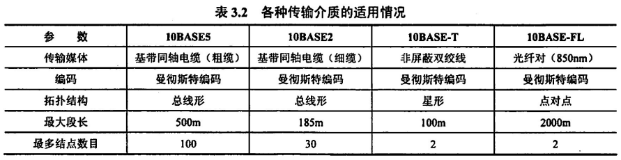

IEEE（美国电气电子工程师协会）的经典贡献：有关局域网的 802 系列协议

## 局域网

局域网的实现遵守 IEEE802 系列协议，如

- 802.3，以太网（总线型）
- 802.5，令牌网（环形）
- 802.11，无限局域网（星形）

### 802.3 协议

> 以太网，有线局域网

以太网协议，使用 CSMA-CD 进行访问介质控制，通过广播和 MAC 地址识别进行数据传输

MAC地址长度为 6B，前 24 位表示网卡厂商，后 24 位为网卡编号，都是网卡做出来的时候烧的，唯一

以太网的 MAC 帧格式

- 6 + 6 + 2 + 46~1500 + 4
- 源地址 + 目的地址 + 帧类型 + 数据段 + 校验码（FCS）

最大为 1518B，**最小为 64B**，这是因为，我们认为有限局域网传输速率为 10Mb/s，争用期为 51.2μs，故
$$
L_{min} = 51.2\times10^{-6}\times10^7 = 512b = 64B
$$
而最大是因为规定以太网 MAC 帧的数据段最长为 1500

各种传输介质下的以太网特征，需要记忆

在上述介质中，T 表示双绞线，2/5 数字表示同轴电缆（数字越大电缆越粗，段长越长），FL 表示光纤

其他以太网

- 高速以太网：减少站点之间距离，拉高传输速率，保持最短帧长度
- 吉比特以太网（1Gb/s）：可半双工，可全双工，注意在半双工时实际带宽为额定带宽的一半
- 10 吉比特以太网（10Gb/s）：只支持双工通信，无冲突，可以双绞线也可以光纤

注意，所有类型的以太网均在同一广播域，这意味着所有信息都在总线上进行广播，广播的对象甚至包括发送信号的站点自身

### 802.11 协议

> 无限局域网

无限局域网协议，使用 CSMA-CA 进行访问介质控制

| 组成         |                                     |
| ------------ | ----------------------------------- |
| BSS          | 基本服务集                          |
| AP           | Access Point，接入点，需要分配 SSID |
| DS           | 分配系统，用于连接不同基本服务集    |
| base station | 基站，分为移动的和固定的            |
| ESS          | 拓展服务集                          |

移动基站的漫游：在一个 ESS 中，基站从一个 BSS 漫游到另一个 BSS，其仍属于同一个 ESS，但接入点 AP 发生改变

802.11 首部（共 30 B）的三地址

分为`to AP`和`from AP`两种，通过两个标志位区分，三地址中，第一个地址始终是发送帧的直接站点地址，第二个始终是接收帧的直接站点地址，第三个

- 若为`to AP`，则为最终的目的 MAC 地址
- 若为`from AP`，则为发送帧的源物理地址

802.3 帧和 802.11 帧是可以相互转化的，只需要改变首部的一些字段即可，在封装网络层 IP 数据报时，先通过 ARP 协议将其转化为 802.3 帧，再在局域网中封装为 802.11 帧

为什么 802.1Q 使用 CSMA-CA 而不使用以太网的 CSMA-CD 来减少冲突呢？

- 无限局域网的信号弱，碰撞检测（CD）的难度大
- 无限局域网很多站点不能感受到局域网中的所有站点，根本无从进行碰撞检测（这是 CSMA-CD 的必要条件，即不存在隐蔽站）

### 802.1Q 协议

> VLAN，虚拟局域网

一个以太网是一个广播域，即使用交换机将以太网分割开，其仍是一个广播域

虚拟局域网（VLAN）协议，在 802.3 以太网 MAC 帧的基础上**加入了长度为 4B 的 VLAN 标签**构成 802.1Q 帧（最长为 1522），将局域网从逻辑上分割成若干小的广播域

VLAN 既可以划分冲突域，又可以划分广播域（以太网交换机只可以划分冲突域）

虚拟局域网的划分方法，常有三种

- 基于网卡地址（MAC 地址）划分
- 基于网络层地址（IP 地址）划分
- 基于交换机端口划分

## 广域网

广域网是因特网（互联网）的核心部分，自然局域网是因特网的边缘部分，注意因特网可以连接不同类型的网络（如局域网、广域网），显然局域网和广域网是做不到的，这不失为因特网和广域网的一大差别

我的理解为，局域网和广域网的复杂网络共同构成了互联网，其中交换机、路由器等设备连接、中转各种网络

相比于局域网，广域网的覆盖范围极大，并且涉及 ISO 网络体系结构的下三层，主要使用的协议在网络层（局域网主要在链路层），这是由网络封装数据时主要所使用的协议决定

广域网解决的重要问题：路由选择和分组转发（同样也是网络层解决的主要问题）

- 都分组转发了，其数据传输一定采用的**存储转发式**以及**分组交换技术**

广域网之中，数据最终还是通过比特流传输，一定会经过链路层（和局域网一样，其接收上层的报文，在相应链路层协议下封装成帧，最终通过比特流在物理介质上传输），广域网使用的链路层协议为：PPP 协议和 HDLC 协议

### PPP 协议

Point to Point 协议，是一种**使用串行线路通信的、全双工的、面向字节的、有连接的**链路层传输协议，**应用在直接连接的两个结点的链路上**

PPP 基于 SLIP 协议，后者只适用于上层使用 IP 协议的网络层数据在链路层的封装

PPP 协议的内容包括三部分

- LCP：链路控制协议，用于链路连接的建立、销毁等
- NCP：网络控制协议，PPP 协议允许同时采用多种网络层协议，NCP 用以适配不同的网络层协议，为网络层协议建立和配置逻辑连接
- 一种成帧方法，即规定 PPP 帧格式

PPP 的帧格式

其中 F 为标志字段，标志帧的开始和结尾，A 为地址字段，C 为控制字段，协议字段标明所使用的网络层协议（前面提到了 PPP 可以兼容不同的网络层协议），FCS 为老朋友校验码，这里占 2B

这里明确指出，PPP 帧的信息部分 SDU 就是上一层的 PDU，即 IP 数据报（报文），回顾一下（n-1 表示封装的前一层）
$$
PDU_n = PCI_n + PDU_{n-1}
$$
PPP 帧采用首尾字符定界来界定帧，其首尾标志位 7E，即 0111 1110 来表示帧的开始和结束，信息段的 7E 采用转义字符的方式来处理，PPP 帧的转义字符为 7D，则信息段的 7E 则表示为 7D7E

由于 PPP 是点对点的（主机对主机），肯定没有冲突，根本不需要冲突检测/避免，所以没有最短帧限制，自然不需要有信息段大于等于 46B 的限制

可以发现，PPP 帧所有字段都是按照字节来分段，也就是说 PPP 帧的长度一定为整数字节，这也是为什么说 PPP 是面向字节的链路层协议

### HDLC 协议

HDLC 是 PPP 协议的基础

已经很少用了捏，是一种面向比特的协议，采用首尾比特串定界法，使用 01111110 来标志帧的开始和结束，信息段对于连续的五个 1 采用 0 比特填充法（即碰到五个连续的 1，则在其后面填充一个 0），以实现透明传输

## 链路层设备

### 以太网交换机

> Switch

以太网交换机、集线器和虚拟局域网的区别

| 交换机（Switch）         | 集线器（Hub）            | 虚拟局域网技术（VLAN）     |
| ------------------------ | ------------------------ | -------------------------- |
| 隔绝冲突域，不隔离广播域 | 啥也隔绝不了，纯纯的广播 | 既隔绝冲突域，又隔离广播域 |
| 多端口网桥               | 多端口中继器             | 802.1Q 帧                  |

选择 B、D

交换机的带宽：每个端口独占其端口的带宽，交换机的总带宽（总容量）为所有端口带宽之和

- 注意交换机可以是全双工也可以是半双工的，若是半双工的交换机，其总带宽为所有端口带宽和的**一半**

交换机的自学习算法：维护一个交换表，每当有站点从其相应端口向交换机传入帧时，将其 MAC 地址和对应端口写入交换表，同时根据帧的目的地址先在交换表中寻找对应端口

- 若有，则发送至相应端口
- 若无，则广播除发送端口的所有端口

注意只有传入交换机的站点才写入其端口表项，若已有则更新

这里选择 D，不难看出，这个废物 Hub 啥也不隔离，直接广播所有与其相连的设备（至少在物理上一定是传输过去了，只是会被丢掉），而 Switch 因为 H2 传入过帧，所以在发送确认帧时交换表中有其 MAC 地址对应的表项，直接发送相应端口即可，无需广播

注意这里的交换机的前缀是以太网交换机，是不是意味着还有广域网交换机，这是肯定的，在上面的互联网的概念图中，作为核心部分的各个广域网，就是通过交换机相连接，广域网和局域网通过路由器相连接

遗留了一个问题，为什么是 2^n-1，没看懂

