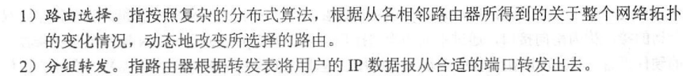
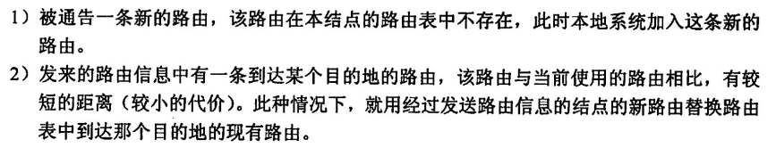
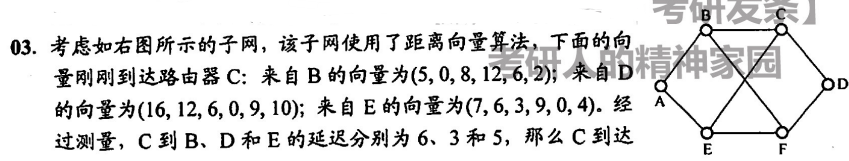
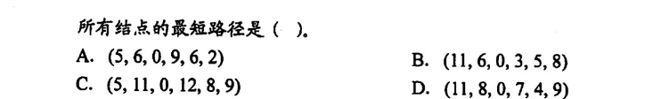
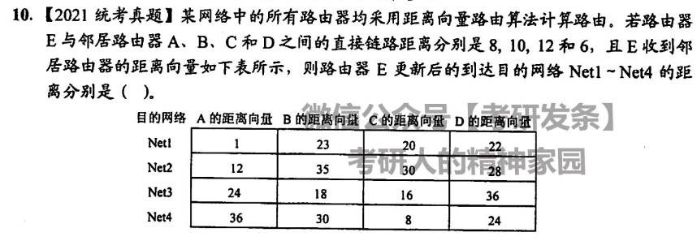
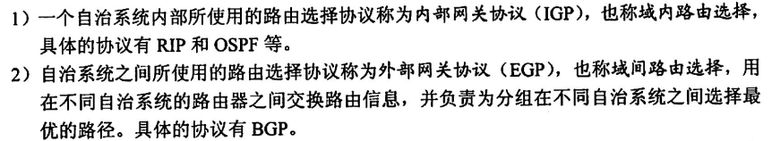

网络层，重中之重，甚于链路层，提供无连接、不可靠但统一的传输服务（统一下三层所有不同的协议）

> 我对整个网络的传输过程产生了疑问，网络层说是通过相同的 IP 协议统一了下三层的不同网络，如局域网和广域网，但分组在网络层，帧首尾部套在分组的外侧，最终数据以比特流在物理链路上传输，即使不同的网络在网络层识别到所谓统一的 IP 分组，但怎么去拆解不同的帧从而得到这个 SDU 呢
>
> 就是说，你通过网络层协议来统一，但网络层协议在数据的内层，在接收时首先是识别不到的（先识别帧再得到 IP 分组），那是怎么通过一个首先识别不到的数据来辨识一段比特数据呢？

整个计算机网络就是一个无向图，涉及一些简单的图算法用于路径选择（路由）

## 网络层的功能

### 连接异构网络

异构网络相连，所谓的统一下三层的不同网络，通过路由器将使用不同下三层协议的网络中继相连接，组成一个大的互联网，这不同于以太网交换机和集线器，这两个东西都只是扩大了广播域，相当于将同一个网络扩展，并没有连接其他网络

### 路由和转发

路由和转发：路由选择和分组转发，后者根据前者的信息进行



### SDN

SDN 基本概念：Software Definition Network，软件定义网络，通过软件控制网络的两个主要功能，即路由和转发，将网络分为两层，控制层和数据层，前者负责路由，采用集中控制的方法，后者负责转发，采用分布式处理（在寻常网络中，二者均为分布式）

- 控制与转发功能分离
- 控制层面集中化
- 接口开放可编程

### 拥塞控制

拥塞控制：由于出现过量的分组而引起网络性能下降的现象称为拥塞，正常来说网络负载线性增加，网络吞吐量也该线性增加，当分组逐渐增加，随着网络负载增加，网络的吞吐量增加缓慢甚至不动，考虑网络已经发生拥塞（被丢弃的分组的数量已经严重影响到了网络性能）

流量控制和拥塞控制的区别：流量控制是点对点的，仅仅对发送端进行流量限制（通过滑动窗口机制），而拥塞控制是网络全局的问题，涉及网络中的所有主机、路由器

拥塞控制的方法：开环控制（预防）和闭环控制（基于反馈）

## 路由算法

每个结点都维护的有一个路由表（结点可以视作为一个路由器），记录去往另一结点的路径和代价（无向无环图）

### 距离-向量路由算法

>  RIP/OSPF

回顾一下图算法中求解多源最短路径的弗罗伊德（Floyd）算法，遍历所有结点的直接边，通过以下公式更新结点间最短距离
$$
<V_i,V_j> = min\,\{<V_i,V_j>, <V_i,V_k>+<V_k,V_j>\}
$$
距离-向量路由算法：每个结点将自身的路由表直接发送给相邻的所有结点，结点收到路由表后，通过和弗罗伊德算法一样的更新公式去更新自身的路由表

更新的时机为



向所有相邻结点发送路由表的时机为：每次路由表有所更新后

**路由环路**（是个啥）的问题：当慢收敛导致路由器收到了无用的路由信息时，很可能发生路由环路

举个栗子





维护这样一张路由表

| 源结点\目的结点 | A             | B    | C    | D    | E    | F           |
| --------------- | ------------- | ---- | ---- | ---- | ---- | ----------- |
| B               | 5             | 0    | 8    | 12   | 6    | 2           |
| D               | 16            | 12   | 6    | 0    | 9    | 10          |
| E               | 7             | 6    | 3    | 9    | 0    | 4           |
| C               | min(11,19,12) | 6    | 0    | 3    | 5    | min(8,13,9) |

故 C 到其余结点的最短路径为 [11,6,0,3,5,8]，选 B

再举一个栗子




同样的更新策略，已知

| 源节点\目的节点 | A    | B    | C    | D    |
| --------------- | ---- | ---- | ---- | ---- |
| E               | 8    | 10   | 12   | 6    |

和题给路由表，则有

| 源节点\目的节点 | Net1            | Net2             | Net3             | Net4             |
| --------------- | --------------- | ---------------- | ---------------- | ---------------- |
| E               | min(9,33,32,28) | min(20,45,42,34) | min(32,28,28,42) | min(44,40,20,30) |

故 E 到 net 的最短距离为 [9,29,28,20]，故选 D

### 链路状态路由算法 

> BGP

迪杰斯特拉算法（Dijkstra）：选取当前结点，更新所有直接相连的结点距离（不相邻距离记为 ∞），选定距离最小的结点作为新当前结点，并认为前一结点距离源的最短路径已被确定（和普利姆算法其实一模一样，只不过目的不同，要求权值和最小）


在链路状态路由算法中，所有结点的路由表是一致的，记录了当前结点到整个网络中其他所有结点的最短路由，每个结点都维护了一个单源最短路径路由表

当当前结点路由表发生改变后，将向网络中除直接连接的所有结点发送它完整的路由表，这一操作叫做**洪泛法**，就像泛洪一样把路由表狠狠的群发

收到路由表的结点通过迪杰斯特拉算法更新自身到所有节点的最短路径表，即路由表，完成一次更新

### 层次路由

就是把每个网络的路由转发分为两种，即在自治系统内部的路由和自治系统外部的路由（即连通其他路由器的路由）



每个路由器（自治系统）都知道自身区域如何把分组转发到目的地的细节，但对其他区域的内部结构一概不知

## 路由协议和路由器

### RIP

应用层协议，RIP 信息通过 UDP 数据报在各路由器之间进行传输，将自身结点到所有结点的单源最短路径传输给相邻的路由器结点，当路由器收到来自相邻结点的包含 RIP 数据的 UDP 数据报后，将根据相邻结点的单源最短路径更新自己到任一结点的单源最短路径，更新规则如下

- 当当前路由表中没有到某一结点的表项，而收到的 UDP 数据报表中存在，直接写入当前路由表，并且将路径长度 +1
- 当当前路由表中存在到 u 的表项，假设长度为 n，但收到的路由表到 u 的距离为 u-2，则更新当前路由表到 u 的表项为收到的那一条，并且长度重写为 n-1
- 其余情况不做改变

可以发现，RIP 协议是通过相邻结点的单源最短路径去构造自身的单源最短路径的过程（跳数最少），当距离 >=16 时，我们认为结点不可达

RIP 协议在网络状况差的情况下有可能出现慢收敛问题，且开销随结点数增加（网络规模扩大）不断扩大，所以一般适用于较小的网络

### OSPF

网络层协议，OSPF 数据通过 IP 分组在路由器间传输，通过洪泛法，将自身结点到达相邻结点的距离发送给每一个结点，每一次发送，每一个结点都将根据 Dijkstra 算法通过每条边的距离以及该结点的可达性更新自身已知的可达结点的最短路径

- OSPF 采用 Hello 分组来保持和邻居的连接

第一次迭代，每个结点将只发送和自身直接相邻的结点的距离给剩余结点；第一次更新，每个结点将获得和自身一次间接相连的所有结点的最短路径

以此类推，在不断发送的过程中，结点将不断获取距离自身更远的结点的最短路径距离，以此构造一张统一的路由表

- 为了减小洪泛法的代价，OSPF 还将同一网络按照层次结构分为不同的区域，最上层的称为主干区，在区域内执行洪泛（区域种类增多，传输更复杂）

不同于 RIP，OSPF 不存在慢收敛问题，适用于较大的网络

另外，OSPF 的路径权重并不是简单的跳数（代价最低），这可以根据相邻结点的传输速率动态调整，也给了网络最优路径判断更灵活的选择

### BGP-4

网络层协议，BGP 信息通过 TCP 连接在网关路由器之间传输，每次传输的数据为路由的完整过程，即整条路径（RIP 和 OSPF 都是传输基于下一跳的路由信息）

每个自治系统（AS）维护一个 BGP 发言人，各自治系统通过 BGP 发言人通过 TCP 连接传输 BGP 协议信息构造路由

### 路由器

网络层设备，是一个多端口网桥，是下三层中唯一可以分割广播域的设备，为什么网桥不可以呢？他他妈就一个端口，分割个毛线，想分割起码得两个吧

- 想减缓广播风暴：加路由器

而中继器、交换机更加不能分割广播域，由这二者连接的设备仍然属于同一局域网，在进行 MAC 帧传输时，将广播到局域网中的每个主机

路由表和转发表，后者基于前者

路由表

```sql
create table routing_table(
    int(32) dist,
    int(32) mask,
    int(32) `next`,
    varchar port
);
```

转发表

```sql
create table routing_table(
    int(32) dist,
    varchar port
);
```

为什么没有距离选项？根据题意自行添加
