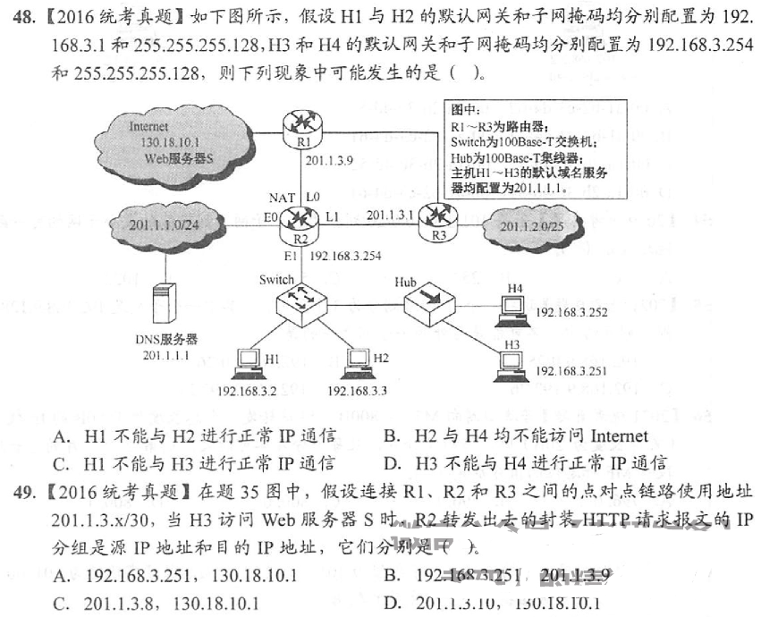
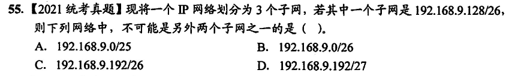
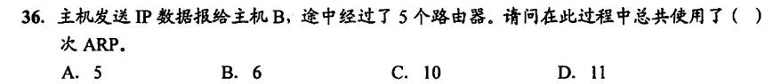

重中重中重

为什么说网络层统一了下三层的数据传输？数据通过 IP 地址在异构网络中进行定位，但注意实际传输的仍然是比特流（或者说，是帧），帧和分组在每个转发的站点进行拆封和封装，由内部的 IP 地址，通过 ARP 等协议获取下一跳的 MAC 地址（这里实际上是把 MAC 地址映射到 IP 地址上），帧在物理链路上传输的定位一定还是靠的 MAC 地址

## IPv4 和 NAT

### IPv4 地址结构

IP 协议（因特网协议 Internet Protocol）

IP 地址结构：网络号 + [子网号] + 主机号（共 32 位，4B）

- 私有 IP，工作在局域网内，是局域网路由器给内网主机分配的 IP，可重用，一般以 10 或 192 开头，并采用 VLSM 技术（可变长子网掩码）
- 共有 IP，工作在互联网上，唯一，用以互联网核心部分通信

IP 分组首部格式：20B 固定长度和可变长度组成

长度计量

- 首部长度计量单位位 4B，即 011 表示首部长度为 12B
- 分组总长度计量单位位 B
- 片偏移计量单位为 8B，如 200 表示片偏移为 1600B

分片问题：由于物理链路上帧长度受限，最大为 MTU，则分组总长度不得超过 MTU，超过部分需要分片处理（分为多个 IP 分组，每个分组有其对应的首部，来自同一 IP 分组的片首部标识一样）

所有分片在到达目的地址主机上后根据片偏移进行重组

### 特殊 IP 地址

特殊的 IP 地址

| 特殊网络号      |                    | 特殊主机号   |                                        |
| --------------- | ------------------ | ------------ | -------------------------------------- |
| 127.x.x.x       | 环回自检地址       | 主机号全为 0 | 表示本网络自身                         |
| 0.0.0.0         | 表示当前网络       | 主机号全为 1 | 表示本网络的广播地址，又叫直接广播地址 |
| 255.255.255.255 | 当前网络的广播地址 |              |                                        |

故一个网络号若主机位为 n，则其能表示的主机个数为
$$
2^n-2
$$
由于全 0 和全 1 的主机位被用作表示本身和直接广播地址，但在无分类的 IP 中，你要硬多连接两个主机，也不是不行，通常不这么做

分组在互联网中的转发是一个不断拆解和封装的过程

- 如先在广域网中传输，封装为 PPP 帧
- 到达路由器后，拆封解析 IP 分组，封装为 802.3 帧
- 发送到有线局域网的接入点 AP，AP 再拆解封装为 802.11 帧
- 最后发送到无线局域网的主机上并拆解成有效的信息 SDU

回环测试地址和本地主机地址的区别：0.0.0.0 和 127.0.0.1 都用以表示自身主机，前者作为源地址发出，后者作为目的地址接收

当发送给自己时，采用回环测试地址，0.0.0.0 只用于发送分组表示自身网络

### 分类网络

网络分类（现在已经基本不用了，采取子网划分和 CIDR 的方式分配 IP）

| 类型 | 结构（网络号 + 主机号 = 4B）                                |
| ---- | ----------------------------------------------------------- |
| A类  | 1+3                                                         |
| B类  | 2+2                                                         |
| C类  | 3+1                                                         |
| D类  | 网络号以 1110 开头，第一个字节最小数值为 32+64+128 = 224    |
| E类  | 网络号以 1111 开头，第一个字节最小数值为 16+32+64+128 = 240 |

在广域网中，一个网桥至少绑定一个公有 IP，这意味着路由器（多端口网桥）至少绑定有两个公有 IP，也就是两个不同的网络号

### 网络地址转换 NAT

实现公有 IP 到私有 IP 的转换，每个主机上都维护有一个**NAT转换表**，存储 WAN 到 LAN 的 IP 映射，如

| WAN               | LAN              |
| ----------------- | ---------------- |
| 39.106.160.174:22 | 192.168.0.3:7777 |
| 39.106.160.174:80 | 192.168.0.2:8080 |

在从广域网通过路由器到达局域网时，目的地址（公有 IP 加端口）在 NAT 转换表中映射为局域网 IP，局域网 IP 再通过 ARP 高速缓存找到其 MAC 地址

发出时，通过这个映射将源地址转化为公有 IP，暴露在互联网上

需要注意的是，NAT 表项由管理员手动添加，并非和交换机一样采用自学习算法学习对应映射

综合栗子

## 子网划分和 CIDR

### 子网划分

从主机位**借**出几位作为子网位，进一步细分公有 IP，将原有的 IP 地址划分为三层，可以这样理解

- 政府机构给你一个网络号
- 事业单位将主机号借出几位划分成不同的子网，分配给不同的部门
- 部门中的主机使用子网下的主机号，实现 IP 的分配

子网掩码，用以表示 IP 地址位是属于网络号还是主机号，1 表示网络号位，0 表示主机号位，注意子网位在这里也属于网络位（毕竟已经借出去了，没有还的道理）

举个栗子

选 B，不知为何

### 无分类编码 CIDR

CIDR IP 地址结构：网络前缀 + 主机号

采用斜杠加数字的方式表明网络前缀位，如 39.106.160.174/24，这里的网络前缀的位数是任意的，这比分类的 IP 地址灵活一万倍（即使是有子网划分的分类 IP）

这里涉及到一个划分网络块的问题，如一个网络号要划分多少个网络块，每个网络块要求需要配置多少台主机这样的问题

## ARP、DHCP 和 ICMP

### ARP 协议

Address Resolution Protocol，地址解析协议，用以将网络层的 IP 地址解析为链路层的 MAC 地址，用以**找到下一条物理链路**进行数据传输

| 已知的几种地址转换 |              |                             |
| ------------------ | ------------ | --------------------------- |
| 路由器             | 路由表       | 目标 IP <——> 下一跳 IP 地址 |
| NAT 软件           | NAT 转换表   | 公有 IP <——> 私有 IP        |
| ARP 协议           | ARP 高速缓存 | IP 地址 <——> MAC 地址       |
| 以太网交换机       | 交换表       | MAC 地址 <——> 物理端口      |

网络层分组的地址在上表中通过由上往下的转换过程最终定位到主机

这里的 ARP 转化为 MAC 地址后将在局域网内进行广播，广播分为两类？

- 定点广播，就是链路层的广播，发送到广播域的每个物理站点，但只有目的地址匹配的站点才成功接收
- FF-FF-FF 广播，接收方收到后将发送 ARP 响应分组给发送方，同时更新发送方的 ARP 缓存（有点像以太网交换机的自学习算法）

ARP 的使用过程

共 6 次

- 源主机先广播一个 ARP 请求，等待路由器相应获取路由器的 MAC 地址，将分组通过链路和 MAC 地址发送给路由器
- 路由器之间传输（四次中转），均需要使用一次 ARP 获取下一跳的 MAC 地址
- 最后在目的局域网中，最后一个路由器广播 ARP 获取目的地址主机 MAC 地址，完成一次传输

### 动态主机配置协议 DHCP

应用层协议，用以给局域网主机分配私有 IP 地址，采用广播请求响应的形式实现通信

### 网际控制报文协议 ICMP

网络层协议，用以处理出现差错或拥塞的 IP 分组，向源地址发送差错报告，但注意有这些差错不发送 ICMP 报文

- 对于多片 IP，即使出现多次错误，只发送一次 ICMP 报文
- 对于出错的 ICMP 报文，不发送

### IPv6

取消校验和：差错控制交给传输层

首部定长，取消可变部分，但首部格式更灵活，域更少

- 共 128 位，16B（IPv4 为 4B）
- 在表示时，每四位组成一个十六进制数，每四个十六进制数为一组（通过:分割），于是共 128/16 = 8 组，由 7 个冒号连接表示

不可分片，当路由器遇到大于 MTU 的 IP 分组，将直接丢弃，同时发送一个 ICMP 报文

IPv6 地址的精简表示

- 019C ——> 19C
- Pre:0000:0000:0000:Next ——> Pre::Next，只能出现一次::
- 0000 ——> 0

## 移动 IP 和 IP 组播

### 移动 IP

像手机这类移动终端使用的 IP 的协议，通过归属代理和外部代理的隧道传输，始终通过归属代理访问互联网，这个归属代理是一个固定的 IP，而外部代理是随地理位置变换的 IP

- 归属代理，又叫本地代理
- 外部代理，和移动终端直接通信，作为移动终端和归属代理的中转站

两个代理通过隧道连接

### IP 组播

组播地址为 D 类 IP 地址，范围为 [224.x.x.x, 240.x.x.x)

组播 IP 地址的后 23 位作为 MAC 地址的后 24 位在局域网中广播，组播 IP 分组的地址共 32 位

- 前四位固定为 1110
- 中间五位由 IP 层识别
- 后 23 位为组播的 MAC 地址
