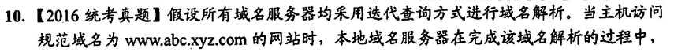

## 传输层功能

传输层只在资源子网，即互联网的边缘部分存在，核心部分的通讯只依靠于下三层网络协议，下三层的传输在前面的总结中已经说的很清楚了，已经完全支持数据在网络之间的定向传输（之事不可靠）

## UDP

在数据部分前添加首部 8B

在 IP 分组的基础上加入端口功能，将连接的主体由主机细化到进程，注意这里的虽然是在“基础上”，但其功能的实现在数据报的“内部”，即 IP 分组拆开后，识别到 UDP 首部，才可实现这里的分用功能

注意：实现分用的是目的端口，实现复用的是源端口

## TCP

### 首部格式和功能

首部长度和 IP 分组的长度设计完全一致，首部以 4B 为单位计量，总长度按字节为单位

- 固定长度 20B
- 可变长度 0-40B

也就是说 TCP 报文和 IP 分组的首部长度一定在 20-60B 之间，整个 TCP 数据报的最大长度为 65535B（IP 分组同理）

TCP 提供可靠的全双工信道

- 可靠指无差错、不丢失、不重复且有序：通过序号、确认和重传实现
- 全双工信道其实可以理解为两条信道，这在释放连接的时候显得十分明显，即发送端发送一个 FIN 只代表自身不发送（但可接收），只有当两端均发送了 FIN 且被确认后，这条全双工信道才被销毁

MSS（Max Segment Size）：指一个数据报的最大的总长度

RTT（Round Trip Time）：指一次发送和一次确认的时间，即数据报的一次往返时间

TCP 重要的首部字段

- 序号：表示当前传输的 TCP 报文数据部分的字节起始序号
- 确认号（ack）：表示期望收到的下一个数据字节序号
- 确认位（ACK）：标志确认号的有效，当 ACK = 0 时，确认号无效
- 终止位（FIN）：用以终止连接，表示当前端口停止发送数据
- 同步位（SYN）：当连接愿意建立后 SYN 始终为 1，只有 SYN = 1 时数据才能被正常传输
- 窗口：指明当前端的接收窗口大小，参与限制发送窗口的大小（流量控制）

### 连接的建立和释放

首部中，序号和确认号，确认位、终止位和开始位，一起合作控制 TCP 连接的建立和释放

- 确认号传输的是序号，指明下一个想要收到的数据报文的起始序号

三次握手

注意每个站点的 seq 都是独立的，即互不影响，在建立连接时，二者开始的 seq 几乎也是随意取值，只是注意确认报文的确认号一定和上一条收到的报文的序号以及有效数据长度有关

这里两个 seq 实际上可以视作两条信道的有序保持者，seq1 保证 A 到 B 的数据报有序，seq2 保证 B 到 A 的数据报有序

- 这里的时间名称记一下，有个印象，考过

四次挥手：双方主动告知对方自己不再发送数据，当双方均确认对方不再发送数据后，连接断开

同样的，这里的时间段名称也留个印象，主动关闭的主机发送最后一个确认信号后将等待两个 MSL 后才关闭

MSL（Max Segment Life）：数据报最大的存活时间

### 流量控制

流量控制和拥塞控制的区别，流量控制是针对端和端来说的，由接收方单纯的控制发送方，并不会影响到其他的端口；而拥塞控制是针对整个网络而言，即出现拥塞不单单是当前 TCP 连接的两端的问题，也就是说，当网络出现拥塞，每个连接都将无法幸免

其控制的原理基本相同：通过限制发送方的流量，降低信道（网络）拥塞程度，流量控制把发送方窗口锁死，而拥塞控制动态的调整发送窗口大小

### 拥塞控制

> 慢开始，拥塞避免 —— 基于冗余 ACK ——> 快重传，快恢复

首先要明确的是
$$
发送窗口 = min\{接收窗口,\,拥塞窗口\}
$$
cwnd（Congestion Window）：拥塞窗口

慢开始：慢指的是 cwnd 大小从 1 开始，但他是指数增长的，每经过一轮 RTT，他的窗口大小将乘以 2（没经过一个数据报的确认，窗口大小 +1，每个 RTT 将有 cwnd 个数据报被确认）

拥塞避免：维护一个阈值 ssthresh（手动初始化），当 cwnd 达到 ssthresh 后，每轮 RTT 后，cwnd 增加一个（在时间轴上线性增长）

当碰到拥塞时（确认报超时），将 ssthresh 降为 cwnd 的二分之一，同时将 cwnd 置为，开始慢开始算法

- 会碰到这样的情况，如`ssthresh = 6, cwnd = 4`，根据慢开始算法，下一轮 RTT 时，cwnd 应乘以 2 为 8，但这里统一认为 cwnd 始终不会超过 ssthresh，故下一轮 cwnd = 6，然后开始执行拥塞避免算法

冗余确认：当发送方连续收到三个确认号一样的数据报时，即认为发生了冗余确认，我们认为此时网络发生了拥塞或传输出现了错误

快重传：当发生冗余确认后，无需等待超时，直接重发三个冗余确认中携带的确认号序号的数据报文，从这个中断点开始有序传输

快恢复：在拥塞避免算法遇到拥塞时，有
$$
ssthresh = \frac{cwnd}{2}, cwnd = 1
$$
在采用快恢复时，转换变成了这样
$$
ssthresh = \frac{cwnd}{2}, cwnd = ssthresh
$$
然后开始继续执行拥塞避免算法，cwnd 随时间线性增加

这里有一个确认数据报延迟的问题

可以轻松得到当前发送窗口大小为 2000B，但注意此时发送端只收到了一个确认段，也就是说有 1000B 的数据还未确认，故此时只能发送 1000B 的数据，选 A

同样的，此时发送窗口为接收窗口 500B（拥塞窗口未知，只能这么认为），只收到了 501 的确认报，没收到刚刚发出去的`seq-501, length=200B`的确认报，所以现在只能发送 500-200=300B 的数据报，并且是接着 500+200=700 的序号发送，选 C

有时，窗口大小 cwnd 按照字节来计量，此时需要直到 MMS 大小，认为窗口中最多含有 cwnd / MMS 个数据报

## 应用层

常见协议及其服务所使用的熟知端口

一般应用层为了可靠传输，都使用 TCP 作为下层的传输协议，常见的除了 DNS，使用 UDP 数据报

但注意，即使是使用 TCP 协议，也不一定是一个面向连接的协议，如 HTTP1.0，他把 TCP 当 UDP 用的，多少沾点

### 网络应用模型

> C/S，B/S，P2P

P2P 模型是一个另类的 C/S 架构，当连接建立之后，客户和服务的界限变得模糊，两台主机同时作为客户和服务端进行工作，这样会带来一些安全问题，以及对网络拥塞有非常大的贡献 U•ェ•*U

在 C/S 架构中，客户机是面向用户的，服务器是面向任务的，一般来说，在做分发任务时，P2P 的效率要高于 C/S 架构

### 域名系统

> DNS，信息传输基于 UDP

域名系统组成

- 层次域名空间
- 域名服务器
- 域名解析器

域名的层次结构

域名服务器

- 根服务器：管理顶级域名
- 顶级域名服务器：管理二级域名
- 权限域名服务器：管理下级服务器
- 本地域名服务器：管理本区域所有主机的域名

其中本地域名服务器和权限域名服务器应该是平级的，只是看待他们的主体不同

域名的递归查询和迭代查询

域名和 IP 绝对不是一一对应的，比如很多域名指向同一 IP 地址（可以多对一，一对一，但不可以一对多）

栗题 x2

一定要注意解析域名只是数据传输的第一步，拿到 IP 后才正式开始数据传输

这题真没懂，选尼玛 C，我选的 A

### 文件传输协议

> FTP，纯纯的基于 TCP

控制和传输分**两个端口**进行，又叫带外传送（一定要记牢端口号）

- 20 端口用于数据传输
- 21 端口用于连接控制

两个端口均指服务端口，也就是说客户端并不遵守这一要求，可以是任意端口；同时这两个端口均基于 TCP 连接进行数据信息传输

其中，控制连接囊括整个 FTP 传输过程，而数据连接会在数据传输结束后及时关闭（但此时 FTP 连接不一定关闭）

- 就像使用 WinSCP 的时候，连接服务器用的是 20 端口，在文件上传的时候才会用到 21 端口（不传输时 21 端口空闲），不传输但也可以一直挂在后台，控制连接和数据连接相对独立

匿名访问 FTP 服务器时使用 anonymous 作为用户名

举俩栗题

### 邮件传输协议

> SMTP 和 POP3 协议，前者用于 push，后者用于 pull，均基于 TCP 报文传输

在客户端发送给邮件服务器和邮件服务器之间传输时，使用 SMTP，在服务器传输给客户时使用 POP3 协议

注意所有的邮件传输协议在传输数据时，都将数据转化为 ASCII 字符再最终转化为比特流在链路中传输，这叫做**多用途网络邮件扩充(MIME)**，目的是用于发送多媒体信息而不是简单的文本

### 超文本传输协议

> HTTP：HTTP1.0 仅支持无连接的传输，HTTP1.1 支持有连接的传输
>
> 注意无论是有连接还是无连接，均基于 TCP 进行数据传输

HTTP 本身是无连接的，但他的传输是基于有连接的 TCP 协议（有点像上面的 FTP 的数据传输端口，不用时关闭，用时打开）

这样的基于 TCP 的**无连接传输**非常之蠢，比如你要请求一个 html 页面，这个页面上有 100 个图片，由于无连接的缘故，TCP 连接需要建立和释放 101 次（100 次用于传输图片，1 次用于传输 html 页面）

- 而有连接的 HTTP 不存在这种情况

统一资源定位符：和 IP 地址或者域名做一个区分，这里是加上资源的，比如`39.106.160.174`这是一个 IP，`39.106.160.174:8080`这是一个传输层端口，而`39.106.160.174:8080/index.html`就是一个 URL

Cookie：用服务器发送给客户并存储在客户机上的一小串字符，用以标记客户访问过本服务的一些信息

GET 和 POST 就不多说了，都是请求资源，前者把请求项写在 url 中，后者通过表单传输参数

HEAD 主要功能用于测试，不需要服务器返回请求对象
