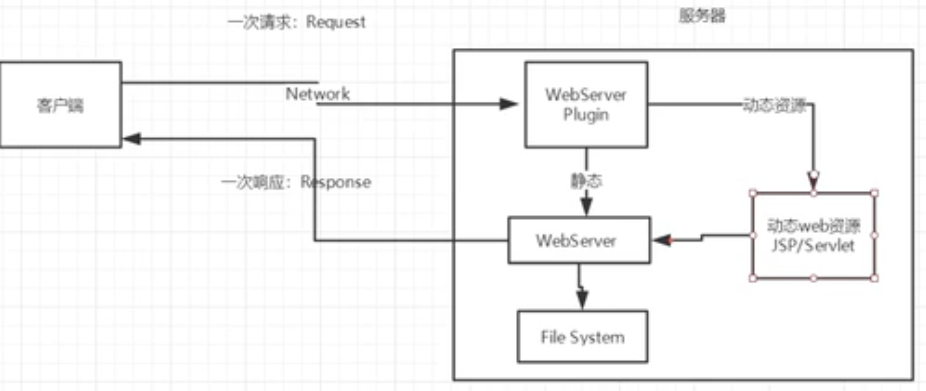
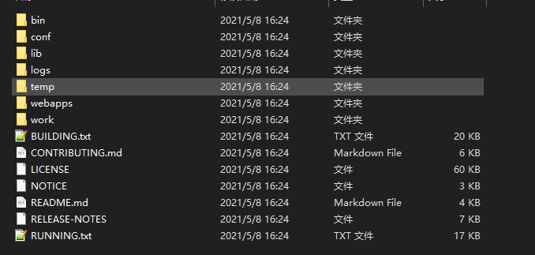

## 多线程基础

Process（进程）与Thread（线程）

进程 = 指令执行序列 + 资源

### 线程创建

推荐使用 Runnerable 接口

#### 继承 Thread 类

实现了 Runnerable 接口，每个线程的优先级和操作系统有关

1. 自定义线程类继承 Thread 类
2. 重写 run() 方法，编写线程执行体
3. 创建线程对象，调用 start() 方法启动线程

~~~java
public class TestThread extends Thread{
    @Override
    public void run() {
        for(int i = 0; i < 1000; i++){
            System.out.println("我在看代码");
        }
    }

    public static void main(String[] args) {
        TestThread tt = new TestThread();
        //调用start方法，两个线程是同时执行的
        tt.start();
        for(int i = 0; i < 1000; i++){
            System.out.println("我在拉屎");
        }
    }
}
~~~

如何导入外部jar包

1. 在 com 同级目录下新建 lib 目录，将 jar 包粘贴进去
2. 添加 lib 为 library

~~~java
import org.apache.commons.io.FileUtils;

import java.io.File;
import java.net.URL;

public class TestThread2 extends Thread{

    private String url;
    private String name;

    public TestThread2(String url, String name){
        this.url = url;
        this.name = name;
    }

    @Override
    public void run() {
        WebDownloader wd = new WebDownloader();
        wd.downloader(this.url, this.name);
        System.out.println("正在下载：" + this.name);
    }

    public static void main(String[] args) {
        TestThread2 t1 = new TestThread2("https://img-blog.csdnimg.cn/2019080416083639.png", "图片1.jpg");
        TestThread2 t2 = new TestThread2("https://img-blog.csdnimg.cn/2019080416083639.png", "图片2.jpg");
        TestThread2 t3 = new TestThread2("https://img-blog.csdnimg.cn/2019080416083639.png", "图片3.jpg");
        TestThread2 t4 = new TestThread2("https://img-blog.csdnimg.cn/2019080416083639.png", "图片4.jpg");

        t1.start();
        t2.start();
        t3.start();
        t4.start();
    }

}

//在lib中导入了外部jar包
class WebDownloader{
    public void downloader(String url, String name){
        try{
            FileUtils.copyURLToFile(new URL(url), new File(name));
        }catch(Exception e) {
            e.printStackTrace();
        }

    }
}
~~~

#### 实现 Runnerable 接口

~~~java
public class TestThread3 implements Runnable {
    @Override
    public void run() {
        for(int i = 0; i < 1200; i++){
            System.out.println("我在拉屎" + i);
        }
    }

    public static void main(String[] args) {
        TestThread3 t = new TestThread3();
        new Thread(t).start();
        for(int i = 0; i < 1200; i++){
            System.out.println("我在吃饭" + i);
        }
    }
}
~~~

#### 实现 Callable 接口

~~~java
import java.util.concurrent.Callable;
import java.util.concurrent.ExecutorService;
import java.util.concurrent.Executors;
import java.util.concurrent.Future;

public class TestCallable implements Callable<String> {
    private String url;
    private String name;

    public TestCallable(String url, String name){
        this.url = url;
        this.name = name;
    }

    @Override
    public String call() {
        WebDownloader wd = new WebDownloader();
        wd.downloader(this.url, this.name);
        System.out.println("正在下载：" + this.name);
        return name+"下载完成";
    }

    public static void main(String[] args) {
        TestCallable t1 = new TestCallable("https://img-blog.csdnimg.cn/2019080416083639.png", "图片1.jpg");
        TestCallable t2 = new TestCallable("https://img-blog.csdnimg.cn/2019080416083639.png", "图片2.jpg");
        TestCallable t3 = new TestCallable("https://img-blog.csdnimg.cn/2019080416083639.png", "图片3.jpg");
        TestCallable t4 = new TestCallable("https://img-blog.csdnimg.cn/2019080416083639.png", "图片4.jpg");

        //创建线程池服务
        ExecutorService ser = Executors.newFixedThreadPool(4);

        //提交线程服务，在池中执行call方法
        Future<String> f1 = ser.submit(t1);
        Future<String> f2 = ser.submit(t2);
        Future<String> f3 = ser.submit(t3);
        Future<String> f4 = ser.submit(t4);

        //获取call函数的返回结果
        try{
            String res1 = f1.get();
            String res2 = f2.get();
            String res3 = f3.get();
            String res4 = f4.get();
        }catch(Exception e){
            e.printStackTrace();
        }

        //停止线程池
        ser.shutdownNow();


    }
}
~~~

### 并发

多个线程操作一个对象

~~~java
public class TestThread4 implements Runnable{

    private int tickets = 100;

    public void run(){
        while(true){
            if(tickets <= 0)
                break;
            System.out.println(TestThread2.currentThread().getName() + "抢到了第" + tickets-- + "张票");
        }
    }

    public static void main(String[] args) {
        TestThread4 tickets = new TestThread4();
        new Thread(tickets, "小明").start();
        new Thread(tickets, "小红").start();
        new Thread(tickets, "黄牛").start();
    }
}
~~~

在实际运行中，发现居然出现某某抢到了 -1 张票的情况，存在问题：多个线程操作同一个对象，线程不安全，数据紊乱

模拟龟兔赛跑

~~~java
public class Race implements Runnable {

    private static String winner;

    public void run(){
        for (int i = 0; i <= 100; i++) {
            if(Thread.currentThread().getName().equals("兔子") && i >= 80){
                try{
                    Thread.sleep(10);
                }catch(Exception e){
                    e.printStackTrace();
                }
            }
            if(gameOver(i)){
                break;
            }
            System.out.println(Thread.currentThread().getName() + "跑了" + i + "米");
        }
    }

    public boolean gameOver(int i){
        if(winner != null){
            return true;
        }
        else{
            if(i >= 100){
                winner = Thread.currentThread().getName();
                System.out.println("获胜者是:" + winner);
                return true;
            }
        }
        return false;
    }

    public static void main(String[] args) {
        Race r = new Race();
        new Thread(r, "兔子").start();
        new Thread(r, "乌龟").start();
    }
}
~~~

### 线程休眠

Thread.sleep() 方法

- 让线程阻塞，传入阻塞时间参数，单位毫秒抛出异常`InterruptedException`
- 当 sleep 时间达到后线程将处于就绪状态，sleep 可以模拟网络延时，倒计时等
- 每个对象都要一个锁，sleep不会释放锁

在游戏中添加一句 sleep，充值后去掉这行代码实现“游戏优化”，逆天

### 线程礼让

Thread.yield() 方法

- 礼让线程，让当前正在执行的线程暂停，但不阻塞
- 将现场从运行状态转为就绪状态
- 让 cpu 重新调度，但不一定成功

## Java I/O 流

### 流的分类

流：数据从内存和存储设备之间的通道

输入输出流：以流的流向分类

- 输入流：从存储设备到内存
- 输出流：从内存到存储设备

字节字符流：以传输单位划分

- 字节流：以字节为单位，可以读写所要数据
- 字符流：以字符为单位，只能读写文本数据

节点（底层）过滤流：按功能划分

- 节点流：具有实际传输数据的读写功能的流
- 过滤流：在节点流的基础上增强了功能

### 字节流

InputStream：输入流抽象类

~~~java
int available();
//关闭流的资源
void close();
//读取下一个字节
abstract int read();
//读取一定量的字节
int read(byte[] b);
int read(byte[] b, int off, int len);
//跳过和丢弃n个字节
long skip(long n);
~~~

OutputStream：输出流抽象类

~~~java
void close();
//刷新缓冲
void flush();
//将字节写入磁盘
void write(byte[] b);
void write(int b);
~~~

### 文件字节流

FileInputStream

~~~java
class FileInputStream extends InputStream{
    //从文件系统中的某个文件中获得输入字节，将读到内容存入b数组，返回实际读到的字节数，如果达到文件的尾部，则返回-1
    FileInputStream(String name);
    public int read(byte[] b);
}
~~~

~~~java
public class TestFileInputStream {
    public static void main(String[] args) throws Exception {
        FileInputStream fis = new FileInputStream("E:\\Java\\Java SE\\idea\\src\\resource\\a.txt");
        //一次读取一个字节
        /*
         *   int data = 1;
         *   一次读取一个字节
         *   用循环将文件读完（当读到文件末尾将返回-1）
         *   while(data != -1){
         *      data = fis.read();
         *      System.out.println((char)data);
         *   }
         */

        //一次读取多个字节
        byte[] b = new byte[3];
        int count;
        while((count = fis.read(b)) != -1){
            System.out.println(new String(b, 0, count));
        }
        //关闭输入流
        fis.close();
    }
}
~~~

FileOutputStream 

~~~java
class FileOutputStream extends OutputStream
    //一次写入多个字节，将b数组中所有字节写入输出流，存到文件系统的某个文件中
    public void write(byte[] b);
}
~~~

~~~java
import java.io.FileOutputStream;

public class TestFileOutputStream {
    public static void main(String[] args) throws Exception {
        //append参数true会使文件不会被覆盖，即每次运行都会继续储存在上次数据之后
        //不传入参数或传入false，每次写文件，将会覆盖掉之前数据
        FileOutputStream fos = new FileOutputStream("E:\\Java\\Java SE\\idea\\src\\resource\\b.txt", false);
        /*
        * 一次执行一个字符
        * fos.write('a');
        * fos.write('9');
        * fos.write('s');
        */
        String str = "helloWorld\n";
        //调用字符串的 getBytes() 方法将字符串转化为字节数组
        fos.write(str.getBytes());
        fos.close();
    }
}
~~~

## Web 服务器

### Web 服务器概述

web：网页

- 静态网页：内容不发生变化，如博客
- 动态网页：内容时刻更新：如淘宝

在 java 中，动态 web 资源开发的基础统称为 javaweb

- 由 dos 访问的程序：CS 结构
- 由浏览器访问的程序：BS 结构

web 应用程序：可以提供浏览器访问的程序

- a.html、b.html 等多个 web 资源，这些 web 资源都可以被外界访问，对外界提供服务
- 我们能访问到的任何一个页面或者资源，都存在于这个世界的某一个角落的计算机上
- 通过 URL 访问到该计算机资源
- 这个统一的 web 资源会被放在同一个文件夹下，web应用程序 → Tomcat 服务器
- 一个 web 应用又多部分组成（静态 web、动态 web）：html，css，js、jsp、servlet、jar

web 应用程序编写完毕后，若想提供给外界访问，需要一个服务器来统一管理

静态 web：htm、html 都是这些网页的后缀，如果服务器上一直存在这些东西，我们就可以直接进行读取访问

通常他的请求流程为

- 一次请求（Request）：客户端 → Network → 服务器
- 一次响应（Response）：服务器 → Network → 客户端

静态web的缺点

- web页面无法动态更新，所有用户看到的都是同一个页面 → 轮播图、javaScript、VBScript
- 他无法和数据库交互（数据无法持久化，用户无法交互）

动态 web

- 页面会动态展示：“Web 的页面展示的效果因人而异”
- 在返回相应时经过动态资源：更新资源

缺点：加入服务器的动态web资源出现错误，我们需要重新编写我们的后台程序 → 停机维护

优点

- web页面可以动态更新
- 它可以与数据库交互（JDBC）：通过 java 程序去连接数据库 → 数据持久化：注册、商品信息、用户信息......



一些过时的老玩意

ASP

- 微软：国内最早流行的就是 ASP
- 在 HTML 中潜入了VB的脚本，ASP + C
- 在 ASP 开发中，基本一个页面都要几千行的业务代码

```asp
<h1>
    <h1>
        <%
        	System.out.println("wdnmd");
        %>
    </h1>
</h1>
```

PHP

- PHP开发速度很快，功能很强大，跨平台，代码很简单（现在大部分网站都用php实现）
- 无法承载打访问量的情况（局限性）：限制在中量型网站

B/S：浏览器和服务器

C/S：客户端和服务器

JSP/Servlet

- sun 公司（被甲骨文收购了）主推的B/S架构
- 基于java语言（所有的大公司或一些开源的组件都是用java写的）
- 可以承载三高问题带来的影响：高并发、高可用、高性能
- 语法像ASP，ASP → JSP，加强市场强度

IIS：微软的：ASP...Windows中自带的

Tomcat

~~~
Tomcat是Apache 软件基金会（Apache Software Foundation）的Jakarta 项目中的一个核心项目，由[Apache]、Sun 和其他一些公司及个人共同开发而成。由于有了Sun 的参与和支持，最新的Servlet 和JSP 规范总是能在Tomcat 中得到体现，Tomcat 5支持最新的Servlet 2.4 和JSP 2.0 规范。因为Tomcat 技术先进、性能稳定，而且免费，因而深受Java 爱好者的喜爱并得到了部分软件开发商的认可，成为目前比较流行的Web 应用服务器。

Tomcat 服务器是一个免费的开放源代码的Web 应用服务器，属于轻量级应用[服务器]，在中小型系统和并发访问用户不是很多的场合下被普遍使用，是开发和调试JSP 程序的首选。对于一个初学者来说，可以这样认为，当在一台机器上配置好Apache 服务器，可利用它响应[HTML]（[标准通用标记语言]下的一个应用）页面的访问请求。实际上Tomcat是Apache 服务器的扩展，但运行时它是独立运行的，所以当你运行tomcat 时，它实际上作为一个与Apache 独立的进程单独运行的。

诀窍是，当配置正确时，Apache 为HTML页面服务，而Tomcat 实际上运行JSP 页面和Servlet。另外，Tomcat和[IIS]等Web服务器一样，具有处理HTML页面的功能，另外它还是一个Servlet和JSP容器，独立的Servlet容器是Tomcat的默认模式。不过，Tomcat处理静态[HTML]的能力不如Apache服务器。目前Tomcat最新版本为10.0.5。
~~~

总的来说，web 服务器是一种被动响应的机器，用来处理用户的一些请求和给用户一些相应信息，工作 3-5 年之后，可以尝试手写 Tomcat

### Tomcat

Tomcat 服务器是一个免费的开放源代码的 Web 应用服务器，属于轻量级应用服务器，属于中间件

Apache 为 HTML 页面服务，而T omcat 实际上运行 JSP  页面和 Servlet。另外，Tomcat 和 IIS 等 Web 服务器一样，具有处理 HTML 页面的功能，另外它还是一个 Servlet 和 JSP 容器，独立的 Servlet 容器是 Tomcat 的默认模式。不过，Tomcat 处理静态 HTML 的能力不如 Apache 服务器

环境搭建

- 安装 tomcat：tomcat 官网 download
- tomcat 启动和配置



bin：存放着运行脚本 → start.sh / shutdown.sh

可能遇到的问题

- java 环境遍历没有配置

- 闪退问题：需要配置兼容性

- 乱码问题：配置文件中设置 startup.bat（尽量不要改动）

webapps：存放着 web 资源 —> /ROOT/index.jsp 即为8080主页，可在其中修改网页内容

~~~html
<!--如下为导航栏设置，修改Home为NorthBoat-->
<div id="navigation" class="curved container">
    <span id="nav-home"><a href="${tomcatUrl}">NorthBoat</a></span>
    <span id="nav-hosts"><a href="${tomcatDocUrl}">Documentation</a></span>
    <span id="nav-config"><a href="${tomcatDocUrl}config/">Configuration</a></span>
    <span id="nav-examples"><a href="${tomcatExamplesUrl}">Examples</a></span>
    <span id="nav-wiki"><a href="https://wiki.apache.org/tomcat/FrontPage">Wiki</a></span>
    <span id="nav-lists"><a href="${tomcatUrl}lists.html">Mailing Lists</a></span>
    <span id="nav-help"><a href="${tomcatUrl}findhelp.html">Find Help</a></span>
    <br class="separator" />
</div>
~~~

conf（config文件夹）：server.xml（服务器配置）

通过修改 server.xml 文件中 Host name 和 C:/Windows/system32/drivers/etc/hosts 文件修改主页域名

~~~XML
server.xml:
<Host name="www.NorthBoat.com"  appBase="webapps"
      unpackWARs="true" autoDeploy="true">
    hosts:
    # localhost name resolution is handled within DNS itself.
    #	127.0.0.1       localhost
    #	::1             localhost
    127.0.0.1       www.NorthBoat.com
~~~

- tomcat 默认端口号：8080
- http 默认端口号：80
- https 默认端口号：443
- mysql 默认端口号：3306

网站时如何进行访问的

1. 输入一个域名，回车
2. 检查本机的 C:\Windows、System32\drivers\etc\hosts
   - 有：直接返回对应的 ip 地址，即这个地址中有我们需要访问的 web 程序
   - 没有：在 DNS（管理全世界的域名）上寻找域名，找到的话就返回对应 ip 地址（即网页），找不到则返回找不到

记得配置环境变量

基本使用，发布一个 web：将自己写的网站，放到服务器（Tomcat）中只指定 web 应用的文件夹（webapps）下，就可以访问了

一个网站应有的结构

~~~
--webapps：Tomcat服务器的web目录
    -ROOT
    -NorthBoat：网站的目录名
    	-WEB-INF
    		-classes：java程序
    		-lib：web应用所依赖的jar包
    		-web.xml
    	-index.html：默认的首页
    	-static
    		-css
    			-style.css
    		-js
    		-img
    	-...
~~~

### HTTP

什么是HTTP？

超文本传输协议（Hypertext Transfer Protocol，HTTP）是一个简单的请求/响应协议，它通常运行在 TCP 之上

- 文本：html、字符串......
- 超文本：图片、音乐、视频、定位、地图......
- http 默认端口：80
- https（s：security）：443

两个时代

1. HTTP/1.0：客户端可以与 web 服务器连接后，只能获得一个 web 资源，获得后断开连接
2. HTTP/1.1：客户端与 web 服务器连接后，可以获得多个 web 资源，所谓长连接

### 请求和响应

HTTP 请求：客户端 → 发请求 → 服务器

以百度为例

~~~
//刷新百度页面时抓包
//f12 ——> network

Request URL: https://www.baidu.com/	 请求地址
Request Method: GET		请求方法（get / post）
Status Code: 200 OK		状态码：200
Remote Address: 110.242.68.3:443	ip地址
Referrer Policy: strict-origin-when-cross-origin
~~~

请求行

- 请求行中的请求方式：GET
- 请求方式：GET、post、head、delete、put、tract...
  - get：请求能携带的参数较少，大小有限制，会在浏览器URL栏中显示数据，不安全
  - post：参数、大小没有限制，不会在URL中显示，但不高效

消息头

~~~
Accept: text/html：接受文件类型
Accept-Encoding: gzip, deflate, br：编码方式
Accept-Language: zh-CN,zh;q=0.9,en;q=0.8：语言
Cache-Control: max-age=0：缓存控制
Connection: keep-alive：告诉浏览器，请求完成时断开开始保持连接
Refresh：告诉客户端多久刷新一次
~~~

Http响应：服务器 → 响应 → 客户端

响应

~~~
Cache-Control: private		缓存控制
Connection: keep-alive		连接：保持连接
Content-Encoding: gzip		编码方式
Content-Type: text/html;charset=utf-8		文本格式
Date: Sat, 22 May 2021 09:21:43 GMT		响应时间
Strict-Transport-Security: max-age=172800		一个保证安全的脚本
~~~

响应体

~~~
Accept: text/html：接受文件类型
Accept-Encoding: gzip, deflate, br：编码方式
Accept-Language: zh-CN,zh;q=0.9,en;q=0.8：语言
Cache-Control: max-age=0：缓存控制
Connection: keep-alive：告诉浏览器，请求完成时断开开始保持连接
Refresh：告诉客户端多久刷新一次
~~~

响应状态码

- 200：请求响应成功
- 3xx：请求重定向
- 4xx：找不到资源（404）
- 5xx：服务器代码错误（500、502：网关错误）

**当你的浏览器中地址栏输入地址并回车的一瞬间到页面能够展示回来，经历了什么？**

1. 查询 IP
2. 三次握手建立 TCP 连接
3. 尝试建立 HTTP 连接
4. 服务端返回一个 html 页面，浏览器渲染展示
