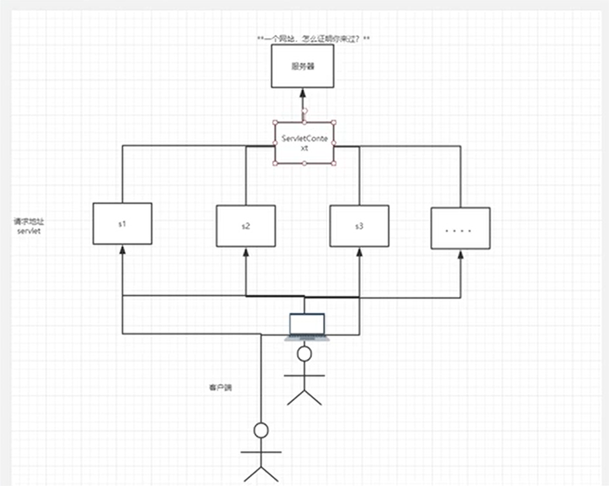

## Hello Servlet

### Why Servlet

servlet 是 sun 公司用于开发动态 web 的一门技术，sun 公司在这些 api 中提供了一个接口 Interface，即 Servlet

要想开发一个 servlet 程序只需实现两步

1. 编写一个java类实现Servlet接口
2. 把开发好的java类部署到web上

我们一般把实现了 Servlet 接口的 java 程序叫做 Servlet

### 构建父子工程

构建一个干净的 maven 项目，删掉里面的 src 目录，便于在这个项目里建立 Moudel，将该工程作为 Maven 的主工程

在 maven pom 文件中添加servlet依赖

~~~xml
<dependencies>
    <!--Servlet依赖-->
    <dependency>
        <groupId>javax.servlet</groupId>
        <artifactId>javax.servlet-api</artifactId>
        <version>4.0.1</version>
    </dependency>
</dependencies>
~~~

在主工程下 new module，父为干净的 maven 项目，子为 maven web 项目

在用模板构建 maven-webapp 时可能报错 No archetype found in remote catalog. Defaulting to internal catalog，即在目录中未找到模板，解决办法为

- **在创建maven项目时，设置属性 archetypeCatalog = internal**

在主工程中可以建很多的module（模板），在主工程的pom.xml中会有

```xml
<modules>
        <module>servlet-01</module>
</modules>
```

而子工程的pom.xml中会有（好像也可以没有）

~~~xml
<parent>
    <groupId>org.example</groupId>
    <artifactId>javaweb-servlet</artifactId>
    <version>1.0-SNAPSHOT</version>
</parent>
~~~

父工程和子工程的关系与父类和子类相似

maven 环境优化

- 修改 web.xml 为最新的
- 将 maven 的结构搭建完整

### 编写一个 Servlet 程序

编写一个普通类，实现Servlet接口

- Servlet 接口 —> GenericServlet 抽象类 —> HttpServlet 抽象类 —> 继承 HttpServlet —> 实现 Servlet 接口

继承 HttpServlet，重写 doGet 方法，doGet 是当请求（表单提交方式）为 GET 时，service 调用的方法

~~~java
import javax.servlet.ServletException;
import javax.servlet.http.HttpServlet;
import javax.servlet.http.HttpServletRequest;
import javax.servlet.http.HttpServletResponse;
import java.io.IOException;
import java.io.PrintWriter;

public class HelloServlet extends HttpServlet {

    //由于 GET 和 POST 只是请求实现的不同方式，可以相互调用，因为业务逻辑相同
    @Override
    protected void doGet(HttpServletRequest req, HttpServletResponse resp) throws ServletException, IOException {
        PrintWriter writer = resp.getWriter();  //响应流
        writer.println("Hello Servlet!");
    }

    @Override
    protected void doPost(HttpServletRequest req, HttpServletResponse resp) throws ServletException, IOException {
        super.doPost(req, resp);
    }
}
~~~

编写 Servlet 映射

why refect? 我们写的 java 程序要通过浏览器访问，而浏览器需要连接 web 服务器，所以我们需要在 web 服务中注册我们写的 servlet，还需要给他一个浏览器能访问的路径

在 web.xml 中配置 servlet 映射

- servlet-name：命名该 servlet
- servlet-class：你所写的 servlet 的包路径
- servlet-name：链接你所命名的 servlet（servlet-mapping 中）
- url-pattern：映射在 localhost 上的路径，如上述代码将执行在 localhost:8080/s1/hello（s1 为 tomcat 的映射路径）（注意一定要加 / ，否则会报错子级失败啥啥）

~~~xml
<web-app>
  <display-name>Archetype Created Web Application</display-name>

  <!--配置servlet映射-->
  <servlet>
    <servlet-name>hello</servlet-name>
    <servlet-class>com.servlet.HelloServlet</servlet-class>
  </servlet>
  <servlet-mapping>
    <servlet-name>hello</servlet-name>
    <url-pattern>/hello</url-pattern>
  </servlet-mapping>

</web-app>
~~~

配置 tomcat：点右上角锤锤旁边的小格格，点击+号配置tomcat，注意配置虚拟映射路径，即配置 deployment 中 application context：同样需要反斜杠，如： /s1

启动测试

### servlet 族系部分源码

Servlet（interface）源码：

~~~java
public interface Servlet {
    //初始化
    void init(ServletConfig var1) throws ServletException;

    //获取servlet配置
    ServletConfig getServletConfig();

    //请求和响应
    void service(ServletRequest var1, ServletResponse var2) throws ServletException, IOException;

    //获取servlet信息
    String getServletInfo();

    //销毁servlet
    void destroy();
}
~~~

GenericServlet（abstract）源码：

~~~java
public abstract class GenericServlet implements Servlet, ServletConfig, Serializable {
    private static final String LSTRING_FILE = "javax.servlet.LocalStrings";
    private static ResourceBundle lStrings = ResourceBundle.getBundle("javax.servlet.LocalStrings");
    private transient ServletConfig config;
	
    //这一层尚未处理的方法
    public GenericServlet() {
    }

    public void destroy() {
    }

    //重中之重
    public abstract void service(ServletRequest var1, ServletResponse var2) throws ServletException, IOException;
    
    //重写了一个带配置参数的初始化函数
    public void init(ServletConfig config) throws ServletException {
        this.config = config;
        this.init();
    }

    public void init() throws ServletException {
    }
    
    
    //下述一系列方法实现了servlet信息的获取
    public String getServletInfo() {
        return "";
    }
    
    public ServletConfig getServletConfig() {
        return this.config;
    }
    
    public String getInitParameter(String name) {
        ServletConfig sc = this.getServletConfig();
        if (sc == null) {
            throw new IllegalStateException(lStrings.getString("err.servlet_config_not_initialized"));
        } else {
            return sc.getInitParameter(name);
        }
    }

    public Enumeration<String> getInitParameterNames() {
        ServletConfig sc = this.getServletConfig();
        if (sc == null) {
            throw new IllegalStateException(lStrings.getString("err.servlet_config_not_initialized"));
        } else {
            return sc.getInitParameterNames();
        }
    }

    public ServletContext getServletContext() {
        ServletConfig sc = this.getServletConfig();
        if (sc == null) {
            throw new IllegalStateException(lStrings.getString("err.servlet_config_not_initialized"));
        } else {
            return sc.getServletContext();
        }
    }

    public void log(String msg) {
        this.getServletContext().log(this.getServletName() + ": " + msg);
    }

    public void log(String message, Throwable t) {
        this.getServletContext().log(this.getServletName() + ": " + message, t);
    }
    
    public String getServletName() {
        ServletConfig sc = this.getServletConfig();
        if (sc == null) {
            throw new IllegalStateException(lStrings.getString("err.servlet_config_not_initialized"));
        } else {
            return sc.getServletName();
        }
    }
}
~~~

HttpServlet（abstract）service 方法

~~~java
protected void service(HttpServletRequest req, HttpServletResponse resp) throws ServletException, IOException {
        String method = req.getMethod();
        long lastModified;
    
    	//如果html表单提交方法（method）为GET
        if (method.equals("GET")) {
            lastModified = this.getLastModified(req);
            if (lastModified == -1L) {
                this.doGet(req, resp);
            } else {
                long ifModifiedSince = req.getDateHeader("If-Modified-Since");
                if (ifModifiedSince < lastModified) {
                    this.maybeSetLastModified(resp, lastModified);
                    this.doGet(req, resp);
                } else {
                    resp.setStatus(304);
                }
            }
        } else if (method.equals("HEAD")) {		//如果提交方式为HEAD
            lastModified = this.getLastModified(req);
            this.maybeSetLastModified(resp, lastModified);
            this.doHead(req, resp);
        } else if (method.equals("POST")) {		//如果提交方式为POST
            this.doPost(req, resp);
        } else if (method.equals("PUT")) {		//如果提交方式为PUT
            this.doPut(req, resp);
        } else if (method.equals("DELETE")) {		//如果提交方式为DELETE
            this.doDelete(req, resp);
        } else if (method.equals("OPTIONS")) {		//如果提交方式为OPTIONS
            this.doOptions(req, resp);
        } else if (method.equals("TRACE")) {		//如果提交方式为TRACE
            this.doTrace(req, resp);
        } else {
            String errMsg = lStrings.getString("http.method_not_implemented");
            Object[] errArgs = new Object[]{method};
            errMsg = MessageFormat.format(errMsg, errArgs);
            resp.sendError(501, errMsg);
        }

    }
~~~

## Servlet 架构

B/S 架构

```
浏览器 <——> 服务器 <——> servlet：service（resp, resq）
```

### Mapping

不同的映射情况

- 一个servlet指定一个映射
- 一个servlet可以指定多个映射路径
- 指定通用映射

~~~xml
<url-pattern>/*</url-pattern>

<!--效果为，你在网页上根路径中瞎几把乱输入一个未经映射的地址，页面将跳转到 /* 所映射的页面-->
~~~

- 自定义后缀配置请求映射


~~~xml
<url-pattern>*.NorthBoat</url-pattern>
    
<!--这样的效果就是，你在网页上打出任何 名字.NorthBoat 都会跳转到你在这儿规定的页面，只要以.NorthBoat结尾-->
~~~

- 利用通配符设置 404 界面

由于通配符的优先级小于已指定的 mapping 映射

~~~java
public class ErrorServlet extends HttpServlet {

    @Override
    protected void doGet(HttpServletRequest req, HttpServletResponse resp) throws ServletException, IOException {
        resp.setContentType("text/html");
        resp.setCharacterEncoding("utf-8");

        PrintWriter printWriter = resp.getWriter();
        printWriter.println("<h1>404</h1>");
    }

    @Override
    protected void doPost(HttpServletRequest req, HttpServletResponse resp) throws ServletException, IOException {
        super.doPost(req, resp);
    }
}
~~~

~~~xml
<!--404-->
<servlet>
    <servlet-name>error</servlet-name>
    <servlet-class>Servlet.ErrorServlet</servlet-class>
</servlet>
<servlet-mapping>
    <servlet-name>error</servlet-name>
    <url-pattern>/*</url-pattern>
</servlet-mapping>
~~~

wab-app编写顺序报错

报错 The content of element type "web-app" must match "(icon?,display-name?,description?

将web.xml文件前五行换为

~~~xml
<?xml version="1.0" encoding="UTF-8"?>
<web-app version="3.0" xmlns="http://java.sun.com/xml/ns/javaee"
	xmlns:xsi="http://www.w3.org/2001/XMLSchema-instance"
	xsi:schemaLocation="http://java.sun.com/xml/ns/javaee 
	http://java.sun.com/xml/ns/javaee/web-app_3_0.xsd">
~~~

设置网页编码格式

设置响应（response）的ContentType、CharacterEncoding

在f12网络消息头中可以看到ContentType元素，其中用分号隔开了该网页的ContentType和ChacaterEncoding

在doGet方法中设置页面文字格式

~~~java
protected void doGet(HttpServletRequest req, HttpServletResponse resp) throws ServletException, IOException {
    resp.setContentType("text/html");
    resp.setCharacterEncoding("utf-8");
}
~~~

resp.setCharacterEncoding(String charset) 将把 charset 在已有选项中匹配对应字符格式，若未匹配到将标红报错

### ServletContext

web 在启动时，它会为每个web程序都创建一个对应的 ServletContext 对象，它代表了当前的 web 应用，凌驾于 Servlet 之上

- 数据共享：ServletContext 作为一个数据互通的容器，在这个 Servlet 中保存的数据，可以在另外一个 Servlet 中获取

共享三部曲

1️⃣ 创建一个放置数据的类

~~~java
public class Study extends HttpServlet {
    @Override
    protected void doGet(HttpServletRequest req, HttpServletResponse resp) throws ServletException, IOException {
        //this.getInitParameterNames() 返回初始化参数
        //this.getServletConfig()   获得Servlet配置
        ServletContext context = this.getServletContext();   //servlet上下文容器
        String name = "NorthBoat";  //数据
        //将一个数据保存在ServletContext中，setAttribute：设置属性
        context.setAttribute("username", name);
    }
}
~~~

2️⃣ 需要一个读取数据的类

~~~java
public class Hello extends HttpServlet {

    @Override
    protected void doGet(HttpServletRequest req, HttpServletResponse resp) throws ServletException, IOException {

        String name = (String) this.getServletContext().getAttribute("username");

        resp.setContentType("text/html");
        resp.setCharacterEncoding("utf-8");
        resp.getWriter().println("<h1>你好啊，" + name + "</h1>");   //相应流
    }
}
~~~

3️⃣ 配置 web.xml

~~~xml
  <!--读取数据的Servlet-->
  <servlet>
    <servlet-name>hello</servlet-name>
    <servlet-class>Servlet.Hello</servlet-class>
  </servlet>
  <servlet-mapping>
    <servlet-name>hello</servlet-name>
    <url-pattern>/hello</url-pattern>
  </servlet-mapping>

  <!--存储数据的Servlet-->
  <servlet>
    <servlet-name>get</servlet-name>
    <servlet-class>Servlet.Study</servlet-class>
  </servlet>
  <servlet-mapping>
    <servlet-name>get</servlet-name>
    <url-pattern>/get</url-pattern>
  </servlet-mapping>
~~~

在运行时，直接打开  /hello 将显示 ”你好啊，null“

而先打开 /get 再打开 /hello 将显示大写的 “你好啊，NorthBoat”

即先经过 get 将数据储存到了 ServletContext 中，所以 hello 能够从 ServletContext 中取到 username

获取初始化参数：在 web.xml 中配置 context 初始化参数：如 stu:student，tea:teacher，adm:admin，在网页中获取数据组成 account

~~~xml
<context-param>
    <param-name>mysql</param-name>
    <param-value>jdbc:mysql://localhost:3306</param-value>
</context-param>
~~~

获取 context 参数，getInitParameter()，以字符串返回

~~~java
public class Hello extends HttpServlet{
    @Override
    protected void doGet(HttpServletRequest req, HttpServletResponse resp) throws ServletException, IOException {
        ServletContext context = this.getServletContext();
        resp.setContentType("text/html");
        resp.setCharacterEncoding("utf-8");
        //获取初始化参数
        String param = context.getInitParameter("mysql");
        //打印初始化参数
        resp.getWriter().println("初始化参数：" + param);
    }
}
~~~

请求转发：将 Study 映射页面的请求转发到 /hello，url 不发生改变，但页面内容显示 /hello 的内容

~~~java
public class Study extends HttpServlet {
    @Override
    protected void doGet(HttpServletRequest req, HttpServletResponse resp) throws ServletException, IOException {
        ServletContext context = this.getServletContext();   //servlet上下文容器
        String name = "NorthBoat";  //数据

        //将一个数据保存在ServletContext中，setAttribute：设置属性
        context.setAttribute("username", name);

        //请求转发到 /hello
        context.getRequestDispatcher("/hello").forward(req, resp);
    }
}
~~~

/hello 中能读到 username，即在请求转发前已把 username 存到了 context 中，请求转发后，将不再执行 Study 中 doGet 的后续内容

~~~java
public class Hello extends HttpServlet{
    @Override
    protected void doGet(HttpServletRequest req, HttpServletResponse resp) throws ServletException, IOException {
        ServletContext context = this.getServletContext();
        String name = (String)context.getAttribute("username");
        String param = context.getInitParameter("mysql");

        resp.setContentType("text/html");
        resp.setCharacterEncoding("utf-8");

        resp.getWriter().println("<h1>你好啊，" + name + "</h1>");
        resp.getWriter().println("<h1>初始化参数：" + param + "</h1>");
    }
}
~~~

读取资源文件

~~~java
public class Hello extends HttpServlet{
    @Override
    protected void doGet(HttpServletRequest req, HttpServletResponse resp) throws ServletException, IOException {
		//获取静态资源
        Properties prop = new Properties();
        //资源路径，以流的形式加载
        InputStream is = context.getResourceAsStream("/WEB-INF/classes/database.properties");
        prop.load(is);
        String table = prop.getProperty("student");
        resp.getWriter().println("<h1>表：" + table + "</h1>");
    }

    @Override
    protected void doPost(HttpServletRequest req, HttpServletResponse resp) throws ServletException, IOException {
        doGet(req, resp);
    }
}
~~~

database.properties

~~~properties
student=student
teacher=teacher
admin=admin
~~~

### Response

响应：web服务器接收到客户端的http请求，针对这个请求，分别创建请求的HttpServletRequest对象，代表响应的一个HttpServletResponse:

- 如果要获取客户端请求过来的参数，找Request
- 如果要给客户端响应一些信息，找Response

负责向浏览器发送数据的方法

~~~java
ServletOutputStream getOutputStream() throws IOException;
PrintWriter getWriter() throws IOException;
~~~

负责向浏览器发送响应头的方法

~~~java
//from ServletResponse
void setContentType(String type);
void setCharacterEncoding(String encoding);

//from HttpServletResponse
void setDateHeader(String var1, long var2);
void addDateHeader(String var1, long var2);
void setHeader(String var1, String var2);
void addHeader(String var1, String var2);
void setIntHeader(String var1, int var2);
void addIntHeader(String var1, int var2););
~~~

响应的状态码

~~~java
//运行良好
int SC_OK = 200;
//浏览器错误
int SC_FORBIDDEN = 403;
int SC_NOT_FOUND = 404;
int SC_METHOD_NOT_ALLOWED = 405;
//服务器错误
int SC_INTERNAL_SERVER_ERROR = 500;
int SC_NOT_IMPLEMENTED = 501;
int SC_BAD_GATEWAY = 502;
int SC_SERVICE_UNAVAILABLE = 503;
int SC_GATEWAY_TIMEOUT = 504;
int SC_HTTP_VERSION_NOT_SUPPORTED = 505;      
~~~

应用：向浏览器输出消息

下载文件、上传文件

1. 下载文件路径
2. 文件名
3. 设置浏览器支持下载我们所需的东西
4. 获取下载文件的输入流
5. 创建缓冲区
6. 获取OutputStream对象
7. 向FileOutputStream流写入buffer缓冲区
8. 将缓存区中的数据输出到客户端


以图片形式生成验证码：生成随机“数”，当生成的数不足7位时，用0填充（老程序员的常用套路）

~~~java
private String makeNUm(){
    Random random = new Random();
    String num = random.nextInt(9999999) + "";
    StringBuffer sb = new StringBuffer();
    for(int i = 0; i < 7-num.length(); i++){
        sb.append("0");
    }
    num = sb.toString() + num;
    return num;
}
~~~

编辑图片并映射到网页上


重定向

~~~java
protected void doGet(HttpServletRequest req, HttpServletResponse resp) throws IOException{
    resp.sentRedirect("/NEUQHelper/hello/Login");
}
~~~

重定向的实现原理

~~~java
protected void doGet(HttpServletRequest req, HttpServletResponse resp){
    resp.sentHeader("Location", "/NEUQHelper/hello/Login");
    resp.setStatus(302);	//重定向状态码
}
~~~

重定向和转发的区别

- 相同点：实现页面的跳转，信息处理的迁移
- 不同点：转发是将请求转发到另一地址，重定向是用另一个地址去响应；重定向 url 栏会改变，而转发不发生改变

### JSP

导入 jsp 依赖

~~~xml
<dependency>
    <groupId>org.glassfish.web</groupId>
    <artifactId>jstl-impl</artifactId>
    <version>1.2</version>
    <exclusions>
        <exclusion>
            <groupId>javax.servlet</groupId>
            <artifactId>servlet-api</artifactId>
        </exclusion>
        <exclusion>
            <groupId>javax.servlet.jsp</groupId>
            <artifactId>jsp-api</artifactId>
        </exclusion>
        <exclusion>
            <groupId>javax.servlet.jsp.jstl</groupId>
            <artifactId>jstl-api</artifactId>
        </exclusion>
    </exclusions>
</dependency>
~~~

在 .jsp 中获取当前项目路径

~~~html
<form action="${pageContext.request.contextPath}/hello/Login" method="post"></form>
~~~

### Resquest

HttpServletRequest 代表客户端的请求，用户通过 Http 协议访问服务器，HTTP 请求中的所有信息被封装到 HttpServletRequest 中，通过这个 HttpServletRequest 的方法，可以获得客户端（网页）的所有信息

1. 获取前端传递参数
2. 请求转发

ServletContext 的请求转发

~~~java
this.getContext.getRequestDispatcher("/hello").forward(req, resp);
~~~

res 的请求转发

~~~java
public class Get extends HttpServlet {
    @Override
    protected void doGet(HttpServletRequest req, HttpServletResponse resp) throws ServletException, IOException {
		resq.getRequestDispatcher("path").forward(req, resp);
    }
}
~~~

重定向和转发的区别

- 相同点：实现页面的跳转，信息处理的迁移
- 不同点：转发是将请求转发到另一地址，重定向是用另一个地址去响应；重定向 url 栏会改变（307），而转发不发生改变（302）

## JSP

JSP 编译后实际上也是一个 Servlet，类似于某种 HTML 和 Servlet 的语法糖

### Why JSP

Java Server Pages：java 服务器端页面，和 servlet 一样，是用于开发动态 web 的技术

- 写 JSP 就像在写 HTML
- 区别：HTML 只给用户提供静态数据，而 JSP 可以嵌入 java 代码，为用户提供动态数据

### JSP 原理

JSP 到底怎么执行的

- 代码层面全然是 HTML 的模样
- 服务器内部工作：在 tomcat 中有个 work 目录，idea 缓存中有个 tomcat 的 work 目录

~~~
C:\Users\NorthBoat\.IntelliJIdea2019.3\system\tomcat\Unnamed_NEUQHelper\work\Catalina\localhost\NEUQHelper\org\apache\jsp
~~~

发现，JSP 最终转换成了一个 java 类，JSP 本质上就是一个 Servlet

- 在 .JSP 中，通过`resp.getWriter.write()`一行行手写HTML页面


index_jsp.java 部分源码：初始化、销毁、服务

~~~java
public void _jspInit() {
}

public void _jspDestroy() {
}

public void _jspService(final javax.servlet.http.HttpServletRequest request, final javax.servlet.http.HttpServletResponse response)
    throws java.io.IOException, javax.servlet.ServletException {

    //判断请求类型
    if (!javax.servlet.DispatcherType.ERROR.equals(request.getDispatcherType())) {
      final java.lang.String _jspx_method = request.getMethod();
      if ("OPTIONS".equals(_jspx_method)) {
        response.setHeader("Allow","GET, HEAD, POST, OPTIONS");
        return;
      }
      if (!"GET".equals(_jspx_method) && !"POST".equals(_jspx_method) && !"HEAD".equals(_jspx_method)) {
        response.setHeader("Allow","GET, HEAD, POST, OPTIONS");
        response.sendError(HttpServletResponse.SC_METHOD_NOT_ALLOWED, "JSP 只允许 GET、POST 或 HEAD。Jasper 还允许 OPTIONS");
        return;
      }
    }

    //内置的一些对象
    final javax.servlet.jsp.PageContext pageContext;
    javax.servlet.http.HttpSession session = null;
    final javax.servlet.ServletContext application;
    final javax.servlet.ServletConfig config;
    javax.servlet.jsp.JspWriter out = null;
    final java.lang.Object page = this;
    javax.servlet.jsp.JspWriter _jspx_out = null;
    javax.servlet.jsp.PageContext _jspx_page_context = null;


    try {
        //输出之前的配置，设置页面格式、文本格式等
      response.setContentType("text/html");
      pageContext = _jspxFactory.getPageContext(this, request, response,
      			null, true, 8192, true);
      _jspx_page_context = pageContext;
      application = pageContext.getServletContext();
      config = pageContext.getServletConfig();
      session = pageContext.getSession();
      out = pageContext.getOut();
      _jspx_out = out;

      out.write("<html>\n");
      out.write("<body>\n");
      out.write("<h2>Hello World!</h2>\n");
      out.write("</body>\n");
      out.write("</html>\n");
    } catch (java.lang.Throwable t) {
      if (!(t instanceof javax.servlet.jsp.SkipPageException)){
        out = _jspx_out;
        if (out != null && out.getBufferSize() != 0)
          try {
            if (response.isCommitted()) {
              out.flush();
            } else {
              out.clearBuffer();
            }
          } catch (java.io.IOException e) {}
        if (_jspx_page_context != null) _jspx_page_context.handlePageException(t);
        else throw new ServletException(t);
      }
    } finally {
      _jspxFactory.releasePageContext(_jspx_page_context);
    }
  }throws java.io.IOException, javax.servlet.ServletException {

    if (!javax.servlet.DispatcherType.ERROR.equals(request.getDispatcherType())) {
    final java.lang.String _jspx_method = request.getMethod();
    if ("OPTIONS".equals(_jspx_method)) {
      response.setHeader("Allow","GET, HEAD, POST, OPTIONS");
      return;
    }
    if (!"GET".equals(_jspx_method) && !"POST".equals(_jspx_method) && !"HEAD".equals(_jspx_method)) {
      response.setHeader("Allow","GET, HEAD, POST, OPTIONS");
      response.sendError(HttpServletResponse.SC_METHOD_NOT_ALLOWED, "JSP 只允许 GET、POST 或 HEAD。Jasper 还允许 OPTIONS");
      return;
    }
}
~~~

做了什么事情？

1. 判断请求

2. 内置的一些对象

   ```java
   //这些对象可以直接在jsp中使用
   final javax.servlet.jsp.PageContext pageContext;//页面上下文
   javax.servlet.http.HttpSession session = null;//session
   final javax.servlet.ServletContext application;//applicationContext
   final javax.servlet.ServletConfig config;//config
   javax.servlet.jsp.JspWriter out = null;//out
   final java.lang.Object page = this;//page:当前
   javax.servlet.jsp.JspWriter _jspx_out = null;//请求
   javax.servlet.jsp.PageContext _jspx_page_context = null;//响应
   ```

3. 输出之前的一些初始化

   ```java
   response.setContentType("text/html");//页面格式
   pageContext = _jspxFactory.getPageContext(this, request, response, null, true, 8192, true);
   _jspx_page_context = pageContext;
   application = pageContext.getServletContext();
   config = pageContext.getServletConfig();
   session = pageContext.getSession();
   out = pageContext.getOut();
   _jspx_out = out;
   ```

4. 打印 HTML 页面

   ```java
   //out为jsp的内置对象：javax.servlet.jsp.JspWriter out = pageContext.getOut()
   out.write("<html>\n");
   out.write("<body>\n");
   out.write("<h2>Hello World!</h2>\n");
   out.write("</body>\n");
   out.write("</html>\n");
   ```

总结：JSP页面 → jsp.java → jsp.class → 作为一个 Servlet 返回到客户端

一个简单例子

~~~html
<div style="text-align: center">
    <h2>
        <%
            List<String> keys = (List<String>) session.getAttribute("keys");
            for(int i = 0; i < keys.size(); i++){
                String key = keys.get(i);
                List<String> ans = (List<String>) session.getAttribute(key);
                out.write(key + "<br>");
                for(int j = 0; j < ans.size(); j++){
                    out.write(ans.get(j) + "\n");
                }
            }
        %>
    </h2>
</div>
~~~

## 会话管理

### Cookie

Cookie 是用户存放的网站临时信息

~~~java
public class Get extends HttpServlet {
    @Override
    protected void doGet(HttpServletRequest req, HttpServletResponse resp) throws ServletException, IOException {	    
		//新建一个cookie，以字符串键值对的形式储存数据
        Cookie c = new Cookie("name", "NorthBoat");
        //设置cookie最大保存时间
        c.setMaxAge(24*60*60);
        //将cookie响应到客户端
        resp.addCookie(c);
        //获取客户端的cookies（多个）
        Cookie[] cookies = req.getCookies();
        //依次打印cookie信息
        if(cookies.length > 0){
            for (int i = 0; i < cookies.length; i++) {
                String name1 = cookies[i].getName();
                String value = cookies[i].getValue();
                resp.getWriter().println(name1 + ":" + value + "\n");
            }
        }
    }
}
~~~

Cookie 一般会保存在本地的用户目录下appdata

Cookie 的一些细节：

- 一个cookie只能保存一个信息
- 一个web站点可以给浏览器发送多个cookie，最多存放20个cookie
- Cookie大小有限制：4kb
- 300个cookie为浏览器上线

如何让cookie瞬间消失：

- 不设置有效期，关闭浏览器，自动失效
- 设置有效期为0

编码问题：全局设置编码

~~~java
resp.setCharacterEncoding("utf-8");
resp.setContentType("text/html");
req.setCharacterEncoding("utf-8");
~~~

设置单个字符串编码

~~~java
//将str转化为指定编码，返回一个String
URLEncoder.encode(String str, String encodeType);
~~~

### Session

Session 是服务器端存放的用户临时信息（会话）

- 和ServletContext类似，可以存各类信息（键为String，值为Object）

注意我们尽量不要用context存东西，服务器很容器炸掉，session同理，但储存用户信息足以



每次打开浏览器，会自动创建一个session（由服务器端创建），sessionID储存在cookie中（JSESSIONID）

~~~java
HttpSession s = req.getSession();
//session的id用服务器自动生成，保存在客户端cookie中
s.getId();
s.setAttribute("key", new Object);
s.getAttribute("key");
~~~

一个浏览器（用户）独占一个session

使用场景：

- 保存用户信息
- 购物车信息
- 整个网站会用到的信息

手动销毁 session

~~~java
req.getSession().invalidate();
~~~

自动销毁 session，在 web.xml 中添加 session 配置

~~~xml
<!--配置session自动销毁时间，单位：分钟-->
<session-config>
    <session-timeout>1440</session-timeout>
</session-config>
~~~

## MVC 架构

什么是 MVC：Model - View - Controller（模型 - 视图 - 控制器）

早些年的架构：用户 → Servlet/JSP → pojo → jdbc → DB，用户直接访问控制层，控制层就可以直接操作数据库

~~~java
servlet - CRUD - DB → 弊端：程序十分臃肿，不利于维护
servlet 代码：处理请求、响应、视图跳转、处理 JDBC、处理业务代码、处理逻辑代码

架构：没有什么是加一层解决不了的

程序员
↓
JDBC
↓
Mysql Oracle SqlServer
~~~

servlet 和 jsp 都可以写 java 代码，但为了易于维护和使用

- servlet 专注于处理请求以及控制视图跳转
- jsp 专注于显示数据

~~~
控制层(controller):Servlet:接受用户请求，交给业务层去做（返回数据），视图跳转——>业务层(service)——>pojo——>DB
		   |
用户————>视图层(view):JSP:展示数据模型，提供用户操作
~~~

我们将 service 和 pojo 统称为 Model，并且通常在其中加一层 Dao

~~~
service → Dao → DB
           |
          pojo
~~~

Model

- 业务处理：业务逻辑（Service）
- 数据持久层：CRUD（Dao）

View

- 展示数据
- 提供连接发起Servlet请求（a、form、img...）

Controller（Servlet）

- 接受用户请求：req 请求参数、Session 信息
- 交给业务层处理对应的代码
- 控制视图跳转
