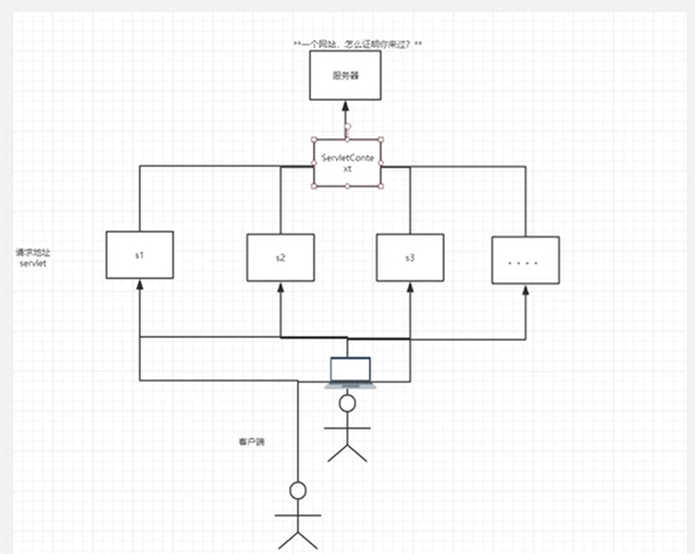

## Cookie & Session

### Cookie

Cookie 是用户存放的网站临时信息

~~~java
public class Get extends HttpServlet {
    @Override
    protected void doGet(HttpServletRequest req, HttpServletResponse resp) throws ServletException, IOException {	    
		//新建一个cookie，以字符串键值对的形式储存数据
        Cookie c = new Cookie("name", "NorthBoat");
        //设置cookie最大保存时间
        c.setMaxAge(24*60*60);
        //将cookie响应到客户端
        resp.addCookie(c);
        //获取客户端的cookies（多个）
        Cookie[] cookies = req.getCookies();
        //依次打印cookie信息
        if(cookies.length > 0){
            for (int i = 0; i < cookies.length; i++) {
                String name1 = cookies[i].getName();
                String value = cookies[i].getValue();
                resp.getWriter().println(name1 + ":" + value + "\n");
            }
        }
    }
}
~~~

Cookie 一般会保存在本地的用户目录下appdata

Cookie 的一些细节：

- 一个cookie只能保存一个信息
- 一个web站点可以给浏览器发送多个cookie，最多存放20个cookie
- Cookie大小有限制：4kb
- 300个cookie为浏览器上线

如何让cookie瞬间消失：

- 不设置有效期，关闭浏览器，自动失效
- 设置有效期为0

编码问题：全局设置编码

~~~java
resp.setCharacterEncoding("utf-8");
resp.setContentType("text/html");
req.setCharacterEncoding("utf-8");
~~~

设置单个字符串编码

~~~java
//将str转化为指定编码，返回一个String
URLEncoder.encode(String str, String encodeType);
~~~

### Session

Session 是服务器端存放的用户临时信息（会话）

- 和ServletContext类似，可以存各类信息（键为String，值为Object）

注意我们尽量不要用context存东西，服务器很容器炸掉，session同理，但储存用户信息足以

每次打开浏览器，会自动创建一个session（由服务器端创建），sessionID储存在cookie中（JSESSIONID）

~~~java
HttpSession s = req.getSession();
//session的id用服务器自动生成，保存在客户端cookie中
s.getId();
s.setAttribute("key", new Object);
s.getAttribute("key");
~~~

一个浏览器（用户）独占一个session

使用场景：

- 保存用户信息
- 购物车信息
- 整个网站会用到的信息

手动销毁session

~~~java
req.getSession().invalidate();
~~~

自动销毁session，在web.xml中添加session配置

~~~xml
<!--配置session自动销毁时间，单位：分钟-->
<session-config>
    <session-timeout>1440</session-timeout>
</session-config>
~~~

## JSP

### Why JSP

Java Server Pages：java服务器端页面，和servlet一样，是用于开发动态web的技术

- 写JSP就像在写HTML
- 区别：HTML只给用户提供静态数据，而JSP可以嵌入java代码，为用户提供动态数据

### JSP 原理

JSP到底怎么执行的

- 代码层面全然是HTML的模样
- 服务器内部工作：在tomcat中有个work目录，idea缓存中有个tomcat的work目录

~~~
C:\Users\NorthBoat\.IntelliJIdea2019.3\system\tomcat\Unnamed_NEUQHelper\work\Catalina\localhost\NEUQHelper\org\apache\jsp
~~~

发现，JSP最终转换成了一个java类

- JSP本质上就是一个Servlet

在JSP类中，通过 resp.getWriter.write() 一行行手写HTML页面

index_jsp.java 部分源码：初始化、销毁、服务

~~~java
public void _jspInit() {
}

public void _jspDestroy() {
}

public void _jspService(final javax.servlet.http.HttpServletRequest request, final javax.servlet.http.HttpServletResponse response)
    throws java.io.IOException, javax.servlet.ServletException {

    //判断请求类型
    if (!javax.servlet.DispatcherType.ERROR.equals(request.getDispatcherType())) {
      final java.lang.String _jspx_method = request.getMethod();
      if ("OPTIONS".equals(_jspx_method)) {
        response.setHeader("Allow","GET, HEAD, POST, OPTIONS");
        return;
      }
      if (!"GET".equals(_jspx_method) && !"POST".equals(_jspx_method) && !"HEAD".equals(_jspx_method)) {
        response.setHeader("Allow","GET, HEAD, POST, OPTIONS");
        response.sendError(HttpServletResponse.SC_METHOD_NOT_ALLOWED, "JSP 只允许 GET、POST 或 HEAD。Jasper 还允许 OPTIONS");
        return;
      }
    }

    //内置的一些对象
    final javax.servlet.jsp.PageContext pageContext;
    javax.servlet.http.HttpSession session = null;
    final javax.servlet.ServletContext application;
    final javax.servlet.ServletConfig config;
    javax.servlet.jsp.JspWriter out = null;
    final java.lang.Object page = this;
    javax.servlet.jsp.JspWriter _jspx_out = null;
    javax.servlet.jsp.PageContext _jspx_page_context = null;

    try {
        //输出之前的配置，设置页面格式、文本格式等
      response.setContentType("text/html");
      pageContext = _jspxFactory.getPageContext(this, request, response,
      			null, true, 8192, true);
      _jspx_page_context = pageContext;
      application = pageContext.getServletContext();
      config = pageContext.getServletConfig();
      session = pageContext.getSession();
      out = pageContext.getOut();
      _jspx_out = out;

      out.write("<html>\n");
      out.write("<body>\n");
      out.write("<h2>Hello World!</h2>\n");
      out.write("</body>\n");
      out.write("</html>\n");
    } catch (java.lang.Throwable t) {
      if (!(t instanceof javax.servlet.jsp.SkipPageException)){
        out = _jspx_out;
        if (out != null && out.getBufferSize() != 0)
          try {
            if (response.isCommitted()) {
              out.flush();
            } else {
              out.clearBuffer();
            }
          } catch (java.io.IOException e) {}
        if (_jspx_page_context != null) _jspx_page_context.handlePageException(t);
        else throw new ServletException(t);
      }
    } finally {
      _jspxFactory.releasePageContext(_jspx_page_context);
    }
  }throws java.io.IOException, javax.servlet.ServletException {

    if (!javax.servlet.DispatcherType.ERROR.equals(request.getDispatcherType())) {
    final java.lang.String _jspx_method = request.getMethod();
    if ("OPTIONS".equals(_jspx_method)) {
      response.setHeader("Allow","GET, HEAD, POST, OPTIONS");
      return;
    }
    if (!"GET".equals(_jspx_method) && !"POST".equals(_jspx_method) && !"HEAD".equals(_jspx_method)) {
      response.setHeader("Allow","GET, HEAD, POST, OPTIONS");
      response.sendError(HttpServletResponse.SC_METHOD_NOT_ALLOWED, "JSP 只允许 GET、POST 或 HEAD。Jasper 还允许 OPTIONS");
      return;
    }
}
~~~

做了什么事情？

1、判断请求

2、内置的一些对象

~~~java
//这些对象可以直接在jsp中使用
final javax.servlet.jsp.PageContext pageContext;//页面上下文
javax.servlet.http.HttpSession session = null;//session
final javax.servlet.ServletContext application;//applicationContext
final javax.servlet.ServletConfig config;//config
javax.servlet.jsp.JspWriter out = null;//out
final java.lang.Object page = this;//page:当前
javax.servlet.jsp.JspWriter _jspx_out = null;//请求
javax.servlet.jsp.PageContext _jspx_page_context = null;//响应
~~~

3、输出之前的一些初始化

~~~java
response.setContentType("text/html");//页面格式
pageContext = _jspxFactory.getPageContext(this, request, response, null, true, 8192, true);
_jspx_page_context = pageContext;
application = pageContext.getServletContext();
config = pageContext.getServletConfig();
session = pageContext.getSession();
out = pageContext.getOut();
_jspx_out = out;
~~~

4、打印HTML页面

~~~java
//out为jsp的内置对象：javax.servlet.jsp.JspWriter out = pageContext.getOut()
out.write("<html>\n");
out.write("<body>\n");
out.write("<h2>Hello World!</h2>\n");
out.write("</body>\n");
out.write("</html>\n");
~~~

总结：JSP页面 —> jsp.java —> jsp.class —> 作为一个 Servlet 返回到客户端

简单运用

~~~html

    <h2>
        <%
            List<String> keys = (List<String>) session.getAttribute("keys");
            for(int i = 0; i < keys.size(); i++){
                String key = keys.get(i);
                List<String> ans = (List<String>) session.getAttribute(key);
                out.write(key + " ");
                for(int j = 0; j < ans.size(); j++){
                    out.write(ans.get(j) + "\n");
                }
            }
        %>
    </h2>

~~~

## MVC 架构

什么是 MVC：Model - View - Controller（模型 - 视图 - 控制器）

早些年的架构：用户 → Servlet/JSP → pojo → jdbc → DB

用户直接访问控制层，控制层就可以直接操作数据库

~~~java
servlet - CRUD - DB → 弊端：程序十分臃肿，不利于维护
servlet 代码：处理请求、响应、视图跳转、处理 JDBC、处理业务代码、处理逻辑代码

架构：没有什么是加一层解决不了的

程序员
↓
JDBC
↓
Mysql Oracle SqlServer
~~~

servlet 和 jsp 都可以写 java 代码，但为了易于维护和使用

- servlet 专注于处理请求以及控制视图跳转
- jsp 专注于显示数据

~~~
控制层(controller):Servlet:接受用户请求，交给业务层去做（返回数据），视图跳转——>业务层(service)——>pojo——>DB
		   |
用户————>视图层(view):JSP:展示数据模型，提供用户操作
~~~

我们将service和pojo统称为Model，并且通常在其中加一层Dao

~~~
service → Dao → DB
           |
          pojo
~~~

Model

- 业务处理：业务逻辑（Service）
- 数据持久层：CRUD（Dao）

View

- 展示数据
- 提供连接发起Servlet请求（a、form、img...）

Controller（Servlet）

- 接受用户请求：req 请求参数、Session 信息
- 交给业务层处理对应的代码
- 控制视图跳转
