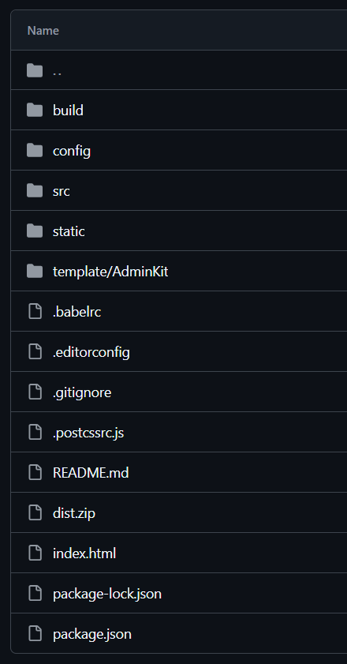
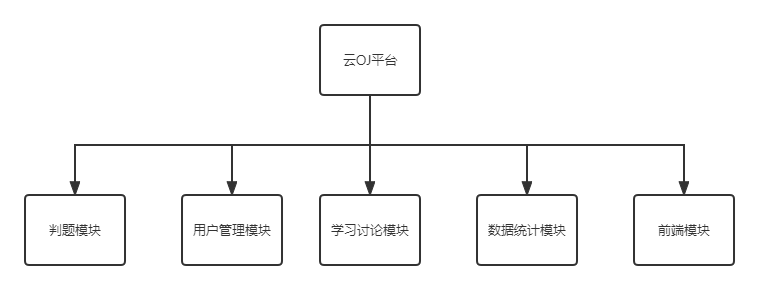
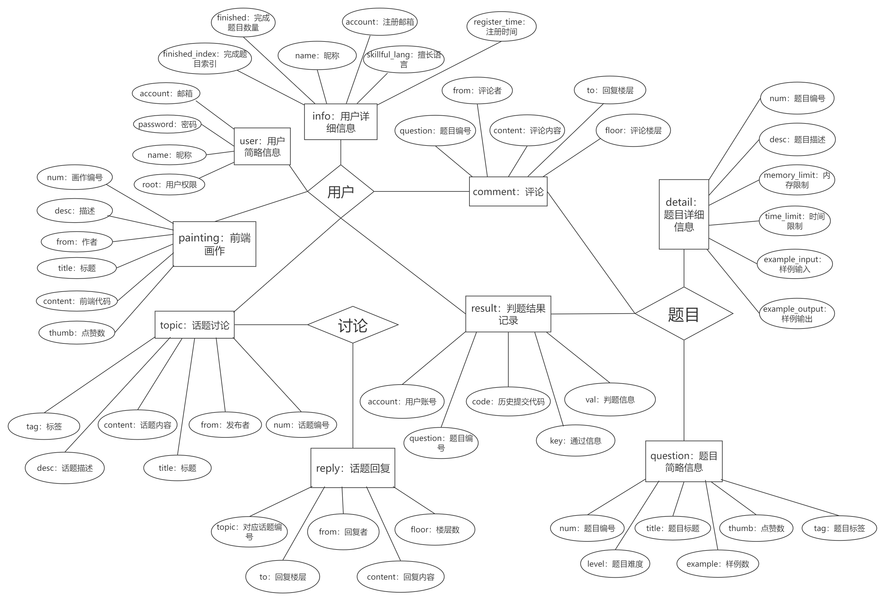
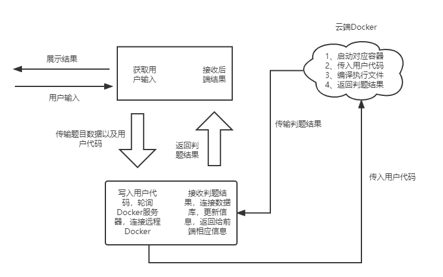

## 前期准备

### 编译执行 Java 程序

用bash命令编译执行 java 程序，对于以下程序

~~~java
package com;
public class HelloWorld{
    public static void main(String[] args){
        List<String> list = new ArrayList<>();
        list.add("nmsl");
        list.add("wdnmd");
        for(String str: list)
            System.out.println(str);
    }
}
~~~

编译：`javac -d . HelloWorld.java`在当前目录下生成一个 com 的文件夹，将 .class 文件统一编译到 com 文件夹下

运行：`java com/HelloWorld`运行`HelloWorld`中的主程序，该主程序将自动链接包（com）中的其他类，完成多个类的统一运行

这种执行将自动导入程序中导入的 java 自带类包（如 ArrayList 等等）

### Runner

实现覃辉学长给的接口 Runner

~~~java
package com.oj.neuqoj.docker;

import java.util.Map;

public interface Runner {
    /**
     *      * 获取运行结果，如果任何一条命令出错则立即返回 并在exitCode 写入错误代码，不再执行下一条命令
     *      * 运行时间和内存此时可以直接返回负数，不用再计算
     *      * 样例届时也会放置在输入文件夹中。
     *      * 友情提示：一条命令结束后 执行echo $?可以得到它的返回值 其他方案也可以
     *      * 以下命令可以得到当前容器内存大小等信息
     *      * docker stats --no-stream --format "{\"container\":\"{{ .Container }}\",\"memory\":{\"raw\":\"{{ .MemUsage }}\",\"percent\":\"{{ .MemPerc }}\"},\"cpu\":\"{{ .CPUPerc }}\"}"
     *      *
     *      * @param workPath  容器工作目录 目前都会传（/usr/codeRun/) ————> 暂时废弃
     *      * @param inputFilePath - 输入文件路径目录，需要拷贝此目录下所有文件到容器的工作目录（即/var/temp/code/20002/所有都拷贝到/usr/codeRun/) ————> 暂时废弃
     *      * @param commandLine - 待执行程序的命令行数组，多条命令，按顺序串行执行，包含完整目录(如javac /usr/codeRun/Hello.java )
     *      * @param imageType -(0 未定 |10520 python |10730 gcc:7.3 |  20800 openjdk:8 | 21100 openjdk:11| 30114 golang:1.14|用于选择镜像)
     *      * @param timeLimit - 每条命令的时间限制(单位ms, 0表示不限制)
     *      * @param memoryLimit - 每条命令的内存限制(单位KB, 0表示不限制)
     *      * @return 一个包含程序运行结果的Map<String, Object>对象（key有 "result":List<String>每条语句执行后的控制台输出,"exitCode":List<Integer>每条语句的运行后的状态代码
     *      * "usedTime: List<Integer>"，usedMemory: List<Integer>" 每条命令执行耗费的内存  其中result顺序要和命令顺序一致，如果没输出则放入“”)
     *      *
     *      */

    public Map<String, Object> judge(String workPath, String inputFilePath, String[][] commandLine,
                                   int imageType, int[] timeLimit, int[] memoryLimit) throws Exception;

}
~~~

comandLine1

```java
String[][] command1 = {{"javac", "HelloWorld.java"}, {"java", "HelloWorld"}};
```

返回结果

~~~shell
开始初始化docker
开始初始化
01:15:21.302 [main] DEBUG com.spotify.docker.client.DockerCertificates - Generated private key from spec using the 'RSA' algorithm
01:15:22.596 [main] DEBUG com.spotify.docker.client.DockerConfigReader - Using configfile: C:\Users\NorthBoat\.docker\config.json
docker_client初始化成功
开始创建docker容器
容器创建完毕
连接容器
01:15:25.805 [main] INFO com.spotify.docker.client.DefaultDockerClient - Starting container with Id: 4a2bebba027acbebc81faf7451afb481dceeeecfdf8dfe1f2fb0d6af8f86bdc1
开始编译...
编译成功
正在运行程序..
运行结束
停止容器成功
已移除容器
docker代理已关闭
本次判题结束，正在返回结果...

超时:false    超出内存限制:false    创建容器时间:5174ms    内存使用:0MiB    运行时间:1ms    停止容器时间:704ms    
运行结果：
Hello Docker!


finished!

Process finished with exit code 0
~~~

comandLine3

```java
String[][] command3 = {{"javac", "-d", ".", "Solution.java"}, {"java", "test/Solution"}};
```

返回结果

~~~shell
开始初始化docker
开始初始化
01:12:48.956 [main] DEBUG com.spotify.docker.client.DockerCertificates - Generated private key from spec using the 'RSA' algorithm
01:12:50.368 [main] DEBUG com.spotify.docker.client.DockerConfigReader - Using configfile: C:\Users\NorthBoat\.docker\config.json
docker_client初始化成功
开始创建docker容器
容器创建完毕
连接容器
01:12:53.205 [main] INFO com.spotify.docker.client.DefaultDockerClient - Starting container with Id: 36a71148a6c65c825f21c1ee27bf32b587ddc078dbe92196b011f90e2c5b11bb
开始编译...
编译成功
正在运行程序..
运行结束
停止容器成功
已移除容器
docker代理已关闭
本次判题结束，正在返回结果...

超时:false    超出内存限制:false    创建容器时间:5108ms    内存使用:0MiB    运行时间:1ms    停止容器时间:625ms    
运行结果：
hello,i am part 1
hello,i am part 2
ohhhhhhhhhhh!
finised


finished!

Process finished with exit code 0
~~~

## 前端开发

> Vue、ElementUI

热部署

~~~bash
npm run dev
~~~

构建

~~~bash
npm run build
~~~

目录结构



src 目录


### 主入口 main.js

main.js

- 引入 element-ui
- 引入 Axios，添加请求前缀 /api，这里在 config/index.js 中重写 /api 为后端请求路径，如 localhost，实现跨域请求

~~~js
// The Vue build version to load with the `import` command
// (runtime-only or standalone) has been set in webpack.base.conf with an alias.
import Vue from 'vue'
import App from './App'

import ElementUI from 'element-ui'
import 'element-ui/lib/theme-chalk/index.css';
Vue.use(ElementUI);

import router from './router'
import Axios from 'axios'
import VueAxios from 'vue-axios'

Vue.use(VueAxios, Axios);
Vue.prototype.$axios = Axios;
Axios.defaults.baseURL = '/api';
Axios.defaults.headers.post['Content-Type'] = 'application/json';

Vue.config.productionTip = false

/* eslint-disable no-new */
new Vue({
  el: '#app',
  router,
  render: h => h(App) //ElementUI
})
~~~

### 配置 config

index.js

- 主要是重写请求路径实现跨域请求
- 这里后端 SpringBoot 也要作出相应配合，使用 @CrossOrigin 注解

~~~js
'use strict'
const path = require('path')

module.exports = {
  dev: {
    // Paths
    assetsSubDirectory: 'static',
    assetsPublicPath: '/',
    proxyTable: {
      '/api':{
        target: 'http://39.106.160.174:8089/',
        changeOrigin: true,
        pathRewrite:{
            '^/api':''
        } 
      }
    },

    // Various Dev Server settings
    host: 'localhost', // can be overwritten by process.env.HOST
    port: 8087, // can be overwritten by process.env.PORT, if port is in use, a free one will be determined
    autoOpenBrowser: false,
    errorOverlay: true,
    notifyOnErrors: true,
    poll: false,
    devtool: 'cheap-module-eval-source-map',

    cacheBusting: true,

    cssSourceMap: true
  },

  build: {
    // Template for index.html
    index: path.resolve(__dirname, '../dist/index.html'),

    // Paths
    assetsRoot: path.resolve(__dirname, '../dist'),
    assetsSubDirectory: 'static',
    assetsPublicPath: './',
    productionSourceMap: true,
    devtool: '#source-map',
    productionGzip: false,
    productionGzipExtensions: ['js', 'css'],
    bundleAnalyzerReport: process.env.npm_config_report
  }
}
~~~

### 路由转发 router

使用 vue-router 作页面的重定向与跳转，这里必须要注意各页面的层级关系，不然会导致渲染失败

index.js

~~~js
import Vue from 'vue'
import Router from 'vue-router'

import Main from '../views/Main'
import Lost from '../views/Lost'
import Dispatch from '../views/Dispatch'

import Login from '../views/login/Login'
import Register from '../views/login/Register'
import Improve from '../views/login/Improve'

import Hello from '../views/content/Hello'
import Profile from '../views/content/Profile'

import Repository from '../views/content/work/Repository'
import Detail from '../views/content/work/Detail'
import Introduce from '../views/content/work/Introduce'
import Result from '../views/content/work/Result'
import Comment from '../views/content/work/Comment'
import Board from '../views/content/work/Board'

import Discuss from '../views/content/discuss/Discuss'
import Topic from '../views/content/discuss/Topic'
import List from '../views/content/discuss/List'
import Write from '../views/content/discuss/Write'

Vue.use(Router)

export default new Router({
  //mode: 'history',
  routes: [
    {
      path: '/login',
      component: Login,
      name: 'login'
    },

    {
      path: '/register',
      component: Register,
      name: 'register'
    },

    {
      path: '/improve',
      component: Improve,
      name: 'improve'
    },

    {
      path: '/main',
      component: Main,
      name: 'main',
      redirect: '/main/hello',
      children:[
        {path: '/main/hello', component: Hello, name: 'hello'},
        {path: '/main/dispathch', component: Dispatch, name: 'dispatch'},
        {path: '/main/profile', component: Profile, name: 'profile'},

        {path: '/main/repository/:tag', component: Repository, name: 'repository'},
        {
          path: '/main/detail',
          redirect: '/main/repository/all',
          component: Detail,
          name: 'detail',
          props: true,
          children: [
            {path: '/main/detail/introduce/:num', component: Introduce, name: 'introduce'},
            {path: '/main/detail/result/:num', component: Result, name: 'result'},
            {path: '/main/detail/comment/:num', component: Comment, name: 'comment'}
          ]
        },

        {path: '/main/discuss/:tag', component: Discuss, name: 'discuss'},
        {
          path: '/main/topic',
          component: Topic, 
          name: 'topic',
          redirect: '/main/discuss/All',
          children: [
            {path: '/main/topic/detail/:num', component: Topic, name: 'topic'}
          ]
        },
        {path: '/main/write', component: Write, name: 'write'},
        {path: '/main/board', component: Board, name: 'board'},
        {path: '/main/list', component: List, name: 'list'}
      ]
    },

    {
      path: '/',
      redirect: '/main',
    },
    
    {
      path: '/*',
      component: Lost,
      name: 'lost'
    }
  ]
})
~~~

Main.vue

- 主页：侧边栏、导航栏、页眉、页脚
- 具体内容使用 router-view 展示

Lost.vue：404 页面

~~~vue
<template>
    <div id="lost">
        
    </div>
</template>

<script>
export default {
    name: 'Lost'
};
</script>

<style lang="scss" scoped>
    #lost {
        font-family: 'Avenir', Helvetica, Arial, sans-serif;
        -webkit-font-smoothing: antialiased;
        -moz-osx-font-smoothing: grayscale;
        text-align: center;
        color: #2c3e50;
        margin-top: 60px;
    }
</style>
~~~

DIspatch.vue

- 用于页面转发
- 重新渲染页面

~~~vue
<template>
    <div>
        
    </div>
</template>

<script>
export default {
    name: 'Dispatch',
    mounted() {
        //若在结果界面判题，通过这里作为跳板刷新结果界面
        if(this.$route.params.result !== undefined){
            this.$router.push({name: 'result', params: {num: this.$route.params.num, result: this.$route.params.result, code: this.$route.params.code}});
            //console.log(this.$route.params.result);
            return;
        }
        // 侧边栏仓库请求 
        else if(this.$route.params.repoTag != undefined){
            this.$router.push({name: 'repository', params: {tag: this.$route.params.repoTag}});
            return;
        } 
        // 侧边栏讨论请求
        else if(this.$route.params.discTag != undefined){
            this.$router.push({name: 'discuss', params: {tag: this.$route.params.discTag}});
            return;
        } 
        // 题目评论后跳转
        else if(this.$route.params.commentFloor != undefined){
            this.$router.push({name: 'comment', params: {num: this.$route.params.num, floor: this.$route.params.commentFloor}});
            return;
        } 
        // 话题评论后跳转
        else if(this.$route.params.replyFloor != undefined){
            this.$router.push({name: 'topic', params: {num: this.$route.params.num, floor: this.$route.params.replyFloor}});
            return;
        }
        // 发布新绘画后跳转 
        else if(this.$route.params.flag != undefined){
            this.$router.push({name: 'board'});
            return;
        }
        this.$router.push({name: 'hello'});
    },

    methods: {
        
    },
};
</script>

<style lang="scss" scoped>

</style>
~~~

### 内容 content

Main.vue

- 整个页面的框架
- 具体内容通过 router-view 进行展示

Hello.vue

- 主页一进去的内容，进行数据展示
- 其余内容页都差不多，只不过请求不同

Profile.vue：个人信息页

Login.vue：参考了 github 的登录页面

~~~vue
<template>
  <div id="login">
    

    <el-form ref="loginForm" :model="form" :rules="rules" label-width="80px" class="login-box">

      <h3 class="login-title">Login</h3>

      <el-form-item label="username" prop="username">
        <el-input type="text" placeholder="用户名或邮箱地址" clearable v-model="form.username"/>
      </el-form-item>

      <el-form-item label="password" prop="password">
        <el-input type="password" placeholder="请输入密码" show-password v-model="form.password"/>
      </el-form-item>

      <el-form-item id="login-button">
        <el-button type="primary"  round @click="login()">登录</el-button>
      </el-form-item>

    </el-form>

    <div id="tips">
      <p>New to OJ? <router-link type="primary" to="/register">Create an account</router-link></p>
      <p><router-link type="primary" to="/find">Maybe you forget password ?</router-link></p>
      
    </div>
    
  </div>
</template>

<script>
  export default {
    name: "Login",
    data() {
      return {
        form: {
          username: '',
          password: '',       
        },
        //表单验证，需要在el-form-item 元素中增加prop 属性
        rules: {
          username: [                       
            {required: true, message: " 账号不可为空", trigger: 'blur'}
          ],
          password: [
            {required: true, message: " 密码不可为空 ", trigger: 'blur'}
          ]
        },
      }
    },
    methods: {
      login() {
        if(this.form.username === '' || this.form.password === ''){
            this.$message.error('请完整填写用户名及密码');
            return;
        }
        let info = {username: this.form.username, password: this.form.password};
        this.$axios.post('/login', info).then(response => {
          let result = response.data;
          if(result.code !== 200) {
            this.$message.error(result.message);
          } else{
            this.$message({
              message: "登陆成功",
              type: 'success'
            });
            window.sessionStorage.setItem("loginUsername", result.data.name);
            window.sessionStorage.setItem("loginAccount", result.data.account);
            this.$router.push({name: 'dispatch'});
          }
        })
      }
    }
  }
</script>

<style lang="scss" scoped>
  .login-box {
    border: 1px solid #DCDFE6;
    width: 250px;
    margin: auto;
    margin-bottom: 20px;
    padding: 35px 35px 15px 35px;
    border-radius: 5px;
    -webkit-border-radius: 5px;
    -moz-border-radius: 5px;
    box-shadow: 0 0 25px #909399;
  }

  #tips {
    font: 13px Small;
    border: 3px solid #DCDFE6;
    width: 250px;
    margin: auto;
    border-radius: 4px;
    padding: 9px 32px 9px 32px;
  }

  .login-title {
    text-align: center;
    margin: 0 auto 40px auto;
    color: #303133;
  }

  #login-button{
    position: relative;
    left: -12%;

  }

  #login {
    font-family: 'Avenir', Helvetica, Arial, sans-serif;
    -webkit-font-smoothing: antialiased;
    -moz-osx-font-smoothing: grayscale;
    text-align: center;
    color: #2c3e50;
    margin-top: 60px;
  }

  .router-link-active{
    text-decoration: none;
  }
  
  a{
    text-decoration: none;
  }

  a:hover{
    text-decoration: none;
  }
</style>
~~~

## 后端开发

SpringBoot + MyBatis + Redis

### 设计与配置

总体设计



数据库 ER 图



正常用 MySQL 存就行

对于一些统计数据和临时数据，例如

- 注册时用的邮箱验证码
- 热门题目排行：根据点赞数排序
- 访问的较多的题目信息

采用 Redis 存储，分别使用

1. HMAP 存储键值对存储：`<register:code, <UserID/Email, Code>>`
2. SortedSet 存储题目 ID 和点赞次数（Double）：`<question:thumb, <QuestionID, Count>>`
3. HMAP 存储完整的题目信息：`<question:info, <QuestionID, {title, level, template...}>>`

环境

- JDK 1.8
- Spring 2.6.1
- Docker Client 8.16.0
- MyBatis 3.4.5
- Druid 1.2.8

配置文件

- maven - pom.xml：[Bears-OJ/backend/pom.xml at master · Arkrypto/Bears-OJ](https://github.com/Arkrypto/Bears-OJ/blob/master/backend/pom.xml)
- log4j - log4j.properties：[Bears-OJ/backend/src/main/resources/log4j.properties at master · Arkrypto/Bears-OJ](https://github.com/Arkrypto/Bears-OJ/blob/master/backend/src/main/resources/log4j.properties)
- springboot - application.yml

~~~yaml
spring:
  application:
    name: neuqoj
  datasource:
    username: root
    password: ""
    url: jdbc:mysql://39.106.160.174:3306/neuqoj?serverTimezone=UTC&useUnicode=true&characterEncoding=utf-8
    driver-class-name: com.mysql.cj.jdbc.Driver
    type: com.alibaba.druid.pool.DruidDataSource
    filters: stat,wall,log4j
  thymeleaf:
    cache: false
  redis:
    host: 39.106.160.174
    port: 6379
    password: ""


#整合mybatis
mybatis:
  type-aliases-package: com.oj.neuqoj.pojo

server:
  port: 8089
~~~

### Docker Client

判题流程



RunnerImpl.java，实现覃辉的 Runner 接口

~~~java
// 10730 gcc:7.3 |  20800 openjdk:8 | 21100 openjdk:11 | 30114 golang:1.14
public class DockerRunner implements Runner, Callable<Map<String, Object>> {

    public static final String DOCKER_CONTAINER_WORK_DIR = "/usr/codeRun";
    private static Map<Integer, String> imageMap = new HashMap<>();
    private DockerClient docker;
    // private List<Image> Images;

    private static final int coreContainerSize = 7;
    private static final int maximumContainerSize = 12;
    //请求队列，当容器不够时给爷排队
    private static Deque<JudgeRequest> requestQueue;
    //{服务器1: {镜像类型1: List容器ID, 镜像类型2: List容器ID...}, 服务器2:...}
    private static Map<Integer, Map<String, List<String>>> dockerContainerList;

    static{
        imageMap.put(25695, "hello-world:latest");
        imageMap.put(10730, "gcc:7.3");
        imageMap.put(20800, "openjdk:8");
        imageMap.put(21100, "openjdk:11");
        //imageMap.put(30114, "golang:1.14");
        imageMap.put(10520, "python:3.6.6");

        requestQueue = new LinkedList<>();

        dockerContainerList = new HashMap<>();
        dockerContainerList.put(0, new HashMap<>());
        dockerContainerList.put(1, new HashMap<>());
        dockerContainerList.put(2, new HashMap<>());
    }


    public void offer(String name, String[][] commandLine, int imageType, long memoryLimit){
        requestQueue.offer(new JudgeRequest(name, commandLine, imageType, memoryLimit));
    }


    //只轮询了Docker服务器，返回容器id
    //应该根据容器数量进行动态判断，若有空闲容器直接返回其id
    private static int pollingCount = 0;
    public ContainerCreation dockerPolling(String type) throws DockerException, InterruptedException {
        //设置容器属性
        //让容器持续开启
        //添加卷
        //设置docker工作卷
        ContainerConfig containerConfig = ContainerConfig.builder()
                //让容器持续开启
                .openStdin(true)
                //添加卷
                .addVolume(DOCKER_CONTAINER_WORK_DIR)
                //设置docker工作卷
                .workingDir(DOCKER_CONTAINER_WORK_DIR)
                .image(type)
                .build();
        ContainerCreation creation = null;
        int count = 0;
        while(true){
            if(pollingCount%3 == 0){
                try{
                    docker = DefaultDockerClient.builder()
                            //证书连接
                            .uri(URI.create("https://39.106.160.174:2375"))
                            //服务器路径：/java/certs
                            //windows路径：C:\Files\java\javaee\my-oj\My-OJ-Server\src\main\resources\dockercerts
                            .dockerCertificates(new DockerCertificates(Paths.get("/java/certs")))
                            .build();
                    creation = docker.createContainer(containerConfig);
                    break;
                }catch (Exception e){
                    pollingCount++;
                    if(++count >= 3){ throw new RuntimeException("Docker连接失败"); }
                }
            }
            if(pollingCount%3 == 1){
                try{
                    docker = DefaultDockerClient.builder()
                            //直接连接
                            .uri(URI.create("http://144.24.68.12:2375"))
                            .build();
                    creation = docker.createContainer(containerConfig);
                    break;
                }catch (Exception e){
                    pollingCount++;
                    if(++count >= 3){ throw new RuntimeException("Docker连接失败"); }
                }
            }
            if(pollingCount%3 == 2) {
                try{
                    docker = DefaultDockerClient.builder()
                            //直接连接
                            .uri(URI.create("http://110.42.161.162:2375"))
                            .build();
                    creation = docker.createContainer(containerConfig);
                    break;
                }catch (Exception e){
                    pollingCount++;
                    if(++count >= 3){ throw new RuntimeException("Docker连接失败"); }
                }
            }
        }

        //System.out.println(pollingCount++);
        return creation;
    }

    //是否有空闲容器
    public boolean containerAvailable(int num, String type) throws DockerException, InterruptedException {
        if(dockerContainerList.get(num).get(type).size() < coreContainerSize){
            return false;
        }
        for(String id: dockerContainerList.get(num).get(type)){
            if(!docker.inspectContainer(id).state().running()){
                return true;
            }
        }
        return false;
    }

    //初始化容器
    public long init(int type, JudgeRequest params) {
        //一开始为了测试时间，该函数返回类型为long
        long start = System.currentTimeMillis();
        System.out.println("开始初始化docker");
        String id = null;
        String imageType = imageMap.get(type);
        try{

            //开始创建容器
            System.out.println("开始创建docker_container");
            //初始化docker代理、开启容器，轮询初始化，遇错先向后轮询，若全报错则直接抛出错误
            //通过轮询获取容器
            ContainerCreation creation = dockerPolling(imageType);

            System.out.println(docker.info());

            //记录容器id
            // id = polling(imageType).id();
            id = creation.id();
            params.setContainerId(id);

            //dockerContainerList.get((pollingCount-1)%3).get(imageType).add(id);

            // 获取容器信息
            // final ContainerInfo info = docker.inspectContainer(id);
            // System.out.println(info.toString());


            System.out.println("docker_container创建完毕");
            System.out.println("docker初始化成功");
        }catch (Exception e) {
            e.printStackTrace();
        }
        long end = System.currentTimeMillis();
        return end-start;
    }

    //请求出队，在这个地方完成 容器id设置 一个请求对应一个id，根据容器数量决定新建还是用现成的，在init里面操作
    public JudgeRequest poll(){
        JudgeRequest cur = requestQueue.poll();
        if(cur == null){ throw new RuntimeException("线程混乱，请求队列已空"); }

        cur.setInitTime(init(cur.getImageType(), cur));

        return cur;
    }

    //停止容器：记录停止时间
    public long kill(String id){
        long startTime = System.currentTimeMillis();
        try{
            //停止容器
            docker.stopContainer(id, 0);
            System.out.println("停止容器成功");
            //移除容器
            docker.removeContainer(id);
            System.out.println("已移除容器");
            //关闭docker代理
            docker.close();
            System.out.println("docker代理已关闭");
        }catch(Exception e) {
            e.printStackTrace();
        }
        System.out.println("本次判题结束，正在返回结果...");
        long endTime = System.currentTimeMillis();
        return endTime - startTime;
    }


    @Override
    public Map<String, Object> call() throws Exception {
        return judge();
    }

    public Map<String, Object> judge() throws InterruptedException, IOException, DockerException{
        JudgeRequest request = poll();

        Map<String, Object> res = new HashMap<>();

        res.put("initTime", request.getInitTime());
        String id = request.getContainerId();

        System.out.println(id);
        System.out.println(docker.info());

        //连接container
        System.out.println("连接容器");
        docker.startContainer(id);

        //将本地文件夹共享至容器内部
        docker.copyToContainer(new File
                //服务器路径：/java/oj/
                ("/java/oj/" + request.getName()).toPath(), id, "/usr/codeRun/");


        //开始在容器内部执行命令执行
        //编译java文件
        System.out.println("开始编译...");
        ExecCreation execCompile = docker.execCreate(
                id, request.getCommandLine()[0], DockerClient.ExecCreateParam.attachStdout(),
                DockerClient.ExecCreateParam.attachStderr());

        ExecState compileState = docker.execInspect(execCompile.id());
        //执行编译命令
        LogStream l = docker.execStart(execCompile.id());
        while(compileState.running()){};
        String compileOutput = l.readFully();

        if(compileOutput.equals("")){
            System.out.println("编译成功");
        } else {//编译错误
            System.out.println(compileOutput);
            res.put("status", 2);
            //截取编译信息，去掉头部java文件名
            res.put("compileInfo", compileOutput.substring(compileOutput.indexOf(":")+1));
            res.put("destroyTime", kill(id) + "ms");
            res.put("passNum", 0);
            return res;
        }


        //编译完成，执行class文件
        ExecCreation execCreation = docker.execCreate(
                id, request.getCommandLine()[1], DockerClient.ExecCreateParam.attachStdout(),
                DockerClient.ExecCreateParam.attachStderr());


        //获取命令的运行结果
        LogStream output = null;
        if(!compileState.running()){
            output = docker.execStart(execCreation.id());
        }
        String execOutput = output != null ? output.readFully() : "未知错误";


        //获取运行状态
        ExecState state = docker.execInspect(execCreation.id());


        //等待运行完成
        System.out.println("即将运行程序..");

        while(state.running()){};
        System.out.println("运行结束");

        //从打印信息execOutput种获取结果
        //System.out.println(execOutput);
        String[] info = execOutput.split("\n");
        int status = Integer.parseInt(info[0].trim());
        //System.out.println(status);

        //解答错误
        if(status == 3){
            res.put("status", status);
            res.put("passNum", info[1]);
            res.put("srcData", info[2]);
            res.put("realAns", info[3]);
            res.put("curAns", info[4]);
            res.put("destroyTime", kill(id) + "ms");
            return res;
        } else if(status == 4) {//超时
            res.put("status", status);
            res.put("passNum", info[1]);
            res.put("srcData", info[2]);
            res.put("timeLimit", info[3]);
            res.put("duration", info[4]);
            res.put("destroyTime", kill(id) + "ms");
            return res;
        } else {
            res.put("passNum", info[1]);
            res.put("averageTime", info[2]);
        }


        //在容器外，即服务器主机上执行shell命令 docker stats --no-stream --format "memory:{{.MemUsage}}" + 容器id，获取容器内存占用
        /*Process pro = Runtime.getRuntime().exec("sh -c docker stats --no-stream --format \"memory:{{.MemUsage}}\"" + id);
        BufferedReader buf = new BufferedReader(new InputStreamReader(pro.getInputStream()));
        StringBuilder mem = new StringBuilder();
        String str;
        while ((str = buf.readLine()) != null) {
            mem.append(str);
        }*/
        String memory = "0MiB";
        /*if(mem.length()!=0){
            memory = mem.substring(mem.indexOf(":"), mem.indexOf("/"));
        }*/


        //超出内存限制
        if(Integer.parseInt(memory.substring(0, memory.indexOf("M"))) > request.getMemoryLimit()){
            res.put("status", 5);
            res.put("memoryLimit", request.getMemoryLimit());
            res.put("memoryUsage", memory);
            res.put("destroyTime", kill(id) + "ms");
        }else{//通过
            System.out.println("hahaha");
            res.put("status", 1);
            res.put("memoryUsage", memory);
            res.put("destroyTime", kill(id) + "ms");
        }

        return res;
    }


    public static void main(String[] args) {

        DockerRunner docker = new DockerRunner();

        Map<String, Object> res = docker.test(20800);

        //测试创建容器时间
        //long initTime = Integer.parseInt(res.get("创建容器时间").toString());
        //停止容器时间
        long stopTime = Integer.parseInt(res.get("关闭容器时间").toString());
        //编译命令执行时间
        long compileTime = Integer.parseInt(res.get("编译命令用时").toString());
        //执行命令执行时间
        long execTime = Integer.parseInt(res.get("执行命令用时").toString());
        //程序用时
        long runningTime = Integer.parseInt(res.get("程序用时").toString());
        //函数总用时
        long judgeTime = Integer.parseInt(res.get("本次判题总用时").toString());


        for (int i = 0; i < 0; i++) {
            Map<String, Object> temp = docker.test(20800);
            //initTime += Integer.parseInt(temp.get("创建容器时间").toString());
            stopTime += Integer.parseInt(temp.get("关闭容器时间").toString());
            compileTime += Integer.parseInt(temp.get("编译命令用时").toString());
            execTime += Integer.parseInt(temp.get("执行命令用时").toString());
            runningTime += Integer.parseInt(temp.get("程序用时").toString());
            judgeTime += Integer.parseInt(temp.get("本次判题总用时").toString());
            System.out.println("第" + (i+2) + "测试已完成");
        }


        //打印信息
        System.out.println("首次执行信息:");
        for(String str: res.keySet()){
            System.out.print(str + ": " + res.get(str) + "\t");
        }


        System.out.println("finished!");

    }

    //测试Docker运行时间
    public Map<String, Object> test(int imageType){
        long start = System.currentTimeMillis();
        Map<String, Object> res = new HashMap<>();
        String id = init(imageType);
        try{

            //启动container
            //docker.startContainer(id);


            //开始在容器内部执行命令执行
            System.out.println("正在执行命令...");

            //将文件拷贝至容器内部
            docker.copyToContainer(new java.io.File("C:\\Files\\java\\javaee\\my-oj\\Code-Src\\").toPath(), id, "/usr/codeRun/");


            //执行一道动态规划
            final String[] command1 = {"javac", "HelloWorld.java"};
            ExecCreation execCreation1 = docker.execCreate(
                    id, command1, DockerClient.ExecCreateParam.attachStdout(),
                    DockerClient.ExecCreateParam.attachStderr());

            final String[] command2 = {"java", "HelloWorld"};
            ExecCreation execCreation2 = docker.execCreate(
                    id, command2, DockerClient.ExecCreateParam.attachStdout(),
                    DockerClient.ExecCreateParam.attachStderr());

            //获取命令的运行结果
            final LogStream output1 = docker.execStart(execCreation1.id());
            final String execOutput1 = output1.readFully();

            //计算编译时间
            long compile = System.currentTimeMillis();
            res.put("编译命令用时", compile-start);


            final LogStream output2 = docker.execStart(execCreation2.id());
            final String execOutput2 = output2.readFully();
            //计算执行时间
            long exec = System.currentTimeMillis();
            res.put("执行命令用时", exec-compile);


            //获取运行状态
            final ExecState state1 = docker.execInspect(execCreation1.id());
            final ExecState state2 = docker.execInspect(execCreation2.id());

            //等待运行完成
            System.out.println("正在运行...");
            while(state1.running()){};
            while(state2.running()){};


            System.out.println("执行结束");

            System.out.println("运行结果: " + execOutput2);
            res.put("程序用时", execOutput2.substring(execOutput2.indexOf('\n')+1));
            long end = System.currentTimeMillis();
            res.put("本次判题总用时", end-start);

        }catch(Exception e) {
            e.printStackTrace();
        }finally {
            res.put("关闭容器时间", kill(id));
        }
        return res;
    }

    //初始化容器
    public String init(int type) {

        System.out.println("开始初始化docker");
        String id = null;
        try{
            //初始化docker代理
            docker = DefaultDockerClient.builder()
                    .uri(URI.create("https://39.106.160.174:2375"))
                    .dockerCertificates(new DockerCertificates(Paths.get("C:\\Files\\java\\javaee\\my-oj\\My-OJ-Server\\src\\main\\resources\\dockercerts")))
                    .build();
            System.out.println("docker_client初始化成功");

            //记录已有镜像信息
            /*
            System.out.println("开始记录docker_client_images");
            Images = docker.listImages();
            Iterator<Image> i = Images.listIterator();
            while(i.hasNext()){
                System.out.println(i.next());
            }
            System.out.println("images记录完毕");
            */

            //开始创建容器
            System.out.println("开始创建docker_container");
            //让容器持续开启
            //添加卷
            //设置docker工作卷
            ContainerConfig containerConfig = ContainerConfig.builder()
                    //让容器持续开启
                    .openStdin(true)
                    //添加卷
                    .addVolume(DOCKER_CONTAINER_WORK_DIR)
                    //设置docker工作卷
                    .workingDir(DOCKER_CONTAINER_WORK_DIR)
                    .image(imageMap.get(type))
                    .build();
            ContainerCreation creation = docker.createContainer(containerConfig);

            //记录容器id
            id = creation.id();

            // 获取容器信息
            final ContainerInfo info = docker.inspectContainer(id);
            System.out.println(info.toString());


            System.out.println("docker_container创建完毕");
            System.out.println("docker初始化成功");
        }catch (Exception e) {
            e.printStackTrace();
        }
        return id;
    }

    //覃辉版本
    //让代码运行于docker并返回结果
    public Map<String, Object> judge(String workPath, String inputFilePath, String[][] commandLine,
                                     int imageType, int[] timeLimit, int[] memoryLimit) {
        Map<String, Object> res = new HashMap<String, Object>();
        init(imageType);
        return res;
    }
}
~~~

### 接口 Controller

QuestionApi.java

~~~java
@RestController
@CrossOrigin
public class QuestionApi {


    private QuestionMapper questionMapper;
    @Autowired
    public void setQuestionMapper(QuestionMapper questionMapper){
        this.questionMapper = questionMapper;
    }

    private DetailMapper detailMapper;
    @Autowired
    public void setDetailMapper(DetailMapper detailMapper){
        this.detailMapper = detailMapper;
    }

    private ResultMapper resultMapper;
    @Autowired
    public void setResultMapper(ResultMapper resultMapper){
        this.resultMapper = resultMapper;
    }

    private NewsMapper newsMapper;
    @Autowired
    public void setNewsMapper(NewsMapper newsMapper){
        this.newsMapper = newsMapper;
    }

    private InfoMapper infoMapper;
    @Autowired
    public void setInfoMapper(InfoMapper infoMapper){
        this.infoMapper = infoMapper;
    }

    private CommentMapper commentMapper;
    @Autowired
    public void setCommentMapper(CommentMapper commentMapper){
        this.commentMapper = commentMapper;
    }


    

    @RequestMapping("/getRepo")
    public ResultUtil list(@RequestBody Map<String, String> params){
        String tag = params.get("tag");
        //System.out.println(tag);
        if(tag.equals("All")){
            return ResultUtil.success(questionMapper.getAllQuestions());
        }
        return ResultUtil.success(questionMapper.getQuestionByTag(tag));
    }


    @RequestMapping("/getQuestion")
    public ResultUtil getQuestion(@RequestBody Map<String, String> params){
        int num;
        try{
            num = Integer.parseInt(params.get("num"));
        }catch (NumberFormatException e){
            System.out.println("访问非法题目序号");
            return ResultUtil.failure(ResultCode.PARAM_IS_INVALID);
        }
        Question question = questionMapper.getQuestion(num);
        if(question == null){
            return ResultUtil.failure(ResultCode.DATA_NOT_FOUND);
        }
        return ResultUtil.success(question);
    }


    @RequestMapping("/getQuesNews")
    public ResultUtil getQuesNews(){
        Map<String, Object> res = new HashMap<>();
        List<Question> list = questionMapper.getAllQuestions();
        res.put("ques_num", list.size());
        res.put("new_ques", list.get(list.size()-1));
        //System.out.println(list.size() + " " + list.get(list.size()-1));
        return ResultUtil.success(res);
    }


    @RequestMapping("/getDetail")
    public ResultUtil getDetail(@RequestBody Map<String, String> params){
        int num;
        try{
            num = Integer.parseInt(params.get("num"));
        }catch (NumberFormatException e){
            System.out.println("访问非法题目序号");
            return ResultUtil.failure(ResultCode.PARAM_IS_INVALID);
        }
        Detail detail = detailMapper.getDetail(num);
        if(detail == null){
            return ResultUtil.failure(ResultCode.DATA_NOT_FOUND);
        }
        return ResultUtil.success(detail);
    }


    @RequestMapping("/judge")
    public ResultUtil judge(@RequestBody Map<String, String> params){
        //获取用户代码
        String answer = params.get("answer");
        //获取用户名，用于创建用户代码文件
        String username = params.get("username");
        //获取语言编号
        int lang = Integer.parseInt(params.get("lang"));
        //获取题目名，用于共享文件夹（每道题一个文件夹）
        String name = params.get("name");

        //写入用户代码，false即为io报错，直接返回错误信息
        if(!new IOUtil().writeAns(answer, name, username, lang)){
            return ResultUtil.failure(ResultCode.JUDGE_IO_ERROR);
        }

        //获取内存限制，0为无限制
        long memoryLimit = Long.parseLong(params.get("memoryLimit"));
        //获取命令
        String[][] commandLine = new CommandUtil().createCommand(lang, username);


        //准备docker容器
        DockerRunner dockerRunner = new DockerRunner();
        //请求入队
        dockerRunner.offer(name, commandLine, lang, memoryLimit);


        //新建线程开启docker容器判题
        FutureTask<Map<String, Object>> task = new FutureTask<>(dockerRunner);
        new Thread(task).start();
        if(!task.isDone()){ System.out.println("The task is running"); }
        //获取结果并返回
        Map<String, Object> res;
        try {
            res = task.get();
        } catch (InterruptedException e) {
            return ResultUtil.failure(ResultCode.JUDGE_SERVER_ERROR, "判题线程中断");
        } catch (ExecutionException e) {
            return ResultUtil.failure(ResultCode.JUDGE_IO_ERROR, "判题执行错误");
        }


        int num = Integer.parseInt(params.get("num"));
        Info info = infoMapper.getInfo(username);
        //更新用户数据
        if((Integer)res.get("status") == 1 && !info.hasPassed(num)){
            info.pass(num, lang);
            info.goodAt();
        }
        infoMapper.updateInfo(info);

        return ResultUtil.success(res);

    }


    @RequestMapping("/storeRes")
    public ResultUtil storeResult(@RequestBody Map<String, String> params){
        String account = params.get("account");
        int num = Integer.parseInt(params.get("num"));
        String title = params.get("title");
        String key1 = params.get("key1");
        String key2 = params.get("key2");
        String key3 = params.get("key3");
        String key4 = params.get("key4");
        String val1 = params.get("val1");
        String val2 = params.get("val2");
        String val3 = params.get("val3");
        String val4 = params.get("val4");
        String code = params.get("code");
        Result result = new Result(account, num, title, key1, key2, key3, key4, val1, val2, val3, val4, code);

        if(result.getCode().length() > 520){
            result.setCode(result.getCode().substring(0, 520));
        }
        if(result.getVal2().length() > 200){
            result.setCode(result.getVal2().substring(0, 200));
        }

        if(resultMapper.getResult(account, num) != null){
            resultMapper.updateResult(result);
        } else {
            resultMapper.setResult(result);
        }
        return ResultUtil.success();
    }


    @RequestMapping("/getRes")
    public ResultUtil getRes(@RequestBody Map<String, String> params){
        //System.out.println(params.get("account"));
        String account = params.get("account");
        int num = Integer.parseInt(params.get("num"));
        Result res = resultMapper.getResult(account, num);
        if(res == null){
            return ResultUtil.failure(ResultCode.DATA_NOT_FOUND);
        }
        return ResultUtil.success(res);
    }


    @RequestMapping("/getComments")
    public ResultUtil getComments(@RequestBody Map<String, String> params){
        int question = Integer.parseInt(params.get("question"));
        List<Comment> comments = commentMapper.getComments(question);
        for(Comment c: comments){
            c.setComments(comments);
        }
        List<Comment> res = new ArrayList<>();
        for(Comment c: comments){
            if(c.getTo() == 0){
                res.add(c);
            }
        }
        return ResultUtil.success(res);
    }


    @RequestMapping("/comment")
    public ResultUtil comment(@RequestBody Map<String, Object> params){
        int question = Integer.parseInt(params.get("question").toString());
        String from = params.get("from").toString();
        int to = Integer.parseInt(params.get("to").toString());
        String content = params.get("content").toString();

        if(content.length() > 200){
            return ResultUtil.failure(ResultCode.PARAM_IS_INVALID);
        }
        commentMapper.comment(new Comment(question, from, to, content));
        return ResultUtil.success();
    }
}
~~~

### 响应 Result

ResultCode.java

~~~java
package com.oj.neuqoj.utils;

public enum ResultCode {

    //http状态码
    SUCCESS(200, "成功"),
    INTERNAL_SERVER_ERROR(500, "服务器错误"),
    REQUEST_TIME_OUT(408, "请求超时"),

    //判题反馈
    //JUDGE_PASS(1, "通过"),
    JUDGE_COMPILE_FAILURE(2, "编译失败"),
    JUDGE_TIMEOUT_FAILURE(3, "执行超时"),
    JUDGE_MEMORY_OUT_FAILURE(4, "内存超出"),
    JUDGE_NOT_MATCH_FAILURE(5, "解答错误"),
    JUDGE_SERVER_ERROR(6, "服务错误"),
    JUDGE_IO_ERROR(7, "写入用户代码错误"),

    //参数问题
    PARAM_IS_INVALID(1001, "参数无效"),
    PARAM_IS_BLANK(1002, "参数为空"),
    PARAM_TYPE_BIND_ERROR(1003, "参数类型错误"),

    //用户问题
    USER_NOT_LOGGED_IN(2001, "用户未登录"),
    USER_PASSWORD_ERROR(2002, "密码错误"),
    USER_ACCOUNT_FORBIDDEN(2003, "账号已被禁用"),
    USER_NOT_EXIST(2004, "用户不存在"),
    USER_HAS_EXISTED(2005, "用户已存在"),

    //邮件问题
    EMAIL_NOT_AVAILABLE(2006, "发送邮件出错"),
    CODE_VERIFY_FAILURE(2007, "验证码错误"),

    //sql问题
    DATA_NOT_FOUND(2008, "请求的数据不存在");

    private Integer code;
    private String message;

    ResultCode(Integer code, String message){
        this.code = code;
        this.message = message;
    }

    public Integer code(){
        return this.code;
    }

    public String message(){
        return this.message;
    }
}
~~~

ResultUtil.java

~~~java
package com.oj.neuqoj.utils;

import lombok.Data;

import java.io.Serializable;

@Data
public class ResultUtil implements Serializable {
    private Integer code;
    private String message;
    private Object data;

    public ResultUtil(){}

    public ResultUtil(ResultCode resultCode, Object data) {
        this.code = resultCode.code();
        this.message = resultCode.message();
        this.data = data;
    }

    public void setResultCode(ResultCode resultCode){
        this.code = resultCode.code();
        this.message = resultCode.message();
    }

    public void setData(Object data){
        this.data = data;
    }

    public static ResultUtil success(){
        ResultUtil resultUtil = new ResultUtil();
        resultUtil.setResultCode(ResultCode.SUCCESS);
        return resultUtil;
    }

    public static ResultUtil success(Object data){
        ResultUtil resultUtil = new ResultUtil();
        resultUtil.setResultCode(ResultCode.SUCCESS);
        resultUtil.setData(data);
        return resultUtil;
    }

    public static ResultUtil failure(ResultCode resultCode){
        ResultUtil resultUtil = new ResultUtil();
        resultUtil.setResultCode(resultCode);
        return resultUtil;
    }

    public static ResultUtil failure(ResultCode resultCode, Object data){
        ResultUtil resultUtil = new ResultUtil();
        resultUtil.setResultCode(resultCode);
        resultUtil.setData(data);
        return resultUtil;
    }
}
~~~

### Mapper 示例

QuestionMapper.java（偷懒用注解写了）

~~~java
package com.oj.neuqoj.mapper;


import com.oj.neuqoj.pojo.Question;
import org.apache.ibatis.annotations.Mapper;
import org.apache.ibatis.annotations.Select;
import org.springframework.stereotype.Repository;

import java.util.List;

@Mapper
@Repository
public interface QuestionMapper {

    @Select("select * from `question`")
    List<Question> getAllQuestions();

    @Select("select * from `question` where num=#{num}")
    Question getQuestion(int num);

    void addQuestion(Question question);

    @Select("select * from `question` where tag=#{tag}")
    List<Question> getQuestionByTag(String tag);
}
~~~

## 服务器部署

通过 nginx 部署

- 部署前端静态文件，做反向代理
- 对 java 程序端口做负载均衡

nginx.conf

~~~yaml
#user  nobody;
worker_processes  1;

#error_log  logs/error.log;
#error_log  logs/error.log  notice;
#error_log  logs/error.log  info;

#pid        logs/nginx.pid;


events {
    worker_connections  1024;
}


http {
    include       mime.types;
    default_type  application/octet-stream;

    #log_format  main  '$remote_addr - $remote_user [$time_local] "$request" '
    #                  '$status $body_bytes_sent "$http_referer" '
    #                  '"$http_user_agent" "$http_x_forwarded_for"';

    #access_log  logs/access.log  main;

    sendfile        on;
    #tcp_nopush     on;

    #keepalive_timeout  0;
    keepalive_timeout  65;
    
    #gzip  on;

    upstream NEUQ-OJ{
	# OJ后台服务负载均衡
	server 39.106.160.174:8089 weight=2;
	server 110.42.161.162:8089 weight=1;
    }
    server {
	listen       8087;
	server_name  localhost;
	location / {
	    root   html;
	    index  index.html index.htm;
        }
	location /api {
	    rewrite   ^.+api/?(.*)$ /$1 break;
	    proxy_pass   http://NEUQ-OJ;
	    proxy_redirect off;
	    proxy_set_header Host $host;
	    proxy_set_header X-Real-IP $remote_addr;
	    proxy_set_header X-Forwarded-For $proxy_add_x_forwarded_for;
	}
	error_page    500 502 503 504    /50x.html;
	location = /50x.html {
	    root    html;
	}
    }
}
~~~

## Talking with Alan

计算机基础

- 计算机网络 → tcp/http 详解
- 65535 个端口
- Unix sockets support：本地端口相通

网络编程

- json
- rest api
- 云计算

容器

- 一个容器就是一个进程
- docker java：操作容器资源

JUC 编程

- corePoolSize：核心线程数
- maximumPoolSize
- keepAliveTime
- TimeUnit unit
- `BlockingQueue<Runnable> workQueue`
- 控制在内存的75%以下
- 尽量保证阻塞队列大小大于5
- 四种拒绝策略
- 线程池的构造方法

容器池仿造线程池做 → 三种类型的容器池

java -jar xxx.jar nohup &

- 安全问题：内存限制，时间限制（防止恶意代码）
- 提交次数：防止恶意提交（Submission ID）

思维导图：processon.com

更多

- netty
- Nacos
- java 函数式编程
- implements Serializable：序列化

