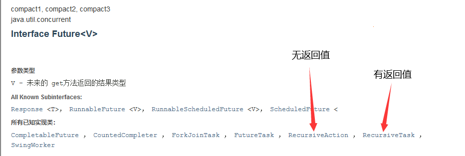

## 线程与进程

### 什么是 JUC

jdk 中三个包

- java.uti.concurrent
- java.util.concurrent.atomic（原子性）
- java.util.concurrent.locks（锁）
- java.util.funtion（函数）

Runnable：没有返回值，效率低于 Callable（）

Lock：Reentrantlock、ReentrantReadWriteLock...

### 线程和进程

- 进程：一个程序，程序的集合；一个进程往往包含多个线程，至少一个，Java 默认有两个线程（main、gc）
- 线程：如一个进程 typora.exe，同时包含写字和自动保存的两个功能（线程）

问：Java 真的能开启线程吗？

答：并不能，java 无法直接操作硬件，而是用本地方法调用底层的 c++ 实现线程开启

~~~java
public synchronized void start() {
        /**
         * This method is not invoked for the main method thread or "system"
         * group threads created/set up by the VM. Any new functionality added
         * to this method in the future may have to also be added to the VM.
         *
         * A zero status value corresponds to state "NEW".
         */
        if (threadStatus != 0)
            throw new IllegalThreadStateException();

        /* Notify the group that this thread is about to be started
         * so that it can be added to the group's list of threads
         * and the group's unstarted count can be decremented. */
        group.add(this);

        boolean started = false;
        try {
            start0();
            started = true;
        } finally {
            try {
                if (!started) {
                    group.threadStartFailed(this);
                }
            } catch (Throwable ignore) {
                /* do nothing. If start0 threw a Throwable then
                  it will be passed up the call stack */
            }
        }
    }
//native本地方法，调用的底层的C++，java无法直接操作硬件
private native void start0();
~~~

### 并发和并行

并发编程：并发、并行

1. 并发（多线程操作同一个资源）：CPU一核，模拟出来多条线程，快速交替
2. 并行（真正的同时运行）
   - CPU多核，多个线程同时执行
   - 提高效率：线程池

~~~java
public class Test {
    public static void main(String[] args) {
        //获取CPU的核数
        //CPU密集型、IO密集型
        System.out.println(Runtime.getRuntime().availableProcessors());
    }
}
~~~

并发编程的本质：充分利用CPU的资源

### 线程的六个状态

~~~java
public enum State {
        /**
         * new:线程新生
         * Thread state for a thread which has not yet started.
         */
        NEW,

        /**
         * runnable:运行
         * Thread state for a runnable thread.  A thread in the runnable
         * state is executing in the Java virtual machine but it may
         * be waiting for other resources from the operating system
         * such as processor.
         */
        RUNNABLE,

        /**
         * blocked:阻塞
         * Thread state for a thread blocked waiting for a monitor lock.
         * A thread in the blocked state is waiting for a monitor lock
         * to enter a synchronized block/method or
         * reenter a synchronized block/method after calling
         * {@link Object#wait() Object.wait}.
         */
        BLOCKED,

        /**
         * waiting:等待（一种阻塞），一直等待
         * Thread state for a waiting thread.
         * A thread is in the waiting state due to calling one of the
         * following methods:
         * <ul>
         *   <li>{@link Object#wait() Object.wait} with no timeout</li>
         *   <li>{@link #join() Thread.join} with no timeout</li>
         *   <li>{@link LockSupport#park() LockSupport.park}</li>
         * </ul>
         *
         * <p>A thread in the waiting state is waiting for another thread to
         * perform a particular action.
         *
         * For example, a thread that has called <tt>Object.wait()</tt>
         * on an object is waiting for another thread to call
         * <tt>Object.notify()</tt> or <tt>Object.notifyAll()</tt> on
         * that object. A thread that has called <tt>Thread.join()</tt>
         * is waiting for a specified thread to terminate.
         */
        WAITING,

        /**
         * timed_waiting:超时等待，在一个时间内等待，超时就不等了
         * Thread state for a waiting thread with a specified waiting time.
         * A thread is in the timed waiting state due to calling one of
         * the following methods with a specified positive waiting time:
         * <ul>
         *   <li>{@link #sleep Thread.sleep}</li>
         *   <li>{@link Object#wait(long) Object.wait} with timeout</li>
         *   <li>{@link #join(long) Thread.join} with timeout</li>
         *   <li>{@link LockSupport#parkNanos LockSupport.parkNanos}</li>
         *   <li>{@link LockSupport#parkUntil LockSupport.parkUntil}</li>
         * </ul>
         */
        TIMED_WAITING,

        /**
         * terminated:终止
         * Thread state for a terminated thread.
         * The thread has completed execution.
         */
        TERMINATED;
}
~~~

### wait 和 sleep 的区别

来自不同的类

- wait() 来自 Object
- sleep() 来自 Thread

```java
import java.util.concurrent.TimeUnit;//JUC包

public class Test {
    public static void main(String[] args) throws InterruptedException {
        TimeUnit.DAYS.sleep(1);
        TimeUnit.SECONDS.sleep(2);
    }
}
```

关于锁的释放

- wait 会释放锁
- sleep 睡着了，不会释放锁

使用的范围不同

- wait 必须在同步代码块中
- sleep 可以在任何地方睡

是否需要捕获异常（线程都会存在中断异常）

- wait 不需要捕获异常
- sleep 必须要捕获异常，会发生超时等待的情况

## Java Lock

### Synchronized 关键字

- OOP：Object Oriented Programming（面向对象程序设计，一种编程架构）
- 耦合性：降低耦合性，解耦

**函数式编程**

lambda 表达式：用于接口的函数重写实现，等同于实现一个匿名内部类

~~~java
public class SaleTickets1 {
    public static void main(String[] args) {
        Tickets1 t = new Tickets1();
        new Thread(()->{
            for (int i = 0; i < 30; i++) {
                t.sale();
            }
        }, "A").start();

        new Thread(()->{
            for (int i = 0; i < 30; i++) {
                t.sale();
            }
        }, "B").start();

        new Thread(()->{
            for (int i = 0; i < 30; i++) {
                t.sale();
            }
        }, "C").start();
    }
}


class Tickets1{
    private int num = 25;

    public synchronized void sale(){
        if(num>0){
            System.out.println(Thread.currentThread().getName()+"售出第"+num--+"张票，剩余："+num);
        }
    }
}
~~~

### Lock 接口


三个实现类

- ReentrantLock
- ReentrantReadWriteLock.ReadLock
- ReentrantReadWriteLock.WriteLock

公平锁和非公平锁

- 公平锁：十分公平，必须先到先得
- 非公平锁：可以插队（默认构造）

~~~java
import java.util.concurrent.locks.Lock;
import java.util.concurrent.locks.ReentrantLock;

public class SaleTickets2 {
    public static void main(String[] args) {
        Tickets2 t = new Tickets2();
        //并发，多线程操作同一个资源类，把资源类丢入线程
        //lambda表达式
        new Thread(()->{for(int i = 0; i < 20; i++) t.sale();}, "A").start();
        new Thread(()->{for(int i = 0; i < 20; i++) t.sale();}, "B").start();
        new Thread(()->{for(int i = 0; i < 20; i++) t.sale();}, "C").start();
    }
}

class Tickets2 {
    private int num = 30;

    private Lock l = new ReentrantLock(true);

    // lock三部曲
    // new ReentrantLock
    // lock.lock() 加锁
    // finally => lock.unlock() 解锁
    public void sale(){
        l.lock();
        try{
            if(num>0){
                System.out.println(Thread.currentThread().getName()+"售出第"+num--+"票，剩余"+num);
            }
        }catch (Exception e){
            e.printStackTrace();
        }finally {
            l.unlock();
        }
    }
}
~~~

Synchronized 和 Lock 的区别（自动挡和手动挡）

- Synchronized 是一个内置的 java 关键字，Lock 是一个 java 类
- Synchronized 无法判断获取锁的状态，Lock 可以判断是否获取到了锁
- Synchronized 会自动释放锁，Lock 必须要手动释放锁。否则会**死锁**
- Synchronized 线程1（获得锁、阻塞）、线程2（会一直等待），而 Lock 不一定会一直等
- Synchronized 为不可重入锁，不可以中断，非公平；Lock 为可重入锁，可以判断锁，默认非公平但可设置
- Synchronized 适合锁少量的代码同步问题，Lock 锁适合锁大量的同步代码（Lock 锁的灵活度特别高）

可重入锁：可以多次**获取**同一个锁而不发生死锁的锁，如一个 lock 锁可以多次调用 lock() 函数而正常运行，即获取锁这一操作并不会引发异常

为什么说在高并发情况下，Synchronized 会引起性能问题？太悲观了（会一直等），细粒度太低了，不够灵活

## 线程安全的集合

正常的 Collection 集合（非线程安全的集合）


初识函数式接口

~~~java
public class ListTest {
    public static void main(String[] args) {
        List<String> list = Arrays.asList("1", "2", "3");
        list.forEach(s->{System.out.print(s + " ");});
    }
}
~~~

### 顺序表

> 顺序表或链表

写入时复制（Copy on Write），计算机程序设计领域的一种优化策略

以下代码将报错 java.util.ConcurrentModificationException 并发修改异常

~~~java
import java.util.ArrayList;
import java.util.Arrays;
import java.util.List;
import java.util.UUID;

public class ListTest {
    public static void main(String[] args) {
        List<String> l = new ArrayList<>();
        for (int i = 0; i < 10; i++) {
            new Thread(()->{
                l.add(UUID.randomUUID().toString().substring(0, 5));
                System.out.println(l);
            }, String.valueOf(i)).start();
        }
    }
}
~~~

解决方案

1️⃣ Vector

~~~java
List<String> list = new Vector<>();
~~~

2️⃣ Collections.synchronizedList

~~~java
List<String> l = Collections.synchronizedList(new ArrayList());
~~~

3️⃣ CopyOnWriteArrayList

~~~java
List<String> l = new CopyOnWriteArrayList<>();
~~~

与 ArrayList 相同，在 CopyOnWriteArrayList 内部同样维护了一个数组，不同的是该数组有 transient/volatile 修饰

~~~java
private transient volatile Object[] array;
~~~

其 add 方法采取写入时复制的方式，即将原数组复制一份（长度+1），再插入新元素，线程安全性由 **lock** 锁保证

与 Vector 不同，CopyOnWriteArrayList 中并无 synchronized 修饰，故其效率较高

~~~java
public boolean add(E e) {
    final ReentrantLock lock = this.lock;
    lock.lock();
    try {
        Object[] elements = getArray();
        int len = elements.length;
        Object[] newElements = Arrays.copyOf(elements, len + 1);
        newElements[len] = e;
        setArray(newElements);
        return true;
    } finally {
        lock.unlock();
    }
}
~~~

在写入时避免覆盖造成数据问题：读写分离

### Set 和 Map

Iterable → Collection → List + Set + BlockingQueue（阻塞队列）

与 List 同理可得 Set 同样线程不安全，将报错 java.util.ConcurrentModificationException

~~~java
import java.util.HashSet;
import java.util.Set;
import java.util.UUID;

public class SetTest {
    public static void main(String[] args) {
        Set<String> set = new HashSet<>();
        for(int i = 0; i < 10; i++){
            new Thread(()->{
                set.add(UUID.randomUUID().toString().substring(0, 5));
                System.out.println(Thread.currentThread().getName() + set);
            }, String.valueOf(i)).start();
        }
    }
}
~~~

解决方案

1️⃣ Collections.synchronizedSet

~~~java
Set<String> set = Collections.synchronizedSet(new HashSet<>());
~~~

2️⃣ CopyOnWriteArraySet

~~~java
Set<String> set = new CopyOnWriteArraySet<>();
~~~

HashSet 的底层：HashMap

~~~java
public HashSet() {
    map = new HashMap<>();
}

//CopyOnWriteArraySet维护的map由transient修饰
private transient HashMap<E,Object> map;

public boolean add(E e) {
    return map.put(e, PRESENT)==null;
}

//PRESENT是一个不变的值
private static final Object PRESENT = new Object();
~~~

Map：哈希表（散列表），**拉链法**解决冲突

- 默认初始容量：16
- 默认加载因子：0.75

HashMap 和 LinkedHashMap 的区别：多了一个双向链表指代前驱后继关系


并发的解决方案

1️⃣ Collections.synchronizedMap

~~~java
Map<String, String> map = Collections.synchronizedMap(new HashMap<>());
~~~

2️⃣ ConcurrentHashMap

~~~java
Map<String, String> map = new ConcurrentHashMap<>();
~~~

其底层数据多由 transient/volatile 修饰，方法关键步骤由 synchronized 修饰，以保证读和写均为原子操作，即读时不能写，写时不能读

## 帮助线程安全的辅助类

### CountDwonLatch

> 减法器，Latch（门栓）

用于倒计时，count 为倒计的数量

构造方法

~~~java
CountDownLatch(int count);
~~~

倒数，令 count 减一

~~~java
countDown()
~~~

等待方法，阻塞，当 count 为 0 时唤醒，不等了

~~~java
await();
~~~

测试代码，需注意的是，我开启了一条线程输出 “All Out”，它将在 count = 0 时才会被执行，即等待计数结束

~~~java
import java.util.concurrent.CountDownLatch;

public class CountDownLatchTest {
    public static void main(String[] args) {
        CountDownLatch c = new CountDownLatch(10);

        new Thread(()->{
            try {
                c.await();
            } catch (InterruptedException e) {
                e.printStackTrace();
            }finally {
                System.out.println("All Out");
            }
        }).start();

        for (int i = 0; i < 10; i++) {
            new Thread(()->{
                System.out.println(Thread.currentThread().getName() + " Go Out");
                c.countDown();
            }, String.valueOf(i+1)).start();
        }
    }
}
~~~

结果输出

~~~java
1 Go Out
3 Go Out
2 Go Out
6 Go Out
8 Go Out
9 Go Out
7 Go Out
5 Go Out
4 Go Out
10 Go Out
All Out

Process finished with exit code 0
~~~

### CycilcBarrier

与 CountDwonLatch 对应，这是一个加法器，当达到预定的 parties 时 await() 结束，触发 lambda 函数

构造方法

- parties 为所经历的线程最大数
- lambda 表达式中为当经历线程数达到 parties 时执行的语句

~~~java
CyclicBarrier(int parties, Lambda表达式)
~~~

计数、等待方法：在线程中执行 await 时，parties+1，同时判断是否达到初始化时的最大值，达到则执行构造方法中的 λ 表达式

~~~java
await();
~~~

测试代码

~~~java
import java.util.concurrent.BrokenBarrierException;
import java.util.concurrent.CyclicBarrier;

public class CyclicBarrierTest {
    public static void main(String[] args) {
        CyclicBarrier c = new CyclicBarrier(7, ()->{
            System.out.println("集齐七颗龙珠，召唤神龙");
        });

        for (int i = 0; i < 7; i++) {
            final int temp = i+1;
            new Thread(()->{
                System.out.println("收集到第" + temp + "颗龙珠");
                try {
                    c.await();
                } catch (InterruptedException e) {
                    e.printStackTrace();
                } catch (BrokenBarrierException e) {
                    e.printStackTrace();
                }
            }, String.valueOf(i+1)).start();
        }
    }
}
~~~

结果输出

~~~java
收集到第1颗龙珠
收集到第7颗龙珠
收集到第4颗龙珠
收集到第3颗龙珠
收集到第5颗龙珠
收集到第2颗龙珠
收集到第6颗龙珠
集齐七颗龙珠，召唤神龙

Process finished with exit code 0
~~~

当计数达到 7 时，await() 结束，不等了，触发 CyclicBarrier 构造时传入的匿名函数

### Semaphore

信号量，可加可减

- acquire()：获得，如果信号量满了，等待，直到被释放为止
- release()：释放，会将信号量释放+1，然后唤醒等待的线程

```java
import java.util.concurrent.Semaphore;
import java.util.concurrent.TimeUnit;

public class SemaphoreTest {
    public static void main(String[] args) {
        //初始化线程数量（停车位）
        Semaphore semaphore = new Semaphore(4);

        for (int i = 0; i < 7; i++) {
            new Thread(()->{
                try {
                    //acquire()：获得许可，阻塞，判断当前是否有闲置的许可
                    semaphore.acquire();
                    System.out.println(Thread.currentThread().getName() + " 停车");
                    TimeUnit.SECONDS.sleep(2);
                } catch (InterruptedException e) {
                    e.printStackTrace();
                } finally {
                    System.out.println(Thread.currentThread().getName() + " 离开车位");
                    //释放许可
                    semaphore.release();
                }
            }, String.valueOf(i+1)).start();
        }
    }
}
```

作用

1. 多个共享资源互斥的使用（如停车位）
2. 并发限流，控制最大的线程数

### ReadWriteLock

> 读写锁

读写锁的目的

- 读可以被多个线程读，写只能由单线程写
- 写的时候不能读，读的时候不能写

与 Lock 锁的用法类似，进入方法时加锁，将业务代码放在 try / catch 语句中，在 finally 中解锁

注意读写锁并没有 Condition，它自身在加锁解锁的过程中完成了 Condition 的精确控制，提高了锁细粒度

~~~java
import java.util.HashMap;
import java.util.Map;
import java.util.UUID;
import java.util.concurrent.ConcurrentHashMap;
import java.util.concurrent.locks.*;

public class ReadWriteLockTest {
    public static void main(String[] args) {
        MyCacheLock myCache = new MyCacheLock();

        for (int i = 0; i < 10; i++) {
            final int temp = i;
            new Thread(()->{
                myCache.put(temp, UUID.randomUUID().toString().substring(0, 3));
            }, String.valueOf(i)).start();
        }

        for (int i = 0; i < 10; i++) {
            final int temp = i;
            new Thread(()->{
                myCache.get(temp);
            }, String.valueOf(i)).start();
        }
    }
}

class MyCacheLock{

    private volatile Map<Integer, String> map = new HashMap<>();

    //读写锁，更加细粒度的控制
    private ReadWriteLock readWriteLock = new ReentrantReadWriteLock();

    //写
    public void put(Integer key, String val){
        readWriteLock.writeLock().lock();
        try{
            System.out.println(Thread.currentThread().getName() + "正在写入");
            map.put(key, val);
            System.out.println(Thread.currentThread().getName() + "写入完毕");
        }catch (Exception e){
            e.printStackTrace();
        }finally {
            readWriteLock.writeLock().unlock();
        }
    }
    //读
    public void get(Integer key){
        readWriteLock.readLock().lock();
        try{
            System.out.println(Thread.currentThread().getName() + "正在读取");
            map.get(key);
            System.out.println(Thread.currentThread().getName() + "读取完毕");
        }catch (Exception e){
            e.printStackTrace();
        }finally {
            readWriteLock.readLock().unlock();
        }
    }
}


class MyCache{
    private Map<String, String> map = new HashMap<>();

    public void put(String key, String val){
        System.out.println(Thread.currentThread().getName() + "正在写入");
        map.put(key, val);
        System.out.println(Thread.currentThread().getName() + "写入完毕");
    }

    public void get(String key){
        System.out.println(Thread.currentThread().getName() + "正在读取");
        map.get(key);
        System.out.println(Thread.currentThread().getName() + "读取完毕");
    }
}
~~~

用 MyCache 跑多线程时，会出现多个线程同时“正在写入”的情况，这样很明显很不安全，加锁后解决这一问题，即同时只会有单条线程进行“写”的操作

我的代码和 kuangshen 一模吊样，但就是先读后写，我很烦，感觉是随机事件，哪个线程先跑的问题

## Callable 抽象类

Callable 和 Runnable 的区别

- Callable 有返回值
- Callable 可以抛出异常
- 方法不同，run() → call()

Thread 只能 start 继承了 Runnable（重写了run方法） 的类，怎么用 Thread 去跑继承了 Callable 的类呢？

阅读 jdk 文档可以发现 Runnable 有一个实现类：FutureTask


它既是 Runnable 的实现类，又可以由 Callable 进行构造，如此便实现了 Callable 和 Thread 的连接

~~~java
import java.util.concurrent.Callable;
import java.util.concurrent.FutureTask;

public class CallableTest {
    public static void main(String[] args) {
        new Thread(new FutureTask<>(new MyThread())).start();
        System.out.println();
    }
}

class MyThread implements Callable<String>{
    @Override
    public String call() throws Exception {
        System.out.println("wdnmd");
        return "Hello Callable";
    }
}
~~~

如何获取 Callable 的返回值？

~~~java
MyThread mythread = new MyThread();
FutureTask<String> futuretask = new FutureTask<>(t);
new Thread(futuretask).start();
String res = futuretask.get();
~~~

注意

- FutureTask 的 get 方法是阻塞的，也就是说，只有 call() 方法跑完之后，才会 get 到值，若 get 在 start 前，则程序死锁
- call() 方法是有缓存的，开两条线程跑同一个 call 函数，只会有一个结果，如上述代码若开两条线程只会输出一句 wdnmd

## 流式计算和分治

### Stream 流

什么是 Stream 流式计算

- 大数据：存储 + 计算
- 存储：集合框架、MySQL（本质就是存储东西的）
- 计算：流（计算都交给流来操作）

已知有 Person 类，用一行代码完成下列筛选操作

1. ID 为偶数
2. 年龄大于等于 23
3. 名字转换为大写字母
4. 倒序输出
5. 只输出一个用户

Person 类

~~~java
@Data
public class Person {
    private int id;
    private String name;
    private int age;
}
~~~

lambda 表达式 + 链式编程 + 函数式接口 + stream 计算

~~~java
public class StreamTest {
    public static void main(String[] args) {
        Person p1 = new Person(1, "a", 23);
        Person p2 = new Person(2, "b", 27);
        Person p3 = new Person(3, "c", 17);
        Person p4 = new Person(4, "d", 41);
        Person p5 = new Person(5, "e", 25);

        List<Person> list = Arrays.asList(p1, p2, p3, p4, p5);
        list.stream()
                .filter((u)-> {return u.getAge()>=23;})
                .filter((u)-> {return u.getId()%2==0;})
                .map((u)-> {return u.getName().toUpperCase();})
                .sorted((u1, u2)->{return u2.compareTo(u1);})
                .limit(1)
                .forEach((u)->{System.out.println(u);});
    }
}
~~~

### Fork / Join

> 分支 / 合并

再 jdk1.7 中出现，并发执行任务，在大数据量时提高效率

- 大数据：Map Reduce（把大任务拆分为小任务，再把小任务结果合并，即递归）

Fork/Join特点：工作窃取

- 维护的都是双端队列，当 B 线程结束后而 A 线程未结束，B 将窃取 A 的工作，从后向前执行


具体实现

1️⃣ 将运算类继承 RecursiveAction 或 RecursiveTask，重写 computer 方法（注意泛型：此处泛型类型规定了 compute 方法的返回值）

~~~java
public class ForkJoinTest extends RecursiveTask<Long> {

    private long start;
    private long end;

    private long temp = 10000L;

    public ForkJoinTest(long start, long end) {
        this.start = start;
        this.end = end;
    }

    //重写computer
    @Override
    protected Long compute() {
        if(end-start<temp){
            long sum = 0L;
            for (long i = start; i <= end; i++) {
                sum += i;
            }
            return sum;
        }else{
            long middle = (start+end)/2;
            ForkJoinTest task1 = new ForkJoinTest(start, middle);
            task1.fork();
            ForkJoinTest task2 = new ForkJoinTest(middle+1, end);
            task2.fork();
            return task1.join()+task2.join();
        }
    }
}
~~~

2️⃣ 开辟一个 ForkJoinPool，用池中的 submit 方法或 execute 方法执行 Task

~~~java
public void test2() throws ExecutionException, InterruptedException {
    long start = System.currentTimeMillis();

    //创建ForkJoin池
    ForkJoinPool pool = new ForkJoinPool();

    //创建任务
    ForkJoinTask<Long> task = new ForkJoinTest(0, 10_0000_0000);

    //此处 submit.get() 和 execute(task) 后的 task.get() 所得其实是一样的
    //执行任务
    ForkJoinTask<Long> submit = pool.submit(task);
    pool.execute(task);
    submit.get();
    long end = System.currentTimeMillis();

    //关闭池
    pool.shutdown();

    //获取结果
    System.out.println("和:" + task.get() + " 时间:" + (end-start));
}
~~~

如此大大提高了运算效率，比用普通的 for 循环逐个加约快 130 倍

阅读源码还可知 ForkJoinPool.execute() 还可以执行 Runnable task，即实现了 Runnable 接口的任务，重写 run 方法，同理还可以扩展至 Callable 接口，通过 FutureTask 将 Callable 和 Runnable 连接，放在 execute 中执行

~~~java
public void execute(Runnable task) {
    if (task == null)
        throw new NullPointerException();
    ForkJoinTask<?> job;
    if (task instanceof ForkJoinTask<?>) // avoid re-wrap
        job = (ForkJoinTask<?>) task;
    else
        job = new ForkJoinTask.RunnableExecuteAction(task);
    externalPush(job);
}
~~~

3️⃣ 流式求和

~~~java
public void test3(){
    long start = System.currentTimeMillis();
    long sum = LongStream.rangeClosed(0, 10_0000_0000).parallel().reduce(0, Long::sum);
    long end = System.currentTimeMillis();
    System.out.println("和:" + sum + " 时间:" + (end-start));
}
~~~

## Future 异步回调

> Future设计的初衷：对将来的某个事件的结果进行建模

异步和同步的区别，类似普通方法和同步方法的区别



继承关系：Future → CompletableFuture

~~~java
import java.util.concurrent.CompletableFuture;
import java.util.concurrent.ExecutionException;
import java.util.concurrent.Future;

public class Demo01 {
    public static void main(String[] args) throws ExecutionException, InterruptedException {

        //无返回值的异步回调：runAsync
        /*CompletableFuture<Void> completableFuture = CompletableFuture.runAsync(()->{
            System.out.println("异步回调");
        });
        System.out.println("111111111");
        completableFuture.get();*/

        //有返回值的异步回调：supplyAsync
        CompletableFuture<String> completableFuture = CompletableFuture.supplyAsync(()->{
            System.out.println("哈哈哈");
            //int i = 9/0;
            return "异步回调";
        });

        // t:当正确执行时返回返回值，报错时返回null
        // u:当错误时返回错误信息，正确时返回null
        //exceptionally(e):e为异常，注意需要在该函数接口中重新返回一个值代替错误执行的返回值
        System.out.println(completableFuture.whenComplete((t, u) -> {
            System.out.println("t:" + t);
            System.out.println("u:" + u);
        }).exceptionally((e) -> {
            System.out.println("Message:" + e.getMessage());
            return "错误了啊";
        }).get());
    }
}
~~~

为什么代码这么奇怪？supplyAsync 和 runAsync 是 CompletableFuture 的静态方法，返回一个 CompletableFuture 对象

常用方法

| 方法          | supplyAsync                          | runAsync                           |
| ------------- | ------------------------------------ | ---------------------------------- |
| get           | 执行supplier并获取返回值             | 执行runnable                       |
| exceptionally | 捕捉异常并返回错误回调               | 捕捉异常并作出反应                 |
| whenComplete  | 返回（T, U），T为返回值，U为错误信息 | 返回（T, U），T为null，U为错误信息 |

注意 get / exceptionally / whenComplete 方法阻塞但异步，不影响其他线程

异步回调

1. 成功回调：当 CompletableFuture 正常跑 runAsync 或 supplyAsync 后，成功返回结果，称作成功回调
2. 错误回调：当跑 runAsync 或 supplyAsync 时发生错误，我们用 exceptionally 捕捉异常并作出反应，在 supplyAsync 中可返回错误回调


