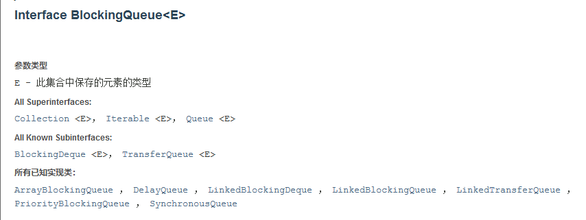
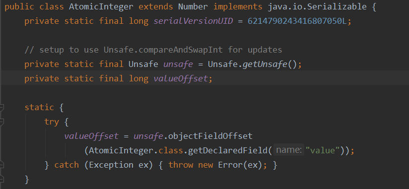
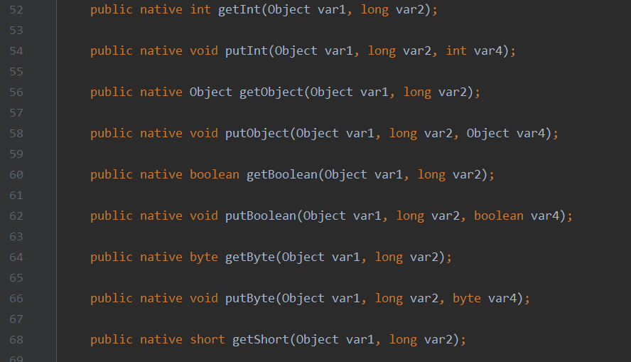
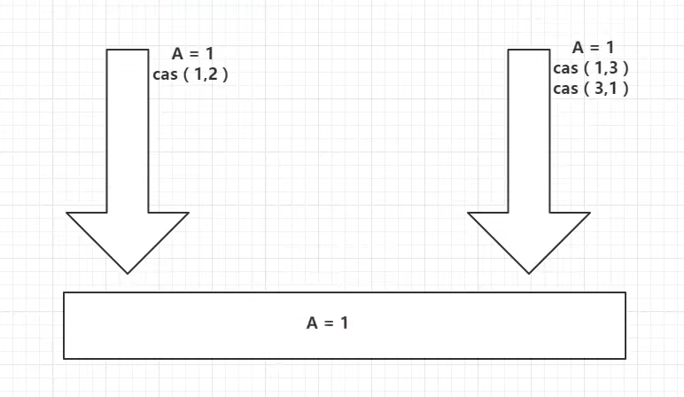
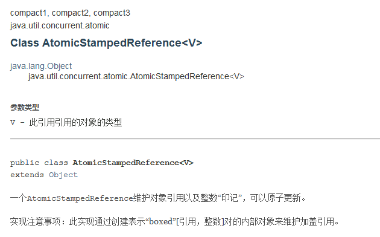
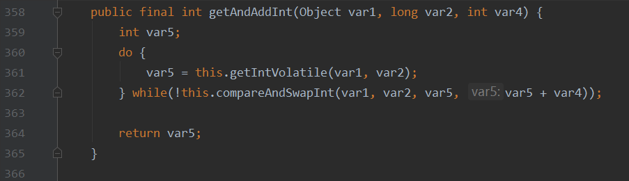

## 函数式接口

> 新的编程风格：lambda 表达式、链式编程、函数式接口、Stream 流式计算
>

函数式接口：只有一个方法的接口，比如 Runnable / Callable

~~~java
@FunctionalInterface
public interface Runnable {
    public abstract void run();
}

//新版java中有很多很多FunctionalInterface
//简化编程模型，再新版本的框架底层大量应用
//forEach(消费者类的函数式接口)
~~~

### Function 函数型

~~~java
@FunctionalInterface
public interface Function<T, R> {

    /**
     * Applies this function to the given argument.
     *
     * @param t the function argument
     * @return the function result
     */
    R apply(T t);
}
~~~

有一个传入参数，有一个返回值（均为泛型，默认Object），仅含一个方法：apply (Object o, Object b)

~~~java
import java.util.function.Function;

public class FunctionTest {
    public static void main(String[] args) {
        /**用匿名内部类重写apply函数
         * Function<String, String> f = new Function<String, String>() {
         *         @Override
         *         public String apply(String str) {
         *             return str;
         *         }
         *     };
        */
        //用lambda表达式简化
        Function<String, String> function = (str)->{return str;};
        System.out.println(function.apply("daslkfj"));
    }
}
~~~

### Predicate 断定型

~~~java
@FunctionalInterface
public interface Predicate<T> {

    /**
     * Evaluates this predicate on the given argument.
     *
     * @param t the input argument
     * @return {@code true} if the input argument matches the predicate,
     * otherwise {@code false}
     */
    boolean test(T t);
}
~~~

传入一个参数（默认Object），返回一个布尔值，所含方法为 test

~~~java
import java.util.function.Predicate;

public class PredicateTest {
    public static void main(String[] args) {
        /**
         * Predicate p = new Predicate() {
         *     @Override
         *     public boolean test(Object o) {
         *         return o.toString().isEmpty();
         *     }
         * };
         */
        
        Predicate<String> predicate = (str)->{return str.isEmpty();};
        System.out.println(predicate.test("alksd"));
    }
}
~~~

### Consumer 消费型

~~~java
@FunctionalInterface
public interface Consumer<T> {

    /**
     * Performs this operation on the given argument.
     *
     * @param t the input argument
     */
    void accept(T t);
}
~~~

消费者只有输入，没有返回值（消费）

~~~java
import java.util.function.Consumer;

public class ConsumerTest {
    public static void main(String[] args) {
        Consumer<String> consumer = (str) -> {System.out.println(str);};
        consumer.accept("daskfj");
    }
}
~~~

### Supplier 供给型

~~~java
@FunctionalInterface
public interface Supplier<T> {

    /**
     * Gets a result.
     *
     * @return a result
     */
    T get();
}
~~~

供给者没有输入，只有返回值（供给）

~~~java
import java.util.concurrent.*;
import java.util.function.Supplier;

public class SupplierTest {
    public static void main(String[] args) {
        Supplier<String> supplier = ()->{return Thread.currentThread().getName();};
        ExecutorService executorService = new ThreadPoolExecutor(
                3,
                12,
                5,
                TimeUnit.SECONDS,
                new ArrayBlockingQueue(9),
                Executors.defaultThreadFactory(),
                new ThreadPoolExecutor.AbortPolicy()
        );
        for (int i = 0; i < 12; i++) {
            executorService.execute(()->{
                System.out.println(supplier.get());
            });
        }
        executorService.shutdown();
    }
}
~~~

## Java 线程池

> 池化技术，三大方法七大参数

程序的运行的本质：占用系统的资源 —> 优化资源的使用 —> 池化技术

- 一些池子：线程池、连接池、内存池、对象池、简历池......

池化技术：事先准备好一些资源，需要使用则从池中取，用完后还回，比如小整数的存储

线程池的优点

- 降低资源的消耗
- 提高响应的速度
- 方便管理
- 线程复用、可以控制最大并发

### 阻塞队列

什么是阻塞队列

- 阻塞：写入队列已满、读取队列为空时，不得不阻塞等待
- 队列：FIFO（I => 写入，O => 读取），先进先出

什么情况我们会用阻塞队列？ 多线程，线程池



#### ArrayBlockingQueue

阻塞队列的使用：添加、移除、查找

四组 API

| 方式         | 抛出异常  | 有返回值，不抛出异常 | 阻塞等待（一直阻塞） | 等待超时   |
| ------------ | --------- | -------------------- | -------------------- | ---------- |
| 添加         | add()     | offer()              | put()                | offer(...) |
| 移除         | remove()  | poll()               | take()               | poll(..)   |
| 返回队首元素 | element() | peek()               | -                    | -          |

代码示例

~~~java
/**
* 抛出异常
*/
public void test1(){
    BlockingQueue<String> blockingQueue = new ArrayBlockingQueue<>(3);

    //返回 boolean，添加成功则返回 true
    System.out.println(blockingQueue.add("a")
    System.out.println(blockingQueue.add("b"));
    System.out.println(blockingQueue.add("c"));

    //当队列已满，继续 add()，将报错 java.lang.IllegalStateException: Queue full
    //System.out.println(blockingQueue.add("d"));

    for (int i = 0; i < 3; i++) { 
        //element 仅返回队首元素
        System.out.println(blockingQueue.element());
        //remove 同样返回队首元素，同时移除
        blockingQueue.remove();
    }
	//当队列已空，继续 remove，将报错 java.util.NoSuchElementException
    //System.out.println(blockingQueue.remove());
}
/**
* 不抛出异常，有返回值
*/
public void test2(){
    BlockingQueue<String> blockingQueue = new ArrayBlockingQueue<>(3);
    System.out.println(blockingQueue.offer("a"));
    System.out.println(blockingQueue.offer("b"));
    System.out.println(blockingQueue.offer("c"));

    //当队列已满，继续 offer，将不成功，并且返回 false，不抛出异常
    System.out.println(blockingQueue.offer("d"));

    for (int i = 0; i < 3; i++) {
        System.out.println(blockingQueue.peek());
        blockingQueue.poll();
    }
    //当队列已空，继续 poll，将得到 null，不抛出异常
    System.out.println(blockingQueue.poll());
}
                       
/**
* 等待，阻塞
*/
public void test3() throws InterruptedException {
    BlockingQueue<String> blockingQueue = new ArrayBlockingQueue<>(3);
    blockingQueue.put("a");
    blockingQueue.put("b");
    blockingQueue.put("c");

    //此时队列已满，若继续向里put，将一直阻塞，直到队列中有空余位置
    //blockingQueue.put("d");

    for (int i = 0; i < 3; i++) {
        System.out.println(blockingQueue.take());
    }
    //此时队列已空，若继续take，同样会一直阻塞，直到队列中由元素了被唤醒执行
    //System.out.println(blockingQueue.take());
}                     
                       
/**
* 超时等待
* long timeLimit：超时等待时间 
* TimeUnit timeunit：时间单位
*/
public void test4() throws InterruptedException {
    BlockingQueue<String> blockingQueue = new ArrayBlockingQueue<>(3);
    System.out.println(blockingQueue.offer("a"));
    System.out.println(blockingQueue.offer("b"));
    System.out.println(blockingQueue.offer("c"));

    //超时等待 2 秒，超出 2 秒返回false，不继续等待
    System.out.println(blockingQueue.offer("d", 2, TimeUnit.SECONDS));

    for (int i = 0; i < 3; i++) {
        System.out.println(blockingQueue.poll());
    }
    //同理等待 2 秒，超出 2 秒则返回null
    System.out.println(blockingQueue.poll(2, TimeUnit.SECONDS));
}
~~~

#### SynchronousQueue

同步队列：没有容量，进去一个元素，必须等待取出来以后，才可以继续往里放一个元素（有点像信号量）

- put()
- take()

~~~java
/**
 * 同步队列
 */
public class SynchronizedQueueTest {
    public static void main(String[] args) {
        BlockingQueue<String> blockingQueue = new SynchronousQueue<>();
        new Thread(()->{
            try {
                System.out.println(Thread.currentThread().getName()+" put 1");
                blockingQueue.put("1");
                System.out.println(Thread.currentThread().getName()+" put 2");
                blockingQueue.put("2");
                System.out.println(Thread.currentThread().getName()+" put 3");
                blockingQueue.put("3");
            } catch (InterruptedException e) {
                e.printStackTrace();
            }
        }, "T1").start();

        new Thread(()->{
            try{
                TimeUnit.SECONDS.sleep(1);
                System.out.println(Thread.currentThread().getName()+" take "+blockingQueue.take());
                TimeUnit.SECONDS.sleep(1);
                System.out.println(Thread.currentThread().getName()+" take "+blockingQueue.take());
                TimeUnit.SECONDS.sleep(1);
                System.out.println(Thread.currentThread().getName()+" take "+blockingQueue.take());
            }catch (InterruptedException e){
                e.printStackTrace();
            }
        }, "T2").start();
    }
}
~~~

结果：

~~~java
T1 put 1
T2 take 1
T1 put 2
T2 take 2
T1 put 3
T2 take 3

Process finished with exit code 0
~~~

### 三大方法

单例线程池

~~~java
ExecutorService threadPool = Executors.newSingleThreadExecutor();
~~~

自定义最大线程池

~~~java
ExecutorService threadPool = Executors.newFixedThreadPool(5);
~~~

自适应线程池

~~~java
ExecutorService threadPool = Executors.newCachedThreadPool();
~~~

测试代码：在业务跑完后一定要 shutdown() 关闭线程池，否则会一直阻塞

~~~java
import java.util.concurrent.ExecutorService;
import java.util.concurrent.Executors;

public class Test1 {
    public static void main(String[] args) {
        //ExecutorService threadPool = Executors.newSingleThreadExecutor();
        //ExecutorService threadPool = Executors.newFixedThreadPool(5);
        ExecutorService threadPool = Executors.newCachedThreadPool();

        try{
            for (int i = 0; i < 100; i++) {
                threadPool.execute(()->{
                    System.out.println(Thread.currentThread().getName() + " ok");
                });
            }
        }catch (Exception e){
            e.printStackTrace();
        }finally {
            threadPool.shutdown();
        }
    }
}
~~~

### 七大参数

通过源码可以发现，三大方法中底层返回的都与一个 ThreadPoolExecutor 方法有关，即线程池的构造方法

~~~java
public static ExecutorService newSingleThreadExecutor() {
        return new FinalizableDelegatedExecutorService
            (new ThreadPoolExecutor(1, 1,
                                    0L, TimeUnit.MILLISECONDS,
                                    new LinkedBlockingQueue<Runnable>()));
}

public static ExecutorService newFixedThreadPool(int nThreads) {
        return new ThreadPoolExecutor(nThreads, nThreads,
                                      0L, TimeUnit.MILLISECONDS,
                                      new LinkedBlockingQueue<Runnable>());
}

public static ExecutorService newCachedThreadPool() {
        return new ThreadPoolExecutor(0, Integer.MAX_VALUE,	//约为21亿 ——> oom(out of memory)
                                      60L, TimeUnit.SECONDS,
                                      new SynchronousQueue<Runnable>());
}
~~~

ThreadPoolExcutor 构造方法

~~~java
public ThreadPoolExecutor(int corePoolSize,	//核心线程数
                              int maximumPoolSize,	//最大线程数
                              long keepAliveTime,	//超时时间，超时未调用则还回线程
                              TimeUnit unit,	//超时时间单位
                              BlockingQueue<Runnable> workQueue,	//阻塞队列
                              ThreadFactory threadFactory,	//线程工厂，创建线程的，一般不动
                              RejectedExecutionHandler handler	//拒绝策略) {
        if (corePoolSize < 0 ||
            maximumPoolSize <= 0 ||
            maximumPoolSize < corePoolSize ||
            keepAliveTime < 0)
            throw new IllegalArgumentException();
        if (workQueue == null || threadFactory == null || handler == null)
            throw new NullPointerException();
        this.acc = System.getSecurityManager() == null ?
                null :
                AccessController.getContext();
        this.corePoolSize = corePoolSize;
        this.maximumPoolSize = maximumPoolSize;
        this.workQueue = workQueue;
        this.keepAliveTime = unit.toNanos(keepAliveTime);
        this.threadFactory = threadFactory;
        this.handler = handler;
}
~~~

### 自定义线程池

通过构造函数 ThreadPoolExecutor 自定义线程池

~~~java
//自定义线程池
ExecutorService threadPool = new ThreadPoolExecutor(
        2,	//核心线程数
        5,	//最大线程数
        2,	//超时等待时间
        TimeUnit.SECONDS,	//时间单位
        new ArrayBlockingQueue<>(3),	//阻塞队列（等候区）
        Executors.defaultThreadFactory(),	//默认线程工厂
        new ThreadPoolExecutor.DiscardOldestPolicy()	//拒绝策略
);
~~~

### 四种拒绝策略

哪四种捏

  1. new ThreadPoolExecutor.AbortPolicy()：当线程已满、队列已满，再进任务时，不执行该任务并且抛出移除
  2. new ThreadPoolExecutor.CallerRunsPolicy()：当满员时再进任务，将该任务打发回其发起的地方，如此处将多余的线程返回 main 线程执行
  3. new ThreadPoolExecutor.DiscardPolicy()：当满员时再进任务，不执行该任务且不抛出异常
  4. new ThreadPoolExecutor.DiscardOldestPolicy()：与(3)相似，但多出的任务将和线程池中最早的任务竞争一个线程，若竞争成功则执行，失败则不执行，

~~~java
import java.util.concurrent.*;
public class Test2 {
    public static void main(String[] args) {
        //自定义线程池
        ExecutorService threadPool = new ThreadPoolExecutor(
                2,
                5,
                2,
                TimeUnit.SECONDS,
                new ArrayBlockingQueue<>(3),
                Executors.defaultThreadFactory(),
                new ThreadPoolExecutor.DiscardOldestPolicy()
        );

        try{
            for (int i = 0; i < 9; i++) {
                threadPool.execute(()->{
                    System.out.println(Thread.currentThread().getName() + " ok");
                });
            }
        }catch (Exception e){
            e.printStackTrace();
        }finally {
            //关闭线程池
            threadPool.shutdown();
        }
    }
}
~~~

### 最大线程如何定义

CPU 密集型：CPU 有多少核，最大线程设置为多少

~~~java
ExecutorService threadPool = new ThreadPoolExecutor(
        2,
    	//获取CPU核数，最大利用CPU效率
        Runtime.getRuntime().availableProcessors(),
        2,
        TimeUnit.SECONDS,
        new ArrayBlockingQueue<>(3),
        Executors.defaultThreadFactory(),
        new ThreadPoolExecutor.DiscardOldestPolicy()
);
~~~

I/O 密集型：判断程序中十分耗 I/O 资源的线程数量，将最大线程数一般设置为两倍于 I/O 线程数

## 线程池应用实例

### 线程池回顾

在上一篇讲到过线程池的使用，我们可以通过三种构造函数构造一个线程池

单例线程池

~~~java
ExecutorService threadPool = Executors.newSingleThreadExecutor();
~~~

自定义最大线程池

~~~java
ExecutorService threadPool = Executors.newFixedThreadPool(5);
~~~

自适应线程池

~~~java
ExecutorService threadPool = Executors.newCachedThreadPool();
~~~

对于线程池`threadPool`，他有一个`submit()`函数，其入参为一个函数，例如

```java
threadPool.submit(()->{
    return Thread.currentThread().getName() + " run finished!";
});
```

他会返回一个`Future<T>`类，根据传入匿名函数的返回决定 T 的类型，此处就是一个 String，我们这样去接收

```java
Future<String> future = threadPool.submit(() - > return Thread.currentThread().getName() + " run finished!");
```

在 submit 后，这个任务就已经开始执行了，如何拿到返回呢？

```java
String res = future.get();
```

通过 get 函数拿到最终的返回，这个 get 函数对于主函数 Main 而言是阻塞的，但对于其余的多线程任务，是并行的

这意味着，即使我通过一个顺序的 for 循环调用 get 函数去取多个 future 的返回，future 之间并不产生影响，而只是一起对主线程进行阻塞

```java
for(Future<String> f: futures){
    f.get();
}
System.out.println("All finished!");
```

`All finished!`一定是在最后输出，但各个任务谁先结束无法确定，因为是并行的

### 密码系统实例

我现在有多个密码系统，需要对其加密、陷门、搜索三个函数的耗时进行测试，我编写了一个 test 函数，他将通过 List 依次返回加密、陷门、搜索的时间

```java
default List<Long> test(List<String> words, int sender, int receiver, int round) {
    throw new UnsupportedOperationException("test(List<String> words, int sender, int receiver, int round) is not supported");
}
```

由于数据量太大，我要同时测定三个密码系统的耗时，所以采用线程池的方式同时跑三个 test，并对他们的耗时进行统计输出

我的测试函数如下

```java
public static void executorServiceTest(List<CipherSystem> cipherSystems, List<String> words,
                                       int sender, int receiver, int round){

    ExecutorService executor = Executors.newFixedThreadPool(cipherSystems.size());
    List<Future<List<Long>>> futures = new ArrayList<>();
    // 提交任务
    for(CipherSystem cipherSystem: cipherSystems){
        futures.add(executor.submit(() -> cipherSystem.test(words, sender, receiver, round)));
    }

    // 获取结果
    try {
        // 这一步是阻塞的，不用 add 而用 set 是因为有可能先后次序不是我所希望的
        for(int i = 0; i < futures.size(); i++){
            Future<List<Long>> future = futures.get(i);
            times.set(i, future.get());
        }
        // 打印结果
        printTime();
    } catch (InterruptedException | ExecutionException e) {
        e.printStackTrace();
    } finally {
        // 关闭线程池
        executor.shutdown();
    }
}
```

`times`是一个`List<List<Long>>`的全局变量

Main 函数如下

```java
public static void main(String[] args) {

    int round = 1, sender = 10, receiver = 10;

    String file = "100.txt";
    List<String> words = FileUtil.readFileToList(file);

    CipherSystem scf = new SCF(G1, GT, Zr, bp, n);
    CipherSystem ap = new AP(G1, GT, Zr, bp, n, G2);
    CipherSystem pecks = new PECKS(G1, GT, Zr, bp, n);

    List<CipherSystem> cipherSystems = new ArrayList<>();
    cipherSystems.add(scf);
    cipherSystems.add(ap);
    cipherSystems.add(pecks);

    executorServiceTest(cipherSystems, words, sender, receiver, round);
}
```

`CipherSystem`实际上是一个抽象类，`SCF, AP, PECKS`是他的具体实现，感觉还算优雅

### 并发常用场景

[聊聊并发编程的12种业务场景_不同场景下的并发数-CSDN博客](https://blog.csdn.net/lisu061714112/article/details/124551078)

- 简单定时任务
- 监听器
- 收集日志
- excel 导入
- 查询结构
- 获取用户上下文
- 传递参数
- 模拟高并发
- 处理 mq 消息
- 统计数量
- 延迟定时任务

## 原子性和 CAS

### Volatile 关键字

> 请你谈谈对 Volatile 的理解：禁止指令重排，不保证原子性

Volatile 是 java 虚拟机提供的轻量级的同步机制

1. 保证可见性
2. 不保证原子性
3. 禁止指令重排

什么是JMM？可见性与其有什么关系

- JMM —> Java 内存模型（Java Memory Model），不存在的东西，概念、约定

关于JMM的一些同步的约定

1. 线程解锁前，必须把共享变量**立刻**刷回主存

   在线程工作时，实际上是将主存中的变量拷贝一份到线程的工作内存中（值传递），对那份拷贝的变量进行操作，线程解锁前，必须将这份变量刷新回主存，使数据更新

2. 线程加锁前，必须读取主存中的最新值到工作内存中

3. 加锁和解锁是同一把锁

关于线程、主内存、工作内存的八个操作

1. lock（锁定）：作用域主内存的变量，把一个变量表示为线程独占状态
2. unlock（解锁）：作用于主内存的变量，它把一个处于锁定状态的的变量释放出来，释放后的变量可以被其他线程锁定
3. read（读取）：作用于主内存变量，它把一个变量的值从主内存传输到线程的工作内粗那种
4. load（载入）：作用于工作内存的变量，它把read操作从主存中变量放入工作内存中
5. use（使用）：线程的执行引擎使用工作内存中的变量
6. assign（赋值）：它把执行引擎接受到的值重新赋给那个变量
7. store（存储）：它把工作内存中的一个变量传送到主存中
8. write（写入）：它把store操作从工作内存中得到的变量的值放入主存的变量中

JMM 对这八种指令的使用，制定了如下规则

- 不允许 read 和 load、store 和 write 操作之一单独出行，即 read 了必须 load ，store 了必须 write
- 不允许线程丢弃它最近的 assign 操作，即工作变量的数据改变了后必须告知主存
- 不允许一个线程将没有 assign 的数据从工作内存同步回主存
- 一个新变量必须从主存中诞生，不允许工作内存直接使用一个未被初始化的便改良，也就是说对变量实施 use、store 操作之前必须经过 load 和 assign 操作
- 一个变量同一时间只有一个线程能对其进行 lock，多次 lock 后，即重入锁后，必须执行相同次数的 unlcok 才能解锁
- 如果对同一变量进行 lock 操作，回清空所有工作内存中此变量的值，在执行引擎使用这个变量前，必须重新 load 或 assign 操作初始化变量的值
- 如果一个变量没有被 lock，就不同对其进行 unlock，也不能 unlock 一个被其他线程锁住的变量
- 对一个变量进行 unlock 操作之前，必须把此变量同步回主存

问题：当主存中变量更改后，线程的工作内存不可见这种改变，依旧在原来的基础上执行，这样可能会造成如下问题

~~~java
import java.util.concurrent.TimeUnit;

public class JMMTest {
    private static volatile int num = 0;

    public static void main(String[] args) {
        //main线程
        new Thread(()->{while(num==0){}}).start();

        try {
            TimeUnit.SECONDS.sleep(2);
            num = 1;
            System.out.println(num);
        } catch (InterruptedException e) {
            e.printStackTrace();
        }
    }
}
~~~

由于主线程睡眠 2 s，线程 T 读入 num 时，num == 0，即使在 main 线程中改变了 num 的值，线程 T 的工作内存中 num 仍为 0

线程 T 对主存的变化是**不可见的**

### 保证可见性

保证可见性：在上述代码中把 num 用 volatile 修饰后可解决线程对主存的**不可见性**问题

不保证原子性

- 什么是原子性？不可分割（ACID 原则）

线程A在执行任务的时候，是不能被打扰的，也不能被分割，即要么同时成功，要么同时失败

~~~java
public class VDemo01 {

    private static int num = 0;

    public static void add(){
        num++;
    }

    public static void main(String[] args) {
        for (int i = 0; i < 20; i++) {
            new Thread(()->{
                for (int j = 0; j < 1000; j++) {
                    add();
                }
            }).start();
        }

        while(Thread.activeCount()>2){
            Thread.yield();
        }

        System.out.println(num);
    }
}
~~~

预期结果为 20000，但实际结果总达不到 20000，由于有多个线程同时同步工作内存和主存同步的数据，造成两次 num++ 只有一次的效果，不满足原子性

对 num 加上 volatile 修饰，仍无济于事

解决方案

1、对 add 方法用 synchronized 修饰

~~~java
public static synchronized void add(){num++;)
~~~

2、用 lock 锁把 add 方法锁住

~~~java
private static Lock lock = new ReentrantLock();

public static void add(){
    lock.lock();
    try{
        num++;
    }catch (Exception e){
        System.out.println(e.getMessage());
    }finally {
        lock.unlock();
    }
}
~~~

3、使用原子类解决原子性问题

~~~java
import java.util.concurrent.atomic.AtomicInteger;

public class VDemo01 {

    private static volatile AtomicInteger num = new AtomicInteger(0);

    public static void add(){
        //调用了本地底层的CAS方法，保证原子性（在汇编中也仅有一步，保证原子性）
        num.getAndIncrement();
    }

    public static void main(String[] args) {
        for (int i = 0; i < 20; i++) {
            new Thread(()->{
                for (int j = 0; j < 1000; j++) {
                    add();
                }
            }).start();
        }

        while(Thread.activeCount()>2){
            Thread.yield();
        }

        System.out.println(num);
    }
}
~~~

### 原子类

原子类：Atomic

~~~java
public final int getAndIncrement() {
    return unsafe.getAndAddInt(this, valueOffset, 1);
}
~~~



原子类的底层都直接和操作系统挂钩，在内存中修改值！Unsafe类是一个很特殊的存在

### 禁止指令重排

什么是指令重排？我们写的程序，计算机并不是按照我们写的那样去执行的

源代码 ——> 编译器优化的重排 ——> 指令并行也可能会重排 ——> 内存系统也会重排 ——> 执行

~~~java
int x = 1; 	// 1
int y = 2;	// 2
x = x + 5;	// 3
y = x * x;	// 4

我们所期望的：1234
也可能是：2134、1324
不可能是：4123
~~~

我们假设 a、b、x、y 这四个值默认都是0

| 线程A | 线程B |
| ----- | ----- |
| x=a   | y=b   |
| b=1   | a=2   |

经过线程A、B，正常的结果：x=0，y=0

对于单个线程A或者B，这两条语句的先后顺序似乎并不影响，于是编译器做了这样的指令重排：

| 线程A | 线程B |
| ----- | ----- |
| b=1   | a=2   |
| x=a   | y=b   |

指令重排导致的诡异结果：x=2，y=1

volatile 利用底层的内存屏障可以避免指令重排

1. 保证特定的操作的执行顺序
2. 可以保证某些变量的内存可见性（利用这些特性volatile实现了可见性）

### 什么是 CAS

CAS：compare and swap（比较交换）

CAS 是一种基于锁的操作，而且是乐观锁。锁分为乐观锁和悲观锁。悲观锁是将资源锁住，等一个之前获得锁的线程释放锁之后，下一个线程才可以访问。而乐观锁采取了一种宽泛的态度，通过某种方式不加锁来处理资源，比如通过给记录加version来获取数据，**性能较悲观锁有很大的提高**

- 像 synchronized、Lock、ReadWriteLock 均为悲观锁


原子类就利用了 CAS 操作实现其原子性，但需要注意的是 Java 不能直接操作内存，但能直接操作 C++（navtive 方法），通过 C++ 来操作内存

- C++ 是 Java 的后门，Unsafe 类即是 C++ 提供的一扇后门

点开 Unsafe 类可以发现其方法都是些 native 方法



**compareAndSet**

~~~java
public class CASDemo {
    public static void main(String[] args) {
        //初始化 AtomicInteger
        AtomicInteger atomicInteger = new AtomicInteger(2021);
        //达到 expect 后 update 数值，即当atomicInteger为2021时更新其为2017，否则更新失败返回false
        System.out.println(atomicInteger.compareAndSet(2021, 2017));
        System.out.println(atomicInteger);
    }
}
~~~

~~~java
public final boolean compareAndSet(int expect, int update) {
    return unsafe.compareAndSwapInt(this, valueOffset, expect, update);
}
~~~

~~~java
public final native boolean compareAndSwapInt(Object var1, long var2, int var4, int var5);
~~~

getAndIncrement

~~~java
import java.util.concurrent.atomic.AtomicInteger;

public class CASDemo {
    public static void main(String[] args) {
        //初始化 AtomicInteger
        AtomicInteger atomicInteger = new AtomicInteger(2017);
        //加一
        atomicInteger.getAndIncrement();
        System.out.println(atomicInteger);
    }
}
~~~

~~~java
public final int getAndIncrement() {
    return unsafe.getAndAddInt(this, valueOffset, 1);
}
~~~

~~~java
// 在 AtomicInteger 的 getAndIncrement 方法中 ——> var1=AtomicInteger.class（地址），var2=AtomicInteger.get()（当前值），var4=1
public final int getAndAddInt(Object var1, long var2, int var4) {
    int var5;
    //自旋锁
    do {
        //获取当前值：从地址上读取
        var5 = this.getIntVolatile(var1, var2);
    }
    //与上类似，执行一个CAS(比较交换)函数：var1和var2确定当前值(地址+长度)，var5为其先记录的当前值，当二者相同时，将自身替换为var5+var4(1)
    while(!this.compareAndSwapInt(var1, var2, var5, var5 + var4));

    return var5;
}
~~~

缺点：

- 循环会耗时
- 一次性只能保证一个共享变量的原子性
- 会引起 ABA 问题

另外，CAS 会导致 ABA 问题（狸猫换太子）

在以下情形，线程一并不会知道变量 A = 1 已经被线程二动过了（有一个 1 —> 3 —> 1 的过程），只会继续执行它的 CAS 操作，这样是不对的，因为线程一想操作的是原始的 1，而不是经过两次迭代回来的 1



### 原子引用

在 JSava 中，为了解决上述问题，引入原子引用类`AtomicStampedReference<V>`，引入版本控制



该类用版本号的方式防止 ABA 问题，即每次 cas 操作后手动令版本号（stamp）加一，若线程中事先获得的版本号与当前类版本号不符，则无法实现 cas 操作

不符是指此处在线程 A 中事先记录的 stamp 与 atomicReference.getStamp() 不符，即版本号不符，无法进行 cas 操作



~~~java
import java.util.concurrent.TimeUnit;
import java.util.concurrent.atomic.AtomicStampedReference;

public class CASDemo02 {
    public static void main(String[] args) throws InterruptedException {
        AtomicStampedReference<Integer> atomicReference = new AtomicStampedReference<>(121, 0);

        new Thread(()->{
            int stamp = atomicReference.getStamp();
            try {
                TimeUnit.SECONDS.sleep(2);
            } catch (InterruptedException e) {
                e.printStackTrace();
            }
            System.out.println(atomicReference.compareAndSet(121, 1, stamp, atomicReference.getStamp() + 1));
        }, "A").start();

        new Thread(()->{
            System.out.println(atomicReference.compareAndSet(121, 95, atomicReference.getStamp(), atomicReference.getStamp() + 1));
            System.out.println(atomicReference.compareAndSet(95, 121, atomicReference.getStamp(), atomicReference.getStamp() + 1));
        }, "B").start();

        TimeUnit.SECONDS.sleep(3);
        System.out.println(atomicReference.getReference());
    }
}
~~~
