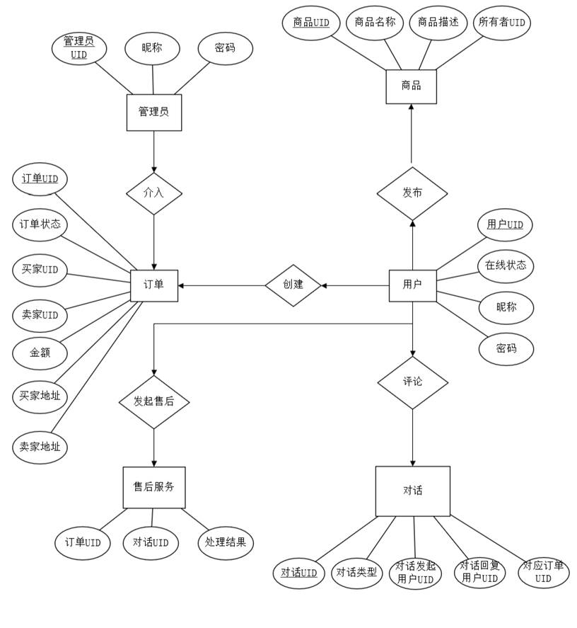

软工是一门文科课程 —— 一门管理学科

## 软工概述

### 软件生命周期活动

软件是一种知识（或逻辑）性工业产品，软件工程是一门工程性的学科，软件文档是文书和资料（文档：有关计算机程序功能、设计、编制、使用的文字或图形资料）

软件工程学科出现的直接原因是软件危机出现，软件危机主要包括以下方面

- 生产成本过高
- 需求增长难以满足
- 进度难以控制
- 质量难以保证

软件开发的四个阶段

- 规划阶段
- 分析阶段：制定软件项目开发计划，譬如可行性研究和需求分析
- 设计阶段：软件设计阶段，分为概要设计和详细设计
- 实施阶段：软件实现和维护

软件生命周期内的活动包括：问题定义、可行性分析、需求分析、概要设计、详细设计、编码及模块测试、综合测试、软件维护

软件工程和计算机科学的性质不同，软件工程着重于建造软件系统，从技术和管理两方面利用一套科学的技术和管理方法进行软件的开发，从而提高软件质量和生产率

### 软件生存周期模型

常见的软件生存周期模型：螺旋模型、增量模型、瀑布模型、迭代模型、原型模型

- 需求明确、时间不紧：瀑布模型
- 需求明确、时间紧：增量模型
- 需求不明确且时间紧：迭代模型

在任何模式的小周期内都采用瀑布模型

软件工程方法学的研究内容包含**软件开发技术和软件工程管理**两方面，以期达到的最终目标是**软件开发工程化**

软件的主要结构和功能是在分析设计阶段实现的

## 可行性研究

制定软件项目开发计划的目的是：对软件开发过程、进度、资源进行规划与调整

成本-效益分析的度量标准：货币的时间价值、投资回收期、纯收入

软件的可行性研究的三个方面：技术可行性、经济可行性、应用可行性（法律可行性、社会可行性、操作可行性）

- 其中从功能角度对系统进行研究属于技术可行性的研究
- 技术可行性要解决的是技术风险问题

可行性研究的目的不是解决问题，而是确定问题是否值得去解决

## 需求分析

### 需求分析概述

关于需求分析

- 需求分析必须在建立在可行性分析的基础上
- 需求分析阶段最重要的技术文档是：需求规格说明书
- 软件需求分析阶段建立原型的主要目的是：确定系统的功能和性能需求
- 软件开发的需求活动，主要任务是：定义各种需求并建立系统模型（原型）
- 需求分析阶段的研究对象是：用户要求
- 数据流图描述：系统的软件功能
- 软件需求阶段要解决的问题是：软件做什么

数据字典（就是数据结构）的条目

- 数据项
- 数据流
- 数据加工

举个数据字典的栗子

需求分析

- 要回答“软件必须做什么”
- 可以概括为“理解，分解，表达”六字
- 要求编写需求规格说明书

在数据流图中，有名字及方向的成分是：数据流

软件需求分析阶段的工作可分为以下四个方面

- 对问题的识别
- 分析与总和
- 制定需求规格说明以及需求分析评审

结构化分析方法使用的描述工具是：数据字典，它定义了数据流图中的每一个图形元素

需求规格说明书的作用包括

- 软件设计的依据
- 用户与开发人员对软件要做什么的共同理解
- 软件验收的依据
- 主要功能
- 用户界面及运行环境
- 软件的性能

软件需求规格说明书不应包括对算法的详细过程的描述和可行性研究的依据

### 结构化方法

> 分为结构化分析方法和结构化程序设计方法

在结构化分析方法中，数据流图和数据字典配合使用，共同构成系统的逻辑模型

通过功能分解可完成数据流图的细化（0 层到 1 层的细化）

数据存储和数据流都是数据，所处的状态不同

SA 结构化分析方法用 DFD 数据流图描述：系统的功能

SA 方法的分析步骤是首先调查了解当前系统的工作流程，然后

1. 获得当前系统的物理模型
2. 抽象出当前系统的逻辑模型
3. 建立目标系统的逻辑模型

SA 方法的基本思想是：自顶向下逐步求精

## 软件设计

### 概要设计

> 软件设计阶段一般又可分为：概要设计和详细设计，概要设计是软件设计的第一阶段（重点）
>

总体（概要）设计和详细设计的关系：抽象和具体

软件设计的基本原理：模块化

概要设计的基本任务

- 系统结构设计：确定物理系统的具体实现方案。概括地说，系统应该怎样做：划分出组成系统的物理元素：程序、文件、数据库、人工过程和文档
- 软件结构设计：确定系统中每个程序组成的模块、模块之间的联系（结构）
- 数据结构或数据库设计：确定系统需要的数据及数据间的相互关系
- 系统接口设计：模块接口设计、外部接口设计和人机界面设计

结构图的主要成分：不包括模块内部数据

- 模块
- 模块间传递的数据
- 模块间的控制关系

好的软件结构：低耦合和高内聚

耦合类型（软件设计划分模块时，通常遵循的原则是模块间耦合性应尽可能低）

- 数据耦合：一个模块把数值作为参数传递给另一个模块
- 控制耦合
- 公共耦合
- 内容耦合：最高程度也是最差的耦合

内聚是对模块功能强度的度量，分为

- 低内聚：偶然内聚、逻辑内聚、时间内聚
- 中内聚：过程内聚、通信内聚
- 高内聚：顺序内聚、功能内聚（内聚性最强）

一组语句在程序中多次出现，为了节省内存空间，把这些语句放在一个模块中，该模块的内聚度是**偶然性**的

结构化设计又叫：面向数据流设计，基本要点

- 自顶向下、逐步求精的设计方法
- 使用顺序、选择、循环三种基本控制结构
- 在三种基本控制结构中保持单入口、单出口

软件设计的图形工具有

- 结构图
- IPO 图
- 层次图

软件设计结构图着重反映模块间的隶属关系，即调用关系和层次关系

程序设计中矩形表示：模块

结构化设计方法（SA）在软件开发中用于概要设计，分为

- 结构化分析
- 结构化程序设计

结构化程序设计方法提倡开发人员组织形式为：主程序员组

模块：数据说明、可执行语句等程序对象的集合，它是单独命名的而且可通过名字访问，基本属性有

- 接口：模块的输入与输出
- 功能：模块做什么
- 逻辑：描述模块内部怎么做
- 状态：模块使用时的环境和条件

其中，功能、接口和状态反映模块的外部特性，逻辑反映模块的内部特性

模块设计原理：尽量做到模块的高内聚低耦合，以提高模块的独立性

- 为提高模块的独立性，模块内部最好是：功能内聚

软件设计的基本原则

- 模块化
- 抽象
- 信息隐蔽：设计软件结构一般不确定模块内部的局部数据
- 模块独立

### 详细设计

> 软件设计的第二阶段

详细设计阶段的任务是

- 算法设计（主要任务）
- 块内数据结构设计（数据字典）
- 数据库物理设计（实体关系图）

结构化程序设计的一种基本方法是：逐步求精法

流程图的性质

- 不易表示数据结构
- 容易造成非结构化的程序结构
- 描述的是程序的逻辑结构
- 不支持逐步求精

## 实现与测试

### 软件注释

为了软件在不同机器上运行，软件应具有良好的可移植性

功能性注释：说明程序段的注释，不包括模块的功能

- 程序段的功能
- 语句的功能
- 数据的状态

序言性注释主要内容：不包括数据的状态

- 模块的接口
- 数据的描述
- 模块的功能

数据说明顺序：常量说明，类型说明，全程量说明，局部量说明

### 软件测试

成功的测试是发现了迄今尚未发现的错误的测试，即发现了未知错误的测试

覆盖准则最强的是：路径覆盖

与确认测试有关的文档是：需求规格说明书

软件工程范围的测试

- 单元测试（模块测试）：检查程序模块是否正确实现了规定的功能，发现模块在编码或算法中的错误，目的是保证每个模块作为一个单元能正确运行，调试（单元测试）应该由制作该模块的程序员进行
- 集成测试：主要目标是检查与设计相关的模块间与接口有关的问题
- 确认测试：主要目标是验证软件的有效性，确保软件有效实现了软件需求规格说明书的要求，需求规格说明书是确认测试的依据

平行测试超出了软件工程范围

| 测试     | 测试方法 | 发现错误               | 涉及文档               |
| -------- | -------- | ---------------------- | ---------------------- |
| 单元测试 | 白盒法   | 编码阶段产生的错误     | 详细设计和编码文档     |
| 集成测试 | 渐增式   | 设计阶段引入的错误     | 概要设计和详细设计文档 |
| 确认测试 | 黑盒法   | 需求分析阶段产生的错误 | 需求分析阶段产生的文档 |

相互间的关系：软件的测试按单元测试、集成测试、确认测试顺序进行

## 软件维护

决定软件可维护性的因素有

- 可理解性
- 可测试性
- 可移植性
- 可修改性
- 可重用性

不包括简洁性

软件维护困难：不包括软程序错误多

- 读懂别人程序的困难
- 文档的不一致性
- 软件维护不吸引人

软件维护费用的主要原因是：生产率低

在软件生存周期中，时间最长、所花费精力和费用也最多的阶段是：软件维护

维护分类

- **改正性维护**：因为软件测试不可能暴露出一个大型软件系统中所有潜藏的错误，在任何大型程序的使用期间，用户必然会发现程序错误，并且把他们遇到的问题报告给维护人员。把诊断和改正错误的过程称为改正性维护
- **适应性维护**：为了和变化了的环境适当地配合而进行的修改软件的活动，是既必要又经常的维护活动。
- **完善性维护**：在使用软件的过程中用户往往提出增加新功能或修改已有功能的建议，还可能提出一般性的改进意见。为了满足这类要求，需要进行完善性维护。这项维护活动通常占软件维护工作的大部分。
- **预防性维护**：为了改进未来的可维护性或可靠性，或为了给未来的改进奠定更好的基础而修改软件，这项维护活动通常称为预防性维护，目前这项维护活动相对比较少

## 软工实验

### 跨职能业务流程图

跨职能业务流程图（泳道图）

项目背景

- 人们物质增长需求的当下，需要购买的商品琳琅满目，家中闲置的物品也数量庞大，对二手物品的买卖需求由此诞生。然而，传统的线下二手交易市场存在交易成本高、信息不对称、安全性差、交易范围有限等问题。因此，二手交易平台应运而生。 二手交易平台旨在提供一个安全、便捷、经济的交易环境，使买卖双方可以在平台上进行信息的流通和交易的便捷操作。平台可以为卖家提供展示商品的平台，并且为买家提供商品选择的便利。平台还可以为用户提供购买保障，以及交易评价、投诉处理等后续服务，提高交易效率和交易质量。

建设内容

1. 需求分析和功能设计：在建设二手交换平台时，我们需要考虑以下问题，例如需求分析，用户需要发布、浏览、购买和出售二手商品；平台需要建立用户信息管理系统、商品分类管理、交易信息管理、评论管理等功能，以便为用户提供更好的体验和服务。 
2. 技术建设：需要采用适合的技术工具，例如 web应用程序框架、数据库、安全措施。其中，从用户角度出发，我们需要考虑以下内容，例如安全措施，确保用户数据和交易信息的安全；易用性，软件界面简洁明了，操作简单易懂。

建设意义

1. 满足用户需求: 二手商品交易市场越来越热门，它为个人和企业提供了一个平台，从而使他们可以分享与消费新旧物品，满足他们的消费需求。
2. 激社会资源回收利用: 二手商品交易平台的建立，使得那些被抛弃的物品变成了宝贝，使得这些物品得以利用，而不是浪费社会资源。
3. 经济促进作用：二手商品平台的建立，可以为担心固定资产下跌，企业降低日常管理成本，以及社会低收入人群提供优惠，进而促进经济的进一步发展。
4. 推动社会可持续发展：通过建立二手交易平台，我们可以促进社会的可持续发展，减少废弃物体的排放，减少对环境的压力。同时，也可以减少重复消费，提高利用率。 

因此，建立一个二手交易平台，对于用户、经济和环境来说都具有重要的意义，可以大大促进商业发展，提高社会福利水平，同时也可以减少浪费和环境污染。

### 0 数据流图和 1 层数据流图

> 数据流图，简称 DFD，表明数据的流入和流出（守恒）

0 层数据流图以及部分细化的 1 层数据流图

### 实体关系图

数据库 ER 图

### 程序流程图

> 用户操作逻辑及前端 UI 设计

商品发布界面及流程图

订单确认界面及流程图

