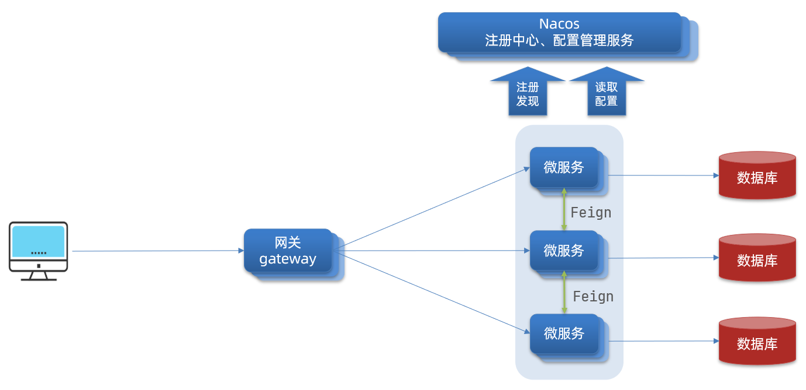
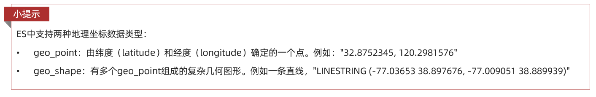
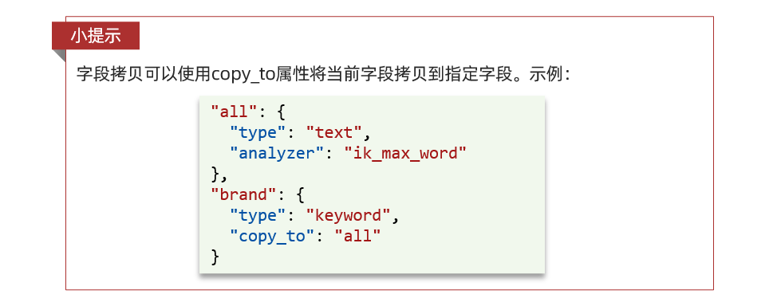

> 软件业的人乐于做这样的事 —— 找一些词汇，并把它们引申到大量微妙而又互相矛盾的意义，例如“架构”
>
> 《Patterns of Enterprise Application Architecture》

## 分布式系统概述

分布式系统的定义：多个计算机通过网络协同工作而对外表现为一个整体

典型应用

- 分布式数据库（如 MongoDB、HBase）
- 分布式存储（如 Hadoop HDFS、Ceph）
- 分布式计算（如 Spark、Flink）
- 微服务架构（如 Spring Cloud、Dubbo）

### 什么是分布式系统

要解释什么是分布式系统，得从分布式架构说起，它定义了分布式系统的设计与实现方法，它描述了系统的结构、组件如何交互、数据如何存储、计算如何分配等。可以说，架构是钢筋，而系统是楼房，系统依赖于架构

常见的分布式架构模式

1. 主从架构（Master-Slave）：适用于数据库读写分离，如 MySQL 主从复制
2. 分片架构（Sharding）：适用于高并发场景，如 Elasticsearch 数据分片
3. 微服务架构（Microservices）：适用于企业级应用，如 Spring Cloud/Dubbo
4. 事件驱动架构（EDA, Event-Driven Architecture）：适用于高吞吐业务，如 Kafka 消息队列处理日志流

在这些架构模式之上，构建了一个个所谓的分布式系统，如最常见的应用淘宝、京东等，都是采用**微服务架构**的分布式系统

通常，Spring 小子（没错就是我）开发的所谓分布式系统，都是指的微服务架构（Spring Cloud）上的分布式系统

### 为什么要使用分布式设计

分布式系统的核心特点

- 多机协作：任务由多个计算机协作完成，而非单机处理
- 数据共享：不同节点之间共享数据，可能涉及数据一致性问题
- 去中心化：避免单点故障，提高系统可用性
- 并发性：多个节点可以并行处理任务，提高吞吐量
- 容错能力：某些节点宕机时，系统仍能继续运行

说白了，就是扩展性好、稳定性高、容错强 —— 所谓“狡兔三窟”

## 微服务架构

### Spring Cloud

刚刚也说到，Spring Cloud 是 Java 生态中最成熟的**微服务架构**解决方案之一

- **微服务架构（Microservices Architecture）** 是一种软件架构风格，它将应用拆分为**多个独立运行的服务**，每个服务负责单一业务功能，服务之间通过 API（通常是 HTTP+JSON 或 gRPC）进行通信

Spring Cloud 就是专门用于**构建、管理和维护微服务架构**的框架，提供了一整套完整的微服务架构解决方案，涵盖**服务注册发现、负载均衡、配置管理、熔断限流、分布式链路追踪**等关键功能

| 组件                         | 作用           | 具体而言                                 |
| ---------------------------- | -------------- | ---------------------------------------- |
| Spring Cloud Eureka          | 服务注册与发现 | 负责管理微服务实例，类似于 DNS           |
| Spring Cloud LoadBalancer    | 负载均衡       | 让多个实例均衡接收请求                   |
| Spring Cloud OpenFeign       | 服务调用       | 通过 HTTP 远程调用其他微服务             |
| Spring Cloud Gateway         | API 网关       | 统一流量入口，路由请求并提供安全控制     |
| Spring Cloud Config          | 配置管理       | 统一管理分布式系统的配置                 |
| Spring Cloud Sleuth & Zipkin | 分布式链路追踪 | 监控请求的调用链路，排查性能瓶颈         |
| Spring Cloud Resilience4J    | 熔断限流       | 保护服务避免雪崩效应（Circuit Breaker）  |
| Spring Cloud Stream          | 消息队列       | 让服务间异步通信（支持 Kafka、RabbitMQ） |

SpringCloud 主要基于 SpringBoot

### 一个经典的 Spring Cloud 架构

假设我们有一个电商系统，包含

- 用户服务（User Service）
- 订单服务（Order Service）
- 商品服务（Product Service）
- 支付服务（Payment Service）
- 网关（Gateway）

其体系架构如下

```sql
                         +-----------------------+
                         | Spring Cloud Gateway  |
                         +-----------------------+
                                 |
        +------------------+------------------+
        |                  |                  |
+------------+      +------------+      +------------+
| 用户服务    |      | 订单服务    |      | 商品服务    |
| (User)     | <--> | (Order)    | <--> | (Product)  |
+------------+      +------------+      +------------+
        |                  |
        |                  +------------------+
        |                                     |
+------------+                      +----------------+
| 支付服务    |                      | 消息队列(Kafka) |
| (Payment)   | <-----------------> | 事件驱动        |
+------------+                      +----------------+
```

在这个架构中

- **Spring Cloud Gateway** 充当 API 入口，管理所有 HTTP 请求
- **Eureka** 作为注册中心，负责管理所有微服务实例，实现**服务发现**
- **Feign** 让服务之间可以更优雅地相互调用（直接从 Eureka 中寻找），而不用自己写 HTTP 请求
- **Resilience4J** 确保服务故障时自动熔断，防止级联故障
- **Kafka** 实现异步消息通信（如订单完成后通知支付服务）

### NIO 和 Netty

> Spring Cloud 生态中众多微服务组件的底层通信组件

Netty：基于 Java NIO 开发的网络流框架，是 Java 领域非常强大的**高性能网络通信框架**，很多中间件（Dubbo、Elasticsearch、RocketMQ、gRPC 等）都用它作为底层通信组件

简单来说：Netty 是 **一个封装了 Java NIO 的网络框架**，让开发者能轻松构建高性能的 TCP/UDP 网络服务，而不用自己去写繁琐的 Selector、Channel、Buffer 这些低级 API

**什么是 NIO？**

NIO（New Input/Output） 是 Java 1.4 引入的一组 API，用于提供**非阻塞（Asynchronous）**的输入输出操作，它让我们能更高效地处理大量的 I/O 操作

NIO 主要的优势在于能够**不阻塞线程**来处理 I/O 操作，它是为了弥补传统的阻塞 I/O（BIO）和 高并发场景下性能瓶颈而设计的

- **怎么实现的非阻塞？**

**Selector** 和 **Channel** 是 NIO 的核心组成，通过**事件驱动**实现异步非阻塞 I/O 操作

**Netty 高性能的关键**

🔹 1. 线程池 + 事件驱动

Netty 采用多 Reactor 线程模型，通过 **EventLoopGroup + 线程池**，避免传统 BIO 的**一线程一连接**低效模式

- BIO（阻塞 IO）：一个线程处理一个连接
- NIO（非阻塞 IO）：多个连接共享一个线程
- Netty（多 Reactor 模型）：多个线程池高效管理连接

📌 示例：Netty 线程池

```java
EventLoopGroup bossGroup = new NioEventLoopGroup(1);  // 处理连接
EventLoopGroup workerGroup = new NioEventLoopGroup(); // 处理读写
```

🔹 2. 零拷贝（Zero-Copy）

Netty 通过 **DirectByteBuf、CompositeByteBuf** 进行零拷贝优化

- 减少 CPU 拷贝（避免 `System.arraycopy`）
- 减少内存分配（减少 GC 压力）
- **减少 **Buffer** 复制**（直接操作堆外内存）

📌 **示例：**Netty 直接使用堆外内存

```java
ByteBuf buffer = Unpooled.directBuffer(1024); // 直接分配堆外内存
```

🔹 3. Pooled Buffer（池化内存）

Netty 使用内存池（Buffer Pool），重复利用 ByteBuf，避免反复创建对象

📌 示例：使用池化的 ByteBuf

```java
ByteBuf pooledBuf = PooledByteBufAllocator.DEFAULT.buffer(256);
```

🔹 4. TCP 粘包/拆包处理

TCP 发送数据时，多个小包可能合并成一个大包（**粘包**），或者一个大包被拆成多个小包（**拆包**）。Netty 通过**解码器**解决此问题

📌 示例：使用 Netty 提供的拆包解码器

```java
ch.pipeline().addLast(new LengthFieldBasedFrameDecoder(1024, 0, 4, 0, 4));
```

上面这个 LengthFieldBasedFrameDecoder 解码器

- 按照数据包长度字段解析消息
- 避免 TCP 粘包/拆包问题

## 常用组件和中间件

### Nacos

> 注册中心是**微服务通信的核心**，不管是 Eureka、Feign 还是 Dubbo，他们的服务端和客户端均要在注册中心进行动态管理

Nacos 是 SpringCloud Alibaba 的组件，而 SpringCloud Alibaba 遵循 SpringCloud 中定义的服务注册、服务发现规范，因此使用 Nacos 和使用 Eureka 对于微服务接口而言，并没有太大区别

差异无非

- 依赖不同
- 服务地址不同

具体而言，每个微服务通过这样的方式集中管理

1️⃣ 首先引入 Nacos 客户端依赖并进行配置

```xml
<dependency>
    <groupId>com.alibaba.cloud</groupId>
    <artifactId>spring-cloud-starter-alibaba-nacos-discovery</artifactId>
    <version>2022.0.0.0</version> <!-- 根据 Spring Cloud 版本选择 -->
</dependency>
```

```yaml
server:
  port: 8081

spring:
  application:
    name: user-service
  cloud:
    nacos:
      discovery:
        server-addr: localhost:8848  # Nacos 服务器地址
        namespace: public           # 命名空间（默认 public）
        group: DEFAULT_GROUP        # 分组（默认 DEFAULT_GROUP）
```

2️⃣ 在主类中启动 Nacos 注册服务

```java
package com.example.userservice;

import org.springframework.boot.SpringApplication;
import org.springframework.boot.autoconfigure.SpringBootApplication;
import org.springframework.cloud.client.discovery.EnableDiscoveryClient;

@SpringBootApplication
@EnableDiscoveryClient // 启用服务注册与发现（兼容 Nacos）
public class UserServiceApplication {

    public static void main(String[] args) {
        SpringApplication.run(UserServiceApplication.class, args);
    }
}
```

3️⃣ 正常编写`Controller`层代码，如

```java
@RestController
@RequestMapping("/users")
class UserController {

    private final Map<Long, User> userMap = new HashMap<>();

    // 创建用户
    @PostMapping
    public User createUser(@RequestBody User user) {
        userMap.put(user.getId(), user);
        return user;
    }

    // 查询用户
    @GetMapping("/{id}")
    public User getUser(@PathVariable Long id) {
        return userMap.get(id);
    }
}
```

如此，当前项目`user-service`的接口就被注册在地址为`localhost:8848`的 Nacos 中，其他模块可以通过 Feign 客户端对该接口进行调用

```java
@FeignClient(name = "user-service") // 服务名需与目标服务在 Nacos 中的名称一致
public interface UserServiceClient {

    @GetMapping("/{id}}")
    User getUserById(@PathVariable Long userId);
}
```

### Feign

> SpringCloud OpenFeign，本质上是 RestTemplate 的上位替代，封装了 HTTP 请求在各微服务接口之间进行调用，属同步调用，不属于 RPC（远程过程调用）

刚刚简单展示了调用 user-service 的 Feign 客户端编写，以下引入另一个模块 order-service 来更清晰的展示调用过程

以同样的方式，我们创建一个 order-service 模块运行在 8082 端口，并提供一个订单查询接口注册到 Nacos

```yaml
server:
  port: 8082

spring:
  application:
    name: order-service
  cloud:
    nacos:
      discovery:
        server-addr: localhost:8848  # Nacos 服务器地址
        namespace: public           # 命名空间（默认 public）
        group: DEFAULT_GROUP        # 分组（默认 DEFAULT_GROUP）
```

```java
@RestController
@RequestMapping("/orders")
class OrderController {
    // 查询用户账单
    @GetMapping("/{userId}")
    public List<Order> getOrders(@PathVariable Long id) {
        return OrderService.getOrdersByUserId(id);
    }
}
```

以下展示如何在 user-service 模块中调用上面注册到 Nacos 的 order-service 服务

1️⃣ 引入 Feign 依赖并在主类中启用（在 UserService 模块中）

```xml
<dependency>
    <groupId>org.springframework.cloud</groupId>
    <artifactId>spring-cloud-starter-openfeign</artifactId>
</dependency>
```

```java
@SpringBootApplication
@EnableDiscoveryClient
@EnableFeignClients // 启用 Feign 客户端
public class UserServiceApplication {
    // ...
}
```

3️⃣ 编写 Feign 客户端调用上面 order-service 的服务

```java
@FeignClient(name = "order-service") // 服务名需与目标服务在 Nacos 中的名称一致
public interface OrderServiceClient {
    @GetMapping("/orders/{userId}")
    List<Order> getOrdersByUserId(@PathVariable Long userId);
}
```

4️⃣ 在 Controller 层调用 Feign 客户端

```java
@RestController
@RequestMapping("/users")
class UserController {

    @Autowired
    private OrderServiceClient orderServiceClient;

    @GetMapping("/{id}/orders")
    public List<Order> getUserOrders(@PathVariable Long id) {
        return orderServiceClient.getOrdersByUserId(id);
    }
}
```

如此便实现了微服务之间的一次简单的调用，对于用户而言，他请求的实际上是`/users/{id}/orders`接口，在微服务内部，这个请求被转发到`/orders/{id}`接口，并最终将结果通过`/users/{id}/orders`返回

### Gateway

Gateway 网关是微服务的门神，负责

- **权限控制**：网关作为微服务入口，需要校验用户是是否有请求资格，如果没有则进行拦截
- **路由和负载均衡**：一切请求都必须先经过gateway，但网关不处理业务，而是根据某种规则，把请求转发到某个微服务，这个过程叫做路由。当然路由的目标服务有多个时，还需要做负载均衡
- **限流**：当请求流量过高时，在网关中按照下流的微服务能够接受的速度来放行请求，避免服务压力过大

基本架构



**实际上，在现实业务中，请求先走负载均衡，再打网关，最后打到微服务**

maven 引入

```xml
<!--网关-->
<dependency>
    <groupId>org.springframework.cloud</groupId>
    <artifactId>spring-cloud-starter-gateway</artifactId>
</dependency>
<!--nacos服务发现依赖 自己也要注册到nacos-->
<dependency>
    <groupId>com.alibaba.cloud</groupId>
    <artifactId>spring-cloud-starter-alibaba-nacos-discovery</artifactId>
</dependency>
```

application 配置

```yaml
server:
  port: 10010 # 网关端口
spring:
  application:
    name: gateway # 服务名称
  cloud:
    nacos:
      server-addr: localhost:8848 # nacos地址
    gateway:
      routes: # 网关路由配置
        - id: order-service
          uri: lb://orderservice
          predicates:
            - Path=/user/**
            - After=2021-01-20T17:42:47.789-07:00[America/Denver] #断言：只有在这个事件后发送的请求才可以
        - id: user-service # 路由id，自定义，只要唯一即可
          # uri: http://127.0.0.1:8081 # 路由的目标地址 http就是固定地址
          uri: lb://userservice # 路由的目标地址 lb就是负载均衡，后面跟服务名称
          predicates: # 路由断言，也就是判断请求是否符合路由规则的条件
            - Path=/user/** # 这个是按照路径匹配，只要以/user/开头就符合要求
          filters: # 过滤器（当前过滤器写在userservice路由下，因此仅仅对访问userservice的请求有效）
            - AddRequestHeader=Conan, isMe! # 添加请求头
      default-filters: # 默认过滤项（对所有路由都有效）
        - AddRequestHeader=Truth, Itcast is freaking awesome!
```

有一个问题：Gateway 的权限拦截和 SpringSecurity 有什么区别，能否相互替代？

## RPC 框架

### 服务间通信

详见 [分布式系统设计 - 深入 RPC 框架 | Arkrypto's Wiki](https://arkrypto.github.io/pages/2afee4/)

## 消息队列

> **缓冲**是 MQ 的关键词，**异步**是其主要特征

这里主要考虑 Kafka 作为日志收集的使用，如果是消息中间件可以更多参考 [RabbitMQ | Arkrypto's Wiki](https://arkrypto.github.io/pages/45216b/)

- 之前用 RabbitMQ 做过一个消息中间件，用于解耦用户请求和大模型的响应，即用户作为生产者，LLM 作为消费者，MQ 在中间做一层缓冲

Kafka 是一个流式框架，设计本身就是为了流处理和批处理，以面对大数据的冲击和消费，例如日志处理，作为生产者和消费者的一个中间角色对日志进行持久化的存储

一些通用的应用场景

| 类别                    | 具体场景                     | 说明                                                        |
| :---------------------- | :--------------------------- | :---------------------------------------------------------- |
| **日志收集**            | 系统日志、应用日志、审计日志 | 最经典用途，**解耦日志生成和分析**                          |
| **消息中间件**          | 系统间消息异步通信           | 替代传统 MQ（比如RabbitMQ、ActiveMQ）                       |
| **流式处理**            | 实时数据流分析               | 搭配 Flink、Spark Streaming 做实时ETL、报警、监控           |
| **指标监控**            | 业务指标、运维监控、报警系统 | 低延迟收集与分析，做实时仪表盘                              |
| **数据管道**            | 大数据同步，数据湖、仓库建模 | 将 MySQL、MongoDB 等变更流入 Kafka，推送到 Hadoop、Hive、ES |
| **事件驱动架构（EDA）** | 微服务事件总线，用户行为追踪 | 服务间解耦、异步处理，支持订阅模式                          |
| **IoT 数据收集**        | 设备传感器数据流             | IoT 设备产生的大量实时数据通过Kafka聚合                     |

### 日志收集

> Kafka 充当一个**高性能的日志缓冲中间件**

以日志收集为例，其数据流向如下

```
日志收集 - 日志源服务器（Nginx，Tomcat，SpringBoot 应用）
    	  ↓
	      Filebeat / Fluentd / Logstash（轻量级收集）
    	  ↓
日志存储 - Kafka（原始日志 Topic）
    	  ↓
	      Logstash / Flink（复杂加工处理）
    	  ↓
	      Kafka（清洗后的日志 Topic）
    	  ↓
日志消费 - Elasticsearch / HDFS / DB（存储 & 检索）
```

也可以简单一点，直接用 Flink + ES 消费原始日志，清洗后的日志无需二次存入 MQ，而是直接流入 ES

```
日志收集 - 日志源服务器（Nginx，Tomcat，SpringBoot 应用）
    	  ↓
	      Filebeat / Fluentd / Logstash（轻量级收集）
    	  ↓
日志存储 - Kafka（原始日志 Topic）
    	  ↓
日志消费 - Logstash / Flink（复杂加工处理）
    	  ↓
    	  Elasticsearch / HDFS / DB（存储 & 检索）
```

1️⃣ 日志采集

本地文件：假设我们现在有应用日志`/var/log/nginx/access.log`

日志采集（`Filebeat/Fluentd/Logstash`）：从源头采集原始数据，快速、低消耗的搬运数据到 Kafka

2️⃣ 日志存储

`Kafka`：日志存储，将原始日志存入 Kafka Topic 中

3️⃣ 日志消费

数据清洗（`Logstash/Flink`）：对原始数据进行稍复杂的处理，就像爬虫清洗 HTML 数据一样

| 作用         | 示例                                                   |
| ------------ | ------------------------------------------------------ |
| 日志字段提取 | 把 `"INFO 2024-04-26 server started"` 解析成结构化数据 |
| 日志过滤     | 只保留 ERROR 日志                                      |
| 日志清洗     | 修正格式、补充缺失字段                                 |
| 日志分流     | 按不同类型日志打到不同 Kafka topic                     |
| 实时聚合     | 比如一分钟内统计错误数量                               |
| 异常检测     | 实时识别异常模式                                       |

PS：Logstash/Flink 处理后的数据并不会直接落盘，这里可以选择直接存入数据库如 ES 或是存回 Kafka（再流入 DB）

Logstash 和 Flink 异同

| 组件         | 作用                   | 特点                                       |
| :----------- | :--------------------- | :----------------------------------------- |
| **Logstash** | 复杂的日志加工和路由器 | 插件丰富（Filter, Output），适合中小型处理 |
| **Flink**    | 大规模实时流处理框架   | 超高吞吐、低延迟，适合复杂计算和大规模流   |

存储 & 检测

1. ELK Stack（Elasticsearch + Logstash + Kibana）
   - Logstash 从 Kafka 读日志，清洗后写到 Elasticsearch
   - Kibana 做日志检索和可视化
2. 实时处理系统（Flink / Spark Streaming）：实时计算异常日志、报警、日志聚合等
3. 离线存储：存到 HDFS、Hive，做离线分析

## 大数据计算

### Flink

在大数据场景中，Flink 经常和 Kafka 搭配，用来**清洗** Kafka 的数据流

1. Kafka 生产数据（日志、用户点击、设备数据等）
2. Flink 进行实时处理（聚合、分析、清洗）
3. 处理结果存入 Kafka（本地磁盘） / 关系型数据库 / Elasticsearch

📌 示例：Flink 读取 Kafka 并统计用户点击量

```java
StreamExecutionEnvironment env = StreamExecutionEnvironment.getExecutionEnvironment();
FlinkKafkaConsumer<String> kafkaConsumer = new FlinkKafkaConsumer<>("user_clicks", new SimpleStringSchema(), properties);
DataStream<String> stream = env.addSource(kafkaConsumer);

// 统计每个用户的点击次数
stream.map(value -> new Tuple2<>(value, 1))
      .keyBy(0)
      .sum(1)
      .print();

env.execute("Kafka Stream Processing");
```

### Spark

Flink 专注于流处理，而 Spark 以批处理为主

| **对比项**     | **Flink**                         | **Spark**                    |
| -------------- | --------------------------------- | ---------------------------- |
| **计算模式**   | 主要是**流计算**，也支持批处理    | 主要是**批处理**，支持流计算 |
| **延迟**       | 毫秒级                            | 秒级                         |
| **吞吐量**     | 高吞吐，适用于高并发              | 较高吞吐，但稍逊于 Flink     |
| **故障恢复**   | Exactly-Once 语义，保证数据一致性 | At-Least-Once，可能重复计算  |
| **API 兼容性** | 提供 SQL、Java、Python API        | 提供 SQL、Scala、Java API    |

## ElasticSearch 

[ElasticSearch (ES从入门到精通一篇就够了) - 不吃紫菜 - 博客园](https://www.cnblogs.com/buchizicai/p/17093719.html)

### ELK

ELK，Elastic Stack，是以 ElasticSearch 为核心的技术栈，包括 Beats、**Logstash**、Kibana、**ElasticSerach**，被广泛应用在日志数据分析、实时监控等领域


作为 ELK 的核心，Elasticsearch 是一个分布式搜索引擎（索引数据库），负责存储、搜索、分析数据。他采用 Netty 作为底层通信框架，来实现高效的 **TCP 连接管理**和**数据传输**，由 Lucene 提供搜索引擎的核心 API（Lucene 是 Apache 的毕业开源搜索引擎类库，基于 Java 开发）

Logstash 是一个流处理工具，它提供了大量插件，可用它自己的 [Filter](https://www.elastic.co/guide/en/logstash/current/filter-plugins.html) 帮助你解析，丰富，转换和缓冲来自各种来源的数据，最后，它可以把自己的数据输出到各种需要的数据储存地，这其中包括 Elasticsearch

- 安恒这类安全类的公司做开发似乎用的比较多

相比于 Lucene，ElasticSearch 具备下列优点

1. 支持分布式，可水平扩展
2. 提供 Restful 接口，可通过任意语言以 HTTP 方式调用

ES 的核心在于倒排索引（相对于关系型数据库的正向索引而言），在模糊搜索时速度很快（依仗于 BM25 算法）

ES 的核心评分算法：一开始是 TF-IDF 算法


后来是 BM25 算法（在 5.1 版本后），没错，就是这篇用到的 - [基于 BM25 算法的可搜索加密系统 | Arkrypto Wiki](https://northboat.github.io/pages/7bc025/#jpbc-基础)


与 MySQL 的对比

| **MySQL** | **Elasticsearch** | **说明**                                                     |
| --------- | ----------------- | ------------------------------------------------------------ |
| Table     | Index             | 索引（index），就是文档的集合，类似数据库的表(table)         |
| Row       | Document          | 文档（Document），就是一条条的数据，类似数据库中的行（Row），文档都是 JSON 格式 |
| Column    | Field             | 字段（Field），就是 JSON 文档中的字段，类似数据库中的列（Column） |
| Schema    | Mapping           | Mapping（映射）是索引中文档的约束，例如字段类型约束。类似数据库的表结构（Schema） |
| SQL       | DSL               | DSL 是 elasticsearch 提供的JSON风格的请求语句，用来操作 elasticsearch，实现CRUD |

像操纵 MySQL 一样，我们本质上都是使用 DSL 对 ES 进行 CRUD，无论是命令行还是调用 RestAPI，都是在完成这一工作

### DSL

类似于关系型数据库的 SQL，采用更为简单的 Json 格式

1️⃣ POST 命令新增文档，全部是键值对的形式进行添加

```json
POST /northboat/_doc/1
{
    "info": "真相只有一个！",
    "email": "zy@itcast.cn",
    "name": {
        "firstName": "柯",
        "lastName": "南"
    }
}
```

2️⃣ GET 查询文档

```json
GET /northboat/_doc/1
```

3️⃣ DELETE 删除文档

```json
# 根据id删除数据
DELETE /northboat/_doc/1
```

4️⃣ PUT 全量修改文档（覆盖修改），实际上是先通过 id DELETE 掉原有文档，再 POST 一个相同 id 的文档

```json
PUT /northboat/_doc/1
{
    "info": "西电凯÷CIA实验室",
    "email": "zy@itcast.cn",
    "name": {
        "firstName": "云",
        "lastName": "赵"
    }
}
```

5️⃣ POST 增量修改，只修改指定 id 匹配的文档中的**部分字段**

```json
POST /northboat/_doc/1
{
    "doc": {
         "email": "northboat@163.com",
    }
}
```

### 索引库

在现实场景中，我们不可能去手动创建索引库，应该是根据每个文档的**关键词**去创建对应的 json，那么这一过程一定是需要用到**分词器**对整个文档进行关键词的分割

我们说，创建索引库，最关键的是 mapping 映射（构建 json 映射关系），而 mapping 映射要考虑的信息包括：

- 字段名
- 字段数据类型
- 是否参与搜索
- 是否需要分词
- 如果分词，分词器是什么

在设计时

1. 依照关系型数据库的字段设计方式进行设计
2. 我们只对需要进行搜索的字段进行映射，比如主键肯定需要，而图片地址就无需参与
3. 分词器方面，可以统一使用 IK_MAX_WORD

一个 Hotel 酒店索引库示例，通过 PUT 命令创建

```json
PUT /hotel
{
  "mappings": {
    "properties": {
      "id": {
        "type": "keyword"
      },
      "name":{
        "type": "text",
        "analyzer": "ik_max_word",
        "copy_to": "all"
      },
      "address":{
        "type": "keyword",
        "index": false
      },
      "price":{
        "type": "integer"
      },
      "score":{
        "type": "integer"
      },
      "brand":{
        "type": "keyword",
        "copy_to": "all"
      },
      "city":{
        "type": "keyword",
        "copy_to": "all"
      },
      "starName":{
        "type": "keyword"
      },
      "business":{
        "type": "keyword"
      },
      "location":{
        "type": "geo_point"
      },
      "pic":{
        "type": "keyword",
        "index": false
      },
      "all":{
        "type": "text",
        "analyzer": "ik_max_word"
      }
    }
  }
}
```

几个特殊字段说明

- location：地理坐标，里面包含精度、纬度
- all：一个组合字段，其目的是将多字段的值 利用copy_to合并，提供给用户搜索

location 地理坐标



copy_to 属性：将当前字段拷贝到指定字段



当然了，在实际生产中，我们会使用 Java API 来操作 ES 数据库：[Elasticsearch Clients | Elastic](https://www.elastic.co/guide/en/elasticsearch/client/index.html)

引入 Java HighLevel Rest Client依赖

```xml
<dependency>
    <groupId>org.elasticsearch.client</groupId>
    <artifactId>elasticsearch-rest-high-level-client</artifactId>
</dependency>
```

因为 SpringBoot 默认的 ES 版本是 7.6.2，所以我们需要覆盖默认的 ES 版本与自己的版本一致

```xml
<properties>
    <java.version>1.8</java.version>
    <elasticsearch.version>7.12.1</elasticsearch.version>
</properties>
```

初始化 RestHighLevelClient 并注入 Bean

```java
@Bean
public RestHighLevelClient client(){
    return new RestHighLevelClient(RestClient.builder(
        HttpHost.create("http://192.168.150.101:9200")
	));
}
```

这里为了单元测试方便，我们创建一个测试类 HotelIndexTest，然后将初始化的代码编写在 @BeforeEach 方法中

```java
package cn.itcast.hotel;

import org.apache.http.HttpHost;
import org.elasticsearch.client.RestHighLevelClient;
import org.junit.jupiter.api.AfterEach;
import org.junit.jupiter.api.BeforeEach;
import org.junit.jupiter.api.Test;

import java.io.IOException;

public class HotelIndexTest {
    private RestHighLevelClient client;

    @BeforeEach
    void setUp() {
        this.client = new RestHighLevelClient(RestClient.builder(
                HttpHost.create("http://192.168.150.101:9200")
        ));
    }

    @AfterEach
    void tearDown() throws IOException {
        this.client.close();
    }
}
```

CRUD 文档库 Hotel，本质上就是**拼接字符串和 HTTP 请求**，向 ES 数据库**发送 DSL 命令**，而后 ES 返回执行结果的过程

### 文档

文档之于索引库，就像数据表之于数据库，在实际使用中，基本上是先读取 MySQL 数据表中的数据，然后再存进 ES 的文档中

文档操作的基本步骤：根据发送请求那步的第一个参数，发过来判断需要创建什么`XXXRequest`

1. 初始化 RestHighLevelClient
2. 创建`XXXRequest`，XXX 可以是 Index、Get、Update、Delete、Bulk
3. 准备参数（Index、Update、Bulk时需要）
4. 发送请求：调用`RestHighLevelClient.xxx()`方法，xxx 是 index、get、update、delete、bulk
5. 解析结果（Get 时需要）

ES 的查询是一门功夫，类似于 SQL 的编写，可以有很多查询条件和复合嵌套规则

