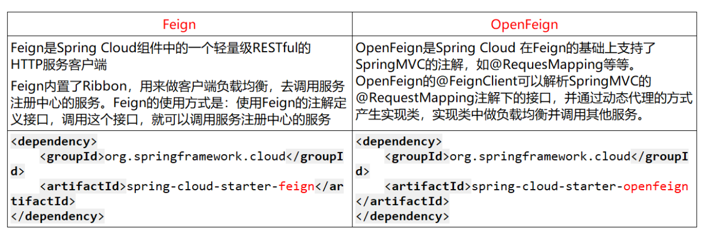

## RPC 框架

RPC（Remote Procedure Call，远程过程调用）是一种**允许分布式系统中的不同服务像调用本地方法一样调用远程服务**的技术。RPC 框架封装了底层的网络通信、序列化和反序列化，使开发者可以透明地进行远程调用，而不需要手动处理复杂的网络编程

### Why RPC?

在分布式系统中，不同的服务可能部署在不同的服务器上，它们需要相互通信。例如

- 电商系统：订单服务需要调用库存服务检查库存，再调用支付服务处理支付
- 微服务架构：多个微服务之间需要相互调用，比如用户认证服务、订单服务、商品服务等

它对标的是 **HTTP/REST** 通信，我们当然可以直接通过打请求的方式获取数据，例如

```java
RestTemplate restTemplate = new RestTemplate();
String result = restTemplate.getForObject("http://server/user?id=1", String.class);
```

当然了，这是原始的实现方式，Spring Cloud 提供有优雅的上位代替 —— Feign，但他仍然是通过 HTTP 实现的服务通信

只要是基于 HTTP，就会存在

- 请求体较大（HTTP 请求头、JSON 序列化等）
- 性能损耗（HTTP 需要解析文本，序列化和反序列化的开销大）
- 协议不够高效（HTTP 是基于文本的，而 RPC 可以采用更高效的二进制协议）

而 RPC 解决了这些问题

- **更高效**：使用**二进制协议**（如 Protobuf），减少数据传输体积
- **更透明**：像调用本地方法一样调用远程服务
- **更易扩展**：内置**负载均衡、服务注册与发现、流量控制**等功能

### 工作原理

RPC 框架主要包含**客户端、服务端、注册中心**三个核心组件

1. 客户端（Client Stub）
   - 发送请求给服务端，就像调用本地方法一样
   - 负责序列化请求数据（将 Java 对象转换成字节流）
2. 服务端（Server Stub）
   - 监听客户端请求，调用对应的本地方法，并返回结果
   - 负责反序列化请求数据（将字节流转换成 Java 对象）
3. 注册中心（Service Registry）
   - 维护所有可用的服务列表
   - 客户端在调用时**动态发现服务**，而不是写死 IP 地址
   - 常用的注册中心：Zookeeper、Nacos

RPC 典型流程

```
1️⃣ 客户端调用本地方法（伪装成普通的 Java 方法）
2️⃣ RPC 框架将请求数据序列化并发送到服务端
3️⃣ 服务端接收请求，反序列化数据，并调用目标方法
4️⃣ 目标方法执行后返回结果
5️⃣ 服务端将返回结果序列化并发送回客户端
6️⃣ 客户端接收结果，返回给调用方
```

常见 RPC 框架

| RPC 框架    | 语言                          | 主要特点                                                   |
| ----------- | ----------------------------- | ---------------------------------------------------------- |
| **gRPC**    | 多语言（Java、Go、Python等）  | Google 开发，基于 HTTP/2 和 Protobuf，高性能，支持流式通信 |
| **Dubbo**   | Java                          | 阿里巴巴开发，支持服务发现、负载均衡、流量控制             |
| **Motan**   | Java                          | 美团开源，轻量级，适用于高并发场景                         |
| **Thrift**  | 多语言（Java、C++、Python等） | Facebook 开发，支持多种语言，适用于跨语言 RPC              |
| **Tars**    | 多语言（Java、C++、Go等）     | 腾讯开源，支持大规模分布式应用                             |
| **Hessian** | Java                          | 简单易用，适用于小型应用，序列化采用二进制格式             |

### Dubbo

Dubbo 是阿里巴巴开源的 Java RPC 框架，基于 Netty 实现，用于微服务间通信，不同 Feign 的 HTTP 通信，Dubbo 采用更加轻量迅捷的二进制协议进行数据传输，故而效率要远高于 Feign

- 和 Feign 一样，Dubbo 也是同步调用

调用流程基本一致

**代码示例**

1️⃣ 添加依赖

```xml
<dependency>
    <groupId>org.apache.dubbo</groupId>
    <artifactId>dubbo-spring-boot-starter</artifactId>
    <version>2.7.8</version>
</dependency>
```

2️⃣ 定义接口

```java
public interface UserService {
    String getUser(int id);
}
```

3️⃣ 实现服务端

```java
@DubboService
public class UserServiceImpl implements UserService {
    @Override
    public String getUser(int id) {
        return "张三";
    }
}
```

4️⃣ 实现客户端

```java
@DubboReference
private UserService userService;

public void test() {
    System.out.println(userService.getUser(1));
}
```

当然了，在客户端需要对注册中心（如 Nacos）在 application.yaml 进行配置，这样在碰到`@DubboReference`注解时，系统会自动去注册中心查询需要的服务地址

```yaml
dubbo:
  application:
    name: consumer-service  # 客户端应用名
  registry:
    address: nacos://127.0.0.1:8848  # 这里配置的是注册中心的地址
  protocol:
    name: dubbo
    port: -1  # -1 表示随机端口
```

具体调用流程是

1. 服务端（Provider）启动时，它会把自己的服务信息（接口、地址、端口等）注册到 Nacos/Zookeeper
2. 客户端（Consumer）启动时，它会去**注册中心查询**需要的服务地址
3. 当代码运行到 `@DubboReference` 时，Dubbo 代理会**根据注册中心的信息找到远程服务**，然后建立连接并执行调用

💡 **当尝试修改服务端的 IP 地址时，客户端能够自动发现请求地址变化，这是注册中心完成的工作，对于 RPC 客户端是完全透明的** 🚀

另外，Dubbo 内置了**负载均衡、重试机制、超时控制**的功能，均可以在 application.yaml 中进行配置

### Zookeeper

与 Nacos 同属于注册中心，Nacos 由阿里开发

- Nacos 和 Zookeeper 的异同？

## CAP 原则

基于 CAP 原则：一致性（Consistency）、可用性（Availability）和分区容忍性（Partition Tolerance）三者不可兼得

什么是一致性、可用性和分区容忍性？

- C - 一致性：所有节点在同一时间看到的数据相同
- A - 可用性：每个请求都能得到响应（即使部分节点故障），但不保证是最新数据
- P - 分区容忍性：指系统能够处理网络分区（节点间通信中断）的情况，即使部分节点无法通信，系统仍能正常运行

CAP 理论的核心是：一个分布式系统不可能同时很好的满足一致性，可用性和分区容错性这三个需求，因此，根据 CAP 原理将 NoSQL 数据库分成了满足 CA 原则、满足 CP 原则和满足 AP 原则三大类

- CA：单点集群，满足一致性，可用性的系统，通常在可扩展性上不太强大
- CP：满足一致性，分区容忍性的系统，通常性能不是特别高
- AP：满足可用性，分区容忍性的系统，通常可能对一致性要求低一些

需要注意的是，在分布式环境中，网络分区是不可避免的，因此分布式系统都需要具有分区容忍性（P），故分布式系统的设计中，变成了 AP 和 CP 系统的选择

AP 系统和 CP 系统的例子

| 系统            | 一致性（C）                                                  | 可用性（A）                                                  | 分区容忍性（P）                                              |
| --------------- | ------------------------------------------------------------ | ------------------------------------------------------------ | ------------------------------------------------------------ |
| Eureka（AP）    | Eureka 选择**最终一致性**，当一个 Eureka Server 节点失联时，其他节点仍然可以提供服务，保证高可用性，即使短时间内数据可能不同步 | Eureka 在网络分区时会优先保证可用性，即使某些实例信息不同步，也不会阻止服务发现。这使得 Eureka 能在部分失败的情况下继续运行，提供高可用性 | Eureka 通过牺牲一致性来保证可用性（AP），即便部分节点无法通信，仍然可以继续提供服务 |
| Zookeeper（CP） | Zookeeper 采用 ZAB（Zookeeper Atomic Broadcast）协议，保证强一致性，确保集群中的所有节点数据保持同步。一旦有节点崩溃或网络分区发生，Zookeeper 会进入 Leader 选举过程，短时间内不可用，确保数据一致性 | Zookeeper 在网络分区时更倾向于保持**数据一致性**，可能会拒绝提供服务（即使有部分节点仍可用），导致部分时间不可用 | Zookeeper 通过**强一致性**机制，在发生分区时优先保证数据正确性（CP），但可能会牺牲部分可用性 |

## 注册中心的选择

注册中心可以说是微服务架构中的”通讯录“，它记录了服务和服务地址的映射关系，一般包含如下功能

- 服务发现
  1. 服务注册/反注册：保存服务提供者和服务调用者的信息
  2. 服务订阅/取消订阅：服务调用者订阅服务提供者的信息，最好有实时推送的功能
  3. 服务路由（可选）：具有筛选整合服务提供者的能力
- 服务配置
  1. 配置订阅：服务提供者和服务调用者订阅微服务相关的配置
  2. 配置下发：主动将配置推送给服务提供者和服务调用者
- 服务健康检测：检测服务提供者的健康情况

注册中心总览

| 组件名    | 语言 | CAP     | 服务健康检查 | 对外暴露接口 | Spring Cloud 集成 |
| --------- | ---- | ------- | ------------ | ------------ | ----------------- |
| Eureka    | Java | AP      | 可配         | HTTP         | √                 |
| Zookeeper | Java | CP      | 支持         | 客户端       | √                 |
| Nacos     | Java | AP / CP | 支持         | RPC / DNS    | √                 |

CA 是单点集群，满足一致性和可用性，不支持分区，仅能用于单机系统（本地玩具）

在分布式系统中，分区容忍性一定是要满足的，所以注册中心的选取实际上就是在一致性和可用性之间的选取，通常而言，要满足一致性就要牺牲一定的性能（即 CP 的性能会略逊于 AP），或者说，“弹性”

- Eureka 是网飞（Netflex）开源的，某知名视频网站，这样的网站处理讲究一个实时性、讲究一个弹性，而不需要高度的一致性，比如我去请求一个视频，我管你新的旧的，先打回来再说，我都上膛了，不得不起飞，所以选择 AP 系统，放弃一定的一致性而换来高可用性，以保证用户不管什么时候都不会请求炸膛
- 但是在一些强调一致性的场景下，比如支付，一定是不能有吞订单、吞付款记录的情况出现，他的一致性一定是要优先保障的，一定是要选择所谓的 CP 系统，当订单出现异常时，一定是拒绝服务（可能是引入熔断机制），而不能随随便便进行后台数据的读写

### Eureka

前面提到过，Eureka 是一个 AP 系统，是 Netflix 开源的**服务发现组件**，它的设计目标是高可用性和弹性，因此在 CAP 中选择了 AP

Eureka 包含两个组件：Eureka Server 和 Eureka Client

- Eureka Server 提供服务注册服务：各个微服务节点通过配置启动后，会在 EurekaServer 中进行注册，这样 EurekaServer 中的服务注册表中将会存储所有可用服务节点的信息，服务节点的信息可以在界面中直观看到
- Eureka Client 通过注册中心进行访问：本质上是一个 Java 客户端，用于简化 Eureka Server 的交互，客户端同时也具备一个内置的、使用轮询（round-robin）负载算法的负载均衡器。在应用启动后，将会向 Eureka Server 发送心跳（默认周期为30秒）。**如果 Eureka Server 在多个心跳周期内没有接收到某个节点的心跳，EurekaServer 将会从服务注册表中把这个服务节点移除（默认90秒）**

Eureka 有一个重要的特性叫**自我保护机制**（Self-Preservation），这是它作为 AP 系统的核心设计之一

- 触发条件：当 Eureka 服务器节点在短时间内丢失过多客户端心跳（例如网络分区或大规模服务故障），Eureka 会进入自我保护模式
- 行为：在自我保护模式下，Eureka 不会立即注销丢失心跳的服务实例，**而是保留这些实例，即使它们可能已经不可用**
- 目的：这是为了防止因网络分区或临时故障导致的服务实例被错误地注销，从而避免大规模服务不可用
- 影响：在自我保护模式下，Eureka 的数据可能不一致（例如保留了已宕机的服务实例），但保证了系统的可用性

### Zookeeper

> Zookeeper 遵循 CP 原则，保证一致性和分区容错性

ZooKeeper 是一个树形目录服务，其数据模型和 Unix 的文件系统目录树很类似，拥有一个层次化结构，数据以节点的形式存放在树中

Zookeeper 服务端常用命令

- 启动 ZooKeeper 服务: ./zkServer.sh start
- 查看 ZooKeeper 服务状态: ./zkServer.sh status
- 停止 ZooKeeper 服务: ./zkServer.sh stop
- 重启 ZooKeeper 服务: ./zkServer.sh restart

Curator API：建立连接；添加节点；删除节点；修改节点；查询节点

Zookeeper 分布式锁，和 Redis 的分布式锁（Redission）类似，通过拿取/删除临时节点（Redis 是键值对）来实现锁，Curator 提供了基于五种基于 Zookeeper 的分布式锁方案

- InterProcessSemaphoreMutex：分布式排它锁（非可重入锁）
- InterProcessMutex：分布式可重入排它锁
- InterProcessReadWriteLock：分布式读写锁
- InterProcessMultiLock：将多个锁作为单个实体管理的容器
- InterProcessSemaphoreV2：共享信号量

Watch 事件监听：ZooKeeper 允许用户在指定节点上注册一些 Watcher，并且在一些特定事件触发的时候，ZooKeeper 服务端会将事件通知到感兴趣的客户端上去，该机制是 ZooKeeper 实现分布式协调服务的重要特性

ZooKeeper 提供了三种 Watcher

1. NodeCache：只是监听某一个特定的节点
2. PathChildrenCache：监控一个 ZNode 的子节点
3. TreeCache：可以监控整个树上的所有节点，类似于 PathChildrenCache 和 NodeCache 的组合

在 ZooKeeper **集群**服务中有三个角色，这是一个经典的**主从架构**

- Leader 领导者：Leader 是集群的核心，负责处理所有写请求（如创建、更新、删除节点）和事务性操作，Leader 负责将写操作同步到所有 Follower 和 Observer 节点，确保数据一致性
- Follower 跟随者：处理客户端的读请求，参与写请求的投票（ZooKeeper 使用 Zab 协议，写请求需要大多数节点确认），参与 Leader 选举
- Observer 观察者：处理客户端的读请求，不参与写请求的投票，也不参与 Leader 选举。Observer 的**主要作用是扩展 ZooKeeper 集群的读能力**，而不会增加写操作的开销

就是说，Leader 负责写，Follower 和 Observer 负责读，并且通过同步复制（区别于 Eureka 的异步复制）从 Leader 节点中同步数据，以保证系统的一致性

- Leader 相当于经典的主从架构中的 Master，而 Follower 相当于 Slave

Zookeeper 集群的读写流程

1. 写请求流程：
   - 客户端发送写请求到任意节点（Leader 或 Follower）
   - 如果请求发送到 Follower，Follower 会将请求转发给 Leader
   - Leader 将写请求作为提案（Proposal）广播给所有 Follower
   - Follower 收到提案后，会进行投票（ACK）
   - 当大多数节点（包括 Leader 自己）确认后，Leader 会提交（Commit）该写操作，并通知所有 Follower 和 Observer 同步数据
2. 读请求流程：
   - 客户端发送读请求到任意节点（Leader、Follower 或 Observer）
   - 节点直接返回本地数据，不需要与其他节点协商

Leader 的选举：Zookeeper 集群的 Leader 是动态选举的，而不是静态指派

- Serverid：服务器 ID，比如有三台服务器，编号分别为`1,2,3`，编号越大在选择算法中的权重越大
- Zxid：数据 ID，服务器中存放的最大数据 ID 值越大说明数据越新，在选举算法中数据越新权重越大

在 Leader 选举的过程中，如果某台 ZooKeeper 获得了超过半数的选票，则此 ZooKeeper 就可以成为 Leader 了

⁉ 我突然想到了 Nginx 的主进程和工作进程（因为看到了 Master 和 Slave），这是否也是一种主从架构？似乎不是，Nginx 就是一个主进程作为管理者，工作进程之间相互平等，无主从关系，实际做事的都是工作进程。就像 FTP 协议，21 端口控制，20 端口传输，你不能说这是一个主从吧

- 实际上，Nginx 是一个**单主多进程**的架构，并不涉及数据一致性和分布式协调问题，而是专注于高效处理网络请求

在 Zookeeper 集群中

### Nacos

> Nacos 支持两种模式：**AP 模式**（基于 Distro 协议）和 **CP 模式**（基于 Raft 协议）

Nacos 是阿里巴巴开源的一款 Java 实现的动态服务发现、配置管理和服务管理平台，是 Spring Cloud Alibaba 生态的核心组件之一，支持多种服务注册与发现模式

核心特性

- 服务发现：支持基于 DNS 和 RPC 的服务发现，提供服务的注册、注销和查询功能
- 动态 DNS：支持将服务名解析为具体的 IP 地址和端口
- **一致性协议**
  - Nacos 支持两种模式：**AP 模式**（基于 Distro 协议）和 **CP 模式**（基于 Raft 协议）
  - 默认情况下，Nacos 使用 AP 模式，适合需要高可用性的场景，CP 模式适合需要强一致性的场景
- 健康检查：支持多种健康检查机制，包括心跳检测和主动探测

模式的切换是 Nacos 的核心卖点，适合需要灵活选择 AP 或 CP 模式的场景

## 远程调用的选择

远程调用框架总览

| 特性         | RestTemplate   | **WebClient**             | Feign               | OpenFeign           | Dubbo                       | gRPC                         |
| ------------ | -------------- | ------------------------- | ------------------- | ------------------- | --------------------------- | ---------------------------- |
| **调用方式** | 同步 HTTP 调用 | 异步/响应式 HTTP 调用     | 声明式 HTTP 调用    | 声明式 HTTP 调用    | 高性能 RPC 调用，Dubbo 协议 | 高性能 RPC 调用，基于 HTTP/2 |
| **负载均衡** | 不支持         | 支持（集成 LoadBalancer） | 支持（集成 Ribbon） | 支持（集成 Ribbon） | 支持                        | 支持（结合注册中心）         |
| **服务发现** | 不支持         | 支持（结合 Spring Cloud） | 支持                | 支持                | 支持                        | 支持（结合注册中心）         |
| **性能**     | 较低           | 中等偏高                  | 中等                | 中等                | 极高                        | 高（HTTP/2 + ProtoBuf）      |
| **适用场景** | 简单 HTTP 请求 | 高并发响应式调用          | 声明式 HTTP 调用    | Spring Cloud 生态   | 高性能分布式服务调用        | 高性能跨语言服务通信         |

服务调用的选择

- 如果需要简单的 HTTP 请求，选择 **WebClient**
- 如果需要客户端负载均衡和声明式 HTTP 调用，选择 **Feign** 或 **OpenFeign**
- 如果需要高性能的 RPC 调用和强大的服务治理能力，选择 **Dubbo**

### RestTemplate

`RestTemplate` 是 Spring 提供的一个用于同步 HTTP 请求的客户端工具，**它封装了 HTTP 请求的细节**，例如请求方式（Get / Post）、请求格式（Json）等，支持 RESTful 风格的调用

- 已被 Spring 标记为“**不再推荐**”，官方建议使用 `WebClient`（响应式非阻塞）作为替代

核心特性

1. 同步调用：`RestTemplate` 是同步阻塞的，适合简单的 HTTP 请求场景
2. 支持多种 HTTP 方法：如 GET、POST、PUT、DELETE 等
3. 集成 Spring 生态：与 Spring 框架无缝集成，支持消息转换（如 JSON、XML）
4. 简单易用：适合快速开发和小规模项目

就像傻软奥联给的密码机接口，就是封装的 RestTemplate 打

Ribbon：Netflix 开源的客户端负载均衡器，通常与`RestTemplate`或`Feign`结合使用，用于在微服务架构中实现服务调用的负载均衡

- 什么是负载均衡？让我们回顾一下 Nginx 的负载均衡，简单的处理就是在多个后端服务中进行轮询请求，请求`1, 2, 3, 4`分别请求服务`A.1, A.2, A.1, A.2`，其中`A.1, A.2`就是两个相同功能的微服务接口

核心特性

1. 客户端负载均衡：`Ribbon` 在客户端实现负载均衡，支持多种负载均衡策略（如轮询、随机、加权等）
2. 服务发现集成：与 Eureka、Consul 等服务注册中心集成，动态获取服务实例列表
3. 故障容错：支持超时、重试等机制，提高系统的容错能力

### Feign / OpenFeign

`Feign`是 Netflix 开源的一个声明式的 HTTP 客户端，旨在简化服务调用。它通过注解的方式定义接口，自动生成 HTTP 请求

- 值得注意的是，Feign 内置了 Ribbon，自带负载均衡配置项

核心特性

1. 声明式调用：通过注解定义接口，无需编写具体的 HTTP 请求代码
2. 集成 Ribbon：默认集成了 Ribbon，支持客户端负载均衡
3. 支持多种编码器/解码器：如 JSON、XML 等

我理解为 HTTP 请求的一层封装，通过注解定义接口，而无需编写复杂的 HTTP 请求代码，但本质上是一样的，都是 HTTP 的同步阻塞调用

`OpenFeign`是`Feign`的社区维护版本，Spring Cloud 对其进行了增强和集成。它继承了`Feign`的所有特性，并增加了对 Spring 生态的支持（可以理解为更适合 Spring 宝宝体质的 Feign）



核心特性

1. 声明式调用：与 `Feign` 相同，通过注解定义接口
2. 集成 Spring Cloud：支持 Spring Cloud 的**服务发现、负载均衡、熔断器、超时控制**等特性
3. 扩展性强：支持自定义编码器、解码器、拦截器等

与 Feign 的区别就是，集成在 Spring Cloud 生态中，与微服务调用相结合，并支持更多的功能和扩展性

### Dubbo

`Dubbo`是阿里巴巴开源的一款高性能 Java RPC 框架，主要用于分布式服务之间的远程调用，这里也说了，Dubbo 是一个 RPC 框架，他并不是打的 HTTP 请求，而是某种二进制协议

- 就叫 Dubbo 协议，是基于 TCP 的高效通信协议，省去了很多 HTTP 中冗余的部分

核心特性 → 适用于高性能的分布式服务调用和需要强大服务治理能力的场景

1. 高性能 RPC：基于 Netty 实现，性能优异
2. 服务治理：支持负载均衡、服务降级、熔断、限流等功能
3. 服务发现：支持多种注册中心（如 Zookeeper、Nacos）
4. 多协议支持：支持 Dubbo 协议、HTTP、REST 等
5. 分布式事务：支持分布式事务解决方案（如 Seata）

注册中心挂了之后，Dubbo 还能访问到服务吗？

分情况，如果之前调用过，Dubbo 会把服务地址缓存在本地，再次调用时不会访问注册中心，这里存在一致性的问题？

### gRPC

gRPC 是 Google 开源的一个高性能、通用的远程过程调用（RPC）框架，用于在分布式系统中实现跨服务、跨语言的高效通信

核心特点

| 特性             | 简要说明                                                     |
| ---------------- | ------------------------------------------------------------ |
| 基于 HTTP/2      | 支持多路复用、头部压缩、流式传输，提升网络效率和性能         |
| 使用 Protobuf    | 使用 Protocol Buffers（协议缓冲）进行序列化，比 JSON 更小更快更高效 |
| 多语言支持       | 支持 Java、Go、Python、C++、C#、Node.js 等主流语言，适合构建**多语言微服务架构** |
| 自动代码生成     | 使用 `.proto` 文件定义接口和数据结构，gRPC 工具自动生成客户端和服务端代码。 |
| 支持四种通信模式 | 包括：一元调用（普通 RPC）、服务端流、客户端流、双向流通信   |

响应流程

```
客户端调用方法 → gRPC 框架序列化请求 → 通过 HTTP/2 发送 → 服务端反序列化处理 → 返回响应
```

与 HTTP 方式的对比

| 对比点     | gRPC                | REST（如 Feign）   |
| ---------- | ------------------- | ------------------ |
| 协议       | HTTP/2 + Protobuf   | HTTP/1.1 + JSON    |
| 性能       | 高                  | 中                 |
| 类型支持   | 强类型（proto约束） | 弱类型（JSON）     |
| 开发效率   | 高（代码自动生成）  | 中（需手写接口类） |
| 跨语言支持 | 很强                | 一般               |

✅ 使用场景

- 微服务架构下的高性能服务间通信
- 跨语言通信
- 移动端与后端通信（如 Android/Go）
- IoT、大数据服务对接等对延迟、带宽要求高的系统
