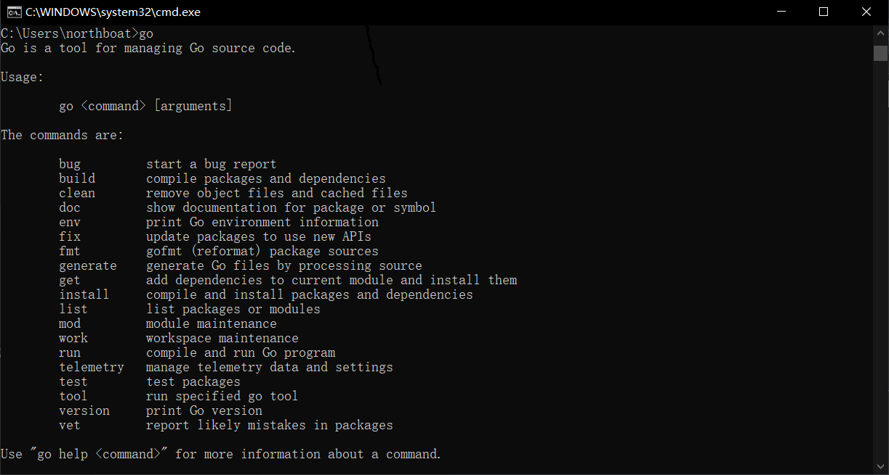

## 环境搭建

### Golang

镜像站下载：[All releases - The Go Programming Language](https://golang.google.cn/dl/)

测试版本环境

```go
go version
go env
```

### Goland

官网下载：[Other Versions - GoLand](https://www.jetbrains.com/go/download/other.html)

破解：[GoLand 2024.3.3 最新破解版安装教程（附激活码，至2099年~） - 犬小哈教程](https://www.quanxiaoha.com/goland-pojie/goland-pojie-202433.html)

🙌 PS：可以下个 Python Community Edition 插件，这玩意儿可以用来写 Python

### Go Module

从 Go1.13 开始，Go Module 作为 Golang 中的标准包管理器，在安装时自动启用，并附带一个默认的 GOPROXY

- GOPROXY 即为 GOPROXY 的下载源
- Go Module 通过配置文件 go.mod 进行包管理

公共 GOPROXY 是一个集中式的存储库，它缓存了大量开源的 Go 模块，这些模块可以从第三方公开访问的 VCS 项目存储库中获得

- 大多数此类 GOPROXY，比如 JFrog GoCenter，http://Goproxy.cn 都是免费提供给 Golang 开发社区的

公共 GOPROXY 的架构拓扑如下图，提供了 Go Module 的一致性以及可用性能力


在 Go 文件中，使用 `import()` 导入包

```go
import (
    "fmt"
    "math/rand"
)
```

创建自定义包

在 `mypackage` 目录下创建 `calculation.go` 文件：

```go
package mypackage

func Add(a, b int) int {
    return a + b
}
```

在 `main.go` 中使用自定义包：

```go
import (
    "fmt"
    "mypackage"
)

func main() {
    result := mypackage.Add(3, 5)
    fmt.Println(result) // 输出: 8
}
```

注意，Go 语言中**函数（或变量、结构体等）的可见性**是由其**首字母的大小写**决定的。具体规则如下

- 首字母大写：表示该函数（或变量、结构体等）是导出的（exported），可以被其他包访问
- 首字母小写：表示该函数（或变量、结构体等）是未导出的（unexported），只能在当前包内访问

文件名其实不重要，重要的是文件夹名，因为在 Main 函数中调用时，采用的是`文件夹名.大写函数()`的形式进行调用

## 基础语法

Golang 基础

- 基础语法：变量、数据类型、控制结构（if/for/switch）、函数
- 数据结构：数组、切片、映射（map）、指针
- 结构体与接口：面向对象的编程方式
- 并发编程：Goroutine、Channel、WaitGroup、Mutex

多写小项目，比如用 Go 实现一个简单的 CLI 工具；使用 `go test` 进行单元测试，熟悉测试框架

第一个 Go 程序

```go
package main
import (
	"fmt"
)

func main() {
	s := "Hello Golang!"
	fmt.Println(s)
	for i := 1; i <= 5; i++ {
		fmt.Println("i =", 100/i)
	}
}
```

### 变量与常量

变量定义

- 定义变量无需指定变量类型，同时使用`:=`进行定义
- 语句通过换行分割，不用分号（类似于 Python），但仍然使用括号，并不采用缩进来表示嵌套层级

`fmt.Printf`输出

```go
num := 4
str := "hahaha"
float := 3.14
char := 'A'
fmt.Printf("%d, %s, %f, %c\n", num, str, float, char)
fmt.Printf("%v, %v, %v, %v", num, str, float, char)
```

`%v`是通用输出，浮点数将被就近“取整”，例如上面的例子，第一次将输出`3.140000`，第二次则是`3.14`。另外，`%v`下字符将被输出为 ASCII 码

```bash
4, hahaha, 3.140000, A
4, hahaha, 3.14, 65
```

`fmt.Println`输出，用于快速调试，应该是用的最多的

- `fmt.Println` 会在每个参数之间自动插入**空格**
- 并在结尾添加**换行符**（`\n`），若不想换行，可用`Print`（`Print`不会自动添加空格）

### 控制结构

1️⃣ if 语句

Go 的 `if` 语句和 Java 类似，但条件语句不需要括号，而大括号`{}`必须存在

```go
if age > 18 {
    fmt.Println("Adult")
}
```

在`if`语句中可以定义变量，例如

```go
num := rand.Int() // 取随机数
if i := num - 3875633537609512361; i > 0 {
    fmt.Println(i, mypackage.SayHello())
} else {
    fmt.Println(i, mypackage.SayHelloAgain())
}
```

这个`i`的作用域仅在`if`域中

2️⃣ for 语句

Go 中没有 While 循环，采用 for 代替
$$
while(true)\{\}=for\{\}
$$
一个经典的 for 循环，只是在 Java 的基础上去掉了小括号

```go
for i := 0; i < 5; i++ {
    fmt.Println(i)
}
```

一个死循环

```go
for{
    fmt.Println("nmsl")
}
```

一个类似于 while 的 for 循环

```go
i := 0
for i < 5 {
    fmt.Println(i)
    i++
}
```

但是注意不可以`i++ < 5`这样判断

3️⃣ switch 语句

Go 的`switch`不需要`break`，匹配成功后默认不会继续执行下一个 case，不像 Java 那样需要`break`手动跳出

```go
day := "Monday"
switch day {
case "Monday":
    fmt.Println("Start of the week")
case "Friday":
    fmt.Println("Weekend is near")
default:
    fmt.Println("Midweek")
}
fmt.Println("Start TestSwitch()!\n")
```

多值匹配，用逗号连接

```go
switch day {
case "Saturday", "Sunday":
    fmt.Println("Weekend")
default:
    fmt.Println("Weekday")
}
```

switch 后可以不接变量，而在 case 后添加布尔值，这样 switch 语句将执行第一个为 true 的 case，当作一个 if-else 语句来用

```go
score := 85
switch {
case score >= 90:
    fmt.Println("A")
case score >= 80:
    fmt.Println("B")
default:
    fmt.Println("C")
}
```

使用`fallthrough`修饰 case，那么执行完当前 case 后将继续执行下一个 case

```go
switch num := 2; num {
case 1:
    fmt.Println("One")
case 2:
    fmt.Println("Two")
    fallthrough  // 继续执行下一个 case
case 3:
    fmt.Println("Three")
case 4:
    fmt.Println("Four")
}
```

当然，只往下执行一条，即输出会为

```sh
Two
Three
```

### 函数

> 在 Go 中，函数（Function）是**一等公民**，可以作为参数、返回值，也可以是匿名函数

函数定义，在 go 中，使用关键字`func`定义一个函数

```go
func 函数名(参数列表) (返回值列表) {
    // 函数体
}
```

根据入参和返回，有这样几种函数定义

1️⃣ 无入参无返回

```go
func sayHello() {
    fmt.Println("Hello, Go!")
}
```

2️⃣ 有入参无返回

```go
func add(x int, y int) {
    fmt.Println("Sum:", x+y)
}
```

如果多个参数类型相同，可以省略前面的类型，只写最后一个，如

```go
func hello(x, y int, name string){
    fmt.Println("Hello,", name)
    fmt.Println("Sum:", x+y)
}
```

另外，注意**参数是值传递，不会影响原变量**

3️⃣ 有返回

```go
func add(x, y int) int {
    return x + y
}
```

在小括号后定义返回类型，如这里定义返回类型为`int`

可以定义多个返回值（而不需要用数组返回）

```go
func swap(a, b int) (int, int) {
    return b, a
}
```

4️⃣ 命名返回值

我们可以在返回值列表直接定义返回变量名，从而在`return`时，可以省略掉`return`的变量，像一个无返回的函数直接`return`就行

```go
func rectangleArea(length, width int) (area int) {
    area = length * width
    return // 省略 return area
}

func main() {
    fmt.Println(rectangleArea(5, 10)) // 50
}
```

实际上，就是在定义函数的时候创建了这个返回变量，很智能的设计，适合下发开发任务 🤓，最规范的一集

5️⃣ 变长入参

- 入参列表`(numbers ...int)` 会把所有参数作为**切片**处理
- 可变参数可以和普通参数混用，但**可变参数必须放在最后**

```go
func sum(numbers ...int) int {
    total := 0
    for _, num := range numbers {
        total += num
    }
    return total
}

func main() {
    fmt.Println(sum(1, 2, 3, 4)) // 10
}
```

那么问题来了，这和我直接传一个切片有什么区别

6️⃣ 函数作为入参

```go
func operate(a, b int, op func(int, int) int) int {
    return op(a, b)
}

func main() {
    add := func(x, y int) int { return x + y }
    result := operate(3, 5, add)
    fmt.Println(result) // 8
}
```

这里的函数 op 是变化的，它可以是 add，也可以是 mul 或其他

- 这样的设计在 MyLisp 的编写中见过，内建函数的实现采用了这种形式

7️⃣ 函数作为返回

```go
func multiplier(factor int) func(int) int {
    return func(x int) int {
        return x * factor
    }
}

func main() {
    double := multiplier(2)
    fmt.Println(double(5)) // 10
}
```

在这里`double`作为一个函数变量存在，好玩捏

8️⃣ 匿名函数

即时定义并使用

```go
func main() {
    func(msg string) {
        fmt.Println(msg)
    }("Hello, Go!") // 直接调用
}
```

这是一个有入参无返回的匿名函数，执行将输出`Hello, Go!`

### 命名习惯

我们的文件夹名原则上要和包名（package 名）保持一致，即在 learning 文件夹下的所有文件都有

```go
package learning
```

而不是其他包名

一些命名习惯

- 文件命名：小写字母加下划线，例如`my_mysql_test`
- 文件夹、包命名：小写字母连接，比如`mycontrolflow`，应尽量缩小为单个单词如`flow`
- 变量命名：小写字母起头驼峰，比如`numSum := 0`
- 常量命名：大写字母加下划线，比如`KEY_NUM := 4`
- 函数、结构体、接口、方法命名：驼峰，开头大小写根据 exported 决定，比如`Add(), add()`
- 测试函数命名：Test 开头的驼峰，比如`TestAdd()`

## 数据结构

### 数组和切片

切片的定义：`[]数据类型{初始数据1, 初始数据2, ...}`

```go
nums := []int{1, 2, 3}
fnums := []float64{3.14, 2.71, 1.618}
words := []string{"Hello", "Go", "Language"}
flags := []bool{true, false, true}
data := []byte{'a', 'b', 'c'}

// 指针切片
x, y, z := 10, 20, 30
numbers := []*int{&x, &y, &z}
fmt.Println(*numbers[0], *numbers[1], *numbers[2]) // 10 20 30
```

若想定义空的切片有这样三种方法

```go
nums := make([]int, 0) // 创建一个容量为 0 的切片
nums := []int{}
var nums []int
```

推荐第一种，当然，如果有 nil 的判断，即判断`nums == nil`是否为空的操作，推荐第三种初始化（在网络编程中，例如 Json 传输，似乎第三种更有利）

切片操作：相当于定义一个 List，然后不断 add 和修改

```go
nums := make([]int, 0) // 定义一个空的切片

// 追加元素
nums = append(nums, 1)
nums = append(nums, 2, 3, 4)
fmt.Println(nums) // 输出: [1 2 3 4]

// 修改元素
nums[0] = 10
fmt.Println(nums) // 输出: [10 2 3 4]
```

可以通过内建的`len()`和`cap()`函数来获取切片的长度和容量

- `len()`返回切片的元素个数（即切片的长度）
- `cap()`返回切片的底层数组的容量（即切片所能容纳的元素个数，不一定是当前的长度

```go
nums := []int{1, 2, 3, 4}

fmt.Println("Length:", len(nums)) // 输出: Length: 4
fmt.Println("Capacity:", cap(nums)) // 输出: Capacity: 4（或更大，取决于底层数组的扩展）
```

函数返回

- 数组是定长的，在定义时必须规定长度，类似于 C 中的数组，在函数返回数组时，将复制整个数据结构进行返回，所以函数返回顺序结构时，绝大部分都是选择返回切片
- 切片是引用类型（指针），返回时不会复制底层数据，而是返回其起始指针

函数返回数组和切片

```go
// 返回切片
func getSlice() []int {
	var nums []int
	// nums := make([]int, 0)
	nums = append(nums, 1, 2, 3, 4)
	return nums
}

// 返回一个长度为 3 的整型数组，不会使用
func getArray() [3]int {
	return [3]int{1, 2, 3}
}
```

之前在说到函数接收变长参数时提到一个问题，就是：我定义一个变长参数入参和定义一个切片入参有什么区别？

```go
func Sum() int {
	return Sum1(getSlice()...)
}

func Sum1(nums ...int) int {
	sum := 0
	for _, value := range nums {
		sum += value
	}
	return sum
}

func Sum2(nums []int) int {
	sum := 0
	for _, value := range nums {
		sum += value
	}
	return sum
}
```

乍一看确实好像没有什么区别，但实际上还是有些微差别，照 GPT 的说法，可变入参似乎好于切片入参

1. 如果是`(nums ... int)`入参，入参可以为空，但切片不行，至少需要传入一个`nil`或空切片`[]int{}`（需要显式传切片）

2. 可变入参可以接受切片作为入参，用以下形式

   ```go
   nums := []int{1, 2, 3, 4}
   Sum1(nums...)  // ✅ 正确，将返回 10
   ```

简单来说：可变入参可以兼容切片，而切片无法兼容多个独立数字

使用 for 和 range 遍历切片

```go
nums := []int{1, 2, 3}
for index, value := range nums {
    fmt.Println(index, value)
}
```

当不需要使用 index 时，用`_`替代

```go
nums := []int{1, 2, 3}
sum := 0
for _, value := range nums {
    sum += value
}
fmt.Println(sum) // 输出 6
```

### 映射

map 的定义：`map[键]值{}`第一个中括号为**键**类型，之后跟**值**类型，大括号中为初始数据

```go
strMapInt := make(map[string]int)
intMapInt := make(map[int]int)
intMapStr := make(map[int]string)

var strMapInt1 map[string]int
strMapInt2 := map[string]int{}
```

定义逻辑其实和切片一样，特别是初始化空的情况，用 make 或者 var

追加元素：直接定义就行，比如对于`m := make(map[string]string)`，想要插入元素，直接用`m["nmsl"] = wdnmd`就行，他会自行判断容量自动扩容

- 太智能了，逆天

函数返回 map

```go
// 返回一个 map
func getMap() map[string]int {
    var m map[string]int
    // m := map[string]int{}
    // m := make(map[string]int)
    m["one"] = 1
    m["two"] = 2
    return m
}

// 创建函数时定义返回变量
func getMap1() (m map[string]int) {
    m["one"] = 1
    m["two"] = 2
    return
}
```

使用 for 和 range 遍历映射

```go
m := map[string]int{"a": 1, "b": 2}
for k, v := range m {
    fmt.Println(k, v)
}
```

其他的遍历，两数之和

```go
func twoSum(nums []int, target int) []int {
    m := make(map[int]int)
    for index, val := range nums{
        if preIndex, preVal := m[target-val]; preVal{
            return []int{preIndex, index}
        }
        m[val] = index
    }
    return nil
}
```

重点是第四行的 if 语句，这句到底干了什么

```go
if preIndex, preVal := m[target-val]; preVal{}
```

我们只需要明确，`m[target-val]`到底返回的是什么，其实是两个值，分别是索引和值内容，if 最后的`prevVal`实际上就是在判断这个索引下到底存不存在内容

信息量是否有点大，我糙你的，实际上等价于

```go
for index, val := range nums{
    preIndex, preVal := m[target-val]
    if preVal{
        return []int{preIndex, index}
    }
    m[val] = index
}
```

if 语句里面能进行**变量短声明**极大的压缩了编码

### 字符串

常见的字符串处理，Go 语言的`string`是**不可变**的字节序列，常见的字符串操作涉及**拼接、截取、查找、替换、遍历、转换**等，Go 主要依赖`strings`和`strconv`标准库来进行字符串操作

定义，函数返回时，返回类型只有在多个的时候才能加小括号，单个必须无小括号

```GO
func getStr() (string, string) {
    str1 := `nmsl java
			wdnmd python
			wcsn c++`
    str2 := "qnmd golang"
    return str1, str2
}
```

字符串拼接：+ 号拼接即可

```go
func catStr(str1, str2 string) string {
    return str1 + str2
}
```

追加字符：使用`strings.Builder`

```go
func appendChars(original string, chars ...rune) string {
    var builder strings.Builder

    // 预先分配足够空间（可选优化）
    builder.Grow(len(original) + len(chars))

    // 写入原始字符串
    builder.WriteString(original)

    // 逐个追加字符
    for _, c := range chars {
        builder.WriteRune(c)
    }

    return builder.String()
}
```

取单个字符

1. 在 go 中，用 rune 表示单个字符

   ```go
   func getChar1(str string, index int) rune {
       return rune(str[index])
   }
   ```

2. 或者返回单个字符的 string

   ```go
   func getChar2(str string, index int) string {
       return str[index : index+1]
   }
   ```

获取字符串长度：len 函数，这个不仅可以量取 string，切片也行

```go
s := "世界"
for i, r := range s { // r 的类型是 rune
    if i == len(s)-1 {
        fmt.Printf("%c\n", r) // 输出: 世
        continue
    }
    fmt.Printf("%c\t", r)
}
```

注意，若是存在中文，用 len() 加下标的形式遍历可能会乱码，每个取的 r 实际上是一个 rune 类型

- 如果直接下标取值，即`s[i]`），得到的会是一个 byte 类型

另外不管是`[]rune`还是`[]byte`都会存在中文乱码的情况，我们需要明确的是，这两种遍历方式，只是将 string 进行了一定程度的转化得到的，而 string 本身其实既不是 rune 数组也不是 byte 数组，他们仨有本质区别

| 特性               | string                 | []rune                | []byte           |
| :----------------- | :--------------------- | :-------------------- | :--------------- |
| **底层类型**       | 只读的字节序列         | int32 数组            | uint8 数组       |
| **编码方式**       | UTF-8 编码             | Unicode 码点          | 原始字节         |
| **字符表示**       | 自动处理 UTF-8         | 直接表示 Unicode 字符 | 仅表示单字节     |
| **可变性**         | 不可变                 | 可变                  | 可变             |
| **索引访问返回值** | byte (uint8)           | rune (int32)          | byte (uint8)     |
| **内存占用**       | 按需分配 1-4 字节/字符 | 固定 4 字节/字符      | 固定 1 字节/元素 |
| **长度计算**       | len() 返回字节数       | len() 返回字符数      | len() 返回字节数 |
| **for range 行为** | 迭代 rune              | 迭代 rune             | 迭代 byte        |

获取 UTF8 长度并遍历，我想在每个字符之间加逗号分隔

- 这里的逻辑和我之前很不一样，取大于 0 的位置的所有字符，在这些**字符前加入逗号**以实现需求

```go
import "unicode/utf8"

func getLen(str string) int {
    length := utf8.RuneCountInString(str)
    return length
}

func main(){
    s := "世界"
    fmt.Println(s)
    fmt.Println(len(s))
    fmt.Println(getLen(s))

    var builder strings.Builder
    for i, r := range s {
        if i > 0 {
            builder.WriteString(", ")
        }
        builder.WriteRune(r)
    }
    fmt.Println(builder.String())
}
```

输出

```sh
世界
6
2
世, 界
```

字符串截取

```go
ss := "Hello, Go!"
sub1 := ss[7:]          // 从索引 7 开始截取
sub2 := ss[0:5]         // 从 0 截取到 5，含头含尾
fmt.Println(sub1, sub2) // Go! Hello
```

拆分字符串：strings.Split

```go
import "strings"

s := "Go,Python,Java"
words := strings.Split(s, ",")
fmt.Println(words) // ["Go", "Python", "Java"]
```

去除首尾空格或指定字符：strings.TrimSpace

```go
import "strings"

s := "   Hello, Go!   "
fmt.Println(strings.TrimSpace(s)) // "Hello, Go!"
```

### 结构体

> 面向对象编程：封装、继承、多态

不同于 Java，结构体的定义和其功能的实现并不在同一域，比方

我先定义一个结构体 Account

```go
type Account struct {
    Id       string
    Name     string
    Password string
}
```

而后我想实现他的功能，比如登录、修改密码

- 直接定义函数，通过在 func 后的小括号指定其所属的结构体
- 这个小括号叫做**接收者**

```go
func (account *Account) CheckPassword(id, name, password string) map[string]string {
    if id != account.Id && name != account.Name {
        return map[string]string{"code": "401", "msg": "Account Not Found"}
    }
    flag := (id == "" && name == account.Name && password == account.Password) || (id == account.Id && password == account.Password)
    if flag {
        return map[string]string{"code": "200", "msg": "Login Success"}
    }
    return map[string]string{"code": "400", "msg": "Login Failed, Wrong PWD"}
}

func (account *Account) ChangePassword(id, name, password, newPassword string) bool {
    if account.Id == id && account.Name == name && account.Password == password {
        account.Password = newPassword
        return true
    }
    return false
}
```

在 Main 中创建并调用

```go
package main

import (
    "Go/learning"
    "fmt"
)

func main() {
    account := learning.Account{Id: "1", Name: "test", Password: "123456"}

    fmt.Println(account)
    fmt.Println(account.CheckPassword("", "test1", "123456"))
}
```

值得注意的点是，在定义接受者的时候，如果没有`*`号，则为值传递（否则为指针传递），值传递时，改变传入的 account 时，将不会对对象原本的值做改变（值是复制进来的）

只有在传入指针时，原结构体的数据才是可修改的（传的是原数据地址）

### 接口

> 在 Go 语言中，接口（interface）是一种抽象类型，定义了一组方法，但**不包含具体实现**
>

接口提供了一种灵活的方式，使不同类型的对象可以共享相同的行为，同时支持多态编程

定义接口

```go
import "fmt"

// 定义一个接口
type Speaker interface {
    Speak() string
    Run() string
}

// 定义一个结构体
type Animal struct {
    Name string
    Type string
}

// 让 Animal 实现 Speaker 接口
func (d Animal) Speak() string {
    return "I'm " + d.Name + ", I'm a " + d.Type
}

func (d Animal) Run() string {
    return "The " + d.Type + " " + d.Name + " is running"
}

func TestInterface() {
    var s Speaker
    s = Animal{Name: "Buddy", Type: "Dog"}
    fmt.Println(s.Speak())
    fmt.Println(s.Run())
}
```

Main 中调用

```go
package main

import (
    "Go/learning"
    "fmt"
)

func main() {
    learning.TestInterface()
}
```

输出

```sh
I'm Buddy, I'm a Dog
The Dog Buddy is running
```

结构体和接口区别

| 特性               | 结构体（Struct） | 接口（Interface）    |
| ------------------ | ---------------- | -------------------- |
| 是否包含数据       | ✅ 有字段         | ❌ 只有方法声明       |
| 是否需要显式实现   | ❌ 不需要         | ❌ 不需要（自动匹配） |
| 是否可以存不同类型 | ❌ 不能           | ✅ 可以               |
| 是否支持多态       | ❌ 不支持         | ✅ 支持               |

另外，还可以用 interface 定义函数体的返回，这样相当于 Java 中返回 Object 类，即可返回任意类型

```go
func TestInterfaceFunc(a int) interface {
    if a >= 0 {
        return 95
    } else {
        return "hahaha"
    }
}
```

## 并发编程

Go 语言的协程（goroutine）和通道（channel）是其并发模型的核心

### Goroutine 协程

Goroutine 是 Go 语言中的一种轻量级线程，它由 Go 运行时（runtime）管理，用户不需要手动管理线程。相比操作系统级别的线程，Goroutine 更加高效，可以轻松创建数十万个 Goroutine，而不会导致大量的资源消耗

特点

- 轻量级：Goroutine 初始栈大小只有 2KB，远小于操作系统线程（通常 1MB）
- 调度管理由 Go 运行时（runtime）负责：Go 运行时使用 GPM（Goroutine、线程、调度器）模型管理 Goroutine
- 自动增长栈：Goroutine 的栈大小是动态扩展的，不会一次性占用大量内存
- 非阻塞 I/O：Goroutine 采用非阻塞 I/O，适合高并发场景

使用 go 关键字创建一个协程（？是否太草率了点）

```go
import (
    "time"
)

func TestGoroutine() {
    go TestInterface()
    time.Sleep(3 * time.Second)
}
```

Main 函数

```go
func main(){
    learning.TestGoroutine()
}
```

输出

```sh
I'm Buddy, I'm a Dog
The Dog Buddy is running
```

**注意：** `main`函数是主 Goroutine，若它执行完毕，所有子 Goroutine 也会立即结束，因此需要`time.Sleep`等待子 Goroutine 执行（这里手动等了 3s）

也就是说，如果不等，有可能子协程并没有执行，整个程序就跑完了，非阻塞，这和 Java 的线程很不一样（在 Java 里，主线程是需要等待子线程执行完毕才结束的）

在 Go 中，Goroutine 默认是并发的，而不是并行的。如果要让 Go 充分利用多核 CPU 并行执行，需要使用

```go
import "runtime"

func main() {
    runtime.GOMAXPROCS(runtime.NumCPU()) // 设置使用 CPU 核心数
}
```

### Channel 通道

Channel 是 Go 语言中用于**协程之间通信**的数据结构，可以在多个 Goroutine 之间传输数据

**为什么需要 Channel？**

- Goroutine 之间共享内存可能导致数据竞争，Channel 提供了一种安全的数据传输方式
- Go 语言**提倡通过通信共享内存**，而不是通过共享内存进行通信（CSP 模型）

创建一个 int 类型的通道 chan

```go
ch := make(chan int)
```

简单的发送和接收

```go
func TestChannel() {
    ch1 := make(chan int)
    ch2 := make(chan string)

    go func() {
        ch1 <- 42 // 发送数据
    }()

    go func() {
        time.Sleep(1 * time.Second)
        ch2 <- "nmsl"
    }()

    num := <-ch1     // 接收数据
    str := <-ch2     // 会被阻塞 1s
    fmt.Println(num) // 输出 42
    fmt.Println(str) // 输出 nmsl
}
```

Channel 的阻塞特性

- 发送操作 `<-` 会阻塞，直到数据被接收
- 接收操作 `<-` 会阻塞，直到数据被发送

如上述`str := <-ch2`会被阻塞 1s 才输出

### Select 语句及超时控制

`select`语句类似`switch`，专用于处理`channel`的并发通信

- `select`会等待某个`case`变为可用（即`channel`有数据）
- `default`分支可选，如果所有`case`都阻塞，`default`立即执行

```go
func main() {
    ch1 := make(chan string)
    ch2 := make(chan string)

    go func() {
        time.Sleep(2 * time.Second)
        ch1 <- "Message from ch1"
    }()

    go func() {
        time.Sleep(1 * time.Second)
        ch2 <- "Message from ch2"
    }()

    select {
    case msg1 := <-ch1:
        fmt.Println("Received:", msg1)
    case msg2 := <-ch2:
        fmt.Println("Received:", msg2)
    case <-time.After(3 * time.Second): // 超时控制
        fmt.Println("Timeout!")
    }
}
```

### 单向、缓冲 Chnnel 和 GPM

单向 Channel

```go
func sendData(ch chan<- int) { // 只能发送数据
    ch <- 100
}

func receiveData(ch <-chan int) { // 只能接收数据
    fmt.Println(<-ch)
}
```

带缓冲的 Channel：默认的 Channel 是无缓冲的，发送和接收必须同步进行。如果想要异步通信，可以使用带缓冲的 Channel

```go
ch := make(chan int, 3) // 创建一个最多存储 3 个 int 的缓冲通道
```

```go
package main

import "fmt"

func main() {
    ch := make(chan int, 2) // 容量为 2

    ch <- 1
    ch <- 2
    // ch <- 3 // 若继续写入，会发生死锁（fatal error）

    fmt.Println(<-ch) // 1
    fmt.Println(<-ch) // 2
}
```

GPM 调度机制：GPM 是 Go 语言运行时（runtime）用于管理 Goroutine 并发执行的调度模型，它由 Goroutine、Processor 和 Machine 组成，保证 Goroutine 高效执行，同时避免不必要的线程创建和销毁

| 组件             | 作用                                          |
| ---------------- | --------------------------------------------- |
| G（Goroutine）   | Go 协程，执行具体的任务                       |
| P（Processor）   | 逻辑处理器，负责调度 Goroutine 并提供执行环境 |
| M（Machine**）** | OS 线程，代表操作系统的线程，运行 Go 代码     |

GPM 关系图

```sh
多个 Goroutine 绑定到 Processor（P），Processor 绑定到 Machine（M），Machine 由 OS 线程提供

OS 线程（M1）  OS 线程（M2）  ...
    |              |
Processor（P1）  Processor（P2） ...
    |              |
Goroutine（G1, G2, G3...）
```

## Gin 基础

实现一个简单的学生管理系统后端

1. 包管理：学习`go mod`进行包管理
2. 接口编写：采用 MVC 架构编写实现一个成绩管理系统后端，暂不考虑数据库交互
3. 系统化理解 Gin

感觉类似于 Flask

### First Gin

在项目根目录命令行导入 gin

```sh
go get -u github.com/gin-gonic/gin
```

Go 的包管理工具整合在 go 命令中，可以通过 go get 直接导入 http 包，并自动更新 go.mod 文件（类似于 pip install）



在 Main 函数中启动 Gin 服务器，定义一个简单的 ping 路由（接口）

```go
package main

import (
	"github.com/gin-gonic/gin"
	"net/http"
)


func main() {
	r := gin.Default()

	// 定义一个简单的路由
	r.GET("/ping", func(c *gin.Context) {
		c.JSON(http.StatusOK, gin.H{
			"message": "pong",
		})
	})

	// 启动服务，监听 8080 端口
	r.Run(":8080")
}
```

在浏览器中访问`localhost://8080/ping`就会得到 Json 格式的返回`{"message":"pong"}`

项目目录结构


其中

- config 放配置文件 config.yaml 并导入 gin
- utils 编写工具类
- model 编写 dto 等实体类
- repository 编写数据库操作
- service 编写具体业务操作
- controller 编写具体的 api 实现
- routes 整合 controller 方法，向外暴露 http 接口

基本的 MVC 架构，和 Java 类似

### 配置 Config

安装 yaml 文件解析工具

```sh
go get gopkg.in/yaml.v3
```

在 config 目录下编写配置文件 config.yaml，等同于 application.yaml

```yaml
server:
  port: 12345

mysql:
  host: "127.0.0.1"
  port: 3306
  user: "root"
  password: ""

#redis:
#  host: "127.0.0.1"
#  port: 6379
#  password: ""
#  db: 0
```

而后编写 config.go 通过`yaml.v3`包进行解析，将配置写进全局变量 AppConfig 中

```go
package config

import (
    "fmt"
    "gopkg.in/yaml.v3"
    "os"
)

type Config struct {
    Server ServerConfig `yaml:"server"`
    MySQL  MySQLConfig  `yaml:"mysql"`
}

type ServerConfig struct {
    Port int    `yaml:"port"`
    Host string `yaml:"host"`
}

type MySQLConfig struct {
    Host     string `yaml:"host"`
    Port     int    `yaml:"port"`
    Username string `yaml:"username"`
    Password string `yaml:"password"`
}

var AppConfig Config

func LoadConfig() {
    file, err := os.ReadFile("config/config.yaml")
    if err != nil {
        panic(fmt.Sprintf("无法加载配置文件: %v", err))
    }
    err = yaml.Unmarshal(file, &AppConfig)
    if err != nil {
        panic(fmt.Sprintf("解析 YAML 失败: %v", err))
    }
}
```

我们在其余文件中直接调用这个全局变量 AppConfig 来实现项目的配置

### Model 层

> Pojo / DTO 对象

只考虑两个类，一个 Student 一个 Grade，涉及两张表

```go
type Student struct {
    ID     int
    Name   string
    Gender int
}

type Grade struct {
    SubjectID int
    StudentID int
    Score     float64
}
```

其中 Student.ID 为 student 表的主键，SubjectID 和 StudentID 为 grade 的联合主键

另外 Student 中还有带成绩的 DTO，用于前端传输展示

```go
type StudentWithGrades struct {
    ID     int
    Name   string
    Gender int
    Grades map[int]float64
}

type StudentWithSubjectTag struct {
    ID     int
    Name   string
    Gender int
    Grades map[string]float64
}
```

还有一些常规的统计功能，比如统计总分的函数，统计三门科目的函数等等

### Data Access Object

> Dao 层，数据库对象操作，repository 目录

Grade：初始化 Grade 数据，以及定义 SubjectID 到 SubjectName 的一个映射

```go
var Subjects = map[int]string{
    1: "语文",
    2: "数学",
    3: "英语",
    4: "物理",
    5: "化学",
    6: "生物",
    7: "政治",
    8: "历史",
    9: "地理",
}

var Grades = []model.Grade{
    {1, 1, 60},
    {2, 1, 60},
    {3, 1, 60},
    {4, 1, 60},
    {5, 1, 60},
    {6, 1, 60},
    {7, 1, 60},
    {8, 1, 60},
    {9, 1, 60},
}
```

为什么不直接在数据库表中多定义一个 SubjectName 的字段呢？

- 完全没必要，因为就只有 9 个映射，如果多定义一个字段，每一个数据项都要加一个 Name(varchar)，是完全没必要的存储开销

实现一些常规的 CRUD 函数，比如添加成绩记录、获取学生成绩、根据 Student / StudentWithGrades 构造 StudentWithSubjectTag

Student：同样的静态初始化后台数据

```go
var students = []model.Student{
    {1, "熊熊", 1},
    {2, "球吊", 1},
    {3, "TM", 1},
    {4, "戴某", 1},
    {5, "兴根", 1},
    {6, "郭某", 1},
    {7, "强哥", 1},
    {8, "彭奇", 1},
}
```

实现一些 CRUD 函数，比如根据 ID/Name 查找学生、添加学生、删除学生、获取学生列表等操作

### Service 封装

对 DAO 层进行进一步的封装，向上层（即 Controller）提供直接使用的业务函数

### 接口和路由

> controller & routes

使用 Gin Web 框架开发 Web 接口时的标准函数写法

```go
func GetRank(c *gin.Context) {
    // 处理请求的逻辑
}
```

`c *gin.Context`

- 是这个函数的参数，类型是`gin.Context`
- 这个参数是 Gin 框架**每次处理请求时传进来的上下文对象**
- 它包含了请求信息、响应对象、路径参数、请求体、查询参数等

接口函数没有返回值，是因为

- Gin 的路由处理函数**通常不直接返回值**
- 而通过`c.JSON()`、`c.String()`等方法直接向客户端写响应

比如

```go
func GetRank(c *gin.Context) {
    // []model.StudentWithSubjectTag
    c.JSON(http.StatusOK, service.GetStudentsSortedByAllSubjects())
}

func GetTop(c *gin.Context) {
    // map[string]model.StudentWithSubjectTag
    c.JSON(http.StatusOK, service.GetTopStudents())
}
```

在 routes 中注册

```go
func SetupRouter() *gin.Engine {
    r := gin.Default()

    r.GET("/ping", func(c *gin.Context) {
        c.JSON(200, gin.H{
            "message": "pong",
        })
    })

    r.GET("/getRank", controller.GetRank)
    r.GET("/getTop", controller.GetTop)
    return r
}
```

相应的，在 Main 函数中调用 SetupRouter 返回的 Gin 启动运行服务

```go
func main() {
    config.LoadConfig()
    r := routes.SetupRouter()
    // 启动服务，监听 12345 端口
    r.Run(":" + strconv.Itoa(config.AppConfig.Server.Port))
}
```

### 前后端交互

> html/template

go 有自带库`html/template`用于前后端数据交换，在 gin 中设置模板目录和访问首页

```go
func SetupRouter() *gin.Engine {
    r := gin.Default()
    // 设置模板目录
    r.LoadHTMLGlob("templates/*")
    // 处理静态资源
    r.Static("/static", "./static")
    // 访问首页
    r.GET("/", func(c *gin.Context) {
        c.HTML(http.StatusOK, "index.html", gin.H{
            "title":    "首页",
            "username": "北船",
        })
    })
    return r
}
```

注意这个函数就是 routes/routes.go 中的函数，和路由配置在一块（这里省略了接口的配置代码）
