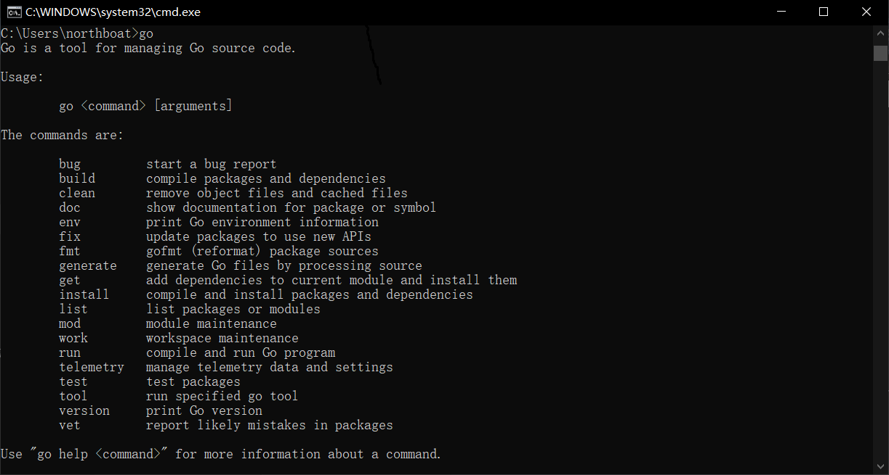
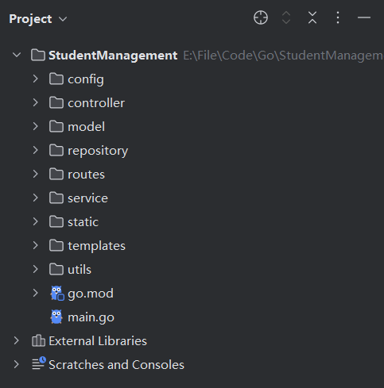

## Gin 基础

实现一个简单的学生管理系统后端

1. 包管理：学习`go mod`进行包管理
2. 接口编写：采用 MVC 架构编写实现一个成绩管理系统后端，暂不考虑数据库交互
3. 系统化理解 Gin

感觉类似于 Flask

### First Gin

在项目根目录命令行导入 gin

```sh
go get -u github.com/gin-gonic/gin
```

Go 的包管理工具整合在 go 命令中，可以通过 go get 直接导入 http 包，并自动更新 go.mod 文件（类似于 pip install）



在 Main 函数中启动 Gin 服务器，定义一个简单的 ping 路由（接口）

```go
package main

import (
	"github.com/gin-gonic/gin"
	"net/http"
)


func main() {
	r := gin.Default()

	// 定义一个简单的路由
	r.GET("/ping", func(c *gin.Context) {
		c.JSON(http.StatusOK, gin.H{
			"message": "pong",
		})
	})

	// 启动服务，监听 8080 端口
	r.Run(":8080")
}
```

在浏览器中访问`localhost://8080/ping`就会得到 Json 格式的返回`{"message":"pong"}`

学生管理系统后端的项目目录结构参考如下



其中

- config 放配置文件 config.yaml 并导入 gin
- utils 编写工具类
- model 编写 dto 等实体类
- repository 编写数据库操作
- service 编写具体业务操作
- controller 编写具体的 api 实现
- routes 整合 controller 方法，向外暴露 http 接口

基本的 MVC 架构，和 Java 类似

### 配置文件 config

安装 yaml 文件解析工具

```sh
go get gopkg.in/yaml.v3
```

在 config 目录下编写配置文件 config.yaml，等同于 application.yaml

```yaml
server:
  port: 12345

mysql:
  host: "127.0.0.1"
  port: 3306
  user: "root"
  password: ""

#redis:
#  host: "127.0.0.1"
#  port: 6379
#  password: ""
#  db: 0
```

而后编写 config.go 通过`yaml.v3`包进行解析，将配置写进全局变量 AppConfig 中

```go
package config

import (
    "fmt"
    "gopkg.in/yaml.v3"
    "os"
)

type Config struct {
    Server ServerConfig `yaml:"server"`
    MySQL  MySQLConfig  `yaml:"mysql"`
}

type ServerConfig struct {
    Port int    `yaml:"port"`
    Host string `yaml:"host"`
}

type MySQLConfig struct {
    Host     string `yaml:"host"`
    Port     int    `yaml:"port"`
    Username string `yaml:"username"`
    Password string `yaml:"password"`
}

var AppConfig Config

func LoadConfig() {
    file, err := os.ReadFile("config/config.yaml")
    if err != nil {
        panic(fmt.Sprintf("无法加载配置文件: %v", err))
    }
    err = yaml.Unmarshal(file, &AppConfig)
    if err != nil {
        panic(fmt.Sprintf("解析 YAML 失败: %v", err))
    }
}
```

我们在其余文件中直接调用这个全局变量 AppConfig 来实现项目的配置

### Model 层

> Pojo / DTO 对象

只考虑两个类，一个 Student 一个 Grade，涉及两张表

```go
type Student struct {
    ID     int
    Name   string
    Gender int
}

type Grade struct {
    SubjectID int
    StudentID int
    Score     float64
}
```

其中 Student.ID 为 student 表的主键，SubjectID 和 StudentID 为 grade 的联合主键

另外 Student 中还有带成绩的 DTO，用于前端传输展示

```go
type StudentWithGrades struct {
    ID     int
    Name   string
    Gender int
    Grades map[int]float64
}

type StudentWithSubjectTag struct {
    ID     int
    Name   string
    Gender int
    Grades map[string]float64
}
```

还有一些常规的统计功能，比如统计总分的函数，统计三门科目的函数等等

### Data Access Object

> Dao 层，数据库对象操作，repository 目录

#### Grade

初始化 Grade 数据，以及定义 SubjectID 到 SubjectName 的一个映射

```go
var Subjects = map[int]string{
    1: "语文",
    2: "数学",
    3: "英语",
    4: "物理",
    5: "化学",
    6: "生物",
    7: "政治",
    8: "历史",
    9: "地理",
}

var Grades = []model.Grade{
    {1, 1, 60},
    {2, 1, 60},
    {3, 1, 60},
    {4, 1, 60},
    {5, 1, 60},
    {6, 1, 60},
    {7, 1, 60},
    {8, 1, 60},
    {9, 1, 60},
}
```

为什么不直接在数据库表中多定义一个 SubjectName 的字段呢？

- 完全没必要，因为就只有 9 个映射，如果多定义一个字段，每一个数据项都要加一个 Name(varchar)，是完全没必要的存储开销

实现一些常规的 CRUD 函数，比如添加成绩记录、获取学生成绩、根据 Student / StudentWithGrades 构造 StudentWithSubjectTag

#### Student

同样的静态初始化后台数据

```go
var students = []model.Student{
    {1, "熊熊", 1},
    {2, "球吊", 1},
    {3, "TM", 1},
    {4, "戴某", 1},
    {5, "兴根", 1},
    {6, "郭某", 1},
    {7, "强哥", 1},
    {8, "彭奇", 1},
}
```

实现一些 CRUD 函数，比如根据 ID/Name 查找学生、添加学生、删除学生、获取学生列表等操作

### Service 封装

对 DAO 层进行进一步的封装，向上层（即 Controller）提供直接使用的业务函数

### 接口和路由

> controller & routes

使用 Gin Web 框架开发 Web 接口时的标准函数写法

```go
func GetRank(c *gin.Context) {
    // 处理请求的逻辑
}
```

`c *gin.Context`

- 是这个函数的参数，类型是`gin.Context`
- 这个参数是 Gin 框架**每次处理请求时传进来的上下文对象**
- 它包含了请求信息、响应对象、路径参数、请求体、查询参数等

接口函数没有返回值，是因为

- Gin 的路由处理函数**通常不直接返回值**
- 而通过`c.JSON()`、`c.String()`等方法直接向客户端写响应

比如

```go
func GetRank(c *gin.Context) {
    // []model.StudentWithSubjectTag
    c.JSON(http.StatusOK, service.GetStudentsSortedByAllSubjects())
}

func GetTop(c *gin.Context) {
    // map[string]model.StudentWithSubjectTag
    c.JSON(http.StatusOK, service.GetTopStudents())
}
```

在 routes 中注册

```go
func SetupRouter() *gin.Engine {
    r := gin.Default()

    r.GET("/ping", func(c *gin.Context) {
        c.JSON(200, gin.H{
            "message": "pong",
        })
    })

    r.GET("/getRank", controller.GetRank)
    r.GET("/getTop", controller.GetTop)
    return r
}
```

相应的，在 Main 函数中调用 SetupRouter 返回的 Gin 启动运行服务

```go
func main() {
    config.LoadConfig()
    r := routes.SetupRouter()
    // 启动服务，监听 12345 端口
    r.Run(":" + strconv.Itoa(config.AppConfig.Server.Port))
}
```

### 前后端交互

> html/template

go 有自带库`html/template`用于前后端数据交换，在 gin 中设置模板目录和访问首页

```go
func SetupRouter() *gin.Engine {
    r := gin.Default()
    // 设置模板目录
    r.LoadHTMLGlob("templates/*")
    // 处理静态资源
    r.Static("/static", "./static")
    // 访问首页
    r.GET("/", func(c *gin.Context) {
        c.HTML(http.StatusOK, "index.html", gin.H{
            "title":    "首页",
            "username": "北船",
        })
    })
    return r
}
```

注意这个函数就是 routes/routes.go 中的函数，和路由配置在一块（这里省略了接口的配置代码）

## 数据库操作

编写 Ark-Auth-Platform 的 Dao 层

- 数据库连接
  1. MySQL：使用`gorm`（Go 的 ORM 库）进行数据库操作
  2. Redis：使用`github.com/redis/go-redis/v9`
- 编写认证平台的数据交互层，从 MySQL 存取密钥和签名信息，利用 Redis 实现用户登陆状态管理

### MySQL

> MySQL - gorm

考虑操作两个表 crypto_data 和 user_data，其中

- crypto_data 用以存储用户的密钥、签名信息
- user_data 用以存储用户的登录信息

### Redis

> Redis - github.com/redis/go-redis/v9

[分布式会话管理 - 单点登录 SSO](https://arkrypto.github.io/pages/4f5b6d/#分布式会话)，采用 Redis 做登陆状态管理，采用 Single Sign-On 策略，即单点登录

KV 设计如下

```
key: login:user:{userId}
value: jwt-token
```

Redis 的键命名有一套业界推荐的规范，即采用**冒号**作为分隔符表示数据的层级关系

一套常用的结构模板

| 类型               | 命名规则                   | 示例                      |
| ------------------ | -------------------------- | ------------------------- |
| 用户 Token 存储    | `login:token:{token}`      | `login:token:abc123`      |
| 用户 ID 映射 Token | `login:user:{userId}`      | `login:user:u001`         |
| 缓存（对象）       | `cache:{业务}:{标识}`      | `cache:user:u001`         |
| 限流               | `rate_limit:{类型}:{标识}` | `rate_limit:ip:127.0.0.1` |
| 队列               | `queue:{业务}`             | `queue:email`             |
| 计数器             | `counter:{业务}:{标识}`    | `counter:login_fail:u001` |
| 分布式锁           | `lock:{资源}`              | `lock:order:123456`       |
| 会话管理           | `session:{sessionId}`      | `session:sess_abc123`     |


## 微服务开发

使用 `Gin` 编写 RESTful API，并实现完整的业务逻辑

- Gin框架基础：路由、请求处理、中间件、JWT 认证
- 服务架构：分层设计（控制器、服务、数据访问）
- 日志与配置管理：使用`viper`进行配置管理，`zap`进行日志记录
- 微服务通信
  1. gRPC：用于高性能服务间通信
  2. Kafka / RabbitMQ：消息队列支持异步任务

搭建完整的认证平台微服务，支持 JWT 认证和用户管理

### Restful API


### gRPC

> 与 Java 加密模块进行对接

远程调用框架“竞品”

- OpenFeign（HTTP）
- Dubbo（二进制协议）

对应的注册中心

- Nacos（AP/CP）
- Zookeeper（AP）
- Eureka（CP）

### 构建与部署

`go build`命令构建

Docker 镜像构建
