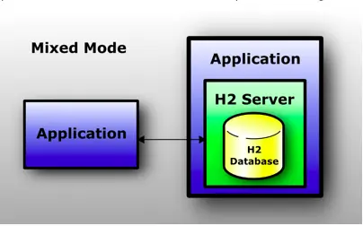

## H2DB

> [h2db新手入门篇——概念及初步使用 - 掘金](https://juejin.cn/post/6844903625039282183)

关系型内存数据库，存储关系型数据（和 MySQL）一样，数据默认存在内存中（和 Redis 一样），目前主流的内存数据库有以下

1. 关系型内存数据库：作为传统数据库应用层数据的缓存，支持 sql 语句访问数据库中的数据，提供有限的事务保证，例如 h2db
2. 键值对内存数据库：键值对存储结果，按 key 进行读取，value 支持各种数据类型，比如 redis
3. 传统数据库的内核引擎：在数据库层面提供了数据库引擎机制，最大程度减少磁盘 IO；支持事务和数据持久化保证，但对数据类型有限制，如 MySQL Memory Engine

### H2DB 概述

h2db 是纯 Java 编写的内存数据库，是一个开源项目，其源码都打包在 jar 文件中，目前稳定的最新版本 h2-1.4.196.jar 也只有 1.8M 左右

h2db 有两种工作方式：嵌入式模式和服务器模式

- 嵌入式运行模式：数据库作为整个应用的一部分，数据库 server 和应用运行在一个进程中；应用结束时，h2db server 也会关闭
- 服务器运行模式：数据库 server 运行在独立的进程中，应用通过连接和数据库 server 建立联系。该模式下又有三种连接方式，分别是 web  server 模式、TCP  server 模式，PG server 模式（PostgreSQL clients），在启动 h2db 服务时通过参数指定工作模式

由于在服务器模式下，数据要通过 TCP/IP 相关协议完成传输，所以工作效率可能低于嵌入模式

这两种模式还可以混合使用，即工作在嵌入式模式下的 h2db 允许其他应用连接，这样就是一种混合模式了。无论在哪种模式下，h2db 都支持都支持持久（persistence）和内存临时数据库（in-memory）

### 安装与启动

官网下载：[Downloads](http://www.h2database.com/html/download.html)

#### 嵌入式模式

#### 服务器模式

### 数据库操作

## PostgreSQL

