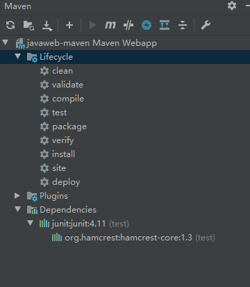

## Git 手册

### 安装

官网下载：<https://git-scm.com/downloads> 下载完成后使用默认进行安装。

`Manjaro`安装

~~~bash
yay -S git
~~~

安装完成后，在开始菜单里找到 `Git` -> `Git Bash`，蹦出一个类似命令行窗口的东西，就说明 Git 安装成功！

还需要一步设置，命令行键入：

~~~bash
git config --global user.name "northboat"
git config --global user.email "northboat@163.com"
~~~

因为Git是分布式版本控制系统，所以，每个机器都必须自报家门：你的名字和 Email 地址

添加 ssh 密匙

~~~bash
ssh-keygen -t rsa -C "northboat@163.com"
~~~

将路径下的 id_rsa.pub 内容添加到 github 的 setting-ssh，本机获取读写权限

### 创建版本库

```bash
# 创建仓库
mkdir <仓库name> 

# 进入仓库
cd <仓库name>

# 此命令用于显示当前目录
pwd

# 把当前目录初始化成Git仓库
git init
```

也不一定必须在空目录下创建Git仓库，选择一个已经有东西的目录直接`git init`也是可以的

### 添加文件到仓库

在仓库目录下放入文件，如新建一个`test.txt`文件，然后使用`git add test.txt`命令告诉Git，把文件添加到缓存区，然后使用`git commit -m "提交描述"`告诉 Git，把文件提交到仓库

```bash
# 添加指定文件或文件夹到缓存区，文件需添加后缀
git add <文件或文件夹name>                   # 单个文件
git add <文件或文件夹name> <文件或文件夹name>  # 多个文件

# 或 全部文件同时添加到缓存区
git add .

# 把文件从缓存区提交至仓库
git commit -m "提交描述"
```

#### 提交描述规范

在提交代码时输入清晰的说明有利于版本管理，建议搭配如下关键字编写提交描述

```
# 新建(add)
# 删除(rm)
# 更新(update)
# 改动(change)
# 实现(feat)
# 发布(publish)
# 修复(fix)
...
```

一些常用的 Commit 头部（Type）

| 类型       | 含义                                           | 示例                               |
| :--------- | :--------------------------------------------- | :--------------------------------- |
| `feat`     | 新功能（feature）                              | `feat: 添加用户注册接口`           |
| `fix`      | 修复 bug（fix）                                | `fix: 修复密码验证错误的问题`      |
| `docs`     | 文档改动（README、接口文档等）                 | `docs: 更新安装步骤`               |
| `style`    | 代码格式改动（空格、分号、缩进等，不改变逻辑） | `style: 调整代码缩进风格`          |
| `refactor` | 代码重构（既不是功能新增也不是 bug 修复）      | `refactor: 重构密钥生成模块`       |
| `test`     | 添加或修改测试代码                             | `test: 增加登录单元测试`           |
| `chore`    | 构建过程或辅助工具变动（不涉及 src）           | `chore: 更新依赖版本`              |
| `perf`     | 性能优化                                       | `perf: 优化登录接口速度`           |
| `ci`       | 持续集成配置变动                               | `ci: 配置 GitHub Actions 测试流程` |

### 版本管理

#### 提交修改

如修改`test.txt`的内容后，运行`git status`命令看看被修改的文件，然后再使用`git add test.txt`、`git commit -m "修改描述"`把修改后的文件提交到仓库，提交后可再次使用`git status`查看当前状态。

```bash
# 显示 新增/删除/被改动等 的文件
git status
```

#### 查看版本记录

```bash
# 查看版本记录
git log   # 显示版本号、提交时间等信息
```

也可使用可视化工具查看Git版本历史：在仓库目录右键 > `Git BUI Here`

#### 回退版本

首先，Git必须知道当前版本是哪个版本，在Git中，用`HEAD`表示当前版本，也就是最新的提交1094adb...（注意我的提交ID和你的肯定不一样），上一个版本就是`HEAD^`，上上一个版本就是`HEAD^^`，当然往上100个版本写100个^比较容易数不过来，所以写成`HEAD~100`

```bash
# 回退到上一个版本
$ git reset --hard HEAD^
```

此时查看`git log`记录发现，原来最新的版本已经没有了，想回到原来最新的版本怎么办？这就需要知道最新的版本的版本号

``` bash
# 跳转到指定版本
git reset --hard <版本号前几位>
```

但是不知道版本号怎么办？Git提供了一个命令`git reflog`用来记录你的每一次命令

```bash
git reflog
```

#### 撤销修改

[廖雪峰 - 撤销修改](https://www.liaoxuefeng.com/wiki/896043488029600/897889638509536)

#### 删除文件

[廖雪峰 - 删除文件](https://www.liaoxuefeng.com/wiki/896043488029600/900002180232448)

### 远程仓库

#### SSH 验证

使本机能关联远程仓库，首次需要SSH验证

* 第1步：创建`SSH Key`。在用户主（C:\Users\dell）目录下，看看有没有.ssh目录，
  如果有，再看看这个目录下有没有`id_rsa`和`id_rsa.pub`这两个文件，如果已经有了，可直接跳到下一步。
  如果没有，打开Shell（Windows下打开Git Bash），创建`SSH Key`：

```bash
# 创建SSH Key
ssh-keygen -t rsa -C "邮件地址"
```

* 第2步：登陆`GitHub`，`右上角头像 > settings > SSH and GPG keys >Add SSH Key`，在key的文本框里粘贴`id_rsa.pub`文件的内容

查看文件内容

~~~bash
cat id_rsa.pub
~~~

#### 关联远程仓库

SSH 验证完成后，在 github 创建仓库，创建仓库时记得取消`Initialize this repository with a README`的勾选，然后在本地命令：

```bash
# 关联远程仓库，仓库名一般使用origin
git remote add <仓库名> <远程仓库地址>

# 示例
git remote add origin git@github.com:xugaoyi/test.git
```

下一步，就可以把本地库的所有内容推送到远程库上

```bash
# 把文件推送到远程仓库
git push -u <仓库名> <分支名>

# 示例
git push -u origin master
```

由于远程库是空的，我们第一次推送`master`分支时，加上了`-u`参数，Git不但会把本地的`master`分支内容推送的远程新的`master`分支，还会把本地的`master`分支和远程的`master`分支关联起来，在以后的推送或者拉取时就可以简化命令。

> 前提是目录已经`git init`初始化成仓库，并且`git status`状态是没有改动的，如果有改动则先`git add .`添加至缓存区，`git commit -m '提交描述'`提交至仓库，然后执行上面命令
>
> 如创建仓库时勾选了 `Initialize this repository with a README` 则需先拉取`README.md`文件到本地仓库`git pull`
>
> 可关联多个远程仓库，注意给不同的远程仓库取不一样的名称，提交是分别按名称提交到不一样的远程仓库

```bash
# 简化的推送命令
git push
```

#### 查看远程仓库

```bash
# 查看远程仓库
git remote -v
```

#### 删除远程仓库

```bash
# 删除远程仓库
git remote rm <仓库名>
```

#### 从远程库克隆项目

```bash
# 从远程库克隆项目
git clone <仓库地址>
```

##### 克隆指定分支

```bash
# 克隆指定分支
git clone -b <分支名> <仓库地址>
```

### 分支管理

#### 创建分支

```bash
# 创建分支
git checkout -b <分支名>
```

#### 查看分支

```bash
# 查看分支
git branch
```

查看分支时，在分支前带 * 号的表示当前的分支

#### 切换分支

```bash
# 切换分支
git checkout <分支名>
```

#### 合并分支

```bash
# 合并本地的分支
git merge <分支名>

# 合并远程的分支
git merge <远程仓库名>/<分支名>
```

**注意**，是将指定分支合并到当前分支，并非当前分支合并到指定分支

- 一般情况下是把当前分支切换到**主分支**，然后把**子分支**合并到**主分支**


#### 删除分支

```bash
# 删除分支
git branch -d <分支名>
```

#### 修改分支名

```bash
# 修改分支名
git branch -m <原分支名> <新分支名>
```

### 帮助命令

如对命令不清楚时，可使用`git help`命令显示出git命令介绍。

```bash
# 帮助命令
git help
```

中文

```bash
$ git help
使用：git [--version] [--help] [-C <path>] [-c <name>=<value>]
           [--exec-path[=<path>]] [--html-path] [--man-path] [--info-path]
           [-p | --paginate | -P | --no-pager] [--no-replace-objects] [--bare]
           [--git-dir=<path>] [--work-tree=<path>] [--namespace=<name>]
           <command> [<args>]

这些是在各种情况下使用的通用Git命令：

start a working area (参见命令: git help tutorial)
   clone      将存储库克隆到新目录中
   init       创建一个空的Git存储库或重新初始化一个现有的存储库

work on the current change (参见命令: git help everyday)
   add        将文件内容添加到索引中
   mv         移动或重命名文件、目录或符号链接
   reset      将当前磁头重置为指定状态
   rm         从工作树和索引中删除文件

examine the history and state (参见命令: git help revisions)
   bisect     使用二分查找查找引入错误的提交
   grep       打印与模式匹配的行
   log        显示提交日志
   show       显示各种类型的对象
   status     显示工作树状态

grow, mark and tweak your common history
   branch     列出、创建或删除分支
   checkout   切换分支或还原工作树文件
   commit     记录对存储库的更改
   diff       显示提交、提交和工作树等之间的更改
   merge      将两个或多个开发历史连接在一起
   rebase     在另一个基本提示之上重新应用提交
   tag        创建、列表、删除或验证用GPG签名的标记对象

collaborate (参见命令: git help workflows)
   fetch      从另一个存储库下载对象和引用
   pull       从另一个存储库或本地分支获取并与之集成
   push       更新远程引用和相关对象

'git help -a' 和 'git help -g' 列出可用的子命令和一些概念指导。
命令'git help <command>' 或 'git help <concept>' 查看特定子命令或概念.
```

### 一些经验

错误信息

- 报错码 10056：产生原因，一般是这是因为服务器的 SSL 证书没有经过第三方机构的签署，所以才报错

  - 使用以下命令接触 ssl 验证后再次 git 即可解决

    ```sh
    git config --global http.sslVerify "false"
    ```

- port 443 timed out：就是卡了

- broken pipe：文件过大导致，git 默认文件大小小于等于 100MB

  - 可修改缓存大小为 500MB 强行上传

    ```sh
    git config http.postBuffer 52428800 
    ```

拉取主分支更新

```bash
git checkout main
git pull
git checkout NorthBoat
git merge main # 把 main 合并到当前 NorthBoat 分支，main 可省略，默认为主分支
git push # 更新当前分支
```

更新主分支

```bash
git checkout main
git merge NorthBoat # 主分支合并 NorthBoat 分支
git push # 更新主分支
git checkout NorthBoat # 返回原分支
```

撤销`git add .`

```bash
git reset .
```

回退到上一个版本并保存当前版本

```bash
git stash

# 查看保存的版本
git stash list
# 恢复到上个版本并删除上个版本保存
git stash pop
# 恢复到某个保存的某个版本
git stash apply stash@{版本id}
```

撤销本地提交

```bash
# 撤销上次commit，但不撤销add
git reset --soft head~1
git reset --soft head~ # 二者等价

# 撤销上次commit和add
git reset head~
```

本地版本回退

```bash
# 查看 commit_id
git log

# 回到到前两个版本
git reset --hard head~2
# 回到到指定版本
git reset --hard commit_id
```

两个人推一个仓库，同时拉取 A 版本，第一个人修改后提交 B 版本并推送到远程仓库，此时第二个人并不知晓这次推送，在修改 A 版本为 C 版本后进行推送时，就会发生冲突，那么此时就需要进行上述的版本回退

1. 将本地仓库回退到 A 版本
2. git pull 拉取最新的 B 版本
3. 在 B 版本的基础上进行修改得到 C 版本
4. 提交推送，则远程仓库将完成 A → B → C 的更新

子模块的链入和移除：编写`.gitmodules`文件，填入子仓库的路径以及仓库`url`

```
[submodule "themes/cactus"]
	path = themes/cactus
	url = https://github.com/probberechts/hexo-theme-cactus
```

删除子模块

```bash
git rm themes/cactus
```

[廖雪峰的文档](https://www.liaoxuefeng.com/wiki/896043488029600)

## Maven

Java包管理工具

### Why Maven

why maven

1. 在 javaweb 开发中，需要使用大量的 jar 包，手动导入很麻烦
2. maven 自动化导入/出 jar 包以减少负担

Maven项目架构管理工具

- 目前用来方便导入jar包
- 核心思想：**约定大于配置**

Maven会规定好你该如何去编写我们的java代码

下载和安装：去官网下载压缩包，解压即可

配置环境变量

- M2_HOME
- MAVEN_HOME
- 在系统的path中配置 %MAVEN_HOME%\bin

测试Maven是否安装成功

~~~bash
C:\Users\NorthBoat>mvn --version
~~~

加速镜像：加速我们的下载

~~~xml
<mirror>
    <id>nexus-aliyun</id>
    <mirrorOf>*,!jeecg,!jeecg-snapshots</mirrorOf>
    <name>Nexus aliyun</name>
    <url>http://maven.aliyun.com/nexus/content/groups/public</url> 
</mirror>
~~~

将 conf 文件夹中 settings.xml 文件镜像仓库改为上述 mirror

建立本地仓库

- 本地仓库 ←→ 远程仓库
- 建立一个本地仓库：在bin同级目录下创建文件夹repo
- 然后在 setting.xml 中，修改repo路径为自定义路径

~~~xml
<localRepository>D:\Maven\apache-maven-3.8.1\maven-repo</localRepository>
~~~

### Idea Maven

在 idea 中使用 maven

- new project → maven 项目 → 勾选模板、勾选 maven-javaweb-app → 选仓库、配置文件


可能会出现报错：No archetype found in remote catalog. Defaulting to internal catalo

- 此时在Maven创建项目时设置属性 archetypeCatalog = internal 即可

一个标准的 maven 项目目录结构

~~~
-src
    -main
    	-java
    	-rources
    	-webapp
    		-WEB-INF
    			-web.xml
    		-index.jsp
~~~

设置文件夹属性

1. 右键文件夹：mark directory  as ...
2. Project Structure → Modules：设置文件夹类型

Maven 功能栏（Plugins 可删除）



在 idea 中配置 tomcat

1. 先在 project structure 中添加 Artifacts：webapp application archive，重命名 war 包，生成在 target 目录
2. 点击该处，配置 tomcat


注意：

1. tomcat 10 idea将无法识别其 lib 库
2. 报错 No artifacts marked for deployment，在deployment中加一个 javaweb-maven:war 即可
   - 我们访问一个网站，必须要一个默认文件夹接管tomcat的webapps
3. 虚拟路径映射
4. 提示信息乱码

~~~
淇℃伅 [main] org.apache.catalina.startup.VersionLoggerListener.log Server.鏈嶅姟鍣ㄧ増鏈�:
~~~

到 tomcat/conf/ 目录下，修改 logging.properties 找到 java.util.logging.ConsoleHandler.encoding = utf-8 这行更改为 java.util.logging.ConsoleHandler.encoding = GBK，保存退出即可

pom.xml：maven 的核心配置文件

~~~xml
<?xml version="1.0" encoding="UTF-8"?>

<project xmlns="http://maven.apache.org/POM/4.0.0" xmlns:xsi="http://www.w3.org/2001/XMLSchema-instance"
         xsi:schemaLocation="http://maven.apache.org/POM/4.0.0 http://maven.apache.org/xsd/maven-4.0.0.xsd">
    <modelVersion>4.0.0</modelVersion>

    <!--这是初始化配置项目时的GVA:group version artifactId-->
    <groupId>org.example</groupId>
    <artifactId>javaweb-maven</artifactId>
    <version>1.0-SNAPSHOT</version>
    <!--打包方式：war（javaWeb应用）-->
    <packaging>war</packaging>

    <!--配置-->
    <properties>
        <!--项目默认编码-->
        <project.build.sourceEncoding>UTF-8</project.build.sourceEncoding>
        <!--编译版本-->
        <maven.compiler.source>1.7</maven.compiler.source>
        <maven.compiler.target>1.7</maven.compiler.target>
    </properties>

    <!--项目依赖：具体依赖的jar包依赖文件-->
    <dependencies>
        <dependency>
            <groupId>junit</groupId>
            <artifactId>junit</artifactId>
            <version>4.11</version>
            <scope>test</scope>
        </dependency>
    </dependencies>

    <!--项目构建用的东西-->
    <build>
        <finalName>javaweb-maven</finalName>
        <pluginManagement><!-- lock down plugins versions to avoid using Maven defaults (may be moved to parent pom) -->
            <plugins>
                <plugin>
                    <artifactId>maven-clean-plugin</artifactId>
                    <version>3.1.0</version>
                </plugin>
                <!-- see http://maven.apache.org/ref/current/maven-core/default-bindings.html#Plugin_bindings_for_war_packaging -->
                <plugin>
                    <artifactId>maven-resources-plugin</artifactId>
                    <version>3.0.2</version>
                </plugin>
                <plugin>
                    <artifactId>maven-compiler-plugin</artifactId>
                    <version>3.8.0</version>
                </plugin>
                <plugin>
                    <artifactId>maven-surefire-plugin</artifactId>
                    <version>2.22.1</version>
                </plugin>
                <plugin>
                    <artifactId>maven-war-plugin</artifactId>
                    <version>3.2.2</version>
                </plugin>
                <plugin>
                    <artifactId>maven-install-plugin</artifactId>
                    <version>2.5.2</version>
                </plugin>
                <plugin>
                    <artifactId>maven-deploy-plugin</artifactId>
                    <version>2.8.2</version>
                </plugin>
            </plugins>
        </pluginManagement>
    </build>
</project>
~~~

maven 的高级之处在于，当你导入一个 jar 包时，它将自动帮你导入该 jar 包所依赖的其他 jar 包

当你要导入 jar 包时，只需要百度 maven 仓库，选择所需 jar 包的相应版本中找到其 maven 配置，复制粘贴进 dependencies 中即可

~~~xml
<!-- https://mvnrepository.com/artifact/org.springframework/spring-webmvc
         百度搜索maven仓库，在所需的jar包响应版本中找到其maven依赖，复制粘贴即可-->
<dependency>
    <groupId>org.springframework</groupId>
    <artifactId>spring-webmvc</artifactId>
    <version>5.1.9.RELEASE</version>
</dependency>
~~~

有的依赖中有作用域的限定

~~~xml
<scope>provided</scope>
~~~

有时 maven 自动导入 jar 包会失败，我们需要手动去 maven 仓库下载 jar 包拷到指定目录下

之后可能会遇到的问题：maven 约定大于配置，我们之后在导出资源时会碰到问题，我们需要在 build 中配置 resources 可解决该问题

~~~xml
<build>
    <resources>
        <resource>
            <directory>src/main/resources</directory>
            <includes>
                <include>**/*.properties</include>
                <include>**/*.xml</include>
            </includes>
            <filtering>true</filtering>
        </resource>
        <resource>
            <directory>src/main/java</directory>
            <includes>
                <include>**/*.properties</include>
                <include>**/*.xml</include>
            </includes>
            <filtering>true</filtering>
        </resource>
    </resources>
</build>
~~~

### Dependencies

一些好用的依赖

#### Lombok

导入依赖

~~~xml
<!--lombok-->
<dependency>
    <groupId>org.projectlombok</groupId>
    <artifactId>lombok</artifactId>
    <optional>true</optional>
</dependency>
~~~

基本使用

- `@Data`：包含了所有成员的`setter`和`getter`，常用于与数据库对接的实体类
- `@EqualsAndHashCode`：自动生成`equals`和`hashCode`方法

~~~java
@Data
@EqualsAndHashCode(callSuper = false)
@TableName("t_user")
public class User implements Serializable {

    private static final long serialVersionUID = 1L;
    private Long id;
    private String nickname;
    private String password;
    private String slat;
    private String head;
    private Date registerDate;
    private Date lastLoginDate;
    private Integer loginCount;
}
~~~

`@Setter/@Getter`

~~~java
@Setter
@Getter
public class Example{
    private int id;
    private String name;
}
~~~

`@AllArgsConstructor/@NoArgsConstructor`：全参、无参构造器

~~~java
@AllArgsConstructor
@NoArgsConstructor
public class Example{
    private int id;
    private String name;
}
~~~

#### 验证器 Validation

导入依赖

~~~xml
<dependency>
    <groupId>org.springframework.boot</groupId>
    <artifactId>spring-boot-starter-validation</artifactId>
</dependency>
~~~

1️⃣ 基本使用：在传入参数处添加`@Valid`注解

~~~java
@RequestMapping("/doLogin")
@ResponseBody
public RespBean doLogin(@Valid LoginVo loginVo){
    log.info("{}", loginVo);
    //System.out.println(loginVo.getUsername());
    return userService.doLogin(loginVo);
}
~~~

在对应`vo`处添加规则

~~~java
@Data
public class LoginVo {
    @NotNull
    @Email
    private String username;
    @Length(min = 8, max = 26)
    private String password;
}
~~~

2️⃣ 自定义注解

新建包`validation`，放置注解

编写注解：`@NotNull`源码

~~~java
//
// Source code recreated from a .class file by IntelliJ IDEA
// (powered by Fernflower decompiler)
//

package javax.validation.constraints;

import java.lang.annotation.Documented;
import java.lang.annotation.ElementType;
import java.lang.annotation.Repeatable;
import java.lang.annotation.Retention;
import java.lang.annotation.RetentionPolicy;
import java.lang.annotation.Target;
import javax.validation.Constraint;
import javax.validation.Payload;

@Target({ElementType.METHOD, ElementType.FIELD, ElementType.ANNOTATION_TYPE, ElementType.CONSTRUCTOR, ElementType.PARAMETER, ElementType.TYPE_USE})
@Retention(RetentionPolicy.RUNTIME)
@Repeatable(NotNull.List.class)
@Documented
@Constraint(
    validatedBy = {}
)
public @interface NotNull {
    String message() default "{javax.validation.constraints.NotNull.message}";

    Class<?>[] groups() default {};

    Class<? extends Payload>[] payload() default {};

    @Target({ElementType.METHOD, ElementType.FIELD, ElementType.ANNOTATION_TYPE, ElementType.CONSTRUCTOR, ElementType.PARAMETER, ElementType.TYPE_USE})
    @Retention(RetentionPolicy.RUNTIME)
    @Documented
    public @interface List {
        NotNull[] value();
    }
}
~~~

其中`String message()`为报错信息

新建`validation`包，新建所需注解文件，参照`@NotNull`源码，将其上注解拷贝，注入`Validation`，注意删掉`@Repeatable`注解

~~~java
package com.seckill.validation;


import javax.validation.Constraint;
import javax.validation.Payload;
import java.lang.annotation.*;

@Target({ElementType.METHOD, ElementType.FIELD, ElementType.ANNOTATION_TYPE, ElementType.CONSTRUCTOR, ElementType.PARAMETER, ElementType.TYPE_USE})
@Retention(RetentionPolicy.RUNTIME)
@Documented
@Constraint( validatedBy = {} )
public @interface IsMobile {

    boolean required() default true;

    String message() default "电话号码格式错误";

    Class<?>[] groups() default {};

    Class<? extends Payload>[] payload() default {};
}
~~~

编写实现类

- 真正的实现逻辑由`@Constraint( validatedBy = {} )`注解注入自定义注解
- 在`vo`包下新建类`IsMobileValidator`实现`ConstraintValidator`接口，在`isValid`方法中实现逻辑

在`initialize`中可以进行很多参数传递：

- 在注解中定义方法接收用户参数
- 在`ConstraintValidator`类的`initialize`方法中调用注解方法传递参数
- 在`isValid`方法中使用参数，编写逻辑

~~~java
package com.seckill.vo;

import com.seckill.utils.ValidatorUtil;
import com.seckill.validation.IsMobile;
import org.thymeleaf.util.StringUtils;

import javax.validation.ConstraintValidator;
import javax.validation.ConstraintValidatorContext;

public class IsMobileValidator implements ConstraintValidator<IsMobile, String> {

    // 接收注解收到的逻辑
    private boolean required;

    //初始化
    @Override
    public void initialize(IsMobile constraintAnnotation) {
        required = constraintAnnotation.required();
    }

    // 逻辑实现
    @Override
    public boolean isValid(String mobile, ConstraintValidatorContext constraintValidatorContext) {
        // 如果设置required为true，即为设置必须有值，直接通过util判断即可
        if(required){
            return ValidatorUtil.checkMobile(mobile);
        }
        // 若required为false，即为设置可为空，当mobile为空返回true，不为空则调用util
        if(StringUtils.isEmpty(mobile)){
            return true;
        }
        return ValidatorUtil.checkMobile(mobile);
    }
}

~~~

注入注解

~~~java
@Constraint( validatedBy = {IsMobileValidator.class} )
~~~

异常处理

- 在`controller`接收参数时加上注解，若参数不匹配浏览器将直接报错`400 bad request`，后端报错`org.springframework.validation.BindException`


在`spring-boot`中处理异常通常有两种方式

- `@ControllerAdvice`和`@ExceptionHandler`配合使用
- `ErrorController`类实现

第一种只能处理控制台异常，第二种可以处理404、400等错误，这里使用第一种方式进行处理

新建`excption`包，编写异常处理类和自定义异常类

`GlobalExceptionHandler.java`：异常处理类

~~~java
package com.seckill.exception;

import com.seckill.vo.RespBean;
import com.seckill.vo.RespBeanEnum;
import org.springframework.validation.BindException;
import org.springframework.web.bind.annotation.ExceptionHandler;
import org.springframework.web.bind.annotation.RestControllerAdvice;

@RestControllerAdvice
public class GlobalExceptionHandler {

    @ExceptionHandler(Exception.class)
    public RespBean ExceptionHandler(Exception e){
        if(e instanceof GlobalException){
            GlobalException ge = (GlobalException)e;
            return RespBean.error(ge.getRespBeanEnum());
        } else if(e instanceof BindException){
            BindException be = (BindException)e;
            RespBean respBean = RespBean.error(RespBeanEnum.LOGIN_PATTERN_ERROR);
            respBean.setMessage("参数校验异常：" + be.getBindingResult().getAllErrors().get(0).getDefaultMessage());
            return respBean;
        }
        return RespBean.error(RespBeanEnum.SERVER_ERROR);
    }
}
~~~

`@ControllerAdvice/RestControllerAdvice`会主动接管项目中出现的所有异常，即当出现异常时，`spring-boot`将主动调用被修饰类中的方法

`@ExceptionHandler`用于修饰方法，限定该方法处理的异常类型

- 二者关系类似于`@Controller`和`@RequestMapping`的关系

`GlobalException`：自定义异常类，方便接收和返回不同的异常，内置`RespBean`

~~~java
package com.seckill.exception;


import com.seckill.vo.RespBeanEnum;
import lombok.AllArgsConstructor;
import lombok.Data;
import lombok.NoArgsConstructor;

@Data
@NoArgsConstructor
@AllArgsConstructor
public class GlobalException extends RuntimeException{
    private RespBeanEnum respBeanEnum;
}
~~~

具体使用，`UserServiceImpl.java`：`Service`层主动抛出异常

```java
@Service
public class UserServiceImpl extends ServiceImpl<UserMapper, User> implements IUserService {

    private UserMapper userMapper;
    @Resource
    public void setUserMapper(UserMapper userMapper){
        this.userMapper = userMapper;
    }

    /**
     * 登录功能
     * @param loginVo
     * @return
     */
    @Override
    public RespBean doLogin(LoginVo loginVo) {
        String username = loginVo.getUsername();
        String password = loginVo.getPassword();
        System.out.println(username);

        User user = userMapper.selectById(username);
        if(user == null){
            throw new GlobalException(RespBeanEnum.LOGIN_NOT_FOUND);
        }
        if(!MD5Util.formPassToDBPass(password, user.getSlat()).equals(user.getPassword())) {
            throw new GlobalException(RespBeanEnum.LOGIN_PASSWORD_WRONG);
        }
        return RespBean.success();
    }
}
```

`LoginController.java`：`Controller`层进行`@Valid`验证被动抛出异常`org.springframework.validation.BindException`，通过自己编写的`Handler`进行捕获处理，并返回一个`RespBean`

~~~java
@Controller
@RequestMapping("/login")
@Slf4j
public class LoginController {
    
    private IUserService userService;
    @Autowired
    public void setUserService(IUserService userService){
        this.userService = userService;
    }

    @RequestMapping("/doLogin")
    @ResponseBody
    public RespBean doLogin(@Valid LoginVo loginVo){ //参数校验
        log.info("{}", loginVo);
        //模拟前端进行一次MD5加密
        loginVo.setPassword(MD5Util.inputPassToFormPass(loginVo.getPassword()));
        //System.out.println(loginVo.getUsername());
        return userService.doLogin(loginVo);
    }
}
~~~

#### 邮件 Mail

邮件发送

```xml
<dependency>
    <groupId>org.springframework.boot</groupId>
    <artifactId>spring-boot-starter-mail</artifactId>
</dependency>
```

#### WebSocket

websocket 通信

```xml
<dependency>
    <groupId>org.springframework.boot</groupId>
    <artifactId>spring-boot-starter-websocket</artifactId>
</dependency>
```

#### 消息队列

RabbitMQ

```xml
<dependency>
    <groupId>org.springframework.boot</groupId>
    <artifactId>spring-boot-starter-amqp</artifactId>
</dependency>
<dependency>
    <groupId>org.springframework.amqp</groupId>
    <artifactId>spring-rabbit-test</artifactId>
    <scope>test</scope>
</dependency>
```

