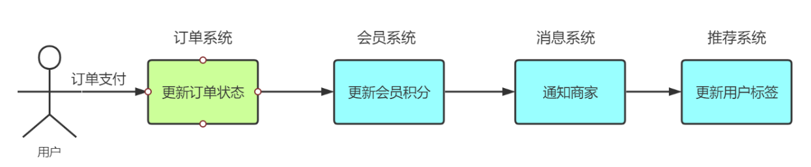
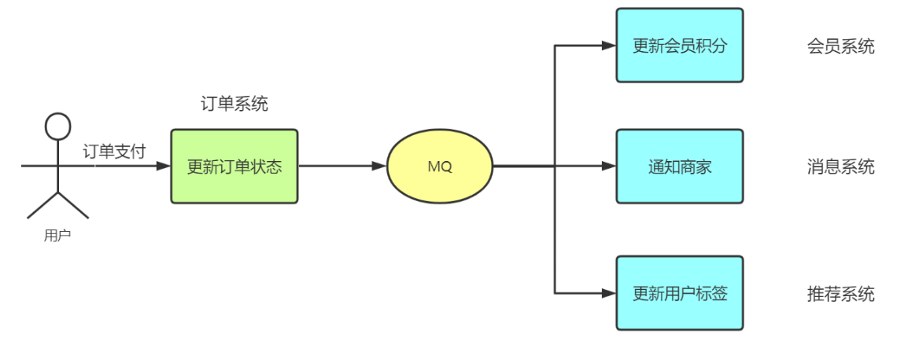
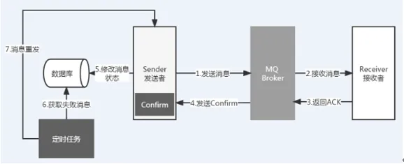

## 消息队列模型

### 点对点模型

队列模型，又叫点对点模型，每个生产者对应一个消费者（一对一）

比如 OJ 中 MQ 的使用，后端收到判题请求后，先将判题记录写入数据库，而后作为生产者将判题记录 ID 写入消息队列，此时真正的判题模块由于订阅了该判题队列，于是自动从 MQ 中读出判题请求 ID，从 DB 中拿取数据执行判题业务，最后通过 WebSocket 返回

### 订阅发布模型

订阅发布模型，一个生产者将把消息广播到每一个订阅者，即一对多

订阅发布能够将串行执行的任务变成“并行”，例如以下串行场景，他是一步步执行



若引入 MQ，它可以变成这样的形式，这是合理的，实际上，更新积分、通知商家、更新用户标签这三个事件并没有直接的逻辑联系或是执行顺序问题，他们都是由“更新订单状态触发”



从而大幅提高效率

上述订阅发布模式的举例是 MQ 一大应用场景，**异步处理**，而队列模式的举例是**应用解耦**，消息队列的常用场景如下

- 异步处理：就是将一些非核心的业务流程以异步并行的方式执行，从而减少请求响应时间，提高系统吞吐量
- 应用解耦：顾名思义就是解除应用系统之间的耦合依赖。通过消息队列，使得每个应用系统不必受其他系统影响，可以更独立自主运行
- 流量削峰：是消息队列中的常用场景，一般在秒杀或团抢活动中使用广泛
- 消息通讯：指应用间的数据通信，消息队列一般都内置了高效的通信机制，因此也可以用在纯的消息通讯。比如实现点对点消息队列，或者聊天室等点对点通讯

## RabbitMQ

### 安装部署

manjaro 安装

```bash
yay -S rabbitmq rabbitmqadmin
```

启动

```bash
sudo rabbitmq-plugins enable
sudo rabbitmq-server
```

默认端口

- 管理界面：15672
- 客户端：5672

后台运行

```bash
rabbitmq-server -detached
```

### Spring 集成

引入 RabbitMQ 依赖

```xml
<dependency>
    <groupId>org.springframework.boot</groupId>
    <artifactId>spring-boot-starter-amqp</artifactId>
</dependency>
```

配置文件

```yaml
spring:
	rabbitmq:
		host: 10.2.1.231
		port: 5672
		username: northboat
		password: 123456
		virtualHost: order
```

一个简单的消费者，订阅队列"`rabbitmq_queue"`

```java
@Component
public class Consumer {
	@RabbitHandler
	@RabbitListener(queuesToDeclare = @Queue("rabbitmq_queue"))
	public void process(String message) {
		System.out.println("消费者消费消息: " + message);
	}
}
```

一个简单的生产者

```java
@Component
public class Producer {
	@Autowired
	private RabbitTemplate rabbitTemplate;
	
	public void produce() {
		String message = new Date() + "Beijing";
		System.out.println("生产者产生消息: " + message);
		rabbitTemplate.convertAndSend("rabbitmq_queue", message);
	}
}
```

这里传输的是简单字符串，我们尝试传输一个实体对象 User，需要进行序列化，即继承`Serializable`类

```java
public class User implements Serializable {
	public String name;
	public String password;
	// 省略get和set方法
}
```

仍然通过`convertAndSend`方法进行传输

```java
@Component
public class Producer {
	@Autowired
	private RabbitTemplate rabbitTemplate;
	
	public void produce() {	
		User user = new User("nmsl", "wdnmd");
		System.out.println("生产者生产消息: " + user);
		
		rabbitTemplate.convertAndSend("rabbitmq_queue_object", user);
	}
}
```

convertAndSend() 方法支持 String、Integer、Object 等基础的数据类型

## 确保可靠传输

在使用消息队列时，因为生产者和消费者不直接交互，所以面临下面几个问题

1. 要把消息添加到队列中，怎么保证消息成功添加？
2. 如何保证消息发送出去时一定会被消费者正常消费？
3. 消费者正常消费了，生产者或者队列如何知道消费者已经成功消费了消息？

那么，如何保证消息 100% 可靠性发送？我们可以采用 ack 应答 + 日志记录 + 定时任务来实现

假设有一个创建订单业务，后端收到请求后，将该业务通过消息队列发送到具体的业务模块，我们这样保证消息的可靠传输

1. 完成订单业务处理后，生产者发送一条消息到消息队列，同时记录这条操作日志（发送中）
2. 消费者收到消息后处理进行
3. 消费者处理成功后给消息队列发送 ack 应答
4. 消息队列收到 ack 应答后，给生成者的 Confirm Listener 发送确认
5. 生产者对消息日志表进行操作，修改之前的日志状态（发送成功）
6. 在消费端返回应答的过程中，可能发生网络异常，导致生产者未收到应答消息，因此需要一个定时任务去提取其状态为“发送中”并已经超时的消息集合
7. 使用定时任务判断为消息事先设置的最大重发次数，大于最大重发次数就判断消息发送失败，更新日志记录状态为发送失败

流程图如下



具体实现

1️⃣ 创建生产者

定义应答方法`final RabbitTemplate.ConfirmCallback confirmCallback = new RabbitTemplate.ConfirmCallback() {}`，即定义收到消费者发回的 ack 应答后的处理：更新日志记录，修改订单状态为成功

```java
@Component
public class RabbitOrderSender {
    private static Logger logger = LoggerFactory.getLogger(RabbitOrderSender.class);

    @Autowired
    private RabbitTemplate rabbitTemplate;

    @Autowired
    private MessageLogMapper messageLogMapper;

    /**
     * Broker应答后，会调用该方法区获取应答结果
     */
    final RabbitTemplate.ConfirmCallback confirmCallback = new RabbitTemplate.ConfirmCallback() {
        @Override
        public void confirm(CorrelationData correlationData, boolean ack, String cause) {
            logger.info("correlationData："+correlationData);
            String messageId = correlationData.getId();
            logger.info("消息确认返回值："+ack);
            if (ack){
                //如果返回成功，则进行更新
                messageLogMapper.changeMessageLogStatus(messageId, Constans.ORDER_SEND_SUCCESS,new Date());
            }else {
                //失败进行操作：根据具体失败原因选择重试或补偿等手段
                logger.error("异常处理,返回结果："+cause);
            }
        }
    };

    /**
     * 发送消息方法调用: 构建自定义对象消息
     * @param order
     * @throws Exception
     */
    public synchronized void  sendOrder(OrderInfo order) throws Exception {
        // 通过实现 ConfirmCallback 接口，消息发送到 Broker 后触发回调，确认消息是否到达 Broker 服务器，也就是只确认是否正确到达 Exchange 中
        rabbitTemplate.setConfirmCallback(confirmCallback);
        //消息唯一ID
        CorrelationData correlationData = new CorrelationData(order.getMessageId());
        rabbitTemplate.convertAndSend("order.exchange", "order.message", order, correlationData);
    }
}
```

当生产者调用`ConfirmCallback()`，说明当前请求已被消费者消费

2️⃣ 定义消息定时重发任务

定期去数据库中找状态为 0 的数据项，进行消息重发

- 通过`@Compoent`和`@Scheduled(initialDelay = 5000, fixedDelay = 10000)`注解将定时任务注入 Spring，初始 5 s 后开始执行，往后每 10s 执行一次
- 判断逻辑为：当重发大于两次，认为任务失败，不再执行，否则通过 RabbitOrderSender 进行重发

```java
@Component
public class RetryMessageTasker {
    private static Logger logger = LoggerFactory.getLogger(RetryMessageTasker.class);
    @Autowired
    private RabbitOrderSender rabbitOrderSender;

    @Autowired
    private MessageLogMapper messageLogMapper;

    /**
     * 定时任务
     */
    @Scheduled(initialDelay = 5000, fixedDelay = 10000)
    public void reSend(){
        logger.info("-----------定时任务开始-----------");
        //抽取消息状态为0且已经超时的消息集合
        List<MessageLog> list = messageLogMapper.query4StatusAndTimeoutMessage();
        list.forEach(messageLog -> {
            //投递三次以上的消息
            if(messageLog.getTryCount() >= 3){
                //更新失败的消息
                messageLogMapper.changeMessageLogStatus(messageLog.getMessageId(), Constans.ORDER_SEND_FAILURE, new Date());
            } else {
                // 重试投递消息，将重试次数递增
                messageLogMapper.update4ReSend(messageLog.getMessageId(),  new Date());
                OrderInfo reSendOrder = JsonUtil.jsonToObject(messageLog.getMessage(), OrderInfo.class);
                try {
                    rabbitOrderSender.sendOrder(reSendOrder);
                } catch (Exception e) {
                    e.printStackTrace();
                    logger.error("-----------异常处理-----------");
                }
            }
        });
    }
}
```

3️⃣ 运行测试

```java
@RunWith(SpringRunner.class)
@SpringBootTest
public class MqApplicationTests {
    @Autowired
    private OrderService orderService;

    /**
     * 测试订单创建
     */
    @Test
    public void createOrder(){
        OrderInfo order = new OrderInfo();
        order.setId("201901236");
        order.setName("测试订单6");
        order.setMessageId(System.currentTimeMillis() + "$" + UUID.randomUUID().toString());
        try {
            orderService.createOrder(order);
        } catch (Exception e) {
            e.printStackTrace();
        }
    }

}
```

## 消息队列的选择

### Kafka VS RabbitMQ

Kafka 设计之初是用于处理大批量的日志，基于自定义的二进制协议，专注于高吞吐量，其特点如下

而 RabbitMQ 的设计目标是**低延迟**和**可靠传递**，它的消息确认机制和重试机制可以确保任务被正确处理，适合高并发的任务，常用于业务的解耦、异步处理

| 消息队列 | 协议                                                         | 消息传输                                                     | 实时性                 | 扩展性                                                  | 持久化                                     |
| -------- | ------------------------------------------------------------ | ------------------------------------------------------------ | ---------------------- | ------------------------------------------------------- | ------------------------------------------ |
| Kafka    | 基于自定义的二进制协议，专注于高吞吐量                       | 消息以**日志**的形式持久化存储，支持高吞吐量的消息流；不支持消息确认（ACK）和重试机制，但可以通过消费者偏移量（Offset）实现消息重放 | 延迟较高，适合批量处理 | 支持分布式集群，可以轻松扩展到数百个节点，处理海量数据  | 消息持久化到磁盘，支持长期存储和回溯       |
| RabbitMQ | 基于 AMQP（Advanced Message Queuing Protocol），支持多种消息模式（如点对点、发布/订阅） | 支持消息确认（ACK）和重试机制，确保消息可靠传递；支持消息优先级、延迟队列、死信队列等高级特性 | 适合低延迟的消息传递   | 支持复杂的路由规则（如 direct、topic、fanout 等交换器） | 可以通过集群实现高可用性，但扩展性相对有限 |

什么是 AMQP（Advanced Message Queuing Protocol）

RabbitMQ 的适用场景

- 任务队列：适合需要**实时处理**的任务，例如 Web 应用中的异步任务（如发送邮件、处理订单）
- 低延迟场景：需要**快速响应**的场景，例如实时通知、即时消息
- 复杂路由：需要根据消息内容或规则将消息路由到不同消费者的场景
- 可靠传递：需要确保**每条消息都被正确处理**，适合对消息丢失敏感的场景

Kafka 使用场景

- 日志收集：适合收集和存储大量日志数据，例如应用程序日志、系统日志
- 流处理：适合实时**流处理场景**，例如用户行为分析、实时推荐系统
- 大数据管道：适合作为**大数据**生态系统的数据传输管道，例如将数据从生产系统传输到 Hadoop 或 Spark
- 事件溯源：适合需要**记录事件历史**的场景，例如金融交易记录、审计日志（因为数据会写入磁盘进行持久化）

选择 RabbitMQ 的场景

- 你需要低延迟的消息传递
- 你需要复杂的路由规则（如根据消息内容路由到不同消费者）
- 你需要确保每条消息都被正确处理（如金融交易、订单处理）
- 你的系统规模较小或中等，不需要处理海量数据

选择 Kafka 的场景

- 你需要高吞吐量的消息处理（如日志收集、用户行为分析）
- 你需要持久化存储消息，并且可能需要回溯历史消息
- 你需要流处理能力（如实时推荐、实时监控）
- 你的系统规模较大，需要处理海量数据。

RabbitMQ 为什么 RabbitMQ 并发能力强于 Kafka 而 Kafka 吞吐量大于 RabbitMQ？

首先回答吞吐量的问题

1. Kafka 的吞吐量高很大原因来自于其**批处理**设计，将多个消息打包成一个批次来减少网络和磁盘 I/O 的开销，相应的，这样处理的延迟会变大
2. 另外，Kafka 不仅仅是一个消息队列，它还提供了 Kafka Streams 和 Kafka Connect 等工具，用于实现**流处理**，从而大大提高数据处理速度

什么是批处理，什么是流处理？

- 批处理是指对**静态的、有限的数据集**进行处理。数据通常以文件或数据库表的形式存储，处理过程是周期性的（如每天、每小时）
- 流处理是指对**连续的、无限的数据流**进行实时或近实时的处理。数据通常是动态生成的（如日志、传感器数据、用户行为数据）

💤 PS：流处理让我想到 Java Stream 流，虽然都叫“流”，但 Java Stream 实际上是一个用于对集合（Collection）数据进行函数式操作（如过滤、映射、排序、聚合等）的 API，提供一种更简洁、更高效的方式来处理集合数据（所谓函数式编程）

而 RabbitMQ 的高并发显著强于 Kafka，首先我们要明确到底什么是并发能力强，并发能力强并不是只 QPS（Queries Per Second）高，1s 在计算机系统其实是一个比较大的时间跨度，以至于他反应的实际上是吞吐量而并非并发量

所以，这里说 RabbitMQ 的高并发能力其实指的是低延迟的处理，进行快速的实时反馈

### 其他对比

现有一些开源 MQ 的对比

| 特性\消息队列 | Kafka                                                        | RocketMQ                                                     | RabbitMQ                                                     | ActiveMQ                                                     |
| ------------- | ------------------------------------------------------------ | ------------------------------------------------------------ | ------------------------------------------------------------ | ------------------------------------------------------------ |
| 单机吞吐量    | 10万级                                                       | 10万级                                                       | 万级                                                         | 10万级                                                       |
| 开发语言      | Scala                                                        | Java                                                         | Erlang                                                       | Java                                                         |
| 高可用        | 分布式                                                       | 分布式                                                       | 主从                                                         | 分布式                                                       |
| 消息延迟      | ms级                                                         | ms级                                                         | us级                                                         | ms级                                                         |
| 消息丢失      | 理论上不会丢失                                               | 理论上不会丢失                                               | 低                                                           | 低                                                           |
| 消费模式      | 拉取                                                         | 推拉                                                         | 推拉                                                         |                                                              |
| 持久化        |                                                              | 文件                                                         | 内存，文件                                                   | 内存，文件，数据库                                           |
| 支持协议      | 自定义协议                                                   | 自定义协议                                                   | AMQP，XMPP, SMTP,STOMP                                       | AMQP,MQTT,OpenWire,STOMP                                     |
| 社区活跃度    | 高                                                           | 中                                                           | 高                                                           | 高                                                           |
| 管理界面      |                                                              | web console                                                  | 好                                                           | 一般                                                         |
| 部署难度      | 中                                                           |                                                              | 低                                                           |                                                              |
| 部署方式      | 独立                                                         | 独立                                                         | 独立                                                         | 独立，嵌入                                                   |
| 成熟度        | 成熟                                                         | 比较成熟                                                     | 成熟                                                         | 成熟                                                         |
| 综合评价      | 优点：拥有强大的性能及吞吐量，兼容性很好。 缺点：由于支持消息堆积，导致延迟比较高 | 优点：性能好，稳定可靠，有活跃的中文社区，特点响应快。 缺点：兼容性较差，但随着影响力的扩大，该问题会有改善 | 优点：产品成熟，容易部署和使用，拥有灵活的路由配置。 缺点：性能和吞吐量较差，不易进行二次开发 | 优点：产品成熟，支持协议多，支持多种语言的客户端。 缺点：社区不活跃，存在消息丢失的可能 |

