## Nginx

Nginx（engine x） 是一个高性能的[HTTP](https://baike.baidu.com/item/HTTP)å’Œ[åå‘代ç†](https://baike.baidu.com/item/åå‘代ç†/7793488) web æœåŠ¡å™¨ï¼ŒåŒæ—¶ä¹Ÿæ供了 IMAP/POP3/SMTP æœåŠ¡ã€‚Nginx 是由伊戈尔·赛索耶夫为俄罗斯访问é‡ç¬¬äºŒçš„ Rambler.ru 站点（俄文：Рамблер）开å‘çš„

其将[æºä»£ç ](https://baike.baidu.com/item/æºä»£ç /3814213)以类[BSD许å¯è¯](https://baike.baidu.com/item/BSD许å¯è¯/10642412)çš„å½¢å¼å‘布，因它的稳定性ã€ä¸°å¯Œçš„功能集ã€ç®€å•çš„é…置文件和ä½ç³»ç»Ÿèµ„æºçš„消耗而闻å

### æ­£å‘/åå‘代ç†

æ­£å‘代ç†

- VPN：挂在客户端上的代ç†
- 客户端 → VPN → æœåŠ¡å™¨

åå‘代ç†ï¼šæŒ‚在æœåŠ¡å™¨ä¸Šçš„代ç†

- 作为中间代ç†åˆ†å‘请求给æœåŠ¡å™¨ï¼Œå®ç°è´Ÿè½½å‡è¡¡
- 如访问`www.baidu.com`，æœåŠ¡ç«¯ä»£ç†è¿™ä¸ªåŸŸå，将请求分å‘ç»™ä¸åŒçš„æœåŠ¡å™¨å»æ¥æ”¶è¯·æ±‚

### è´Ÿè½½å‡è¡¡

轮询

- 轮询：请求ä¾æ¬¡æ‰“到æœåŠ¡å™¨ï¼ˆå¾ªç¯ï¼‰
- 加æƒè½®è¯¢ï¼šä¼˜å…ˆæ‰“到æƒé‡è¾ƒé«˜çš„æœåŠ¡å™¨ï¼Œä¿è¯æœåŠ¡å™¨æ€§èƒ½æœ€å¤§åŒ–

IPHash

- Session ä¿å­˜åœ¨ Tomcat 中，用 Redis 共享 Session
- 通过 IP 进行计算，固定的 IP 打到固定的æœåŠ¡å™¨ï¼Œè¿™æ · Session å°±ä¸ä¼šä¸¢å¤±ï¼Œä½†ä¸€æ—¦è¿™å°æœåŠ¡å™¨æŒ‚了，Session 也全没了

动é™åˆ†ç¦»ï¼šé™æ€èµ„æºç›´æ¥é€šè¿‡ Nginx è¿”å›ï¼Œä¸èµ°é¡¹ç›®ï¼Œå¦‚å‰ç«¯é™æ€ç½‘页

### å¤æ³•å®‰è£…

上传安装包，解å‹æ£€æŸ¥

~~~bash
tar -axvf nginx-1.20.2.tar.gz

cd nginx-1.20.2.tar.gz

./configure
~~~

apt-get 下载 zlib

```sh
sudo apt-get install zlib1g-dev
```

apt-get 下载 pcre

```sh
sudo apt-get install libpcre3-dev
```

编译安装

```sh
make && make install

whereis nginx
/usr/local/nginx

cd /usr/local/nginx
```

å¯åŠ¨å‘½ä»¤

~~~bash
cd ..
cd sbin
./nginx

./nginx -s stop #åœæ­¢

./nginx -s quit #安全退出，处ç†å®Œè¯·æ±‚å退出

./nginx -s reload #é‡æ–°åŠ è½½é…ç½®

ps aux|grep nginx #查看nginx进程
~~~

### é…ç½®åŠä½¿ç”¨

核心é…置文件 nginx.conf

~~~bash
#user  nobody;
worker_processes  1;

#error_log  logs/error.log;
#error_log  logs/error.log  notice;
#error_log  logs/error.log  info;

#pid        logs/nginx.pid;


events {
	# 最大workeræ•°é‡
    worker_connections  1024;
}


http {
    include       mime.types;
    default_type  application/octet-stream;

    #log_format  main  '$remote_addr - $remote_user [$time_local] "$request" '
    #                  '$status $body_bytes_sent "$http_referer" '
    #                  '"$http_user_agent" "$http_x_forwarded_for"';

    #access_log  logs/access.log  main;

    sendfile        on;
    #tcp_nopush     on;

    #keepalive_timeout  0;
    keepalive_timeout  65;
    
    #gzip  on;

    server {
        listen       8080;
        server_name  localhost;

        #charset koi8-r;

        #access_log  logs/host.access.log  main;

        location / {
            root   html;
            index  index.html index.htm;
        }

        #error_page  404              /404.html;

        # redirect server error pages to the static page /50x.html
        #
        error_page   500 502 503 504  /50x.html;
        location = /50x.html {
            root   html;
        }

        # proxy the PHP scripts to Apache listening on 127.0.0.1:80
        #
        #location ~ \.php$ {
        #    proxy_pass   http://127.0.0.1;
        #}

        # pass the PHP scripts to FastCGI server listening on 127.0.0.1:9000
        #
        #location ~ \.php$ {
        #    root           html;
        #    fastcgi_pass   127.0.0.1:9000;
        #    fastcgi_index  index.php;
        #    fastcgi_param  SCRIPT_FILENAME  /scripts$fastcgi_script_name;
        #    include        fastcgi_params;
        #}

        # deny access to .htaccess files, if Apache's document root
        # concurs with nginx's one
        #
        #location ~ /\.ht {
        #    deny  all;
        #}
    }


    # another virtual host using mix of IP-, name-, and port-based configuration
    #
    #server {
    #    listen       8000;
    #    listen       somename:8080;
    #    server_name  somename  alias  another.alias;

    #    location / {
    #        root   html;
    #        index  index.html index.htm;
    #    }
    #}


    # HTTPS server
    #
    #server {
    #    listen       443 ssl;
    #    server_name  localhost;

    #    ssl_certificate      cert.pem;
    #    ssl_certificate_key  cert.key;

    #    ssl_session_cache    shared:SSL:1m;
    #    ssl_session_timeout  5m;

    #    ssl_ciphers  HIGH:!aNULL:!MD5;
    #    ssl_prefer_server_ciphers  on;

    #    location / {
    #        root   html;
    #        index  index.html index.htm;
    #    }
    #}
}
~~~

é…ç½® server

~~~bash
# é…置负载å‡è¡¡
upstream PerformanceSystem{
	# 邮件å‘é€æœåŠ¡å™¨èµ„æº
	server 127.0.0.1:8084 weight=1;
	server 127.0.0.1:8085 weight=1; 
}

server {
	listen       8080;
	server_name  localhost;


	location / {
		root   html;
		index  index.html index.htm;
		# é…ç½®æœåŠ¡
		proxy_pass http://PerformanceSystem;
	}

	error_page   500 502 503 504  /50x.html;
	location = /50x.html {
		root   html;
	}
}
~~~

热部署

~~~bash
./nginx -s reload
~~~

这样将没有任何å¾å…†åœ°æ›´æ–°é…置并添加æœåŠ¡

更多用法

- 动é™åˆ†ç¦»
- é‡å†™

[Jenkins自动化部署入门详细教程 - javaè€å…µ - åšå®¢å›­](https://www.cnblogs.com/wfd360/p/11314697.html)

å…¶å® Netlify/Vercel å’Œ GitHub Action 都是 CI/CD 方案，早就用过了åªæ˜¯æ²¡æ„识到而已

## CI/CD æµç¨‹

### 什么是 CI/CD

CI/CD（Continuous Integration and Continuous Delivery），å³æŒç»­é›†æˆå’ŒæŒç»­äº¤ä»˜

1. 快速交付：CI/CD 自动化æµç¨‹å¯ä»¥ä½¿è½¯ä»¶äº¤ä»˜è¿‡ç¨‹æ›´å¿«ã€æ›´é¢‘ç¹ï¼Œå‡å°‘了手动æ“作和人工干预的时间。这样å¯ä»¥æ›´å¿«åœ°å°†æ–°åŠŸèƒ½ã€ä¿®å¤å’Œæ”¹è¿›çš„代ç äº¤ä»˜ç»™ç”¨æˆ·ï¼Œæ»¡è¶³å¸‚场需求并ä¿æŒç«äº‰ä¼˜åŠ¿
2. æ高质é‡ï¼šæŒç»­é›†æˆé€šè¿‡é¢‘ç¹åœ°é›†æˆå’Œæ„建代ç ï¼Œå¹¶è¿›è¡Œè‡ªåŠ¨åŒ–测试和é™æ€ä»£ç åˆ†æ，有助äºå‘ç°å’Œè§£å†³é—®é¢˜ã€‚通过尽早å‘ç°å’Œä¿®å¤ç¼ºé™·ï¼Œå¯ä»¥æ高软件的质é‡å’Œç¨³å®šæ€§
3. 自动化部署：æŒç»­äº¤ä»˜å°†éƒ¨ç½²è¿‡ç¨‹è‡ªåŠ¨åŒ–，ä»è€Œå‡å°‘了手动部署的错误和é£é™©ã€‚通过自动化部署æµç¨‹ï¼Œå¯ä»¥ç¡®ä¿è½¯ä»¶åœ¨ä¸åŒç¯å¢ƒä¸­çš„一致性，并å‡å°‘了部署时间和工作é‡
4. å¯é æ€§å’Œå¯é‡å¤æ€§ï¼šCI/CD 强调自动化和标准化的æµç¨‹ï¼Œä½¿è½¯ä»¶äº¤ä»˜è¿‡ç¨‹å˜å¾—å¯é å’Œå¯é‡å¤ã€‚æ¯æ¬¡æ„建ã€æµ‹è¯•å’Œéƒ¨ç½²éƒ½æ˜¯åŸºäºç›¸åŒçš„æµç¨‹å’Œç¯å¢ƒï¼Œå‡å°‘了人为因素的影å“，æ高了软件交付的一致性和å¯é æ€§
5. 团队å作ä¸å馈：CI/CD 促进了团队æˆå‘˜ä¹‹é—´çš„å作和沟通。通过频ç¹åœ°é›†æˆå’Œäº¤ä»˜ï¼Œå›¢é˜Ÿæˆå‘˜å¯ä»¥åŠæ—¶äº†è§£å½¼æ­¤çš„工作进展和å˜æ›´ï¼Œå‡å°‘代ç å†²çªå’Œé›†æˆé—®é¢˜ï¼Œå¹¶èƒ½å¤Ÿæ›´å¥½åœ°åˆä½œè§£å†³å‡ºç°çš„问题
6. å¯è¿½æº¯æ€§å’Œå›æ»šèƒ½åŠ›ï¼šç”±äº CI/CD 自动化æµç¨‹çš„记录和版本æ§åˆ¶ï¼Œå¯ä»¥è½»æ¾è¿½è¸ªæ¯ä¸ªæ„建和部署的结æœã€‚这样，在出ç°é—®é¢˜æ—¶å¯ä»¥å¿«é€Ÿå®šä½å’Œå›æ»šåˆ°ä¹‹å‰çš„å¯ç”¨ç‰ˆæœ¬ï¼Œå‡å°‘了故障修å¤æ—¶é—´å’Œå½±å“范围。

总而言之，CI/CD æ供了一ç§é«˜æ•ˆã€å¯é å’Œå¯æŒç»­çš„软件交付方法。它å¯ä»¥åŠ é€Ÿè½¯ä»¶å¼€å‘和交付的速度，æ高软件质é‡å’Œå¯é æ€§ï¼Œå¹¶ä¿ƒè¿›å›¢é˜Ÿä¹‹é—´çš„å作和å馈。通过使用 CI/CD，组织å¯ä»¥æ›´å¥½åœ°é€‚应市场需求，é™ä½è½¯ä»¶äº¤ä»˜çš„é£é™©ï¼Œå¹¶å®ç°æŒç»­åˆ›æ–°å’Œæ”¹è¿›

CI/CD å¯ä»¥åŸºäºå„ç§æœåŠ¡å’Œå·¥å…·æ¥æ­å»ºï¼Œå…·ä½“选择å–决äºé¡¹ç›®éœ€æ±‚ã€[技术栈](https://so.csdn.net/so/search?q=技术栈&spm=1001.2101.3001.7020)和团队å好。以下是一些常用的æœåŠ¡å’Œå·¥å…·

1. 版本æ§åˆ¶ç³»ç»Ÿï¼šå¦‚ Git（例如 GitHubã€GitLabã€Bitbucket 等）用äºç®¡ç†ä»£ç ç‰ˆæœ¬å’Œå作开å‘
2. æŒç»­é›†æˆæœåŠ¡ï¼šå¦‚ Jenkinsã€CircleCIã€Travis CIã€GitLab CI/CD 等，用äºè‡ªåŠ¨åŒ–æ„建ã€æµ‹è¯•å’Œé›†æˆä»£ç 
3. 容器化平å°ï¼šå¦‚ Docker å’Œ Kubernetes，用äºåˆ›å»ºå’Œç®¡ç†å®¹å™¨åŒ–的应用程åºç¯å¢ƒï¼Œå®ç°åº”用程åºçš„å¯ç§»æ¤æ€§å’Œä¸€è‡´æ€§
4. 云平å°å’Œéƒ¨ç½²æœåŠ¡ï¼šå¦‚ Amazon Web Services（AWS）ã€Microsoft Azureã€Google Cloud Platform（GCP）等，æ供了å„ç§äº‘计算æœåŠ¡å’Œéƒ¨ç½²å·¥å…·ï¼Œå¦‚ AWS CodePipelineã€Azure DevOpsã€Google Cloud Build ç­‰
5. 自动化测试工具：如 Seleniumã€JUnitã€Pytest 等，用äºç¼–写和执行自动化测试脚本，验è¯ä»£ç çš„功能和质é‡
6. é™æ€ä»£ç åˆ†æ工具：如 SonarQubeã€ESLintã€PMD 等，用äºé™æ€ä»£ç åˆ†æ和检查，帮助å‘ç°æ½œåœ¨çš„代ç è´¨é‡é—®é¢˜
7. é…置管ç†å·¥å…·ï¼šå¦‚ Ansibleã€Chefã€Puppet 等，用äºè‡ªåŠ¨åŒ–é…置和管ç†åº”用程åºå’ŒåŸºç¡€è®¾æ–½çš„ç¯å¢ƒ
8. 日志和监æ§å·¥å…·ï¼šå¦‚ ELK Stack（Elasticsearchã€Logstashã€Kibana）ã€Prometheusã€Grafana 等，用äºæ”¶é›†ã€åˆ†æ和监æ§åº”用程åºçš„日志和指标。

这些æœåŠ¡å’Œå·¥å…·å¯ä»¥æ ¹æ®å…·ä½“需求进行组åˆå’Œé…置，形æˆä¸€ä¸ªç¬¦åˆé¡¹ç›®è¦æ±‚çš„ CI/CD 工作æµç¨‹ã€‚å¯ä»¥æ ¹æ®å›¢é˜Ÿçš„技术栈和å好选择适åˆçš„工具，åŒæ—¶è€ƒè™‘集æˆå’Œå…¼å®¹æ€§çš„因素，以确ä¿é¡ºç•…çš„ CI/CD å®æ–½

### Why Jenkins

在å®é™…å¼€å‘中，我们ç»å¸¸è¦ä¸€è¾¹å¼€å‘一边测试，当然这里说的测试并ä¸æ˜¯ç¨‹åºå‘˜å¯¹è‡ªå·±ä»£ç çš„å•å…ƒæµ‹è¯•ï¼Œè€Œæ˜¯åŒç»„程åºå‘˜å°†ä»£ç æ交å，由测试人员测试

或者å‰å端分离å，ç»å¸¸ä¼šä¿®æ”¹æ¥å£ï¼Œç„¶åé‡æ–°éƒ¨ç½²ï¼Œè¿™äº›æƒ…况都会涉åŠåˆ°é¢‘ç¹çš„打包部署

手动打包常规步骤：

1. æ交代ç 
2. 问一下åŒç»„å°ä¼™ä¼´æœ‰æ²¡æœ‰è¦æ交的代ç 
3. 拉å–代ç å¹¶æ‰“包（war 包，或者 jar 包）
4. 上传到 Linux æœåŠ¡å™¨
5. 查看当å‰ç¨‹åºæ˜¯å¦åœ¨è¿è¡Œ
6. 关闭当å‰ç¨‹åº
7. å¯åŠ¨æ–°çš„ jar 包
8. 观察日志看是å¦å¯åŠ¨æˆåŠŸ
9. 如æœæœ‰åŒäº‹è¯´ï¼Œè‡ªå·±è¿˜æœ‰ä»£ç æ²¡æœ‰æ交......å†æ¬¡é‡å¤ 1-8 的步骤ï¼ï¼ï¼ï¼ï¼ï¼ˆä¸€ä¸Šåˆæ²¡äº†ï¼‰

那么，有一ç§å·¥å…·èƒ½å¤Ÿå®ç°ï¼Œå°†ä»£ç æ交到 git å就自动打包部署勒，答案是肯定的：Jenkins

- 当然除了 Jenkins 以外，也还有其他的工具å¯ä»¥å®ç°è‡ªåŠ¨åŒ–部署，如 Hudson 等，åªæ˜¯ Jenkins 相对æ¥è¯´ï¼Œä½¿ç”¨å¾—更广泛

å®é™…上，Jenkins 就是一个æŒç»­é›†æˆå·¥å…·ï¼ˆCI Service Tool），常ä¸ç‰ˆæœ¬æ§åˆ¶ç³»ç»Ÿå¦‚ Git 和容器化平å°å¦‚ Kubernetes ç­‰å®ç°ä¼ä¸šåŒ–的软件迭代部署

### Jenkins 工作æµç¨‹


首先我们有一个版本æ§åˆ¶æœåŠ¡å™¨ï¼Œå¦‚ GitHub，当 push 任务执行å，将触å‘对 Jenkins 的通知（通知他我代ç æ›´æ–°äº†ï¼Œä½ å¿«æ‹‰ä¸€ä¸‹é‡æ–°éƒ¨ç½²ï¼‰

- 注æ„这个工作是版本æ§åˆ¶ç³»ç»Ÿå®ç°çš„

当收到通知å，Jenkins 将调用本地的 Git å’Œ Maven æ’件

1. git pull 拉å–远端仓库的新代ç 
2. mvn package / go build 打包å¯æ‰§è¡Œæ–‡ä»¶
3. å°†å¯æ‰§è¡Œçš„打包文件上传到指定æœåŠ¡å™¨çš„指定目录下

上传到æœåŠ¡å™¨å，Jenkins 将执行事先é…置好的 Linux 命令，例如

```bash
cd /home/arkrypto/app
./stop.sh
./start.sh
```

äºæ˜¯ä»»åŠ¡è½¬å˜ä¸ºå¸¸è§„çš„ sh 脚本部署，事先编写好`stop.sh / start.sh`并放在指定目录å³å¯

## Jenkins æ­å»ºä¸éƒ¨ç½²

### 安装åŠåˆå§‹åŒ–

下载 war 包 [jenkins.war](http://mirrors.jenkins.io/war-stable/latest/jenkins.war)，注æ„本地 JDK 版本和 Jenkins 的对应


用 Java å¯åŠ¨ Jenkins

```sh
java -jar jenkins.war --httpPort=8090
```

进入æµè§ˆå™¨é¡µé¢`localhost:8090`，根ç»é¡µé¢æ示，找到本地密钥文件，填写åˆå§‹å¯†ç ï¼Œè§£é”系统

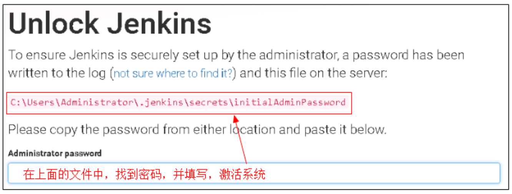

æ’件安装选择：安装æ¨èçš„æ’件，等待


设置åˆå§‹ç”¨æˆ·å’Œå¯†ç ï¼Œåˆå§‹åŒ–完æˆï¼Œè¿›å…¥ç³»ç»Ÿ

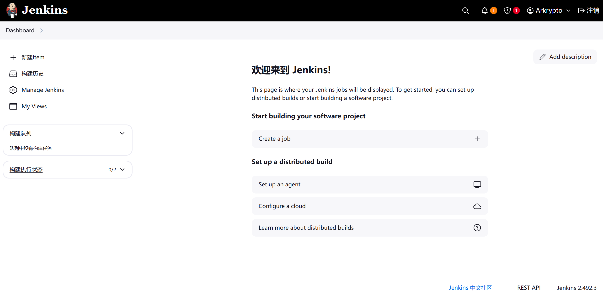

### 安全åŠå‡­è¯é…ç½®

用户手册：[User Handbook Overview](https://www.jenkins.io/doc/book/getting-started/)

安全设置


Security 设置


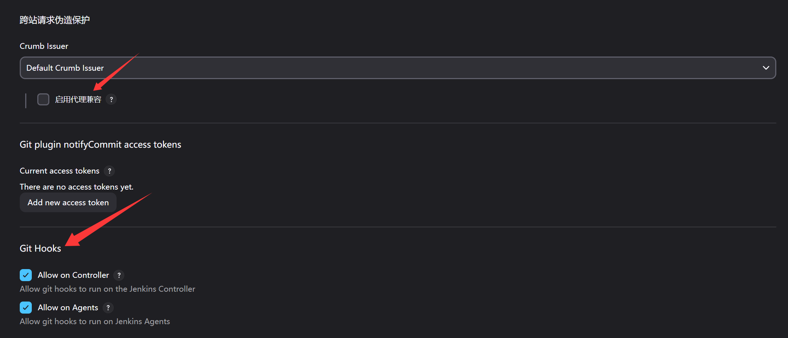

创建凭è¯ï¼ˆç¬¬ä¸€æ¬¡è¿›å…¥ç³»ç»Ÿå‡­è¯æ å°†æ˜¯ç©ºçš„），点击 Stores scoped to Jenkins 的“全局â€ï¼Œè€Œå在å³ä¸Šæ–¹ç‚¹å‡» Add Credentials

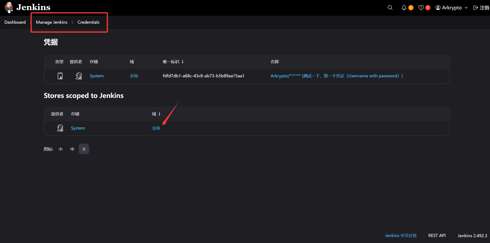

创建凭è¯

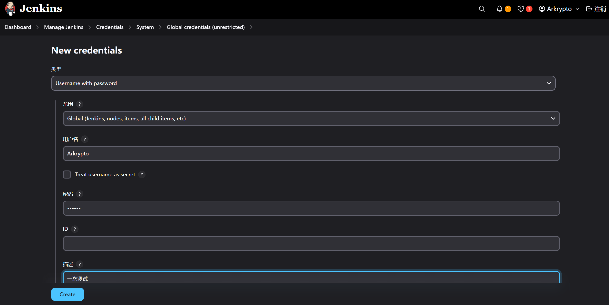

ID 为空系统将自动分é…，这个凭è¯ä¹‹å在创建 Item 时会用到

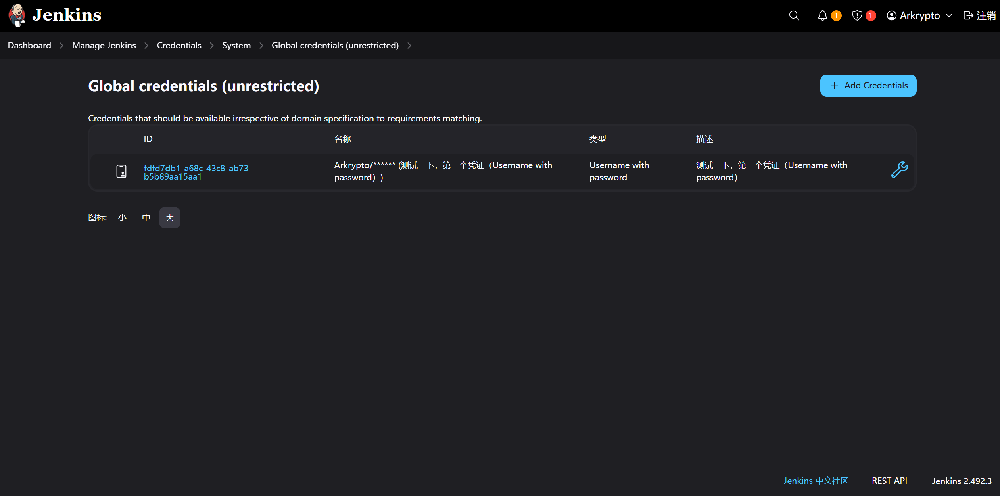

### 工具æ’件é…ç½®

全局 Tools é…置，主è¦æ˜¯ JDKã€Git å’Œ Maven


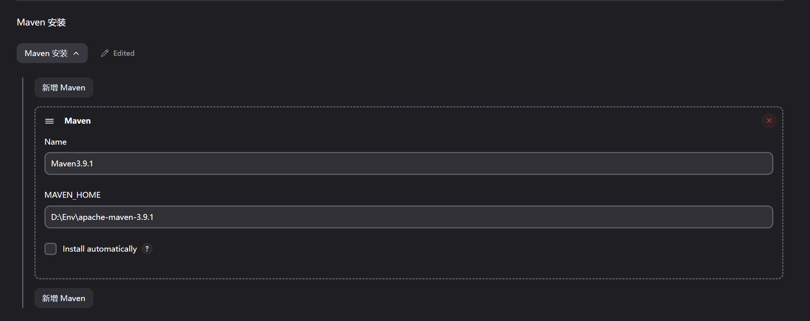

Plugins é…置，检查 Publish over SSH å’Œ Deploy to container Plugin 是å¦å®‰è£…æˆåŠŸå³å¯

### 系统é…ç½®

系统设置，é…置需è¦æ¨é€ jar 包的远端æœåŠ¡å™¨

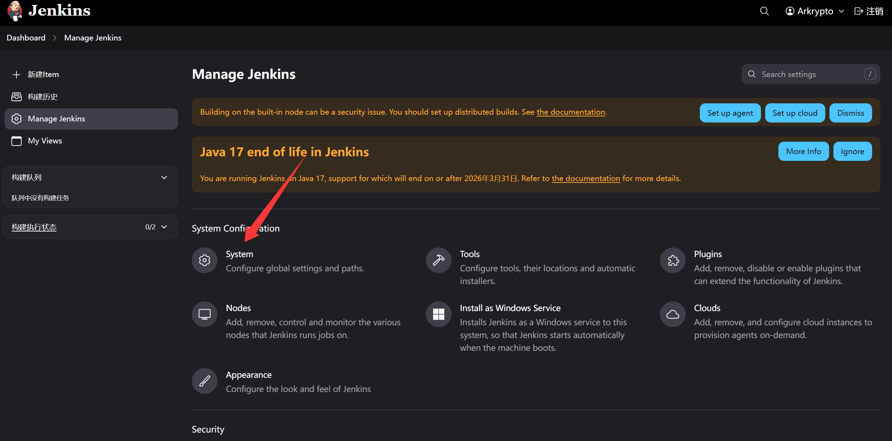

点击 System，翻到最下é¢ï¼Œ**注æ„åªè¦åœ¨å®‰è£…好 Publish over SSH å，在系统é…置中æ‰æœ‰è¿œç¨‹æœåŠ¡å™¨çš„é…置选项**


其中上é¢ä»…需填写 Passphrase（远程æœåŠ¡å™¨å¯†ç ï¼‰

点击 SSH Servers æ–°å¢æœåŠ¡å™¨


点击å³ä¸‹è§’测试è¿æ¥ï¼Œæ˜¾ç¤º Success，ä¿å­˜é€€å‡ºå³å¯

å¦å¤–为了测试方便，将 Jenkins URL 改æˆæœ¬æœºåœ°å€ï¼Œè¿™ä¸ªåœ¨ä¹‹å会用到


## CI 测试

SpringBoot + Maven + GitHub + Jenkins

### Linux æœåŠ¡å™¨é…ç½®

将两个脚本放到æœåŠ¡å™¨å¯¹åº”目录下`/home/arkrypto/app/`

stop.sh

```bash
#!/bin/bash
echo "Stop Procedure: GradeManagement-0.0.1-SNAPSHOT.jar.jar"
pid=`ps -ef |grep java|grep GradeManagement-0.0.1-SNAPSHOT.jar|awk '{print $2}'`
echo 'old Procedure pid:'$pid
if [ -n "$pid" ]
then
kill -9 $pid
fi
```

start.sh

```sh
#!/bin/bash
echo 'Start the program: GradeManagement-0.0.1-SNAPSHOT.jar'
chmod 777 /home/arkrypto/app/GradeManagement-0.0.1-SNAPSHOT.jar
echo '-------Starting-------'
cd /home/arkrypto/app/
nohup java -jar GradeManagement-0.0.1-SNAPSHOT.jar > log.out 2>&1 &
echo 'start success'
```

记得给文件加æƒé™

```sh
chmod +x stop.sh start.sh
```

注æ„å¯åŠ¨å‘½ä»¤ä¸èƒ½ç”¨

```sh
nohup java -jar GradeManagement-0.0.1-SNAPSHOT.jar &
```

他是阻å¡çš„，所以最åç»™ Jenkins çš„å馈一定会超时（手动部署惯了，这æ¡å‘½ä»¤å†å›è½¦å°±å¯ä»¥è·‘èµ·æ¥ï¼Œæ—¥å¿—将默认输出到当å‰ç›®å½•ä¸‹çš„ nohup.out）

而应该直æ¥æŒ‚èµ·

```sh
nohup java -jar GradeManagement-0.0.1-SNAPSHOT.jar --server.port=8090 > log.out 2>&1 &
```

### Jenkins Job

大体步骤：基础é…ç½® → æºç ç®¡ç† → æ„建触å‘器 → æ„建ç¯å¢ƒ → æ„建 → æ„建åæ“作

点击新建 Item，选择 Freestyle


#### 基础é…ç½®

基础é…置：选择 GitHub 项目，填入项目的 HTTP 链æ¥

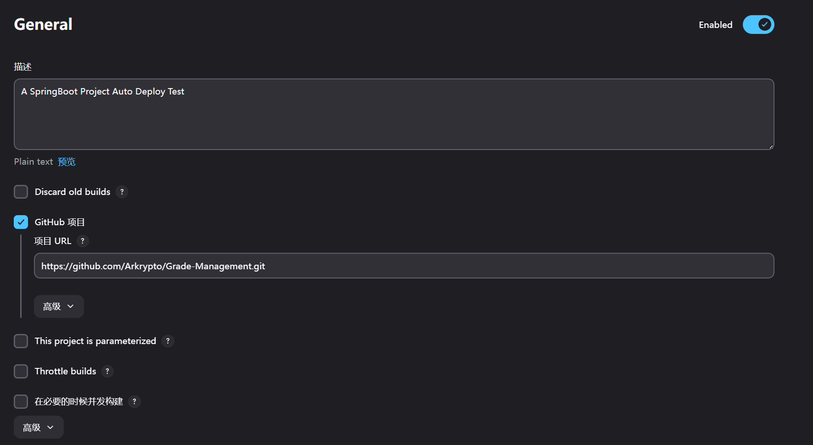

#### æºç ç®¡ç†

æºç ç®¡ç†ï¼Œé…ç½® Git 仓库，添加凭è¯ï¼ˆè¿™ä¸ªå‡­è¯æ˜¯åœ¨â€œå®‰å…¨åŠå‡­è¯è®¾ç½®â€å¤„创建的账å·å¯†ç å‹å‡­è¯ï¼‰

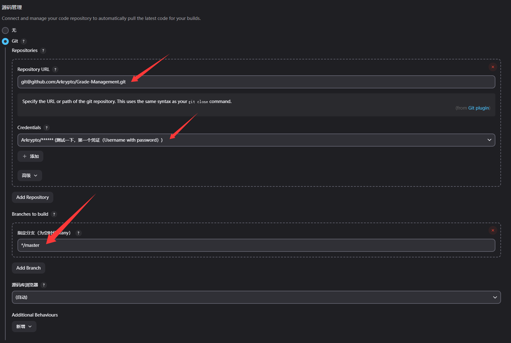

#### é’©å­

æ„建触å‘器：这里åªéœ€è¦é…置一个身份验è¯ä»¤ç‰Œ`TOKEN_NAME`，当外部用户访问 URL `JENKINS_URL/job/SpringBoot-Test/build?token=TOKEN_NAME`时，就会触å‘æ„建æµç¨‹ï¼ˆä¸€ä¸ªç®€å•çš„ GET 请求）

- 之å‰ç³»ç»Ÿé…置的时候有一个 Jenkins URL，设置为`http://127.0.0.1``
- 所以这里的è¿æ¥å®é™…上就是`http://127.0.0.1:8080/job/SpringBoot-Test/build?token=SpringBootJenkinsTest`

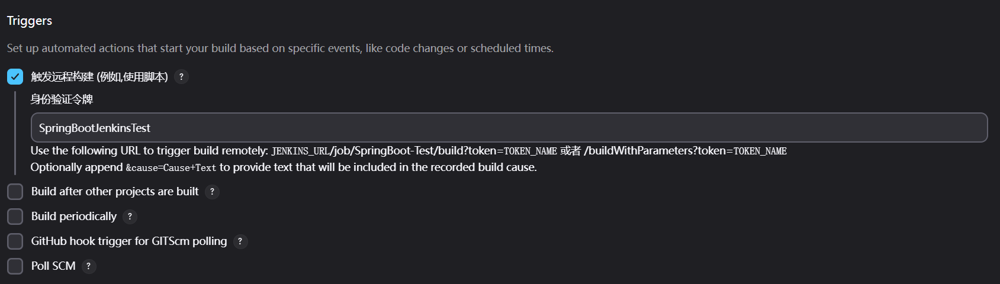

#### ç¯å¢ƒé…ç½®

ç¯å¢ƒé…ç½®ä¸ç®¡å°±è¡Œ


#### æ„建设置

æ„建命令：由äºæ˜¯åœ¨ Windows 下模拟，所以使用 bat 脚本进行æ„建，先进入 java 版本文件夹，å†ä½¿ç”¨ maven 清ç†ã€æ‰“包

```bash
cd backend-java
mvn clean
mvn package
```

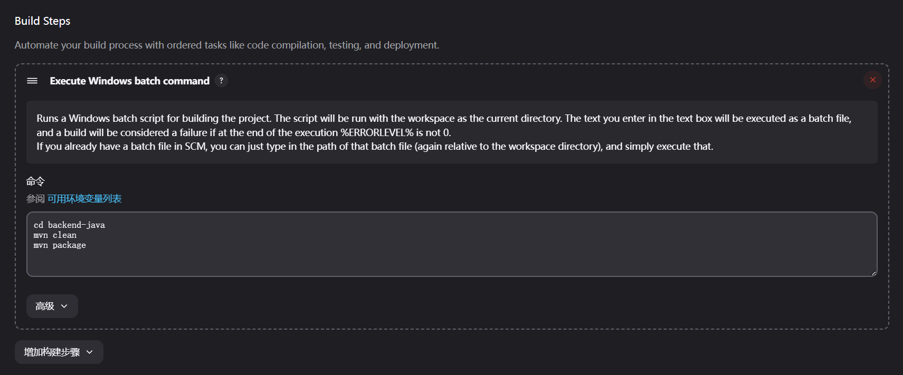

#### æ„建åæ“作

æ„建å步骤：这里的选择是将 jar 包æ¨é€åˆ°æœåŠ¡å™¨ä¸Šï¼ˆé€šè¿‡ SSH），需è¦é…置一下本地目录和æœåŠ¡å™¨ç›®å½•ï¼Œä»¥åŠæœåŠ¡å™¨ command


一切准备就绪å，点击 Build Now 执行第一次 Jenkins æ“作


### Issues

#### 仓库拉å–报错

拉仓库报错

```sh
ERROR: Couldn't find any revision to build. Verify the repository and branch configuration for this job.
SSH: Current build result is [FAILURE], not going to run.
Finished: FAILURE
```

åŸå› æ˜¯ï¼šè™½ç„¶æˆåŠŸæ‹‰å–了仓库，但没有找到对应的分支，äºæ˜¯ç»ˆæ­¢

刚刚在é…ç½® GitHub 仓库时，有一个分支的选项，默认给的是`*/master`，但ç°åœ¨ä»“库默认的分支为`main`，所以è¦ä¿®æ”¹ä¸º`*/main`


#### Maven 报错

```sh
C:\Users\northboat\.jenkins\workspace\SpringBoot-Test\backend-java>mvn package 
'mvn' ä¸æ˜¯å†…部或外部命令，也ä¸æ˜¯å¯è¿è¡Œçš„程åº
或批处ç†æ–‡ä»¶ã€‚

C:\Users\northboat\.jenkins\workspace\SpringBoot-Test\backend-java>exit 9009 
Build step 'Execute Windows batch command' marked build as failure
SSH: Current build result is [FAILURE], not going to run.
Finished: FAILURE
```

采用的`Execute Windows batch command`çš„æ–¹å¼è¿›è¡Œæ„建，但命令行没有找到 maven，但我é…置了ç¯å¢ƒå˜é‡ï¼Œåœ¨æœ¬åœ° cmd 测试也有正确输出

```sh
C:\Users\northboat>mvn -v
Apache Maven 3.9.1 (2e178502fcdbffc201671fb2537d0cb4b4cc58f8)
Maven home: D:\Env\apache-maven-3.9.1
Java version: 17.0.7, vendor: Oracle Corporation, runtime: D:\env\java\jdk17
Default locale: zh_CN, platform encoding: GBK
OS name: "windows 10", version: "10.0", arch: "amd64", family: "windows"
```

**问题本质：虽然在 Jenkins 全局工具里é…置了 Maven，但这åªå¯¹ Jenkins 内部的 “æ„建步骤类å‹â€ä¸º Maven 的步骤生效**

â¡ï¸ **Windows Batch Command** 是在系统的 CMD 中è¿è¡Œå‘½ä»¤ï¼Œå®ƒä¸ä¼šè‡ªåŠ¨åŠ è½½ Jenkins 的工具路径ï¼

所以还是è¦é‡‡ç”¨ **Invoke top-level Maven targets** çš„æ–¹å¼æ„建

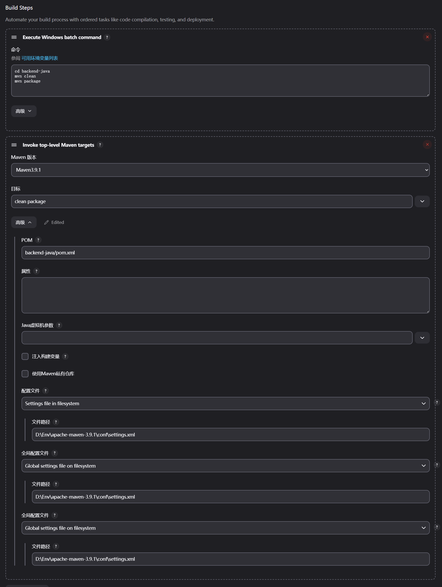

ç”±äºæˆ‘çš„ Java æºç å¹¶ä¸åœ¨æ ¹ç›®å½•ï¼Œè€Œæ˜¯åœ¨ backend-java 目录下，所以è¦æ‰‹åŠ¨é…ç½® POM çš„ä½ç½®ä¸º`backend-java/pom.xml`ï¼Œè¿™æ ·ä»–å°±èƒ½æ ¹æ® pom.xml 相对ä½ç½®æ­£ç¡®æ‰¾åˆ°å¯¹åº”æºç è¿›è¡Œæ„建了

记得删æ‰ä¸Šé¢é‚£ä¸ª`Windows Batch`，å†æ¬¡æ„建，é常好，本地拉å–并测试通过

```sh
  __________
 / ___  ___ \
/ / @ \/ @ \ \
\ \___/\___/ /\
 \____\/____/||
 /     /\\\\\//
|     |\\\\\\
 \      \\\\\\
   \______/\\\\
    _||_||_
2025-04-20T15:25:43.866+08:00  INFO 92960 --- [           main] c.a.g.GradeManagementApplicationTests    : Starting GradeManagementApplicationTests using Java 17.0.7 with PID 92960 (started by northboat in C:\Users\northboat\.jenkins\workspace\SpringBoot-Test\backend-java)
2025-04-20T15:25:43.869+08:00  INFO 92960 --- [           main] c.a.g.GradeManagementApplicationTests    : No active profile set, falling back to 1 default profile: "default"
2025-04-20T15:25:45.131+08:00  INFO 92960 --- [           main] o.s.b.a.w.s.WelcomePageHandlerMapping    : Adding welcome page: class path resource [static/index.html]
2025-04-20T15:25:45.336+08:00  INFO 92960 --- [           main] c.a.g.GradeManagementApplicationTests    : Started GradeManagementApplicationTests in 1.841 seconds (process running for 2.887)
[INFO] Tests run: 1, Failures: 0, Errors: 0, Skipped: 0, Time elapsed: 2.897 s - in com.arkrypto.grademanagement.GradeManagementApplicationTests
[INFO] 
[INFO] Results:
[INFO] 
[INFO] Tests run: 1, Failures: 0, Errors: 0, Skipped: 0
[INFO] 
[INFO] 
[INFO] --- jar:3.3.0:jar (default-jar) @ GradeManagement ---
[INFO] Building jar: C:\Users\northboat\.jenkins\workspace\SpringBoot-Test\backend-java\target\GradeManagement-0.0.1-SNAPSHOT.jar
[INFO] 
[INFO] --- spring-boot:3.0.2:repackage (repackage) @ GradeManagement ---
[INFO] ------------------------------------------------------------------------
[INFO] BUILD SUCCESS
[INFO] ------------------------------------------------------------------------
[INFO] Total time:  9.422 s
[INFO] Finished at: 2025-04-20T15:25:46+08:00
[INFO] ------------------------------------------------------------------------
```

但是出ç°äº†æ–°çš„问题

#### æ„建åæ“作报错

æœåŠ¡å™¨åœ¨ä¸Šé¢é…置过，测试è¿æ¥é€šè¿‡è¿‡

```sh
SSH: Connecting from host [DESKTOP-32RH6TB]
SSH: Connecting with configuration [腾讯-新加å¡] ...
SSH: EXEC: completed after 218 ms
SSH: Disconnecting configuration [腾讯-新加å¡] ...
ERROR: Exception when publishing, exception message [Exec exit status not zero. Status [127]]
Build step 'Send build artifacts over SSH' changed build result to UNSTABLE
Finished: UNSTABLE
```

其中

- `Exec exit status not zero`ï¼šè¯´æ˜ Jenkins å°è¯•æ‰§è¡Œè¿œç¨‹å‘½ä»¤æ—¶ï¼Œè¿”å›ç ä¸ä¸º 0，代表执行失败
- `Status [127]`：这个在 Linux 系统中表示 **“命令未找到â€**（Command Not Found）

好å§ï¼Œæˆ‘他妈忘记把脚本放到æœåŠ¡å™¨äº†ï¼Œéš¾ç»·

ä¸å¯¹ï¼Œæ”¾ä¸Šå»äº†è¿˜æ˜¯ä¸è¡Œï¼Œæˆ‘å‘ç° jar 包就没传上å»ï¼Œæˆ‘é‡å¤æ£€æŸ¥äº†â€œæ„建åæ“作â€çš„é…置，å°è¯•ç»™æœåŠ¡å™¨ä¸Šæ–‡ä»¶å¤¹æ·»åŠ å†™æƒé™

```sh
chmod 755 /home/arkrypto/app
```

如æœæˆåŠŸä¸Šä¼ çš„è¯ï¼ŒJenkins æ§åˆ¶å°ä¼šæœ‰ç±»ä¼¼è¿™æ ·çš„输出

```sh
SSH: Transferred 1 file(s)
```

这次æ§åˆ¶å°è¾“出似ä¹å¾ˆæ­£å¸¸

```sh
SSH: Connecting from host [DESKTOP-32RH6TB]
SSH: Connecting with configuration [腾讯-新加å¡] ...
SSH: EXEC: completed after 204 ms
SSH: Disconnecting configuration [腾讯-新加å¡] ...
SSH: Transferred 1 file(s)
Finished: SUCCESS
```

但是更大的问题æ¥äº†ï¼Œæˆ‘ TM æœåŠ¡å™¨ä¸Šæ­»æ´»æ‰¾ä¸åˆ° jar 包，如传，WTF

OK，我好åƒå‘ç°äº†é—®é¢˜æ‰€åœ¨ï¼Œæˆ‘在系统æœåŠ¡å™¨é…置中 SSH Servers 忘记填根目录了

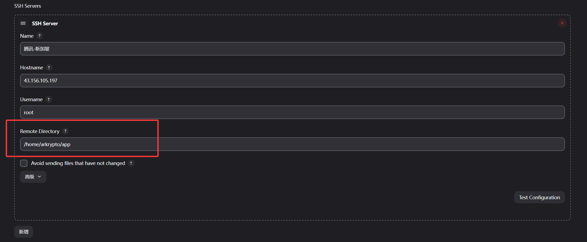

相应的在项目 Job 中的远程目录置空

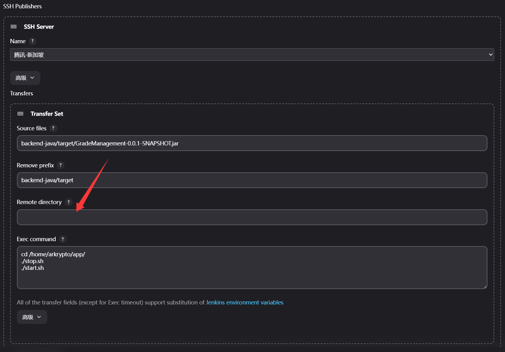

gOOd，终äºæˆåŠŸä¼ ä¸Šå»äº†

```sh
root@VM-0-11-debian:/home/arkrypto/app# ls
GradeManagement-0.0.1-SNAPSHOT.jar  nohup.out  start.sh  stop.sh
```

#### Jar 包导出设置

ç”±äºæ˜¯ maven æ„造，我们关注点必然是在 pom.xml，这里是 springboot 项目，用到 maven æ’件进行导出，有如下é…ç½®

```xml
<build>
    <plugins>
        <plugin>
            <groupId>org.apache.maven.plugins</groupId>
            <artifactId>maven-compiler-plugin</artifactId>
            <version>3.8.1</version>
            <configuration>
                <source>17</source>
                <target>17</target>
                <encoding>UTF-8</encoding>
            </configuration>
        </plugin>
        <plugin>
            <groupId>org.springframework.boot</groupId>
            <artifactId>spring-boot-maven-plugin</artifactId>
            <version>${spring-boot.version}</version>
            <configuration>
                <mainClass>com.arkrypto.grademanagement.GradeManagementApplication</mainClass>
                <skip>true</skip>
            </configuration>
            <executions>
                <execution>
                    <id>repackage</id>
                    <goals>
                        <goal>repackage</goal>
                    </goals>
                </execution>
            </executions>
        </plugin>
    </plugins>
</build>
```

这个`pom.xml`é…置已ç»é常æ¥è¿‘æˆåŠŸäº†ï¼Œé—®é¢˜çš„关键在äºè¿™ä¸€å¥

```xml
<skip>true</skip>
```

💥 **这个é…置等äºå‘Šè¯‰ Maven：跳过 Spring Boot æ’件的执行ï¼**
 也就是说，虽然你é…置了 `repackage` 目标，**但由äºè®¾ç½®äº† `skip=true`，这个目标根本没被执行**，所以 JAR 包就æˆäº†æ™®é€š JAR，没有 `Main-Class`，äºæ˜¯å¯¼è‡´å¯åŠ¨æŠ¥é”™

```sh
no main manifest attribute, in GradeManagement-0.0.1-SNAPSHOT.jar
```

✅ 正确åšæ³•ï¼šä½ åªéœ€è¦æŠŠ `<skip>true</skip>` **删æ‰**或者改为

```xml
<skip>false</skip>
```

或者，干脆直æ¥åˆ æ‰æ•´ä¸ª`<configuration>`å—，如æœä½ ä¸éœ€è¦æ‰‹åŠ¨æŒ‡å®š`mainClass`

- Spring Boot 会自动识别带有`@SpringBootApplication`注解的类

### GitHub é…ç½®

还记得那个 URL å—：`JENKINS_URL/job/SpringBoot-Test/build?token=TOKEN_NAME`

ç”±äºæˆ‘å®åœ¨æœ¬åœ°éƒ¨ç½²ï¼Œæ‰€ä»¥ URL 就是

```sh
http://localhost:8080/job/SpringBoot-Test/build?token=SpringBootJenkinsTest
```

使用[è´é”èŠ±ç”Ÿå£³ç®¡ç† - 内网穿é€](https://console.hsk.oray.com/forward)å°†`localhost:8090`ç©¿é€åˆ°`https://889ehmd12181.vicp.fun`

äºæ˜¯å›è°ƒ URL å˜ä¸º

```
https://889ehmd12181.vicp.fun/job/SpringBoot-Test/build?token=SpringBootJenkinsTest
```

点开仓库设置

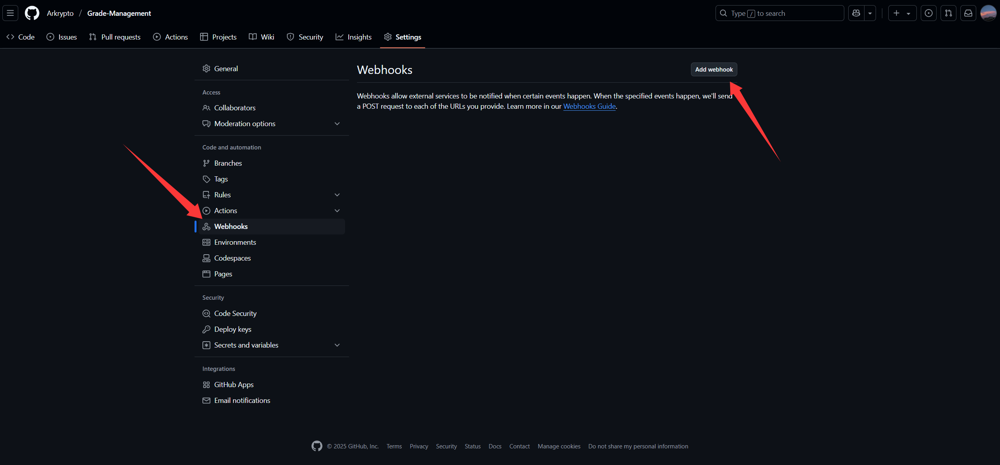

添加勾å­

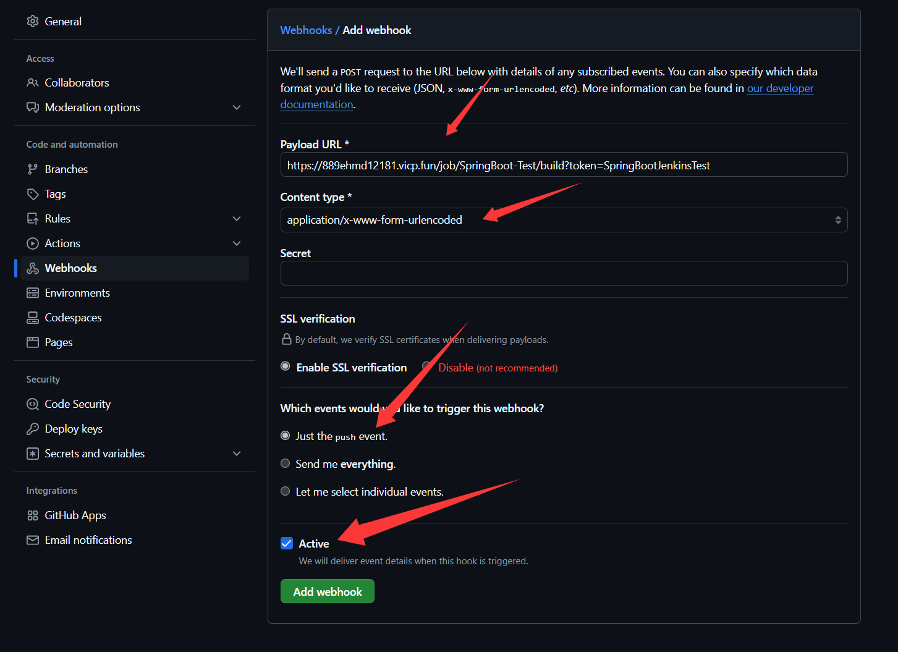

æ¨é€ä¸€ä¸‹ï¼Œæµ‹è¯•ä¸€ä¸‹ï¼Œç„¶å，失败了

而å我测试了一下在æµè§ˆå™¨ç›´æ¥è®¿é—® https://889ehmd12181.vicp.fun/job/SpringBoot-Test/build?token=SpringBootJenkinsTest，是能够触å‘任务的

å†ä¸€ç»†çœ‹ï¼Œå“¦ï¼ŒGitHub çš„ WebHook å‘é€çš„是 Post 请求，而é触å‘任务的 Get，包æˆåŠŸä¸äº†çš„，这里需è¦ä¿®æ”¹ Jenkins Job çš„é…置，之å‰åœ¨ Jenkins Job / é’©å­é…置的时候，使用的是“身份验è¯ä»¤ç‰Œâ€


改æˆ`GitHub hook trigger for GITScm polling`

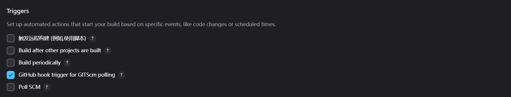

然å在系统设置中，找到 GitHub æ’件，点击高级，添加 Hook URL 设置（这里直æ¥ç”¨çš„æœ¬æœºåœ°å€ 127.0.0.1，å正会被穿出å»ï¼‰


然å修改 GitHub çš„ WebHook é…ç½®

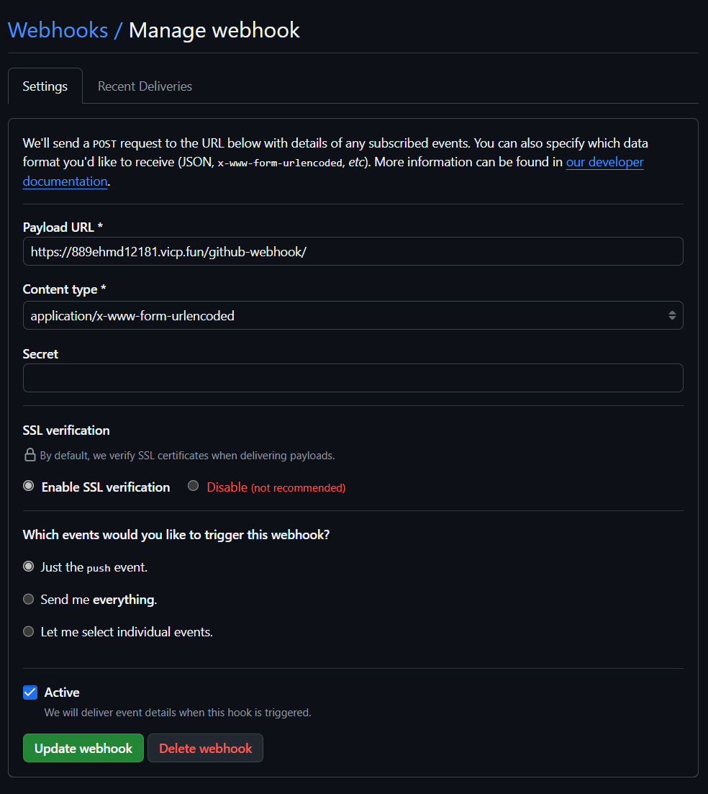

总算 NMB æˆåŠŸäº†

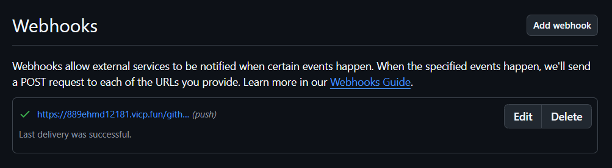

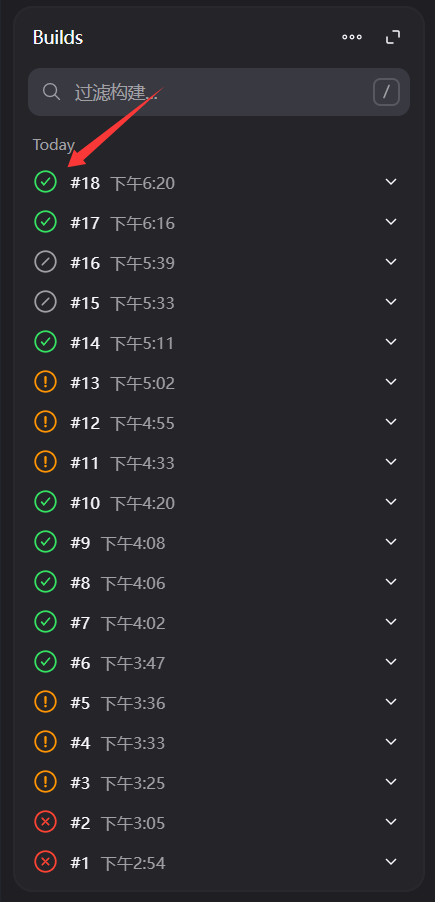

## 更多 CI/CD

### GitHub Action

用 GitHub Action 部署é™æ€åšå®¢ï¼Œæœ¬åœ° build，使用 GitHub Action 对`./docs/.vuepress/dist`文件夹下的é™æ€ HTML 进行自动化部署

é…置文件：`.github/workflows/static.yml`

```yaml
# Simple workflow for deploying static content to GitHub Pages
name: Deploy static content to Pages

on:
  # Runs on pushes targeting the default branch
  push:
    branches: ["main"]

  # Allows you to run this workflow manually from the Actions tab
  workflow_dispatch:

# Sets permissions of the GITHUB_TOKEN to allow deployment to GitHub Pages
permissions:
  contents: read
  pages: write
  id-token: write

# Allow only one concurrent deployment, skipping runs queued between the run in-progress and latest queued.
# However, do NOT cancel in-progress runs as we want to allow these production deployments to complete.
concurrency:
  group: "pages"
  cancel-in-progress: false

jobs:
  # Single deploy job since we're just deploying
  deploy:
    environment:
      name: github-pages
      url: ${{ steps.deployment.outputs.page_url }}
    runs-on: ubuntu-latest
    steps:
      - name: Checkout
        uses: actions/checkout@v4
      - name: Setup Pages
        uses: actions/configure-pages@v4
      - name: Upload artifact
        uses: actions/upload-pages-artifact@v3
        with:
          # Upload entire repository
          path: './docs/.vuepress/dist'
      - name: Deploy to GitHub Pages
        id: deployment
        uses: actions/deploy-pages@v4
```

### Netlify

自动化部署 Slides PPT，在 Netlify 中导入 GitHub 仓库，é…ç½®`Site configuration`

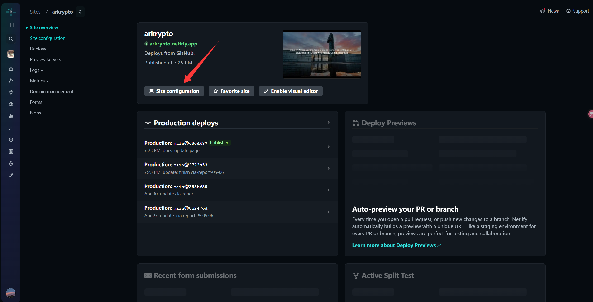

网站 URL 将以`SiteName.netlify.app`çš„æ–¹å¼å‘ˆç°

比较é‡è¦çš„é…置：Build & deploy

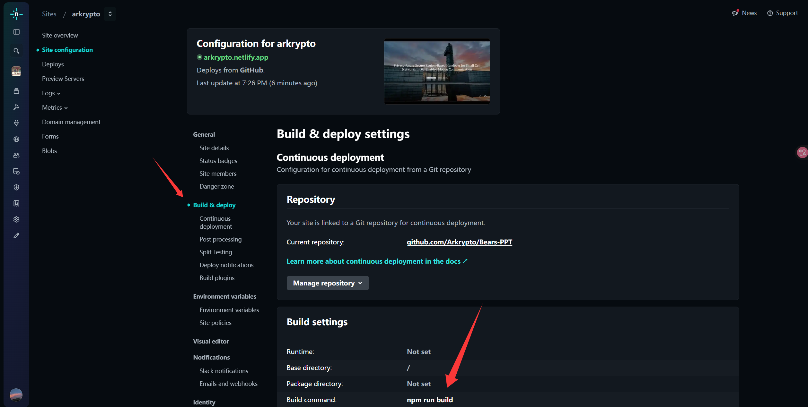

å…¶å®å’Œæœ¬åœ°ç¼–译的过程一样，因为在 package.json 里é¢å·²ç»å†™å¥½äº†å‘½ä»¤ï¼ŒNetlify 进行下载ã€ç¼–译是å‚ç…§ package.json 进行的，例如

```json
{
  "name": "bears-ppt",
  "private": true,
  "scripts": {
    "build": "slidev build",
    "dev": "slidev --open",
    "export": "slidev export"
  },
  "dependencies": {
    "@slidev/cli": "^0.40.16",
    "@slidev/theme-default": "*",
    "@slidev/theme-seriph": "^0.21.3",
    "resolve-from": "^5.0.0"
  },
  "devDependencies": {
    "playwright-chromium": "^1.48.2"
  }
}
```

所以远端命令设置为 npm run build 就行


å¦å¤–è¦æ³¨æ„é™æ€æ–‡ä»¶çš„ä½ç½®ï¼Œä¾‹å¦‚这个项目将把 HTML 文件生æˆåœ¨æ ¹ç›®å½•çš„ /dist 目录下，这个一定是è¦é…置一致的

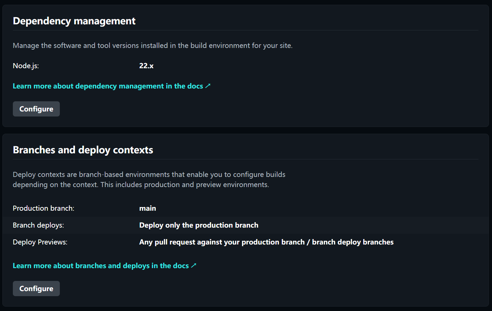

最å注æ„一下指定 Node 版本和仓库分支，其他就没什么了，æ¯ä¸€æ¬¡ä»“库æ¨é€éƒ½ä¼šè§¦å‘ Netlify 的自动æ„建任务，æµç¨‹å’Œ Jenkins 完全一致：git pull → build → deploy
