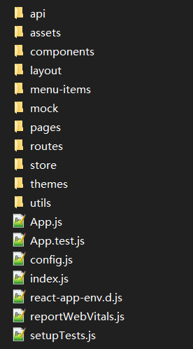
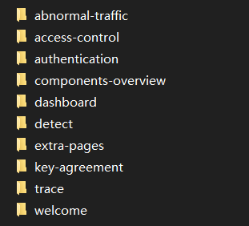
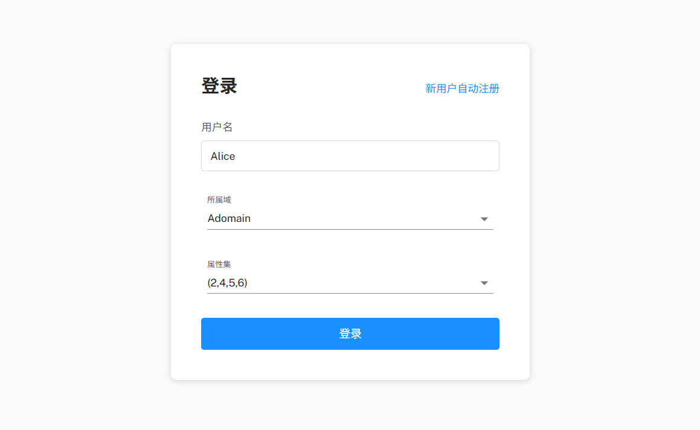
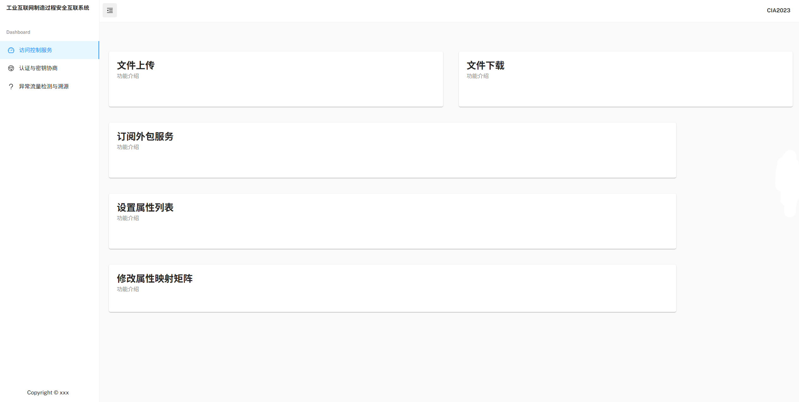
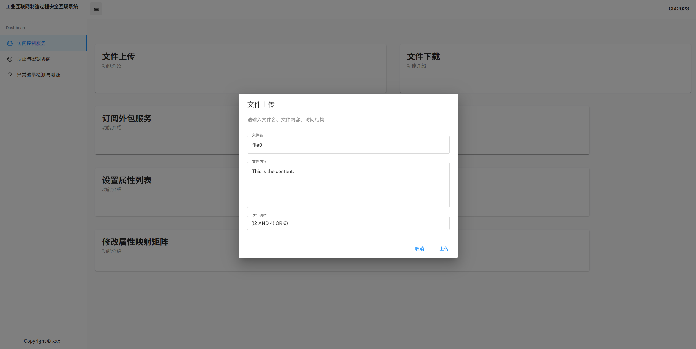
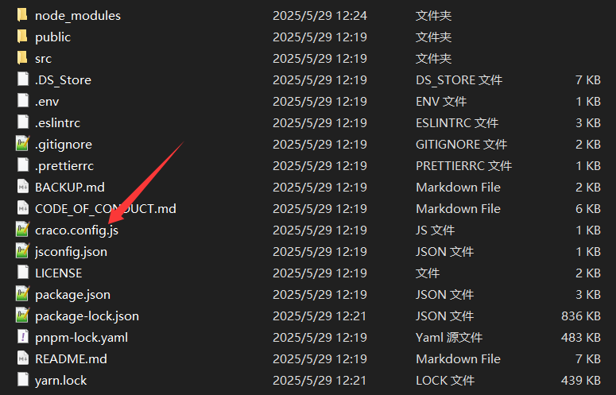
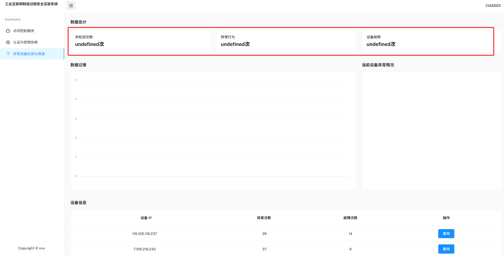

## React 基础

### 什么是 React

React 是一个 **用于构建用户界面（UI）** 的 **JavaScript 库**，由 Facebook（现在的 Meta）开发和维护。它专注于构建**视图层**，通过组件化的方式来构建界面，并鼓励**声明式编程**和**单向数据流**

核心特点

1️⃣ 组件化开发：组件即函数

```jsx
function Hello(props) {
  return <h1>Hello, {props.name}</h1>;
}
```

2️⃣ JSX 语法：React 推荐使用 JSX，一种在 JavaScript 中写 HTML 的语法糖

```jsx
const element = <h1>Hello World</h1>;
```

这看起来像 HTML，其实是被 Babel 编译为`React.createElement()`的 JavaScript 调用

3️⃣ 声明式 UI：例如你不需要自己操作 DOM 来更新`count`，React 自动帮你更新

```jsx
const [count, setCount] = useState(0);

return <button onClick={() => setCount(count + 1)}>Clicked {count} times</button>
```

4️⃣ 状态和 Hooks：使用`useState`、`useEffect`等 Hook 来管理组件状态和生命周期

```jsx
const [count, setCount] = useState(0);
useEffect(() => {
  console.log("组件渲染了");
}, [count]);
```

5️⃣ 虚拟 DOM：React 在内存中维护一个“虚拟 DOM”，对比前后变化后，**只更新必要的部分**，提升性能

React 可用于

- Web 应用（配合 React Router）
- 移动端应用（React Native）
- 桌面应用（Electron + React）
- 服务端渲染（Next.js）

注意：React 不是全能框架，它**只负责“视图层”**，需要根据项目需求搭配

说白了，就是一个 JS 库，通过 JSX 语法糖支持 JS 和 HTML 的混合编写，而后通过 JS 函数返回前端组件（所谓函数式编程），经过一层层嵌入实现一个完整的 HTML 页面，而页面上的数据请求逻辑在函数中就已经写好了，最后返回的组件是封装完好的

- 这是 JS 和 HTML 混合编写的好处，即在一个函数中实现完整的组件开发：包括后端请求和前端渲染

### React VS. Vue

基本概念

| 特性     | Vue                                     | React                                                    |
| -------- | --------------------------------------- | -------------------------------------------------------- |
| 框架类型 | 渐进式框架                              | 库（Library）更偏向 UI 层                                |
| 哲学思想 | MVVM 模式，关注“响应式”                 | 函数式编程 + 单向数据流                                  |
| 核心驱动 | 模板语法 + 响应式系统                   | JSX + 虚拟 DOM                                           |
| 官方维护 | Vue 全家桶（Vuex、Vue Router、Vue CLI） | React 核心 + 社区支持生态（Redux、React Router、Vite等） |

组件写法，React 采用函数式编程，函数即组件，而 Vue 是“模板语法”，例如一个简单的 Vue 组件

```vue
<template>
  <div>{{ message }}</div>
</template>

<script>
export default {
  data() {
    return {
      message: 'Hello Vue!'
    }
  }
}
</script>
```

对比一个简单的 React 组件

```jsx
import { useState } from 'react';

function MyComponent() {
  const [message, setMessage] = useState('Hello React!');
  return <div>{message}</div>;
}
```

这本质上因为

- Vue 使用的是 SFC（Single File Component），有模板+逻辑+样式，是传统的前端思路
- React 是 JSX（JavaScript + XML），逻辑和模板写在一起，更自由，更代码化
- React 的函数组件是主流（类组件已不推荐），配合 Hook 实现状态和生命周期管理

生命周期对比

| 生命周期阶段 | Vue (3.x Composition API) | React (Hook)                               |
| ------------ | ------------------------- | ------------------------------------------ |
| 创建前       | `setup()`                 | `useEffect(() => {}, [])`                  |
| 更新时       | `onUpdated`               | `useEffect(() => { ... }, [deps])`         |
| 卸载时       | `onUnmounted`             | `useEffect(() => { return () => {} }, [])` |

React 通过`useEffect`模拟生命周期，不再是“声明式生命周期钩子”，而是函数内使用 Hook，可以将`useEffect`理解为 React 的钩子函数

状态管理

| 特性         | Vue                   | React                        |
| ------------ | --------------------- | ---------------------------- |
| 简单状态管理 | `reactive()`、`ref()` | `useState()`、`useReducer()` |
| 全局状态管理 | Vuex / Pinia          | Redux、Zustand、Recoil 等    |

路由和生态

| 特性         | Vue                   | React                        |
| ------------ | --------------------- | ---------------------------- |
| 简单状态管理 | `reactive()`、`ref()` | `useState()`、`useReducer()` |
| 全局状态管理 | Vuex / Pinia          | Redux、Zustand、Recoil 等    |

其他差异

| 特性     | Vue                | React                              |
| -------- | ------------------ | ---------------------------------- |
| 模板逻辑 | 推荐模板中少写逻辑 | JSX中可写任意 JS 表达式            |
| 表单处理 | `v-model` 简洁     | 需手动 `onChange` + `value`        |
| 条件渲染 | `v-if` / `v-show`  | 三元表达式 `condition ? ... : ...` |
| 列表渲染 | `v-for`            | `map()` 函数                       |

如何选择？

| 场景                                      | 推荐                       |
| ----------------------------------------- | -------------------------- |
| 喜欢模板式开发、快速上手                  | Vue 更合适                 |
| 偏好函数式、JS 灵活度高、生态庞大         | React 更强大               |
| 需要大型工程能力（SSR、Server Component） | React（Next.js）领先一些   |
| 偏向移动端（小程序等）                    | Vue（uni-app、Taro）更亲民 |

## Mantis React

基于模板开发：[codedthemes/mantis-free-react-admin-template: Mantis is React Dashboard Template having combine tone of 2 popular react component library - MUI and Ant Design principles.](https://github.com/codedthemes/mantis-free-react-admin-template/)

文档：[Documentation | Mantis MUI React](https://codedthemes.gitbook.io/mantis)

### 项目结构

src 目录结构



主要改写的就是 pages 目录下的页面



### 登录实现

实现这样一个页面



`/pages/authentication/Login.js`

```js
import { Link } from 'react-router-dom';

// material-ui
import { Grid, Stack, Typography } from '@mui/material';

// project import
import AuthLogin from './auth-forms/AuthLogin';
import AuthWrapper from './AuthWrapper';

// ================================|| LOGIN ||================================ //

const Login = () => (
  <AuthWrapper>
    <Grid container spacing={3}>
      <Grid item xs={12}>
        <Stack direction="row" justifyContent="space-between" alignItems="baseline" sx={{ mb: { xs: -0.5, sm: 0.5 } }}>
          <Typography variant="h3">登录</Typography>
          <Typography component={Link} to="#" variant="body1" sx={{ textDecoration: 'none' }} color="primary">
            新用户自动注册
          </Typography>
          {/* <Typography component={Link} to="/register" variant="body1" sx={{ textDecoration: 'none' }} color="primary">
            Don&apos;t have an account?
          </Typography> */}
        </Stack>
      </Grid>
      <Grid item xs={12}>
        <AuthLogin />
      </Grid>
    </Grid>
  </AuthWrapper>
);

export default Login;
```

很显然这里用到了组件 AuthLogin，来自`/pages/authentication/AuthLogin.js`

```js
import React from 'react';
import { Link as RouterLink } from 'react-router-dom';

// material-ui
import {
  Button,
  Checkbox,
  Divider,
  FormControlLabel,
  FormHelperText,
  Grid,
  Link,
  IconButton,
  InputAdornment,
  InputLabel,
  OutlinedInput,
  Stack,
  Typography,
  MenuItem,
  FormControl,
  Select
} from '@mui/material';
// third party
import * as Yup from 'yup';
import { Formik } from 'formik';

// project import
import FirebaseSocial from './FirebaseSocial';
import AnimateButton from 'components/@extended/AnimateButton';

// assets
import { EyeOutlined, EyeInvisibleOutlined } from '@ant-design/icons';

// ============================|| FIREBASE - LOGIN ||============================ 
import { useNavigate } from 'react-router-dom';
import { userLoginService } from 'api';

const AuthLogin = () => {
  const [checked, setChecked] = React.useState(false);
  const [domain, setDomain] = React.useState('Adomain');
  const [attributeList, setAttributeList] = React.useState('(2,4,5,6)');
  const handleDomainChange = (event: SelectChangeEvent) => {
    setDomain(event.target.value);
  };
  const handleChangeAttributeList = (event: SelectChangeEvent) => {
    setAttributeList(event.target.value);
  };
  const [showPassword, setShowPassword] = React.useState(false);
  const handleClickShowPassword = () => {
    setShowPassword(!showPassword);
  };

  const handleMouseDownPassword = (event) => {
    event.preventDefault();
  };

  const nav = useNavigate();
  return (
    <>
      <Formik
        initialValues={{
          username: 'Alice',
          domain: 'Adomain',
          attributeset: '(2,4,5,6)'
        }}
        validationSchema={Yup.object().shape({
          username: Yup.string().required('请填写用户名')
        })}
        onSubmit={async (values, { setErrors, setStatus, setSubmitting }) => {
          const { username, domain, attributeset } = values;
          localStorage.setItem('username', username);
          localStorage.setItem('domain', domain);
          let data = {
            "username" : username,
            "domain" : domain,
            "attributeset" : attributeset
          }
          console.log(data)
          userLoginService(data)
            .then((res) => {
              console.log(res);
              setStatus({ success: true });
              setSubmitting(false);
              nav('/');
            })
            .catch((err) => {
              console.log(err);
              setStatus({ success: false });
              setErrors({ submit: err.message });
              setSubmitting(false);
            });
        }}
      >
        {({ errors, handleBlur, handleChange, handleSubmit, isSubmitting, touched, values }) => (
          <form noValidate onSubmit={handleSubmit}>
            <Grid container spacing={3}>
              <Grid item xs={12}>
                <Stack spacing={1}>
                  <InputLabel htmlFor="username-login">用户名</InputLabel>
                  <OutlinedInput
                    id="username-login"
                    type="text"
                    value={values.username}
                    name="username"
                    onBlur={handleBlur}
                    onChange={handleChange}
                    placeholder="请输入用户名"
                    fullWidth
                    error={Boolean(touched.username && errors.username)}
                  />
                  {touched.username && errors.username && (
                    <FormHelperText error id="standard-weight-helper-text-username-login">
                      {errors.username}
                    </FormHelperText>
                  )}
                </Stack>
              </Grid>
              <Grid item xs={12}>
                <Stack spacing={1}>
                  {/* <InputLabel htmlFor="password-login">所属域</InputLabel> */}
                  <FormControl variant="standard" sx={{ m: 1, minWidth: 120 }}>
                    <InputLabel id="demo-simple-select-standard-label">所属域</InputLabel>
                    <Select
                      labelId="demo-simple-select-standard-label"
                      id="demo-simple-select-standard"
                      value={domain}
                      onChange={handleDomainChange}
                      label="domain"
                    >
                      <MenuItem value={'Adomain'}>Adomain</MenuItem>
                      <MenuItem value={'Bdomain'}>Bdomain</MenuItem>
                    </Select>
                  </FormControl>
                </Stack>
              </Grid>
              <Grid item xs={12}>
                <Stack spacing={1}>
                  <FormControl variant="standard" sx={{ m: 1, minWidth: 120 }}>
                    <InputLabel id="demo-simple-select-standard-label">属性集</InputLabel>
                    <Select
                      labelId="demo-simple-select-standard-label"
                      id="demo-simple-select-standard"
                      value={attributeList}
                      onChange={handleChangeAttributeList}
                      label="domain"
                    >
                      <MenuItem value={'(2,4,5,6)'}>(2,4,5,6)</MenuItem>
                      <MenuItem value={'(1,2,3)'}>(1,2,3)</MenuItem>
                      <MenuItem value={'(1,2,3,4)'}>(1,2,3,4)</MenuItem>
                      <MenuItem value={'(1,2,3,4,5)'}>(1,2,3,4,5)</MenuItem>
                    </Select>
                  </FormControl>
                </Stack>
              </Grid>

              {errors.submit && (
                <Grid item xs={12}>
                  <FormHelperText error>{errors.submit}</FormHelperText>
                </Grid>
              )}
              <Grid item xs={12}>
                <AnimateButton>
                  <Button disableElevation disabled={isSubmitting} fullWidth size="large" type="submit" variant="contained" color="primary">
                    登录
                  </Button>
                </AnimateButton>
              </Grid>
            </Grid>
          </form>
        )}
      </Formik>
    </>
  );
};

export default AuthLogin;
```

在这定义了登录按钮时间，通过 onSubmit 绑定 Formik 标签

```js
<Formik
initialValues={{
               username: 'Alice',
               domain: 'Adomain',
               attributeset: '(2,4,5,6)'
              }}
              validationSchema={Yup.object().shape({
                  username: Yup.string().required('请填写用户名')
              })}
              onSubmit={async (values, { setErrors, setStatus, setSubmitting }) => {
                  const { username, domain, attributeset } = values;
                  localStorage.setItem('username', username);
                  localStorage.setItem('domain', domain);
                  let data = {
                      "username" : username,
                      "domain" : domain,
                      "attributeset" : attributeset
                  }
                  console.log(data)
                  userLoginService(data)
                      .then((res) => {
                      console.log(res);
                      setStatus({ success: true });
                      setSubmitting(false);
                      nav('/');
                  })
                      .catch((err) => {
                      console.log(err);
                      setStatus({ success: false });
                      setErrors({ submit: err.message });
                      setSubmitting(false);
                  });
              }}
                  >
```

### 点击事件

主页内容



由`/pages/access-control/index.jsx`定义：[Ark-Blockchain-Archetype/frontend/src/pages/access-control/index.jsx at main · Arkrypto/Ark-Blockchain-Archetype](https://github.com/Arkrypto/Ark-Blockchain-Archetype/blob/main/frontend/src/pages/access-control/index.jsx)

其实就是一个页面，通过不同的`Dialog`来控制`Card`展示，以文件上传弹窗为例



```jsx
// 文件上传弹窗
const [isUploadShow, setIsUploadShow] = React.useState(false); // 控制弹窗显示
const [fileUploadParams, setFileUploadParams] = React.useState(FILEUPLOADPARAMS);
const setFileName = (val) => setFileUploadParams({ ...fileUploadParams, filename: val });
const setContent = (val) => setFileUploadParams({ ...fileUploadParams, content: val });
const setAccessTree = (val) => setFileUploadParams({ ...fileUploadParams, accesstree: val });


const handleFileUpload = () => {
    const data = {
        ...fileUploadParams,
        username: localStorage.getItem('username') || '',
        domain: localStorage.getItem('domain') || ''
    };
    console.log("文件上传请求参数:")
    console.log(data)
    fileUploadService(data)
        .then((res) => {
        if (res.code === '200') {
            setIsUploadShow(false);
            handleMsgShow("文件上传成功")
        } else {
            setIsUploadShow(false);
            handleMsgShow("文件上传失败")
        }
    })
        .catch((e) => {
        // console.log("nmsl")
        console.log(e);
        setIsUploadShow(false);
        handleMsgShow(e.message)
    });
};
```

其中`fileUploadService`函数在`/api/file.js`中定义，就是一个简单的 JS Post 请求

```js
import request from '../utils/request';

// 文件上传
export const fileUploadService = (data) => request.post('/file/upload', data);
// 订阅外包服务
export const fileOutSourceService = (data) => request.post('/file/outsource/set', data);
// 域内文件下载
export const fileInDomainDlService = (data) => request.post('/file/indomain/download', data);
// 跨域访问服务（跨域文件下载）
export const fileCrossDomainDlService = (data) => request.post('/file/crossdomain/download', data);
// 密钥协商
export const getKeyService = () => request.get('/getKey');
```

### API 定义

在`/api/xxx.js`下定义方法接口，其请求的 URL 前缀定义在 craco.config.js 中



`craco.config.js`

```js
const path = require('path');

module.exports = {
  // webpack 配置
  webpack: {
    // 配置别名
    alias: {
      // 约定：使用 @ 表示 src 文件所在路径
      '@': path.resolve(__dirname, 'src')
    }
  },
  devServer: {
    // 配置代理解决跨域
    proxy: {
      '/api': {
        target: 'http://139.155.96.38:8080', // https://xxx.com
        ws: true,
        changeOrigin: true,
        pathRewrite: {
          '^/api': '/'
        }
      },
      '/shit': {
        target: 'http://139.155.96.38:5000', // https://xxx.com
        ws: true,
        changeOrigin: true,
        pathRewrite: {
          '^/shit': '/'
        }
      }
    }
  }
};
```

即前缀`/api`将会被自动解析为`http://139.155.96.38:8080`，同理`/shit`将会被自动解析为`http://139.155.96.38:5000`

- 为什么会单独有个`/shit`前缀，因为之前这个项目的区块链部分后端是单独写的，用 Flask 跑在 5000，后来加了一层网关，就只有`/api`了

至于这个前缀的使用，在`/src/utils/request.js`中

```js
import axios from 'axios';
import { contextType } from 'react-copy-to-clipboard';

// 创建 axios 实例
const instance = axios.create({
  baseURL: '/api', //根路径，配置在 craco.config.js 中
  // baseURL: 'http://139.155.96.38:8080', //根路径
  timeout: 10000, //请求过期时间
  contextType: "application/json"
});

//请求拦截器
instance.interceptors.request.use(
  (config) => {
    return config;
  },
  (err) => {
    return Promise.reject(err);
  }
);

//响应拦截器
instance.interceptors.response.use(
  (res) => {
    return res.data;
  },
  (err) => {
    return Promise.reject(err);
  }
);

export default instance;
```

通过`request.post()/get()`创建 axios 请求

### 钩子函数

在进入溯源页面时，需要对统计信息进行请求



`/api/detect.js`中该部分 API 请求定义

```js
import request from '../utils/request';

// 异常分析
export const detectResultService = () => request.get('/detect/result');
export const detectResultListService = () => request.get('/detect/resultlist');
export const detectAllService = () => request.get('/detect/all');

export const detectIDService = (data) => request.post('/detect/id', data)

// 溯源
export const traceSourceService = (data) => request.post('/trace/source', data);
```

`/pages/detect/index.js`

```jsx
import { useState, useEffect } from 'react';
import { Link as RouterLink, useNavigate } from 'react-router-dom';
import * as React from 'react';
// material-ui
import {
    Avatar,
    AvatarGroup,
    Box,
    Button,
    Grid,
    List,
    ListItemAvatar,
    ListItemButton,
    ListItemSecondaryAction,
    ListItemText,
    MenuItem,
    Stack,
    TextField,
    Typography
} from '@mui/material';

// project import
import OrdersTable from './OrdersTable';
import IncomeAreaChart from './IncomeAreaChart';
import MonthlyBarChart from './MonthlyBarChart';
import ReportAreaChart from './ReportAreaChart';
import SalesColumnChart from './SalesColumnChart';
import MainCard from 'components/MainCard';
import AnalyticEcommerce from 'components/cards/statistics/AnalyticEcommerce';
// assets
import { GiftOutlined, MessageOutlined, SettingOutlined } from '@ant-design/icons';
import avatar1 from 'assets/images/users/avatar-1.png';
import avatar2 from 'assets/images/users/avatar-2.png';
import avatar3 from 'assets/images/users/avatar-3.png';
import avatar4 from 'assets/images/users/avatar-4.png';

import { detectResultService, detectResultListService, detectAllService } from 'api/detect';


// avatar style
const avatarSX = {
    width: 36,
    height: 36,
    fontSize: '1rem'
};

// action style
const actionSX = {
    mt: 0.75,
    ml: 1,
    top: 'auto',
    right: 'auto',
    alignSelf: 'flex-start',
    transform: 'none'
};

// sales report status
const status = [
    {
        value: 'today',
        label: 'Today'
    },
    {
        value: 'month',
        label: 'This Month'
    },
    {
        value: 'year',
        label: 'This Year'
    }
];

// ==============================|| DASHBOARD - DEFAULT

export const Detect = () => {
    const [value, setValue] = useState('today');
    const [slot, setSlot] = useState('week');
    const [totalInfo, setTotalInfo] = useState({});


    useEffect(() => {
        // TOTAL_INFO.checkNum += 500
        // alert("test")
        // setTotalInfo(TOTAL_INFO);
        let total_info = {
            checkNum: null,
            errorNum: null,
            brokenNum: null
        };
        // detect/all
        detectAllService()
            .then((res) => {
            if(!res.message){
                alert("请求数据为空");
                return;
            }
            total_info.checkNum = res.message[0];
            total_info.errorNum = res.message[1];
            total_info.brokenNum = res.message[2];
            console.log(total_info);
            setTotalInfo(total_info);
        }).catch((e) => {
            alert("请求数据总计失败")
        })
    }, []);

    return (
        <Grid container rowSpacing={4.5} columnSpacing={2.75}>
            {/* row 1 */}
            <Grid item xs={12} sx={{ mb: -2.25 }}>
                <Typography variant="h5">数据总计</Typography>
            </Grid>
            <Grid item xs={12} sm={6} md={4} lg={4}>
                <AnalyticEcommerce title="共检测次数" count={`${totalInfo.checkNum}次`} color="linear-gradient(120deg, #d4fc79 0%, #96e6a1 100%)" />
            </Grid>
            <Grid item xs={12} sm={6} md={4} lg={4}>
                <AnalyticEcommerce title="异常行为" count={`${totalInfo.errorNum}次`} color="linear-gradient(120deg, #f093fb 0%, #f5576c 100%)" />
            </Grid>
            <Grid item xs={12} sm={6} md={4} lg={4}>
                <AnalyticEcommerce title="设备故障" count={`${totalInfo.brokenNum}次`} color="linear-gradient(120deg, #e0c3fc 0%, #8ec5fc 100%)" />
            </Grid>

            <Grid item md={8} sx={{ display: { sm: 'none', md: 'block', lg: 'none' } }} />

            {/* row 2 */}
            {/* 数据记录和设备异常情况，写在IncomeAreaChart.js里 */}
            <IncomeAreaChart slot={slot} />


            {/* row 3 */}
            {/* 设备信息，写在OrdersTable.js里 */}
            <Grid item xs={12} md={12} lg={12}>
                <Grid container alignItems="center" justifyContent="space-between">
                    <Grid item>
                        <Typography variant="h5">设备信息</Typography>
                    </Grid>
                    <Grid item />
                </Grid>

                <MainCard sx={{ mt: 2 }} content={false}>          
                    <OrdersTable />
                </MainCard>
            </Grid>
        </Grid>
    );
};

export default Detect;
```

在这个页面载入时，就会触发`useEffect`中的函数，这是一个 axios 请求`/detect/all`接口，而后将本地变量赋值并展示

```js
useEffect(() => {
    // TOTAL_INFO.checkNum += 500
    // alert("test")
    // setTotalInfo(TOTAL_INFO);
    let total_info = {
        checkNum: null,
        errorNum: null,
        brokenNum: null
    };
    // detect/all
    detectAllService()
        .then((res) => {
        if(!res.message){
            alert("请求数据为空");
            return;
        }
        total_info.checkNum = res.message[0];
        total_info.errorNum = res.message[1];
        total_info.brokenNum = res.message[2];
        console.log(total_info);
        setTotalInfo(total_info);
    }).catch((e) => {
        alert("请求数据总计失败")
    })
}, []);
```

可以发现这个页面中还有一个 OrdersTable 组件，定义在`/pages/detect/OrdersTable`

```jsx
// 导入、变量定义略 //

export default function OrderTable() {
    const [order] = useState('asc');
    const [orderBy] = useState('trackingNo');
    const [selected] = useState([]);
    const [deviceInfos, setDeviceInfos] = useState([]);
    const isSelected = (trackingNo) => selected.indexOf(trackingNo) !== -1;

    const nav = useNavigate();
    const handleOpen = (ip) => {
        // setOpen(true);
        // console.log(ip)
        localStorage.setItem("ip", ip);
        nav('/history');
    };

    useEffect(() => {
        setDeviceInfos(DEVICE_INFO);
        // detect/resultlist
        detectResultListService()
            .then((res) => {
            if(!res.message){
                alert("请求数据为空");
                return;
            }
            let map = res.message;
            let device = [];
            for(let i of Object.keys(map)){
                let ip = i;
                let error = map[ip][0];
                let broken = map[ip][1];
                device.push(createData(ip, error, broken));
            }
            console.log(device)
            setDeviceInfos(device);
            // DEVICE_INFO = DEVICE;
            // setDeviceInfos(DEVICE_INFO);
        }).catch((e) =>  {
            alert("请求设备信息失败")
        })
    }, []);
    return (
        <>    
        <Box>
            <TableContainer
                sx={{
                    width: '100%',
                        overflowX: 'auto',
                            position: 'relative',
                                display: 'block',
                                    maxWidth: '100%',
                                        '& td, & th': { whiteSpace: 'nowrap' }
                }}
                >
                <Table
                    aria-labelledby="tableTitle"
                    sx={{
                        '& .MuiTableCell-root:first-of-type': {
                            pl: 2
                        },
                            '& .MuiTableCell-root:last-of-type': {
                                pr: 3
                            }
                    }}
                    >
                    <OrderTableHead order={order} orderBy={orderBy} />
                    <TableBody>
                        {stableSort(deviceInfos, getComparator(order, orderBy)).map((row, index) => {
                            const isItemSelected = isSelected(row.trackingNo);
                            const labelId = `enhanced-table-checkbox-${index}`;

                            return (
                                <>
                                <TableRow
                                    hover
                                    role="checkbox"
                                    sx={{ '&:last-child td, &:last-child th': { border: 0 } }}
                                    aria-checked={isItemSelected}
                                    tabIndex={-1}
                                    key={row}
                                    selected={isItemSelected}
                                    >
                                    <TableCell component="th" id={labelId} scope="row" align="center">
                                        {row.deviceId}
                                    </TableCell>
                                    <TableCell align="center">{row.errorNum}</TableCell>
                                    <TableCell align="center">{row.brokenNum}</TableCell>
                                    <TableCell align="center">
                                        <Button variant="contained" onClick={() => handleOpen(row.deviceId)}>查询</Button>
                                    </TableCell>
                                </TableRow>
                                </>
                            );
                        })}
                    </TableBody>
                </Table>
            </TableContainer>
        </Box>
        </>
    );
}
```

这里同样定义了`useEffect`函数，与上一个嵌套类似，也是一个 Get 请求

```jsx
useEffect(() => {
    setDeviceInfos(DEVICE_INFO);
    // detect/resultlist
    detectResultListService()
        .then((res) => {
        if(!res.message){
            alert("请求数据为空");
            return;
        }
        let map = res.message;
        let device = [];
        for(let i of Object.keys(map)){
            let ip = i;
            let error = map[ip][0];
            let broken = map[ip][1];
            device.push(createData(ip, error, broken));
        }
        console.log(device)
        setDeviceInfos(device);
        // DEVICE_INFO = DEVICE;
        // setDeviceInfos(DEVICE_INFO);
    }).catch((e) =>  {
        alert("请求设备信息失败")
    })
}, []);
```

可以明确的是，组件 OrdersTable 在 detect/index.js 中被调用时，也会触发他自身的钩子函数

### 路由注册

在 routes 目录下的 index.js 中注册页面路由，`/src/routes/index.js`

```js
import { useRoutes } from 'react-router-dom';

// project import
import LoginRoutes from './LoginRoutes';
import MainRoutes from './MainRoutes';

// ==============================|| ROUTING RENDER 

export default function ThemeRoutes() {
  return useRoutes([MainRoutes, LoginRoutes]);
}
```

`/routes/LoginRoutes.js`

```js
import { lazy } from 'react';

// project import
import Loadable from 'components/Loadable';
import MinimalLayout from 'layout/MinimalLayout';

// render - login
const AuthLogin = Loadable(lazy(() => import('pages/authentication/Login')));
const AuthRegister = Loadable(lazy(() => import('pages/authentication/Register')));

// ==============================|| AUTH ROUTING ||==============================

const LoginRoutes = {
  path: '/',
  element: <MinimalLayout />,
  children: [
    {
      path: 'login',
      element: <AuthLogin />
    },
    {
      path: 'register',
      element: <AuthRegister />
    }
  ]
};

export default LoginRoutes;
```

`/routes/MainRoutes.js`

```js
import { lazy } from 'react';

// project import
import Loadable from 'components/Loadable';
import MainLayout from 'layout/MainLayout';

// render - dashboard
const DashboardDefault = Loadable(lazy(() => import('pages/dashboard')));

// render - sample page
const SamplePage = Loadable(lazy(() => import('pages/extra-pages/SamplePage')));

// render - utilities
const Typography = Loadable(lazy(() => import('pages/components-overview/Typography')));
const Color = Loadable(lazy(() => import('pages/components-overview/Color')));
const Shadow = Loadable(lazy(() => import('pages/components-overview/Shadow')));
const AntIcons = Loadable(lazy(() => import('pages/components-overview/AntIcons')));

// block-chain
const Welcome = Loadable(lazy(() => import('pages/welcome')));
const AccessControl = Loadable(lazy(() => import('pages/access-control')));
const KeyAgreement = Loadable(lazy(() => import('pages/key-agreement')));
const AbnormalTraffic = Loadable(lazy(() => import('pages/abnormal-traffic')));
const Trace = Loadable(lazy(() => import('pages/trace')));
const Detact = Loadable(lazy(() => import('pages/detect')));
const History = Loadable(lazy(() => import('pages/detect/history')));
// ==============================|| MAIN ROUTING ||==============================

const MainRoutes = {
  path: '/',
  element: <MainLayout />,
  children: [
    {
      path: '/',
      element: <Welcome />
    },
    {
      path: 'color',
      element: <Color />
    },
    {
      path: 'dashboard',
      children: [
        {
          path: 'default',
          element: <DashboardDefault />
        }
      ]
    },
    {
      path: 'access',
      element: <AccessControl />
    },
    {
      path: 'auth',
      element: <KeyAgreement />
    },
    {
      path: 'detect',
      element: <Detact />
    },
    {
      path: 'history',
      element: <History />
    }
  ]
};

export default MainRoutes;
```

### 项目启动

整个页面由`/src/App.js`启动

```jsx
// project import
import Routes from 'routes';
import ThemeCustomization from 'themes';
import ScrollTop from 'components/ScrollTop';

// ==============================|| APP - THEME, ROUTER, LOCAL  ||============================== //

const App = () => (
  <ThemeCustomization>
    <ScrollTop>
      <Routes />
    </ScrollTop>
  </ThemeCustomization>
);

export default App;
```

调用 Routes 引入路由页面，实现所有页面的加载
