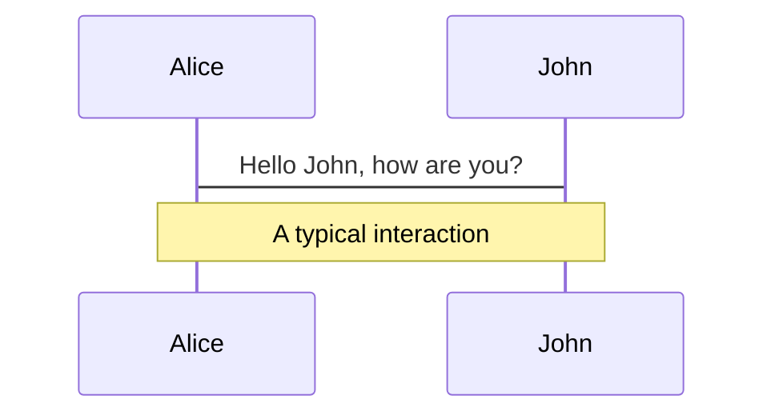
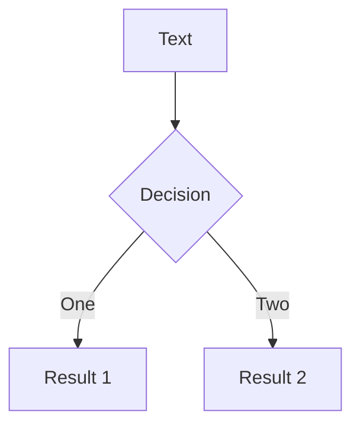

## Markdown

Markdown 是一种轻量级标记语言，排版语法简洁，让人们更多地关注内容本身而非排版

它使用易读易写的纯文本格式编写文档，可与 HTML 混编，可导出 HTML、PDF 以及本身的 .md 格式的文件，因简洁、高效、易读、易写被大量使用，如 Github、Wikipedia、简书等

### 标题

~~~
# 一级标题
## 二级标题
### 三级标题
#### 四级标题
##### 五级标题
###### 六级标题
####### 七级标题
~~~

### 代码块

使用三个波浪号开辟代码块，在波浪号后接语言名可以定义代码块语言种类

~~~~
~~~java
content
~~~
~~~~

### 加粗

~~~
**content**
ctrl+b
~~~

### 斜体

~~~
*content*
~~~

### 斜粗体

~~~
***content***
~~~

### 引用

`>`接一个空格

> 这是一个引用

~~~
> 
~~~

### 列表

要创建有序列表，请在每个列表项前添加数字并紧跟一个英文句点。数字不必按数学顺序排列，但是列表应当以数字 1 起始

1. 有序列表，`数字`加`.`接一个空格

- 无需列表，减号`-`接一个空格

~~~
1. 
- 
~~~

### 分割线

使用三个或多个星号 (`***`)、破折号 (`---`) 或下划线 (`___`) ，并且不能包含其他内容。三种方法效果一样

***

~~~
***
---
~~~

### 链接

链接文本放在中括号内，链接地址放在后面的括号中，链接title可选

[这是一个链接](骗你的)

链接title是当鼠标悬停在链接上时会出现的文字，这个title是可选的，它放在圆括号中链接地址后面，跟链接地址之间以空格分隔

[带标题的链接](骗你的 "hahaha")

~~~
[链接名](链接url "链接标题")
~~~

### 图片

要添加图像，请使用感叹号 (`!`), 然后在方括号增加替代文本，图片链接放在圆括号里，括号里的链接后可以增加一个可选的图片标题文本。

插入图片Markdown语法代码：``

对应的HTML代码：``

~~~

~~~

给图片增加链接，请将图像的Markdown 括在方括号中，然后将链接添加在圆括号中

~~~
[](https://markdown.com.cn)
~~~

### HTML

HTML 的行级內联标签如 `<span>`、`<cite>`、`<del>` 不受限制，可以在 Markdown 的段落、列表或是标题里任意使用。依照个人习惯，甚至可以不用 Markdown 格式，而采用 HTML 标签来格式化。例如：如果比较喜欢 HTML 的 `<a>` 或 `` 标签，可以直接使用这些标签，而不用 Markdown 提供的链接或是图片语法。当你需要更改元素的属性时（例如为文本指定颜色或更改图像的宽度），使用 HTML 标签更方便些。

### 表格

在`typora`中使用`ctrl+t`插入表格

### 公式

平时不经常用到数学公式，直到我在写最优化笔记的时候要表达泰勒公式 ，却发现不会用Markdown表示。通常使用`$$`作为公式块，在里边书写公式
$$
C_{n}^{n-4}\times\int_0^1 x^2 {\rm d}x\times\lim_{n \rightarrow +\infty} \frac{n-1}{n(n+1)(n+2)}
$$
因为所以
$$
\because a=b,b=c\\
\therefore a=c
$$

~~~markdown
$$
\because a=b,b=c\\
\therefore a=c
$$
~~~

对齐
$$
\begin{aligned}
a &= b + c\\
  &= d + e + f
\end{aligned}
$$

~~~markdown
$$
\begin{aligned}
a &= b + c\\
  &= d + e + f
\end{aligned}
$$
~~~

矩阵
$$
\begin{bmatrix}
1\\2\\1
\end{bmatrix}
$$

```markdown
$$
\begin{bmatrix}
1\\2\\1
\end{bmatrix}
$$
```

大括号
$$
y = 
\begin{cases}
2x\\
x^2\\
1\\
\end{cases}
$$

```markdown
$$
y = 
\begin{cases}
2x\\
x^2\\
1
\end{cases}
$$
```

加减号

```markdown
\pm
```

在等号上添加问号
$$
\stackrel{?}{=}
$$

```markdown
\stackrel{?}{=}
```

罗马字母

α 阿尔法，β 贝塔，γ 伽玛，δ 德尔塔，ε 伊普西隆，ζ 泽塔，η 伊塔，θ 西塔，ι 约塔，κ 卡帕，λ 兰姆达，μ 米欧，ν 纽，ξ 克西，ο 欧米克隆，π 派，ρ 柔，σ 西格玛，τ 陶，υ 玉普西隆，φ 弗爱，χ 凯，ψ 普赛


### 导出

pdf 强行分页

```html
<div STYLE="page-break-after: always;"></div>
```

添加页首页脚，在 typora 偏好设置中设置页首和页脚，其中 pageNo 表示当前页数，pageCount 表示总页数

```
${title}
${pageNo} / ${pageCount}
```

## Slidev

Slidev 是可以让我们用 Markdown 写 PPT 的一个工具库，基于 Node.js、Vue.js

利用它我们可以简单地把 Markdown 转化成 PPT，而且它可以支持各种好看的主题、代码高亮、公式、流程图、自定义的网页交互组件，还可以方便地导出成 pdf 或者直接部署成一个网页使用

- [官方主页](https://sli.dev/)
- [GitHub](https://github.com/slidevjs/slidev)

### 安装启动

首先要求`nodejs、npm`环境

初始化仓库

~~~bash
npm init slidev
~~~

设置仓库名称、作者等

该过程会自动安装依赖包，并在当前目录创建一个slidev的目录

slidev将渲染slides.md为一个PPT并展示在本地端口3000

由于基于vue开发，像常用的vue命令都是通用的

~~~bash
npm run dev
npm run build
~~~

### 快捷键操作

[操作文档](https://sli.dev/guide/navigation.html)

- f：切换全屏
- right / space：下一动画或幻灯片
- left：上一动画或幻灯片
- up：上一张幻灯片
- down：下一张幻灯片
- o：切换幻灯片总览
- d：切换暗黑模式
- g：显示“前往...”

### 关键字设置

每一页以前可以通过内置的一些关键字，设置这一页的样式

比如第一页设置了theme为default，background是unsplash提供的随机的一张图，文本居中等等

[更多主题](https://sli.dev/themes/gallery.html)

可以直接在markdown中插入web组件以达到更高的自定义程度：

~~~markdown
---
# try also 'default' to start simple
theme: default
# random image from a curated Unsplash collection by Anthony
# like them? see https://unsplash.com/collections/94734566/slidev
background: https://source.unsplash.com/collection/94734566/1920x1080
# apply any windi css classes to the current slide
class: 'text-center'
# https://sli.dev/custom/highlighters.html
highlighter: shiki

---

# Welcome to Slidev

Presentation slides for developers

<div class="pt-12">
  <span @click="$slidev.nav.next" class="px-2 p-1 rounded cursor-pointer" hover="bg-white bg-opacity-10">
    Press Space for next page <carbon:arrow-right class="inline"/>
  </span>
</div>

---
~~~

### 自定义 CSS

可以用css自定义当前页的一些内容的样式

~~~markdown
---

# What is Slidev?

Slidev is a slides maker and presenter designed for developers, consist of the following features


<style>
h1 {
  background-color: #2B90B6;
  background-image: linear-gradient(45deg, #4EC5D4 10%, #146b8c 20%);
  background-size: 100%;
  -webkit-background-clip: text;
  -moz-background-clip: text;
  -webkit-text-fill-color: transparent;
  -moz-text-fill-color: transparent;
}
</style>

---
~~~

### 代码和图像

插入代码和图像：代码就是markdown语法，图像使用arrow标签插入

~~~markdown
---
layout: image-right
image: https://source.unsplash.com/collection/94734566/1920x1080
---

# Code

Use code snippets and get the highlighting directly!

```ts {all|2|1-6|9|all}
interface User {
  id: number
  firstName: string
  lastName: string
  role: string
}

function updateUser(id: number, update: User) {
  const user = getUser(id)
  const newUser = {...user, ...update}
  saveUser(id, newUser)
}
```

<arrow v-click="3" x1="400" y1="420" x2="230" y2="330" color="#564" width="3" arrowSize="1" />

---
~~~

### Latex公式和图表

可以插入Latex公式，行内公式用一对`$`包起来，一整块公式块用一对`$$`包起来

~~~markdown
---
# LaTeX

LaTeX is supported out-of-box powered by [KaTeX](https://katex.org/).

<br>

Inline $\sqrt{3x-1}+(1+x)^2$

Block
$$
\begin{array}{c}

\nabla \times \vec{\mathbf{B}} -\, \frac1c\, \frac{\partial\vec{\mathbf{E}}}{\partial t} &
= \frac{4\pi}{c}\vec{\mathbf{j}}    \nabla \cdot \vec{\mathbf{E}} & = 4 \pi \rho \\

\nabla \times \vec{\mathbf{E}}\, +\, \frac1c\, \frac{\partial\vec{\mathbf{B}}}{\partial t} & = \vec{\mathbf{0}} \\

\nabla \cdot \vec{\mathbf{B}} & = 0

\end{array}
$$

<br>

[Learn more](https://sli.dev/guide/syntax#latex)

---
~~~

可以用mermaid插入流程图

~~~markdown
---

# Diagrams

You can create diagrams / graphs from textual descriptions, directly in your Markdown.

<div class="grid grid-cols-2 gap-4 pt-4 -mb-6">





</div>

[Learn More](https://sli.dev/guide/syntax.html#diagrams)


---
~~~

### 引入组件

甚至可以通过vue自定义组件：这里引入了 Counter、Tweet 组件

这就是一个标准的基于 Vue.js 3.x 的组件，都是标准的 Vue.js 语法，所以如果我们要添加想要的组件，直接自己写就行了

~~~markdown
# Components
 
<div grid="~ cols-2 gap-4">
<div>
 
You can use Vue components directly inside your slides.
 
We have provided a few built-in components like `<Tweet/>` and `<Youtube/>` that you can use directly. And adding your custom components is also super easy.
 
```html
<Counter :count="10" />
```
 
<!-- ./components/Counter.vue -->
<Counter :count="10" m="t-4" />
 
Check out [the guides](https://sli.dev/builtin/components.html) for more.
 
</div>
<div>
 
```html
<Tweet id="1390115482657726468" />
```
 
<Tweet id="1390115482657726468" scale="0.65" />
 
</div>
</div>
~~~

### 页面分割

用三条横线分割每个PPT页面

~~~markdown
---
layout: cover
---
 
# 第 1 页
 
This is the cover page.
 
---
 
# 第 2 页
 
The second page
~~~

除了使用三横线，我们还可以使用更丰富的定义模式，可以给每一页制定一些具体信息，就是使用两层三横线

~~~markdown
---
theme: seriph
layout: cover
background: 'https://source.unsplash.com/1600x900/?nature,water'
---
~~~

### 备注

备注同HTML

~~~markdown
---
layout: cover
---
 
# 第 1 页
 
This is the cover page.
 
<!-- 这是一条备注 -->
~~~

### 演示

[录制功能](https://sli.dev/guide/recording.html)

演讲者头像：使用网页通过摄像头捕获，在右下角显示

### 部署

1️⃣ PDF 导出

一般我们演示slides都是在其他陌生环境，没法用npm之类的来演示，所以就需要导出成pdf之类的：

需要先下载依赖，slidev的导出依赖于此

~~~bash
npm i -D playwright-chromium
~~~

导出，将在当前目录生成一个slides_export.pdf

~~~bash
npx slidev export
~~~

2️⃣ 网页部署

构建

~~~bash
npm run build
~~~

作为一个正常的前端项目通过 nginx 部署即可
