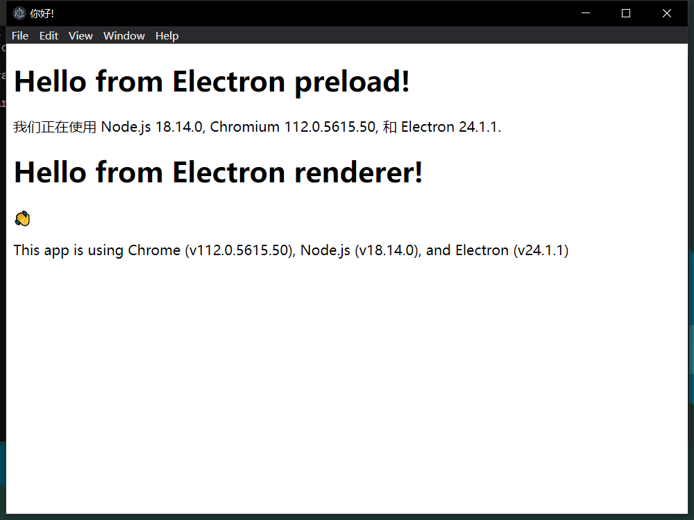

> MVC 架构下的 C/S 运行模式

## Electron 基础

### 快速开始

创建工程目录

```bash
mkdir my-electron-app && cd my-electron-app
npm init
```

`npm init`命令将有一些初始化输入，注意将`entry point`写为`main.js`，生成的`package.json`类似于

```json
{
  "name": "hello-world",
  "version": "1.0.0",
  "description": "",
  "main": "main.js",
  "scripts": {
    "test": "echo \"Error: no test specified\" && exit 1",
    "start": "electron ."
  },
  "author": "northboat",
  "license": "ISC",
  "devDependencies": {
    "electron": "^24.1.1"
  }
}
```

注意在脚本处添加启动命令`"start": "electron ."`

安装`electron`依赖

```bash
npm install --save-dev electron
```

编写启动脚本，主页面，渲染脚本

main.js

```js
// main.js

// electron 模块可以用来控制应用的生命周期和创建原生浏览窗口
const { app, BrowserWindow } = require('electron')
const path = require('path')

const createWindow = () => {
  // 创建浏览窗口
  const mainWindow = new BrowserWindow({
    width: 800,
    height: 600,
    webPreferences: {
      preload: path.join(__dirname, 'preload.js')
    }
  })

  // 加载 index.html
  mainWindow.loadFile('index.html')

  // 打开开发工具
  // mainWindow.webContents.openDevTools()
}

// 这段程序将会在 Electron 结束初始化
// 和创建浏览器窗口的时候调用
// 部分 API 在 ready 事件触发后才能使用。
app.whenReady().then(() => {
  createWindow()

  app.on('activate', () => {
    // 在 macOS 系统内, 如果没有已开启的应用窗口
    // 点击托盘图标时通常会重新创建一个新窗口
    if (BrowserWindow.getAllWindows().length === 0) createWindow()
  })
})

// 除了 macOS 外，当所有窗口都被关闭的时候退出程序。 因此, 通常
// 对应用程序和它们的菜单栏来说应该时刻保持激活状态, 
// 直到用户使用 Cmd + Q 明确退出
app.on('window-all-closed', () => {
  if (process.platform !== 'darwin') app.quit()
})

// 在当前文件中你可以引入所有的主进程代码
// 也可以拆分成几个文件，然后用 require 导入。
```

index.html

```html
<!--index.html-->

<!DOCTYPE html>
<html>
  <head>
    <meta charset="UTF-8">
    <!-- https://developer.mozilla.org/en-US/docs/Web/HTTP/CSP -->
    <meta http-equiv="Content-Security-Policy" content="default-src 'self'; script-src 'self'">
    <title>你好!</title>
  </head>
  <body>
    <h1>你好!</h1>
    我们正在使用 Node.js <span id="node-version"></span>,
    Chromium <span id="chrome-version"></span>,
    和 Electron <span id="electron-version"></span>.

    <!-- 您也可以此进程中运行其他文件 -->
    <script src="./renderer.js"></script>
  </body>
</html>
```

preload.js

```js
// preload.js

// 所有的 Node.js API接口 都可以在 preload 进程中被调用.
// 它拥有与Chrome扩展一样的沙盒。
window.addEventListener('DOMContentLoaded', () => {
  const replaceText = (selector, text) => {
    const element = document.getElementById(selector)
    if (element) element.innerText = text
  }

  for (const dependency of ['chrome', 'node', 'electron']) {
    replaceText(`${dependency}-version`, process.versions[dependency])
  }
})
```

其中

- `main.js`：作为启动类，管理所有进程的开始和结束，相当于`controller`的角色
- `index.html`：作为`view`层直接和用户交互
- `preload.js`：中可以调用`nodejs api`实现后端功能，如动态改写`html`内容，数据库交互，`api`请求等等

总体可以理解为一个`MVC`框架的应用（实际上就是一个`MVC`网页），其中`controller`和`model`均用`js`编写，`view`用前端三件套编写 

### 预加载脚本

Electron 的主进程是一个拥有着完全操作系统访问权限的 Node.js 环境，出于安全原因，渲染进程`preload.js`默认跑在网页页面上，而并非 Node.js 里

为了将 Electron 的不同类型的进程桥接在一起，我们需要使用被称为**预加载**的特殊脚本

BrowserWindow 的预加载脚本运行在具有 HTML DOM 和 Node.js、Electron API 的有限子集访问权限的环境中

#### preload.js

> 预加载，相当于加载页面前的钩子函数

如以下脚本`preload.js`，通过 `versions` 这一全局变量，将 Electron 的 `process.versions` 对象暴露给渲染器

```js
const { contextBridge } = require('electron')

contextBridge.exposeInMainWorld('versions', {
  node: () => process.versions.node,
  chrome: () => process.versions.chrome,
  electron: () => process.versions.electron,
  // 能暴露的不仅仅是函数，我们还可以暴露变量
})
```

在主进程`main.js`中，在`createWindow`函数中（即`BrowserWindow`的构造器），将渲染脚本加入`webPreferences`元组，将主界面和渲染脚本相绑定

```js
const { app, BrowserWindow } = require('electron')
const path = require('path')

const createWindow = () => {
  const win = new BrowserWindow({
    width: 800,
    height: 600,
    webPreferences: {
      // 在这里绑定渲染脚本
      preload: path.join(__dirname, 'preload.js'),
    },
  })

  win.loadFile('index.html')
}

app.whenReady().then(() => {
  createWindow()
})
```

#### renderer.js

> 渲染脚本，集合 DOM 操作

使用`preload.js`可以通过全局访问 `versions` 获取相关信息，要获取 DOM 操作，需要使用到脚本`renderer.js`

```js
const information = document.getElementById('info')
information.innerText = `本应用正在使用 Chrome (v${versions.chrome()}), Node.js (v${versions.node()}), 和 Electron (v${versions.electron()})`
```

将相应`index.html`中标签 id 添加为 info

```html
<h1>Hello from Electron renderer!</h1>
<p>👋</p>
<p id="info"></p>
```

将`preload.js`中添加数据信息

```js
const { contextBridge } = require('electron');

contextBridge.exposeInMainWorld('versions', {
  node: () => process.versions.node,
  chrome: () => process.versions.chrome,
  electron: () => process.versions.electron,
});
```

得到页面效果



### 进程通信

> 通过 IPC 进行变量和函数的传递

是这样的，在渲染器里绝对是不允许调用 nodejs 函数的，这样很不安全，即用户从前端可以直接操作底层数据，于是我们在 preload.js 中将函数暴露（声明函数），渲染器 renderer.js 只能调用声明过的函数，而这个函数实际是在 main.js 中（主进程中）被执行

#### 渲染器请求主进程

在 preload.js 声明变量和函数

```js
const { contextBridge, ipcRenderer } = require('electron')

contextBridge.exposeInMainWorld('versions', {
  node: () => process.versions.node,
  chrome: () => process.versions.chrome,
  electron: () => process.versions.electron,
  ping: () => ipcRenderer.invoke('ping'),
})
```

在 renderer.js 中调用函数

```js
const func = async () => {
  const response = await window.versions.ping()
  console.log(response) // 打印 'pong'
}

func()
```

在主函数 main.js 中处理函数

```js
const { app, BrowserWindow, ipcMain } = require('electron')
const path = require('path')

const createWindow = () => {
  const win = new BrowserWindow({
    width: 800,
    height: 600,
    webPreferences: {
      preload: path.join(__dirname, 'preload.js'),
    },
  })
  ipcMain.handle('ping', () => 'pong')
  win.loadFile('index.html')
}
app.whenReady().then(createWindow)
```

消息通过预加载脚本暴露给渲染器，渲染器触发，在主进程中执行并将结果返回给渲染器

通过 ipc 暴露带参函数

preload.js 声明

```js
contextBridge.exposeInMainWorld('versions', {
    send: (jsonData) => ipcRenderer.invoke('send', jsonData),
});
```

renderer.js 调用

```js
const render_send = async () => {
    const data = { name: 'John', age: 30 };
    const jsonData = JSON.stringify(data);
    const response = await window.versions.send(jsonData)
    alert(response)
}

const btn = document.getElementById('test');
btn.onclick = render_send
```

main.js 处理

```js
ipcMain.handle('send', async (event, jsonData) => {
    // const result = await doSomeWork(jsonData)
    return jsonData
})
```

#### 主进程回送渲染器

main.js

通过 mainWindow 回送请求

mainWindow

```js
const mainWindow = new BrowserWindow({
    width: 800,
    height: 600,
    webPreferences: {
        preload: path.join(__dirname, 'preload.js'),
        webSecurity: false
        // nodeIntegration: true,
        // contextIsolation: false    // 讓在 preload.js 的定義可以傳遞到 Render Process (React)
    }
})
```

处理渲染器的 send 函数并通过 mainWindow.webContents.send 回送

```js
// 通过 axios 请求后端，然后通过 mainWindow.webContents 回送消息给 preload.js 中的监听器
// preload.js 的监听器收到消息直接渲染前端页面
axios.defaults.baseURL = 'http://127.0.0.1:5000'
ipcMain.handle('send', async (event, jsonData) => {
    // send(jsonData)
    // response = await sleep();
    console.log("request arise: " + jsonData)
    axios.post('http://127.0.0.1:5000/chat', jsonData, {
        headers: {
            "Content-Type":"application/json"
        },
    }).then(response => {
        data = response.data
        console.log("receive data: " + data)
        mainWindow.webContents.send('back', data)
    }, error => {
        error = error.message
        console.log('error occur: ', error)
        event.sender.send("back", error)
    })
})
```

渲染器接收

```js
//将消息显示在网页上
function setMessageInnerHTML(name, msg) {
  document.getElementById("message").innerHTML += "<strong>" + name + ":</strong><br>"
  document.getElementById('message').innerHTML += msg + '<br><br>';
}

ipcRenderer.on('back', (event, arg) => {
  // console.log('渲染进程收到的消息:',arg)
  setMessageInnerHTML('ChatGPT', arg)
})
```

### 网络请求

#### net

使用 electron 内置的 net 进行网络请求，处理渲染器发送的 send 请求（真几把难用，但是也还行，配合 webContents.send 将处理结果返回给渲染器）

```js
const request_chatgpt = (jsonData) => {
    const { net } = require('electron')
    const request = net.request({
        headers: { 'Content-Type': 'application/json', },
        method: 'POST',
        url: 'http://127.0.0.1:5000/chat'
    })
    request.write(jsonData)
    request.on('response', response => {
        response.on('data', res => {
            console.log(res.toString())
        })
        response.on('end', () => {
            console.log('No more data in response.')
        })
    })
    request.end()
}

ipcMain.handle('send', async (event, jsonData) => {
    const result = request_chatgpt(jsonData)
    return result
})
```

#### axios

比较熟悉，其实应该是一样的

```bash
npm install --save axios
```

在 main.js 中引入

```js
const axios = require("axios").default;
```

post 请求

```js
axios.defaults.baseURL = 'http://127.0.0.1:5000'
axios.post('http://127.0.0.1:5000/chat', jsonData, {
    headers: {
        "Content-Type":"application/json"
    },
}).then(response => {
    data = response.data
    console.log("receive data: " + data)
    mainWindow.webContents.send('back', data)
}, error => {
    error = error.message
    console.log('error occur: ', error)
    event.sender.send("back", error)
})
```

### 打包应用

## Electron ChatGPT

[ChatGPT-Electron](https://github.com/northboat/ChatGPT-Electron)，后端由 Flask 实现

### 主进程

app.js

```js
// main.js

// electron 模块可以用来控制应用的生命周期和创建原生浏览窗口
// import { app } from 'electron'
const { app, BrowserWindow } = require('electron')
const path = require('path')
const { ipcMain } = require('electron');
const axios = require("axios").default;
// require('@electron/remote/main').initialize()


const createWindow = () => {
    // 创建浏览窗口
    const mainWindow = new BrowserWindow({
        width: 800,
        height: 600,
        webPreferences: {
            preload: path.join(__dirname, 'preload.js'),
            webSecurity: false
            // nodeIntegration: true,
            // contextIsolation: false    // 讓在 preload.js 的定義可以傳遞到 Render Process (React)
        }
    })

    // 加载 index.html
    mainWindow.loadFile('index.html')

    // 通过 axios 请求后端，然后通过 mainWindow.webContents 回送消息给 preload.js 中的监听器
    // preload.js 的监听器收到消息直接渲染前端页面
    axios.defaults.baseURL = 'http://127.0.0.1:5000'
    ipcMain.handle('send', async (event, jsonData) => {
        // send(jsonData)
        // response = await sleep();
        console.log("request arise: " + jsonData)
        axios.post('http://127.0.0.1:5000/chat', jsonData, {
            headers: {
                "Content-Type":"application/json"
            },
        }).then(response => {
            data = response.data
            console.log("receive data: " + data)
            mainWindow.webContents.send('back', data)
        }, error => {
            error = error.message
            console.log('error occur: ', error)
            event.sender.send("back", error)
        })
    })

    // 打开开发工具
    // mainWindow.webContents.openDevTools()
}

// 这段程序将会在 Electron 结束初始化
// 和创建浏览器窗口的时候调用
// 部分 API 在 ready 事件触发后才能使用。
app.whenReady().then(() => {
    createWindow()

    app.on('activate', () => {
        // 在 macOS 系统内, 如果没有已开启的应用窗口
        // 点击托盘图标时通常会重新创建一个新窗口
        if (BrowserWindow.getAllWindows().length === 0) createWindow()
    })

    ipcMain.handle('ping', () => 'pong')

})

// 除了 macOS 外，当所有窗口都被关闭的时候退出程序。 因此, 通常
// 对应用程序和它们的菜单栏来说应该时刻保持激活状态, 
// 直到用户使用 Cmd + Q 明确退出
app.on('window-all-closed', () => {
    if (process.platform !== 'darwin') app.quit()
})

// 在当前文件中你可以引入所有的主进程代码
// 也可以拆分成几个文件，然后用 require 导入。
```

### 渲染器

preload.js

```js
// preload.js

// 所有的 Node.js API接口 都可以在 preload 进程中被调用.
// 它拥有与Chrome扩展一样的沙盒。
window.addEventListener('DOMContentLoaded', () => {
  const replaceText = (selector, text) => {
    const element = document.getElementById(selector)
    if (element) element.innerText = text
  }

  for (const dependency of ['chrome', 'node', 'electron']) {
    replaceText(`${dependency}-version`, process.versions[dependency])
  }
})

// Preload (Isolated World)
const { contextBridge, ipcRenderer } = require('electron')

contextBridge.exposeInMainWorld('versions', {
  node: () => process.versions.node,
  chrome: () => process.versions.chrome,
  electron: () => process.versions.electron,
  ping: () => ipcRenderer.invoke('ping'),
  send: (jsonData) => ipcRenderer.invoke('send', jsonData),
});

//将消息显示在网页上
function setMessageInnerHTML(name, msg) {
  document.getElementById("message").innerHTML += "<strong>" + name + ":</strong><br>"
  document.getElementById('message').innerHTML += msg + '<br><br>';
}

ipcRenderer.on('back', (event, arg) => {
  // console.log('渲染进程收到的消息:',arg)
  setMessageInnerHTML('ChatGPT', arg)
})
```

renderer.js

```js
//将消息显示在网页上
function setMessageInnerHTML(name, msg) {
  document.getElementById("message").innerHTML += "<strong>" + name + ":</strong><br>"
  document.getElementById('message').innerHTML += msg + '<br><br>';
}

const renderer_send = async () => {
  // 获取页面信息
  let a = "Dear You"
	let t = document.getElementById("text").value;
  setMessageInnerHTML(a, t)
  document.getElementById("text").value = ""

  // 封装数据
  // console.log(c)
  const data = { text: t };
  const jsonData = JSON.stringify(data);

  // 调用 preload.js 暴露的 send 函数
  window.versions.send(jsonData)
}

const btn = document.getElementById('send');
btn.onclick = renderer_send
```

