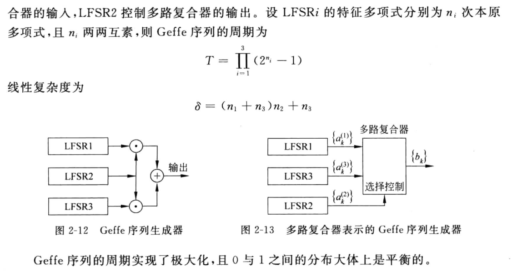

## 网络安全概述

保密学是研究密码系统或通信安全的科学，它实际上包含两个分支，两者相互独立，相互促进

- 密码学，对信息进行编码实现隐蔽信息的一门科学
- 密码分析学，是研究分析如何破解密码的学问

攻击分类

- 被动：监听、嗅探、分析（对原有内容或过程不做破坏）
- 主动：中断、伪造、篡改（破坏原有内容或过程）

安全类型：系统安全；数据安全；内容安全

密钥类型：

- 单钥：流密码；分组密码
- 公钥：非对称密码

## 古典密码

古典密码，使用对称密钥体制，即加密和解密使用同一组密钥，分为

- 单表代换：加密 y = ax+b，解密 x = (y-b)/a

- 多表代换：x = [x_1,x_2,...,x_n], a = [a_1,a_2,...,a_n], b = [b_1,b_2,...,b_n]


古典密码中 a,b 即为密钥，显然是单钥，加密和解密仅使用一套密钥

凯撒密码（单表代换密码）：a 对应 0，b 对应 1，依次往后，将每个字母循环向后移位 k 位，得到密文，解密时，将密文循环向前移位 k 位，得到明文
$$
c = (x+k)\,mod\,26
$$


模运算单表代换 c 实现

```c
#include <iostream>
using namespace std;
#include <vector>

void print(vector<int> v, int flag){
	if(flag){
		for(int i = 0; i < v.size(); i++){
			cout << (char)(65+v[i]);
		}
	} else {
		for(int i = 0; i < v.size(); i++){
			cout << (char)(97+v[i]);
		}
	}
	cout << endl;
}

// flag 为 1 格式化大写字母，为 0 格式化小写字母为仿射变换的字母表数字 
vector<int> format(string m, int flag){
	vector<int> vec;
	for(int i = 0; i < m.size(); i++){
		int k = flag ? m[i]-65 : m[i]-97;
		vec.push_back(k);
	}
	return vec;
}

vector<int> encode(vector<int> m, int a, int b){
	vector<int> c;
	for(int i = 0; i < m.size(); i++){
		if(m[i] < 0){ // 空格不加密
			c.push_back(m[i]);
			continue; 
		}
		// 加密 
		c.push_back((a*m[i]+b)%26);
	}
	return c;
}

vector<int> decode(vector<int> c, int a, int b, int d){
	// m = 11^(-1)(c-23) (mod 26)
	vector<int> m;
	for(int i = 0; i < c.size(); i++){
		if(c[i] < 0){ // 不处理空格，因为没加密 
			m.push_back(c[i]);
			continue;
		}
		// 通过逆元模运算解密 
		// 这里要做一个负数转正数的处理 
		m.push_back(((d*(c[i]-b)) % 26 + 26) % 26);
	} 
	return m;
}


int main(){
	string str1 = "THE NATIONAL SECURITY AGENCY";
	string str2 = "edsgickxhuklzveqzvkxwkzukvcuh";
	string str3 = "ifyoucanreadthisthankatteacher";
	// 输入明文，加密返回密文 
	// 参数分别为格式化的明文，系数 a，常数 b 
	vector<int> c = encode(format(str1, 1), 11, 23);
	print(c, 1);
	// 输入密文，解密返回明文 
	// 参数分别为明文，系数，常数，系数的逆元 
	vector<int> m = decode(format(str2, 0), 9, 10, 3);
	print(m, 0);
} 
```

维吉尼亚密码（多表代换密码）：其密钥 B 为 k 位的一组数，如有密钥为字符串
$$
hello\rightarrow[7,4,11,11,14]^T
$$
在对明文进行加密时，由于 hello 长度为 5，则明文每 5 个字符一组进行（加减）变换，再举个栗子


注意题目中规定了是左乘，另外模运算满足
$$
26n+a\equiv 26m+b\,(mod\,26)\Rightarrow a\equiv b\,mod\,26
$$
就是说被除数和余数中的模数的整数倍，都可以被消去，以简化运算

## 流密码的基本概念

流密码，也叫序列密码，其通过密钥 k 产生一串生成序列，即密钥流 z，根据密钥流 z 来对明文进行加密

### 流密码的性质

异或操作，也叫二元加法

| X\Y  | 0    | 1    |
| ---- | ---- | ---- |
| 0    | 0    | 1    |
| 1    | 1    | 0    |

流密码
$$
密钥k+电子元件状态\sigma_i \longrightarrow密钥流z=[z_0,z_1,...,z_n]
$$
加密过程为
$$
密文y = 加密函数E(x,z)
$$
以上铭文密文以及密钥流均以向量的形式流动
$$
y=y_0y_1...=E_{z_0}(x_0)E_{z_1}(x_1)...
$$
流密码和分组密码、维吉尼亚密码、一次一密密码的区别

|        | 分组密码                                                   | 维吉尼亚密码                                                 | 一次一密密码                                       |
| ------ | ---------------------------------------------------------- | ------------------------------------------------------------ | -------------------------------------------------- |
| 流密码 | 均属于单钥密码，区别在于有无记忆性，即子密钥的产生方式不同 | 参与加密的密钥不同，一个是确定的单钥，一个是根据密钥由密钥产生器产生的密钥流，并且前者作用于分组，后者作用于比特 | 一次一密密码是一种特殊的单钥密码，其密钥只使用一次 |

流密码可进一步分类为**同步流密码和自同步流密码**：当电子元件的存储状态**独立**于输入的明文时，为同步流密码，否则为自同步流密码

- 目前大多数研究成果均基于同步流密码

一种常用的流密码：二元加法流密码，加密变换函数 E 为明文和密钥流进行异或操作，当滚动密钥 z 等于密钥本身 k 时，二元加法流密码退化为一次一密密码

密钥流的产生
$$
z = f(k, σ_i)\quad \sigma_i=(\alpha_1,\alpha_2,...,\alpha_n)
$$
其中 σ 为电子元件状态，k 为密钥

一个良好的密钥流 z 应该具备的性质

- 极大的周期性
- 良好的统计特性
- 抗线性分析
- 抗统计分析

### 有限状态自动机

> 第二章课后习题T4

有限状态自动机五要素

- 有限输入集
- 有限输出集
- 有限状态集
- 状态转移函数
- 输出转移函数

密钥流产生器就是一个有限状态自动机，状态就是记忆电子元件的状态，输入为密钥`k`，输出为密钥流`z`，转移函数`1`为状态转移函数，规定元件状态经过当前输入到下一状态的转换，转移函数`2`为输出函数，输入和当前状态确定一个输出


用有向图表示有限状态自动机，即为转换图，如


从直觉上来说，非线性的密码将更难预测，但完全非线性的有限状态自动机很难实现，于是我们中和一下，将密钥流产生器分解：线性的驱动部分 + 非线性的子系统 = 密钥流生成器 ==> 产生统计性能好的序列作为最终的密钥流


密钥流生成器设计关键在于找到合适的状态转移函数（σ 的转换）和输出函数（密钥 k 和状态 σ 到密钥流 z 的转换）

## 密钥流产生器

### 反馈移位寄存器

先举一个非线性的反馈移位寄存器的栗子，这是一个生成函数
$$
f(a_1,a_2,a_3) = a_1a_2\oplus a_3
$$
我们会给定 a1,a2,a3 的初始值，假设为 (1,0,1)，则有
$$
a_4 = a_1a_2\oplus a_3 = 1\wedge0\oplus1 = 1\\
a_5 = a_2a_3\oplus a_4 = 0\wedge1\oplus1 = 1\\
......\\
a_{t+3} = a_ta_{t+1}\oplus a_{t+2}
$$
移位的概念，即指，每运算一次，方程 f 的入参向右整体移动一位，即上一轮为 f(a1,a2,a3)，则下一轮运算为 f(a2,a3,a4)，其中 a4 是上一轮的输出结果

在状态转换表中，每一行的输出为 a1 出队，同时将当前 f(a3,a2,a1) 的结果从左侧入队，得到下一轮的状态


这样不断输出，一定会得到一串重复的输出，如上述输出为 1011 1011 1011...，当
$$
a_t = a_{t+k}
$$
成立时，我们说 k 是该反馈移位寄存器的周期，一定有
$$
k \leq 2^n-1
$$

### 线性反馈移位寄存器

上述的栗子中，f 并不是一个线性函数，所以我们说其是反馈移位寄存器，而并非线性，只有当转移函数满足
$$
f = c_1a_1\oplus c_2a_2 \oplus...\oplus c_na_n\quad c_i = 1/0
$$
即 f 为一个线性函数时，其代表的反馈移位寄存器为线性反馈移位寄存器，其中 c 向量为**反馈系数**，如下图线性移位寄存器，其 f = a4 ⊕ a1（c2 = c3 = c5 = 0）


假定初始序列为 (1,0,0,1,1)，则可以得到周期为 31 的重复序列`1001101001000010101110110001111100110......`

对于线性反馈移位寄存器，有这样几种性质

- 当初始状态全为 0 时，不会产生另外的状态
- n 位最多可以表示 2^n 种状态，减去全 0，所以在反馈移位寄存器中最多只有 2^n-1 种状态，输出序列的周期最大也为 2^n-1
- 当输出序列的周期取到最大时，我们说这样的序列为一个 m 序列

输出序列的周期主要和转移函数有关，我们可以手动选取合适的能产生 m 序列的转换函数

### LFSR 的特征多项式

LFSR 的特征多项式，仅和反馈系数有关（LFSR结构图、递推式与特征多项式 p(x) 是一一对应的）
$$
p(x) = 1+c_1x+c_2x^2+...+c_nx^n
$$
特征多项式的阶

输出序列的周期一定整除其特征多项式的阶

## m 序列的产生和破译

### m 序列的游程

> 第二章课后习题T5

游程：指连续的相同元素的长度，如 111 为 1 的 3 游程

m 序列的游程分布是固定的，其中 1 的游程比 0 的游程总数多一个，长为 i 的游程共有
$$
2^{n-i-1}\quad i\in[1,n-2]
$$
个，被 0 和 1 平分，而长为 n-1 的游程只有 0 有，长为 n 的游程只有 1 有

### 产生 m 序列的特征多项式

反馈函数，即特征多项式决定了输出序列的性质，本章讨论特征式满足什么条件时 LFSR 能产生最大周期的 m 序列

特征多项式的阶
$$
p(x)\mid x^q-1
$$
使上整除式成立的最小的正整数 q，即为特征多项式 p(x) 的阶

当 n 级 LFSR 的特征多项式 p(x) 的阶为
$$
2^n-1
$$
且多项式 p(x) 不可约，此时我们称这个特征多项式为**本原多项式**，根据这个多项式的反馈函数产生的序列一定是一个 m 序列

我们可以说

- 特征多项式既约是 m 序列的必要条件
- 特征多项式阶为 2^n-1 是 m 序列的必要条件

二者同时满足，为 m 序列出现的充要条件

### m 序列的破译

已知
$$
y = x\oplus z
$$
易得
$$
z = x\oplus y
$$
这是二元加法的性质，当我们已知一个 2n 长的明文和其对应的密文时，可以通过这样的二元加法求得一个 2n 长的密钥流

然后通过密钥流的递推关系列出矩阵方程，求解系数向量


总结就是两步

1. 根据明文密文对照，二元加法求出密钥流
2. 根据密钥流递推关系列出矩阵方程并求解系数向量

## 非线性部分

### Geffe 序列生成器

就是用一个 LFSR2 作为控制器，当为 1 时，LFSR1 生效，当为 0 时，LFSR3 生效




### JK 触发器


### Pless 生成器

由多个 JK 触发器构成，滚动生成


### 钟控序列生成器

用一个 LFSR 作为钟控，控制另一个 LFSR 是否生效


举个栗子


