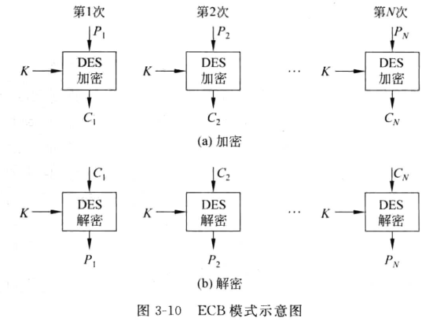
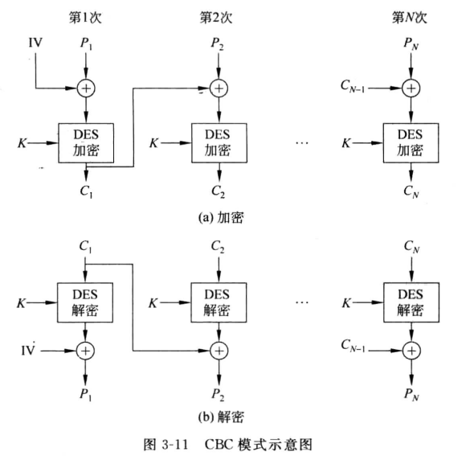
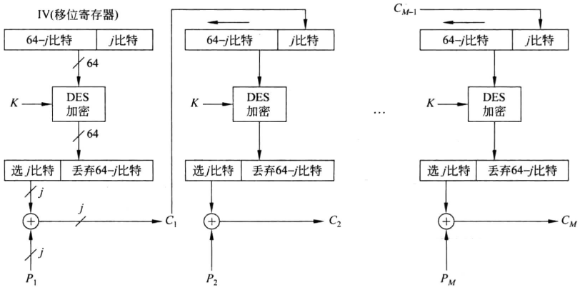
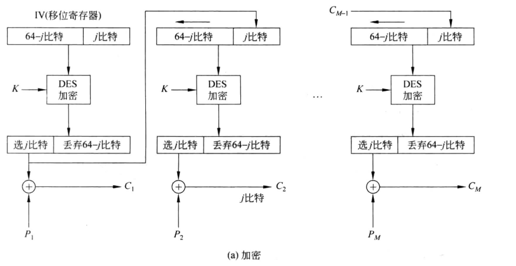

## 分组密码概述

### 和多表代换、流密码的区别

> block cipher

就是多表代换的进阶版，多表代换是长为 n 的明文，通过子密钥 ki 生成长为 n 的密文，而在分组密码，明文长度为 n，密文长度为 m，根据 n 和 m 的大小分为

- m = n，称作代换
- m > n，存在数据扩展
- m < n，存在数据压缩

这里的子密钥 ki 一般是通过密钥生成函数根据密钥 k 生成，长度固定

分组密码作用的对象是一个个明文组，而流密码的对象是一个个比特位，作用的方式均是“代换”，且加密解密一个对象使用同一组密钥

### Feistel 密码结构

核心是代换-置换网络

迭代方程（代换 + 置换）
$$
\begin{cases}
L_n=R_{n-1}\\
R_n=L_{n-1}\oplus F(R_{i-1},K_i)
\end{cases}
$$
轮函数 F 一般为二元加法和盒代换（S盒）复合，子密钥 Ki 由初始密钥 K 通过子密钥产生算法得到（如 DES 用 56 位密钥生成每轮的 48 位子密钥）

置换：每轮代换过后，将把左右两个分组交换位置（在上面的迭代方程中已经体现出来）

Feistel 网络的互逆性：对于明文 M、密文 C、子密钥正序使用 K，子密钥逆序使用 Inv(K)，有
$$
C=F(M,K)\iff M=F(C,Inv(K))
$$

## 数据加密标准 DES

> Data Encryption Standard，重点

明密文分组长度均为 64 比特，密钥长度 56 比特，子密钥 48 比特
$$
\begin{cases}
L_n=R_{n-1}\\
R_n=L_{n-1}\oplus F(R_{i-1},K_i)
\end{cases}
$$
符合 Feistel 密码结构

1. 初始代换：通过一张 map 直接代换明文位置（IP 函数），该过程可逆
2. 16 轮迭代
3. 左右交换
3. 逆 IP 操作

其中，轮代换（F 函数）为：扩展右半边 R 为 48 位（原 32 位），与子密钥 Ki 进行异或操作，而后经过 S 盒代换，每 6 个比特一组，产生 4 个比特的输出

16 轮迭代和左右交换一起构成 Feistel 网络：由于 Feistel 网络可逆，IP 操作也可逆，故 DES 算法的加密和解密也满足互逆

S 盒代换具体为

- 参与运算共 48 比特位，6 个一组，共 8 组，每组独立使用一个 S 盒
- 6 比特中，第一位和第六位构成列（00~11，0~3），中间四位构成行（0000~1111，0~15），通过查表得到对应数据

两个密钥的三重 DES，此时密钥长度为 2x56 = 112
$$
C=E_{K_1}[D_{K_2}[E_{K_1}(P)]]
$$
三个密钥的三重 DES，密钥长度为 3x56 = 168
$$
C=E_{K_3}[D_{K_2}[E_{K_1}(P)]]
$$
显然，当 K1=K3，该加密退化为两个密钥的三重 DES；当 K2=K3 或 K1=K2，退化为单重 DES

## 分组密码的运行模式

### ECB

> electronic code book

就是将明文按照 64 比特分组，每组采用相同的密钥 K 进行 DES 加密，纯纯的维吉尼亚密码



### CBC

> cipher block chain

每轮采用相同的密钥 K 进行 DES 加密，每轮加密过后，将加密完成的密文分组传入下一轮，下一轮的明文分组和上一轮的密文分组先进行异或，再进行 DES 加密

这样可以避免相同的明文分组产生相同的密文分组，实现扩散原则



### CFB

> cipher feedback

分组密码通过 CFB 运行模式可以转化为一个自同步的流密码（从密钥产生方式和加密过程来看）

这里操作的是 64 位的密钥 K，每轮选取 j 位进行 DES 加密，加密结果作为当前轮的子密钥和 j 位明文分组采取异或操作实现加密，同时将加密结果，即密文传入下一轮，加入密钥队列队尾，实现扩散性原则



上图中 P 代表一个个明文分组，和每一轮 DES 加密出来的 j 位子密钥异或生成密文分组 C

### OFB

> output feedback

和 CFB 类似，唯一的区别在于传入下一轮和下一轮明文分组异或的是上一轮的子密钥，即 j 位由 DES 算法产生的子密钥直接链入下一轮密钥（CFB 链入的是子密钥和明文分组异或的结果，即密文分组）



## AES 算法  Rijndael

> Advanced Encryption Standard，记住各部件功能及作用

轮函数：共四个部件组成

1. 字节代换
2. 行移位
3. 列混合
4. 密钥加

其中，字节代换由 S 盒实现，是非线性的，构成非线性层；行移位和列混合构成线性混合层；密钥加构成密钥加层，具体实现见书 P63

```c
// 轮函数
void Round(State, RoundKey){
    ByteSub(State); // 字节代换，通过代换表(S盒)实现
    ShiftRow(State); // 行移位
    MixColumn(State); // 列混合
    AddRoundKey(State, RoundKey); // 和子密钥异或
}

// 最后一轮不进行列混合
void FinalRound(State, RoundKey){
    ByteSub(State); // 字节代换，通过代换表(S盒)实现
    ShiftRow(State); // 行移位
    AddRoundKey(State, RoundKey); // 和子密钥异或
}
```

密码编排算法，由种子密码生成子密钥

```c
void KeyExpansion(byte Key[4*Nk], W[Nb*(Nr+1)]){
    for(int i = 0; i < Nk; i++)
        // Wi 为连续的四个种子密钥元素，分组
        W[i] = (Key[4*i], Key[4*i+1], Key[4*i+2], Key[4*i+3]);
    for(int i = Nk; i < Nb*(Nr+1); i++){
        temp = W[i-1];
        if(i % Nk == 0)
            // ^ 为异或操作
            temp = SubByte(RotByte(temp)) ^ Rcon[i/Nk];
        W[i] = W[i-Nk] ^ temp;
    }
}
```

加密算法

```c
void Rijndael(State, CipherKey){
    KeyExpansion(CipherKey,ExpandedKey); // 密钥编排，由种子密钥生成子密钥
    AddRoundKey(State, ExpandedKey); // 初始密钥加
    for(int i = 1; i < Nr; i++)
        Round(State, ExpandedKey + N*i); // 轮变换
    FinalRound(State, ExpandedKey);
}
```

