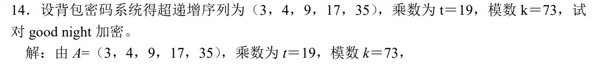

非对称加密，加密使用公钥，解密使用私钥

## RSA 算法

> 大整数素数分解困难

### RSA 的加密解密

两个大素数 p、q，其积记为 n，找到一个和 φ(n) 互素的整数 d
$$
d\in(1,φ(n))
$$
和 d 关于模 φ(n) 的逆 e
$$
e = d^{-1}(mod\,φ(n))
$$
则 (d,n) 作为公钥，(e, n) 作为私钥

加密解密过程如下，设明文为 m，密文为 c
$$
c\equiv m^d\,mod\,n
$$
解密为
$$
m\equiv c^e\,mod\,n
$$
解释如下，对于加密等式同时指上 e，由于二者互逆，相乘为单位元 1
$$
c^e\equiv m^{de}=m
$$
对于破译者，只要知道 p 和 q，就可以根据 φ(n) 和公钥 d 求得私钥 e，但已知大整数 n 求他的大素数分解 pxq 是一件很困难的事，于是这种加密可行

### RSA 的优化

- RSA 的孙子定理优化
- 通过重复平方法的中间过程分解 n

## 背包密码体制

### 背包密码加密

超递增序列 A，乘数 k，模数 p，背包向量 B

注意背包向量的长度应等于每组的比特数，在背包体制中，每个字母为一个 5 位的二进制数，空格为 00000，A 为 00001，以此类推（背包长度和待加密分组的比特位数相同）

若背包向量 A 长度为 5，则每次处理一个字母，若为 10，则每次处理两个字母，若为 15 则每次处理三个字母......

背包密码的处理方式有点像独热码，如 c 表示 3，二进制为 00011，则其密文为
$$
B_4+B_5
$$
因为 c 的二进制在第四第五位取 1

举个栗子

### 背包密码解密

解密需要用到乘数 k 和模数 p（在背包体制中也是作为私钥，序列 B 作为公钥）

解密分为以下三步，

1. 首先求 k 关于 p 的逆，记为 d
2. 第二将已知的密文乘以 d 再模上 p，得到经过 A 加密后的明文
3. 最后根据超递增序列 A，通过贪心算法构造二进制数得到明文

注意在已知 B 的情况下不能使用贪心算法，他不是超递增的，不满足最优子结构（这也符合公钥体制的设计思想，无法根据公钥解密）

举个栗子

## Rabin 密码体制

大素数分解困难

### Rabin 的加密解密

基于二次同余方程，模数 n 为两个大素数 p 和 q 之积

明文为 m，加密为
$$
c\equiv m^2\,mod\,n
$$
解密为求解一个二次同余方程为
$$
x^2\equiv c\,mod\,n
$$
其中 n 作为公钥，p 和 q 作为私钥（用于解这个二次同余方程）

求解二次同余方程的四个根（当 p 和 q 均模 4 得 3 时）

### 孙子定理

当知道二次同余方程的四个根 x1、x2、y1、y2 之后，这个二次同余方程转化为一个一次同余方程组
$$
\begin{cases}
m\equiv x_1\,mod\,p\\
m\equiv x_2\,mod\,p\\
m\equiv y_1\,mod\,q\\
m\equiv y_2\,mod\,q
\end{cases}
$$
我们通过孙子定理对明文 x 进行求解

## 椭圆曲线密码体制

### 椭圆曲线的嵌入和倍点运算

将明文 m 表示为椭圆曲线上的一个点 (m', f(m'))

- m' 为 m 的线性变换，乘以 k 加上 j（一般 k 在 30-50 之间）
- f 为椭圆曲线函数，最后结果要模上模数 p

椭圆曲线表示为
$$
G_{p}(a,b):f(x)=x^3+ax+b\,mod\,p
$$
代数加法（倍点运算）

### Diffie-Hellman 密码交换

a 是大素数的一个本原根
$$
K=Y_B^{X_B}=Y_A^{X_A}=a^{X_AX_B}
$$
其中 Y 为公钥，X 为私钥
$$
Y_B=a^{X_B}\quad Y_A=a^{X_A}
$$
A 加密时，通过 K 进行加密，发送给 B，B 由于知道 YA 和 XB，可以轻易的将明文解出，而其他人将只知道公钥 Y，解出的只能是
$$
a^{X_B}\quad a^{X_A}
$$
而由于离散对数问题很难求解这里的 a 或者是 X

在椭圆曲线上的实现

## ElGamal 密码体制

> 重点，出计算
>
> 离散对数求解困难

### ElGamal 的加密解密

选取大素数 p，随机数 g 和 x，计算
$$
y \equiv g^x\,mod\,p
$$
以 (y,g,p) 作为公钥，x 作为私钥

设明文为 M，选取任一与 p-1 互素的整数 k，加密过程为
$$
C_1=g^k\,mod\,p\quad C_2=y^kM\,mod\,p
$$
解密过程为
$$
M = \frac{C_2}{C_1^x}\,mod\,p
$$
注意分母 C1 有一个小小的 x 次方
$$
\frac{C_2}{C_1^x}=\frac{y^kM}{g^{xk}}=\frac{y^kM}{y^k}=M\,mod\,p
$$
### ElGamal 的椭圆曲线实现

在椭圆曲线上的实现

在椭圆曲线上，倍点运算就相当于指数运算，其反向求解过程即为求解离散对数问题

## 密钥协商和秘密分割

卧槽，被骗了，这章不考，狗逼现代密码学

### 单钥密钥分配

> 基于对称密钥技术的密钥协商，小重点

有 KDC 的单钥密钥分配

建立会话密钥 Ks 的过程，其中 Ka 和 Kb 是 A、B 和 KDC 共享已知的，用以确定各自身份

无中心的密钥分配

有点像三次握手，只不过 seq 和 ack 变成了随机数 N，这里的 Km 同样是 A、B 已经共享的一个密钥

### 公钥密钥管理

密钥管理方式

- 公开发布：可能存在假冒发布
- 公用目录表：一个管理员管理用户和其公钥的对照表
- 公钥管理机构：机构代办公用目录表
- 公钥证书 CA

#### 第三方管理

公钥管理机构

公钥证书

#### 公钥加密分配单钥密码

用公钥加密分配单钥密码体制的密钥：即用公钥传输单钥，用单钥传输数据

简单的使用公钥加密算法建立会话密钥（单钥）

具有保密性和认证性的公钥密钥分配：有点像四次挥手

### DH 密钥交换

> 小重点

DH 密钥交换：椭圆曲线密码体制，基于离散对数问题，只能用于密钥交换，不能用于加密（计算量太大）

这里涉及随机数的产生 —— 都是伪随机数

### 秘密分割

> 秘密共享，重点，出计算

秘密分割门限方案，例如一个包含 k 个变量的方程组，存在 n 个线性无关的单个方程，每个人掌握一个，只有 k 个方程同时在场才能解出这个包含 k 个变量的方程组，而秘密 s 为解向量的其中一个常量值

Shamir 门限方案：多项式方程组

基于中国剩余定理的门限方案：一次同余方程组，孙子定理求解
