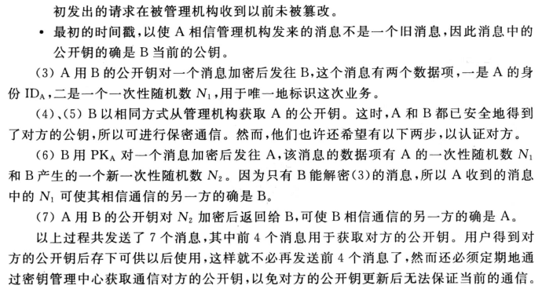
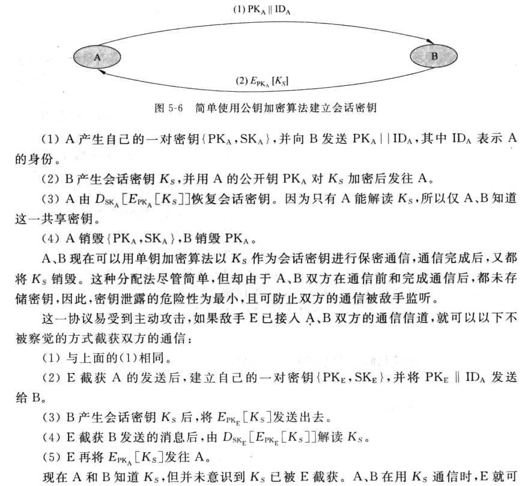
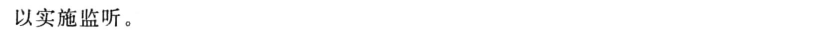
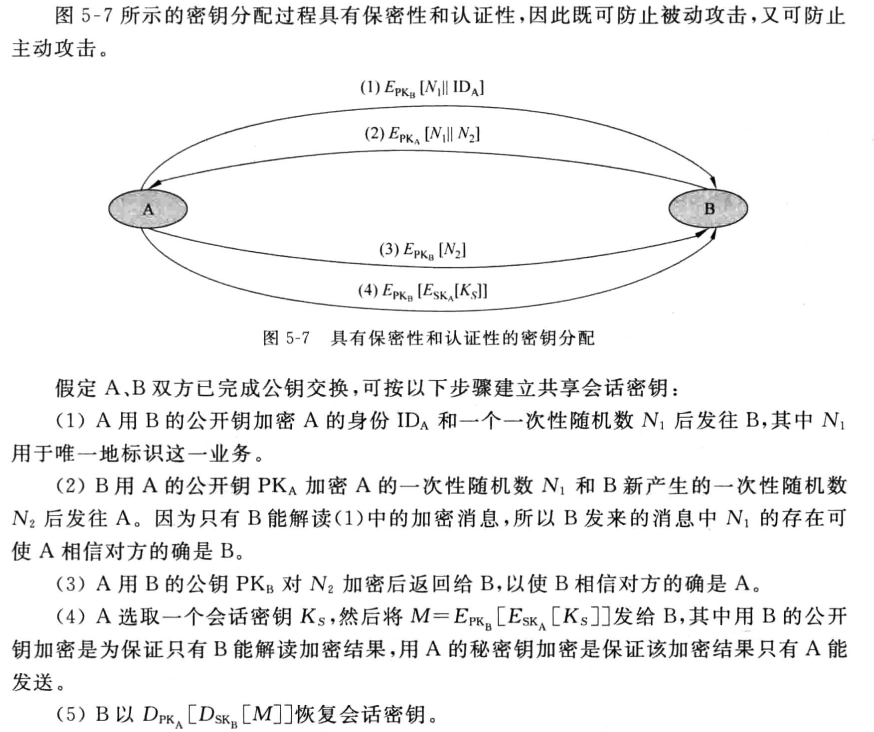

卧槽，被骗了，这章不考，狗逼现代密码学

密钥分配与密钥管理

## 单钥体制的密钥分配

> 基于对称密钥技术的密钥协商，小重点

有 KDC 的单钥密钥分配

建立会话密钥 Ks 的过程，其中 Ka 和 Kb 是 A、B 和 KDC 共享已知的，用以确定各自身份

无中心的密钥分配

有点像三次握手，只不过 seq 和 ack 变成了随机数 N，这里的 Km 同样是 A、B 已经共享的一个密钥

## 公钥体制的密钥管理

密钥管理方式

- 公开发布：可能存在假冒发布
- 公用目录表：一个管理员管理用户和其公钥的对照表
- 公钥管理机构：机构代办公用目录表
- 公钥证书 CA

### 第三方管理

公钥管理机构

公钥证书

### 公钥加密分配单钥密码

用公钥加密分配单钥密码体制的密钥：即用公钥传输单钥，用单钥传输数据

简单的使用公钥加密算法建立会话密钥（单钥）

具有保密性和认证性的公钥密钥分配：有点像四次挥手

### DH 密钥交换

> 小重点

DH 密钥交换：椭圆曲线密码体制，基于离散对数问题，只能用于密钥交换，不能用于加密（计算量太大）

## 随机数的产生

都是伪随机数

## 秘密分割

> 秘密共享，重点，出计算

秘密分割门限方案，例如一个包含 k 个变量的方程组，存在 n 个线性无关的单个方程，每个人掌握一个，只有 k 个方程同时在场才能解出这个包含 k 个变量的方程组，而秘密 s 为解向量的其中一个常量值

### Shamir 门限方案

多项式方程组

### 基于中国剩余定理的门限方案

一次同余方程组，孙子定理求解
