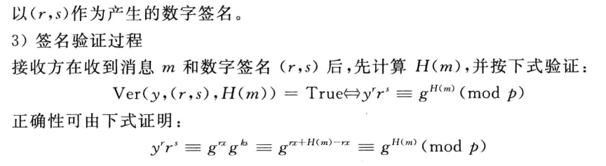

## 消息认证和数字签名

### 消息认证的缺陷

对于消息认证机制，其加密方式是发方、收方共有的，不管是用的分组密码还是公钥密码对明文进行加密产生认证码，生成方式都是共有的，也就是说，**任意一个收方 B，都可以伪装成 A 向外发送消息**，其他的收方 C 也根据同一个加密方式处理收到的明文并认证，认为这条消息为 A 所发

显然，此时 C 不知道收方 B 假冒了发方 A 发送了消息

相互的，当 A 发出了负面消息，可以以加密方式泄露的借口将锅丢给某个收方 B 的身上或是某个不存在的收方 D 身上

究其原因，就是这里的**认证机制仅仅只依赖于加密这一过程**，将收到的明文**单方向的加密**，再和与明文一起收到的认证码进行比对，完成认证

实际上，消息认证执行的是：发方加密，收方加密的认证方式

这也是为什么哈希函数被设计为单向性的原因（只涉及到加密，而不涉及解密）

### 数字签名

不同于消息认证，数字签名将整个明文加密，将这个加密的完整密文 E(M) 发送给收方，收方解密获取明文，你会发现这就是第二、三章的具体应用过程（包含加密和解密）

过程对比

- 数字签名：加密明文、传输密文、解密密文、比对明文
- 消息认证：加密明文、传输明文和密文、二次加密明文、比对密文

注意下图中的阴影框框并不是代表整个明文信息，而是表示签名，在真正传输的时候，和消息认证码类似，也是将 E(M) 链在 M 后进行发送

显然，数字签名执行的是：发方加密，收方解密的认证方式

只要解密成功，就能确认该消息由 A 所发（因为用的他的密钥），而收方 B 并不可以根据他所已知的信息假冒 A 对外发送消息，于是避免了收方假冒发方的情况

同时可以以**仲裁方式**确认消息被 A 发送过，即 A 要发送给 B，私钥加密后，先发给第三方 D，D 对这条消息进行确认，加入某些信息，再传给 B，这样 A 就无法否认他发过这条消息，也无法以私钥泄露进行甩锅

与之对应的直接方式存在 A 甩锅的风险

## RSA 签名体制

## 数字签名标准

### DSS 方式

不同于 RSA 的签名，其包括密钥生成、签名、认证三个完整阶段

上述 DSS 过程中

- H 为哈希函数，进行加密的对象其实是明文 M 的哈希值，这么做的原因很简单，为了缩小规模和规范化加密输入
- PK(G) 是发方和收方共有一个单钥，SK(A) 是发方的私钥，PK(A) 是发方的公钥，k 为加密的随机数，共同加密 H(M)，即 Sig 过程
- s 和 r 分别为单钥 PK(G) 的密文和公钥 SK(A)/PK(A) 的密文，共同参与解密
- 最后，收方根据收到的明文产生哈希值 H(M)，和对签名（密文）的解密内容进行比对，确认签名的正确性

### 数字签名算法 DSA

在 DSS 中，使用的公钥算法是 DSA 算法，基于 ElGamal 和 Schnorr 两个签名方案设计，其安全性基于求离散对数的困难性

为了更好理解，贴一个程序框图

## 基于离散对数的签名体制

### ElGamal 签名体制

> 小重点

算法描述及一个栗子

还真是

### Schnorr 签名体制

看一看就行，算法描述如下

## 密码协议

### 基本协议

### 零知识证明

### 安全多方计算协议
