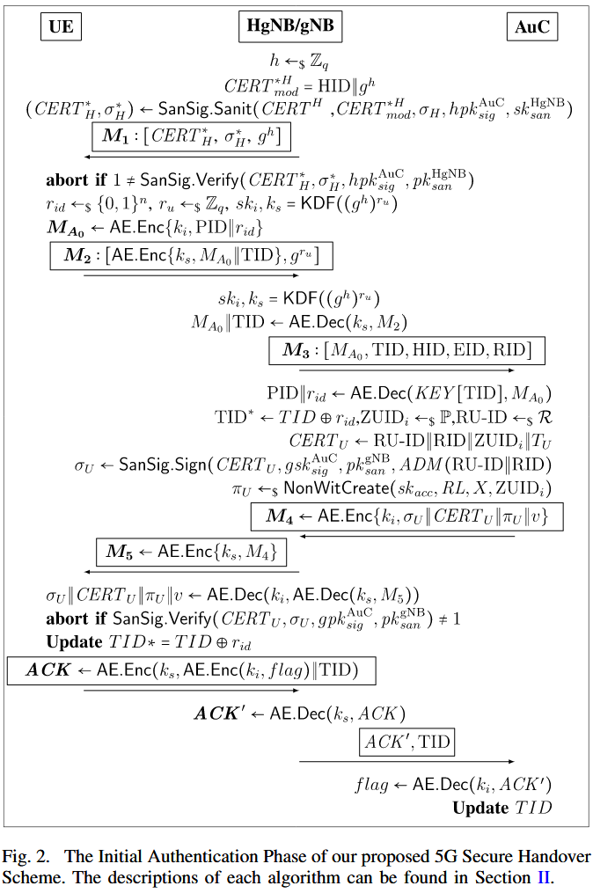
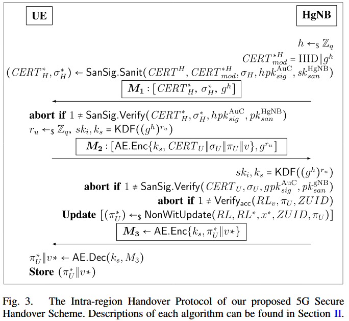
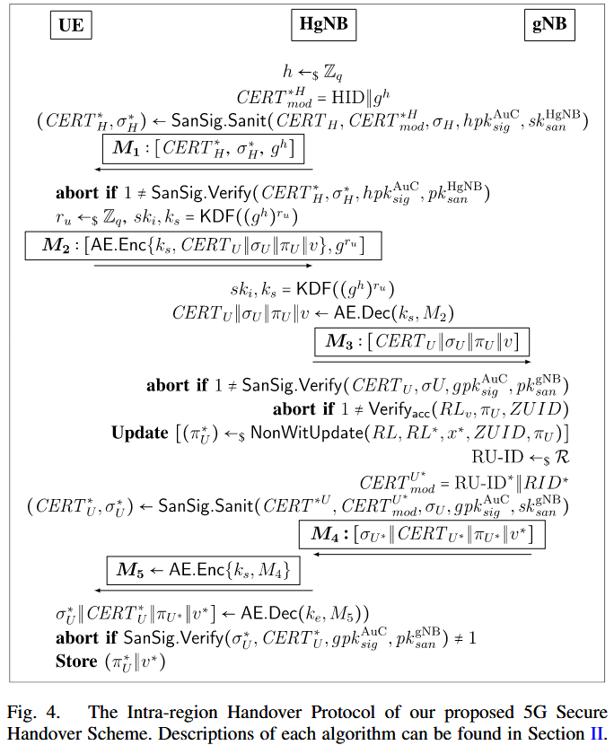

参考文献

1. [Sanitizable Signatures | SpringerLink](https://link.springer.com/chapter/10.1007/11555827_10) - 2005 ESORICS
2. [Privacy-Aware Secure Region-Based Handover for Small Cell Networks in 5G-Enabled Mobile Communication | IEEE Journals & Magazine | IEEE Xplore](https://ieeexplore.ieee.org/document/10068301) - 2023 TIFS
3. [PGUS: Pretty Good User Security for Thick MVNOs with a Novel Sanitizable Blind Signature](https://www.computer.org/csdl/proceedings-article/sp/2025/223600b102/26hiU7onwQ0) - 2025 S&P

## 可擦除签名概述

> Sanitizable Signatures

### 正常签名过程

签名参与者：1️⃣ 签名者 2️⃣ 验签者

对于一个正常的签名验签，假设有明文信息`M`

```json
M = {"姓名" = "张三", "身份证号" = "123456789"}
```

签名者根据明文`M`的哈希值进行签名
$$
\sigma=Sign_{sk}(H(M),sk)
$$
验签者需要知晓所有的明文信息 M，判断
$$
\sigma'=Sign_{pk}=(H(M),pk)\stackrel{?}{=}\sigma
$$
相等则验签通过，否则失败

### 变色龙哈希

变色龙哈希函数（Chameleon Hash），它具有以下特点

$$
CH(m, r) = g^m\cdot h^r\,mod\,p=CH(m',r')
$$
拥有陷门的人可以为任何消息 m 找到冲突 m'，使得二者的变色龙哈希值相等，其中的关键在于随机数 r' 的选取

### 可擦除签名

> 现在有个需求，**身份证号作为明文信息，我并不想让验签者（公众）知道**，所以需要对其进行“擦除”

以 RSA 为例，签名参与者：1️⃣ 签名者 2️⃣ 净化者 3️⃣ 验签者

1️⃣ 签名阶段

首先对明文进行分块

```json
M = {m_1, m_2} = {"姓名":"张三", "身份证号":"123456789"}
```

同时维护一个 boolean 数组`[0,1]`规定 m1 不可擦除而 m2 可擦除，设公私钥如下
$$
sk=(d,N),\,pk=(e,N)
$$
签名者进行签名，有
$$
\sigma = H(C)^d\quad C=c_1\,||\,c_2\quad c_i=CH(m_i,r_i)
$$
其中 ri 是参与哈希的随机数，CH 是变色龙哈希函数，最后输出的签名结构为

$$
\Sigma=(\sigma,c_1,c_2,r_1,r_2)
$$
此时明文为
$$
M=(m_1,m_2)
$$
2️⃣ 擦除阶段

擦除者对明文 M 中的敏感信息 m2 进行擦除，替换其为 m2‘，利用变色龙哈希的 trapdoor，计算新的 r2' 使得
$$
c_2'=CH(m_2',r_2')=c_2
$$
于是得到新的签名结构
$$
\Sigma'=(\sigma,c_1,c_2,r_1,r_2')
$$
同时替换明文为`M'=(m1, m2')`

3️⃣ 验签阶段

公众通过擦除后的明文信息 M' 和签名结构（如下）进行比对验证
$$
\Sigma'=(\sigma,c_1,c_2,r_1,r_2')
$$
根据明文组装哈希值
$$
C'=c_1\,||\,c_2'\quad c_1=CH(m_1,r_1)\quad c_2'=CH(m_2',r_2')
$$
验证签名
$$
\sigma^e=H(C)^{ed}=H(C)\stackrel{?}{=}H(C')
$$
实际上就是利用变色龙哈希函数来实现明文在验签上的“等效替换”，使原先有意义的明文信息变成无意义的，从而实现信息的“可擦除”，从密码学角度讲，这是一个典型的 trick

这一过程中，擦除者并不需要争取签名者的同意（即获取密钥），作为可信第三方拥有修改签名的权力，且仍能保证签名的有效性，并且擦除可以在任一阶段执行而不影响其前后任意过程的正常验签

##  基于可擦除签名的权限切换

> Handover

为了应对 5G 与小型蜂窝网络（SCN）的挑战

1. 5G 网络通过密集部署小型蜂窝基站（Small Cells Networks）提升容量和覆盖质量，但频繁的切换（Handover, HO）导致高延迟、安全风险和隐私泄露
2. 传统 5G-AKA（Authentication and Key Agreement）协议存在缺陷，如缺乏完美前向安全性（PFS）、匿名性不足，且无法有效支持小型蜂窝网络的频繁切换

文章提出了基于区域的网络切换方案，共包含三个隐私保护协议

1. 初始认证协议：用户首次接入网络时建立信任关系
2. 区域内切换协议（Intra-region HandOver）：在同一区域内的不同站点之间快速切换，利用预共享密钥和本地认证
3. 区域间切换协议（Inter-region HandOver）：跨区域切换时，通过 gNB 的协作更新用户证书，确保匿名性

### 初始认证协议

AuC 签名验签，HgNB 净化验签，UE 验签


- A1：HgNB 生成更新版 CERT H，并进行**签名擦除**（Sanit）后发给 UE
- A2：UE **验证** CERT H、生成临时会话密钥 ks，并通过 ks 加密身份信息后发送 M2 给 HgNB
- A3：HgNB 解密并转发 UE 身份信息到 AuC
- A4：AuC 生成 ZUID、证书 CERT U、**签名** σ、吊销证明 π，并用 ki 加密得到 M3 发送回 HgNB（我们认为 AuC 保存了所有的设备密钥 ki）
- A5：HgNB 用会话密钥 ks 将 M4 加密为 M5 发送给 UE
- A6：UE **验证** CERT U，发送 ACK（嵌套 AE 加密 flag 和 TID）给 HgNB
- A7：HgNB 解密 ACK 并转发至 AuC
- A8：AuC 解密 ACK 并更新 TID∗，实现**密钥同步**



### 区域内切换协议

用户通过累加器 v 实现在不同基站（HgNB）之间移动的快速重认证机制

- B1：与初始认证的 A1 相同，HgNB 对自己的 CERT 进行 SanSig **擦除**后发送
- B2：**验证** HgNB 的身份并生成 DH 密钥份额与会话密钥 ks，使用 ks 加密数据得到消息 M2 发送回 HgNB
- B3：HgNB 用私钥生成共享密钥 ks，解密 M2，并**验证签名**；检查累加器版本，若一致则调用 Verify 验证吊销状态，否则更新非成员证明；将**更新**后的版本信息用 ks 加密发送，UE 解密并保存用于后续通信



### 区域间切换协议

基站 gNB 通过净化的手段更新 AuC 的证书，同时更新累加器，实现区域的切换


- C1：HgNB 对自身证书**擦除**后，发送 M1 给 UE
- C2：UE **验证** M1，与 HgNB 协商密钥 ks，发送密文 M2 给 HgNB
- C3：解密 M2，将 UE 的身份信息以明文形式 M3 发给 gNB
- C4：gNB **验证签名**与吊销状态，更新 RU-ID 并生成新证书 CERT U，返回 M4
- C5：HgNB 使用 ks 加密 M4，生成 M5 发送给 UE
- C6：UE 解密 M5，验证后**更新**本地证书和 RU-ID



## 可擦除盲签名的认证和切换

> Sanitizable Blind Signatures

针对 MVNO 和 MNO 权限划分导致信任断裂，如基站与核心网互不信任，需匿名认证、用户不可链接、账单可追溯等问题，文章提出基于可擦除签名的认证和切换方案，以支持 5G 网络中 MVNO（特别是 Thick MVNO）模型下的认证与隐私保护

文章主要贡献：提出 PGUS 架构，包括

1. Sanitizable Blind Signature（SBS）
2. PGUS-AKA（认证与密钥协商协议）
3. PGUS-HO（无缝切换协议）
4. 全面 UC 安全建模与实测实现

### 可擦除盲签名

SBS

### 认证与密钥交换协议

AKA

### 无缝切换协议

HO

