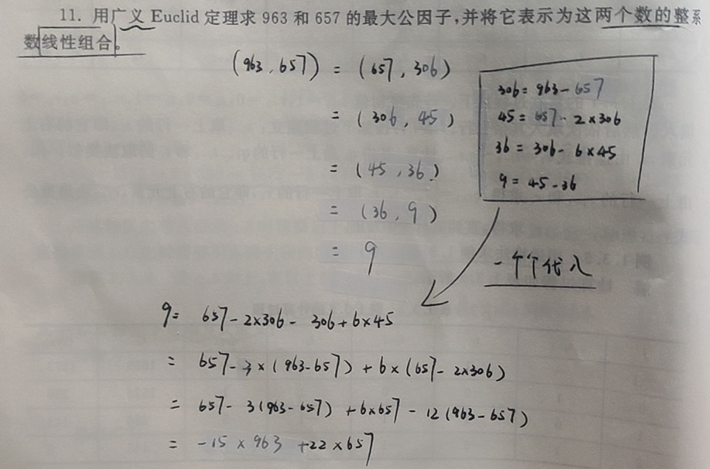
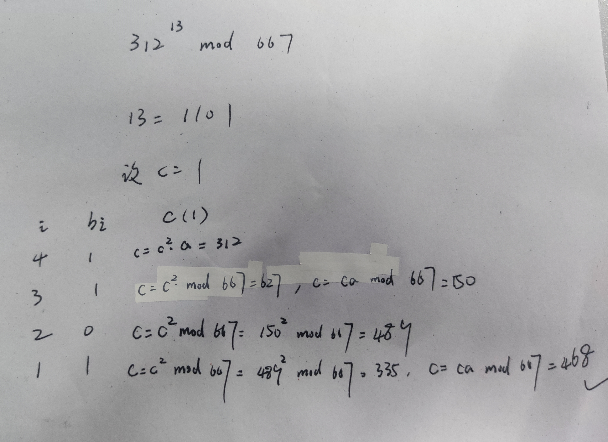
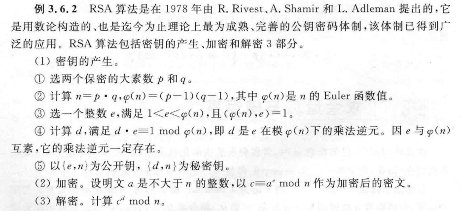

## 整除

### 素数和合数

> 素数是网络安全的基础

素数：即除自身和 1 以外，没有其他因数的数，如 3 只能被 1 和自身整除，那么 3 是一个素数，注意 1 不是素数

整除的表示，若 b 能够整除 a，c 不能整除 a，则记为
$$
b\mid a\quad c\nmid a
$$
素数的求法：Eratosthenes 筛法，我们认为一个数 n 为素数，当且仅当
$$
c_i\nmid n
$$
其中 ci 为小于等于 √n 的所有素数，即当数 n 不被小于 √n 的所有素数整除时，n 为一个素数

可以用一个递归算法实现

```c
list res; // 一个全局的顺序表，用以记录找到的素数
bool divide_exactly(int n, list res){
    for(int i: res){
        if(n % i == 0){
            return 1; // 被整除
        }
    }
    return 0; // 不被 res 中所有数整除
}

void search_prime_number(int n){
    if(n == 2){
        res.add(2);
        return;
    }
    int q = sqrt(n); // 取平方根
    search_prime_number(q); // 递归求解
    // 当 n 大于 2 时，根据小于 q 的所有素数，加入不被所有素数整除且小于 n 的数，即为 (q, n) 区间内的素数
    for(int i = q+1; i <= n; i++){
        if(divide_exactly(i, res)){
            continue;
        }
        res.add(i); // 当 i 不被所有 (0, q) 区间内素数整除时，确定 i 为一个素数，添入 res
    }
}

list get_prime_number(int n){
    n = abs(n); // 取绝对值
    if(n < 2){
        return NULL;
    }
    search_prime_number(n);
    return res;
}
```

证明素数无限，反证法（Euclid 开创的先和）

1. 设素数有限，共有 m 个，表示为 Pi（1 ≤ i ≤ m），设数 n 为
   $$
   n = 1+\Pi P_i
   $$

2. 由于素数一共就 m 个，且 n 大于任意一个素数（相乘大于 1 的数越乘越大），所以 n 一定不是一个已知的素数，即为合数

3. 根据 Eratosthenes 筛法，当一个数不被任意小于等于 √n 的素数整除时，n 将是一个素数，在这里
   $$
   n \% P_i = 1
   $$

4. 不可能被整除，故 n 其实是一个素数，但素数又有限，故出现矛盾，假设不成立，素数应该是无限的

一道例题：若 3 | n 且 4 | n，求证 12 | n

1. 由于 4 | n，则必有正整数 m 使 n = 4m
2. 则 3 | n 等价于 3 | 4m
3. 又 3 | 3m 始终成立，故有 3 | (4m-3m)，即 3 | m
4. 设正整数 p 使 m = 3p（因为 3 整除 m，p 一定存在）
5. 故 n = 4xm = 4x3p = 12p，显然有 n 被 12 整除，证毕

不完全商，即带余除法：`a = bq + r`，我们说 a 除以 b 商 q 余 r，注意我们**规定 r 是一个正整数**，故每个不完全商一定是**唯一**的
$$
-81 = -6\cdot 15 +9
$$
即`-81 % 15 = -6 ...... 9`，余数 r 一定满足`0 ≤ r ≤ |b|`

### 公因数和公倍数

公因数：数 n 为 a 和 b 最大公因子，充要条件为

- n 整除 a 和 b
- n 被 a 和 b 的任意其他公因子整除

记作
$$
n = (a,b)
$$
注意，对于负数，其公因子规定为正整数；若 (a, b) = 1，则我们说 a 与 b 互素

公因子的线性表示：任意两个整数的公因子可以被这两个整数线性表示，即

$$
(a,b) = x_1a+x_2b
$$
例如
$$
(963,657) = 9 = -15\times 963+22\times 657
$$

公倍数：数 m 为 a 和 b 最小公倍数，充要条件为

- m 被 a 和 b 整除
- m 能够整除 a 和 b 的任意公倍数

记作
$$
m = [a,b]
$$

### 算术基本定理

算术基本定理：任意正整数都可以被表示为一个素数乘积，如
$$
21 = 2^0\times 3^1\times 7^1
$$
这也叫做整数的**标准分解式**

通过标准分解式，我们可以求得任意整数的公因子和公倍数
$$
(a,b) = \Pi\,min\{a_i,b_i\}\quad
[a,b] = \Pi\,max\{a_i,b_i\}
$$
其中 ai 和 bi 分别为整数 a 和 b 在各个素数上的分解，如对于
$$
168 = 2^3\times3\times7\quad 180=2^2\times3^2\times5
$$
有
$$
(168,180) = 2^2\times3=12\quad [168,180]=2^3\times3^2\times5\times7=2520
$$
但一般情况下我们并不这么求最大公因子或最小公倍数，因为要求整数的标准分解式本就是一个很复杂的事，一般采用欧几里得算法求最大公因子

### Euclid 算法

欧几里得算法，不失一般性，设 b > a，则 a 和 b 的最大公因子满足
$$
(a,b) = (a, b-a)
$$
据此可以一直往下迭代减，直到 a 和 b 迭代为相同值或出现 1

拓展 Euclid 算法：辗转相除法，比传统的欧几里得更快收敛，采用除法取余的形式得到新的 b ，设整数 a < b，则有
$$
(a,b) = (a,b\%a)
$$
其中 b%a 为 b 除以 a 的余数

欧几里得算法求最大公因子

```java
int euclid(int a, int b){
    if(a == b)	return a;
    if(a == 1 || b == 1)	return 1;
    if(a > b)	return euclid(a-b, b);
    else	return euclid(a, b-a)
}
```

扩展欧几里得算法（辗转相除法）求最大公因子

```java
int extended_euclid(int a, int b){
    if(a == b)	return a;
    if(a > b){
        if(a%b == 0)	return b;
        return extended_euclid(a%b, b);
    }else{
        if(b%a == 0)	return a;
        return extended_euclid(a, b%a);
    }
}
```

使用辗转相除法求得最大公因子并把最大公因子用原整数线性表示



## 同余

### 同余的定义和性质

同余的概念，设有整数 a 和 b，除数 m，若
$$
m\mid (a-b)
$$
即 m 整除 a 和 b 之差，则我们说 a 和 b 同余，这是什么意思呢？

是这样，我们把模操作视作一个周期函数，若 a 和 b 的差值刚好被 m 整除，那就说明 a 和 b 刚好跨越 m 模运算的一个周期倍数 t（t = a-b），故二者的模运算值一定相等，f(t+x) = f(x)
$$
a\%m = k = b\%m
$$
但注意这里的函数值 k，即**最小正余数**，和周期倍数 t（a 和 b 的差值）没有必然关系

但可以确定的是，a 和 b 互为模 m 的一个余数，即
$$
a = b+q_1m\quad b = a+q_2m
$$
同余的性质

- 自反性：整数自己和自己同余
- 对称性：a 与 b 相互同余
- 传递性：a 与 b 同余，b 与 c 同余，则 a 与 c 同余

同余的加减乘除

### 辗转相除法

> 欧几里得算法

当 (a, m) = 1 时，这个最大公因子可以表示为
$$
ax+my = 1
$$
则有
$$
ax \% m = 1
$$
此时则称这个系数 x 为整数 a 对模 m 的逆元，记作
$$
x = a^{-1}
$$
这对于 m 来说是相互的，一定也有 m 的对模 a 的逆元为
$$
y = m^{-1}
$$
通过辗转相除法（广义欧几里得算法），可以得到一个整数的逆元，参考第一节最后的例题，先通过辗转相除法明确 (a, b) = 1（a 和 b 的最大公因子为 1，即二者互素），再根据计算过程将 1 线性表出
$$
ax + by = 1
$$
直接可得
$$
a^{-1} = x\quad b^{-1} = y
$$

### 同余类和剩余系

同余类：对于模数 m，所有同余的数构成一个集合，这个集合成为模 m 的一个同余类，例如对于模数 6 而言，`{1,7,13,19,25,...}`构成一个同余类，因为他们模 6 均同余 1，同理可得模 6 的所有同余类
$$
\{\overline{0},\overline{1},\overline{2},\overline{3},\overline{4},\overline{5}\}
$$
其中各个同余类之间互不相交，且所有同余类的并集为整数集合 Z

既约同余类：当 i 与模数 m 互素时，即`(i, m) = 1`时，我们称 i 代表的同余类为模 m 的一个既约同余类，如模 6 的既约同余类有
$$
\{\overline{1},\overline{5}\}
$$
完全剩余系：承接上面模 6 的例子，从其每一个同余类中取一个元素构成一个 m 长的集合，即为模 6 的一个完全剩余系，如
$$
\{0,1,2,3,4,11\}
$$
显然，剩余系中各元素互不同余

绝对最小完全剩余系，以模 6 为例
$$
-\lfloor\frac{m}{2}\rfloor,...,-1,0,1,...,\lfloor\frac{m}{2}\rfloor\rightarrow\{-3,-2,-1,0,1,2\}
$$

既约剩余系：一种特殊的剩余系，其元素均从既约剩余类中提出，如
$$
\{\overline{1},\overline{5}\}\Rightarrow\{7,5\}
$$
显然，既约剩余类的个数等于 φ(m)，既约剩余系中元素个数等于 φ(m)

### 模指数算法

原理
$$
(a\times b)\%m = [a\%m\times b\%m]\%m
$$
对于指数 a^n，有一种比较朴素的解法，即

```java
int modulo(int a, int n, int m){ // a为底数，n为指数，m为模数
    int c = 1;
    for(int i = 0; i < n; i++){
        if(c > m){
            c = c%m;
        }
        c *= a%m;
    }
    return c;
}
```

显然这样的时间复杂度为 O(n)

将指数由二进制表示
$$
n = b_k2^k+b_{k-1}2^{k-1}+...+b_12^1+b_02^0
$$
其实就是把一个十进制整数用二进制表示，如
$$
10 = 1010\quad 14 = 1110
$$
则所需的数组`b1 = [1,0,1,0], b2 = [1,1,1,0]`

原指数可表示为
$$
((...((a^{b_k})^2a^{b_{k-1}})^2...)^2a^{b_1})^2a^{b_0}
$$
r如
$$
10 = ((((1)^2\times2)^2\times1)^2\times2)^2\times1
$$
于是模指数运算可以化简为各个
$$
(\Pi\,a^{b_i}\% m)\%m
$$
模指数运算的算法实现，牢记

```java
// 模指数运算
int modulo_exponential_operations(int a, int n, int m){
    chat* b;
    atoi(n, b, 2); // atoi 函数
    int c = 1;
    for(char i: b){
        // 每步都要取模，防止溢出
        c = (c^2) % m;
        if(i == '1') // 当当前位置二进制为 1，乘上一个底数 a
            c = (c*a) % m;
    }
    return c;
}
```

这样运算的时间复杂度降低到 O(logn)

在手动运算时，模拟以下步骤即可求解

1. 计算指数的二进制，得到所需数组 b
2. 设 c 初始值为 1，循环平方并且遍历数组 b，b[i] 为 1 时乘以底数 a

举个栗子



## 数论函数及定理

数论函数，就是一些规定好的函数变换，这里引入一个函数的性质：积性

设有一元函数 f，当自变量 m 和 n 为整数且互质时，满足
$$
f(mn) = f(m)f(n)
$$
则称函数 f 是积性函数

当 m 和 n 在任何情况下均满足上式（即无需互素），则称函数 f 完全积性

### 欧拉函数

> Euler

欧拉函数 φ(n)，记录小于 n 的与 n 互素的正整数的个数，如
$$
\phi(7) = count(\{1,2,3,4,5,6\}) = 6
$$
欧拉函数有这样三种取值情况
$$
\phi(n) = \begin{cases}
n-1&n is prime\\
\phi(p_1)...\phi(p_n)=(p_1-1)...(p_n-1)&p,q are prime\\
x^{z-1}&n=x^z
\end{cases}
$$

- 当 n 为素数时，所有小于 n 的正整数均与之互质，故 φ(n) = n-1

- 当 n 为合数时，一定可以被表示为有限个素数乘积，其 φ(n) 值通过这些素数的 φ(p) 直接相乘可以得到，又素数的 φ(p) 值为 p-1

- 当 n 为一个指数，其 φ(n) 值为这个指数的低一阶，如
  $$
  8 = 2^3\rightarrow \phi(8) = 2^{3-1} = 4
  $$

欧拉函数的性质，对于两个互素的整数 m 和 n，一定有
$$
\phi(mn)=\phi(m)\phi(n)
$$


### 欧拉定理和费马小定理

对于两个互素的整数 a 和 m，一定有
$$
(a,m)=1\rightarrow a^{\phi(m)}\equiv 1\,mod\,m
$$
当 a 与 m 互质，则 a 的 φ(m) 次方模 m 将余 1

费马小定理：当 p 为素数，对于每个整数 a，一定有
$$
a^p\equiv a\,mod\,p
$$

### RSA 算法

> 依据一次同余方程进行加密和解密



取两个大素数 p 和 q，计算 n = pxq，作为公钥的一部分

取整数 e 满足
$$
(e,n)=1\quad e\in(0,φ(n))
$$
其中 φ(n) = (q-1)(p-1)（欧拉函数的定义），e 和模数 n 共同构成公钥，在加密时，使用如下算式，对于明文 a
$$
c \equiv a^e\,mod\,n
$$
在解密时（已知密文 c），需要进行如下运算得到明文 a
$$
a^{e}\equiv c\,mod\,n\rightarrow a^{ed} = a\equiv c^{d}\,mod\,n
$$
其中 d 为指数 e 模上 n 的逆元（乘法运算后得到 1 约掉）
$$
ed\equiv1\,mod\,n \rightarrow ed+ny=1
$$
故解密一个 RSA 密文分为两步

1. 通过私钥公钥 e 和模数 n 通过辗转相除法计算 e 的逆元 d
2. 做一个指数模运算，计算明文 a

第一步的算式如下，其中 e 和 n 为已知且必有 (e, n) = 1
$$
ed \equiv1\,mod\,n
$$
第二步的算式如下，就是一个指数模运算，这里可能要用到快速模算法，请复习上一篇最后一节
$$
a\equiv c^{d}\,mod\,n
$$
