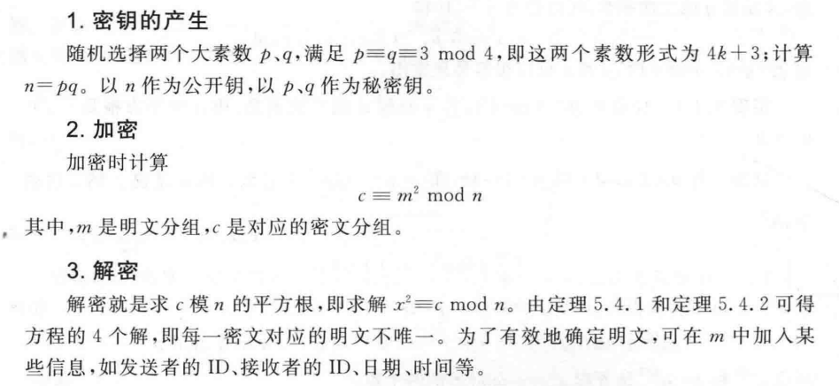
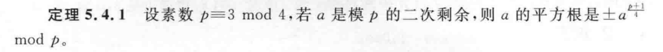
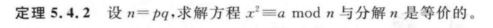

## 一次同余方程

方程形式
$$
ax \equiv b\,mod\,m
$$
求解一次同余方程

### 前置条件

有解的判定条件，若一次方程
$$
ax\equiv b\,mod\,m
$$
有整数解，当且仅当系数和模数的最大公因子整除余数
$$
(a, m)\mid b
$$
并且，当整除时，解的个数为`(a, m)`

例如
$$
32x\equiv 12\,mod\,8
$$
由于
$$
(32,8) = 8\nmid 12
$$
可直接判定该一次同余方程无解

### 穷举剩余类求解

即求解模 m 余 b 的 x 值，已知这个 x 一定存在于模 m 的一个**完全剩余系**中，采用穷举法一个个代入可以得到 x 的取值

```java
list solve_congruential_equation(int a, int b, int m){
    list res;
    // a 为 x 系数，b 为余数，m 为模数
    for(int x = 0; x < m; x++){
        // 遍历 m 的最小非负剩余系
        if((a*x) % m == b){
            // 可能不止一个 x 满足同余方程
            res.add(x);
        }
    }
    return res;
}
```

手动计算时，采用这样的步骤

1. 算出系数 a 和模数 m 的最大公因子，必须整除余数 b，才能判定有解
2. 从 0 开始，从小到大遍历模数 m 的剩余类，找到最小的一个 x 值，记为 x0

则有通解
$$
x = x_0+t\frac{m}{(a,m)}\quad t\in[\,0, (a,m)\,)
$$
如对于方程
$$
6x\equiv2\,mod\,8
$$
易知`(a, m) = (6, 8) = 2`，由于`2 | 2`，所以该方程有解且有两个解

从小到大遍历 8 的剩余类，`{0, 1, 2, 3, 4, 5, 6, 7}`，发现 x 为 3 时有
$$
6\times3\equiv 2\,mod\,8
$$
故 3 是 6x 模 8 余 2 的最小正整数解，记 x0 = 3，故
$$
x = x_0+t\frac{m}{(a,m)} = 3+4t\quad t\in[0, 2)
$$
令 t = 0/1，可以得到该同余方程的两个解`x1 = 3, x2 = 7`

### 逆元求解方程

对于系数和模数互素的一元线性同余方程
$$
ax \equiv b\,mod\,m \quad (a,m) = 1
$$
当 a 与 m 互素时，即`(a, m) = 1`时，a 在模 m 上具有逆元，方程左边同时乘以逆元可以快速求解未知数 x
$$
x\equiv a^{-1}b\,mod\,m
$$
注意有时求得的逆元是负数，通过加一个周期，可以得到正的逆元，如对于方程
$$
2x\equiv 3\,mod\,7
$$
通过辗转相除法，可得
$$
\quad 1=7-3\times2\\
\begin{aligned}
\Rightarrow 2^{-1}&\equiv-3\\
&\equiv4\,(mod\,7)
\end{aligned}
$$
故方程解为
$$
x = 4\times3\,mod\,7 = 5
$$
另外，对于系数大于模数的方程，可以通过模运算的性质简化
$$
60x\equiv7\,mod\,37\rightarrow(37x+23x)\equiv7\,mod\,37
$$
等价于
$$
[(37x\,mod\,37)+(23x\,mod\,37)]\,mod\,37 = 0+(...)\,mod\,37
$$
从而化简为
$$
23x\equiv7\,mod\,37
$$

## 一次同余方程组

> 数论的内容包括了密码学中的：公钥体制；安全协议

可用于秘密共享、密钥分发与用户认证协议，什么是密钥共享？就比如

- A 拥有密钥 1、2
- B 拥有密钥 1、3
- C 拥有密钥 2、3

只有当至少两个人在场时，即拥有完整的三个密钥，才能进行解密

### 前置条件

对于同余方程组
$$
\begin{cases}
x\equiv b_1\,mod\,m_1\\
x\equiv b_2\,mod\,m_2\\
...\\
x\equiv b_n\,mod\,m_n
\end{cases}
$$
孙子定理的应用条件：所有模数（即 mi）两两互素，若不互素，通过将模数标准展开，并且删去具有包含关系的方程，得到新的方程组进行运算，如


$$
\begin{cases}
x\equiv 2\,mod\,12\\
x\equiv 2\,mod\,3
\end{cases}
\rightarrow
\begin{cases}
x\equiv 2\,mod\,3\\
x\equiv 2\,mod\,4\\
\cancel{x\equiv 2\,mod\,3}

\end{cases}
$$
其原理为：由于`(4, 3) = 1`且`3 x 4 = 12`，所以有


$$
x\equiv 2\,mod\,12 \iff
\begin{cases}
x\equiv 2\,mod\,4\\
x\equiv 2\,mod\,3
\end{cases}
$$
当求解一次同余方程的时候，也可以通过这种方式简化运算，如


$$
59x\equiv 27\,mod\,91\iff
\begin{cases}
59x\equiv 27\,mod\,13\\
59x\equiv 27\,mod\,7
\end{cases}
$$
转化为一个一次同余方程组来进行求解（比直接用逆元运算好算一点）

### 孙子定理

在前提条件满足后，开始该计算程序，对于一次同于方程组
$$
\begin{cases}
x\equiv b_1\,mod\,m_1\\
x\equiv b_2\,mod\,m_2\\
...\\
x\equiv b_n\,mod\,m_n
\end{cases}
$$
第一步，计算 M，其中 mi 为方程组中各个同余方程得模数
$$
M = \Pi\,m_i
$$
第二步，计算 Mi
$$
M_i = \frac{M}{m_i}
$$
第三步，计算 Mi 对于模 mi 的逆元
$$
M_iM_i^{-1}\equiv1\,mod\,m_i
$$
第四步，直接计算解 x，其中 bi 为每个同余方程的余数（参照最上面的哪个同余方程组）
$$
x = \sum_{i=1}^nb_iM_iM_i^{-1}\,(mod\,M)
$$
一道非常经典的例题

- 通过扩展欧几里得去掉同余方程组中每个方程的系数
- 发现模数并不互素，通过模运算的性质展开为多个方程，并删去重复方程
- 通过孙子定理进行计算求解 x


## 二次同余方程

### 二次剩余

对于二次同余方程
$$
x^2\equiv a\,mod\,p
$$
若方程有解，且
$$
p\nmid a
$$
则称 a 是模 p 的一个二次剩余，若无解，则 a 是 p 的一个二次非剩余

### 欧拉判别法

给定一个二次同余方程，如何判定其是否有解（余数 a 是否是模数 p 的一个二次剩余），采用欧拉判别法，他这样规定

当 p 是一个奇素数且 p 不能整除 a，若
$$
a^{\frac{φ(p)}{2}}\equiv1\,mod\,p\quad φ(p) = p-1
$$
即，余数 a 的 p-1 次方模 p 自身为 1，则可以断定由 a 和 m 构成的二次同余方程是有解的

注意这里的欧拉判别式只有可能余出两种结果，即 1 或 -1，若为 -1，就说明 a 是 p 的二次非剩余

举个栗题：判断下列二次同余方程余数是否是模数的二次剩余
$$
x^2\equiv3\,mod\,29
$$
首先确定，29 是一个奇素数，且 29 绝对整除不了 3，然后开始欧拉判别算法，即求解
$$
3^{\frac{29-1}{2}} = 3^{14}\equiv\,?\,mod\,29
$$
这里要用到模指数运算，将指数 14 表示为二进制 1110，设余数初始值 c = 1，则有

| i    | bi   | c(1)                                      |
| ---- | ---- | ----------------------------------------- |
| 4    | 1    | c = c x c x a (mod 29) = 3                |
| 3    | 1    | c = c x c x a (mod 29) = 27               |
| 2    | 1    | c = c x c x a (mod 29) = 12               |
| 1    | 0    | c = c x c (mod 29) = 144 mod 29 = 28 = -1 |

即有
$$
(\frac{3}{29}) = 3^{14}\,mod\,29=-1
$$
故 3 是 29 的二次**非**剩余

### Legendre 符号

用于表示余数 a 是否是模数 p 的二次剩余，其实这里的判定和欧拉判别一模一样，只是用 Legendre 符号来表示 a 模 p 的逆元

其前提是 p 必须为一个奇素数
$$
(\frac{a}{p}) = \begin{cases}
1&x^2\equiv a\,mod\,m 有解\\
-1&x^2\equiv a\,mod\,m 无解\\
0&p|a
\end{cases}
$$
对于分子可以进行分解（是否想到了整数的标准分解式，这样分子分母都是素数，操作空间极大，我是指倒过来）
$$
(\frac{a}{p}) = (\frac{a_1}{p})\times...\times(\frac{a_n}{p})
$$
有以下性质，务必牢记
$$
\begin{cases}
(\frac{1}{p}) = 1\\
(\frac{-1}{p}) = (-1)^{\frac{p-1}{2}}\\
(\frac{2}{p}) = (-1)^{\frac{p^2-1}{8}}\\
(\frac{q}{p}) = (-1)^{\frac{q-1}{2}\frac{p-1}{2}}(\frac{p}{q})
\end{cases}
$$
其中第四个式子又被称作二次互反律

这个符号存在的意义是可以对未知的二次剩余进行简化或者通过已知的二次剩余推到未知的二次剩余关系
$$
(\frac{15}{227}) = (\frac{3}{227})(\frac{5}{227}) = (-1)^{113\times1}(\frac{227}{3})(-1)^{113\times2}(\frac{227}{5})
$$
化简得
$$
-(\frac{227}{3})(\frac{227}{5}) = -(\frac{2}{3})(\frac{2}{5})
$$
通过欧拉判别式
$$
2^{\frac{3-1}{2}}\equiv -1\,mod\,3\quad 2^{\frac{5-1}{2}}\equiv -1\,mod\,3
$$
故
$$
(\frac{15}{227})=-(\frac{2}{3})(\frac{2}{5}) = -1\times(-1)\times(-1) = -1
$$
即 15 不是模 227 的二次剩余，而是二次非剩余

### Jacobi 符号

是 Legendre 的推广，在 Legendre 符号中，要求分母，即模数 p 必须是一个奇素数，而在 Jacobi 符号中，取消了这种限制，即 m 可以为任意数
$$
(\frac{a}{m})
$$
通过对 m 标准分解，可以将 Jacobi 符号转化为多个 Legendre 符号的乘法（无敌了）
$$
(\frac{a}{m}) = (\frac{a}{p_1})(\frac{a}{p_2})...(\frac{a}{p_n})
$$
其中 pi 均为奇素数

当 Jacobi 符号取消了奇素数的限制后，自然无法对二次剩余的所有情况进行判定

- 当 (a/m) = 1 时，什么也不能说明
- 当 (a/m) = -1 时，说明 a 是 模 m 的二次**非**剩余

可以说 Legendre 是 Jacobi 的一种特殊情况

### Rabin 加密算法

> 根据二次剩余进行加密和解密

**威尔逊定理**：当 p 是一个质数，则其减一的阶乘模自身将余 -1（等价于余 p-1）
$$
(p-1)!\,\equiv -1\,mod\,p
$$
为什么所选取的大素数 p 和 q 必须是模四余三的形式？这样可以**保证只有四个解**







取大素数 p、q，计算模数 n = p x q

加密过程很简单，就是一个模平方运算，设明文为 m，则密文 c 为
$$
c \equiv m^2\,mod\,n
$$
而解密过程，就是通过密文 c 解出明文 m（相当于解一个二次同余方程）
$$
x^2\equiv c\,mod\,n
$$
这里的求解遵照以下算法

第一步：求解大素数 p 和 q 相互模的逆元 s 和 t，即求解
$$
ps+qt = 1
$$
这里要用到辗转相除法

第二步：求解两个基本根 u 和 v，用以下公式
$$
u = c^{\frac{p+1}{4}}\,mod\,p\quad v = c^{\frac{q+1}{4}}\,mod\,q
$$
u 对应大素数 p，v 对应大素数 q

第三步：求解同余方程的四个根
$$
x = (\pm\,psv\pm\,qtu)\,mod\,n
$$
基本根和大素数交叉乘，即 u 乘以 q，v 乘以 p

可以注意到这四个根中，有两对互为相反数
$$
x_1=psv+qtu=-(psv+qtu)=-x_2\\
x_3=psv-qtu=qtu-psv=-x_4
$$
通过加一个模数 n 可以令四个根均为正，此时一定有
$$
x_1+x_2 = n\quad x_3+x_4 = n
$$
最后的最后，通过和密文一同传输过来的冗余位判断哪一个根是所需的明文
