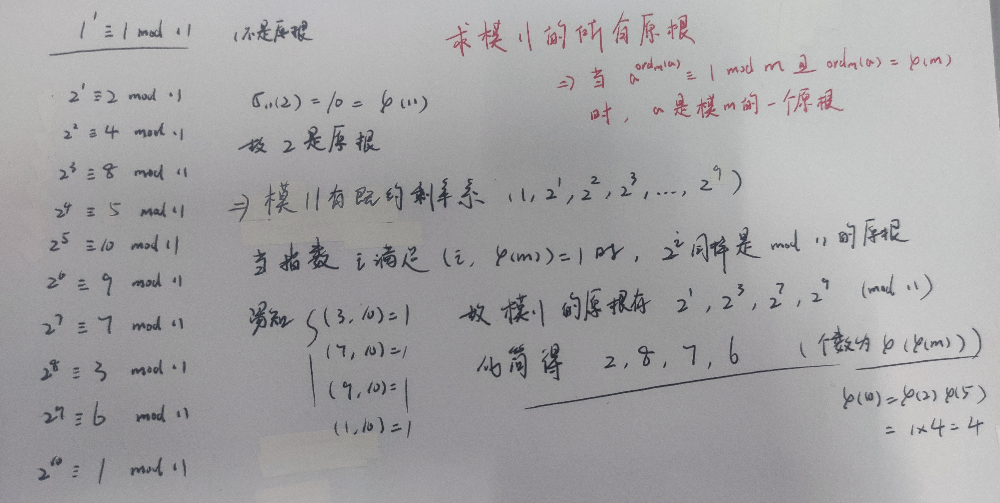
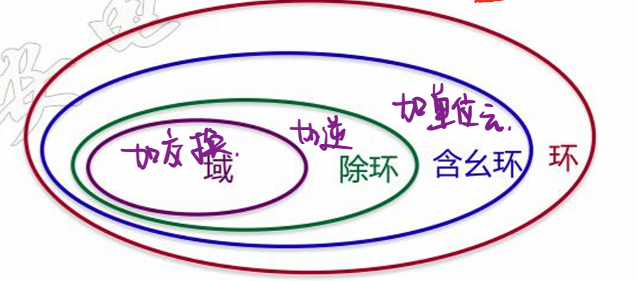
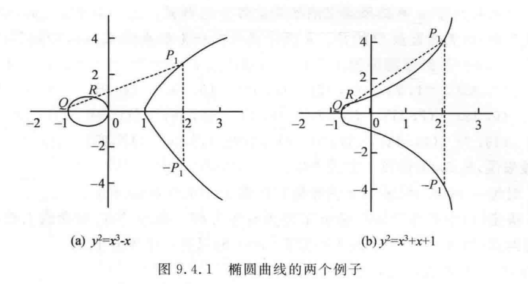
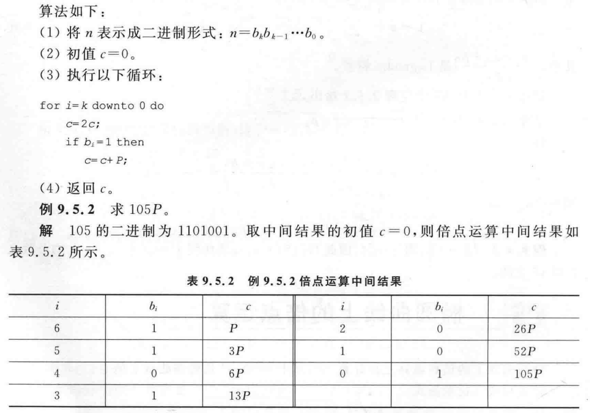
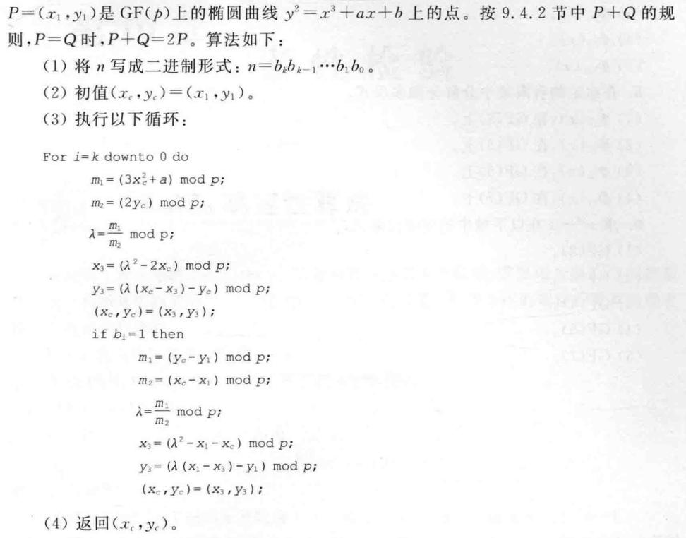
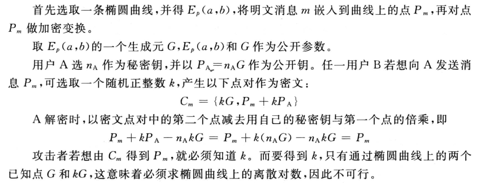

## 阶和原根

### 阶和原根的定义

若对于数 a，有
$$
a^d\equiv1\,mod\,m
$$
且 d 是满足上述方程的最小正整数，则 d 为整数 a 模上 m 的阶，记作
$$
ord_m(a) = d\quad\quad\sigma_m(a) = d
$$
寻找整数 a 模上 m 的阶

```java
int step(int a, int m){
    // φ(m) 为 m 的欧拉函数值
    for(int i = 1; i < φ(m); i++){
        if(pow(a, i) % m == 1){
            return i;
        }
    }
    return φ(m); // 若执行到这，也说明 a 是 m 的一个原根
}
```

由欧拉定理可知，当`(a, m) = 1`时，下式一定成立
$$
a^{φ(m)}\equiv1\,mod\,m
$$
当 a 模上 m 的阶 ord(a) = d，这个阶 d 等于 m 的欧拉函数值 φ(m) 时，我们称 a 是模 m 的一个原根

由于欧拉定理的前提条件`(a, m) = 1`，故原根 a 只有可能出现在 m 的简化剩余系中（也叫既约剩余系，其元素个数等于 φ(m)）

### 阶和原根的性质

阶将整除使同余方程成立的任意指数
$$
ord_m(a)=d\rightarrow a^{d_i}\equiv1\,mod\,m\quad d\mid d_i
$$
换句话说，阶 d 一定是其余所有使指数同余方程成立的指数 di 的因子（最小公因子）

剩余系的原根表示

用原根的指数形式可以表示模 m 的一个既约剩余系
$$
[1,a,a^2,...,a^{φ(m)-1}]
$$
若 m 是一个素数，原根可以表示一整个剩余系，即完全剩余系
$$
[0,1,a,a^2,...,a^{φ(m)-1}]
$$

对于原根的指数，有以下推论，当 a 是模 m 的原根，则 a 的 k 次方也是模 m 的原根
$$
a^k\equiv1\,mod\,m\quad (k,φ(m))=1
$$
其实这是模 m 因子运算的一个子集，完整的推论是说，当
$$
(k,φ(m)) = d\rightarrow a^{\frac{φ(m)}{d}}\equiv1\,mod\,m
$$
d 是模 m 的某个因子，k 是原根上要指的指数，并且这个 k 一定是 a 模 m 的阶（当 d = 1 时，a 的指数 φ(m)/d 则一定等于 φ(m)，即 φ(m) 为 a 的阶，故 a 为原根）


### 求解阶和原根

求解原根：最朴素的想法就是从小往上遍历，再一个个指数从小往大遍历，找到第一个 d = ord(a) 的整数

但根据原根 a 的性质
$$
(k,φ(m)) = d\rightarrow a^k\equiv1\,mod\,m
$$
可以根据已知的某一个快速求解所有原根



求解所有的阶


快速求解单一原根，根据 φ(m) 的因子指数计算，如求解 43 的一个原根，有
$$
φ(43) = 42\rightarrow[1,2,3,6,7,14,21,42]
$$
在对原根进行判断时，不用一个一个往上爬着求，直接求因子次方即可，如
$$
2^2\equiv4\quad2^3\equiv8\quad2^6\equiv21\quad2^7\equiv-1\quad 2^{14}\equiv1\,(mod\,43)
$$
故 2 的阶为 14，不等于 φ(m)，故不是原根，对于 3
$$
3^2\equiv9\quad...\quad3^{42}\equiv1\,(mod\,43)
$$
故 3 是 43 的一个原根，再根据既约剩余系的指数 i
$$
[1,3,3^2,...,3^{41}]
$$
若有指数 i 与 φ(m) 互质
$$
(i, φ(m)) = 1\rightarrow (3^{i})^{φ(m)}\equiv1\,mod\,43
$$
则 3 的 i 次方的阶为 φ(m)，一定也为原根

如对于指数 5 而言，其与 φ(m) 互质（最大公因子为 1）
$$
(5,42)=1\rightarrow 3^5 \equiv 28\,mod\,43
$$
所以 28 也是 43 的一个原根

### 离散对数密钥协商

> DH（Diffie-Hellman 算法），即为密钥协商

双方密钥协商过程如下

1. 首先，选取一个大素数模 p，以及它的一个原根 g
2. A 生成一个随机数 x，发送 g 的 x 次方给 B
3. B 收到 g 的 x 方，另外生成一个随机数 y，并发送给 A

此时 A 和 B 就通过
$$
g^{xy}
$$
作为会话密钥进行加密解密，即设 a 为明文
$$
c \equiv g^{xya}\,mod\,p\quad a =ind_gc
$$
a 为模 p 关于原根 g 的 c 的离散对数

## 群环域

### 群

基本定义

- **半群**：当一个代数系统`(G, ·)`，G 中元素的 · 运算满足封闭性和结合律，我们说其为一个半群
- **含幺半群**：当一个半群`(G, ·)`，具备单位元 e，即满足`e·g = g, g∈G`，我们说其为一个含幺半群
- **群**：当一个含幺半群，其中每一个元素都有其逆元，即有`g·h = e`，我们说这是一个群
- **阿尔贝群**：当一个群的运算满足交换律，即`a·b = b·a`，我们说这是一个阿尔贝群
- **子群**：当元素集合 H ⊆ G，且 · 运算在 H 上同样构成一个群，我们说`(H, ·)`是`(G, ·)`的一个子群，特别的，当`H = {e} / G`时，称作**平凡子群**
- **陪集**：对于子群`(H, ·)`，选取 H 中元素 s，构建新群`sH = (sh | h∈H)`，群`(sH, ·)`称作 s 关于子群 H 的**左陪集**（乘在右边就是右陪集）
- **循环群**：当群中所有元素都是某一固定元素的幂，则该群为循环群，此固定元素为循环群的一个**生成元**，如模 8 加法群`(Z, +) = {0,1,2,3,4,5,6,7}`可记作`Z = <1>/<3>/<5>/<7>`

### 环

环在有限元素集合 G 上规定了两种运算，+ 和 ×，其中 G 和 + 运算构成阿尔贝群，G 和 × 运算构成半群，且同时，乘法运算对加法运算满足分配律，则我们说`(G, +, ×)`构成一个环

当一个环的乘法运算含幺，并且幺元满足`ea = ae`，我们说这是一个整环，或含幺环

当一个环的乘法运算和 G 构成群，即含幺且各元素均有逆元，则这个环是一个除环

### 域

可交换的除环就是一个域，即环中乘法运算和所有元素构成一个阿尔贝群，加法运算已经是一个阿尔贝群，且乘法对加法可分配，此时该环`(G, +, ×)`构成一个域



有限域：很简单，就是集合中元素个数有限，如整数域是无限域，模 7 的整数集合是有限域

## 椭圆曲线

### 椭圆域几何定义及倍点

狭义的椭圆曲线
$$
\frac{x^2}{a^2}+\frac{y^2}{b^2}=1
$$
广义的椭圆曲线
$$
y^2=x^3+ax+b
$$
每个椭圆曲线都有一个无穷远点 O，这是椭圆曲线上的加法单位元，其实就是纵坐标 y = 0 的点

同一直线上的三个不同点的和一定为 O，单位元点有以下性质（符合群的定义）

- O + O = O
- P + O = P

椭圆上的加法：图 a 中，Q+R = -P1，P1 为直线 QR 和椭圆曲线的交点，-P1 为其关于 x 轴的对称点，图 b 同理



关于倍点，倍点运算即为重复加法运算

- 对于 2Q = Q+Q 来说，即在椭圆曲线一上做 Q 点的切线，假设与椭圆曲线二交于 R，则 -R 为其和点
- 对于 3Q = Q+Q+Q 而言，已知 2Q = -R，再加一个 Q，即连接 Q 和 -R，其交点 H 一定过曲线一，-H 即为 3Q

注意这里的 -R 和 -H 均为椭圆曲线上的逆元，其实并非直接将纵坐标取负（只是在上述两图中如此，为特殊情况），下面有说，其实是纵坐标的负数模上椭圆系的系数

### 椭圆域的代数加法

一些概念

- 椭圆域：即椭圆曲线上的阿尔贝群（满足交换律的群）
- 椭圆离散系，去除线的概念，椭圆系由一个个离散的点组成

椭圆曲线的代数逆元
$$
P(x,y)\rightarrow P^{-1}=(x,\,-y\,mod\,p)
$$
其中 p 为椭圆曲线的参数，有时也直接记作 -P

当某点的纵坐标 y 被 p 整除时，我们说这个点是一个无穷远点 O，如对于系数 p = 23 的椭圆域一定有无穷远点 O 如下
$$
E_{23}(a,b)\rightarrow O(x_0, 23n)
$$
在代数上，加法的坐标满足：`P(x1, y2), Q(x2, y2), R(x3, y3) = P + Q`
$$
\begin{cases}
x_3=k^2-x_1-x_2(mod\,p)\\
y_3=k(x_1-x_3)-y_1(mod\,p)
\end{cases}
$$
对于常数 k，有
$$
k=
\begin{cases}
\frac{3x_1^2+a}{2y_1}\,(mod\,p)&P=Q\\
\frac{y_2-y_1}{x_2-x_1}\,(mod\,p)&P\neq Q
\end{cases}
$$
其中 a 是椭圆曲线中 x 的系数（这里的 a 和 p 都是定义椭圆域的常数，已知）

椭圆曲线中逆元的计算（如何将小数化为整数），如对于 E23 的椭圆域
$$
-2^{-1}\,mod\,23=\,?
$$
首先要将 2 的 -1 次方视为 2 的逆元，根据辗转相除法可知
$$
1 = 23-11\times 2\Rightarrow 2^{-1}=-11=12\,(mod\,23)
$$
所以有
$$
-2^{-1}\,mod\,23=-12\,mod\,23=11
$$
**举个栗子：在系数在`E23`上且`a = 1`的椭圆系中，有`P(3, 10), Q(9, 7)`**

1、求解 -P

根据椭圆系的逆元定义，有
$$
-P=(3,-10\,mod\,23)=(3,13)
$$
2、求解 R = P + Q

首先明确 P 不等于 Q，则斜率 k 为
$$
k = \frac{y_2-y_1}{x_2-x_1} = -2^{-1}\,mod\,23
$$
这里采用逆元的计算方式来表示 -1/2，根据广义欧几里得有
$$
1 = 23-11\times2
$$
固有
$$
2^{-1} = -11\Rightarrow k = -2^{-1}=11\,mod\,23
$$
根据公式直接计算 R 的横坐标
$$
x_3 = k^2-x_1-x_2=121-3-9\,(mod\,23)=17
$$
纵坐标
$$
y_3 = k(x_1-x_3)-y_1=11\times(3-17)-10\,(mod\,23)=20
$$
故 R 坐标为 (17, 20)

3、求解 2P

这是一个倍点运算，此时斜率 k 为
$$
k = \frac{3x_1^2+a}{2y_1}=\frac{3\times3^2+1}{20}=\frac{7}{5}=7\times5^{-1}
$$
根据辗转相除法，易知 5 的逆元为 -9
$$
\begin{aligned}
23 &= 4\times5+3\\
5 &= 3+2\\
3 &= 3+1
\end{aligned}
\Rightarrow
\begin{aligned}
&= -5+2\times(23-4\times5)=2\times23-9\times5\\
&= 3-(5-3)=-5+2\times3\\
1 &= 3-2
\end{aligned}
$$
则有
$$
k = 7\times(-9)\,mod\,23=-63\,mod\,23=6
$$
代入坐标计算公式
$$
\begin{aligned}
x_3&=k^2-2x_1\,(mod\,23)=7\\
y_3&=k(x_1-x_3)-y_1\,(mod\,23)=12
\end{aligned}
$$
故 2P 坐标为 (7, 12)

### 椭圆域的倍点运算

对于 nP，将系数 n 用二进制表示，采用和快速模运算类似的方式，对 P 进行 logn 次加法（二倍点）运算



就是当当前位为 1 时，多加一个原点 P，同时每一轮进行一次二倍点运算（乘以 2）

- 模平方运算是当当前位为 1 时多乘上一个底数 a，其余时间每轮进行平方运算

倍点运算的代码实现



### 椭圆曲线加密

加密解密过程（背下来），公钥是用来加密的，私钥是用来解密的



就是通过一个公钥，进行倍点运算加密，倍点运算结果很难进行还原
