非对称加密，加密使用公钥，解密使用私钥

## RSA 算法

> 大整数素数分解困难

### RSA 的加密解密

两个大素数 p、q，其积记为 n，找到一个和 φ(n) 互素的整数 d
$$
d\in(1,φ(n))
$$
和 d 关于模 φ(n) 的逆 e
$$
e = d^{-1}(mod\,φ(n))
$$
则 (d,n) 作为公钥，(e, n) 作为私钥

加密解密过程如下，设明文为 m，密文为 c
$$
c\equiv m^d\,mod\,n
$$
解密为
$$
m\equiv c^e\,mod\,n
$$
解释如下，对于加密等式同时指上 e，由于二者互逆，相乘为单位元 1
$$
c^e\equiv m^{de}=m
$$
对于破译者，只要知道 p 和 q，就可以根据 φ(n) 和公钥 d 求得私钥 e，但已知大整数 n 求他的大素数分解 pxq 是一件很困难的事，于是这种加密可行

### RSA 的优化

- RSA 的孙子定理优化
- 通过重复平方法的中间过程分解 n

## 背包密码体制

### 背包密码加密

超递增序列 A，乘数 k，模数 p，背包向量 B

注意背包向量的长度应等于每组的比特数，在背包体制中，每个字母为一个 5 位的二进制数，空格为 00000，A 为 00001，以此类推（背包长度和待加密分组的比特位数相同）

若背包向量 A 长度为 5，则每次处理一个字母，若为 10，则每次处理两个字母，若为 15 则每次处理三个字母......

背包密码的处理方式有点像独热码，如 c 表示 3，二进制为 00011，则其密文为
$$
B_4+B_5
$$
因为 c 的二进制在第四第五位取 1

举个栗子

### 背包密码解密

解密需要用到乘数 k 和模数 p（在背包体制中也是作为私钥，序列 B 作为公钥）

解密分为以下三步，

1. 首先求 k 关于 p 的逆，记为 d
2. 第二将已知的密文乘以 d 再模上 p，得到经过 A 加密后的明文
3. 最后根据超递增序列 A，通过贪心算法构造二进制数得到明文

注意在已知 B 的情况下不能使用贪心算法，他不是超递增的，不满足最优子结构（这也符合公钥体制的设计思想，无法根据公钥解密）

举个栗子

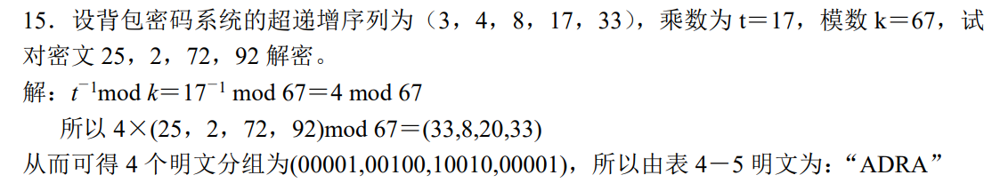

## Rabin 密码体制

大素数分解困难

### Rabin 的加密解密

基于二次同余方程，模数 n 为两个大素数 p 和 q 之积

明文为 m，加密为
$$
c\equiv m^2\,mod\,n
$$
解密为求解一个二次同余方程为
$$
x^2\equiv c\,mod\,n
$$
其中 n 作为公钥，p 和 q 作为私钥（用于解这个二次同余方程）

求解二次同余方程的四个根（当 p 和 q 均模 4 得 3 时）

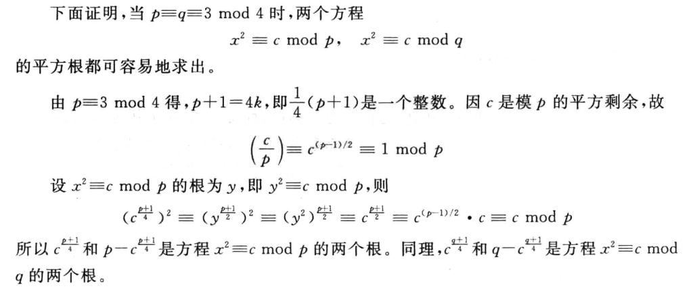

### 孙子定理

当知道二次同余方程的四个根 x1、x2、y1、y2 之后，这个二次同余方程转化为一个一次同余方程组
$$
\begin{cases}
m\equiv x_1\,mod\,p\\
m\equiv x_2\,mod\,p\\
m\equiv y_1\,mod\,q\\
m\equiv y_2\,mod\,q
\end{cases}
$$
我们通过孙子定理对明文 x 进行求解

## 椭圆曲线密码体制

### 椭圆曲线的嵌入和倍点运算

将明文 m 表示为椭圆曲线上的一个点 (m', f(m'))

- m' 为 m 的线性变换，乘以 k 加上 j（一般 k 在 30-50 之间）
- f 为椭圆曲线函数，最后结果要模上模数 p

椭圆曲线表示为
$$
G_{p}(a,b):f(x)=x^3+ax+b\,mod\,p
$$
代数加法（倍点运算）

### Diffie-Hellman 密码交换

a 是大素数的一个本原根
$$
K=Y_B^{X_B}=Y_A^{X_A}=a^{X_AX_B}
$$
其中 Y 为公钥，X 为私钥
$$
Y_B=a^{X_B}\quad Y_A=a^{X_A}
$$
A 加密时，通过 K 进行加密，发送给 B，B 由于知道 YA 和 XB，可以轻易的将明文解出，而其他人将只知道公钥 Y，解出的只能是
$$
a^{X_B}\quad a^{X_A}
$$
而由于离散对数问题很难求解这里的 a 或者是 X

在椭圆曲线上的实现

## ElGamal 密码体制

> 重点，出计算
>
> 离散对数求解困难

### ElGamal 的加密解密

选取大素数 p，随机数 g 和 x，计算
$$
y \equiv g^x\,mod\,p
$$
以 (y,g,p) 作为公钥，x 作为私钥

设明文为 M，选取任一与 p-1 互素的整数 k，加密过程为
$$
C_1=g^k\,mod\,p\quad C_2=y^kM\,mod\,p
$$
解密过程为
$$
M = \frac{C_2}{C_1^x}\,mod\,p
$$
注意分母 C1 有一个小小的 x 次方
$$
\frac{C_2}{C_1^x}=\frac{y^kM}{g^{xk}}=\frac{y^kM}{y^k}=M\,mod\,p
$$
### ElGamal 的椭圆曲线实现

在椭圆曲线上的实现

在椭圆曲线上，倍点运算就相当于指数运算，其反向求解过程即为求解离散对数问题

## 密钥协商和秘密分割

卧槽，被骗了，这章不考，狗逼现代密码学

### 单钥密钥分配

> 基于对称密钥技术的密钥协商，小重点

有 KDC 的单钥密钥分配

建立会话密钥 Ks 的过程，其中 Ka 和 Kb 是 A、B 和 KDC 共享已知的，用以确定各自身份

无中心的密钥分配

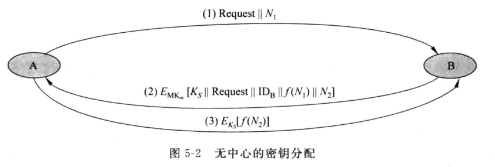

有点像三次握手，只不过 seq 和 ack 变成了随机数 N，这里的 Km 同样是 A、B 已经共享的一个密钥

### 公钥密钥管理

密钥管理方式

- 公开发布：可能存在假冒发布
- 公用目录表：一个管理员管理用户和其公钥的对照表
- 公钥管理机构：机构代办公用目录表
- 公钥证书 CA

#### 第三方管理

公钥管理机构

公钥证书

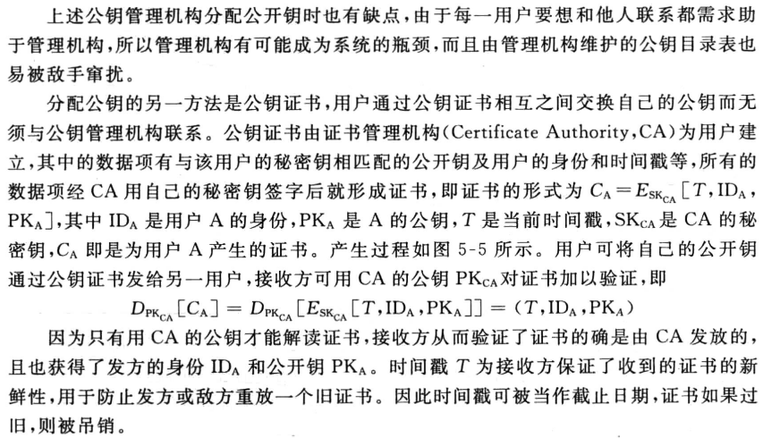

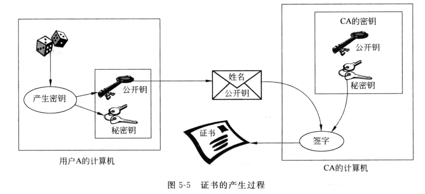

#### 公钥加密分配单钥密码

用公钥加密分配单钥密码体制的密钥：即用公钥传输单钥，用单钥传输数据

简单的使用公钥加密算法建立会话密钥（单钥）

具有保密性和认证性的公钥密钥分配：有点像四次挥手

### DH 密钥交换

> 小重点

DH 密钥交换：椭圆曲线密码体制，基于离散对数问题，只能用于密钥交换，不能用于加密（计算量太大）

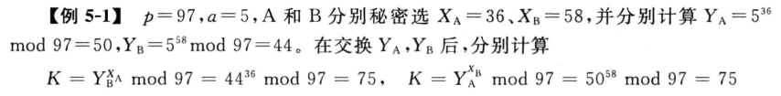

这里涉及随机数的产生 —— 都是伪随机数

### 秘密分割

> 秘密共享，重点，出计算

秘密分割门限方案，例如一个包含 k 个变量的方程组，存在 n 个线性无关的单个方程，每个人掌握一个，只有 k 个方程同时在场才能解出这个包含 k 个变量的方程组，而秘密 s 为解向量的其中一个常量值

Shamir 门限方案：多项式方程组

基于中国剩余定理的门限方案：一次同余方程组，孙子定理求解

## 消息认证码 MAC

根据明文产生一个属于当前明文的特定码，用于认证内容未被修改，根据明文产生认证码，其过程就相当于将明文视作密钥，对某一初始自定义内容进行加密，这里的加密常使用 CBC 模式的 DES 算法和某些公钥算法

- 这和分组加密的思路是一模一样的（区块链）

哈希函数实际上就是对加密算法的封装，可以同时包含多种算法（包含分组加密和公钥加密），使一个较长的输入（明文）输出一个定长的较短码

### CBC 模式 DES 的数据认证算法

> 基于 CBC 模式 DES 算法

消息认证码的实现和作用可以参考用于差错检测的海明码和循环冗余码，都是通过在原数据后冗余一段码用于验证，这段码和数据在传输过程中保持一个整体，若在未知密钥的情况下篡改，将破坏整段数据的完整性，从而验证失败，接收方据此得知数据出了问题

区别在于，循环冗余码采用二进制整除的形式验证其完整性，而消息认证码采用加密算法验证其完整性（当然，码的生成也基于加密算法，不然怎么验证）

消息认证算法：基于 CBC 运行模式的 DES 算法

- CBC，Cipher Block Chain，密码分组链
- DES，Data Encryption Standard，标准加密算法

一毛吊样

这里的 O 在 DES 加密中就是一个个密文分组，经过密钥 K 加密，CBC 模式的每轮密钥不变，采用将上一轮密文和当前轮明文异或再 DES 加密的形式实现扩散性，这样同一明文分组将对应不同密文组

### CFB 模式 DES 的数据认证算法

用 CFB 模式的 DES 算法模拟以 0 为初始向量的 CBC 模式 DES 数据认证算法

## 哈希函数和生日攻击

### 哈希函数性质

哈希函数满足：单向性；无碰撞性

其中性质 6 用于抵御生日攻击

### 生日攻击

第一类生日攻击：找到一个 y 令 h(y) 等于已知的一个哈希值 h(x)，其穷举的长度 k 至少为 n/2（n 为哈希函数所有可能的输入长度）

第二类生日攻击：找到一对输入 x 和 y，满足其哈希值相等，即 h(x) = h(y)，其穷举的长度 k 至少为 √n（n 为哈希函数所有可能的输入长度）

### 常见哈希函数

MD5 杂凑算法：缓冲器中，数据小端存储，产生认证码 128 位（4 个 32 位寄存器构成缓冲）

安全杂凑算法 SHA：缓冲器中，数据大端存储，产生认证码 160 位（5 个 32 位寄存器构成缓冲）

HMAC：使用哈希函数产生 MAC（Message Authentication Code，消息认证码）

## 消息认证 VS. 数字签名

### 消息认证的缺陷

对于消息认证机制，其加密方式是发方、收方共有的，不管是用的分组密码还是公钥密码对明文进行加密产生认证码，生成方式都是共有的，也就是说，**任意一个收方 B，都可以伪装成 A 向外发送消息**，其他的收方 C 也根据同一个加密方式处理收到的明文并认证，认为这条消息为 A 所发

显然，此时 C 不知道收方 B 假冒了发方 A 发送了消息

相互的，当 A 发出了负面消息，可以以加密方式泄露的借口将锅丢给某个收方 B 的身上或是某个不存在的收方 D 身上

究其原因，就是这里的**认证机制仅仅只依赖于加密这一过程**，将收到的明文**单方向的加密**，再和与明文一起收到的认证码进行比对，完成认证

实际上，消息认证执行的是：发方加密，收方加密的认证方式

这也是为什么哈希函数被设计为单向性的原因（只涉及到加密，而不涉及解密）

### 数字签名

不同于消息认证，数字签名将整个明文加密，将这个加密的完整密文 E(M) 发送给收方，收方解密获取明文，你会发现这就是第二、三章的具体应用过程（包含加密和解密）

过程对比

- 数字签名：加密明文、传输密文、解密密文、比对明文
- 消息认证：加密明文、传输明文和密文、二次加密明文、比对密文

注意下图中的阴影框框并不是代表整个明文信息，而是表示签名，在真正传输的时候，和消息认证码类似，也是将 E(M) 链在 M 后进行发送

显然，数字签名执行的是：发方加密，收方解密的认证方式

只要解密成功，就能确认该消息由 A 所发（因为用的他的密钥），而收方 B 并不可以根据他所已知的信息假冒 A 对外发送消息，于是避免了收方假冒发方的情况

同时可以以**仲裁方式**确认消息被 A 发送过，即 A 要发送给 B，私钥加密后，先发给第三方 D，D 对这条消息进行确认，加入某些信息，再传给 B，这样 A 就无法否认他发过这条消息，也无法以私钥泄露进行甩锅

与之对应的直接方式存在 A 甩锅的风险

## 数字签名标准

### DSS 方式

不同于 RSA 的签名，其包括密钥生成、签名、认证三个完整阶段

上述 DSS 过程中

- H 为哈希函数，进行加密的对象其实是明文 M 的哈希值，这么做的原因很简单，为了缩小规模和规范化加密输入
- PK(G) 是发方和收方共有一个单钥，SK(A) 是发方的私钥，PK(A) 是发方的公钥，k 为加密的随机数，共同加密 H(M)，即 Sig 过程
- s 和 r 分别为单钥 PK(G) 的密文和公钥 SK(A)/PK(A) 的密文，共同参与解密
- 最后，收方根据收到的明文产生哈希值 H(M)，和对签名（密文）的解密内容进行比对，确认签名的正确性

### 数字签名算法 DSA

在 DSS 中，使用的公钥算法是 DSA 算法，基于 ElGamal 和 Schnorr 两个签名方案设计，其安全性基于求离散对数的困难性

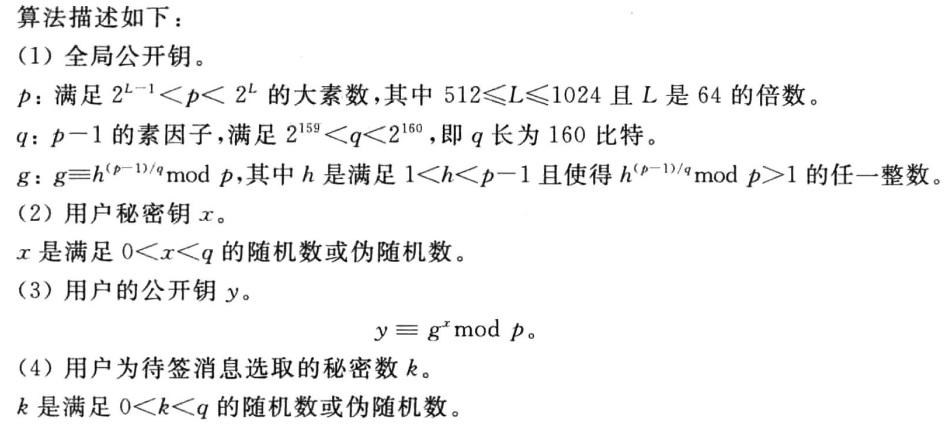

为了更好理解，贴一个程序框图

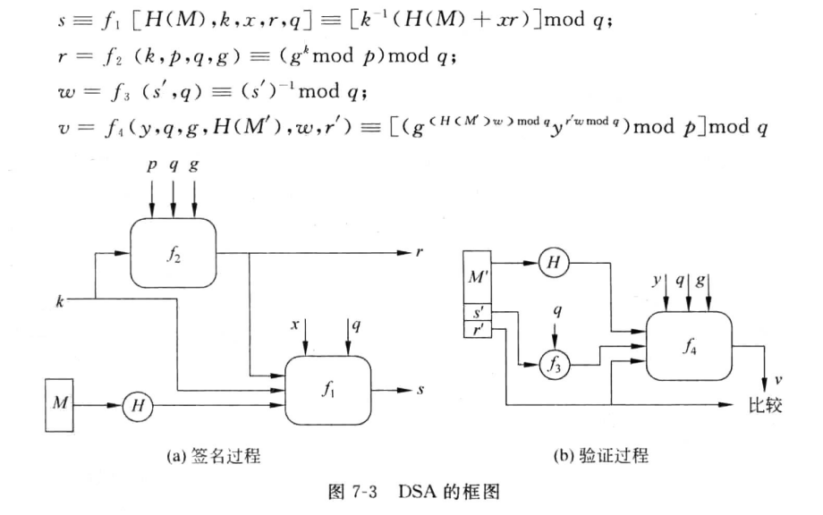

## 常见签名体制

### RSA 签名体制

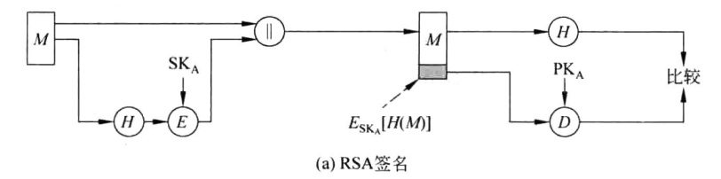

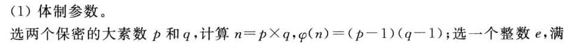

### ElGamal 签名体制

> 小重点，基于离散对数

算法描述及一个栗子

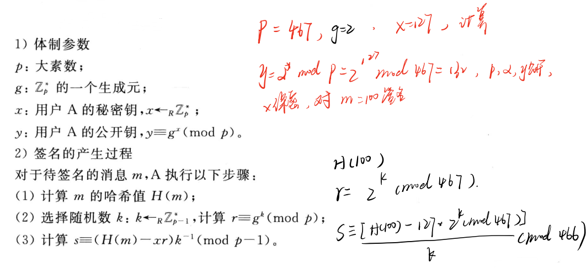

还真是

### Schnorr 签名体制

看一看就行，算法描述如下

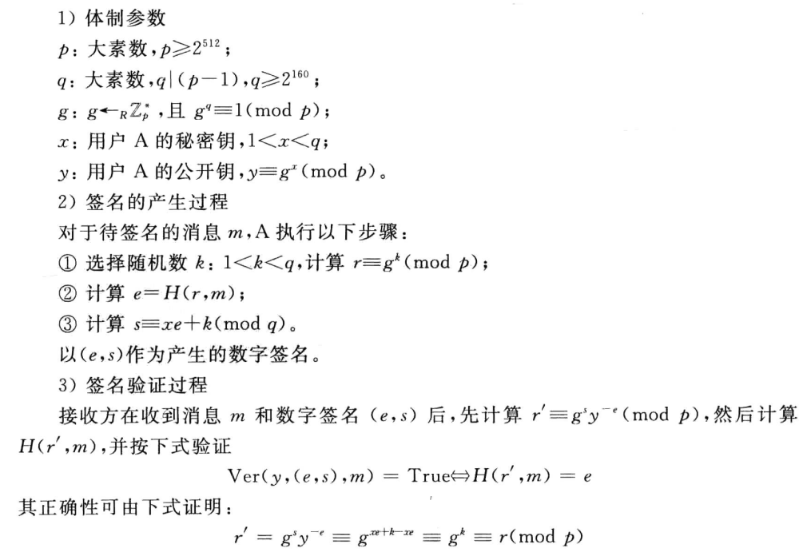

### 安全密码协议

- 基本协议
- 零知识证明
- 安全多方计算协议
