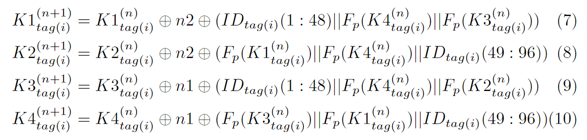
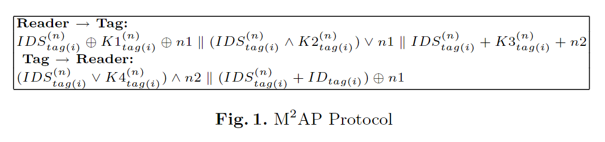
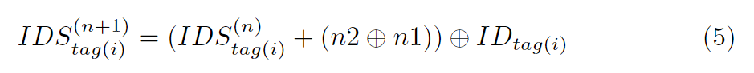
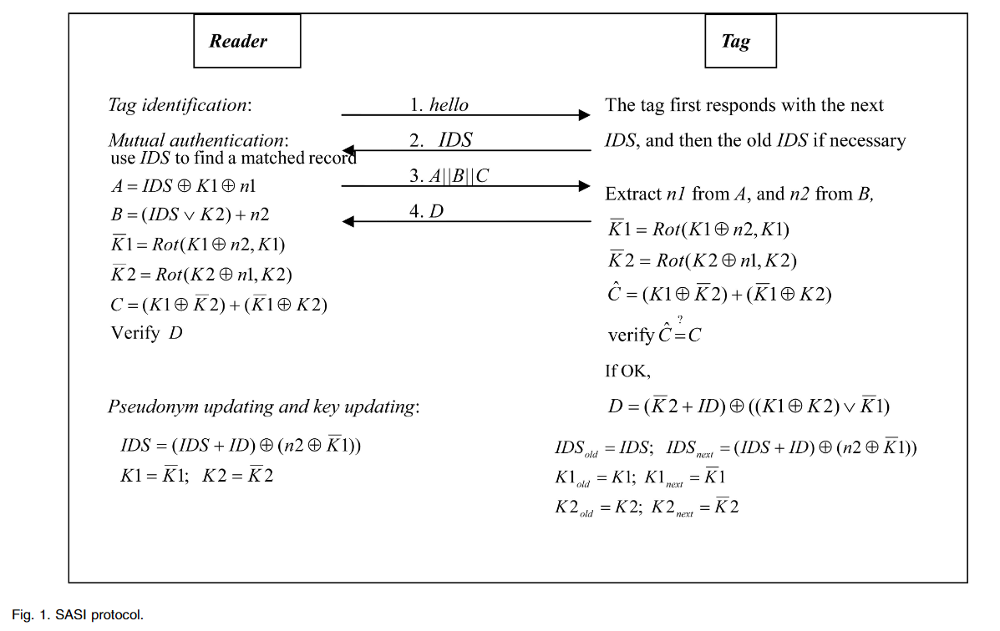

基本名词

- CIA：Confidentiality（数据机密性）；Integrity（完整性）；Availability（有效性）
- 密码学三大顶会：Crypto；EUROCRYPT（欧密会）；ASIACRYPT（亚密会）
- 信息安全四大顶会：ACM CCS；NDSS；IEEE S&P；USENIX Security

RFID 认证使用的都是交互式的协议，一般采用挑战-响应的工作模式，比如任何一个交互式的签名方案

## RFID 概述

> 射频识别，Radio Frequency Identification

### 简介

下图为 RFID 系统的一般结构，由标签、读头、应用系统组成

说白了，就是一个表单验证，只不过提交的方式不一样，不像 Web 程序通过 HTTP/Post 请求去打，而是通过电磁波进行数据交换

一些应用

- 商场用的防盗的牌，过安检门他会触发警报（独位的检测）
- 二代身份证
- 一卡通（NFC 是 RFID 的子集）

那么和所有的登录验证一样，在传输过程存在一定的安全问题（需要加密传输），并且认证中存在一定的算力限制，因为标签存储的数据量是有限的，密文不能过长、计算量不能过大

类比常见的 Web 协议，如果把 RFID 视作一个 HTTP 的表单提交（他自身是一个很轻量的协议，半双工、不具备安全性、没有状态维护等等），我们的工作大概就是需要在其上再套一层用于实现安全性的协议，如同把 SSL、TSL 套在 HTTP 上（这种类比似乎适用于所有的认证场景）

对于 RFID 而言，主要区别在于硬件资源严重受限，通常标签的存储空间在几字节到几千字节不等，故采用的加密算法和协议仅限于低成本实现，其一系列安全协议并被划分为：完备、简单、轻量级和超级轻量级四类。其中前两类（即完备和简单）协议主要针对有源 RFID 系统，而后两类（即轻量级和超轻量级）则主要针对无源 RFID 系统

- 完备协议
  - 非对称加密：ECC 为主流，较于 RSA 更加轻量
  - 对称加密：AES、XTEA
- 简单协议：轻量化的密码算法并且基于单向散列函数，最明显的特征是此类安全认证协议研究的重点是双向认证
- 轻量协议：主要包括循环冗余校验（Cyclic Redundancy Check, CRC）和随机数生成器（Random Number Generator，RNG）等
- 超轻量协议：如 LAMP、HB 协议族，多为按位运算

师姐建议我的研究重点放在较为重量的协议上

### RFID 安全协议量级分类

在 RFID 系统中，需要去轻量所有设备和协议，包括

1. 标签上的非易失性 RAM
2. 标签上的 ROM（代码和数据）
3. 标签计算
4. 阅读器-标签交互中的消息和轮数
5. 阅读器-标签交互中的消息大小
6. 服务器实时计算
7. 服务器存储

其中，由于前三种直接影响标签的成本，相较于其他更为重要，根据认证协议的复杂度（包括存储和计算开销），通常将 RFID 安全认证协议分为以下四种

| 计算量级   | 搭载加密算法                                  |
| ---------- | --------------------------------------------- |
| 超轻量算法 | XOR、AND、OR 等                               |
| 轻量级算法 | RNG、CRC                                      |
| 中量级算法 | one-way hash function、pseudo-random function |
| 重量级算法 | RSA、ElGamal、ECC                             |

### 针对 RFID 系统的攻击

假冒和欺骗攻击

- 攻击者通过截获合法读写器与电子标签的访问 消息（或者直接攻击物理电子标签），来获得标签的身份信息并对其进行克隆。利用这些非法的克隆标签，攻击者可以伪装成合法的标签访问 RFID 系统
- 类似的， 攻击者同样可以通过窃听等手段获取合法读写器的隐私信息，从而伪装成合法的 读写器进入 RFID 系统

位置与跟踪攻击：RFID 标签的设计要求规定，电子标签在工作状态下必须要对读写器的访问做 出响应，通过从不同的位置发送查询命令并从标签获得对应的响应，便可确定目标电子标签当前所处的位置（RFID 系统中标签的通信范围有限）。如果不采取有效的安全措施，攻击者同样可以通过上述方法对合法电子标签进行非法跟踪和定位

密码破译攻击：为了保证数据与通信安全，RFID 系统中通常采用加密技术来保证传递信息的 机密性和完整性，因此针对加密算法的攻击是安全系统最常见的攻击方式之一

拒绝服务（DoS）攻击：在 RFID 系统中，攻击者通过 阻断读写器读取标签信息的方式发动 DoS 攻击

## 超轻量级协议

### UMAP 协议族

> Ultralightweight Mutual Authentication Protocol，由 Lopez 等人提出，包括 MMAP（Minimalist Mutual Authentication Protocol）、LMAP（Lightweight Mutual Authentication Protocol）和 EMAP（Efficient Mutual Authentication Protocol）三个协议

基于极简密码学（minimalist cryptography）的思想，作者认为能通过此提升低成本 RFID 的安全性

#### LMAP

> LMAP: A real lightweight mutual authentication protocol

HB 协议在 05 年提出，而这篇论文在 06 年，并且在第一种绪论中有提到 HB 协议族：这种最具有前途的协议 (HB, HB+) 的安全性与噪声问题 (LNP) 的学习奇偶校验有关，但其在随机实例上的困难性仍然是一个悬而未决的问题

在 LMAP 协议中，标签将维护一个长度为 96 位的 IDS 和一个长度为 96 位的密钥 K，K 被均分为 4 份（K1、K2、K3、K4）。为了 IDS 和 K 的更新（新旧各一份），共需 384 位的空间。此外，每个标签还需要 96 位的空间去存储它的静态标识符 ID，故标签所需存储空间为 480bit

高成本的计算，如随机数的生成将在读写器端执行；对应的，标签端仅有按位异或、逐位或、逐位并、有限模加法这样简单的操作

通过 IDS 的限制，只有拥有权限的 Reader 才能够访问标签的密钥 K，认证过程

- 标签识别：读写器向标签 say hello，而后标签将其 IDS 发给读写器，若读写器合法，才可获得标签的密钥 K，这是一次认证（标签认证读写器）
- 双向认证
  1. 读写器生成随机数 n1、n2，结合 IDS 和密钥 K 计算密文 A、B、C 并发送给标签
  2. 标签接收密文 A、B、C，通过 IDS 和 K 解出随机数 n1、n2，最后通过 n1、n2 计算密文 D 发送回读写器
- 最后由读写器判断 D 是否能解出标签的静态标识符 ID 来认证响应，是为第二次认证（读写器认证标签），由于 n1、n2 和 IDS 的混淆，标签的静态标识符 ID 是被安全传输的

显然这是一个基于对称密钥的双向认证协议，通过 IDS 对密钥进行混淆，使用相同的密钥 K 和明文 n1、n2 进行多种加解密，在加解密的过程中实现认证（通过解出的明文是否相同来判断），其中 + 为模 2^m 的加法运算

有一个疑问是，最后 Reader 如何通过 D 来进行认证？实际上，这里除了阅读器和标签，还有一个应用系统，阅读器可以通过合法的 IDS 查询到标签的 K 和 ID，即对于阅读器而言，ID 是已知的，于是在 D 中可以通过 IDS、n1、n2 解出对应的 ID 并和已知的 ID 进行比对，完成认证。在后面的 EMAP 和 MMAP 中最后一步 ID 的认证也都如此

在双向认证成功后，标签对应的 IDS 和密钥 K 将进行更新（这可以有效防止中间人攻击），更新策略如下（通过每次的随机明文 n1、n2 以及标签的静态标识符 ID 进行更新）

至此完成一次完整的认证，这是一个提交 → 明文加密 → 密文解密（标签一次认证）、重新加密 → 解密（读写器二次认证）的认证过程

#### EMAP

> EMAP: An Efficient Mutual-Authentication Protocol for Low-Cost RFID Tags

和 LMAP 的认证过程基本一样，一个 96 位的 IDS 和一个被分为四份的 96 位的密钥 K，进行如下认证

可以看到，这个认证过程和 LMAP 是基本一致的，区别在于

- 密文的计算方法不一样，在 EMAP 协议中并没有采用模 2^m 加法
- 标签的响应分成两部分 D 和 E，其中
  - D 用于认证，读写器通过判断是否能从 D 中解出期望的 n2 来认证响应是否合法
  - E 用于传递标签的静态标识符 ID，通过 IDS、n1、n2 以及 K 的混淆实现安全传输

认证成功后，IDS 的更新策略如下

密钥更新的策略如下

其中 Fp 是一个奇偶校验函数，KI 为 96 位，奇/偶数位 48 位
$$
F_p(K3^{n}_{tag(i)}||F_p(K1^{n}_{tag(i)}||ID_{tag(i)}(49:96))
$$
三个数以某种规则拼接为一个 96 位的数

引用自：T. Dimitriou. A lightweight RFID protocol to protect against traceability and cloning attacks. In Proc. of SECURECOMM'05, 2005.

#### MMAP

> M^2AP: A Minimalist Mutual-Authentication Protocol for Low-Cost RFID Tags

认证过程与 EMAP 类似，读写器发送给标签 A、B、C，标签响应 D、E

IDS 更新

密钥更新

### SASI 协议

> SASI: A New Ultralightweight RFID Authentication Protocol Providing Strong Authentication and Strong Integrity

认证过程，和 UMAP 协议族一样，合法的读写器将可以通过标签的 IDS 从可信系统 V 中获取该标签的密钥 K 和静态标识符 ID

与 UMAP 一个明显的差异是

- 这里引入了 Rot 运算，对密钥 K1、K2 旋转进行加密和密钥更新
- 这里用到两个密钥 K1 和 K2，均为 96 位，并且为了抵抗可能的去同步攻击，对于 IDS、K1、K2 均需要存储新旧两份，故标签的容量为 96 x 3 x 2 + 96 = 672 位

SASI 和 UMAP 协议族的对比

基于置换的两类安全认证协议，可抵抗去同步攻击，前文的 UMAPs 和 SASI 无法抵抗

- RCIA：RobustConfiden-tiality,Integrity,and Authentication
- RRAP：Reconstructionbased RFID Authentication Protocol

什么是去同步攻击？

### HB 协议族

> Secure human identification protocols
>
> HB 协议族最初由 **Hopper** 和 **Blum** 在 2004 年提出，用于在低计算资源的设备（如 RFID 标签）中实现安全的身份认证。HB 协议族以其高效和简单的设计而闻名，适合在对计算和存储资源有限的环境中使用

#### LPN 问题

> LPN（Learning Parity with Noise），噪声环境下的学习校验，基于格的加密

LPN 的向量元素均为二进制，即 LPN 系统是为模 2 的，其轻量性来源于此

形式化描述

- 设有秘密向量 s，和一组长度为 n 的随机生成的向量 ai
- 我们计算 s · ai（s 和 ai 的内积），并且在计算结果上加入某种噪声 ei，其中 ei 是一个服从某个噪声分布（常为伯努利分布）（通常以微小概率为 1）的随机变量

基于此，我们可以获得一些观测值
$$
y_i=a_i\cdot s+e_i
$$
其中 yi 是一个比特值，当执行 n 轮后，一组观测值蕴含的噪声将符合某种概率分布，而破解的目标是通过这些观测值 yi，恢复出秘密向量 s

#### HB+ 协议

> Authenticating Pervasive Devices with Human Protocols

以 HB+ 协议为例，其采用**提交-挑战-响应-认证**的双密钥结构应用 LPN 问题，其流程大致如下

1. 初始化：认证双方共享两个密钥 X 和 Y（长为 k 的向量）
2. 提交：标签发送随机向量 b 给读写器
3. 挑战：读写器发送随机向量 a 给标签
4. 认证：标签根据概率模型生成独位的噪声 r
   - 标签计算`z = ax+by+r`，并将 z 发回读写器
   - 读写器通过解出`r = ax+by+z`（这样的认证将进行 k 轮），最后对 k 长的噪声 R 进行检验，以判断标签是否合法

显然这是一个读写器对标签的单向认证，标签并不具备识别合法读写器的能力（而且，这里标签需要具有生成随机向量的算力，资源是否有限要画个问号）

#### GRS 攻击

> An Active Attack Against HB+: A Provably Secure Lightweight Authentication Protocol

LPN 问题被证明是抗量子的，其主要的被攻击方式是中间人攻击

因为单边认证在大多数 HB 协议族中执行（如 HB+）。标签阅读器通信总是被认为是安全的，只有 RFID 标签模拟的可能性。然而，物联网需要相互认证。使用两个独立的认证协议会导致中继攻击、重放攻击、非同步攻击、会话劫持等的风险更高

GRS（一种针对 RFID 系统的中间人攻击）攻击的步骤：

1. 被动监听：攻击者被动监听标签和读写器之间的认证交互，收集多个挑战向量`a`和响应值`z`
2. 主动篡改挑战向量：攻击者修改某些挑战向量，并监听相应的响应
3. 噪声消除：利用收集到的数据，攻击者通过统计分析的方式，逐步消除噪声`r`的影响，恢复出密钥`x`

常见的抵抗中间人攻击的方式是基于 HB 协议实现双向认证，这样可以很大程度避免中间人攻击，同时采用距离边界协议

#### 双向认证

> An Ultra-Lightweight Mutual Authentication Protocol Based on LPN Problem with Distance Fraud Resistant

一篇三区的论文，21 年提出的一个基于 HB 协议族、LPN 问题的一个双向认证方案，结合 DB 协议（距离边界协议）工作，以抗 GRS 攻击

- 对称密钥体系，共享密钥矩阵 X
- 其双向认证过程很像 TCP 三次握手，响应的同时挑战

这是一个发起挑战 → 明文加密、发起挑战 → 解密密文（读写器一次认证）、明文加密 → 解密密文（标签二次认证）的认证过程

## 轻量级协议

> 多数轻量级安全认证协议是为了满足 ISO/IEC18000(EPC C1Gen2) 标准而提出的，EPC C1G2 (Class-1 Gen-2) 类型安全认证协议多使用符合相关标准的简单加密手段，主要包括循环冗余校验（Cyclic Redundancy Check, CRC）和随机数生成器（Random Number Generator，RNG）等

现存的较为经典的轻量级 RFID 安全协议主要包括 Juels 提出的首个适用于  EPC C1Gen2 的安全协议 [1]，Duc 等人提出的基于 CRC 和 PRNG 的安全协议 [2] ，Chien 等人的 CC 协议 [3] 以及其相应的改进协议 [4-6] 等

- [1] A. Juels. Strengthening EPC tags against cloning[C]. Proceedings of the 4th ACM workshop on Wireless security, 2005, 67-76
- [2] D. DUC. Enhancing security of EPCglobal gen-2 RFID tag against traceability and cloning[J]. SCIS, IEICE 2006, 2006:
- [3] H.-Y. Chien, C.-H. Chen. Mutual authentication protocol for RFID conforming to EPC Class 1 Generation 2 standards[J]. Computer Standards & Interfaces, 2007, 29, (2): 254-259
- [4] N.-W. Lo, K.-H. Yeh. An efficient mutual authentication scheme for EPCglobal class-1 generation-2 RFID system[C]. International Conference on Embedded and Ubiquitous Computing, 2007, 43-56
- [5] P. Peris-Lopez, J. C. Hernandez-Castro, J. M. Estevez-Tapiador, et al. Cryptanalysis of a novel authentication protocol conforming to EPC-C1G2 standard[J]. Computer Standards & Interfaces, 2009, 31, (2): 372-380
- [6] T.-C. Yeh, Y.-J. Wang, T.-C. Kuo, et al. Securing RFID systems conforming to EPC Class 1 Generation 2 standard[J]. Expert Systems with Applications, 2010, 37, (12): 7678-7683

### EPC C1Gen2 标准

> Strengthening EPC tags against cloning

EPC，Electronic Product Code，一种 RFID 设备（RFID 技术的一种应用产品），专注于产品的唯一识别和追踪，最早的轻量协议用于在这种设备中

EPCGlobal Class1 Genration2 UHF 标准（简称 C1Gen2 或 EPCglobal）是 EPC 体系中的第二代无线射频识别（RFID）标准，用于管理和识别物品的全球统一标识。该标准由 GS1 和 EPC global 组织发布，广泛应用于供应链、仓储、物流和零售等领域。它定义了超高频（UHF）RFID 标签和读写器之间的通信协议，旨在提高物品跟踪和识别的效率和准确性

他具有以下特征

- Gen-2 RFID 标签是被动的，这意味着它接收来自阅读器的电源
- Gen-2 RFID 标签与 UHF 频段（800-960 MHz）中的RFID阅读器通信，其通信范围可达 2~10m
- Gen-2 RFID 标签支持片上伪随机数生成器（PRNG）和循环冗余码（CRC）计算
- Gen-2 RFID 的隐私保护机制是，一旦标签接收到具有有效 32 位杀伤 PIN 的杀伤命令（例如，可以在销售点处杀死标签），使标签永久不可用
- 仅允许在安全模式下读取/写入 Gen-2 RFID 标签的内存（即在接收到具有有效 32 位访问 PIN 的访问命令后）

但注意，读者无法单独判断标签是否合法，他通常查询标识符是否在系统中来进行判断（和超轻量协议**所谓**的双向认证一样），如下展示了一个简单的认证

他存在这样的问题，读者作为一个简单的设备，没有严格的时序划分，那么我一直给他发 1，读者就会认为当前标签一直合法，从而失去正确性的判断

于是有修正的一版协议

在 BasicTagAuth 协议中引入了伪造的 PIN 码（spurious PINs）去测试标签（钓鱼），读者将发送一组 PIN 码给标签，其中只有下标为 j 的为其对应合法的 PIN 码，标签合法当且仅当对 P[j] 响应 1 而其余均响应 0

- 也就是说，如果标签对不属于他的 PIN 码响应了 1，说明这 b 在乱答
- 这增强了读写器对标签的认证，在一定程度上抵抗克隆攻击

文中还提到了一种加强的认证，将 32 位的 PIN 码二分为 16 位的 A 和 K，分两步进行认证

由于读写器并不总是可信（中间人攻击），作者引入第三方可信系统 V 存储 PIN 码，读写器 R 仅作为传输者，剩余部分与 BasicTagAuth 的思路基本保持一致

- 没有安全的身份验证导致向**恶意读者**透露 EPC，称为略读攻击（skimming attack）

并且由于 V 的引入，它可以同时检测 R 的合法性，由于 T 由 R 发送给 V，V 可以对判断其是否具备对 T 的访问权限，从而决定后续的认证

- 通过上述协议，还提出了一种分布式的 RFID 认证方案，叫做 Fulfillment-Conditional PIN Distribution (FCPD)，即令可信中心 V 作为结点，读写器 R 作为分布设备向其请求服务，从而对 T 进行认证

但需要注意的是，这样的方案没有考虑窃听和隐私问题，因此没有对隐私入侵和秘密信息泄漏的保护

### PRNG 和 CRC

> Enhancing security of EPCglobal gen-2 RFID tag against traceability and cloning

EPCGlobal Class-1 Gen-2 标准的 RFID 标签仅支持简单的密码原语，本文基于伪随机数生成器（Pseudo-random Number Generator）、循环冗余代码 （cyclic redundancy check）以及伪名提出一种安全抗克隆和防止滥用标签的协议

本文作者认为，读者将永远不应该被完全信任，在 RFID 系统中唯一受信任的应是后端服务器，所有秘密只保存在标签和后端服务器的数据库中，同时读写器应通过标签的 meta-ID 获取更多信息

- 类似于 UMAPs 协议族中的 IDS（读写器通过 IDS 查询对应标签的 K 和 ID）

好处如下

- 问责和访问控制：该方法可以轻松问责和访问控制，因为后端服务器负责查找对象信息，因此它可以决定谁可以获得哪些信息以及一些统计数据（例如，查询了多少次对象）
- 读者到标签身份验证：很明显标签查询将发生的最频繁。由于读者需要接触后端服务器来学习有关对象的有用信息，因此在这种情况下不需要对读者的身份进行验证。我们可以在发送 meta-ID 之前要求后端服务器对读者进行身份验证

在安全协议中，一个变量通常要满足

- 一个值不应该再使用两次
- 一个值不应该是可预测的

在本文中，首先考虑保护标签和阅读器之间传输的数据，以防止窃听。显而易见的方法是利用加密/解密和我们知道的最简单的加密函数，异或，这在流密码中被广泛使用。这个问题现在变成了密钥管理问题：即确保每个会话都使用新的加密密钥

采用伪随机数生成器来实现密钥的更新，除却首轮的 seed 外，之后的每轮密钥均基于上一轮会话密钥生成新的伪随机数密钥

这个更新需要同步在标签和服务器之间，所有的通信认证将基于同步的会话密钥

接下来的问题是解决身份认证，之前也提到，读者并不是可信单位，他只能作为传输者接收加密形式的 EPC，这是需要明确的（按照作者的意思，EPC 即前文提到过的 meta-ID）

认证将分为三个子协议进行

1. Tag querying protocol
2. Tag access protocol
3. Key updating protocol

Tag querying protocol：标签查询协议如下图所示

执行过程如下

1. 首先由读者发起，向标签发送查询请求，并携带一个随机数 r'
2. 标签收到请求后，将自身的标识码 EPC 与 r 和 r' 进行异或（不够的位用 1 填充），而后进行 CRC 编码并与会话密钥 Ki 异或得到密文 M1，将 M1 连同 r 发给读者（r 为标签生成的随机数）
3. 再由读者和服务器之间进行双向认证
   - 读者将密文 M1、读者生成的随机数 r' 和标签生成的随机数 r 一同发给服务器
   - 服务器接收后，利用共享的会话密钥 Ki 与密文 M1 异或解出 CRC 编码 M1'，而后自己根据该标签的 EPC 和随机数 r、r' 计算正确的 CRC 码，最后进行验证并返回给读者相应反馈 info

Tag access protocol：由于读者不可信，info 也需要加密传输，这一步实现标签对服务器的验证，即对 PIN 码的认证，加解密过程如下

1. S → R: M2 = CRC(1 || EPC || PIN || r) ⊕ Ki
2. R → T: forward authentication token M2 to T
3. T: Verify M2 ⊕ Ki = CRC(1||EPC || PIN || r) ?

其实就是把第一步协议里读者生成的随机数 r' 替换为了 PIN

Key updating protocol：认证一轮后，标签和服务器将进行密钥更新，更新的指令由读写器下达（f 为伪随机数生成函数）

1. R → T, S: 'End Session'
2. T: Ki+1 = f(Ki)
3. S: Ki+1 = f(Ki)

该协议与上一小节中 Juels 的协议的对比（其实 Juels 根本就没考虑加密传输的问题，仅仅是提出一个模型）

### CC 协议

> Mutual authentication protocol for RFID conforming to EPC Class 1 Generation 2 standards

文中先分析了两种前人的协议，首先是 Karthikeyan–Nesterenko's scheme

- S. Karthikeyan, M. Nesterenko, RFID security without extensive cryptography, Proceedings of the 3rd ACM Workshop on Security of Ad Hoc and Sensor Networks, 2005, pp. 63–67.

该方案不足之处在于：该方案不能抵抗以下拒绝服务攻击（DOS，Denial of Services attack）、重放攻击和个人跟踪，例如

1. 标签在更新密钥时不会验证接收到的值 Z。因此，攻击者可以用旧的 Z' 或任何随机值 Z* 替换传输的 Z，而不会注意到

2. 在接收到有效的 Y 和假 Z* 后，标签将成功验证 Y，然后将密钥更新为
   $$
   K^* = Z^*M_2^{-1}
   $$
   因此，合法阅读器和标签不能再相互验证，因为密钥被错误更新，DOS 攻击成功了

3. 如果攻击者在上述攻击中将 Z 替换为旧的 Z~（假设 Y~ 和 Z~ 之前在第 i 个合法会话中发送），那么攻击者可以在下一个会话中重放 Y~ 以欺骗标签错误接受请求并相应地访问标签。他甚至可以从多个会话中记录传输的数据，然后多次发起上述攻击，这将允许攻击者跟踪标签（无限访问标签），违反了匿名属性

什么是匿名属性？在这指标签 ID 不能被人为标记，与某个矩阵 Z~ 相关联

- 通常指的是系统或协议中参与者的身份信息受到保护，无法通过常规手段**追踪或关联**至特定用户。这样的属性在隐私保护和匿名通信中尤为重要，尤其是在身份认证和数据访问的场景中

而后分析了 Duc et al.'s scheme，即上一小节的方案

其不足之处在于不能抵抗针对标签和读者的拒绝服务攻击，无法检测标签的伪装，不能提供前向保密

什么是前向保密？即获取当前会话密钥后，能够还原之前的会话密钥

- Forward Secrecy，FS，是指在安全通信协议中，即使加密系统的长期密钥被泄露，也无法解密过去的会话数据。这一特性旨在增强数据的安全性，防止攻击者在获取密钥后利用其解密先前的加密通信内容

最后提出本文建议的协议，即 CC 协议

与一些同类型协议的比较

## 中量级协议

> 中量级安全认证协议相较于前 2 种量级的安全认证协议，由于采用了部分经过轻量化的密码算法且基于单向散列函数，安全性要高于前两种协议的，双向认证是此类安全认证协议研究的最明显的特征

比较经典的安全认证协议包括基于单向散列函数的 Hash-Lock 协议、改进的随机 Hash-Lock 协议、Hash 链协议、David 数字图书馆协议 [1-4] 和抗追踪攻击的 YA-TRAP 协议 [5] 等

- [1] Sarma S E,Weis S A,Engels D W. RFID systems and security and privacy implications[C]∥Proc of International Workshopon Cryptographic Hardware and Embedded Systems,2002:454-469
- [2] Weis S A,Sarma S E,Rivest R L,et al. Security and privacy aspects of low-cost radio frequency identification systems[C]∥Proc of the 1st International Conference on Security in Pervasive Computing,2004:201-212.
- [3] Ohkubo M, Suzuki K, Kinoshita S.Hash-chain based forward-secure privacy protection scheme for lowcost RFID[C]∥Proc of 2004 Symposium on Cryptography and Information Security,2004:719-724.
- [4] Molnar D,Wagner D. Privacy and security in library RFID: Issues,practices,and architectures[C]∥Proc of the 11th ACM Conferenceon Computerand Communications Security,2004:210-219.
- [5] G. Tsudik. YA-TRAP: Yet another trivial RFID authentication protocol[C]. Fourth Annual IEEE International Conference on Pervasive Computing and Communications Workshops (PERCOMW'06), 2006, 4 pp.-643

[1-4] 的安全性比较

| 协议 | 可追踪性攻击 | 重放攻击 | 欺骗攻击 | 去同步攻击 | 双向认证 | 密钥更新 |
| ---- | ------------ | -------- | -------- | ---------- | -------- | -------- |
| [1]  | ×            | ×        | ×        | ×          | √        | ×        |
| [2]  | √            | ×        | ×        | ×          | √        | ×        |
| [3]  | √            | √        | √        | √          | ×        | √        |
| [4]  | √            | √        | √        | √          | √        | ×        |

### Hash Lock

#### Hash-Lock

> RFID Systems and Security and Privacy Implications

一种基于哈希函数的简单加密协议，主要用于数据保护和访问控制。它的核心思想是使用哈希值作为一种“锁”，而原始数据的对应信息（如密码或密钥）作为“钥匙”，以便在符合条件时解锁数据

非常简单的协议，首先，系统根据一个随机键生成一个哈希值并写入标签内存，这个哈希值作为这个标签的锁
$$
lock=Hash(key)
$$
在需要进行认证时，读写器将凭证 k 发送给标签，标签计算 Hash(k) 是否等于自身存储的 lock，若相同则认证通过

#### Randomized Hash-Lock

> Security and privacy aspects of low-cost radio frequency identification systems

在简单的 Hash-Lock 中，meta ID 会导致追踪攻击，于是引入额外的随机操作

这是一个双向认证

当收到查询请求后

- 标签生成一个随机数 R，与标签 ID 联结后进行哈希，得到哈希值 H，而后将随机数 R 和 H 一同发给读写器进行认证
- 后端收到 R 和 H 后，将遍历所有的 ID'，将 ID' 和 R 联结并哈希得到 H'，若 H = H'，则说明当前使用的 ID' 为标签的 ID
- 当读写器发送回标签的 ID' 等于标签 ID 时，本次认证通过

这样的联结并不是唯一的办法，文中还提供了这样两种混淆的方案
$$
(r,ID\oplus f_k(r))\quad (r,(ID||h(ID))\oplus f_k(r))
$$
其中 fk 是一个伪随机数函数（PRF，pseudo-random function），根据种子 r 生成 0/1 串，并具有以下特点

- 给定相同的密钥和输入，产生相同的输出
- 对于不同的密钥和输入，输出看起来随机且不可预测

这样的认证实现了双向认证，即只有在数据库中注册过的 ID 才有可能和标签相应的哈希值相匹配，同时服务器传回的 ID 必须和标签本地的 ID 符合，标签才认为是合法的读写器

缺点非常明显

- 首先 ID 应该是一个隐秘的数据，简单的联结并不安全，文中也给出了一些补救，哈希后再去异或以混淆 ID
- 另外，服务器在对传来的哈希值进行匹配时，必须穷举数据库中所有的 ID，将他们一个个与请求的随机数进行哈希并比对，当 ID 数量增多，这样的开销是无法接受的

### Hash Chain

> Cryptography Approach to "Privacy-Friendly" Tags

一个哈希链被定义为
$$
H^n(s)=\underbrace{H(H(...H(s)...))}_n
$$

文中采用哈希链的方式更新密钥 s = H(s)，同时在每轮通过密钥 s 生成相应 a = G(s)

其中 G 和 H 均为哈希函数

后端服务器收到的密文将是
$$
a_i=G(s_i)
$$
对于当前标签，服务器将以键值对的形式存储他的初始密钥 (ID, s1)，于是根据认证轮次服务器可以计算出任意一次标签哈希的密文
$$
a_i'=G(H^i(s_1))
$$
于是服务器将进行如下比较
$$
a_i\mathop{=}^?a_i'
$$
若相等则认证成功，将服务器中的存储标签 ID 发送给标签，若 ID 符合，则标签进行密钥更新

这一方案具备不可分辨性，并且是前向保密的

- 攻击者知道标签的输出 a，无法推知密钥 s
- 攻击者知道当前密钥 s(i)，无法得知之前任意一轮的密钥（基于单向散列函数的特性）

这得益于单向散列函数（H 和 G）的特性

### YA-TRAP 协议

> YA-TRAP: Yet another trivial RFID authentication protocol

利用简单的哈希函数和随机数生成器（PRNG）来实现标签和读写器之间的双向认证。其核心机制是通过哈希值验证标签的合法性，同时通过随机数实现认证会话的唯一性，从而防止重放攻击

本文的模型中，标签被三个变量初始化，分别是 Ki、T0 和 Tmax，其中

- Ki 作为标签的唯一标识，同时作为加密的密钥（为了满足消息认证码 MAC 的要求，在实践中需要 160 位）
- T0 是标签的初始时间戳，他的位大小取决于时间粒度和可被身份认证的次数
- Tmax 是时间戳上限，可用于限定标签的认证次数

同时，每个标签具备一个 PRNG（pseudo-random number generator），即伪随机数生成器

YA-TRAP Protocol 认证步骤

就是一个基于时间戳的消息认证码，Tr 为当前的时间戳，随机数
$$
PRNG_i^j
$$
指的是标签 i 的第 j 轮生成的随机数，第一轮为
$$
PRNG_i(K_i)
$$
即以密钥 Ki 为种子生成的随机数

显然，只有合法的读写器能够从数据库中查询哈希表，天然对 reader 进行了认证。其次，标签每次的响应通过 Ki 对变化的时间戳 Tr 进行加密散列，保证响应安全性和动态性

- 有点像 TOTP（这不就是 TOTP？）

## 重量级协议

> 重量级安全认证协议也被部分文献命名为完备 RFID 安全认证协议，主要分为对称加密算法和非对称加密算法

目前基于非对称算法的 RFID 协议主要采用椭圆曲线密码体制（Elliptic Curve Cryptography, ECC）[1-3] 。与 RSA [4] 密码体制相比，ECC 算法速度更快、体积更小、功耗更低，因此更适合于 RFID 系统

- [1] Y.-P. Liao, C.-M. Hsiao. A secure ECC-based RFID authentication scheme integrated with ID-verifier transfer protocol[J]. Ad Hoc Networks, 2014, 18: 133-146
- [2] C. Jin, C. Xu, X. Zhang, et al. A secure RFID mutual authentication protocol for healthcare environments using elliptic curve cryptography[J]. Journal of medical systems, 2015, 39, (3): 24
- [3] M. S. Farash, O. Nawaz, K. Mahmood, et al. A provably secure RFID authentication protocol based on elliptic curve for healthcare environments[J]. Journal of medical systems, 2016, 40, (7): 165
- [4] Golle P,Jakobsson M,Juels A,et al.Universal re-encryption for mixnets[C]∥Proc of Cryptographers' Track at the RSA Conference,2004:163-178

不同研究人员利用 ECC 为 RFID 认证提供服务，并采用了不同的加密和认证方法。大多数研究表明，只使用一种 ECC 算法的安全认证协议只能提供单向认证，且整个系统容易受到攻击。随着第 2 个 ECC 算法的安全认证协议的加入，双向认证达成，为系统整体提供了更好的安全性。2 个 ECC 安全认证协议耦合的不同导致各个安全认证协议的效率与安全性有差异

虽然 ECC 在计算速度与功耗等方面在非对称密码体制中具有明显的优势，但将其应用于资源受限的 RFID 系统中仍然显得比较勉强。于是安全性稍弱但功耗与计算速度具有明显优势的对称加密算法被引入 RFID 安全协议中，其中典型的方案有 Feldhofer 等人提出的基于 AES（Advance Encryption Standard）的协议 [5] 和 Kaps 提出的基于 XTEA（Extended Tiny Encryption Algorithm） 的协议 [6] 等

- [5] M. Feldhofer, S. Dominikus, J. Wolkerstorfer. Strong authentication for RFID systems using the AES algorithm[C]. International Workshop on Cryptographic Hardware and Embedded Systems, 2004, 357-370
- [6] J.-P. Kaps. Chai-tea, cryptographic hardware implementations of xtea[C]. International Conference on Cryptology in India, 2008, 363-375

回顾一下公钥密码体系

| **特性**          | **RSA**                        | **ElGamal**              | **ECC**                              |
| ----------------- | ------------------------------ | ------------------------ | ------------------------------------ |
| **数学基础**      | 大整数分解问题                 | 离散对数问题             | 椭圆曲线上的离散对数问题             |
| **加密/解密原理** | 指数和模运算                   | 指数和模运算，增加随机性 | 椭圆曲线上的点加法和点乘             |
| **密钥长度**      | 较长                           | 较长                     | 更短，同等安全性下需要的密钥长度更小 |
| **效率**          | 加密慢、解密快（相较 ElGamal） | 加密快、解密慢           | 加密和解密均快，适合低功耗设备       |
| **随机性需求**    | 不需要随机数                   | 需要随机数               | 需要随机数（如签名和加密中的 kkk）   |
| **密文长度**      | 与密钥长度一致                 | 密文长度较长             | 密文较短，更适合资源受限环境         |
| **主要用途**      | 加密、签名、数字证书           | 加密、签名               | 加密、签名、密钥交换、区块链和物联网 |

### 基于 ElGamal

> Universal re-encryption for mixnets

传统的随机公钥密码系统由三个算法组成，CS = (KG, E, D)，分别用于密钥生成、加密和解密，具体而言

- 密钥生成：KG → (PK, SK)
- 加密：E(m, r, PK) → C，其中 E 为加密函数，m 为明文消息，r 是随即参数，PK 为公钥
- 解密：D(SK, C)，需要私钥、密文和解密函数

语义安全：从相应密文中学习明文所有信息是不可行的

重加密即，在不知道明文信息的情况下，对密文 C 进行重新加密，并且不影响后续的解密操作

- Re(C, r, PK) → C'
- D(SK, C') = m

文中提出了一个具有通用重加密的公钥密码系统，可以基于在任何合适的代数群上实现的 ElGamal 密码系统。基本思想很简单：我们将标准 ElGamal 密文附加到身份元素上的第二个密文。通过利用ElGamal的代数同态，我们可以使用第二个密文来改变第一个密文中的加密因子。因此，我们可以在重加密操作中分配公钥的知识。如前所述，这种结构与标准 ElGamal 一样有效

1、密钥生成
$$
(PK, SK)=(y=g^x, x)\quad x\in Z_q
$$
2、加密

选择随机参数 r
$$
r = (k_0,k_1)\in Z_q^2
$$
用公钥 y 加密明文 m
$$
C=[(\alpha_0,\beta_0),(\alpha_1,\beta_1)]=[(my^{k_0}, g^{k_0}),(y^{k_1}, g^{k_1})]
$$
3、解密

检查 α 和 β 的范围，而后计算 m0 和 m1
$$
m_0=\frac{\alpha_0}{\beta_0^x}\quad m_1=\frac{\alpha_1}{\beta_1^x}
$$
若 m1 == 1，则可知明文 m = m0，否则认证失败

4、重加密

选择随即参数 r'
$$
r'=(k_0',k_1')\in Z_q^2
$$
对密文 C 进行重加密
$$
C'=[(\alpha_0',\beta_0'),(\alpha_1',\beta_1')]=[(\alpha_0\alpha^{k_0'},\beta_0\beta_1^{k_0'}),(\alpha_1^{k_1'}, \beta_1^{k_1'})]
$$
显然，重加密后，仍然有
$$
m_1=\frac{\alpha_1'}{\beta_1'^x}=\frac{\alpha_1^{k_1'}}{\beta_1^{k_1'x}}=\frac{y^{k_1k_1'}}{g^{k_1k_1'x}}=1
$$
同时
$$
m_0=\frac{\alpha_0'}{\beta_0'^x}=\frac{\alpha_0^{k_0'}}{\beta_0^{k_0'x}}=\frac{my^{k_0k_0'}}{g^{k_0k_0'x}}=m
$$

### 基于 ECC

Elliptic Curve Cryptography 是一种基于椭圆曲线数学结构的密码学体系

#### Schnorr Protocol

> RFID-tags for anti-counterfeiting

单密钥的 ECC 认证变体

攻击者可以使用 ZT 来跟踪目标标签。换句话说，Tuyls 等人的方案容易受到位置跟踪攻击。此外，攻击者获取特定标签的交换消息 {X, e, y} 和公钥 ZT

#### Okamoto Protocol

> Public-key cryptography for RFID tags

双密钥结构

双密钥增强了安全性，但仍可计算得到公钥 Zt，导致标签可追踪。同时，Batina 等人的方案也存在可扩展性问题和前向保密

#### EC-RAC Protocol

> EC-RAC (ECDLP Based Randomized Access Control): Provably Secure RFID Authentication Protocol

改进的双密钥

由于相应结果可以是特定标签的固定值，因此攻击者可以跟踪标签。此外， Bringer 等人展示了如何跟踪如果攻击者两次拦截相同的标签，并且如果标签被被动窃听三次，则可以冒充标签。同样，他们的协议只考虑标签到读者的身份验证，不包括读者到标签身份验证。这使得标签容易受到恶意查询的影响

- 如果没有双向认证，恶意查询是可行的

#### ECDLP-RK Protocol

> An ECDLP-Based Randomized Key RFID Authentication Protocol

对 EC-RAC 的改进，多引入了一个随机数

在这种方案下，即使攻击者知道 r3 和 xT'P，他们仍然无法获得关于 xT 的任何信息。此外，当随机 r3 时，攻击者也无法跟踪 ZT'。但随着认证添加到更新数据库中，这种动作会随着后台服务器的消耗而增加。在这种情况下，Zhang 等人的方案会导致可扩展性问题。此外，Zhang 等人的方案也缺乏双向认证

#### Liao & Hsiao Scheme

> A secure ECC-based RFID authentication scheme integrated with ID-verifier transfer protocol

## 发展与展望

安全性分析

- **隐私性**：数据加密传输
- **匿名性/抗追踪**：是否引入随机数产生响应
- **欺骗攻击**：通过以往数据伪造标签
- **重放攻击**
- **可扩展性**：服务器密钥搜索开销
- **中间人攻击**：常见于单向认证，包括恶意查询
- **拒绝服务攻击**
- **去同步攻击**：属于DOS攻击的一种，通过使服务器和标签的密钥不同步而让标签拒绝提供服务
- **双向认证**：标签认证读写器，服务器认证标签
- **前向保密**：是否存在密钥更新策略，更新策略是否单向

对在格上的轻量加密，如 LPN 问题、LWE 问题、同态加密等，比较感兴趣

- 与区块链技术的结合，不管是去中心化的思想还是加密方式，都可以借鉴

在轻量加密中，与 PUF 的结合有一定的讨论价值

然后是常见的哈希、ECC 加密、双线性配对等
